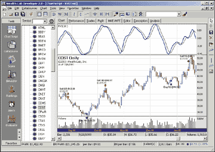
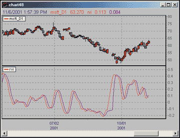
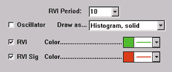
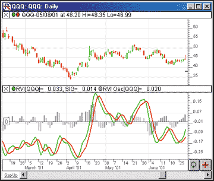
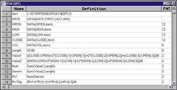
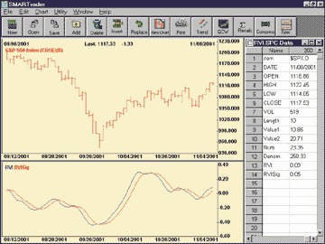

# Traders' Tips: January 2002

- **Article:** Relative Vigor Index (RVI) by John F. Ehlers
- **Traders' Tips URL:** [Traders' Tips, January 2002](https://www.traders.com/Documentation/FEEDbk_docs/2002/01/TradersTips/TradersTips.html)

---

## TradeStation: January 2002

TRADESTATION: RELATIVE VIGOR INDEX

John Ehlers's article "Relative Vigor Index (RVI)" in this issue includes
a version of EasyLanguage code for the indicator. That version includes
hardcoded implementations of a symmetrically weighted moving average in
three places, and also a hardcoded implementation of two summations. We
provide an alternative version below that replaces these hardcoded implementations
with function calls. This version produces identical results, except for
minor initialization differences.

The SWMA, also known as a triangular moving average, can be conveniently
implemented as a double simple moving average, and this code can be separated
out into a function that can than be called from the main body of the code
as many times as necessary. TradeStation includes a TriAverage function,
but the function required here is a little more generalized, so we call
it TriAverage_gen and provide the code for it below, following the main
indicator code. Summation is another built-in function in TradeStation,
and we use that as is.

This code will also be available for download at www.tradestation2000i.com.
Select Support -> EasyLanguage -> Strategies and Indicators -> Traders
Tips, and look for the file "RelativeVigorIndex.ELS."

```easylanguage
Indicator: Relative Vigor Index
 Length( 10 ) ;
 Change( 0 ),
 MyRange( 0 ),
 Num( 0 ),
 Den( 0 ),
 RVI( 0 ),
 RVISig( 0 ) ;
Change = Close - Open ;
MyRange = High - Low ;
Value1 = TriAverage_gen( Change, 4 ) ;
Value2 = TriAverage_gen( MyRange, 4 ) ;
Num = Summation( Value1, Length ) ;
Den = Summation( Value2, Length ) ;
if Den > 0 then
 RVI = Num / Den ;
RVISig = TriAverage_gen( RVI, 4 ) ;
Plot1( RVI, "RVI" ) ;
Plot2( RVISig, "Sig" ) ;
Function: TriAverage_gen
 Price( numericseries ),
 Length( numericsimple ) ;
 Length1( 0 ),
 Length2( 0 ) ;
Length1 = Floor( ( Length + 1 ) * .5 ) ;
Length2 = Ceiling( ( Length + 1 ) * .5 ) ;
TriAverage_gen =
 Average( Average( Price, Length1 ), Length2 ) ;
```

Code: [RVI.els](RVI.els)

*-Ramesh DhingraDirector, EasyLanguage ConsultingTradeStation Technologies, Inc. (formerly Omega Research, Inc.)a wholly owned subsidiary of TradeStation Group, Inc.https://www.TradeStation.com*

---

## Wealth-Lab: January 2002

WEALTH-LAB:
RELATIVE VIGOR INDEX

Wealth-Lab Developer 2.0 contains a native implementation of the relative
vigor index and a finite response filter function that you can use to produce
the RVI signal line as described in John Ehlers's article this issue.

The FIR function is quite flexible and allows you to create a filter
using any desired pattern of coefficients. You pass a string parameter
to the FIR function that describes the coefficients that you want to apply.
The RVI signal line used the values 1,2,2,1, so, in this case, you'd pass
the string "1,2,2,1" to the FIR function.

Here is the Wealth-Lab scripting code (WealthScript) that implements
a simple trading system based on RVI/signal line crossovers. Use this as
the basis for further development and investigation of these interesting
concepts.



**FIGURE 1:** Wealth-Lab, Relative Vigor Index.

```pascal
var RVIPANE, RVISER, RVISIG, BAR: integer;
{ Plot RVI on the Chart }
RVIPane := CreatePane( 100, true, true );
RVISer := RVISeries( 10 );
PlotSeries( RVISer, RVIPane, #Navy, #Thick );
DrawLabel( 'RVI( 20 )', RVIPane );
{ Create Signal Line using Finite Impulse Response Function }
RVISig := FIRSeries( RVISer, '1,2,2,1' );
PlotSeries( RVISig, RVIPane, #Black, #Thin );
{ A Simple 1 Position Trading System Based on RVI/Signal Line }
InstallBreakevenStop( 3 );
for Bar := 15 to BarCount - 1 do
begin
 ApplyAutoStops( Bar );
 if not LastPositionActive then
 begin
  if RVI( Bar - 1, 10 ) < -0.4 then
   if CrossOver( Bar, RVISer, RVISig ) then
    BuyAtMarket( Bar + 1, 'RVI Buy' );
 end
 else
 begin
  if RVI( Bar - 1, 10 ) > 0 then
   if CrossUnder( Bar, RVISer, RVISig ) then
    SellAtMarket( Bar + 1, LastPosition, 'RVI Sell' );
 end;
end;
```

Code: [RVI.pas](RVI.pas)

---

## NeoTicker: January 2002

NEOTICKER: RELATIVE VIGOR INDEXTo calculate the relative vigor index using NeoTicker, create two functions
to calculate the numerator and denominator: functions based on the four-bar
weighted single moving average (SMA) of buying power (BP) and selling power
(SP), as described in John Ehlers's article in this issue. Then create
the indicator called RVI, with two plots and a user-customizable number
of periods (Listing 1).

LISTING 1

The RVI indicator is an oscillator with two plots (Figure 4), which
shows Rvi and the smoothed Rvi .

A version of this NeoTicker RVI script is available for download at
our website. Since NeoTicker EOD 2.3 does not support multiple plots, if
you are interested in using the RVI with NeoTicker EOD, you can download
the EOD version of RVI from our website.



**FIGURE 2:** NeoTicker, Relative Vigor Index.

```text
function Value1 ( ByVal p1 )
 Value1 = ((Data1.Close (p1) - Data1.Open (p1)) + _
  2 * (Data1.Close(p1+1) - Data1.Open (p1+1)) + _
  2 * (Data1.Close(p1+2) - Data1.Open (p1+2)) + _
  (Data1.Close(p1+3) - Data1.Open (p1+3)))/6
end function
function Value2 ( ByVal p2 )
 Value2 = ((Data1.High (p2) - Data1.Low (p2)) + _
  2 * (Data1.High (p2+1) - Data1.Low (p2+1)) + _
  2 * (Data1.High (p2+2) - Data1.Low (p2+2)) + _
   (Data1.High (p2+3) - Data1.Low (p2+3)))/6
end function
function rvi()
 dim Num, Denom
 dim i
 if Data1.Valid (0) = false then
  Itself.SuccessEx[1] = false
  Itself.SuccessEx[2] = false
  exit function
 end if
 for i = 0 to Param1.int - 1
  Num = Num + Value1(i)
  Denom = Denom + Value2(i)
 next
 if Denom <> 0 then
  Itself.Plot (1) = Num/Denom
 end if
 Itself.Plot (2) = (ItSelf.Value (0) + 2 * ItSelf.Value (1) + _
  2 * ItSelf.Value (2) + ItSelf.Value (3))/6
end function
```

*-Kenneth Yuen, TickQuest Inc.www.tickquest.com*

---

## Investor/RT: January 2002

INVESTOR/RT: RELATIVE VIGOR INDEX

John Ehlers's article in this issue, "Relative Vigor Index (RVI)," takes
an old concept and updates it with modern filters. We have added the relative
vigor index to Investor/RT as a built-in technical indicator. RVI can be
drawn as either a histogram oscillator depicting the difference between
the RVI and RVI signal lines, or as individual RVI and RVI signal lines.
Figure 3 shows the preferences available for RVI.

When the oscillator checkbox is unchecked, you have the option of
showing either the RVI line, the RVI signal line, or both. Figure 4 illustrates
the use of both the oscillator and the individual lines. The upper pane
shows the daily bars of QQQ. The RVI line is drawn in green while the RVI
signal line is drawn in red. The lower pane depicts the Rvi and RVI signal
lines overlaying the oscillator drawn as a histogram. The histogram bars
represent the difference between the RVI line and the RVI signal line.
The histogram color represents whether the bar was an up bar (dark gray)
or a down bar (light gray). The oscillator line can be drawn as a histogram
(hollow or solid) or a line (connected or continuous).

This relative vigor index has also been added to the Investor/RT
RTL Language and assigned the token name RVI. This token gives the user
access to the RVI, RVI signal, and RVI oscillator values. RTL can be used
to compose scans, custom indicators, backtest trading signals, annotations,
and e-mail alerts.



**FIGURE 3:** Investor/RT, Relative Vigor Index.



**FIGURE 4:** Investor/RT, Relative Vigor Index.

*-Chad Payne, Linn Software800-546-6842, info@linnsoft.comwww.linnsoft.com*

---

## SmartRader: January 2002

SMARTRADER:
RELATIVE VIGOR INDEX

The relative vigor index by John Ehlers is simple to implement in SmarTrader.
Figure 5 gives the SmarTrader specsheet showing the formulas. Row 10, Length,
is a coefficient which holds a value of 10, as defined in the article.
You can change it to other values to experiment.

Rows 9 and 10, Value1 and Value2, are user formula rows and duplicate
the filtering formulas from the article. Note, in SmarTrader, a minus (-)
sign is used to point backward since the absence of a sign indicates a
forward pointer.

Rows 11 and 12, Num and Denom, use the sum function and substitute for
the "for" loop in the language used in the article. Any change in the value
of Length will be reflected in the number of periods summed for Num and
Denom.

Rows 13 and 14, RVI and RVISig, are user formula rows and duplicate
the formulas in the article. Figure 6 is a sample chart of the relative
vigor index in SmarTrader.



**FIGURE 5:** SmartRader, Relative Vigor Index.



**FIGURE 6:** SmartRader, Relative Vigor Index.

*-Jim Ritter, Stratagem Software504 885-7353, Stratagem1@aol.com*

---

## Wave Wi$e Market Spreadsheet: January 2002

WAVE WI$E MARKET SPREADSHEET: RELATIVE VIGOR INDEX

The following Wave Wi$e formulas demonstrate how to calculate some of
John Ehlers's relative vigor index. Note that Wave Wi$e uses [-n] to indicate
bars in the past; that is, [-1] is one bar ago, [-2] is two bars ago.

```text
A: DATE @TC2000(C:\TC2000V3\Data,DJ-30,Dow Jones Industrials,DB)
B: HIGH
C: LOW
D: CLOSE
E: OPEN
F: VOL
G: Value1 ((CLOSE-OPEN)+2*(CLOSE[-1]-OPEN[-1])+2*(CLOSE[-2]-OPEN[-2])+(CLOSE[-3]-OPEN[-3]))/6
H: Value2 ((HIGH-LOW)+2*(HIGH[-1]-LOW[-1])+2*(HIGH[-2]-LOW[-2])+(HIGH[-3]-LOW[-3]))/6
I: Period 5  'Set the period length
J: Num @ADD(VALUE1,PERIOD)
K: Denom   @ADD(VALUE2,PERIOD)
L: RVI  @IF(DENOM<>0,NUM/DENOM)
M: RVIsig   (RVI+2*RVI[-1]+2*RVI[-2]+RVI[-3])/6
N: chart   @CHART(1)
O:  ' ==========End Formulas
```

---

## MetaStock: January 2002

METASTOCK FOR WINDOWS: RELATIVE VIGOR INDEX

The Relative Vigor Index (RVI), presented by John Ehlers in his article
in this issue, can be easily recreated in MetaStock 6.52 or higher. To
recreate the RVI in MetaStock, select the Indicator Builder from the Tools
menu, then click "New" and enter the following formula:

TradeStation (TradeStation Technologies), MetaStock (Equis International),
NeuroShell Trader (Ward Systems Group), TradingSolutions (NeuroDimension),
Investor/RT (Linn Software), Wealth-Lab.com (Wealth-Lab.com), TechniFilter
Plus (RTR Software), NeoTicker (TickQuest), SmarTrader (Stratagem Software),
Byte Into The Market (Tarn Software)

```metastock
ti:=Input("length",2,20,10);
v1:=((C-O)+(2*Ref(C-O,-1))+(2*Ref(C-O,-2))+Ref(C-O,-3))/6;
v2:=((H-L)+(2*Ref(H-L,-1))+(2*Ref(H-L,-2))+Ref(H-L,-3))/6;
temp:=If(Sum(v2,ti)=0,0.0001,Sum(v2,ti));
rv:=Sum(v1,ti)/temp;
rvsig:= (rv+Ref(2*rv,-1)+Ref(2*rv,-2)+Ref(rv,-3))/6;
rv;
rvsig
```

*All rights reserved. � Copyright 2001, Technical
Analysis, Inc.*

---

## BibTeX

```bibtex
@misc{traders_tips_2002_01,
  author = {{Technical Analysis of STOCKS \& COMMODITIES}},
  title = {Traders' Tips: Relative Vigor Index, January 2002},
  howpublished = {online},
  month = {January},
  year = {2002},
  url = {https://www.traders.com/Documentation/FEEDbk_docs/2002/01/TradersTips/TradersTips.html}
}
```