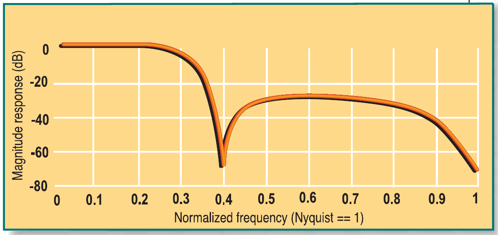
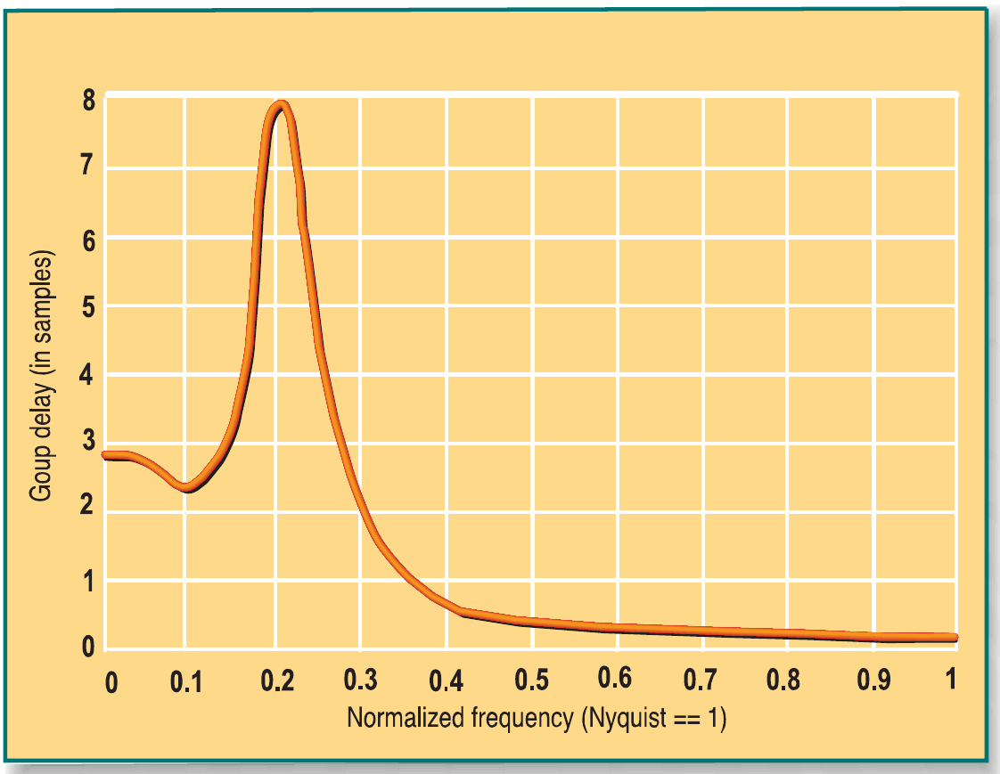
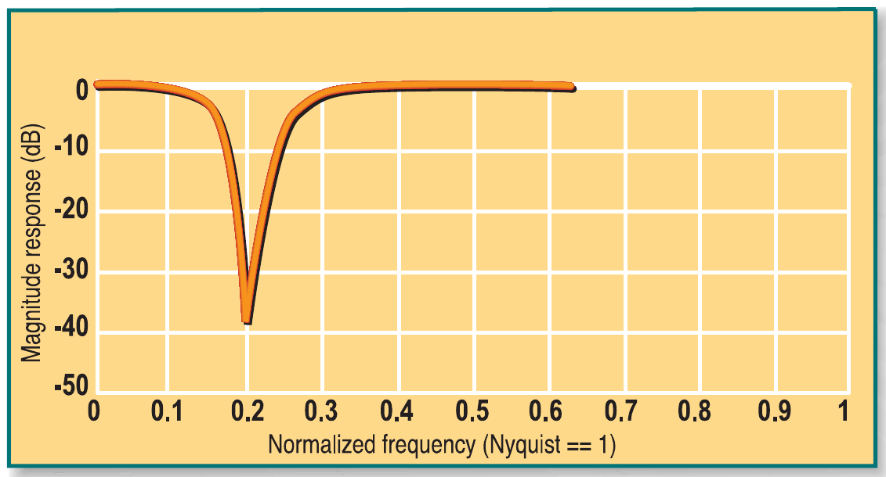
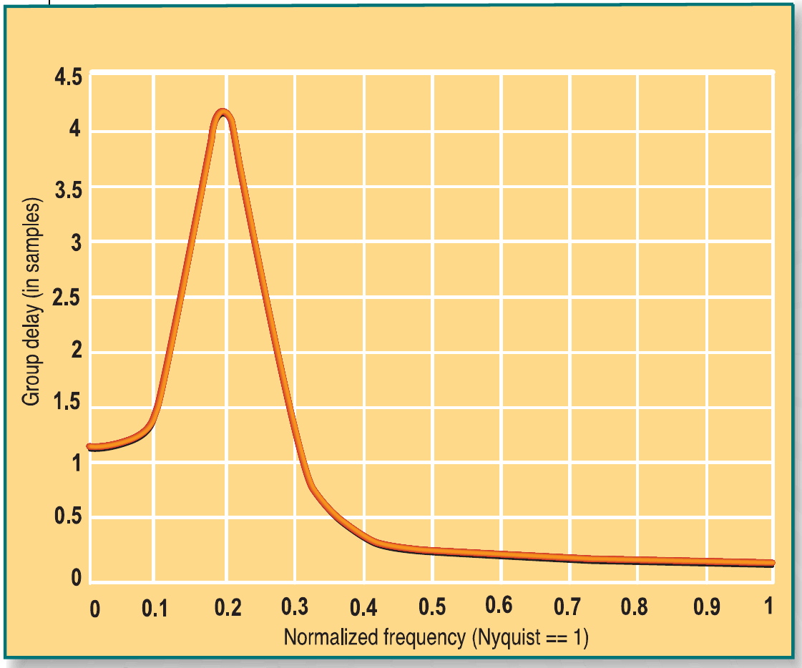
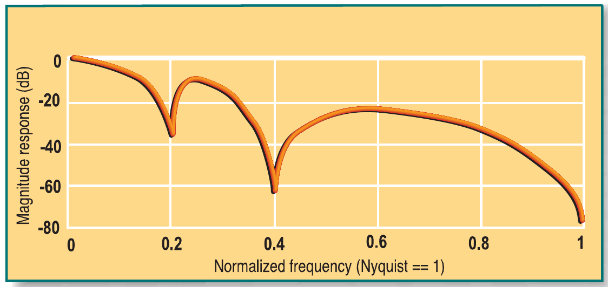
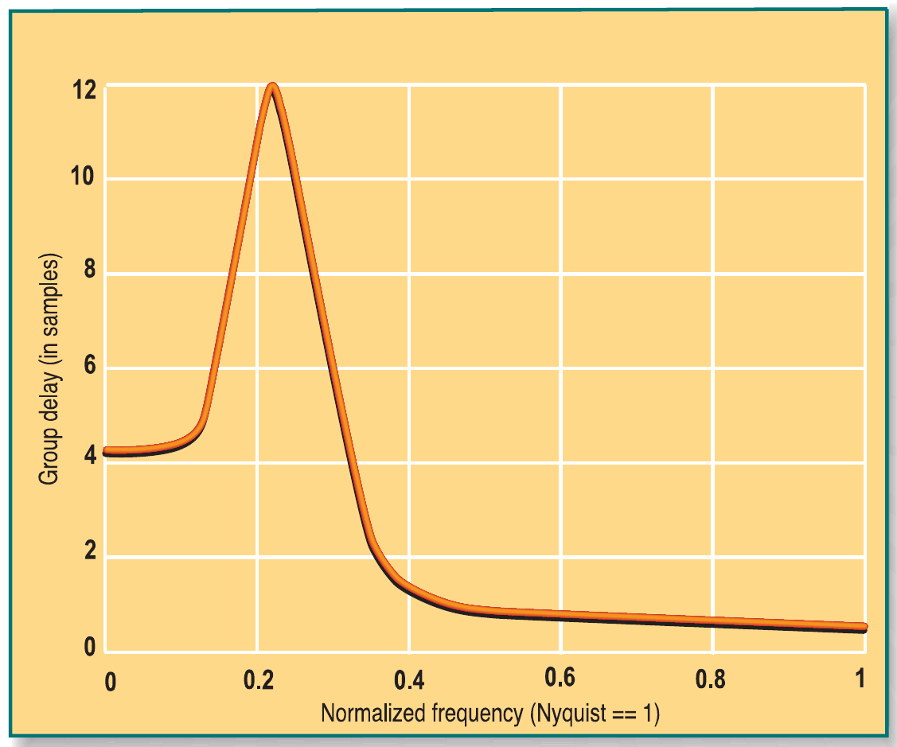
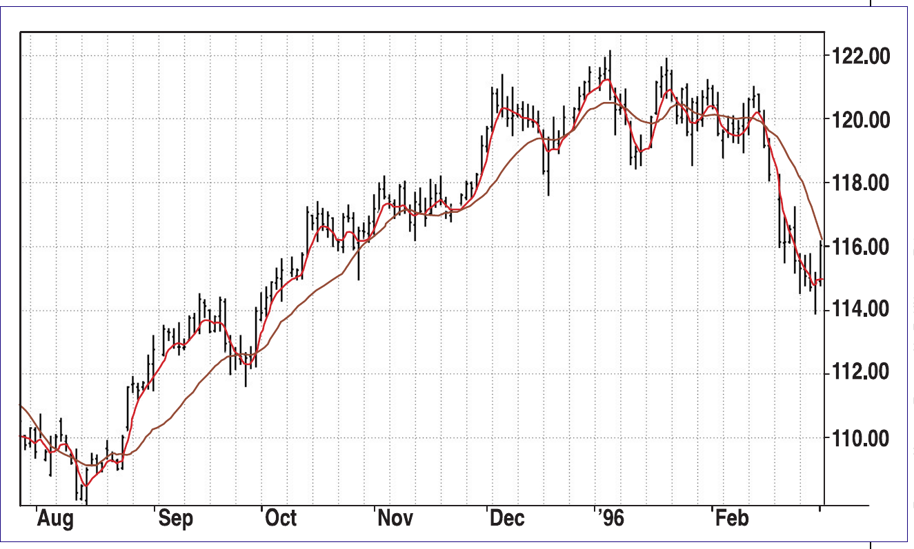

# The Instantaneous Trendline

- **Author:** John F. Ehlers, Ph.D.
- **Publication:** Technical Analysis of STOCKS & COMMODITIES, Volume 20:2, February 2002, pp. 28-32
- **Article URL:** [Article PDF](https://technical.traders.com/archive/article.asp?file=\V20\C02\023INST.pdf)
- **Traders' Tips URL:** [Traders' Tips, February 2002](https://www.traders.com/Documentation/FEEDbk_docs/2002/02/TradersTips/TradersTips.html)

---

## *Instantaneous Investing:* The Instantaneous Trendline

**Is it possible to have an instantaneous trendline?**

*by John F. Ehlers, Ph.D.*

To say that a trendline is "instantaneous" may be presumptuous, but because you can compute a continuous trendline with modern technology and thus assess the action in the markets, the term is somewhat appropriate.

A market can be in two modes — a trend mode and a cycle mode. That means you can describe the general market as a combination of the two. If you apply a simple moving average (SMA) over the period of a dominant cycle, the dominant cycle component can be completely eliminated.

Identifying a continuously varying dominant cycle and applying a simple average over the period of the dominant cycle on a bar-by-bar basis results in a variable-length moving average. That moving average is significant because it notches out the dominant cycle component. If the composite analytic waveform consists of a trend component and a cycle component, what remains after removing the cycle component is the trend. This is not precisely true, because there will always be components other than the dominant cycle present. But these secondary cycles usually have small amplitudes, providing a workable solution for trading purposes.

When you use an SMA with the length of the measured dominant cycle, the lag produced by the SMA is (dominant cycle - 1)/2. This suggests that if you have a 21-bar measured dominant cycle, the instantaneous trendline would be lagging the price by 10 bars. This is one of the limiting factors of such a technique, because it would be more advantageous to be as close to zero lag as possible.

This lag can be minimized, however, by using a smoothing filter specifically designed for minimum lag and then using a frequency notch filter to remove undesired frequency components. This strategy not only removes the dominant cycle, but also smooths the price waveform to form a superior instantaneous trendline.

The elliptic lowpass filters† are known to produce the minimum amount of lag for a given reduction in strength, or attenuation. I selected a three-pole elliptic filter with a 0.8 decibel (dB) in-band ripple and a 30 dB bandstop attenuation to filter out the high-frequency components. By setting the 0.8 dB passband at a normalized frequency of 0.22 (a nine-bar cycle period), the filter has a notch exactly at a five-bar cycle and 30 dB or more attenuation for cycle periods shorter than five bars. The frequency response of this filter can be seen in Figure 1. The equation for this filter in EasyLanguage code is:

```easylanguage
Filt1 = 0.0542*Price + 0.021*Price[1] + 0.021*Price[2]
      + 0.0542*Price[3] + 1.9733*Filt1[1] - 1.6067*Filt1[2]
      + 0.4831*Filt1[3]
```


**FIGURE 1: AMPLITUDE RESPONSE OF A THREE-BAR ELLIPTIC FILTER.** The filter has a notch at a five-bar cycle and 30 dB or more reduction for cycle periods shorter than five bars.

Figure 2 shows that the low-frequency lag of this elliptic filter is less than three bars. However, the lag in the vicinity of a 10-bar cycle is huge. This large lag is unacceptable because the 10-bar cycle component has not been attenuated. The large-delay frequency components can be made irrelevant by notching them out with another filter.


**FIGURE 2: GROUP DELAY OF A THREE-BAR ELLIPTIC FILTER.** The low-frequency lag of this elliptic filter is less than three bars.

The transfer response of a notch filter is concisely written in terms of z transforms† as:

$$
\text{Notch}(z) = \left(\frac{1 + \alpha}{2}\right) \frac{1 - 2\beta z^{-1} + z^{-2}}{1 - \beta(1 + \alpha)z^{-1} + \alpha z^{-2}}
$$

where $\beta = \cos(360/P)$

"P" is the cycle period to be notched out. The alpha term in the equation determines how wide the notch is to be. Alpha must be less than one. The notch is very narrow if alpha is very near one, and widens as the value of alpha is decreased. The value of alpha can be calculated in terms of the desired notch width as:

$$
\alpha = 1 - \frac{5.34(k^2 - 1)}{kP}
$$

where $k$ = the upper 3 dB frequency relative to the notch frequency.

For example, if you want the upper 3 dB point to be 44% greater than the notch frequency, then $k$ = 1.44. Working through the equation with P = 10, you find that in this case $\alpha$ = 0.6. The amplitude response for a notch filter with a notch at a 10-bar cycle and $\alpha$ = 0.6 can be seen in Figure 3. This notch filter removes those frequency components of the elliptic filter that had a large group delay.


**FIGURE 3: AMPLITUDE RESPONSE OF A 10-BAR NOTCH FILTER, α = 0.6.** The frequency components of the elliptic filter that had a large group delay are eliminated.

Use of the notch filter also comes at the cost of some lag. The plot of its group delay response can be seen in Figure 4. The low-frequency lag is only 1.3 bars. The high lags for filter output frequency components in the vicinity of the 10-bar cycle are not important because their amplitude is small.


**FIGURE 4: GROUP DELAY OF A 10-BAR NOTCH FILTER, α = 0.6.** The notch filter does have a lag. Here, the low-frequency lag is only 1.3 bars.

The composite lowpass and notch filter has the amplitude response shown in Figure 5. Figure 6 shows the composite low-frequency lag to be only 4.2 bars. The larger lag near the 10-bar cycle component is not important because the output amplitude of these frequency components is small.


**FIGURE 5: COMPOSITE LOWPASS AND NOTCH FILTER.** Here, you see the frequency response of the composite lowpass and 10-bar notch filter.


**FIGURE 6: GROUP DELAY OF THE COMPOSITE LOWPASS AND 10-BAR NOTCH FILTER.** The low-frequency lag is only 4.2 bars, with a very small amplitude for the frequency components.

## FURTHER TUNING

The next step is to tune another notch filter to the measured dominant cycle. For this filter the value I use for $\alpha$ is 0.8, because a wideband notch can become erratic when tuned to longer cycle periods. In addition, with wider bandwidth notches the lag increases. If the measured dominant cycle has a period of 21 bars, this notch filter has a low-frequency lag of 2.5 bars. Total lag is the sum of the lags of the elliptic filter, the 10-bar notch filter, and the dominant cycle notch filter. In the case of a 21-bar dominant cycle, the total lag is 4.2 + 2.5 = 6.7 bars.

This is a considerable reduction in the lag compared to the use of a 21-bar SMA to remove the dominant cycle. When the market is in a trend mode, the measured dominant cycle is often very long — perhaps 40 to 50 bars. In these cases, the lag reduction realized by using the notch filters is truly dramatic. If $\alpha$ = 0.8 when the dominant cycle is 20 bars, it is advisable to make $\alpha$ = 0.9 when the dominant cycle is 40 bars (and perform linear interpolation between 20 and 40 bars as required). In such a way, the tunable notch delay for a 40-bar cycle is only about four bars. This means the filter lag for a 40-bar dominant cycle is only about 8.2 bars instead of the 20-bar lag if a 40-bar SMA is used to remove the dominant cycle. An additional benefit of this notch filter approach is that the elliptic filter gives a consistent smoothing by removing the high-frequency components present in the price.

## TRENDS AND CYCLES

With the instantaneous trendline, I use a four-bar weighted moving average (WMA) to give an indication when the price crosses the instantaneous trendline. Since the four-bar WMA has only a one-bar lag, it is useful for that purpose. One way to recognize the onset of a trend is to count back from the current bar to the first crossing of the WMA and the instantaneous trendline. If the count is greater than a half-dominant cycle, the market is in a trend mode.

The reason is that if the market were in a cycle mode, we would expect the price to cross the instantaneous trendline every half-cycle. Failure to do so is a clear indication of a trend mode. This crossing of every half-cycle works best in sideways markets because the instantaneous trendline still has lag. From this you can determine that if the price has crossed more than a quarter-cycle ago and does not appear to even try to head back across the instantaneous trendline, it's the onset of a trend mode.

It is only when the smoothed price heads back and crosses the instantaneous trendline that the trend mode is over. This rule will get you into a trend mode trade much earlier. However, as with all anticipatory signals, you will get caught in an error once in a while.

The actions of the instantaneous trendline and the smoothed price curves can be seen in Figure 7. The smoothed price crosses the instantaneous trendline to the upside during the third week in August. The measured dominant cycle period during this time was about 22 bars. Since the price does not even try to come back to the instantaneous trendline, we declare the trend in force about five days after the crossing, around the first of September. With the exception of the whipsaw during the last week of September, this indicator pair correctly followed the trend until mid-December. By then, the market was in a cycle mode, and the cycle action could be followed by the smoothed price crossings of the instantaneous trendline. A trend mode is declared near the end of February because the price showed no inclination of crossing the instantaneous trendline.


**FIGURE 7: THE END RESULT.** The instantaneous trendline clearly shows how to trade the trend.

The instantaneous trendline is part of the package of commercial MESA indicators. The EasyLanguage code to measure dominant cycle phase is described with reference to Figure 8 if you want to make some customized changes to the indicator. The initial part of the code assumes the dominant cycle (the variable dc) is computed using the commercial MESA program for TradeStation2000i or 6.0. You may substitute your own code for the dc measurement, perhaps as measured by a Hilbert transform discriminator.

## CONCLUSION

Modern computers have dramatically altered the way technical analysts study the market. The studies are not only more complex and detailed, but also broader. Greater understanding of underlying principles and insight are the results of the overview enabled by greater computational power.

Cycle analysis is one of the elements that have been profoundly affected by computers, because these studies are computationally intensive. The very accomplishment of the calculations has led to a greater appreciation that the market is dynamic rather than static. Through the use of cycle analysis, traders can now model the market and think of performance in terms of the frequency domain. This enables them to surgically excise undesired components and use their models to adapt indicators and strategies to current market conditions.

*John Ehlers is president of MESA and a frequent contributor to STOCKS & COMMODITIES. This article is adapted from Ehlers's MESA And Trading Market Cycles, second edition.*

## EASYLANGUAGE CODE TO COMPUTE THE INSTANTANEOUS TRENDLINE

```easylanguage
Inputs:    Price(Close),
           Window(1),
           RegCode("LPJDPDTBHB");

vars:      dc(0),
           DCPeriod(0),
           Count(0)
           Itrend(0),
           Trendline(0),
           SmoothPrice(0);

defineDllFunc: "c:\mesadll\mesa2kd.dll",int,"INIT",int;
defineDllFunc: "c:\mesadll\mesa2kd.dll",int,"DomCycle",int, float,
               float, float, lpfloat;
defineDllFunc: "c:\mesadll\mesa2kd.dll",int,"MATRIX",lpstr;

if currentbar = 1 then begin
    init(1);
    Matrix(regcode);
end;

DomCycle(Window, Price, H, L, &dc);

{Lowpass Filter is Ellip(3,.8,30,.22)}
Value1 = .0542*Price + .021*Price[1] + .021*Price[2] + .0542*Price[3]
       + 1.9733*Value1[1] - 1.6067*Value1[2] + .4831*Value1[3];

{Notch Filter at a 10 bar cycle}
Value2 = .8*(Value1 - 2*Cosine(360/10)*Value1[1] + Value1[2])
       + 1.6*Cosine(360/10)*Value2[1] - .6*Value2[2];

{Notch Filter the Dominant Cycle}
Trendline = .9*(Value2 - 2*Cosine(360/dc)*Value2[1] + Value2[2])
          + 1.8*Cosine(360/dc)*Trendline[1] - .8*Trendline[2];

SmoothPrice = (4*Price + 3*Price[1] + 2*Price[2] + Price[3]) / 10;

Plot1(Trendline, «Trendline»);
Plot2(SmoothPrice, «SP»);
```

**FIGURE 8:** The dominant cycle (variable dc) is computed using the commercial MESA program for TradeStation, but you are free to substitute your own code for the dc measurement.

## SUGGESTED READING

Ehlers, John F. [2002]. *MESA And Trading Market Cycles*, 2d ed., John Wiley & Sons.

[2001]. *Rocket Science For Traders*, John Wiley & Sons.

[2000]. "Hilbert Indicators Tell You When To Trade," *Technical Analysis of STOCKS & COMMODITIES*, Volume 18: March.

---

†See Traders' Glossary for definition

---

## BibTeX

```bibtex
@article{ehlers_2002_instantaneous_trendline,
  author = {John F. Ehlers},
  title = {The Instantaneous Trendline: Is it possible to have an instantaneous trendline?},
  journal = {Technical Analysis of STOCKS \& COMMODITIES},
  volume = {20},
  number = {2},
  pages = {28--32},
  month = {February},
  year = {2002},
  url = {https://technical.traders.com/archive/article.asp?file=\V20\C02\023INST.pdf},
  note = {TRADING SYSTEMS -- Instantaneous Investing}
}

@misc{traders_tips_2002_02,
  author = {{Technical Analysis of STOCKS \& COMMODITIES}},
  title = {Traders' Tips: The Instantaneous Trendline, February 2002},
  howpublished = {online},
  month = {February},
  year = {2002},
  url = {https://www.traders.com/Documentation/FEEDbk_docs/2002/02/TradersTips/TradersTips.html}
}
```
