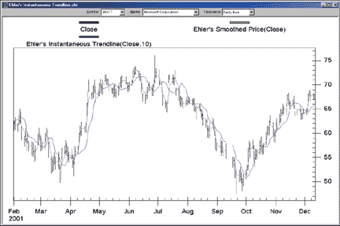
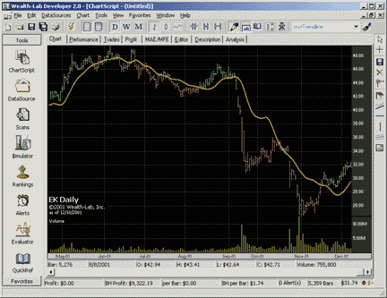

# Traders' Tips: February 2002

- **Article:** The Instantaneous Trendline by John F. Ehlers, Ph.D.
- **Traders' Tips URL:** [Traders' Tips, February 2002](https://www.traders.com/Documentation/FEEDbk_docs/2002/02/TradersTips/TradersTips.html)

---

*Here is this month's selection of Traders' Tips, contributed by various developers of technical analysis software to help readers more easily implement some of the strategies presented in this and other issues.*

## NeuroShell Trader: February 2002

The instantaneous trendline described by John Ehlers in his article in this issue can be easily implemented in NeuroShell Trader by using NeuroShell Trader's ability to call external code segments written in traditional languages such as Basic, C, C++, and Pascal. We've created the Ehlers instantaneous trendline in a chart (Figure 1) and you can download a compiled, working version from the NeuroShell Trader free technical support website.

After installing the custom indicator, you can insert it in new charts as follows:

1. Select 'New Indicator ...' from the 'Insert' menu
2. Select the Custom Indicator category
3. Select the Ehlers Instantaneous Trendline
4. Insert the parameters as you desire.

Please note that in the default, we use a constant dominant cycle of 10; however, if you have Ehlers's add-on package for NeuroShell Trader, you can use the dominant cycle indicator provided. Alternatively, if you have some other method of determining the dominant cycle, you may replace the default with that indicator.

The Ehlers smoothed price indicator can be easily implemented in NeuroShell Trader without writing code by combining a few of the more than 800 built-in indicators. We've done this for you already and have created a second custom indicator, also shown in Figure 1. Here is how we combined the built-in indicators to implement Ehlers's smoothed price indicator in NeuroShell Trader:

```
Divide(Add4(Mul2(Close,4), Mul2(Lag(Close,1),3),
Mul2(Lag(Close,2),2), Lag(Close,3)) ,10)
```

Using the custom indicator functionality in NeuroShell Trader, we saved it as "Ehlers Smoothed Price(Close)."


**FIGURE 1: NEUROSHELL TRADER, INSTANTANEOUS TRENDLINE.** Here's a NeuroShell Trader chart that graphically displays the Ehlers instantaneous trendline and smoothed price indicators.

After downloading the chart containing Ehlers's custom indicators, you can easily insert the indicator in other charts or combine it with any of our other built-in indicators.

Users of NeuroShell Trader can go to the STOCKS & COMMODITIES section of the NeuroShell Trader free technical support website to download implementations of this and previous Traders' Tips. For more information on NeuroShell Trader, visit www.NeuroShell.com.

*-Marge Sherald, Ward Systems Group, Inc.*  
*301 662-7950, sales@wardsystems.com*  
*https://www.neuroshell.com*

---

## Wealth-Lab: February 2002

Ehlers's instantaneous trendline is available as the native WealthScript function "HTTrendLine" on both the Wealth-Lab.com website and Wealth-Lab Developer 2.0 desktop software. However, the implementation of this indicator is based on formulas that Ehlers published earlier. The updated version is available as a custom indicator that you can download into Wealth-Lab Developer 2.0 by using the program's download facility. Select "File/Download ChartScripts" from the main menu and click the "Begin download" button. This causes any newly published scripts to be downloaded directly from the Wealth-lab.com website.


**FIGURE 2: WEALTH-LAB, INSTANTANEOUS TRENDLINE.** Here's the Ehlers instantaneous trendline as plotted in Wealth-Lab.

The following script plots the instantaneous trendline on a chart and sets the bar colors based on whether closing prices are above or below the trendline (see Figure 2).

```pascal
var BAR: integer;

{$I 'InstTrendline'}

SetColorScheme( #Lime, #Red, #Olive, #Black, 021, #Silver );

PlotSeries( InstTrendlineSeries( #Close ), 0, 763, #Thick );

for Bar := 80 to BarCount - 1 do
 if PriceClose( Bar ) > InstTrendLine( Bar, #Close ) then
  SetBarColor( Bar, 494 )
 else
  SetBarColor( Bar, 944 );
```

*-Dion Kurczek, Wealth-Lab.com*  
*www.wealth-lab.com*

---

## BibTeX

```bibtex
@misc{traders_tips_2002_02,
  author = {{Technical Analysis of STOCKS \& COMMODITIES}},
  title = {Traders' Tips: The Instantaneous Trendline, February 2002},
  howpublished = {online},
  month = {February},
  year = {2002},
  url = {https://www.traders.com/Documentation/FEEDbk_docs/2002/02/TradersTips/TradersTips.html}
}
```
