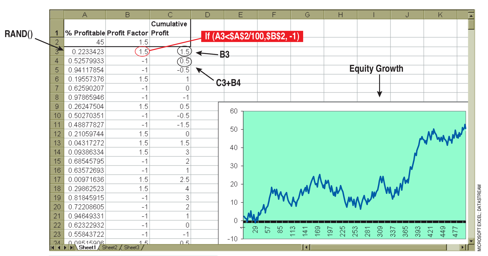
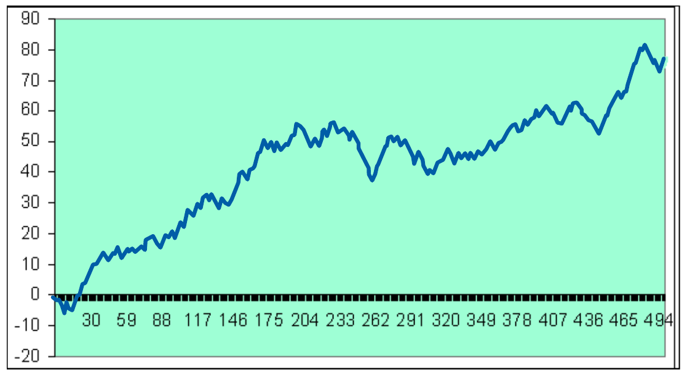
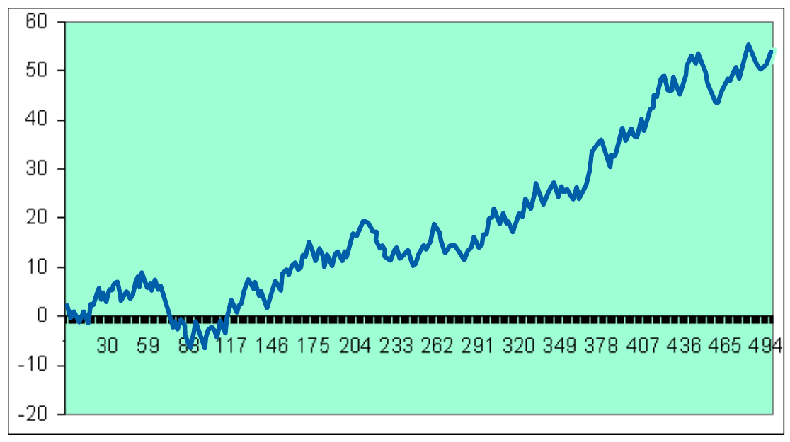
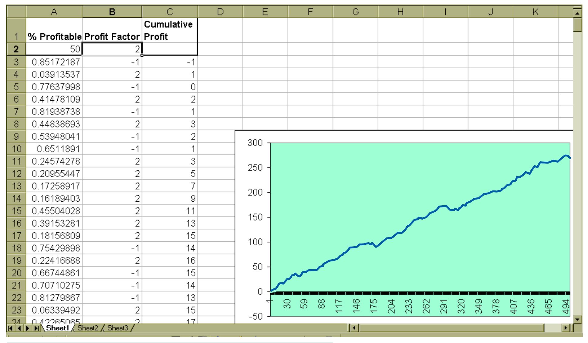
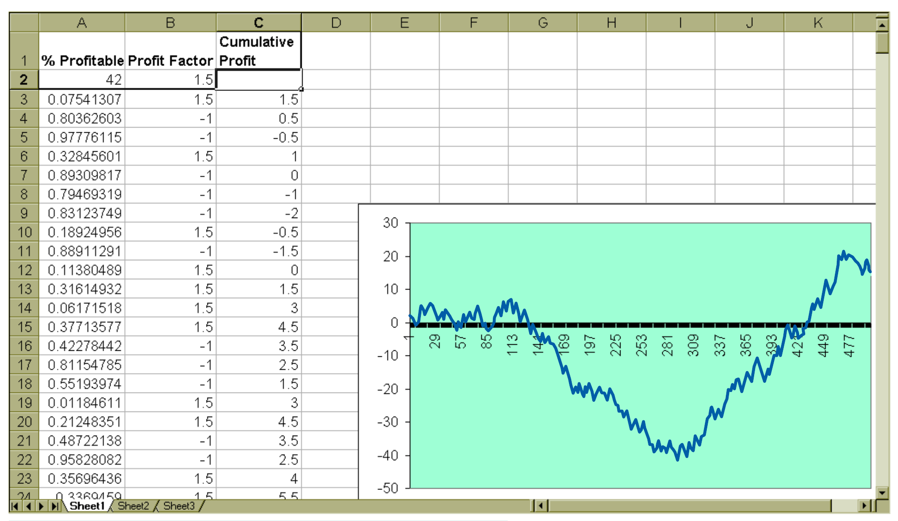

# Determining Equity Growth Performance

- **Authors:** John F. Ehlers and Mike Barna
- **Publication:** Technical Analysis of STOCKS & COMMODITIES, Volume 20:3, March 2002, pp. 22-26
- **Article URL:** [Article PDF](https://technical.traders.com/archive/article.asp?file=\V20\C03\043DET.pdf)

---

## What Can You Realistically Expect From Your Trading System?

### QUANTITATIVE ANALYSIS

What are the merits of using technical analysis trading systems? Evaluate them here.

Technical analysts have the option of trading with either discretionary or systematic techniques. Discretionary traders tend to integrate life experience, knowledge, and technical indicators to make trading decisions. In this way they can, and have, made spectacular amounts of money. System traders, on the other hand, rely on trading signals automatically generated by computer programs. They don't really need to know much about the market, or have much experience. Their confidence lies in the ability of their computerized systems. In this article we will show you how to determine what you can realistically expect from your trading system, rather than how to manipulate the statistics.

## System Statistics

If you are going to risk your hard-earned money there are a number of statistics that are important, such as maximum drawdown. That, plus the required margin, is the absolute minimum amount of money you should have in your account to avoid a margin call with reasonable probability. Another important statistic is the average profit per trade, because you have to cover your transaction costs, commission, and slippage before you can start making a profit. You have to pay attention to the number of consecutive losers, because that's really the test of how strong your stomach must be to trade the system.

Essentially, there are two statistics that enable you to assess the performance you can expect: percentage of profitable trades and the profit factor. As a trader, you want to have winners with as high a percentage as possible. However, if you make more on winning trades than you lose on losing ones, it's not necessary for the percentage of profitable trades to be greater than 50%. Your profit factor is the ratio of gross winnings to gross losses (in terms of gaming, this is referred to as the payout probability). But determining whether a particular trade is a winner or loser will not help you establish your system's performance. For that, you need to introduce randomization.

By determining whether trades win or lose by using a random number generator, applying the payout probability to each trade, and summing the randomly selected trades, you can achieve realistic expectations of what the equity growth produced by your system will look like.

## Equity Growth Generator


**FIGURE 1: SPREADSHEET SETUP.** The equity growth generator is relatively simple to set up. The equity curve visually displays the results.

A good way to create an equity growth simulator and plot the results is with an Excel spreadsheet (see Figure 1). The first step is to enter the two main statistics. In cell A1, type "% Profitable" and in cell A2, type 45. In cell B1, type "Profit Factor" and in cell B2, type 1.5. These entries are merely system statistics that you can change to visualize their effect on equity growth, as you will see later.

The next step is to introduce randomization. You do this by entering `=RAND()` in cell A3, which creates a random number with a uniform probability density between zero and 1. Next, compare this random number to the probability of a win by inserting `=IF(A3<$A$2/100,$B$2,-1)` in cell B3. This conditional statement tells the program that if the random number falls within the winning probability, assign the payout probability (the profit factor) to the trade; otherwise, assign a value of -1 to the trade.

The result is the outcome of the trade — the input in cell C3 =B3. Copy all of row 3 into row 4. Then change cell C4 to =C3+B4, which sums the trades in column C. Next, copy row 4 and paste into rows 5 through 500. Column C now becomes the equity growth for the randomized set of trades, using only the percent winners and profit factor. By double-clicking cell A3 and pressing Enter, the entire spreadsheet will be recalculated. Each time you do this, the equity growth will change.


**FIGURE 2: HYPOTHETICAL EQUITY GROWTH.** Here you see the equity growth when the % profitable = 45 and profit factor = 1.5.


**FIGURE 3: A SECOND HYPOTHETICAL EQUITY GROWTH.** Using the same % profitable and profit factor, you can get several variations in your equity growth.

Plotting the equity curve makes it easy to interpret the results. All you have to do is highlight cells C3 through C500. Then click on the chart wizard and input the data as requested. First, select a line type chart and click on the type shown in the upper left-hand corner of the thumbnail examples. Click Next. Then click Finish. Your chart is done! Now you are free to experiment with the kind of equity growth you can expect from your trading system. Double-click in cell A3 and press Enter. This will create a new randomized equity growth curve. Repeat until you feel you know what to expect from the system. In Figures 2 and 3, you can see two such examples using the default statistics.


**FIGURE 4: A NICE EQUITY GROWTH CURVE.** By altering the percent profitability to 50% and the profit factor to 2.0, you should see an equity curve similar to the one here.

See what happens when you change cell A2 to 50 and cell B2 to 2.0; you should see a nice equity growth curve like that displayed in Figure 4. Next, explore what the lower-limit statistics might be for a profitable trading system. Our experience is that the boundary is 42 in cell A2 and 1.5 in cell B2. An example of what an equity curve using these parameters might look like is displayed in Figure 5. There are numerous values you can use and we recommend you try out various values and explore for yourself.


**FIGURE 5: THE LOWER BOUNDARIES.** Changing the percent profitability to 42% and the profit factor to 1.5 drastically alters the equity curve.

## Analyzing Equity Curves

Here are a couple of software companies that should aid you in analyzing equity curves. The first, MESA Software, is John Ehlers's; the second, Inside Edge Systems Corp., is not affiliated with either Ehlers or Mike Barna.

1. **MESA Software** is among the few system developers that have systems with statistics such as these. You can see the equity curves of some of their systems at www.mesa-systems.com.

2. Another interesting way to evaluate a system is provided by a commercial software product called **Portfolio MCS** (Inside Edge Systems Corp., 10 Fresenius Road, Westport, CT 06880, 203 454-2754, www.insideedge.net). MCS stands for *Monte Carlo Simulator*. Portfolio MCS evaluates the risk/reward of a trading system by taking the real trading results of each trade and running the performance a large number of times with the order of the trades taken in a random sequence rather than in the order they occurred in a backtest. This is a Monte Carlo simulation of backtested trading results. This procedure creates bell-curve statistics, so the deviation from the mean establishes the expected drawdown the system will produce. Portfolio MCS extends the analysis from a single system to multiple systems, or the same system on multiple securities, so you can minimize the risk in overall portfolio performance. —*JFE*

## Conclusion

> **There are two statistics that enable you to assess the performance you can expect: percentage of profitable trades and the profit factor.**

Randomized generation of equity curves given the global statistics of a trading system, we hope, will help you evaluate a trading system you are developing or considering purchasing. But more important, we have given you a tool that can provide a realistic expectation of how your trading system will perform in the future, and thus the confidence to adhere to the system strategy.

## About the Authors

*John Ehlers is an electrical engineer working in electronic research and development, and has been a private trader since 1978. He is a pioneer in introducing maximum entropy spectrum analysis to technical trading through his MESA computer program. Mike Barna is a former astronautical engineer and is currently a trading systems designer and custom programmer. He has written many commercial trading systems at his company, Trading Systems Design and Analysis. Over the last six years he has collaborated with John Ehlers in the design of profitable and popular trading systems.*

†See Traders' Glossary for definition

---

## BibTeX

```bibtex
@article{ehlers_barna_2002_equity_growth,
  author = {John F. Ehlers and Mike Barna},
  title = {Determining Equity Growth Performance: What Can You Realistically Expect From Your Trading System?},
  journal = {Technical Analysis of STOCKS \& COMMODITIES},
  volume = {20},
  number = {3},
  pages = {22--26},
  month = {March},
  year = {2002},
  url = {https://technical.traders.com/archive/article.asp?file=\V20\C03\043DET.pdf},
  note = {QUANTITATIVE ANALYSIS}
}
```
