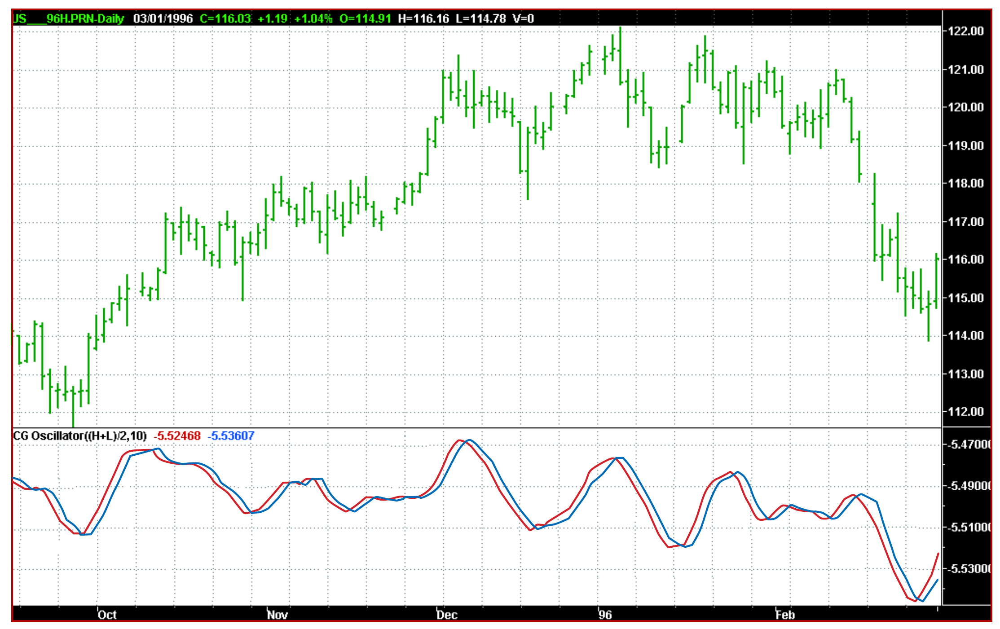

# The Center Of Gravity Oscillator

- **Author:** John F. Ehlers
- **Publication:** Technical Analysis of STOCKS & COMMODITIES, Volume 20, May 2002, pp. 20--24
- **Article URL:** [Article PDF](https://technical.traders.com/archive/article.asp?file=\V20\C05\088CENT.pdf)
- **Traders' Tips URL:** [Traders' Tips, August 2002](https://www.traders.com/Documentation/FEEDbk_docs/2002/08/TradersTips/TradersTips.html)

---

*Identifying Turning Points*

*Here's an indicator that identifies every major turning point without much lag.*

This new oscillator is unique in that it is smoothed and has essentially zero lag. The smoothing enables clear identification of turning points, and the zero lag aspect means action can be taken early in the move. This oscillator is the serendipitous result of my research into adaptive filters. While the filters have not yet produced the results I am seeking, this oscillator has substantial advantages over conventional oscillators used in technical analysis.

The center of gravity (CG) of a physical object is its balance point. For example, if you balance a 12-inch ruler on your finger, the CG will be at its six-inch point. If you change the weight distribution of the ruler by putting a paper clip on one end, then the balance point shifts toward the paper clip. Moving from the physical world to the trading world, the prices over a window of observation can be substituted for the units of weight along the ruler. With this analogy, you can see that the CG of the window moves to the right when prices increase sharply. Correspondingly, the CG of the window moves to the left when prices decrease.

## Computing the CG

The idea of computing the center of gravity arose from observing how the lag of various finite impulse response (FIR) filters varies according to the relative amplitude of the filter coefficients. A simple moving average (SMA) is an FIR filter where all the coefficients have the same value (usually unity). As a result, the CG of the SMA is in the exact center of the filter. A weighted moving average (WMA) is an FIR filter where the most recent price is weighted by the length of the filter, the next most recent price is weighted by the length of the filter less one, and so forth.

The weighting terms are the filter coefficients. The filter coefficients of a WMA describe the outline of a triangle. It is well known that the CG of a triangle is located at one-third the length of the base of the triangle; the CG of the WMA has shifted to the right relative to the CG of an SMA of equal length, resulting in less lag. In all cases of FIR filters, the sum of the product of the coefficients and prices must be divided by the sum of the coefficients so the scale of the original prices is retained.

The most general FIR filter is the Ehlers filter, which can be written as:

$$\text{Ehlers filter} = \frac{\sum_{i=0}^{N} c_i \cdot \text{Price}_i}{\sum_{i=0}^{N} c_i}$$

The coefficients of the Ehlers filter can be almost any measure of variability. I have looked at momentum, signal to noise ratio, volatility, and even stochastics and relative strength index (RSI) values as filter coefficients. One of the most adaptive sets of coefficients arose from video-edge detection filters, and was the sum of the square of the differences of each price to each previous price. The result of using different filter coefficients is to make the filter adaptive by moving the center of gravity of the coefficients.

While I was debugging the code of an adaptive FIR filter, I noticed the CG itself moved in exact opposition to price swings. The CG moves to the right when prices go up and moves to the left when prices go down. Since the CG is measured as the distance from the most recent price, the CG decreased when prices rose and increased when they fell. All I had to do was invert the sign of the CG to get a smoothed oscillator that was both in phase with the price swings and had essentially zero lag.

The CG is computed in a similar way to the Ehlers filter. The position of the balance point is the summation of the product of position within the observation window multiplied by the price at that position divided by the summation of prices across the window. The mathematical expression for this calculation is:

$$CG = \frac{\sum_{i=0}^{N} (x_i + 1) \cdot \text{Price}_i}{\sum_{i=0}^{N} \text{Price}_i}$$

In this expression, "1" is added to the position count because it starts with the most recent price at zero, and multiplying the most recent price by that position count would remove it from the computation. The EasyLanguage code to compute the CG oscillator is provided in the sidebar.

In EasyLanguage, the notation Price[N] means the price *N* bars ago. Thus, Price[0] is the price for the current bar. To count for the location, you have to count backward from the current bar. In the code, the summation is accomplished by recursion, where the count is varied from the current bar to the length of the observation window. The numerator is the sum of the product of the bar position and the price, and the numerator is the sum of the prices. Then, the CG is just the negative ratio of the numerator to the denominator. Since the CG is smoothed, by delaying the CG by one bar you can get an effective crossover signal.

An example of the CG oscillator can be seen in Figure 1. In this case, I selected the length to be a 10-bar observation window. It is clear the CG oscillator identifies every major turning point in price. Further, the crossovers formed by its trigger do so with zero lag. Since the CG oscillator is filtered and smoothed, whipsaws of the crossovers are minimized.

The appearance of the CG oscillator varies with the selection of the observation window. Ideally, the selected length should be half the dominant cycle, because this fully captures the entire cyclic move in one direction. If the length is too long, the CG oscillator is desensitized; for example, if the window length is one full dominant cycle, half the data pulls the CG to the right and the other half pulls it to the left. As a result, the CG stays in the middle of the window and no motion of the CG oscillator is observed.

On the other hand, if the window length is too short, you will miss the benefits of smoothing. The CG oscillator will contain higher-frequency components, making it a little troublesome for profitable trading.


**FIGURE 1: THE CG OSCILLATOR AT WORK.** You can see how this indicator accurately identifies each turning point in price.

---

## EasyLanguage Code to Compute the CG Oscillator

```easylanguage
Inputs:     Price((H+L)/2),
            Length(10);

Vars:       count(0),
            Num(0),
            Denom(0),
            CG(0);

Num = 0;
Denom = 0;
For count = 0 to Length - 1 begin
    Num = Num + (1 + count)*(Price[count]);
    Denom = Denom + (Price[count]);
End;
If Denom <> 0 then CG = -Num/Denom;

Plot1(CG, "CG");
Plot2(CG[1], "CG1");
```

*—J.F.E.*

---

*John Ehlers is president of MESA Software and is a frequent contributor to STOCKS & COMMODITIES. He is a pioneer in introducing maximum entropy spectral analysis to technical traders through his MESA software. He is also a pioneer in introducing the Hilbert transform application to a number of unique indicators.*

## Suggested Reading

- Ehlers, John [2001]. "Nonlinear Ehlers Filters," *Technical Analysis of STOCKS & COMMODITIES*, Volume 19: April.
- _____ [2001]. *Rocket Science For Traders*, John Wiley & Sons.

---

## BibTeX

```bibtex
@article{ehlers_center_of_gravity_2002,
  author    = {John F. Ehlers},
  title     = {The Center Of Gravity Oscillator},
  journal   = {Technical Analysis of STOCKS \& COMMODITIES},
  volume    = {20},
  number    = {5},
  pages     = {20--24},
  year      = {2002},
  month     = may,
  url       = {https://technical.traders.com/archive/article.asp?file=\V20\C05\088CENT.pdf}
}

@misc{traders_tips_2002_08,
  author       = {{Technical Analysis of STOCKS \& COMMODITIES}},
  title        = {Traders' Tips: Center Of Gravity Oscillator, August 2002},
  howpublished = {online},
  year         = {2002},
  month        = aug,
  url          = {https://www.traders.com/Documentation/FEEDbk_docs/2002/08/TradersTips/TradersTips.html}
}
```
