# Traders' Tips: May 2002

- **Article:** "The Center Of Gravity Oscillator" by John F. Ehlers
- **Traders' Tips URL:** [Traders' Tips, May 2002](https://www.traders.com/Documentation/FEEDbk_docs/2002/05/TradersTips/TradersTips.html)

---

## METASTOCK: PROJECTED FIBONACCI TARGETS

In "Projected Fibonacci Targets" in this issue, Mohab
Nabil introduces Fibonacci studies, which may be new to some readers. In
MetaStock, it is very easy to apply Fibonacci retracements to a chart.
In MetaStock, bring up a chart you want to analyze. With your cursor,
you can simply click on the Fibonacci retracements icon or use the Insert
menu and select Fibonacci, then choose one of our four studies. It will
then apply the study to your chart. The defaults of 23.6, 38.2, 50, and
61.8% will automatically appear. You also can customize any other numbers
that you would like to have appear in your study.
*--Scott Brown, Equis International, Inc.*

*support@equis.com, www.equis.com*

[GO BACK](https://www.traders.com/Documentation/FEEDbk_docs/2002/05/TradersTips/TradersTips.html#top)


---

## METASTOCK: DAYTRADING STOCK PAIRS

In "Daytrading Stock Pairs" in this issue, Mark Conway
and Aaron Behle discuss volatility bands and spread values. These indicators
can be easily recreated in MetaStock.
To create an indicator in MetaStock, select "Indicator Builder"
from the Tools menu, click "New," enter the code for the
indicator, and then click OK. The following code is for MetaStock Professional
7.0.
Name: Spread & Volatility

Formula:

```
hv1:=Input("30 day historical volatility of first security",0,100,0.5);
hv2:=Input("30 day historical volatility of second security",0,100,0.5);
r:=Input("correlation coefficient of these securities",0,100,0.5);
vf:=Input("volatility factor",0,5,1.5);
p1:= Security("ATVI", C );
p2:= Security("THQI", C );
```

 (For MetaStock 6.52 or end-of-day users, change the above
two lines to:

```
p1:= p;
p2:= C;
```

This version is more readily adaptable to any security pair, but
it requires more care in plotting it. The modified version requires you
to insert the prices of the one security into the chart of the other. Then
you must plot this indicator on the prices you just inserted.) To continue
with the code:

```
newday:=ROC(DayOfWeek(),1,$)<>0;
yp1:=ValueWhen(1,newday, Ref(p1,-1));
yp2:=ValueWhen(1,newday, Ref(p2,-1));
sprd:= (p1/yp1) - (p2/yp2);
vb:=(hv1 + hv2) * Power(1/252,0.5) * (1-r);
sprd;
vb*vf;
Neg(vb*vf)
```

To plot the indicator, locate it in MetaStock's Indicator
Quicklist, then click and drag it onto the desired chart.
*--William Golson, Equis International*

*www.equis.com*

[GO BACK](https://www.traders.com/Documentation/FEEDbk_docs/2002/05/TradersTips/TradersTips.html#top)


---

## TRADESTATION: DAYTRADING STOCK PAIRS

In "Daytrading Stock Pairs," Mark Conway and Aaron Behle
combine the spread, historical volatility, and the coefficient of R to
identify entry and exit points for stock pairs. Here is some EasyLanguage
that can be used to create your own spread indicator, based on the calculations
described in the article. We've named the indicator pairs spread,
and it can be created as follows:

```
Inputs: SDev(1.5), Length(30);
Variables: Spread(0), HV1(0), HV2(0), R(0), VB(0);
If Close Data3 <> 0 AND Close Data4 <> 0 Then
 Spread = ( Close Data1 / Close Data3 ) - ( Close Data2 / Close Data4 );
If Date <> D[1] Then Begin
 HV1 = StdDev(Log(Close/Close[1]), Length) Data3 * SquareRoot(252/1);
 HV2 = StdDev(Log(Close/Close[1]), Length) Data4 * SquareRoot(252/1);
 R = CoefficientR(Close Data3, Close Data4, Length);
 VB = SDev * ((HV1 + HV2) * SquareRoot(1/252) * (1 - R));
End;
Plot1(Spread, "Spread");
Plot2(VB, "UpperVB");
Plot3(-VB, "LowerVB");
Plot4(0, "Zero");
```

Before this indicator can be applied, the chart must be properly
set up. As shown in the article, a multisymbol chart must be used to perform
the pairs analysis. You should also note that Data3 and Data4 are both
referenced in the EasyLanguage for the indicator, since the spread and
the historical volatility both reference daily closing values in their
calculations. Thus, a multisymbol chart should be set up with four data
series (although the second two can be hidden). Using one of the examples
from the article, a pairs chart for ATVI and THQI would be set up as follows:

```
Data1 - Atvi 10 min
Data2 - Thqi 10 min
Data3 - Atvi Daily (hidden)
 Data4 - Thqi Daily (hidden)
```

Once you've set up your chart (Figure 1), you should
be ready to go. Remember, when applying the indicator, you can format the
plot line style and color however you see fit.

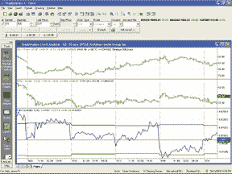

**Figure 1: TradeStation, pairs trading.** Here's a sample
TradeStation chart showing the pairs spread indicator applied to one of
the popular pairs, GS and MWD, with several different crosses occuring.

*-- Gaston Sanchez*

*Product Management*

*TradeStation Technologies, Inc. (formerly Omega Research, Inc.)*

*a wholly owned subsidiary of TradeStation Group, Inc.*

*https://www.TradeStation.com*
[GO BACK](https://www.traders.com/Documentation/FEEDbk_docs/2002/05/TradersTips/TradersTips.html#top)


---

## NEUROSHELL TRADER: DAYTRADING STOCK PAIRS

In this issue, Mark Conway and Aaron Behle discuss using volatility
and correlation to create a daytrading strategy for pairs trading. To implement
a daytrading pairs system using volatility bands in NeuroShell DayTrader,
you could use two charts, just as Conway and Behle do. However, we'll
show how to do it here in one chart to make the system integrated and more
general (Figure 2).

 

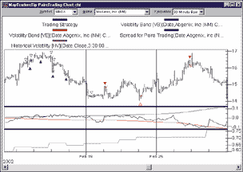

**Figure 2: NeuroShell Trader, pairs trading system.** Here's
a sample chart illustrating the pairs trading system as implemented in
NeuroShell Trader.

First, create a chart that contains the two stocks you wish to trade,
each on a different chart page. To create a chart with two chart pages,
select "New Chart ..." from the File menu and choose
the two stocks of interest on the appropriate wizard screen.
The next step is to create the volatility band and spread indicators.
To create the indicators, select "New Indicator ..."
from the Insert menu and use the Indicator Wizard to create each of the
following:

```
PAIRS TRADING SPREAD:
 Sub ( Divide ( STOCKA, DayClose(Date, STOCKA, 1)), Divide ( STOCKB, DayClose(Date, STOCKB, 1) ) )
HV - HISTORICAL VOLATILITY:
 Mult2 ( SelectiveStndDev ( Ln ( Divide ( DayClose(Date,Close,1), DayClose(Date,Close,2) ) ), Time=X(Date,3:30pm), 30), Sqrt(252))
VB ? VOLATILITY BAND
 Mult4 ( 1.5, Add2 ( HVSTOCKA, HVSTOCKB) , Sqrt(252), Sub(1, LinXYRegr(STOCKA, STOCKB, 390) ) )
```

Note that in the above indicators, 3:30 pm is the time of the last
bar of each trading day (in this case, we were assuming half-hour bars);
252 represents the number of trading days in a year; and 390 is the number
of bars in a 30-day period (in this case, we once again used half-hour
bars). Also note that StockA and StockB represent the closing prices of
StockA and StockB, but inserted as other instrument data. To insert another
instrument into an indicator, press the "Other Instrument Data ..."
button on the parameter dialogue, select the stock's ticker symbol,
and select close.
To create the daytrading pairs system, select "New Trading Strategy
..." from the Insert menu and enter the following long and
short entry conditions in the appropriate locations of the Trading Strategy
Wizard:

```
Generate a buy long MARKET order if ONE of the following are true:
 AND2 ( A=B(Close, STOCKA ), CrossAbove ( SPREAD, -VB ) )
 AND2 ( A=B(Close, STOCKB ), CrossBelow ( SPREAD, VB ) )
Generate a sell long MARKET order if ONE of the following are true:
 AND2 ( A=B(Close, STOCKA ), CrossAbove ( SPREAD, 0 ) )
 AND2 ( A=B(Close, STOCKA ), A>B(Spread, Mult2(VB, 1.5) ) )
 AND2 ( A=B(Close, STOCKB), CrossBelow ( SPREAD, 0 ) )
 AND2 ( A=B(Close, STOCKB ), A<B(Spread, Mult2(-VB, 1.5) ) )
Generate a sell short MARKET order if ONE of the following are true:
 AND2 ( A=B(Close, STOCKA ), CrossBelow ( SPREAD, VB )
 AND2 ( A=B(Close, STOCKB), CrossAbove ( SPREAD, -VB )
Generate a cover short MARKET order if ONE of the following are true:
 AND2 ( A=B(Close, STOCKA ), CrossBelow ( SPREAD, 0 ) )
 AND2 ( A=B(Close, STOCKA ), A<B(Spread, Mult2(-VB, 1.5) ) )
 AND2 ( A=B(Close, STOCKB ), CrossAbove ( SPREAD, 0 ) )
 AND2 ( A=B(Close, STOCKB ), A>B(Spread, Mult2(VB, 1.5) ) )
```

Note that -VB is the same as VB except with a negative standard
deviation multiplier. After backtesting the trading strategy, use the "Detailed
Analysis ..." button to view the backtest and trade-by-trade
statistics for the daytrading pairs system. You can choose to view the
statistics for each stock or view the average statistics for both stocks.
Users of NeuroShell Trader can go to the STOCKS & COMMODITIES section
of the NeuroShell Trader free technical support website to download a sample
chart that includes the pairs trading spread indicator, historical volatility
indicator, volatility band indicator, and trend continuation factor trading
systems.
*--Marge Sherald, Ward Systems Group, Inc.*

*301 662-7950, sales@wardsystems.com*

*https://www.neuroshell.com*

[GO BACK](https://www.traders.com/Documentation/FEEDbk_docs/2002/05/TradersTips/TradersTips.html#top)


---

## NEUROSHELL TRADER: PROJECTED FIBONACCI TARGETS

To recreate in NeuroShell Trader the projected Fibonacci targets as
described by Mohab Nabil in his article in this issue, select "New
Indicator ..." from the Insert menu and use the Indicator Wizard
to create the following indicator:

```
Divide ( Sub ( Mult2 ( RATIO, A ), B ), Sub ( RATIO, 1 ) )
```

Where

   A is the point where the first price swing started

   B is the point where the first price swing ended (horizontal
support/resistance)

  RATIO is one of the following Fibonacci Ratios: 0.237, 0.382,
0.50, or 0.61.8
The values of A or B can be chosen to be constant price values or indicators.
The constant values would be numeric prices based upon swing points visually
identified on the chart. The indicators would be indicators that compute
recent swing points such as Max(High,20), Min(Low,20) or more complex user-created
indicators.

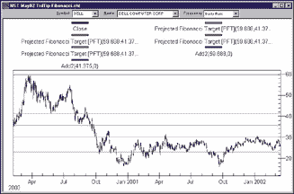

**Figure 3: NeuroShell Trader, projected Fibonacci targets.**
Here's a sample chart of a projected Fibonacci target in NeuroShell
Trader.

Users of NeuroShell Trader can go to the STOCKS & COMMODITIES
section of the NeuroShell Trader free technical support website to download
the sample chart that includes the projected Fibonacci target indicator.
*--Marge Sherald, Ward Systems Group, Inc.*

*301 662-7950, sales@wardsystems.com*

*https://www.neuroshell.com*

[GO BACK](https://www.traders.com/Documentation/FEEDbk_docs/2002/05/TradersTips/TradersTips.html#top)


---

## Wealth-Lab: DAYTRADING STOCK PAIRS

The first step in implementing the stock pairs daytrading strategy presented
by Mark Conway and Aaron Behle in their article in this issue is to find
a pair of stocks that are highly correlated. Wealth-Lab provides a correlation
function that can be used for this purpose. The following script will cycle
through all the symbols in a WatchList and find the best correlation to
the one that is currently being charted. It also outputs the 30-day correlation
and the 30-day historical volatility for two stocks in the pair.

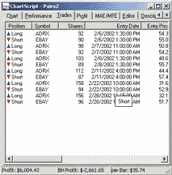

**Figure 4: Wealth-Lab, pairs trading.** You'll notice
that in this Wealth-Lab trade log, you can see which symbol the positions
belong to, making it easier to evaluate the results.

 

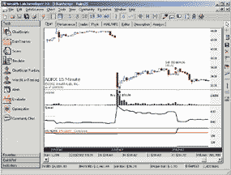

**Figure 5: Wealth-Lab, pairs trading. **Here's a sample
chart of the pairs trading strategy in Wealth-Lab.

```
var BESTSYMBOL, PRIMARY, SECONDARY: string;
var CORR, BESTCORR: float;
var I: integer;
BestCorr := 0;
BestSymbol := 'None';
Primary := GetSymbol;
for i := 0 to WatchListCount - 1 do
begin
  Secondary := WatchListSymbol( i );
  if Primary <> Secondary then
  begin
    Corr := Correlation( #Close, GetExternalSeries( Secondary, #Close ), 0,
BarCount - 1 );
    if Corr > BestCorr then
    begin
      BestCorr := Corr;
      BestSymbol := Secondary;
    end;
  end;
end;
DrawLabel( 'Best Correlated: ' + BestSymbol, 0 );
DrawLabel( '30 Day Correlation: ' + FormatFloat( '#0.00', BestCorr ), 0 );
DrawLabel( '30 Day HV ' + GetSymbol + ': ' + FormatFloat( '#0.00', HV(
BarCount - 1, #Close, 30 ) ), 0 );
SetPrimarySeries( BestSymbol );
DrawLabel( '30 Day HV ' + BestSymbol + ': ' + FormatFloat( '#0.00', HV(
BarCount - 1, #Close, 30 ) ), 0 );
```

The next script implements the intraday pairs trading strategy outlined
in the article. Wealth-Lab Developer 2.0 allows you to access daily data
from an intraday chart, and also has the ability to access any number of
external data series in a script. Here, we actually implement both sides
of the strategy in a single script. You'll notice that in the trade
log you can even see which symbol the positions belong to, making it easier
to evaluate the results.

```
var SYM2: string;
var CORR, LAST, LAST2, CLOSE, CLOSE2, X, XHV1, XHV2, XR, VB: float;
var SPREAD, VBSERIES, C1, C2, CORRSERIES, BAR, HV1, HV2, VBNEG, SPREADPANE,
HVPANE: integer;
Sym2 := 'EBAY';
Spread := CreateSeries;
VBSeries := CreateSeries;
{ 30 Day HV and Correleation }
SetScaleDaily;
C1 := OffsetSeries( #Close, -1 );
SetPrimarySeries( Sym2 );
C2 := OffsetSeries( #Close, -1 );
CorrSeries := CreateSeries;
for Bar := 30 to BarCount - 1 do
begin
  corr := Correlation( C1, C2, Bar - 30, Bar );
  SetSeriesValue( Bar, CorrSeries, corr );
end;
HV1 := IntradayFromDaily( HVSeries( C1, 30 ) );
HV2 := IntradayFromDaily( HVSeries( C2, 30 ) );
CorrSeries := IntradayFromDaily( CorrSeries );
RestorePrimarySeries;
{ Calculate Spread and VB }
Last := 0.0;
Last2 := 0.0;
for Bar := 20 to BarCount - 1 do
begin
  if Last > 0 then
  begin
    Close := PriceClose( Bar );
    SetPrimarySeries( Sym2 );
    Close2 := PriceClose( Bar );
    RestorePrimarySeries;
    x := ( Last / Close ) - ( Last2 / Close2 );
    SetSeriesValue( Bar, Spread, x );
  end;
  if LastBar( Bar ) then
  begin
    Last := PriceClose( Bar );
    SetPrimarySeries( Sym2 );
    Last2 := PriceClose( Bar );
    RestorePrimarySeries;
  end;
  xHV1 := GetSeriesValue( Bar, HV1 );
  xHV2 := GetSeriesValue( Bar, HV2 );
  xR := GetSeriesValue( Bar, CorrSeries );
  VB := ( xHV1 + xHV2 ) * Sqrt( 1 / 252 ) * ( 1 - xR );
  VB := VB * 1.5;
  SetSeriesValue( Bar, VBSeries, VB );
end;
VBNeg := MultiplySeriesValue( VBSeries, -1 );
{ Trading Rules }
for Bar := 725 to BarCount - 1 do
begin
  if LastPositionActive then
  begin
    if LastBar( Bar ) then
    begin
      SellAtClose( Bar, LastPosition, '' );
      SellAtClose( Bar, LastPosition - 1, '' );
    end;
  end
  else
  begin
    if CrossOver( Bar, Spread, VBSeries ) then
    begin
      BuyAtMarket( Bar + 1, '' );
      SetPrimarySeries( Sym2 );
      ShortAtMarket( Bar + 1, '' );
      RestorePrimarySeries;
    end
    else if CrossUnder( Bar, Spread, VBNeg ) then
    begin
      ShortAtMarket( Bar + 1, '' );
      SetPrimarySeries( Sym2 );
      BuyAtMarket( Bar + 1, '' );
      RestorePrimarySeries;
    end;
  end;
end;
{ Plot Spread }
SpreadPane := CreatePane( 75, false, true );
PlotSeries( Spread, SpreadPane, 202, #Thick );
DrawLabel( 'Spread', SpreadPane );
PlotSeries( VBSeries, SpreadPane, #Silver, #Thin );
PlotSeries( VBNeg, SpreadPane, #Silver, #Thin );
{ Plot HV }
HVPane := CreatePane( 75, false, true );
PlotSeries( HV1, HVPane, #Black, #Thick );
DrawText( 'HV ' + GetSymbol, HVPane, 4, 4, #Black, 8 );
DrawText( 'HV ' + Sym2, HVPane, 54, 4, #Red, 8 );
DrawText( 'Correlation', HVPane, 104, 4, #Green, 8 );
PlotSeries( HV2, HVPane, #Red, #Thick );
PlotSeries( CorrSeries, HVPane, #Green, #Thick );
```

--Dion Kurczek, Wealth-Lab, Inc.

www.wealth-lab.com
[GO BACK](https://www.traders.com/Documentation/FEEDbk_docs/2002/05/TradersTips/TradersTips.html#top)


---

## WEALTH-LAB: PROJECTED FIBONACCI TARGETS

We've created a custom Wealth-Lab study based on Mohab Nabil's
article in this issue, "Projected Fibonacci Targets." You
can download the study into Wealth-Lab Developer 2.0 by selecting the Community/Download
ChartScripts menu item. You can view the code for the study at our website,
www.wealth-lab.com. Select the Wealth-Lab Developer 2.0 main menu, and
then click the Code Library submenu.

 Once the study is downloaded into Wealth-Lab Developer 2.0, you
can include it in your charts. Launch the Include Manager (press F6) and
select the "Projected Fib Targets" study from the list. Then,
switch to the code editor and enter the following line of code:

```
ProjectedFibTargets( 5, 4 );
```

The ProjectedFibTargets procedure takes two parameters. The first
controls the percentage move required to identify a new peak/trough. The
second controls the sensitivity at which consolidation levels are detected.
A value of 4, as used above, indicates that the recent peaks, as well as
troughs, must be within four percent of each other for a consolidation
to be recognized.
After determining whether prices are in a consolidation phase, the script
watches for the upside or downside breakout. It then calculates and plots
the four Fib Targets on the chart. In Figure 6, we provide a sample chart
of ADLAC showing a downside breakout from a small consolidation area. Note
how prices found support at the lowest Fib Target before making another
advance.

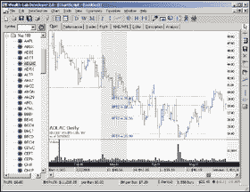

**Figure 6: Wealth-Lab, projected Fibonacci targets.** Here
is a chart of ADLAC showing a downside breakout from a small consolidation
area. Note how prices found support at the lowest Fib Target before making
another advance.

*--Dion Kurczek, Wealth-Lab, Inc.*

*www.wealth-lab.com*

[GO BACK](https://www.traders.com/Documentation/FEEDbk_docs/2002/05/TradersTips/TradersTips.html#top)


---

## NEOTICKER: DAYTRADING STOCK PAIRS

To recreate in NeoTicker the backtesting system for "Daytrading
Stock Pairs" by Mark Conway and Aaron Behle, first you will have
to create two indicators: vband with one integer parameter, Period (Listing
1); and xspread without any parameter (Listing 2). Then you will have to
create a backtesting indicator called sys_spread with three parameters:
volatility fact, period, and tick unit (Listing 3).

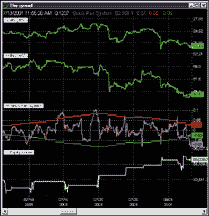

**Figure 7: NeoTicker, combined indicator/trading system for paired
volatility band.** Here's a sample chart of the stock pairs trading
system as implemented in NeoTicker. The sys_spread indicator will plot
the spread, upper volatility band, lower volatility band, and the system
equity curve.

```
LISTING 1
function vband()
   dim hv1, hv2, cr
   dim vb
   if not data1.valid (0) or not data2.valid (0) then
      itself.successex (1) = false
      itself.successex (2) = false
      exit function
   end if
   itself.makeindicator "myhv1", "historical_vola", Array("1"), _
                        Array(param1.str, "1")
   hv1 = itself.indicator("myhv1")
   itself.makeindicator "myhv2", "historical_vola", Array("2"), _
                        Array(param1.str, "1")
   hv2 = itself.indicator("myhv2")
   itself.makeindicator "mycr", "correl", Array("1","2"), Array(param1.str)
   cr = itself.indicator("mycr")
   if not hv1.valid(0) or not hv2.valid(0) or not cr.valid(0) then
      itself.successex (1) = false
      itself.successex (2) = false
      exit function
   end if
   vb = ( hv1.value(0) + hv2.value(0) ) * tq_sqrt(1/252) * (1-cr.value(0))
   itself.answer(1) = vb
   itself.answer(2) = -vb
end function
LISTING 2
function xspread()
   dim close1, close2
   if not data1.valid (0) or not data2.valid(0) then
      itself.success = false
      exit function
   end if
   itself.makeindicator "myclose1", "prevDClose", Array("1"), Array("")
   close1 = itself.indicator ("myclose1")
   itself.makeindicator  "myclose2", "prevDClose", Array("2"), Array("")
   close2 = itself.indicator ("myclose2")
   if not close1.valid (0) or not close2.valid (0) then
      itself.success = false
      exit function
   end if
   xspread = (Data1.Value (0)/ close1.value(0)) - _
             (data2.value (0)/ close2.value(0))
end function
LISTING 3
function sys_spread()
   dim vb, s
   dim s0, s1, vb0
   if heap.size = 0 then
      heap.allocate 1
      with trade
         ' turn this option true for system monitor to track it
         .monitor = true
         ' turn this option true for real-time trading system that close
         ' all open position at end of day
         .closepositioneod = true
         ' there are 3 basic types of fill
         ' ftAverage, ftWorst, ftExact
         .fillType = ftAverage
         ' commission structure (per transaction)
         ' cmFlatRate, cmPerUnit
         .commissionType = cmFlatRate
         .commissionBaseAmount = 15
         ' per unit cost setting is not important for flat rate type
         .commissionPerUnit = 0
         ' initicalcapital
         ' it is important for sharpe ratio and other
         ' performance statistics calculations only
         .initialcapital = 100000
         ' the risk free interest rate
         ' works with initial capital for statistics calculation
         .interestrate = 5
         ' pricemultiple is 1 for stock
         ' 50 for sp emini index future, 250 for sp index future
         ' 20 for nd emini index future, 100 for nd index future
         .pricemultiple = 1
      end with
   end if
   ' signal generation part
   ' construct the necessary indicators
   itself.makeindicator "myvb",  "vband", Array("3","4"), Array(param2.str)
   itself.makeindicator "mys", "xspread", Array("1","2"), Array("")
   ' setup for the condition checking
   vb = itself.indicator("myvb")
   s  = itself.indicator("mys")
   s0  = s.value (0)
   s1  = s.value (1)
   vb0 = vb.value(0)
   ' generate orders according to the current condition
   if ((-vb0 < s0) and (-vb0 > s1)) and _
      Trade.OpenPositionSizeEx(1) = 0 then    ' Long A Short B Entry
      trade.BuyLimitEx 1, DataSeries(1).High(0)+param3.real, 1000, otfFillorKill, "Long Pair A"
   end if
   if ((vb0 < s1) and (vb0 > s0)) and _
      Trade.OpenPositionSizeEx(1) = 0 then   ' Short A Long B Entry
      trade.SellLimitEx 1, DataSeries(1).Low(0)-param3.real, 1000, otfFillorKill, "Short Pair A"
   end if
   if Trade.OpenPositionSizeEx(1) > 0 and _
      Trade.OpenPositionSizeEx(2) = 0 then
      Trade.SellAtMarketex 2, 1000, "Long Pair B"
   end if
   if Trade.OpenPositionSizeEx(1) < 0 and _
      Trade.OpenPositionSizeEx(2) = 0 then
      Trade.BuyAtMarketex 2, 1000, "Short Pair B"
   end if
   if Trade.OpenPositionSizeEx(1) > 0 and _
      Trade.OpenPositionSizeEx(2) < 0 then
      if (s0 > 0) then
         Trade.exitallcurrentPositions ("Long Target")
      end if
      if s0 < param1.real*(-vb0) then
         trade.exitallcurrentpositions ("Long SL")
      end if
   end if
   if Trade.OpenPositionSizeEx (1) < 0 and _
      Trade.OpenPositionSizeEx (2) > 0 then
      if (s0 < 0) then
         Trade.exitAllCurrentPositions ("Short Target")
      end if
      if s0 > param1.real*vb0 then
         Trade.exitAllCurrentPositions ("Short SL")
      end if
   end if
   ' option 1
   ' turn off all option 2 lines and enable the following line to report equity curve
   itself.answer(1) = trade.currentequity
   itself.answer(2) = s0
   itself.answer(3) = vb0
   itself.answer(4) = -vb0
   ' final reporting of system performance
   ' uncomment those reports that you want to output
   if data1.isLastbar then
      with trade
         '.reportalltrades ""
         .reportallorders ""
         .reporttradessummary ""
      end with
   end if
end function
```

The sys_spread indicator will plot the spread, upper volatility
band, lower volatility band, and the system equity curve (Figure 7).

A downloadable version of these indicators will be available in the
NeoTicker Yahoo! user group.
*--Kenneth  Yuen, TickQuest Inc.*

*www.tickquest.com*

[GO BACK](https://www.traders.com/Documentation/FEEDbk_docs/2002/05/TradersTips/TradersTips.html#top)


---

## NEOTICKER: PROJECTED FIBONACCI TARGETS

The support/resistance tool in NeoTicker is the perfect tool to implement
the projected Fibonacci targets (PFT) as described by Mohab Nabil in his
article in this issue, because you can set any percentile level with any
price range at any point in the chart. (See Figures 8 and 9 for sample
charts.)

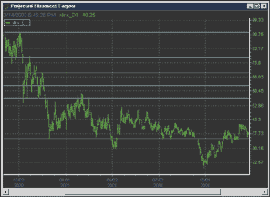

**Figure 8: NeoTicker, Fibonacci ratio using support/resistance
tool.** Here's a sample chart of a Fibonacci projection on Xylan
Corp. in NeoTicker.

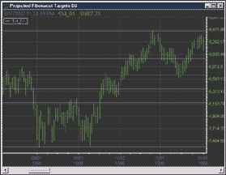

**Figure 9: NeoTicker, projected Fibonacci target using support/resistance
tool.** Here's a sample chart of a Fibonacci projection on the
Dow Jones Industrial Average in NeoTicker.

First, we start with basic Fibonacci lines. To create Fibonacci
lines in NeoTicker, click on the support/resistance tool button in the
toolbar. Move the mouse pointer to point A, left-click and hold the left
mouse button, then drag the mouse pointer to point C. You will get a diagonal
line with a square on one end and a diamond on the other.
You can improve price position accuracy by snapping the square and diamond
to the high and low to the perspective price bar.
The next step is to set the Fibonacci lines. Right-click on the diagonal
line, and select Edit. You will see an S/R setup window. Click on the green
tab, type 0.236 in the box at the bottom, press the + button, and you will
immediately see a line in the chart. Then add the rest of the Fibonacci
ratios: 0.382, 0.5, 0.618, 0, and 1. Then you should see the Fibonacci
lines. You can hide the diagonal line by going to the fan tab and unchecking
the "use fan" checkbox.
Next comes the projection. By using NeoTicker's support resistance
tool, you can easily specify precise ratio and price levels.
When you want the projection on an upswing, you will have to start with
the square end at the low and the diamond at the high.

```
 PFT1 upswing = High of interval + 0.236/0.763 * Price interval of A to B
```

 Since the high of interval is 1 and 0.236/0.763 = 0.310, the
first price projection Fibonacci line is 1.311 of the support and resistance
lines. Now to fill in the rest of the support and resistance lines:

```
PFT2 = 1 + 0.382/0.618 = 1.618
PFT3 = 1 + 0.5/0.5 = 2
PFT4 = 1 + 0.618/0.382 = 2.618
```

Thus, the corresponding lines are 1.618, 2, and 2.618, and you will
see the resulting projections.
The advantage of using support and resistance tools is that after you
construct your first set of Fibonacci projection lines, there is no further
calculation needed. When you want to do analysis on another price range,
you can simply move the group of lines to that range and the support and
resistance tools will maintain the projection ratio.
You can also keep the settings of this projection tool as a template,
so you can simply pull it up later when you want to use it.
To put the projection on a downswing, you can simply drag the diamond
end and put the diamond end at the low and keep the square end on the high.
The *ratio of the Fibonacci will be maintained and there is no additional
calculation needed.*
*--Lawrence Chan, TickQuest Inc.*

*www.tickquest.com*
[GO BACK](https://www.traders.com/Documentation/FEEDbk_docs/2002/05/TradersTips/TradersTips.html#top)


---

## INVESTOR/RT: DAYTRADING STOCK PAIRS

Using Investor/RT, one way to implement the method of daytrading stock
pairs as described in this issue by Mark Conway and Aaron Behle is through
the combination of two daily scans, a custom indicator, and two reference
lines.
The scans would be run each morning to set certain values, including
the volatility bands. The custom indicator would be used to chart the spread.
The reference lines would be used to draw the volatility bands based on
the values set in the scan. The resulting chart can be seen in Figure 10,
with the spread and volatility bands in the lower window pane.

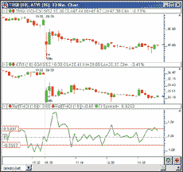

**Figure 10: Investor/RT, stock pairs.** Investor/RT chart showing
10-minute candles of THQI (upper) and ATVI (middle), along with the spread
(green) and volatility bands (red) in the lower pane.

The first scan would have the following syntax:

```
SET(V#2, DV) AND SET(V#3, VOLAT) AND SET(V#4, COR)
```

This scan would accomplish three things through the use of custom
(V#) variables. It would set V#2 to the closing price of the last bar of
yesterday. DV should be set up as "Closing price on a fixed date,"
that date being the previous day's date. V#3 is set to the volatility
of the instrument. V#4 is set to the correlation coefficient of the symbol.
In this case, the correlation coefficient is set up relative to ATVI, as
can be seen in Figure 11.

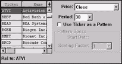

**Figure 11: Investor/RT, stock pairs.** Here is the Investor/RT
correlation coefficient indicator, set up to correlate with the last 30
days of ATVI.

Both the volatility and correlation coefficient are set up using
a period of 30. The scan is run on daily data.
The second scan would have the following syntax:

```
SET(V#5, 100 * 1.5 * ((V#3(ATVI)/100 + V#3(THQI)/100) * 0.063 * (1 - V#4(THQI)))) AND
   SET(V#6, -100 * 1.5 * ((V#3(ATVI)/100 + V#3(THQI)/100) * 0.063 * (1 - V#4(THQI))))
```

This expression looks somewhat complicated, but is actually nothing
more than setting V#5 to the upper volatility band, and V#6 to the lower
volatility band. The multiplication by 100 is used to make the results
easier to scale within the chart. The multiplication by 1.5 represents
1.5 standard deviations. V#3(ATVI) and V#3(THQI) represent the volatility
values we set in the previous scan. They are divided by 100 in order to
provide a decimal result, which the calculation requires. V#4(THQI) represents
the correlation between THQI and ATVI, which was also set in the previous
scan.
The syntax for our spread custom indicator would be as follows:

```
100 * ( (CL / V#2) - (CL(ATVI) / V#2(ATVI)) )
```

Again, the multiplication by 100 is done for scaling considerations.
V#2 represents the closing price of the previous day and was set in the
first scan. CL(ATVI) represents the last (closing) price of ATVI. Since
we are going to add this custom indicator to a chart of THQI, the token
CL will represent the last price of THQI.
We're now ready to add the custom indicator (spread) and two
reference lines (volatility bands) to our chart. They should all three
be added to the same window pane. The custom indicator should be based
on the underlying instrument, THQI. The first reference line should be
set up to "Use V#5" (fourth radio button option down). The
second reference line should be set up to "Use V#6." These
two reference lines (bands), along with the custom indicator (spread),
can be seen in the lower pane of Figure 10.
Once everything is set up, the only operation that will need to be performed
on a daily basis will be the running of the scans to set certain values
that only change once per day. The two scans can be set up to run automatically
on a schedule at a set time each morning before the session opens, or can
be run automatically by simply using a keyboard shortcut. The reference
lines (volatility bands) and custom indicator (spread) will then automatically
reflect the new values that are set as a result of the scan.
This same method can be easily translated for use between any two instruments.
You may want to first do some background work to find instruments that
are closely correlated. This can be done by using the correlation coefficient
token (Cor) in a scan (for example: Cor > 0). Just run a scan which involves
this token, then click on the column title of the resulting Cor column
to quickly sort and find the highest correlations.
 

*--Chad Payne, Linn Software*

*800 546-6842, info@linnsoft.com*

*www.linnsoft.com*
[GO BACK](https://www.traders.com/Documentation/FEEDbk_docs/2002/05/TradersTips/TradersTips.html#top)


---

## TECHNIFILTER PLUS: PROJECTED FIBONACCI TARGETS

Below is a TechniFilter Plus formula for the PFT calculation discussed
in Mohab Nabil's article on projected Fibonacci targets. The formula
uses three parameters. The first parameter is the left-hand price of the
price swing that is being projected. The second parameter is the right-price
of this swing. The third parameter is the Fibonacci value (0.236, 0.382,
0.5, or 0.618).

```
Formula for Projected Fibonacci Targets
NAME: pft
PARAMETERS: 34.25,44.25,0.236
FORMULA: (&3 * &1 - &2) / (&3 - 1)
{ parameter 1: start price
  parameter 2: end price
  parameter 3: Fibanocci value
}
```

 Visit Rtr's website at https://www.rtrsoftware.com to
download this formula as well as program updates.
*--Clay Burch, Rtr Software, Inc.*

*919 510-0608, rtrsoft@aol.com*

*www.rtrsoftware.com*

[GO BACK](https://www.traders.com/Documentation/FEEDbk_docs/2002/05/TradersTips/TradersTips.html#top)


---

## WAVE WI$E: PROJECTED FIBONACCI TARGETS

The following Wave Wi$e formulas calculate Fibonacci retracements. Use
the retracements tool to create the formulas and then paste them into the
spreadsheet. The retracement constants may be changed as desired. Use the
@LAST function if you wish to extend the retracement lines to the end of
the chart.
A sample chart appears in Figure 12.

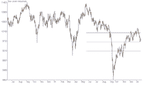

**Figure 12: WAVEWI$E, Fibonacci projections.** Here's
a sample chart of a Fibonacci projection in WAVE WI$E.

```
A: DATE @TC2000(C:\TC2000V3\Data,DJ-30,Dow Jones Industrials,DB)
B: HIGH
C: LOW
D: CLOSE
E: OPEN
F: VOL
G:
H: R382 @FIBRET(A,"05-22-2001",B,"09-21-2001",C, 0.382);@LAST(THISCOL)
I:  R500 @FIBRET(A,"05-22-2001",B,"09-21-2001",C, 0.500);@LAST(THISCOL)
J: R618 @FIBRET(A,"05-22-2001",B,"09-21-2001",C, 0.618);@LAST(THISCOL)
L: ' ==========End Formulas
```

*--Peter Di Girolamo*

*Jerome Technology, 908 369-7503*

*https://members.aol.com/jtiware*

*jtiware@aol.com*

[GO BACK](https://www.traders.com/Documentation/FEEDbk_docs/2002/05/TradersTips/TradersTips.html#top)


---

## BibTeX

```bibtex
@misc{traders_tips_2002_05,
  author = {{Technical Analysis of STOCKS \& COMMODITIES}},
  title = {Traders' Tips: The Center Of Gravity Oscillator},
  howpublished = {online},
  url = {https://www.traders.com/Documentation/FEEDbk_docs/2002/05/TradersTips/TradersTips.html},
  year = {{2002}},
  month = {5}
}
```
