# Zero-Lag Data Smoothers

- **Author:** John F. Ehlers
- **Publication:** Technical Analysis of STOCKS & COMMODITIES, Volume 20, July 2002, pp. 26--31
- **Article URL:** [Article PDF](https://technical.traders.com/archive/article.asp?file=\V20\C07\134ZERO.pdf)
- **Traders' Tips URL:** [Traders' Tips, July 2002](https://www.traders.com/Documentation/FEEDbk_docs/2002/07/TradersTips/TradersTips.html)

---

*Now With Less Lag*

*Here's a technique that can reduce lag to nearly zero.*

A causal filter can never predict the future. As a matter of fact, the laws of nature demand that all filters must have lag. However, if we assume steady-state conditions — that is, no new, disturbing events — there are techniques we can use to reduce the lag of these filters to nearly zero. It turns out that such filters are useful for technical analysts with which to smooth data, and perhaps create some fast-acting indicators. This is possible because the steady-state assumptions are almost, but not quite, satisfied in the short run. These techniques are not applicable to longer moving averages, because steady-state conditions do not continue over a long time span. There are superior techniques for creating longer-term averages, such as nonlinear filters or by removing undesirable cycling components from a composite price waveform.

Engineers would describe the zero-lag process as the placement of a zero in the filter transfer response such that the rate change of phase at zero frequency is zero. Traders, on the other hand, would understand the zero-lag effect as a relationship between the lag of a moving average and momentum.

In Figure 1, the solid line represents a steady-state price movement, and the dashed line represents a moving average of the price lagging by *N* bars. The lag is the horizontal span. An *N*-bar momentum has the vertical span as shown. By adding the *N*-bar momentum to the moving average, you can recreate the original price movement. In this way, you can create a zero-lag moving average.

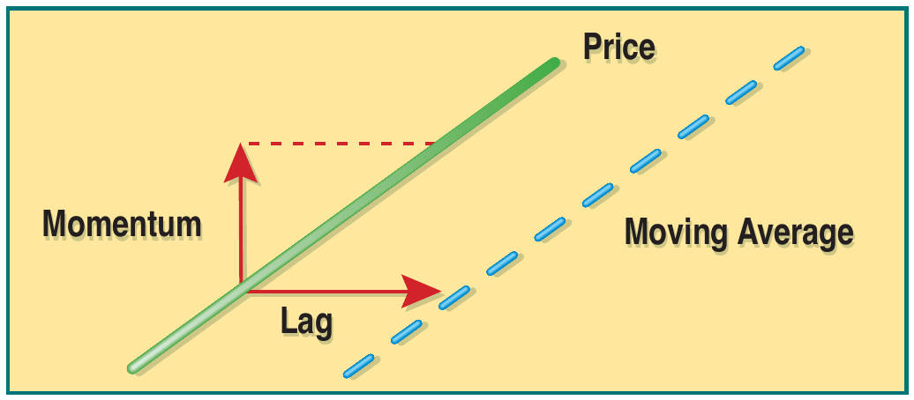
**FIGURE 1: STEADY STATE LAG COMPENSATION.** Here you see the relationship between price and moving average.

## Applying Filters

Lag compensation can be applied to either finite impulse response (FIR) filters like simple moving averages or to infinite impulse response (IIR) filters like exponential moving averages. I will apply the lag compensation technique to both types of filters, but first let's review a little filter theory. The data used in trading is sampled data. This data is only received once an hour, once a day, once a week, and so on. One theory of sampled data is that the highest frequency that can be analyzed is at half the sampling frequency. If you are using daily bars, then the shortest period or the highest frequency is a two-bar cycle. This highest frequency is called the *Nyquist* frequency, and it is convenient to normalize all analysis to this frequency. The generalized equation relating the normalized frequency to cycle period is:

$$\text{Freq} = 2 / \text{Period}$$

or, conversely:

$$\text{Period} = 2 / \text{Freq}$$

Hence, a two-bar cycle has a normalized frequency of one, a four-bar cycle has a normalized frequency of 0.5, an eight-bar cycle has a normalized frequency of 0.2, and so on. An exponential moving average works by taking a fraction of the current price and adding it to the quantity 1 minus the fraction multiplied by the previous filter output. The equation for an exponential moving average is:

$$\text{Filt} = \alpha \cdot \text{Price} + (1 - \alpha) \cdot \text{Filt}[1]$$

where α is the fraction and [1] indicates that function of one bar ago.

By writing it this way, you are assured that the two coefficients will sum to unity. The coefficient sum to unity is mandatory if the filter is to converge. For example, assume the price has been zero for a long time and then jumps to a value of 1. The filter output after the jump at the input will be α on the first sample. On the next sample the filter output will be α + α\*(1 − α). Eventually, the filter output will converge to be near unity.

## Measuring Lag

The lag of an exponential moving average is calculated using the following formula:

$$\text{Lag} = 1/\alpha - 1$$

Suppose α = 0.2. In this case, the lag is four bars. The equation for the usual exponential moving average (EMA) is:

$$\text{Filt} = 0.2 \cdot \text{Price} + 0.8 \cdot \text{Filt}[1]$$

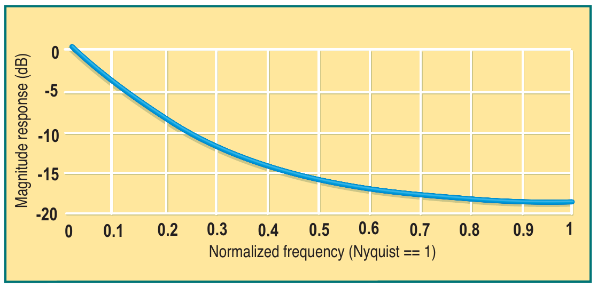
**FIGURE 2: EMA AMPLITUDE RESPONSE, α = 0.2.** The greatest lag occurs at zero frequency.

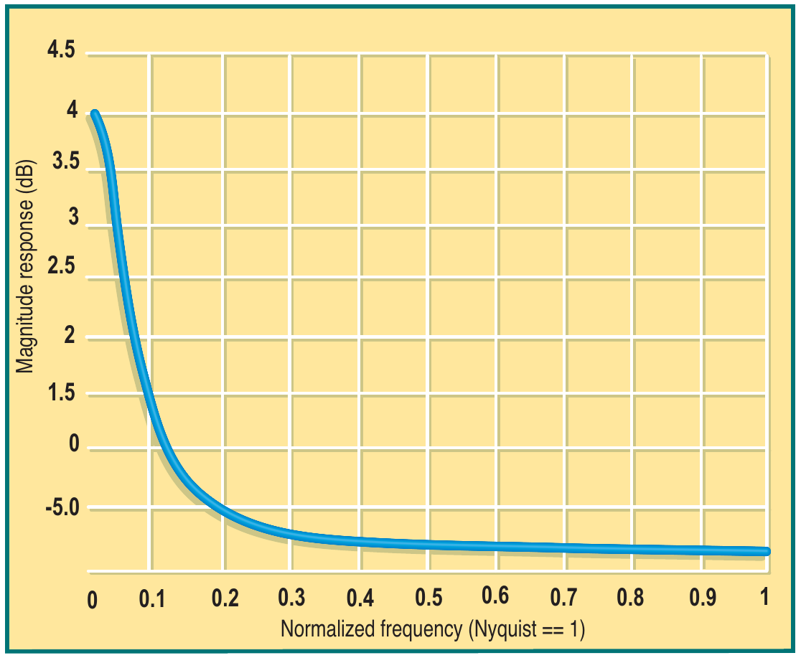
**FIGURE 3: EMA LAG RESPONSE, α = 0.2.** Here also the greatest lag occurs at zero frequency.

Figure 2 displays the amplitude response of the original EMA as a function of frequency. Figure 3 shows its lag as a function of frequency. Note the greatest lag occurs at zero frequency. Lag at frequencies where the output amplitude is attenuated is unimportant, because small amplitudes make little contribution to the output.

To obtain zero lag, we must add a four-bar momentum to the input because the lag of the original EMA is four bars. The equation then becomes:

$$\text{Filt} = 0.2 \cdot (\text{Price} + (\text{Price} - \text{Price}[4])) + 0.8 \cdot \text{Filt}[1]$$
$$= 0.2 \cdot (2 \cdot \text{Price} - \text{Price}[4]) + 0.8 \cdot \text{Filt}[1]$$

In contrast, Figure 4 shows the amplitude response of the IIR zero-lag data smoother and Figure 5 shows its lag as a function of frequency. The zero-frequency lag has been reduced to zero. The gain, or amplification, of in-band frequencies is unavoidable. The gain can be reduced, but only at the expense of adding lag again. The gain contributes to overshoot at turning points in price. You will see that this small increase in gain is tolerable in practical usage.

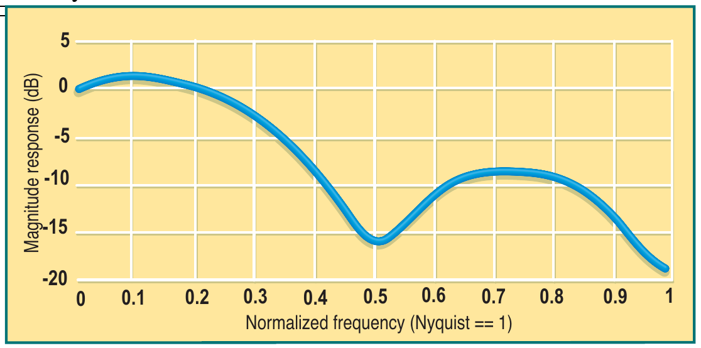
**FIGURE 4: ZERO-LAG IIR FILTER AMPLITUDE RESPONSE, α = 0.2.** The zero frequency lag has been reduced to zero.

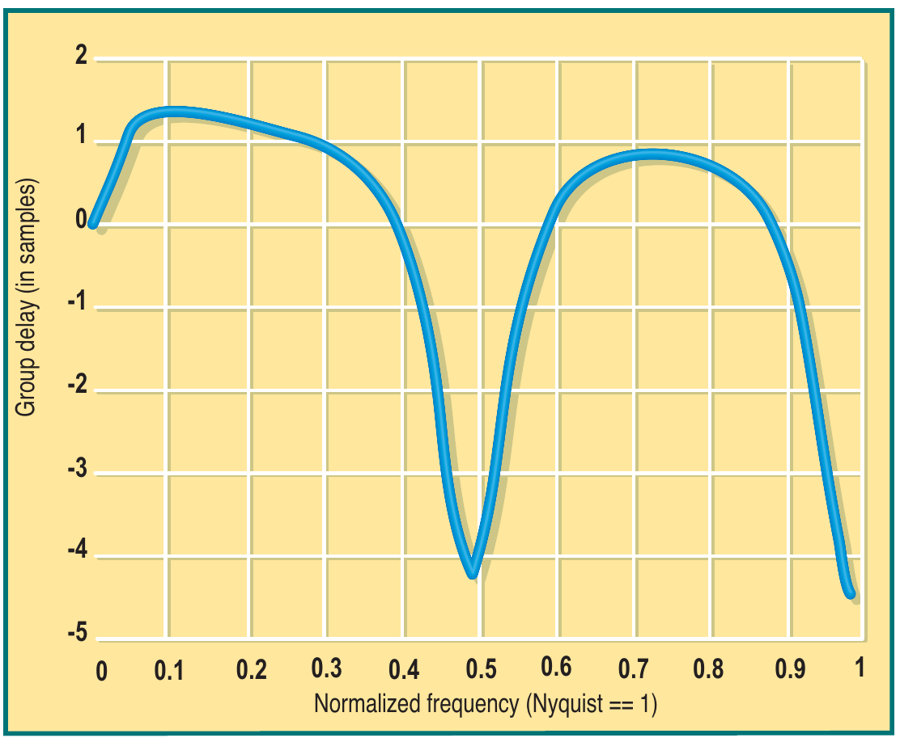
**FIGURE 5: ZERO-LAG IIR FILTER LAG RESPONSE, α = 0.2.** Here again, the zero frequency lag has been reduced to zero.

My favorite FIR filter is:

$$\text{Filt} = (\text{Price} + 2 \cdot \text{Price}[1] + 3 \cdot \text{Price}[2] + 3 \cdot \text{Price}[3] + 2 \cdot \text{Price}[4] + \text{Price}[5]) / 12$$

It's my favorite because it nulls out the two-bar, three-bar, and four-bar cycle components that are present in the input price. The amplitude response of this filter is shown in Figure 6. An FIR filter is a linear phase filter, and lag is defined as the rate change of phase as a function of frequency. This means that FIR filters have the same lag at all frequencies, and this lag is (*N*−1)/2 for an *N*-element FIR filter. Since my favorite filter has six elements, its lag is 2.5 bars.

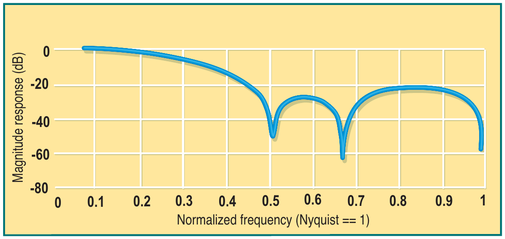
**FIGURE 6: SIX-ELEMENT FIR FILTER AMPLITUDE RESPONSE.** This is a linear phase filter that has the same lag at all frequencies.

My favorite filter is six bars long, and I prefer not to extend its length by another 2.5 bars when the momentum is computed. So, I will do the equivalent by multiplying a one-bar momentum by 2.5. This is valid because steady-state conditions are assumed. We perform the calculations to compute the filter coefficients as shown in Figure 7, which is equivalent to an Excel spreadsheet. Column 1 lists the coefficients of my favorite filter. Column 2 contains these same coefficients delayed by one bar. Column 3 shows the one-bar momentum, obtained by subtracting column 2 from column 1 for rows that contain coefficients in column 2. Column 4 is column 3 multiplied by 2.5. The final filter coefficients can be seen in column 5 as the sum of the filter and the multiplied momentum (columns 1 and 4).

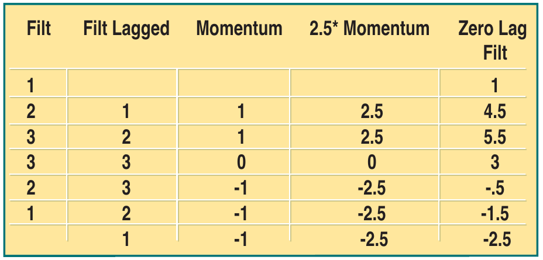
**FIGURE 7: COMPUTING ZERO-LAG FIR FILTER COEFFICIENTS.** As you can see, the calculations can be done on a spreadsheet.

| Filt | Filt Lagged | Momentum | 2.5\*Momentum | Zero Lag Filt |
|------|-------------|----------|---------------|---------------|
| 1    |             |          |               | 1             |
| 2    | 1           | 1        | 2.5           | 4.5           |
| 3    | 2           | 1        | 2.5           | 5.5           |
| 3    | 3           | 0        | 0             | 3             |
| 2    | 3           | −1       | −2.5          | −0.5          |
| 1    | 2           | −1       | −2.5          | −1.5          |
|      | 1           | −1       | −2.5          | −2.5          |

Several bad things happen to my favorite filter when we reduce its lag, as shown in Figure 8. First, the notch rejection of the two-bar, three-bar, and four-bar cycles disappears. Second, the out-of-band attenuation is generally decreased. Third, there is a substantial increase in the in-band gain. This gain contributes to overshoots in the transient areas, but this is the price that must be paid to obtain zero lag.

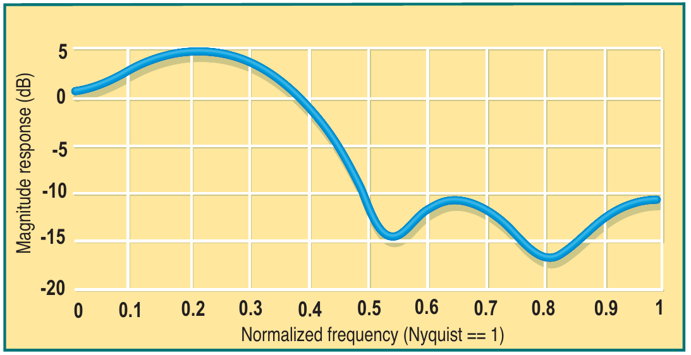
**FIGURE 8: ZERO-LAG FIR FILTER AMPLITUDE RESPONSE.** When the lag is reduced, notch rejection of the cycles disappears, out-of-band attenuation decreases, and the inband gain is increased.

From experience, I know that the in-band gain will result in too much overshoot. There are techniques that can be used to reduce in-band gain, but once again, they introduce more lag. As an alternative, we can simply be a little less aggressive in the elimination of lag. If you multiply momentum by 1.5 instead of 2.5, you will theoretically obtain a lag of one bar. This calculation is displayed in Figure 9, and the response of this filter is displayed in Figure 10. Note that by being less aggressive you have both reduced the in-band gain and increased the rejection band attenuation (but you have still eliminated the notching of the two-, three-, and four-bar cycles). Figure 11 shows the zero-frequency lag is one bar, as predicted. The resulting equation for the minimum-lag FIR filter is:

$$\text{Filt} = (\text{Price} + 3.5 \cdot \text{Price}[1] + 4.5 \cdot \text{Price}[2] + 3 \cdot \text{Price}[3] + 0.5 \cdot \text{Price}[4] - 0.5 \cdot \text{Price}[5] - 1.5 \cdot \text{Price}[6]) / 10.5$$

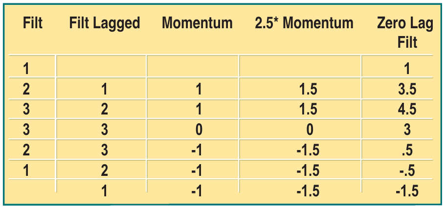
**FIGURE 9: COMPUTING MINIMUM-LAG FIR FILTER COEFFICIENTS.** Multiplying momentum by 1.5 will reduce the lag.

| Filt | Filt Lagged | Momentum | 1.5\*Momentum | Zero Lag Filt |
|------|-------------|----------|---------------|---------------|
| 1    |             |          |               | 1             |
| 2    | 1           | 1        | 1.5           | 3.5           |
| 3    | 2           | 1        | 1.5           | 4.5           |
| 3    | 3           | 0        | 0             | 3             |
| 2    | 3           | −1       | −1.5          | 0.5           |
| 1    | 2           | −1       | −1.5          | −0.5          |
|      | 1           | −1       | −1.5          | −1.5          |

The filter is divided by 10.5 to normalize its output amplitude to the sum of the coefficients, providing zero gain at zero frequency.

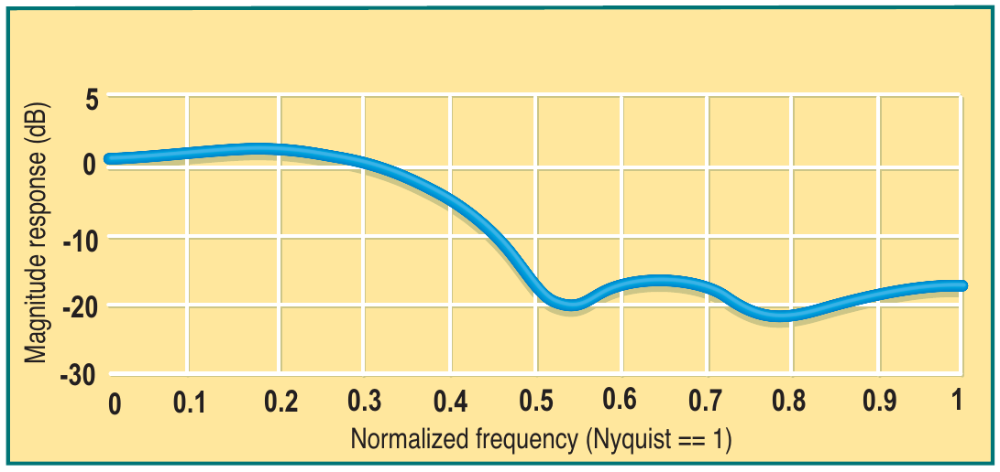
**FIGURE 10: MINIMUM LAG FIR FILTER LAG RESPONSE.** Here you see the results of reducing the lag to one bar.

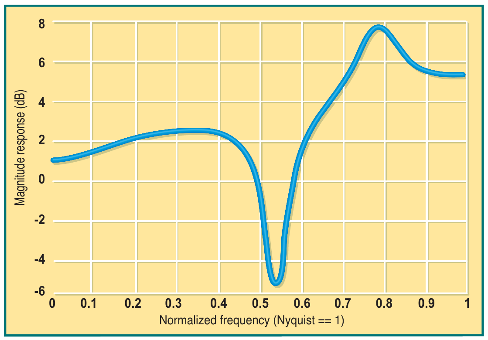
**FIGURE 11: LAG RESPONSE OF THE MINIMUM LAG FIR FILTER.** The zero frequency lag is, as predicted, one bar.

The real test of the data smoothers is how they perform on real data. In Figure 12 the average of the high and low of each price bar is smoothed. The IIR smoother is plotted in red and the FIR smoother is plotted in blue. They are virtual overlays in their performance. We know the passband frequency is lower for the IIR smoother by comparing where the responses cross zero gain in Figures 4 and 10. In addition, the IIR smoother has a theoretical zero frequency lag. For these reasons, and because it is easy to calculate, the IIR smoother is generally preferable.

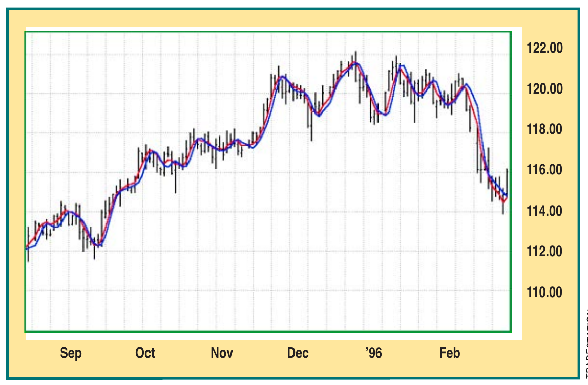
**FIGURE 12: IIR AND FIR DATA SMOOTHERS.** Note both provide nearly identical responses.

---

*John Ehlers is an electrical engineer working in electronic research and development and has been a private trader since 1978. He is a pioneer in introducing maximum entropy spectrum analysis to technical traders through his MESA software.*

## Suggested Reading

- Ehlers, John [2002]. "Center Of Gravity Oscillator," *Technical Analysis of STOCKS & COMMODITIES*, Volume 20: May.
- _____ [2002]. *Trading Market Cycles*, 2nd ed., John Wiley & Sons.
- _____ [2001]. *Rocket Science For Traders*, John Wiley & Sons.

---

## BibTeX

```bibtex
@article{ehlers_zero_lag_2002,
  author    = {John F. Ehlers},
  title     = {Zero-Lag Data Smoothers},
  journal   = {Technical Analysis of STOCKS \& COMMODITIES},
  volume    = {20},
  number    = {7},
  pages     = {26--31},
  year      = {2002},
  month     = jul,
  url       = {https://technical.traders.com/archive/article.asp?file=\V20\C07\134ZERO.pdf}
}

@misc{traders_tips_2002_07,
  author       = {{Technical Analysis of STOCKS \& COMMODITIES}},
  title        = {Traders' Tips: Zero-Lag Data Smoothers, July 2002},
  howpublished = {online},
  year         = {2002},
  month        = jul,
  url          = {https://www.traders.com/Documentation/FEEDbk_docs/2002/07/TradersTips/TradersTips.html}
}
```
