# Traders' Tips — July 2002

Article reference: "Zero-Lag Data Smoothers" by John F. Ehlers, *Technical Analysis of Stocks & Commodities*, July 2002.

Traders' Tips URL: <https://www.traders.com/Documentation/FEEDbk_docs/2002/07/TradersTips/TradersTips.html>

---

## MetaStock

In "Zero-Lag Data Smoothers" in this issue, John Ehlers
introduces two new filters, the infinite impulse response (IIR) filter
and finite impulse response (FIR) filter. These filters can be easily recreated
in MetaStock 6.52 or higher.

To create a filter in MetaStock, select Indicator Builder from the Tools
menu, click New, enter the code for the filters, and then click OK. Repeat
for the remaining filters.

**Name: zero-lag IIR filter**

```
formula:
pds:=Input("number of periods",1,20,5);
x:=2/(pds+1);
xl:=LastValue((1/x)-1);
(x*((2*C)-Ref(C,-xl))) +((1-x)*PREV)
```

**Name: zero-lag FIR filter**

```
formula:
(C + (3.5*Ref(C,-1)) +
(4.5*Ref(C,-2)) + (3*Ref(C,-3)) +
(.5*Ref(C,-4)) - (.5*Ref(C,-5)) - (1.5*Ref(C,-6))) / 10.5
```

To plot the indicator, locate it in MetaStock's Indicator
Quicklist, then click and drag it onto the desired chart.

 If you have questions creating an indicator, call us at 801 265-9998
or e-mail us at support@equis.com.

*--William Golson, Equis International, Inc. 
www.equis.com*

[GO BACK](https://www.traders.com/Documentation/FEEDbk_docs/2002/07/TradersTips/TradersTips.html#top)

---

## TradeStation

In his article this issue on zero-lag smoothing, John Ehlers notes that
his favorite filter is the symmetrically weighted six-bar finite impulse
response (FIR) filter. This is also known as a triangular moving average,
and can be conveniently implemented as a double-smoothed simple moving
average. We provided the code for such a function in the January 2002 Traders'
Tips, and it is reproduced here as well. To plot this as an indicator,
first import this code into TradeStation, and then apply the built-in Custom
1 Line indicator with the formula input set to TriAverage_gen( Close, 6
).

Per Ehlers, since this filter has six elements, its lag is 2.5 bars.
Via further processing, this lag can be reduced to zero, but this produces
too much overshoot. As a compromise, Ehlers suggests reducing the lag to
one bar. To enable a user to adjust the lag easily, we provide the EasyLanguage
code for an Adjustable Lag Fltr indicator below. The first input, Price,
should typically be set to Close. The second input, LagReduction, should
be set to a value in the zero-to-2.5 range. Setting it to zero will result
in no adjustment, and the output will match that of the raw triangular
average. Setting it to 2.5 will reduce the lag to zero. Setting it to 1.5
will reduce the lag to one bar.

**Indicator: Adjustable Lag Fltr**

```
inputs:
 Price( Close ),
 LagReduction( 1.5 ) ;
variables:
 Numerator( 0 ),
 Denominator( 0 ),
 Filter( 0 ) ;
arrays:
 Coeff[7]( 0 ) ;
if CurrentBar = 1 then
 begin
 Coeff[1] = 1 ;
 Coeff[2] = 2 + LagReduction ;
 Coeff[3] = 3 + LagReduction ;
 Coeff[4] = 3 ;
 Coeff[5] = 2 - LagReduction ;
 Coeff[6] = 1 - LagReduction ;
 Coeff[7] = 0 - LagReduction ;
 Denominator = SummationArray( Coeff, 7 ) ;
 end ;
Numerator = 0 ;
for Value1 = 1 to 7
 begin
 Numerator =
  Numerator + Coeff[Value1] * Price[ Value1 - 1 ] ;
 end ;
Filter = Numerator / Denominator ;
Plot1( Filter ) ;
```

**Function: TriAverage_gen**

 

```
inputs:
 Price( numericseries ),
 Length( numericsimple ) ;
variables:
 Length1( 0 ),
 Length2( 0 ) ;
Length1 = Floor( ( Length + 1 ) * .5 ) ;
Length2 = Ceiling( ( Length + 1 ) * .5 ) ;
TriAverage_gen =
Average( Average( Price, Length1 ), Length2 ) ;
```

The EasyLanguage code presented here will also be available for
download at www.tradestation2000i.com. Select Support -> EasyLanguage ->
Strategies and Indicators -> Traders Tips, and look for the file AdjustableLagFltr.Els.

*--Ramesh Dhingra*

*Director, EasyLanguage Consulting*

*TradeStation Technologies, Inc. (formerly Omega Research, Inc.)*

*a wholly owned subsidiary of TradeStation Group, Inc.*

*www.TradeStation.com*

[GO BACK](https://www.traders.com/Documentation/FEEDbk_docs/2002/07/TradersTips/TradersTips.html#top)

---

## AIQ Systems

Here is the EDS code for implementing John Ehlers' finite impulse
response (FIR) filter in AIQ TradingExpert (Figure 1).

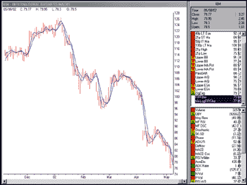

**Figure 1: AIQ TradingExpert.** Here's a sample chart
of John Ehlers' finite impulse response (FIR) filter plotted in
AIQTradingExpert.

```
Price is [close].
Price1 is val([close], 1).
Price2 is val([close], 2).
Price3 is val([close], 3).
Price4 is val([close], 4).
Price5 is val([close], 5).
Price6 is val([close], 6).
FIRFilter is (Price + 2 * Price1 + 3 * Price2 + 3 * Price3 +
 2 * Price4 + Price5) / 12.
MinLagFIRFilter is (Price + 3.5 * Price1 + 4.5 * Price2 + 3 *
 Price3 + 0.5 * Price4 - 0.5 * Price5 - 1.5 * Price6) / 10.5.
```

*--AIQ Systems*

*www.aiqsystems.com*

[GO BACK](https://www.traders.com/Documentation/FEEDbk_docs/2002/07/TradersTips/TradersTips.html#top)

---

## eSignal

The new eSignal 7.0 offers an advanced charting window and a formula
studies language. Using the eSignal Formula Script (ERS) language, which
uses pure JavaScript, you can develop your own indicators right in the
eSignal editor. EFS offers flexibility, as it allows you to write sophisticated
indicators using loops (for/next, do/while), a multitude of variables,
and even call other indicators.

Here is the formula for John Ehlers' finite impulse response
(FIR) indicator in ERS. Following that is the code for John Ehlers'
infinite impulse response (IIR) indicator in EFS. Figure 2 is a sample
eSignal chart displaying the FIR indicator. Figure 3 is a sample eSignal
chart displaying the IIR indicator.

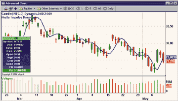

**Figure 2: eSIGNAL, finite impulse response filter.**Here
is a demonstration of the finite impulse response indicator on a historical
chart of Intel. This is an example of a custom formula in eSignal that
can be written and modified in any text editor.

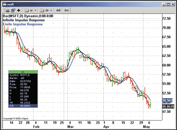

**Figure 3: eSIGNAL, infinite impulse response filter.**This plots
the infinite impulse response indicator on a historical chart of Microsoft.

/********************************************************************************

Description:  This formula plots the Finite Impulse Response

Provided By: This formula was created in the eSignal Formula Editor

Copyright 2002 eSignal, A division of Interactive Data Corporation

*********************************************************************************/

```
function preMain() {
 setPriceStudy(true);
 setCursorLabelName("FIR");
 setStudyTitle("Finite Impulse Response");
 setDefaultBarFgColor(Color.blue);
 setDefaultBarThickness(2);
}
function main() {
 var vPrice = close(0, -7);
 if(vPrice == null)
  return;
 // Ehlers' Favorite FIR filter
 // var vRet = (vPrice[0] + 2*vPrice[1] + 3*vPrice[2] + 3*vPrice[3]
 // + 2*vPrice[4] + vPrice[5]) / 12;

 // Formula for the minimum lag FIR filter.
 var vRet = (vPrice[0] + 3.5*vPrice[1] + 4.5*vPrice[2] + 3*vPrice[3]
 + 0.5*vPrice[4] - 0.5*vPrice[5] - 1.5*vPrice[6]) / 10.5;
 return vRet;
}
```


/********************************************************************************

Description:  This formula plots the Infinite Impulse Response

Provided By: This formula was created in the eSignal Formula Editor

Copyright 2002 eSignal, A division of Interactive Data Corporation

*********************************************************************************/

```
function preMain() {
    setPriceStudy(true);
 setCursorLabelName("IIR");
 setStudyTitle("Infinite Impulse Response");
 setDefaultBarFgColor(Color.black);
 setDefaultBarThickness(2);
}
function main() {
 var vPrice = close(0, -5);
 var vRef = ref(-1);
 if(vPrice == null)
  return;
 if(vRef == null) {
  return vPrice[0];
 } else {
  return 0.2 * (2 * vPrice[0] - vPrice[4]) + 0.8 * vRef;
 }
}
```

*--eSignal, a division of Interactive Data Corp.*

*510 723-1720, www.esignal.com*

[GO BACK](https://www.traders.com/Documentation/FEEDbk_docs/2002/07/TradersTips/TradersTips.html#top)

---

## Investor/RT

Linn Software has just added a zero-lag option to the exponential moving
average indicator in Investor/RT. This option is based on the infinite
impulse filter (IIF) described by John Ehlers in his article in this issue,
"Zero-Lag Data Smoothers."

Figure 4 shows the preferences for the exponential moving average, including
the checkbox called "Zero Lag."

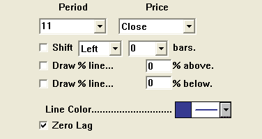

**Figure 4: Investor/RT.** Here's a dialog showing the Investor/RT
preferences for the exponential moving average with zero lag.

The period specified may be any integer of decimal number. The equation
for computing the zero-lag exponential average follows:

```
EMA = K * ( 2 * PRICE - PRICE.X) + (1 - K) * EMA.1
where:
 K = 2 / (N + 1)
 N = Period
 PRICE.X = Price X bars back
 X = lag = (N - 1) / 2
```

Figure 5 is an Investor/RT chart showing the zero-lag EMA, a zero-lag
MACD, along with a comparison of the zero-lag EMA with several other average
types.

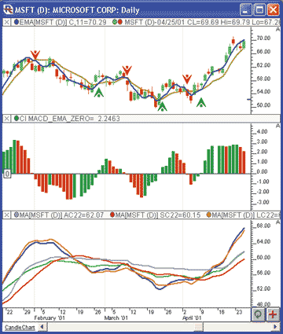

**Figure 5: Investor/RT.** Here's an Investor/RT chart displaying
John Ehlers' zero-lag EMA (11-period in blue, 22-period in gold)
in the top pane, zero-lag MACD in the middle pane, and a comparison of
different averages in the bottom pane (zero-lag EMA in blue, adaptive in
purple, EMA in green, simple in red, and least-squares in orange).

The upper pane shows buy and sell signals when the short-term (11-period)
and long-term (22-period) zero-lag EMAs cross. When the short-term crosses
above the long-term, a buy signal is indicated with a green up arrow ("signal
marker"). When the short-term indicator crosses below the long-term
one, a sell signal is indicated with a red down arrow.

The middle pane shows a custom indicator, drawn as a histogram, that
represents the difference between the long- and short-term moving averages.
The syntax for this custom indicator follows:

```
EMAa - EMAb
```

where EMAa is an 11-period zero-lag EMA, and EMAb is a 22-period
zero-lag EMA.

In the lower window pane, five different moving averages are compared,
including zero-lag EMA in blue, adaptive in purple, EMA in green, simple
in red, and least-squares in orange. Investor/RT offers 17 different smoothing
options.

*--Chad Payne, Linn Software*

*800 546-6842, info@linnsoft.com*

*www.linnsoft.com*

[GO BACK](https://www.traders.com/Documentation/FEEDbk_docs/2002/07/TradersTips/TradersTips.html#top)

---

## NeuroShell Trader

John Ehlers' zero-lag data smoother can be easily implemented
in NeuroShell Trader by combining a few of NeuroShell Trader's 800+
indicators. We combined the Add, Divide, and Lag indicators to recreate
Ehlers' zero-lag data smoother. NeuroShell Trader users can download
it from the NeuroShell Trader free technical support website.

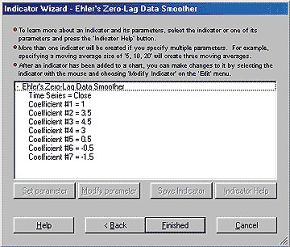

**Figure 6: NeuroShell Trader.** This shows the process of adding
the Ehlers zero-lag data smoother using NeuroShell Trader's Indicator
Wizard.

After downloading the custom indicator, you can insert it (Figure
6) by doing the following:

1. Select "**New Indicator**..." from the **Insert**
menu.

2. Select the **Custom Indicator** category.

3. Select "**Ehlers' Zero-Lag Data Smoother**."

4. Select the parameters you desire (we've set the default as
the same parameters that Ehlers selected).

5. Select "**Finished**" and view the results on your
chart (Figure 7).

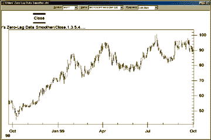

**Figure 7: NeuroShell Trader.** This NeuroShell Trader chart
displays the Ehlers zero-lag data smoother.


If you decide to use this indicator in a prediction or a trading strategy,
the coefficients can be optimized by the genetic algorithm built into NeuroShell
Trader Professional. Optimization can provide you with your own custom
version of Ehlers' zero-lag data smoother that best fits your data.

For more information on NeuroShell Trader, visit our website or call
301 662-7950.

*--Marge Sherald, Ward Systems Group, Inc.*

*www.neuroshell.com*

[GO BACK](https://www.traders.com/Documentation/FEEDbk_docs/2002/07/TradersTips/TradersTips.html#top)

---

## NeoTicker

In "Zero-Lag Data Smoothers" in this issue, John Ehlers
applied a six-bar-long minimum-lag finite impulse response (FIR) filter
to a data series. This can be easily recreated in NeoTicker using NeoTicker's
formula language indicator.

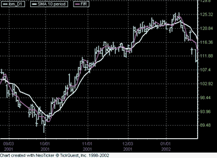

**Figure 8: NeoTicker.** Here's a sample chart of John Ehlers'
FIR filter plotted in NeoTicker.

To recreate the FIR filter formula indicator in NeoTicker, you have
to create and set up a NeoTicker formula indicator and type in one line
(Listing 1). Then apply this indicator on a data series (Figure 8). The
result will be a minimum-lag finite impulse response filter.

**Listing 1**

```
Plot1 := (data1 + 3.5* data1(1) + 4.5* data1(2) + 3* data1(3)
+ 0.5* data1(4) - 0.5* Data1(5) - 1.5* data1(6))/10.5
```

This indicator will also be available from the NeoTicker Yahoo user
group at https://groups.yahoo.com/group/neoticker.

*--Kenneth Yuen, TickQuest Inc.*

*www.tickquest.com*

[GO BACK](https://www.traders.com/Documentation/FEEDbk_docs/2002/07/TradersTips/TradersTips.html#top)

---

## TradingSolutions

In his article on "Zero-Lag Data Smoothers" in this issue,
John Ehlers presents minimal-lag versions of infinite impulse response
(IIR) and finite impulse response (FIR) filters.

The zero-lag version of the exponential moving average (EMA) can be
represented in two different ways. One version is a literal translation
of the formula, requiring the precalculation of the lag. The second version
calculates the lag automatically.

**Zero-Lag IIR (Manual Lag)**

```
Inputs: Price, Alpha, Lag of Average
Add (Mult (Alpha,Sub (Mult (2,Price),Lag (Price,Lag of Average))),
Mult (Sub (1,Alpha),Prev (1)))
where Lag of Average should be set to 1/Alpha - 1
```

**Zero-Lag IIR (Auto Lag)**

```
Inputs: Price, Alpha
Add (Mult (Alpha,Sub (Mult (2,Price),LagVL (Price,Sub (Div (1,Alpha),1),20))),
Mult (Sub (1,Alpha),Prev (1)))
```

Notice that the Variable Length Lag function is used to allow the
calculation of the length of the lag in the function. The maximum lag is
set to 20, allowing alpha to be as low as 0.05. Lower values of alpha can
be used by increasing the maximum lag in the function.

John Ehlers' FIR filter (which he states he favors) and the minimum-lag
version of that filter can be represented in TradingSolutions as follows:

**Ehlers' FIR (Original)**

```
Inputs: Price
Div (Add (Add3 (Price,Mult (2,Lag (Price,1)),Mult (3,Lag (Price,2))),
Add3 (Mult (3,Lag (Price,3)),Mult (2,Lag (Price,4)),Lag (Price,5))),12)
```

**Ehlers' FIR (Minimum Lag)**

```
Inputs: Price
Div (Add (Add3 (Price,Mult (3.5,Lag (Price,1)),Mult (4.5,Lag (Price,2))),
Add3 (Mult (3,Lag (Price,3)),Mult (0.5,Lag (Price,4)),
Add (Mult (-0.5,Lag (Price,5)),Mult (-1.5,Lag (Price,6))))),10.5)
```

These functions are available in a function file that can be downloaded
from the TradingSolutions website in the Solution Library section. They
can then be imported into TradingSolutions using "Import Functions..."
from the File menu. Figure 9 shows a TradingSolutions chart comparing the
zero-lag IIR, John Ehlers' original FIR, and minimum-lag FIR to
an exponential moving average.

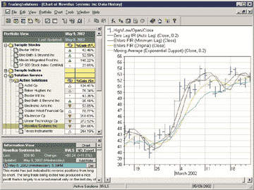

**Figure 9: TradingSolutions.** Here's a sample chart comparing
the zero-lag IIR, John Ehlers' original FIR, and minimum-lag FIR
to an exponential moving average in TradingSolutions.

It is also worth noting that filtering functions like these often
make good inputs to neural network predictions, especially in data where
strong trends are present. When using it as an input to a prediction, you
will typically want to set the preprocessing to "percent change,"
or calculate the percent difference between the current price and the value
of the filter.

*--Gary Geniesse, NeuroDimension, Inc.*

*800 634-3327, 352 377-5144*

*www.tradingsolutions.com*

[GO BACK](https://www.traders.com/Documentation/FEEDbk_docs/2002/07/TradersTips/TradersTips.html#top)

---

## Wealth-Lab

The IIR and FIR data smoothers, as described by John Ehlers in this
issue, are available as custom indicators on the Wealth-Lab.com website
and Wealth-Lab Developer 2.1. To install the indicators into WLD2.1, select
Community/Download ChartScripts from the main menu. This facility lets
you download scripts that have been recently submitted by the Wealth-Lab
community. You should increase the minimum number of days from the default
of 7 to be sure that older scripts are included in the download (Figure
10).

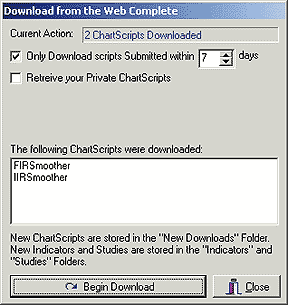

**Figure 10: Wealth-Lab.** Here's how to download scripts
into Wealth-Lab from the Wealth-Lab website.

Once installed, you can treat them as any other indicator. You can
plot them on your charts using the "Plot Indicator" button
of the Indicators List (Figure 11), and you can use them in your custom
trading system rules.

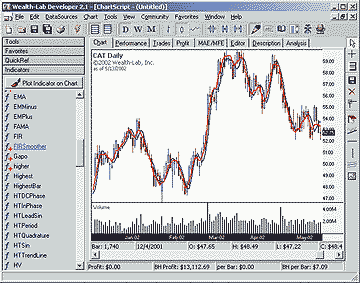

**Figure 11: Wealth-Lab.** Here's a sample chart of John Ehlers'
IIR and FIR indicators plotted in Wealth-Lab.

*--Dion Kurczek, Wealth-Lab, Inc.*

*www.wealth-lab.com*

[GO BACK](https://www.traders.com/Documentation/FEEDbk_docs/2002/07/TradersTips/TradersTips.html#top)

---

## SmarTrader

In "Zero-Lag Data Smoothers" in this issue, John Ehlers
presents a series of formulas designed to smooth data. We focused on the
final version given at the end of the article.

Since the price used in the formula is an average of the high and low,
we first create a SmarTrader user formula that sums the high and low prices
for the bar and then divides by 2, creating a median price for the bar.
In our example, a bar is 15 minutes in an intraday chart of the Dow Jones
Industrial Average.

Then we constructed a user row for the actual smoothing formula for
the FIR filter given at the end of the article. Note that a minus sign
is used within the square brackets to indicate a backward reference.

The SmarTrader specsheet for the FIR filter is shown in Figure 12. A
sample chart is shown in Figure 13.

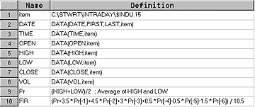

**Figure 12: SmarTrader.** Here is the specsheet for the finite
impulse response (FIR) filter.

 

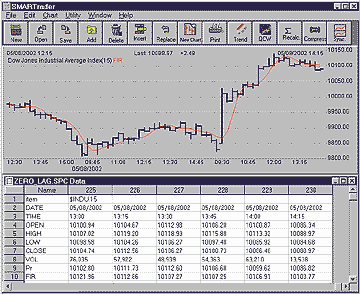

**Figure 13: SmarTrader.**Here is the finite impulse response (FIR)
filter as plotted in SmarTrader.


CompuTrac SNAP users can also implement this formula by omitting the minus
inside the square brackets.

*--Jim Ritter, Stratagem Software*

*504 885-7353, Stratagem1@aol.com*

[GO BACK](https://www.traders.com/Documentation/FEEDbk_docs/2002/07/TradersTips/TradersTips.html#top)

---

## TechniFilter Plus

Here are the TechniFilter Plus formulas for the two zero-lag averages
discussed by John Ehlers in his article in this issue, "Zero-Lag
Data Smoothers."

**Formula for zero-lagged EMA**

```
NAME: LaggedEMA
SWITCHES: recursive
PARAMETERS: .2
INITIAL VALUE: C
FORMULA: (2 * C - CY4) * (&1) + (1 - &1) * TY1
```

**Formula for zero-lagged FIR**

```
NAME: FIR
FORMULA: ( C + 2*CY1 + 3*CY2 + 3*CY3 + 2*CY4 + CY5 ) / 12
```


 Visit RTR's website to download these formulas as well as
program updates.

*--Clay Burch, RTR Software*

*919 510-0608, rtrsoft@aol.com*

*www.rtrsoftware.com*

[GO BACK](https://www.traders.com/Documentation/FEEDbk_docs/2002/07/TradersTips/TradersTips.html#top)

---

## BibTeX

```bibtex
@online{traderstips2002jul,
  title   = {Traders' Tips --- July 2002},
  journal = {Technical Analysis of Stocks \& Commodities},
  year    = {2002},
  month   = jul,
  url     = {https://www.traders.com/Documentation/FEEDbk_docs/2002/07/TradersTips/TradersTips.html},
  urldate = {2025-01-01}
}
```
