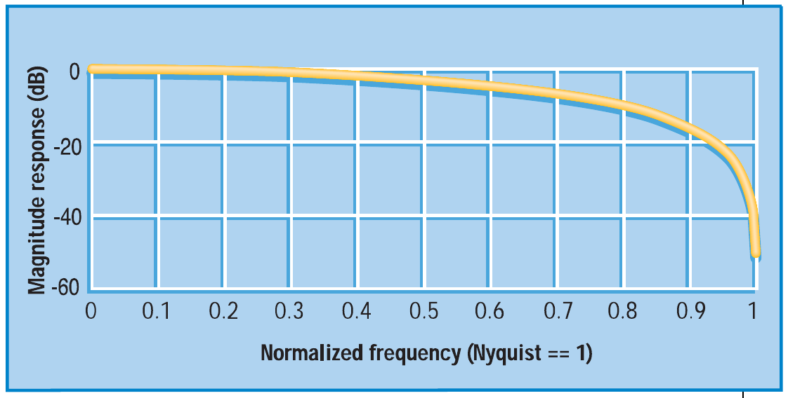
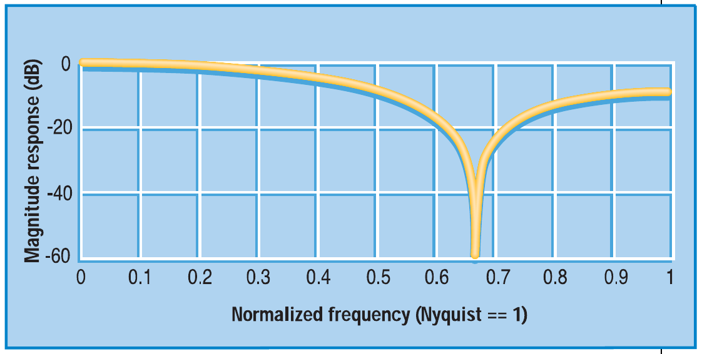
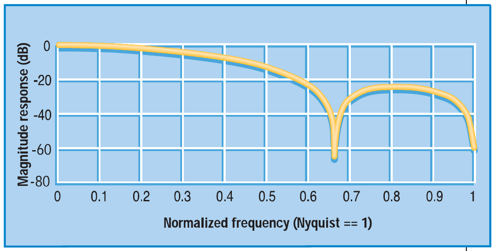
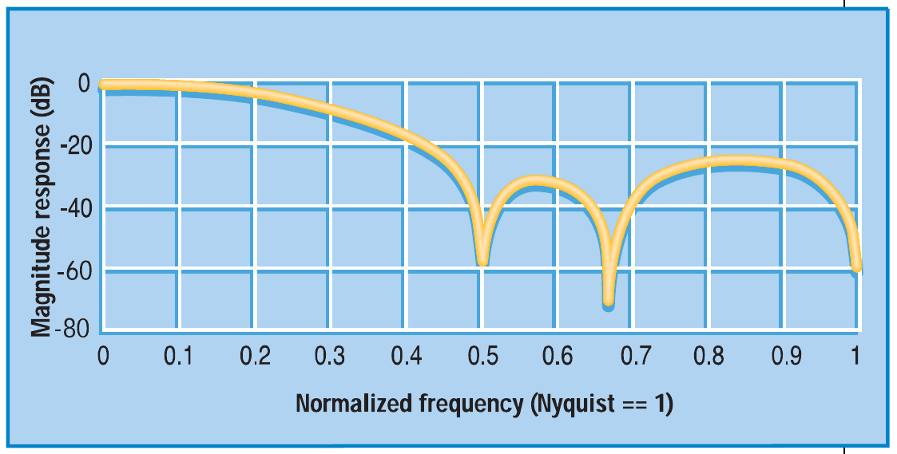
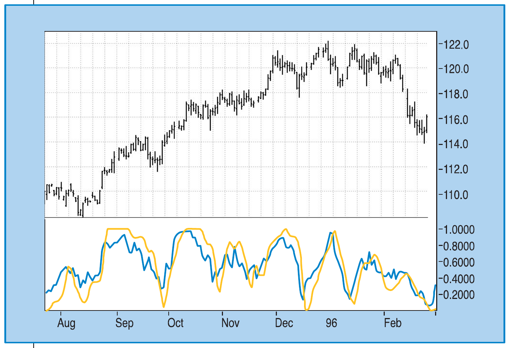
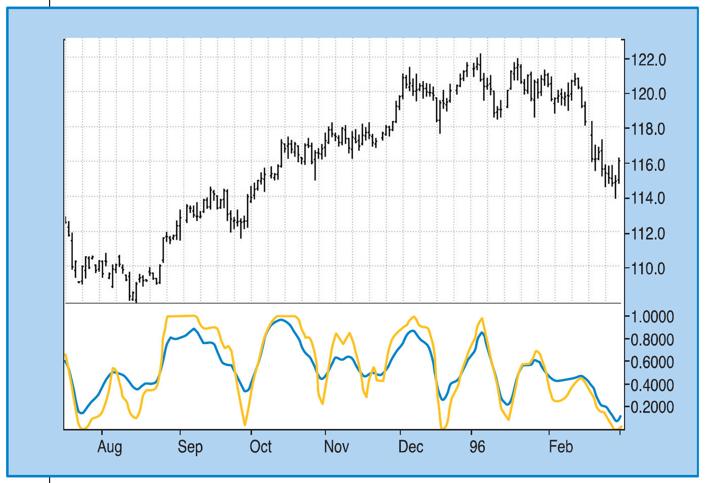

# The RSI Smoothed

- **Author:** John F. Ehlers
- **Publication:** Technical Analysis of STOCKS & COMMODITIES, Volume 20, October 2002, pp. 58--61
- **Article URL:** [Article PDF](https://technical.traders.com/archive/article.asp?file=\V20\C10\112rsi.pdf)
- **Traders' Tips URL:** [Traders' Tips, October 2002](https://www.traders.com/Documentation/FEEDbk_docs/2002/10/TradersTips/TradersTips.html)

---

*Reduce Those Lags*

*Here's how you can enhance the performance of the RSI.*

Smoothing an indicator usually means a tradeoff between the amount of smoothing you desire and the amount of lag you can stand. In this article I will show you how the relative strength index (RSI), an indicator developed by J. Welles Wilder, can be smoothed and enhanced with a minimum of lag penalty.

## RSI Defined

J. Welles Wilder defined the RSI as

$$\text{RSI} = 100 - \frac{100}{1 + RS}$$

where RS = (closes up) / (closes down) = CU / CD

*RS* is shorthand for relative strength. *CU* is the sum of the difference in closing prices over the observation period where that difference is positive. Similarly, *CD* is the sum of the difference in closing prices during the observation period where that difference is negative, but the sum is expressed as a positive number. When you substitute *CU/CD* for *RS* and simplify the RSI equation, you get:

$$\text{RSI} = 100 - \frac{100}{1 + \frac{CU}{CD}}$$

$$= 100 - \frac{100 \cdot CD}{CU + CD}$$

$$= \frac{100 \cdot CU + 100 \cdot CD - 100 \cdot CD}{CU + CD}$$

$$\text{RSI} = \frac{100 \cdot CU}{CU + CD}$$

In other words, the RSI is the percentage of the sum of the delta closes up to the sum of all the delta closes over the observation period. The only variable is the observation period. For maximum effectiveness, the observation period should be half of the measured dominant cycle length. If the observation period is half the dominant cycle, then for a pure sinewave, the total of closes up is exactly equal to the total closes during the part of the cycle from the valley to the peak. In this case, the RSI would have a value of 100. During another part of the cycle — the next half-cycle — there would be no closes up. During this half-cycle the RSI would have a value of zero. So, in principle, half the measured cycle is the correct choice for the RSI observation period.

## The Smoothing Trick

If the waveshape of market prices were a pure sinewave, *CU* would be a sinewave in phase with the prices, and *CU* + *CD* in the denominator would sum to a constant value. In this case it would make little difference whether smoothing was done after the RSI was computed or before the ratio is taken. As a practical matter, the denominator of the RSI calculation often swings in synchronization with the numerator. If smoothing is done prior to taking the ratio in the RSI calculation, it is important that the same amount of lag be introduced in both the numerator and denominator to retain their synchronization.

The real trick is to smooth the difference in closing prices before the RSI computation is started. This way, the inevitable little jiggles in *CU* caused by occasional down days can be substantially reduced. Similarly, the jiggles in *CD* on those occasional up days that occur in down markets are also reduced. Further, smoothing all the differences in closing prices is mathematically identical to smoothing the sum of CU and CD.

The end result of smoothing the differences in closing prices before computing the RSI? Not only is the RSI function smoothed, but also the peak swings in the response are retained, or even enhanced. Therefore, the strategy is to smooth the difference in closing prices prior to computing the RSI. The question that remains: what is the best way to do the smoothing?

Infinite impulse response (IIR) filters such as the exponential moving average (EMA) have a nonlinear phase response, which results in different amounts of lag for the various frequency components in the smoothed waveform. On the other hand, finite impulse response (FIR) filters such as a simple moving average (SMA) produce the same lag for all frequency components in the smoothed waveform. For an *N*-length FIR filter, the amount of lag is (*N* − 1)/2. A three-bar SMA would have a lag of exactly one bar for all frequency components in its smoothed output, and a two-bar SMA would have a lag of only half a bar. So what value of *N* (the order of the filter) should you choose? Clearly, you want to minimize the order of the FIR filter to minimize the lag.

The frequency response of a two-bar SMA is shown in Figure 1, where the frequency is normalized to the Nyquist frequency. The Nyquist frequency is twice the sampling frequency, because of the requirement that there must be at least two samples per cycle. For example, using daily data, the Nyquist frequency is 0.5 cycles per day (that is, a two-bar cycle). The cycle period is computed as 2/ (normalized frequency). The two-bar cycle is nearly completely removed by the two-bar SMA. This makes sense because the up–down sampling of a perfect two-bar cycle exactly averages to zero in a two-bar SMA. When you extend the length of the SMA to three bars, you can use the notation for the coefficients of the SMA as:

$$C = [1\ 1\ 1]/3$$


**FIGURE 1: FREQUENCY RESPONSE OF A TWO-BAR SMA.** A two-bar simple moving average removes the two-bar cycle component (cycle = 2 / normalized frequency).

The coefficients must sum to unity. The frequency response of the three-bar SMA is shown in Figure 2. In this case, the three-bar cycle is completely removed, but there are residual contributions in the output from two-bar cycles.


**FIGURE 2: FREQUENCY RESPONSE OF A THREE-BAR SMA.** A three-bar simple moving average removes the three-bar cycle component (cycle = 2 / normalized frequency).

Continuing to increase the order of the FIR filter, if you select a four-bar weighted coefficient filter as:

$$C = [1\ 2\ 2\ 1]/6$$

you can see from Figure 3 that both the two- and three-bar cycles are suppressed. Since *N*=4 in this case, the lag of this FIR filter is 1.5 bars. You can draw the conclusion that the two-bar cycle is suppressed only when *N* is even.


**FIGURE 3: APPLYING A FOUR-BAR FILTER.** This removes both the two- and three-bar cycle components (cycle = 2/ normalized frequency).

Continuing to increase the order of the FIR filter, using even orders, a six-bar weighted coefficient filter could be:

$$C = [1\ 2\ 3\ 3\ 2\ 1]/12$$

The interesting characteristic of this FIR filter is that the two-bar, three-bar, and four-bar cycles are all suppressed, as shown in Figure 4. The lag penalty for this sixth-order filter is 2.5 bars.


**FIGURE 4: A SIX-BAR WEIGHTED FILTER.** This removes the two-, three-, and four-bar cycle components (cycle = 2 / normalized frequency).

So again, what is the best order of the filter to be used? I favor the fourth-order filter because it only produces 1.5 bars of lag, and avoiding lag is generally more important to trading than increased smoothing. The fourth-order filter virtually removes the two-bar and three-bar variations in the differential closes. After eliminating these very short-term variations in the differential closes, the smoothed RSI (SRSI) is nearly free of disconcerting wiggles that lead to whipsaw trades. The SRSI is compared to the standard RSI in Figure 5; it is compared to the standard RSI smoothed by a fourth-order FIR filter in Figure 6. The EasyLanguage code to compute the SRSI is given in Figure 7.


**FIGURE 5: SRSI VS. STANDARD RSI.** The SRSI is much smoother than the standard RSI.


**FIGURE 6: SRSI VS. SMOOTHED STANDARD RSI.** The turning points of the SRSI are much better defined than a standard RSI that has been smoothed.

## Conclusion

The RSI can be greatly enhanced by smoothing the differential closes before the RSI function is computed. Not only are the short-term variations is enhanced. In particular, using even ordered and symmetrically weighted FIR filters, the specific short-term variations are almost completely removed. I hope this trim on an old and trusted indicator will serve you well.

*John F. Ehlers, Box 1901, Goleta, CA 93116, is an electrical engineer working in electronic research and development and has been a private trader since 1978. He is a pioneer in introducing maximum entropy spectrum analysis to technical traders through his MESA software.*

## EasyLanguage Code for SRSI

```easylanguage
{*****************************************************
            Smoothed Relative Strength Index (SRSI)
            Copyright (c) 2001  MESA Software
*****************************************************}
Inputs: Len(10);

Vars:   count(0),
        Smooth23(0),
        CU23(0),
        CD23(0),
        SRSI(0);

Smooth23 = (Close + 2*Close[1] + 2*Close[2] + Close[3])/6;
CU23 = 0;
CD23 = 0;
For count = 0 to Len - 1 begin
    If Smooth23[count] > Smooth23[count + 1] then CU23 = CU23 +
        Smooth23[count] - Smooth23[count + 1];
    If Smooth23[count] < Smooth23[count + 1] then CD23 = CD23 +
        Smooth23[count + 1] - Smooth23[count];
end;
If CU23 + CD23 <> 0 then SRSI = CU23/(CU23 + CD23);

Plot1(SRSI, "SRSI");
```

**FIGURE 7: EASYLANGUAGE CODE FOR SRSI**

---

## BibTeX

```bibtex
@article{ehlers_rsi_smoothed_2002,
  author    = {John F. Ehlers},
  title     = {The {RSI} Smoothed},
  journal   = {Technical Analysis of STOCKS \& COMMODITIES},
  volume    = {20},
  number    = {10},
  pages     = {58--61},
  year      = {2002},
  month     = oct,
  url       = {https://technical.traders.com/archive/article.asp?file=\V20\C10\112rsi.pdf}
}

@misc{traders_tips_2002_10,
  author       = {{Technical Analysis of STOCKS \& COMMODITIES}},
  title        = {Traders' Tips: The {RSI} Smoothed, October 2002},
  howpublished = {online},
  year         = {2002},
  month        = oct,
  url          = {https://www.traders.com/Documentation/FEEDbk_docs/2002/10/TradersTips/TradersTips.html}
}
```
