# Traders' Tips: October 2002

- **Article:** The RSI Smoothed by John F. Ehlers
- **Traders' Tips URL:** [Traders' Tips, October 2002](https://www.traders.com/Documentation/FEEDbk_docs/2002/10/TradersTips/TradersTips.html)

---


## TRADESTATION: RSI SMOOTHED

October 2002

TRADERS' TIPS 

Here is this month's selection of Traders' Tips, contributed by various
developers of technical analysis software to help readers more easily implement
some of the strategies presented in this and other issues.

You can copy these formulas and programs for easy use in your spreadsheet
or analysis software. Simply "select" the desired text by highlighting
as you would in any word processing program, then use your standard key
command for copy or choose "copy" from the browser menu. The copied text
can then be "pasted" into any open spreadsheet or other software by selecting
an insertion point and executing a paste command. By toggling back and
forth between an application window and the open Web page, data can be
transferred with ease.

This month's tips include formulas and programs for:

 


TRADESTATION: VOLATILITY BREAKOUT

METASTOCK: RSI SMOOTHED

METASTOCK: VOLATILITY BREAKOUT

eSIGNAL: RSI SMOOTHED

AIQ: VOLATILITY BREAKOUT

Wealth-Lab: RSI SMOOTHED

Wealth-Lab: VOLATILITY BREAKOUT

NEUROSHELL TRADER: RSI SMOOTHED

NEUROSHELL TRADER: VOLATILITY BREAKOUT

NeoTicker: RSI SMOOTHED

NeoTicker: VOLATILITY BREAKOUT

Investor/RT: RSI SMOOTHED

TRADINGSOLUTIONS: RSI SMOOTHED

TECHNIFILTER PLUS: RSI SMOOTHED

TECHNIFILTER PLUS: VOLATILITY BREAKOUT

SMARTRADER: RSI SMOOTHED

WAVE WI$E MARKET SPREADSHEET: RSI SMOOTHED

 

or return to 
October 2002 Contents

TRADESTATION: RSI SMOOTHED

In "The RSI Smoothed" in this issue, author John Ehlers
discusses how Welles Wilder's RSI formula can be simplified and
then suggests a technique for smoothing the RSI.

In the article, Ehlers correctly notes Wilder's formulation as
RSI = 100 - [ 100 / (1 + RS )], but then essentially states that RS = (Summation
of closes up) / (Summation of closes down). In his 1978 book 
New Concepts
In Technical Trading Systems
, Wilder states that RS = (Average of 14
days' closes up) / (Average of 14 days' closes down). If
the "average" that Wilder had in mind was a simple average,
then Wilder's formulation would be equivalent to Ehlers'
formulation, since the averages' divisors would cancel out.

If you read Wilder's detailed description of the RSI calculation
carefully, however, you realize that Wilder is using simple averages only
for the initial calculation. For the subsequent average calculations, he
drops 1/14th of the previous average value and adds 1/14th of the new value.
If you do the math, you will find that this is the "classic"
exponential average, in which the smoothing factor is 1/n (implemented
as the function XAverageOrig in TradeStation 6), instead of the "modern"
exponential average, in which the smoothing factor is 2/(n+1) (implemented
as the function XAverage in TradeStation 6).

Given the above, Ehlers' "simplification" does
not really match what Wilder had in mind. Again, if you do the math, you
will find that a more accurate simplification of Wilder's RSI formula
would be as illustrated in the following EasyLanguage code. To make it
match Wilder's results precisely, the initialization would still
need to be done via simple averages. Otherwise, the following code can
be used as is and it will match Wilder's results after an initial
stabilization period of two or three times the length (hard-coded as 14):

The TradeStation 6 implementation of the RSI function is based on
the above simplified formulation. It also includes initialization calculations
based on simple averages, so it matches Wilder's results precisely.

Finally, Ehlers suggests smoothing the close with a six-bar finite impulse
response (FIR) filter before starting the RSI computation. As we have noted
in earlier Traders' Tips columns (January 2002 and July 2002), the
FIR filter is also known as a triangular moving average, and can be conveniently
implemented as a double-smoothed simple moving average. We reproduce the
code for this function (TriAverage_gen) below.

After you have imported this function into your TradeStation 6 work
area, you can plot the smoothed RSI in TradeStation 6 without any additional
code. Simply use the built-in RSI indicator with the following inputs Price
= TriAverage_gen( Close, 6 ) and Length = 10. (The other inputs can be
left as is.)

 

 This indicator and function code will be available for download
from the EasyLanguage Exchange at www.tradestationworld.com.

--Ramesh Dhingra

Director, EasyLanguage Consulting

TradeStation Technologies, Inc. (formerly Omega Research, Inc.)

a wholly owned subsidiary of TradeStation Group, Inc.

www.TradeStation.com

GO BACK

```easylanguage
Indicator: RSI_uninitialized

variables:

 Change( 0 ),

 NetChgAvg( 0 ),

 TotChgAvg( 0 ),

 MyRSI( 0 ) ;

Change = Close - Close[1] ;

NetChgAvg = XAverageOrig( Change, 14 ) ;

TotChgAvg = XAverageOrig( AbsValue( Change ), 14 ) ;

MyRSI = 50 * ( NetChgAvg / TotChgAvg + 1 ) ;

Plot1( MyRSI ) ;
```

```easylanguage
Function: TriAverage_gen

inputs:

 Price( numericseries ),

 Length( numericsimple ) ;

variables:

 Length1( 0 ),

 Length2( 0 ) ;

Length1 = Floor( ( Length + 1 ) * .5 ) ;

Length2 = Ceiling( ( Length + 1 ) * .5 ) ;

TriAverage_gen =

Average( Average( Price, Length1 ), Length2 ) ;
```


## TRADESTATION: VOLATILITY BREAKOUT

In his article "Designing Volatility Breakout Systems"
in this issue, author Paolo Pezzutti describes a buy strategy and provides
the EasyLanguage code for his combined buy and sell-short strategy.

However, the EasyLanguage code provided by Pezzutti in the article is
written for our legacy systems and will not run on our current system,
TradeStation 6, without editing. If you were importing the code into TradeStation
6 using our import wizard, the code would be updated automatically, but
if you are entering it by hand or cutting and pasting it, you will need
to edit it as follows:

Note that the legacy keywords ExitLong and ExitShort were changed
to Sell and BuyToCover, respectively, in TradeStation 6. The old Sell keyword
was changed to SellShort.

Even with these changes, however, the code is not consistent with the
author's description, where he states "Trigger: buy stop
next day at close+0.5(high - low) 
if the entry point is higher than
the open
."  The italicized condition (my italics) is not
included in the author's code, but is required to avoid buying at
the next open if the next open is higher -- and it could be much
higher -- than the calculated buy stop.

You would also want to avoid buying tomorrow if today's high
is lower than the calculated buy stop, because otherwise there would be
an immediate, zero-profit exit as soon as there was an entry.

Adding the above two conditions yields the following code for the buy
strategy (the sell strategy would be written similarly):

Note that the above code will always yield profitable trades if
the buy and sell-to-exit occur at the same bar. If the sell-to-exit does
not occur at the same bar, the risk is unlimited. To limit the risk, some
kind of stop would need to be added.

This indicator code will be available for download from the EasyLanguage
Exchange at www.tradestationworld.com.

--Ramesh Dhingra

Director, EasyLanguage Consulting

TradeStation Technologies, Inc. (formerly Omega Research, Inc.)

a wholly owned subsidiary of TradeStation Group, Inc.

www.TradeStation.com

GO BACK

```easylanguage
inputs: p( 13 ), s( 13 ), f( .5 ) ;

if C < C[1] and C > Average( C, P ) then

 Buy next bar at C + f * ( H - L ) stop ;

Sell next bar at High limit ;

if C > C[1] and C < Average( C, S ) then

 SellShort next bar at C - f * ( H - L ) stop ;

BuyToCover next bar at Low limit ;
```

```easylanguage
Strategy: Simple Volatility Breakout

inputs: p( 13 ), s( 13 ), f( .5 ) ;

variables: BuyLevel( 0 ) ;

BuyLevel = C + f * ( H - L ) ;

if BuyLevel < High

 and BuyLevel > Open next bar

 and C < C[1]

 and C > Average( C, P )

then

 Buy next bar at BuyLevel stop ;

Sell next bar at High limit ;
```


## METASTOCK: RSI SMOOTHED

In "The RSI Smoothed" in this issue, John Ehlers bases
his calculations on an RSI calculation that sums the changes in the closing
price. While some technical analysis programs use this version, Welles
Wilder's book

New Concepts In Technical Trading Systems
 defines
the RSI slightly differently. Wilder smoothes the sums using his own averaging
method before he calculates the final ratio. Since MetaStock uses Wilder's
method of calculating the RSI, we are including both John Ehlers'
formula, as presented in his article in this issue, and a formula for adding
Ehlers' smoothing to the standard RSI.

To create an indicator in MetaStock, select Indicator Builder from the
Tools menu, click New, and enter the following formula:

--William Golson

Equis International

www.equis.com

GO BACK

```text
Smoothed Relative Strength Index ( Ehlers )

Formula:

len:=10;

smooth23:=(C+(2*Ref(C,-1))+(2*Ref(C,-2))+Ref(C,-3))/6;

change:= ROC(smooth23,1,$);

cu23:=Sum(If(change>0,change,0),len);

cd23:=Sum(If(change<0,Abs(change),0),len);

cu23/(cu23+cd23)
```

```text
Smoothed Relative Strength Index ( with Wilder's smoothing )

Formula:

len:=10;

smooth23:=(C+(2*Ref(C,-1))+(2*Ref(C,-2))+Ref(C,-3))/6;

change:= ROC(smooth23,1,$);

Z:=Wilders(If(change>0,change,0),len);

Y:=Wilders(If(change<0,Abs(change),0),len);

RS:=Z/Y;

100-(100/(1+RS))
```


## METASTOCK: VOLATILITY BREAKOUT

In "Designing Volatility Breakout Systems," Paolo Pezzutti
sets intraday entry and exit conditions. Intraday signals can only be tested
using MetaStock Professional. The following system test replicates the
TradeStation signals given in the article.

To create a system test in MetaStock, select System Tester from the
Tools menu, click New, and enter the following formula:

The following exploration is designed to look for this volatility
system's setup and reports the buy stop and profit target in columns
B and C, respectively. Column A will display a 1 if this is a long signal
and a -1 if it is a short signal. To create an exploration in MetaStock,
select Explorer from the Tools menu, click New, and enter the following
formula:

 

--William Golson

Equis International

www.equis.com

GO BACK

```text
Enter Long
Formula:

new:=ROC(DayOfWeek(),1,$)<>0;

r:=ValueWhen(1,new,Ref(HighestSince(1,new,H)-LowestSince(1,new,L),-1));

count:=Cum(If(new,Ref(C,-1),0));

ma:=count-ValueWhen(13,new,Ref(count,-1));

ValueWhen(1,new,Ref(C,-1))<ValueWhen(2,new,Ref(C,-1)) AND

ValueWhen(1,new,Ref(C,-1))>ma AND

C>=ValueWhen(1,new,Ref(C+(0.5*r),-1))

Close Long
Formula:

new:=ROC(DayOfWeek(),1,$)<>0;

r:=ValueWhen(1,new,Ref(HighestSince(1,new,H)-LowestSince(1,new,L),-1));

count:=Cum(If(new,Ref(C,-1),0));

ma:=count-ValueWhen(13,new,Ref(count,-1));

bc:=ValueWhen(1,new,Ref(C,-1))<ValueWhen(2,new,Ref(C,-1)) AND

ValueWhen(1,new,Ref(C,-1))>ma AND

C>=ValueWhen(1,new,Ref(C+(0.5*r),-1));

H>=ValueWhen(1,bc,ValueWhen(1,new,Ref(HighestSince(1,new,H),-1)))

Enter Short
Formula:

new:=ROC(DayOfWeek(),1,$)<>0;

r:=ValueWhen(1,new,Ref(HighestSince(1,new,H)-LowestSince(1,new,L),-1));

count:=Cum(If(new,Ref(C,-1),0));

ma:=count-ValueWhen(13,new,Ref(count,-1));

ValueWhen(1,new,Ref(C,-1))>ValueWhen(2,new,Ref(C,-1)) AND

ValueWhen(1,new,Ref(C,-1))<ma AND

C>=ValueWhen(1,new,Ref(C-(0.5*r),-1))

Close Short
Formula:

new:=ROC(DayOfWeek(),1,$)<>0;

r:=ValueWhen(1,new,Ref(HighestSince(1,new,H)-LowestSince(1,new,L),-1));

count:=Cum(If(new,Ref(C,-1),0));

ma:=count-ValueWhen(13,new,Ref(count,-1));

sc:=ValueWhen(1,new,Ref(C,-1))>ValueWhen(2,new,Ref(C,-1)) AND

ValueWhen(1,new,Ref(C,-1))<ma AND

C>=ValueWhen(1,new,Ref(C-(0.5*r),-1));

L<=ValueWhen(1,sc,ValueWhen(1,new,Ref(LowestSince(1,new,L),-1)))
```

```text
Column A : L/S
Formula:
If((C<Ref(C,-1) AND C>Mov(C,13,S)),1,-1)

Column B: Buy Stop
Formula:
r:=.5*(H-L);
If((C<Ref(C,-1) AND C>Mov(C,13,S)),C+r,C-r)

Column C: Target
Formula:
If((C<Ref(C,-1) AND C>Mov(C,13,S)),H,L)

Filter
Formula:
(C<Ref(C,-1) AND C>Mov(C,13,S)) OR
(C>Ref(C,-1) AND C<Mov(C,13,S))
```


## eSIGNAL: RSI SMOOTHED

This eSignal formula plots the smoothed RSI, as discussed in John Ehlers'
article in this issue. A sample chart can be seen in 
Figure 1
.

FIGURE 1: eSIGNAL, SMOOTHED RSI (SRSI).
 This plots the SRSI on
a 60-minute intraday chart of Dell. It's an example of a custom
eSignal Formula Script (EFS) that can be written and modified in any text
editor or within the eSignal formula editor.

/**********************************************************************

Copyright � eSignal, a division of Interactive Data Corporation.
2002. All rights reserved.

This sample eSignal Formula Script (EFS) may be modified and saved
under a new filename; however, eSignal is no longer responsible for the
functionality once modified.

eSignal reserves the right to modify and overwrite this EFS file with
each new release.

**********************************************************************/

/*************************************************************/

 

--eSignal, a division of Interactive Data Corp.

800 815-8256, www.esignal.com

GO BACK

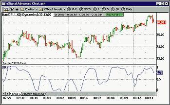

```javascript
function preMain() {

 setPriceStudy(false);

 setStudyTitle("SRSI");

 setCursorLabelName("SRSI", 0);

 setDefaultBarFgColor(Color.blue, 0);

}

Smooth23 = new Array();

function main(Len) {

 if (Len == null)

  Len = 10;

 

 var count = 0;

 var CU23 = 0;

 var CD23 = 0;

 var SRSI = 0;

 var i = 0;

 if (getBarState() == BARSTATE_NEWBAR){

  for(i = Len - 1; i > 0; i--)

   Smooth23[i] = Smooth23[i - 1];

  Smooth23[0] = ( close() + 2 * close(-1) + 2 * close(-2) + close(-3) ) / 6;

 }

 CU23 = 0;

CD23 = 0;

 for(i = 0; i < Len - 1; i++){

  if(Smooth23[i] > Smooth23[i + 1])

   CU23 = CU23 + Smooth23[i] - Smooth23[i + 1];

  if(Smooth23[i] < Smooth23[i + 1])

   CD23 = CD23 + Smooth23[i + 1] - Smooth23[i];

 }

 if(CU23 + CD23 != 0)

  SRSI = CU23/(CU23 + CD23);

 return SRSI;

}
```


## AIQ: VOLATILITY BREAKOUT

Here is the code for use in AIQ's Expert Design Studio based
on Paolo Pezzutti's article in this issue, "Designing Volatility
Breakout Systems."

!!!  Stocks and Commodities - October 2002 Traders Tips. 
Authored by Mike Kaden,

!!! based on the article written by Paolo Pezzutti

 --Mike Kaden

 Aiq Systems

 www.aiq.com

GO BACK

```text
TrendIndicator if [close]> simpleavg([close],13).

SetUp if [close] < val([close],1).

Trigger if [close]> (([high]-[low])/2)+[low] and [close] > [open].

Exit if [close] < val([high],1).

! Note: Set ADX/R to 14days

TrendFilter if [adx]>18.

TrueRange is max([high]-[low],max([high]-val([close],1),val([close],1)-[low])).

AvgTrueRange is SimpleAvg(TrueRange,13).

VolatilityFilter if simpleavg([close],13) >0.01.
```


## Wealth-Lab: RSI SMOOTHED

The following script compares two ways of constructing relative strength
index (RSI) with the smoothed RSI described by John Ehlers in his article
in this issue, "The RSI Smoothed." Wealth-Lab contains a
built-in FIR (finite impulse response) function that we used to smooth
the CU and CD series before constructing the RSI.

 

FIGURE 2: Wealth-Lab, SMOOTHED RSI.
 This sample Wealth-Lab
chart plots the classic Wilders' RSI (light blue), a nonexponential
RSI (light red), and Ehlers' smoothed RSI (black).

The classic method of constructing RSI as described by Welles Wilder
in his 1978 book 
New Concepts In Technical Trading
 
Systems 
involves
basing the new closes up (CU) and closes down (CD) values on their previous
day's values, using an exponential weighting to apply the new difference
values. This classic method is used in the internal calculation of Wealth-Lab's
native RSI indicator.

The Wealth-Lab script presented here allows you to compare the classic
RSI with a nonexponential RSI, and with the smoothed RSI:

 

Note that the smoothed RSI does indeed eliminate many of the "jiggles"
that can lead to whipsaw signals. To experiment with different smoothing
techniques, change the second parameter of the FirSeries function:

 

--Dion Kurczek, Wealth-Lab, Inc.

www.wealth-lab.com

 

GO BACK

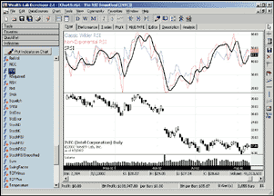

```pascal
var i, Bar, CU, CD, CUSmooth, CDSMooth, MyRSI, SRSI, RSPane: integer;

var x, sumup, sumdown, Diff: float;

{ Create our Price Series }

CU := CreateSeries;

CD := CreateSeries;

MyRSI := CreateSeries;

SRSI := CreateSeries;

const PERIOD = 14;

{ Accumulate the "up" and "down" differences }

for Bar := PERIOD + 1 to BarCount - 1 do

begin

  sumup := 0;

  sumdown := 0;

  for i := 0 to PERIOD - 1 do

  begin

    Diff := PriceClose( Bar - i ) - PriceClose( Bar - i - 1 );

    if Diff > 0 then

      sumup := sumup + Diff

    else

      sumdown := sumdown + ( -Diff );

  end;

  @CU[Bar] := sumup;

  @CD[Bar] := sumdown;

end;

{ Smooth differences with the FIR filter }

CDSmooth := FIRSeries( CD, '1,2,2,1' );

CUSmooth := FIRSeries( CU, '1,2,2,1' );

{ Construct Unsmoothed and Smoothed RSI }

for Bar := PERIOD + 1 to BarCount - 1 do

begin

  x := @CU[Bar] / @CD[Bar];

  x := 100 - ( 100 / ( 1 + x ) );

  @MyRSI[Bar] := x;

  x := @CUSmooth[Bar] / @CDSmooth[Bar];

  x := 100 - ( 100 / ( 1 + x ) );

  @SRSI[Bar] := x;

end;

{ Plot Classic, Non-Exponential and Smoothed RSI }

RSPane := CreatePane( 200, true, true );

PlotSeries( RSISeries( #Close, 14 ), RSPane, 558, #Thin );

DrawText( 'Classic Wilder RSI', RSPane, 4, 4, 558, 12 );

PlotSeries( MyRSI, RSPane, 855, #Thin );

DrawText( 'Non-Exponential RSI', RSPane, 4, 24, 855, 12 );

PlotSeries( SRSI, RSPane, #Black, #Thick );

DrawText( 'SRSI', RSPane, 4, 44, #Black, 12 );
```

```pascal
Three Bar: '1,1,1'

Four Bar: '1,2,2,1'

Six Bar: '1,2,3,3,2,1'
```


## Wealth-Lab: VOLATILITY BREAKOUT

Here is the WealthScript code to implement the volatility breakout system
described in "Designing Volatility Breakout Systems" by Paolo
Pezzutti in this issue.

One of the rules of the system is that the buy stop price must be above
the open of the entry bar, so that we can be sure of entering on upward
momentum. This can be problematic if you want to scan for next-day signals,
since the open price of the next day is not known. Our script accomplishes
this goal by making use of Wealth-Lab's built-in exception handling.
The section of code that checks for the open price is enclosed in a "try"/"except"
block, which will silently handle an error condition and allow the script
to continue. This allows us to run the system with the correct rules for
backtesting, and still be able to scan for trade signals for the next day.
The only thing to keep in mind is that you'd have to screen the
trade candidates at the time of market open, making sure that the open
price is below the buy stop level.

We also coded the two system filters (ATR and ADX), which were not in
the EasyLanguage code provided in Pezzutti's article. Finally, we
added an additional filter that eliminates trades where the entry level
was above the day's high.

 

 A sample chart is shown in 
Figure 3
.

 

FIGURE 3: Wealth-Lab, VOLATILITY BREAKOUT SYSTEM. 
Here
is a sample chart demonstrating the volatility breakout system in Wealth-Lab.

--Dion Kurczek, Wealth-Lab, Inc.

www.wealth-lab.com

GO BACK

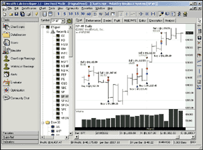

```pascal
var Bar: integer;

var x: float;

for Bar := 14 to BarCount - 1 do

begin

  if not LastPositionActive then

  begin

    if PriceClose( Bar ) > SMA( Bar, #Close, 13 ) then

      if PriceClose( Bar ) < PriceClose( Bar - 1 ) then

        if ADX( Bar, 14 ) > 18 then

          if ATR( Bar, 13 ) / SMA( Bar, #Close, 13 ) > 0.01 then

          begin

            x := PriceClose( Bar ) + 0.5 * ( PriceHigh( Bar ) - PriceLow( Bar ) );

            if x < PriceHigh( Bar ) then

            begin

              try

                if x > PriceOpen( Bar + 1 ) then

              except

              end;

                BuyAtStop( Bar + 1, x, '' );

            end;

          end;

  end;

  if LastPositionActive then

    SellAtLimit( Bar + 1, PriceHigh( Bar ), LastPosition, '' );

end;
```


## NEUROSHELL TRADER: RSI SMOOTHED

John Ehlers' smoothed RSI can be easily implemented in NeuroShell
Trader by using its ability to call programs written in C, C++, Power Basic
(also Visual Basic using one of our add-on packages), or Delphi. We've
already programmed the smoothed RSI as a custom indicator that you can
download from NeuroShell Trader's free technical support website.

After downloading the custom indicator, you can insert it by doing the
following (Figure 4):

 

FIGURE 4: NEUROSHELL TRADER, SMOOTHED RSI.
 Here's
how to add the Ehlers smoothed RSI using NeuroShell Trader's Indicator
Wizard.

1. Select "New Indicator ..." from the Insert
menu.

2. Select the Custom Indicator category.

3. Select the Ehlers RSI Smoothed indicator.

4. Select the parameters as you desire.

5. Press the Finished button.

A sample chart is shown in Figure 5.

 

FIGURE 5: NEUROSHELL TRADER, SMOOTHED RSI.
 Here's
a sample NeuroShell Trader chart displaying the Ehlers smoothed RSI.

The smoothed RSI indicator may also be combined with any of our
800+ built-in indicators into a chart, prediction, or trading strategy.
In addition, if you decide to use this indicator in a prediction or a trading
strategy, the coefficients can be optimized by the Genetic Algorithm optimizer
built into NeuroShell Trader Professional. This can provide you with your
own custom version of Ehlers' RSI smoothed indicator.

Users of NeuroShell Trader can go to the STOCKS & COMMODITIES section
of the NeuroShell Trader free technical support website to download a copy
of any of the Traders' Tips.

For more information on NeuroShell Trader, visit www.NeuroShell.com.

 

--Marge Sherald, Ward Systems Group, Inc.

301 662-7950, sales@wardsystems.com

https://www.neuroshell.com

GO BACK

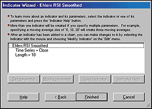

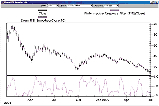


## NEUROSHELL TRADER: VOLATILITY BREAKOUT

To implement in NeuroShell Trader the volatility breakout system described
by Paolo Pezzutti in his article in this issue, "Designing Volatility
Breakout Systems," select "New Trading Strategy ..."
from the Insert menu and enter the following long and short entry conditions
in the appropriate locations of the Trading Strategy Wizard:

 

If you wish to implement the additional ADX and ATR filters described
in the article, simply add the following conditions to the Trading Strategy:

 

If you have NeuroShell Trader Professional, you can also choose
whether the system parameters should be optimized. After backtesting the
trading strategy, use the "Detailed Analysis ..." button
to view the backtest and trade-by-trade statistics for the trading system.

Users of NeuroShell Trader can go to the STOCKS & COMMODITIES section
of the NeuroShell Trader free technical support website to download a sample
chart with the volatility breakout trading system and the volatility breakout
trading system with the added ADX and ATR filters (Figure 6). The sample
chart also includes the average true range custom indicator used in the
additional filters.

 

 

FIGURE 6: NEUROSHELL TRADER, VOLATILITY BREAKOUT TRADING
SYSTEM.
 Here's a sample NeuroShell Trader chart showing the
volatility breakout system and the ADX/ATR filtered volatility breakout
trading system. Note the ability to add two different trading systems to
the same chart.

--Marge Sherald, Ward Systems Group, Inc.

301 662-7950, sales@wardsystems.com

www.neuroshell.com

GO BACK

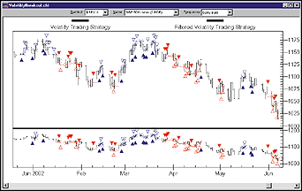

```text
Generate a buy long STOP order if ALL of the following are true:

A>B ( Close, MovAvg ( Close, 13 ) )

A<B ( Close, Lag ( Close, 1 ) )

 Using a Long Entry Stop Price of:

  Add2( Close, Multiply2 ( 0.5, Subtract ( High, Low ) ) )

Generate a sell long LIMIT order if ALL of the following are true:

 A=B(Close,Close)

 Using a Long Exit Limit Price of:

  High

Generate a sell short STOP order if ALL of the following are true:

 A<B ( Close, MovAvg ( Close, 13 ) )

 A>B ( Close, Lag ( Close, 1 ) )

 Using a Long Entry Stop Price of:

  Add2( Close, Multiply2 ( 0.5, Subtract ( High, Low ) ) )

Generate a cover short LIMIT order if ALL of the following are true:

 A=B(Close,Close)

 Using a Long Exit Limit Price of:

  Low
```

```text
Long Entry additional conditions:

A>B ( AvgDirectionalMovement(High,Low,Close,14,14) , 18 )

A>B ( Divide(Average True Range(High,Low,Close,13), MovAvg(Close,13) , 0.01 )

Short Entry additional conditions:

A<B ( AvgDirectionalMovement(High,Low,Close,14,14) , 82 )

A>B ( Divide(Average True Range(High,Low,Close,13), MovAvg(Close,13) , 0.01 )
```


## NeoTicker: RSI SMOOTHED

In this Traders' Tip, we will walk through how to use NeoTicker
formula language to implement the concept presented in the article "The
RSI Smoothed" by John Ehlers in this issue.

To create a new formula indicator from scratch, you can select Program>Script
Editor>New from the menu. You will see an empty script editor. Click on
the Indicator>Setup... from the script editor menu. In the Function field,
enter "SmoothedRsi"; in the Description field, enter "RSI
Smoothed"; in the Language field, select "Formula."
These settings tell NeoTicker the indicator type and name.

In the white space under the User Parameters tab, right-click and select
"Add" from the popup menu. In the Label field, enter the
name "length". In the type field, select "integer
.gt. 1". In the default field, enter "10" as the default
length. These settings will allow the users to change the length of the
Rsi.

Then click on the tab "Pane Option," change the Indicator
Placement to "New Pane" and the Value Range to "0
to 100." These settings will force the indicator to come up in a
new pane.

At this point, you have completed the indicator setup. Press the Apply
button to confirm your changes. In the blank script editor, you can enter
the code in Listing 1:

 

You have completed the indicator construction. The next step is
to compile and install the indicator. On the script editor menu, click
on Indicator>Install. NeoTicker will prompt to ask you if you want to save
before install; click "Yes." Then you should see a confirmation
saying, "Script was installed successfully." Next, I will
show you how to add the indicator to a time chart.

Open a new time chart and add a symbol. In my sample chart (Figure 7),
I use the e-mini SP symbol. Click on the box showing the e-mini symbol
in the upper left-hand corner of the chart. This will make the data series
turn yellow; this means the data series is selected. Right-click on the
symbol box, and select "Add Indicator." You will see an Add
Indicator window come up. In the upper left, click on the "All"
tab. You will have to look up the name "RSI smoothed." To
locate it quickly, type "R" on the keyboard. Press the Apply
button, and you will have the SmoothRsi indicator show up in the chart.

 

FIGURE 7: NEOTICKER, SMOOTHED RSI.
 Here's a sample NeoTicker
chart of the smoothed RSI.

--Kenneth Yuen, TickQuest Inc.

www.tickquest.com

GO BACK

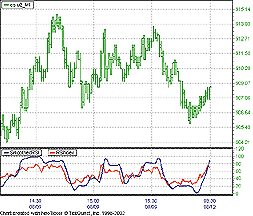

```text
LISTING 1

Smooth23 := (close + 2*close (1) + 2*close (2) + close (3))/6;

plot1 := RSIndex ( Smooth23, param1);
```


## NeoTicker: Volatility Breakout

To implement in NeoTicker the trading system presented in "Designing
Volatility Breakout Systems" by Paolo Pezzutti in this issue, you
will need to create a new Delphi Script system-testing indicator named
Volatility Breakout System (Listing 1) with five parameters and three plots.

The volbreak system script will highlight the long and short trades
and plot an equity curve (Figure 8).

 

 

FIGURE 8: NEOTICKER, VOLATILITY BREAKOUT.
 Here's
a sample chart showing the volatility breakout trading system in NeoTicker.

You can also list the trades and the summary in a report window.
First, you need to open a new report window. Then at the Edit Indicator
window, click on the "Report" tab. Check the Trade List and
Trade Summary checkboxes so they are on. You will also need to check the
Output to Report Window checkbox on and select the "Opened Report
Window" to export the report to. This will allow you to see the
result in the opened report window.

 

 A downloadable version of this system script will be available
at the NeoTicker Yahoo! user group as well as the TickQuest website.

--Kenneth Yuen, TickQuest Inc.

www.tickquest.com

GO BACK

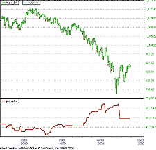

```text
LISTING 1

function volbreak : double;

var bmovavg, smovavg : variant;

    myadx, BATR, SATR : variant;

    Pfactor : double;

    TradeSize : integer;

begin

  Pfactor := Param3.real;

  TradeSize := param5.int;

  ItSelf.MakeIndicator ('bmovavg', 'average', ['1'], [param1.str]);

  bmovavg := ItSelf.Indicator ('bmovavg');

  ItSelf.MakeIndicator ('smovavg', 'average', ['1'], [param2.str]);

  smovavg := ItSelf.Indicator ('smovavg');

  ItSelf.MakeIndicator ('myadx', 'ADX', ['1'], [param4.str]);

  myadx := ItSelf.Indicator ('myadx');

  ItSelf.MakeIndicator ('BATR', 'avgtruerange', ['1'], [param1.str]);

  BATR := ItSelf.Indicator ('BATR');

  ItSelf.MakeIndicator ('SATR', 'avgtruerange', ['1'], [param2.str]);

  SATR := ItSelf.Indicator ('SATR');

  if Trade.OpenPositionSize = 0 then

  begin

    if (Data1.Close [0] < Data1.Close [1]) and

       (Data1.Close [0] > bmovavg.Value [0]) and

       (myadx.Value [0] > 18 ) and

       (BATR.Value [0]/bmovavg.Value [0] > 0.01) then

    begin

      trade.buystop (Data1.Close [0] + Pfactor*(data1.high[0]-data1.low[0]),

                     TradeSize, otfFillorKill, 'Buy stop');

      trade.selllimit (data1.High [1], TradeSize, otfFillorKill, 'Sell Exit');

      ItSelf.Plot [1] := Trade.CurrentEquity;

      ItSelf.Plot [2] := Data1.Close [0] +

                       Pfactor*(data1.High [0]-data1.low [0]);

      ItSelf.SuccessEx [3] := false;

      exit;

    end;

    if (Data1.Close [0] > Data1.Close [1]) and

       (Data1.Close [0] < smovavg.Value [0]) and

       (myadx.Value [0] > 18 ) and

       (SATR.Value [0]/smovavg.Value [0] > 0.01) then

    begin

      trade.sellstop (data1.Close [0] +Pfactor*(data1.high[0]-data1.low[0]),

                      TradeSize, otfFillorKill, 'Sell stop');

      trade.buylimit (data1.low [1], TradeSize, otfFillorKill, 'Buy Exit');

      ItSelf.Plot [1] := Trade.CurrentEquity;

      ItSelf.SuccessEx [2] := false;

      ItSelf.Plot [3] := data1.Close [0] -

                         Pfactor*(data1.high[0]-data1.low[0]);

      exit;

    end;

  end

  else

  begin

    if Trade.OpenPositionSize > 0 then

    begin

       if (data1.barsnum [0] - trade.openPositionEntryBar) > 1 then

          trade.sellatmarket (TradeSize, 'Sell Exit 2')

       else

          trade.selllimit (Data1.High [0], TradeSize,

                       otfFillorKill, 'Sell Exit 1');

    end;

    if Trade.OPenPositionSize < 0 then

    begin

       if (data1.barsnum [0] - trade.openPositionEntryBar) > 1 then

          trade.buyatmarket (TradeSize, 'Buy Exit 2')

       else

          trade.buylimit (Data1.Low [0], TradeSize,

                       otfFillorKill, 'Buy Exit 1');

    end;

  end;

  itSelf.Plot [1] := Trade.CurrentEquity;

  ItSelf.SuccessEx [2] := false;

  ItSelf.SuccessEx [3] := false;

end;
```


## Investor/RT: RSI SMOOTHED

The smoothed RSI discussed in John Ehlers' article in this issue
can be replicated in Investor/RT using a custom indicator. The syntax required
for this custom indicator is:

where CU (closes up) and CD (closes down) are in turn custom indicators
(CI) themselves, renamed. The syntax for CU is:

and the syntax for CD is:

The tricky part of these two custom indicators is the use of (CL > CL.1)
and (CL < CL.1). When True/False expressions such as these are used
within a custom indicator, they evaluate numerically to either 1 (True)
or zero (False).  Thus, the expression:

will evaluate to zero when the change is less than or equal to zero (0
* (CL ? CL.1)). On the other hand, if change is positive, the result will
be equal to the change itself (or 1 * (CL ? CL.1)). In this example, the
observation period is 10, with a three-period smoothing. To change the
observation period, simply change the 10s to the observation period of
your choice. To change the smoothing, simply change the 3s to the smoothing
period of your choice.

--Chad Payne, Linn Software

800 546-6842, info@linnsoft.com

www.linnsoft.com

GO BACK

```text
100 * CU / (CU + CD)
```

```text
AVG( SUM( (CL > CL.1) * (CL ? CL.1), 10), 3)
```

```text
AVG( SUM( (CL < CL.1) * (CL.1 ? CL), 10), 3)
```

```text
(CL > CL.1) * (CL ? CL.1)
```


## TradingSolutions: RSI SMOOTHED

In his article "The RSI Smoothed" in this issue, John
Ehlers presents a smoothed version of the relative strength index (RSI)
that uses a finite impulse response (FIR) filter on the input values to
reduce their noise with minimal lag.

To implement this in TradingSolutions, first write a function for the
Fir filter used in the formula. Note that since the outer lags and the
middle lags each share the same multiplier, they can be grouped together
to save a few steps.

Now, write the smoothed RSI function. A few shortcuts can be taken
here to simplify the function.

1. The formula adds the sum of all up-day changes and the sum of the
negation of all down-day changes. This can be simplified to the sum of
the absolute values of all changes.

2. The formula adds the sum of all up-day changes. Since up-day changes
are defined as the days when the change is greater than zero, any down-day
changes can be factored out by taking the maximum of the change and zero.
This causes all changes less than zero to resolve to zero and not affect
the summation.

 

These functions are available in a function file that can be downloaded
from the TradingSolutions website in the Solution Library section.

As with many indicators, functions like the smoothed relative strength
index can make good inputs to neural network predictions. If used directly,
you will want to set the preprocessing to "None" since the
value stays within a specific range, or "Change" if the momentum
of the indicator is desired.

 

 

FIGURE 9: TradingSolutions, SMOOTHED RELATIVE STRENGTH INDEX.

Here's a sample chart displaying the closing price, Ehlers'
FIR filter, and the smoothed relative strength index.

--Gary Geniesse, NeuroDimension, Inc.

800 634-3327, 352 377-5144

www.tradingsolutions.com

GO BACK

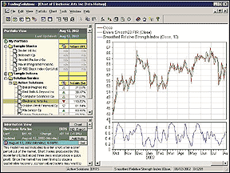

```text
Ehlers Smooth23 FIR

Name: Smooth23

Inputs: Close

Div (Add (Add (Close, Lag (Close, 3)), Mult (Add (Lag (Close, 1), Lag (Close, 2)), 2)), 6)
```

```text
Smoothed Relative Strength Index

Name: SRSI

Inputs: Close, Length

If (Sum (Abs (Change (Smooth23 (Close), 1)), Length),
 Div (Sum (Max (Change (Smooth23 (Close), 1), 0), Length),
 Sum (Abs (Change (Smooth23 (Close), 1)), Length)), 0)
```


## TECHNIFILTER PLUS: RSI SMOOTHED

Here is a TechniFilter Plus formula for the smoothed relative strength
index (SRSI) discussed by John Ehlers in his article in this issue, "The
RSI Smoothed."

 The formula uses TechniFilter Plus' U4 modifier to compute
the sum of the up moves and the down moves in lines 2 and 3. The U6 used
in line 4 avoids division by zero problems.

 Visit RTR's website to download this formula as well
as program updates.

 

--Clay Burch, Rtr Software

919 510-0608, rtrsoft@aol.com

www.rtrsoftware.com

GO BACK

```text
NAME: SRSI

SWITCHES: multiline

PARAMETERS: 10

FORMULA:

[1]: (C + 2*CY1 + 2*CY2 + CY3)/6  {Smooth23}

[2]: ([1] - [1]Y1)U4F&1  {CU23}

[3]: ([1]Y1 - [1])U4F&1  {CD23}

[4]: [2]/([2]+[3])U6   {SRSI}
```


## TECHNIFILTER PLUS: VOLATILITY BREAKOUT

Here is a TechniFilter Plus strategy for Paolo Pezzutti's volatility
breakout system, as described in his article in this issue. The long entry
and short entry requirements are all handled by formulas 8 and 9, respectively.
Formulas 10 and 11 are the additional general market conditions that Pezzutti
suggest be in place before you execute any trade.

 

 Visit RTR's website to download this formula as well
as program updates.

 

--Clay Burch, Rtr Software

919 510-0608, rtrsoft@aol.com

www.rtrsoftware.com

GO BACK

```text
NAME: VLTYbreakout

TEST TYPE: stock

FORMULAS----------------------------------

  [1] Date

  [2] Close

       C

  [3] High

       H

  [4] Low

       L

  [5] Average(13)

       CA&1

  [6] BuyPrice(.5)

       C + &1 * (H - L)

  [7] SellPrice(.5)

       C - &1 * (H-L)

  [8] okLong

       (O < [6]Y1) & (C < CY1)Y1 & ([2] > [5])Y1

  [9] okShort

       (O > [7]Y1) & (C > CY1)Y1 & ([2] < [5])Y1

  [10] okTrend(14,27)

       CS&1X&2 > 18

  [11] okVolatilty(25,13)

       ( ((H%CY1)-(L#CY1))X&1 / CA&2) > 0.01

RULES----------------------------------

  r1: EnterLong

       buy long 1 on [6]Y1

       at signal: enterLong     [10] & [11] & [8]

  r2: ExitLong

       sell long 1 on [3]Y1

       at signal: exitLong     [4] < [3]Y1

  r3: EnterShort

       open short 1 on [7]

       at signal: enterShort     [10] & [11] & [9]

  r4: ExitShort

       cover short 1 on [4]Y1

       at signal: exitShort     [3] > [4]Y1
```


## SMARTRADER: RSI SMOOTHED

Smoothing the RSI, as presented by John Ehlers in this issue, requires
only one formula in SmarTrader, the Smooth23. It is a weighted six-bar
moving average of the closing price.

The SmarTrader specsheet is shown in Figure 10. Row 8, Smooth23, contains
a user formula that weights, sums, and divides the closing prices, creating
a nearly lag-free moving average. In row 9, we apply the standard RSI calculation
-- using Smooth23 as the price field -- for 10 bars. This calculates
the smoothed indicator, SRSI.

 

FIGURE 10: SMARTRADER SPECSHEET, SMOOTHED RSI.
 Here
is the specsheet for the smoothed RSI.

Row 10 is a standard RSI calculated for the same 10-bar period.
It is included for comparison only.

Both the SRSI and RSI are plotted in Figure 11 for comparison. Smooth23
is plotted over the price chart to illustrate the minimal lag induced by
the calculation.

 

 

FIGURE 11: SMARTRADER CHART, SMOOTHED RSI.
 Here is a
sample chart of the smoothed RSI in SmarTrader. Both the RSI and smoothed
RSI are plotted for comparison.

For CompuTrac Snap users, omit the minus sign.

--Jim Ritter, Stratagem Software

504 885-7353, Stratagem1@aol.com

GO BACK

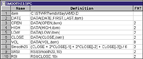

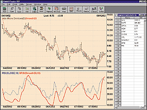


## WAVE WI$E Market Spreadsheet: RSI SMOOTHED

The following Wave Wi$e formulas calculate John Ehlers' smoothed
RSI. The actual smoothed RSI formulas have been placed in a Wave Wi$e procedure.

 

--Peter Di Girolamo, Jerome Technology

908 369-7503, jtiware@aol.com

https://members.aol.com/jtiware

GO BACK

```text
A: DATE @TC2000(C:\TC2000V3\Data,DJ-30,Dow Jones Industrials,DB)

B: HIGH

C: LOW

D: CLOSE

E: OPEN

F: VOL

G: Length    4

H: SRSIcalc  PROCEDURE(SRSI) 'CALL RSI PROCEDURE

I:  RSI           @RSI(CLOSE,LENGTH) 'CACLULATE STANDARD RSI

J: chart       @CHART(1) 'DISPLAY CHARTS

K:           ' ==========End Spreadsheet Formulas

'****************************************************

'PROCEDURE SRSI

'MESA SMOOTHED RELATIVE STRENGTH INDEX (SRSI)

'*****************************************************}

#NAME SMOOTH23 Z

#NAME COUNT X$1

#NAME CU23 X$2

#NAME CD23 X$3

#NAME SRSIX X$4

CU23 = 0 'INITIALIZE VARIABLES

CD23 = 0

SRSIX=0

SMOOTH23 = (CLOSE + 2*CLOSE[-1] + 2*CLOSE[-2] + CLOSE[-3])/6

@FOR COUNT = 0 TO LENGTH - 1

 @IF SMOOTH23[-COUNT] > SMOOTH23[-COUNT - 1] THEN

  CU23 = CU23 + SMOOTH23[-COUNT] - SMOOTH23[-COUNT - 1]

 ENDIF

 @IF SMOOTH23[-COUNT] < SMOOTH23[-COUNT - 1] THEN

  CD23 = CD23 + SMOOTH23[-COUNT - 1] - SMOOTH23[-COUNT]

 ENDIF

NEXT

@IF CU23 + CD23 <> 0 THEN

 SRSIX = CU23/(CU23 + CD23)

ENDIF

@RETURN(SRSIX) 'RETURN SMOOTHED RSI CALCULATION

'END PROCEDURE
```


## BibTeX

```bibtex
@misc{traders_tips_2002_10,
  author       = {{Technical Analysis of STOCKS \& COMMODITIES}},
  title        = {Traders' Tips: The {RSI} Smoothed, October 2002},
  howpublished = {online},
  year         = {2002},
  month        = oct,
  url          = {https://www.traders.com/Documentation/FEEDbk_docs/2002/10/TradersTips/TradersTips.html}
}
```
