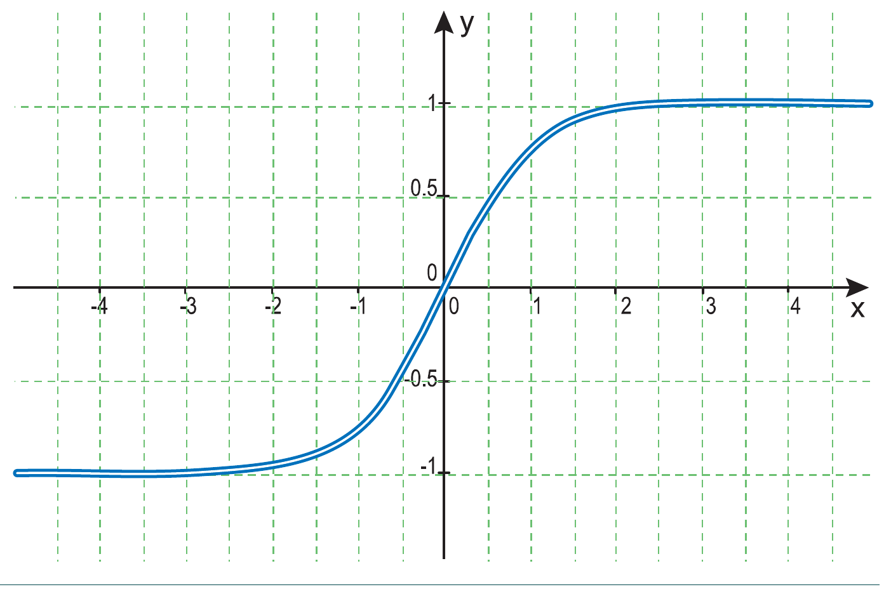
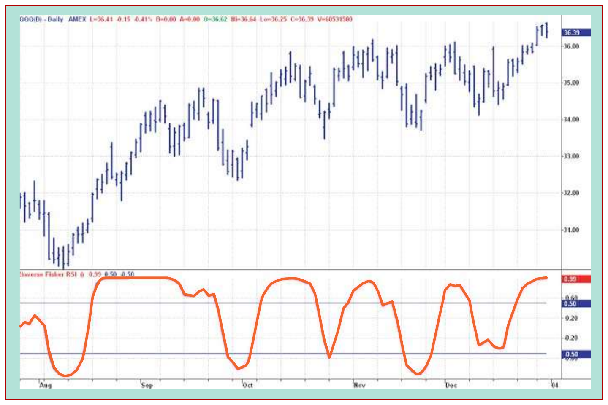
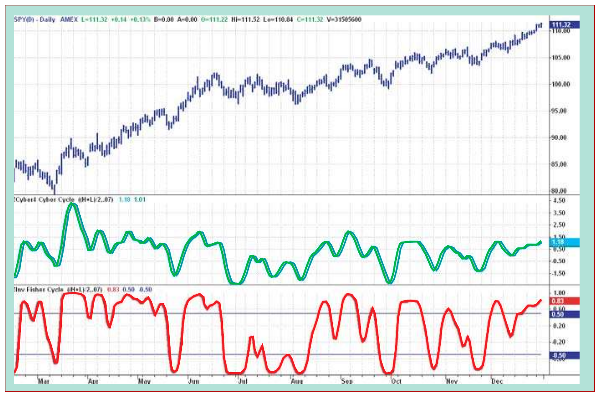

# The Inverse Fisher Transform

- **Author:** John F. Ehlers
- **Publication:** Technical Analysis of STOCKS & COMMODITIES, Volume 22, May 2004, pp. 38–42
- **Article URL:** [Article PDF](https://technical.traders.com/archive/article.asp?file=\V22\C05\095EHLR.pdf)
- **Traders' Tips URL:** [Traders' Tips, May 2004](http://traders.com/Documentation/FEEDbk_docs/2004/05/TradersTips/TradersTips.html)

---

## The Inverse Fisher Helps Clear The Way

How often have you been indecisive about entering or exiting a trade? Here's one way to get a clear indication.

The purpose of technical indicators is to help time your decisions to buy or sell. Ideally, their signals should be clear and unequivocal, but more often than not you will find yourself crossing your fingers before pulling the trigger. Even if you have placed only a few trades, you will have experienced this.

## Inverse Fisher Transform

In this article I will show you a way to program your oscillator-type indicators to give clear, black-and-white indications of when to buy or sell. I will do this by using the inverse Fisher transform to alter the probability distribution function (PDF) of your indicators.

In the past, I have noted that the PDF of price and indicators do not have a Gaussian, or normal, probability distribution. A Gaussian PDF is the familiar bell-shaped curve in which the long "tails" mean that wide deviations from the mean do not occur frequently. The Fisher transform can be applied to almost any normalized dataset to make the resulting PDF nearly Gaussian, with the result that the turning points are sharply peaked and easy to identify. The Fisher transform is defined by the equation:

$$y = 0.5 \cdot \ln\left(\frac{1 + x}{1 - x}\right)$$

The Fisher transform is expansive; the inverse Fisher transform is compressive. The inverse Fisher transform is found by solving equation 1 for x in terms of y. The inverse Fisher transform is:

$$x = \frac{e^{2y} - 1}{e^{2y} + 1}$$

The transfer response of the inverse Fisher transform is shown in Figure 1. If the input falls between -0.5 and +0.5, the output is nearly the same as the input. For larger absolute values (say, larger than 2), the output is compressed to be no larger than unity. The result of using the inverse Fisher transform is that the output has a very high probability of being either +1 or -1. This bipolar probability distribution makes the inverse Fisher transform ideal for generating an indicator that provides clear buy and sell signals.



## The Inverse Fisher Transform and RSI

One of the more popular technical indicators is the stochastic relative strength index (RSI). This indicator starts with an RSI of price. Then a stochastic of that RSI is taken to limit the output to between zero and 100. If you translate and scale that range, it is mathematically the same as varying between -1 and +1.

However, now that you know about the inverse Fisher transform, there is no reason to bludgeon the RSI with a blunt instrument like a stochastic. Instead of picking an observation length guaranteed to drive the stochastic to saturation, you can finesse the indicator PDF using the inverse Fisher transform. The EasyLanguage code to do this is given in the first sidebar, "Inverse Fisher Transform of RSI."

The five-bar RSI varies from a minimum of zero to a maximum of 100. I selected the five-bar length of the RSI as valuable for application to many price series. The RSI period is certainly available for optimization. By subtracting 50, the RSI is translated to range from -50 to +50. Then, multiplying by 0.1 reduces the range to be between -5 and +5 for Value1. This is just the kind of maximum swing suited to the inverse Fisher transform. I used a nine-bar weighted moving average to compute Value2 to smooth Value1 and ultimately remove some spurious trading signals.

There is no magic in this average. It could have fewer bars to have less lag, or it could be an exponential moving average (EMA). Its function is just to be smoother. The transform is calculated as the variable IFish and then plotted. The code also plots output reference lines at -0.5 and +0.5.

The transformed RSI is applied to the exchange-traded fund (ETF) QQQ in Figure 2. I demonstrated the inverse Fisher transform using ETFs because they can be bought long or sold short with equal facility — just like futures. The trading rules are simple: Buy when the indicator crosses over -0.5, or crosses over +0.5 (if it has not previously crossed over -0.5). Sell short when the indicator crosses under +0.5, or crosses under -0.5 (if it has not previously crossed under +0.5). You can see that the trading signals are not only clear and unequivocal, but also profitable.



## Inverse Fisher Transform of RSI — EasyLanguage Code

```easylanguage
Vars:   IFish(0);

Value1 = .1*(RSI(Close, 5) - 50);
Value2 = WAverage(Value1, 9);
IFish = (ExpValue(2*Value2) - 1) / (ExpValue(2*Value2) + 1);

Plot1(IFish, "IFish");
Plot2(0.5, "Sell Ref");
Plot3(-0.5, "Buy Ref");
```

## Cyber Cycles

The use of the inverse Fisher transform is not limited to altering the RSI PDF. It can be applied to almost any oscillator-type indicator. For example, my simplified model of the market consists of a trend component and a cycle component. You can isolate the cycle component by filtering. I call this the *cyber cycle*. Like the RSI, the cyber cycle is an oscillator-type indicator. Unlike the RSI, the cyber cycle has cyclic swings with variable amplitude. By ensuring that the cyclic swings of the cyber cycle have sufficient amplitude to allow the inverse Fisher transform to invoke its compression, an excellent indicator can result.

The second sidebar, "Cyber cycle with inverse Fisher transform," displays the EasyLanguage code for the cyber cycle followed by the inverse Fisher transform. The pure cyber cycle indicator for the SPY† ETF is shown in the first subgraph of Figure 3. The variable-amplitude cyclic swings are obvious. You can trade the cyber cycle using the crossing of the indicator and the indicator delayed by one bar.

The transformed result is shown in the second subgraph of Figure 3. As with the transformed RSI, the buy and sell signals are clear and unambiguous. The inverse Fisher transform can be applied with equal success to virtually all oscillator-type indicators.



## Cyber Cycle with Inverse Fisher Transform — EasyLanguage Code

```easylanguage
Inputs: Price((H+L)/2),
        alpha(.07);

Vars:   Smooth(0),
        Cycle(0),
        ICycle(0);

Smooth = (Price + 2*Price[1] + 2*Price[2] + Price[3])/6;
Cycle = (1 - .5*alpha)*(1 - .5*alpha)*(Smooth - 2*Smooth[1] +
    Smooth[2]) + 2*(1 - alpha)*Cycle[1] - (1 - alpha)*(1 -
    alpha)*Cycle[2];
If currentbar < 7 then Cycle = (Price - 2*Price[1] + Price[2]) / 4;

ICycle = (ExpValue(2*Cycle) - 1) / (ExpValue(2*Cycle) + 1);

Plot1(ICycle, "Cycle");
Plot2(0.5, "Sell Ref");
Plot3(-0.5, "Buy Ref");
```

## Room For More

The inverse Fisher transform has even broader potential applications. Since the transformed waveform is limited to the range between -1 and +1, total energy in the wave is limited. I am particularly intrigued that convergence is guaranteed in some linear predictive algorithms when the energy in the wave is limited. Research may reveal still more exciting new results for traders.

More important, for the present, I have shown you how using the inverse Fisher transform can give you greater confidence (and perhaps let you uncross your fingers) when you place your trades.

---

*John F. Ehlers is an electrical engineer working in electronic research and development and has been a private trader since 1978. He is a pioneer in introducing maximum entropy spectrum analysis to technical traders through his MESA software.*

*†See Traders' Glossary for definition*

## Suggested Reading

- Ehlers, John F. [2002]. "Using The Fisher Transform," *Technical Analysis of STOCKS & COMMODITIES*, Volume 20, November.
- ——— [2004]. *Cybernetic Analysis For Stocks And Futures*, John Wiley & Sons.

## BibTeX

```bibtex
@article{ehlers2004inversefisher,
  author    = {Ehlers, John F.},
  title     = {The Inverse Fisher Transform},
  journal   = {Technical Analysis of Stocks \& Commodities},
  volume    = {22},
  number    = {5},
  pages     = {38--42},
  year      = {2004},
  month     = may,
  url       = {https://technical.traders.com/archive/article.asp?file=\V22\C05\095EHLR.pdf}
}
```
