# Traders' Tips: May 2004

**The Inverse Fisher Transform** by John F. Ehlers

- **Traders' Tips URL:** <http://traders.com/Documentation/FEEDbk_docs/2004/05/TradersTips/TradersTips.html>

---

## TradeStation: Inverse Fisher Transform

Here is TradeStation code for two strategies based on John Ehlers' inverse Fisher transform article in this issue. The first strategy applies the inverse Fisher transform to RSI, and the second applies it to the cyber cycle indicator.

```easylanguage
Strategy: InvFisher-RSI
{INVERSE FISHER TRANSFORM OF RSI}
inputs:
 Price( ( High + Low ) / 2 ),
 Alpha( 0.1 ),
 RSILength( 5 ),
 WAverageLen( 9 ),
 BuyLine( 0.5 ),
 SellLine( -0.5 ),
 BuyLine2( -0.5 ),
 SellLine2( 0.5 ) ;
variables:
 IFish( 0 ) ;
Value1 = Alpha * ( RSI( Price, RSILength ) - 50 ) ;
Value2 = WAverage( Value1, WAverageLen ) ;
IFish = ( ExpValue( 2 * Value2 ) - 1 )
 / ( ExpValue( 2 * Value2 ) + 1 ) ;
if IFish crosses over BuyLine or IFish crosses over
 BuyLine2 then
 Buy next bar at market ;
if IFish crosses under SellLine or IFish crosses under
 SellLine2 then
 SellShort next bar at market ;

Strategy: InvFisher-CyberCycle
{CYBER CYCLE WITH INVERSE FISHER TRANSFORM}
inputs:
 Price( ( H + L ) / 2 ),
 Alpha( 0.07 ),
 BuyLine1( 0.5 ),
 BuyLine2( -0.5 ),
 SellLine1( 0.5 ),
 SellLine2( -0.5 ) ;
variables:
 Smooth( 0 ),
 Cycle( 0 ),
 ICycle( 0 ) ;
Smooth = ( Price + 2 * Price[1] + 2 * Price[2]
 + Price[3] ) / 6 ;
Cycle = ( 1 - 0.5 * Alpha ) * ( 1 - 0.5 * Alpha )
 * ( Smooth - 2 * Smooth[1] + Smooth[2] ) + 2
 * ( 1 - Alpha ) * Cycle[1] - ( 1 - Alpha )
 * ( 1 - Alpha ) * Cycle[2] ;
if CurrentBar < 7 then
 Cycle = ( Price - 2 * Price[1] + Price[2] ) / 4 ;
ICycle = ( ExpValue( 2 * Cycle ) - 1 ) / ( ExpValue( 2
 * Cycle ) + 1 ) ;
if ICycle crosses over BuyLine1 or ICycle crosses over
 BuyLine2 then
 Buy next bar at market ;
if ICycle crosses under SellLine1 or ICycle crosses
 under SellLine2 then
 SellShort next bar at market ;
```

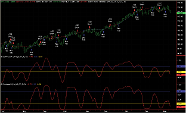

**Figure 1: TradeStation.**

**Code file:** [IFT.els](IFT.els)

*---Mark Mills, TradeStation Securities*

---

## MetaStock: Inverse Fisher Transform

Here are MetaStock formulas for the inverse Fisher transform of RSI, cyber cycles with inverse Fisher transform, plain cyber cycles, and a normalized RSI with IFT.

```metastock
Name: Inverse Fisher Transform of RSI:
Formula:
v1:= .1*(RSI(5)-50);
v2:= Mov(v1,9,W);
.5;
-.5;
(Exp(2*v2)-1)/(Exp(2*v2)+1)

Name: Cyber Cycles with Inverse Filter Transform
Formula:
pr:= (H+L)/2;
a:= 0.07;
sp:= (pr+(2*Ref(pr,-1))+(2*Ref(pr,-2))+Ref(pr,-3))/6;
cycle:=Power(1-(.5*a),2)*(sp-(2*Ref(sp,-1))+Ref(sp,-2))+(2*(1-a))*PREV-(Power(1-a,2)*Ref(PREV,-1));
.5;
-.5;
(Exp(2*cycle)-1)/(Exp(2*cycle)+1)

Name: Cyber Cycles
Formula:
pr:= (H+L)/2;
a:= 0.07;
sp:= (pr+(2*Ref(pr,-1))+(2*Ref(pr,-2))+Ref(pr,-3))/6;
Power(1-(.5*a),2)*(sp-(2*Ref(sp,-1))+Ref(sp,-2))+(2*(1-a))*PREV-(Power(1-a,2)*Ref(PREV,-1))

Name: Normalized RSI with IFT
Formula:
plot:= RSI(5);
ph:=LastValue(Highest(plot));
pl:=LastValue(Lowest(plot));
pf:=10/(ph-pl);
v1:= ((plot-pl)*pf)-5;
v2:= Mov(v1,9,W);
.5;
-.5;
(Exp(2*v2)-1)/(Exp(2*v2)+1)
```

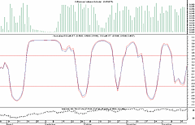

**Figure 2: MetaStock.**

**Code file:** [IFT.mss](IFT.mss)

*---William Golson, Equis International*

---

## AmiBroker: Inverse Fisher Transform

Here is AmiBroker Formula Language (AFL) code implementing the inverse Fisher transform of RSI and the cyber cycle with inverse Fisher transform.

```afl
// LISTING 1 - Inverse Fisher Transform of RSI
// General - purpose Inverse Fisher Transform function
function InvFisherTfm( array )
{
  e2y = exp( 2 * array );
  return ( e2y - 1 )/( e2y + 1 );
}
Value1 = 0.1 * ( RSI( 5 ) - 50 );
Value2 = WMA( Value1, 9 );
Plot( InvFisherTfm( Value2 ), "IFT-RSI", colorRed, styleThick );
PlotGrid( 0.5 );
PlotGrid(-0.5 );

// LISTING 2 - Cyber Cycle with Inverse Fisher Transform
SetBarsRequired( 200, 0 );
// General - purpose Inverse Fisher Transform function
function InvFisherTfm( array )
{
  e2y = exp( 2 * array );
  return ( e2y - 1 )/( e2y + 1 );
}
function CyberCycle( array, alpha )
{
  smooth = ( array + 2 * Ref( array, -1 ) +
             2 * Ref( array, -2 ) + Ref( array, -3 ) ) / 6;
  // init value
  Cycle = ( array[ 2 ] - 2 * array[ 1 ] + array[ 0 ] )/4;
  for( i = 6; i < BarCount; i++ )
  {
     Cycle[ i ] = ( ( 1 - 0.5 * alpha) ^ 2 ) *
                  ( smooth[ i ] - 2 * smooth[ i - 1 ] + smooth[ i - 2] ) +
                  2 * ( 1 - alpha ) * Cycle[ i - 1 ] -
                  ( ( 1 - alpha) ^ 2 ) * Cycle[ i - 2 ];
  }
  return Cycle;
}
Cycle = CyberCycle( (H+L)/2, 0.07 );
ICycle = InvFisherTfm( Cycle );
//Plot( Cycle, "CyberCycle", colorBlue );
Plot( ICycle, "ICyberCycle", colorRed, styleThick );
PlotGrid( 0.5 );
PlotGrid(-0.5 );
```

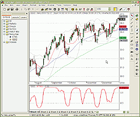

**Figure 3: AmiBroker. IFT of RSI.**

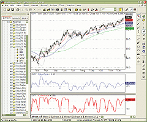

**Figure 4: AmiBroker. Cyber Cycle with IFT.**

**Code file:** [IFT.afl](IFT.afl)

*---Tomasz Janeczko, Amibroker.com*

---

## Wealth-Lab: Inverse Fisher Transform

Here is Wealth-Lab code for the inverse Fisher transform applied to both RSI and the cyber cycle indicator.

```pascal
{$I 'CyberCycle'}
{$I 'InverseFisher'}
var
  Bar, p, hRSI, hRSIx, hIF_RSI, RSIPane,
  hIF_CC, CCPane, hCCPane, hCC, hCCD: integer;
{ ---- Setup indicators ---- }
hCC := DivideSeriesValue( AddSeries( #High, #Low ), 2 );
hCC := CyberCycleSeries( hCC, 0.07 );
hCCD := OffsetSeries( hCC, -1 ); // delay 1 bar
hIF_CC := InverseFisherSeries( hCC );
hRSI := RSISeries( #Close, 5 );
hRSIx := SubtractSeriesValue( WMASeries( hRSI, 9 ), 50 );
hRSIx := MultiplySeriesValue( hRSIx, 0.1 );
hIF_RSI := InverseFisherSeries( hRSIx );
{ ---- Plot control ---- }
RSIPane  := CreatePane( 100, false, true );
hCCPane := CreatePane( 75, false, true );
CCPane := CreatePane( 75, false, true );
PlotSeriesLabel( hCCD, hCCPane, #Blue, #Thick, 'hCCD=hCC delayed' );
PlotSeriesLabel( hCC, hCCPane, #Teal, #Thick, 'hCC=CyberCycle((H+L)/2,0.07)' );
PlotSeriesLabel( hIF_CC, CCPane, #Red, #Thick, 'hIF_CC=InvFisher(hCC)' );
PlotSeriesLabel( hIF_RSI, RSIPane, #Red, #Thick, 'hIF_RSI=IF(RSI(5))' );
HideVolume;
{ Inverse Fisher RSI System }
for Bar := 40 to BarCount - 1 do
  if LastPositionActive then
  begin
    p := LastPosition;
    if CrossUnderValue( Bar, hIF_RSI, 0.5 )
    or CrossUnderValue( Bar, hIF_RSI, -0.5 ) then
      SellAtMarket( Bar + 1, p, '' );
  end
  else if CrossOverValue( Bar, hIF_RSI, -0.5 ) then
      BuyAtMarket( Bar + 1, '' );
```

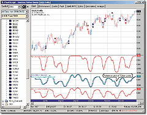

**Figure 5: Wealth-Lab.**

**Code file:** [IFT.wls](IFT.wls)

*---Robert Sucher, Wealth-Lab*

---

## TradingSolutions: Inverse Fisher Transform

Here are TradingSolutions formulas implementing the inverse Fisher transform of RSI and the cyber cycle with inverse Fisher transform.

```text
Name: Inverse Fisher Transform of RSI
Short Name: IFish
Inputs: Close
Formula:
Div (Sub (Exp (Mult (2,WMA (Mult (0.1,Sub (RSI (Close,5),50)),9))),1),Add (Exp (Mult
 (2,WMA (Mult (0.1,Sub (RSI (Close,5),50)),9))),1))

Name: Inverse Fisher Transform of RSI System
Inputs: Close
Enter Long when any of these rules are true:
CrossAbove (IFish (Close, -0.5)
CrossAbove (IFish (Close, 0.5)
Enter Short when any of these rules are true:
CrossBelow (IFish (Close, 0.5)
CrossBelow (IFish (Close, -0.5)

Name: Cyber Cycle Smoothed Price
Short Name: ICycleSmooth
Inputs: Price
Formula:
Div (Add (Price, Add (Mult (2, Lag (Price,1)), Add (Mult (2, Lag (Price,2)), Lag (Price,3)))),6)

Name: Cyber Cycle Internal Cycle
Short Name: ICycleCycle
Inputs: Price, Alpha
Formula:
If (LT (Bar# (),7), Div (Add3 (Price, Mult (-2, Lag (Price,1)), Lag (Price,2)),4),Sub (Add (Mult3
 (Sub (1, Mult (0.5,Alpha)), Sub (1,Mult (0.5,Alpha)), Add3 (ICycleSmooth (Price), Mult (-2, Lag
 (ICycleSmooth (Price),1)), Lag (ICycleSmooth (Price),2))), Mult3 (2, Sub (1,Alpha),Prev (1))),
 Mult3 (Sub (1,Alpha), Sub (1,Alpha), Prev (2))))

Name: Cyber Cycle with Inverse Fisher Transform (General)
Short Name: ICycleGeneral
Inputs: Price, Alpha
Formula:
Div (Sub (Exp (Mult (2,ICycleCycle (Price,Alpha))),1), Add (Exp (Mult (2,ICycleCycle (Price,Alpha))),1))

Name: Cyber Cycle with Inverse Fisher Transform
Short Name: ICycle
Inputs: High, Low, Alpha
Formula:
ICycleGeneral (Div (Add (High,Low),2),Alpha)
```

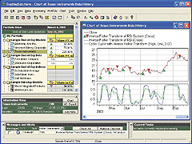

**Figure 6: TradingSolutions.**

**Code file:** [IFT.tds](IFT.tds)

*---Gary Geniesse, NeuroDimension, Inc.*

---

## NeuroShell Trader: Inverse Fisher Transform

The inverse Fisher transform can be easily implemented in NeuroShell Trader using the built-in indicator functions. No programming is required since the indicators are implemented as DLLs. Users can simply combine the appropriate built-in functions to replicate the inverse Fisher transform.

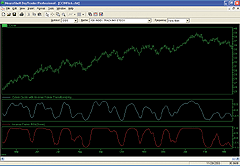

**Figure 7: NeuroShell Trader.**

*---Marge Sherald, Ward Systems Group, Inc.*

---

## AIQ TradingExpert: Inverse Fisher Transform

Here is AIQ TradingExpert EDS code for the inverse Fisher transform of RSI.

```text
! INVERSE FISHER TRANSFORM OF RSI
! Coded by Richard Denning 3/5/04
! FIVE DAY WILDER RSI
U  is [close]-val([close],1).
D  is val([close],1)-[close].
AvgU  is ExpAvg(iff(U>0,U,0),9).
AvgD  is ExpAvg(iff(D>=0,D,0),9).
RSI  is 100-(100/(1+(AvgU/AvgD))).
! IFISHER OF RSI
Value1  is 0.1 * (RSI - 50).
Value2  is expavg(Value1,9).
! Exponential average substituted for weighted averaging.
! The author has indicated that either is acceptable for smoothing.
IFish is  (Exp(2 * Value2) - 1) / (Exp(2 * Value2) + 1) * 100.
! Ehlers' amount x 100 for ease of plotting
! Plot IFish as a custom indicator with upper and lower supports of +50 and - 50
```

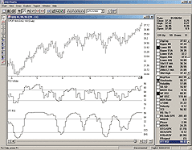

**Figure 8: AIQ TradingExpert.**

**Code file:** [IFT.eds](IFT.eds)

*---AIQ Systems*

---

## NeoTicker: Inverse Fisher Transform

Here are NeoTicker indicator formulas for the inverse Fisher transform of RSI and the cyber cycle with inverse Fisher transform.

```text
LISTING 1
Value1 := 0.1*(RSIndexMod(0,data1,5)-50);
Value2 := waverage(0,Value1,9);
plot1 := (exp(2*Value2)-1)/(exp(2*Value2)+1);
plot2 := 0.5;
plot3 := -0.5;

LISTING 2
myprice := fml(0,data1,param1);
myalpha := param2;
mycounter := mycounter+1;
Smooth := (myprice+2*myprice(1)+2*myprice(2)+2*myprice(3))/6;
'Cycle values when greater than and equal to 7
Cycle_ge_7 := (1-0.5*myalpha)*(1-0.5*myalpha)*
              (Smooth-2*Smooth(1)+Smooth(2))+
              2*(1-myalpha)*Cycle_ge_7(1)-
              (1-myalpha)*(1-myalpha)*Cycle_ge_7(2);
'Cycle values when less than 7
Cycle_lt_7 := (myPrice-2*myPrice(1)+myPrice(2))/4;
'determine which cycle value to return
Cycle := if(mycounter < 7, Cycle_lt_7, Cycle_ge_7);
plot1 := (exp(2*Cycle)-1)/(exp(2*Cycle)+1); 'ICycle
Plot2 := Cycle;
Plot3 := 0.5; 'Sell Ref
Plot4 := -0.5; 'Buy Ref
```

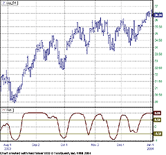

**Figure 9: NeoTicker. IFT of RSI.**

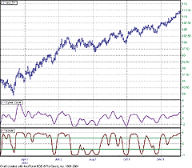

**Figure 10: NeoTicker. Cyber Cycle with IFT.**

**Code file:** [IFT.ntk](IFT.ntk)

*---Kenneth Yuen, TickQuest Inc.*

---

## Prophet.net: Inverse Fisher Transform

The inverse Fisher transform indicators are available directly in the Prophet.net charting application. No coding is required as the indicators are built into the web-based platform.

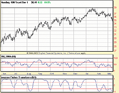

**Figure 11: Prophet.net. IFT of RSI.**


**Figure 12: Prophet.net. Cyber Cycle with IFT.**

*---Tim Knight, Prophet Financial Systems*

---

## StockWiz: Inverse Fisher Transform

Here is a StockWiz formula that calculates the inverse Fisher transform of RSI.

```lisp
# StockWiz formula that calculates the Inverse Fisher Transform
# as described by John F. Ehlers in the May 2004 issue of
# Technical Analysis of Stocks & Commodities magazine
(SET CLOSE   (GETVECTOR (CURRENT) "CLOSE"))
(SET LOW     (GETVECTOR (CURRENT) "LOW"))
(SET HIGH    (GETVECTOR (CURRENT) "HIGH"))
(SET VOLUME  (GETVECTOR (CURRENT) "VOLUME"))
(SET RSI     (RSI CLOSE 5))
(SET VALUE1  (EVAL RSI "(RSI(i)-50.0)*0.1"))
(SET VALUE2  (WMOVAVG VALUE1 9))
(SET IFT     (EVAL VALUE2 "(exp(2*VALUE2(i))-1)/(exp(2*VALUE2(i))+1)"))
(SET LINE1   (EVAL CLOSE "0.5"))
(SET LINE2   (EVAL CLOSE "-0.5"))
(TITLE "INVERSE FISHER TRANSFORM")
(SUBTITLE (CURRENT))
(SUBSETS 5)
(GRAPHSET 1 1 0 0.55 "LINE")
(GRAPHSET 2 1 2 0.25 "LINE")
(GRAPHSET 3 1 0 0.20 "BAR")
(GRAPHADD 1 "GREEN"  "THINSOLID"  CLOSE)
(GRAPHADD 2 "RED"    "THINSOLID"  IFT)
(GRAPHADD 3 "BLUE"   "THINSOLID"  LINE1)
(GRAPHADD 4 "BLUE"   "THINSOLID"  LINE2)
(GRAPHADD 5 "BLACK"  "THINSOLID"  VOLUME)
(LABEL 1 "Close prices")
(LABEL 2 "IFT")
(LABEL 3 "Volume")
(SHOW)
```

**Code file:** [IFT.swz](IFT.swz)

*---StockWiz*

---

## Aspen Graphics: Inverse Fisher Transform

Here are Aspen Graphics custom functions for the inverse Fisher transform of RSI and the cyber cycle with inverse Fisher transform.

```text
InvFishStd(series)={
 MyVal1 = .1 * (rsi($1.close,5)-50)
 MyVal2 = wavg(MyVal1, 9)
 InvFish = (Exp(2*MyVal2)-1) / (Exp(2*MyVal2) + 1)
InvFish
}

CyberCycl(series, alpha=.07)={
 Cycle = 0
 Smooth = ($1.midpt + 2*$1.midpt[1] + 2*$1.midpt[2] + $1.midpt[3])/6
 Cycle=((1-0.5*alpha)^2)*(Smooth-2*Smooth[1]+Smooth[2])+2*(1-alpha)*Cycle[1]-((1-alpha)^2)*Cycle[2]
 if barcount($1) < 7 then Cycle = ($1.midpt - 2*$1.midpt[1] + $1.midpt[2])/4
 ICycle = (exp(2*Cycle)-1) / (exp(2*Cycle)+1)
ICycle
}
```

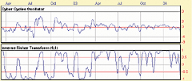

**Figure 13: Aspen Graphics. IFT of RSI.**

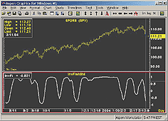

**Figure 14: Aspen Graphics. Cyber Cycle with IFT.**

**Code file:** [IFT.asp](IFT.asp)

*---Andy Sewell, Aspen Research Group*

---

## Financial Data Calculator: Inverse Fisher Transform

Here are Financial Data Calculator macros for the inverse Fisher transform (ifish) and the cyber cycle indicator.

```text
Macro: ifish
c: cl #R
v1: 0.1*(5 rsi #r) - 50
v2: (1|9) wtave v1
tanh v2

Macro: ifish (flexible RSI length)
c: cl #R
n: #l
v1: 0.1*(#l rsi #r) - 50
v2: (1|9) wtave v1
tanh v2

Macro: cycle
a: 0.07
n1: 1 - .5*a
n2: 1 - a
price: midrange #r
smooth: 1 2 2 1 wtave price
dsmooth: 1 -2 1 wtsum smooth
cycle: 1 -2 1 wtave price first 6
cycle: ((n1^2) * dsmooth) + (2*n2*cycle back 1) - ((n2^2)*cycle back 2)
cycle
```

**Code file:** [IFT.fdc](IFT.fdc)

*---Robert C. Busby*

---

## TechniFilter Plus: Inverse Fisher Transform

Here is TechniFilter Plus code for the inverse Fisher transform of RSI, including a filter report and chart formula.

```text
NAME: Inverse Fisher Transform of RSI
DESCRIPTION:
UNITS TO READ: 300
FORMULAS
[1] Symbol
[2] Cross 0.5 Daily(5)
  [1]: 1 * (CG&1-50)
[2]: [1]W9
[3]: ((2 * [2]U10)-1) / ((2 * [2]U10)+1)
[4]: 0.5
[5]: ([3]-[4])U2-Ty1
{Comment: Returns 1 if the IFT crosses from below to above 0.5 and -1 if it crosses
from above to below}
[3] Cross -0.5 Daily(5)
[1]: 1 * (CG&1-50)
[2]: [1]W9
[3]: ((2 * [2]U10)-1) / ((2 * [2]U10)+1)
[4]: -0.5
[5]: ([3]-[4])U2-Ty1
{Returns 1 if the IFT crosses from below to above -0.5 and -1 if it crosses from above to below}
[4] Cross 0.5 weekly(5)
[1]: 1 * (CG&1-50)
[2]: [1]W9
[3]: ((2 * [2]U10)-1) / ((2 * [2]U10)+1)
[4]: 0.5
[5]: ([3]-[4])U2-Ty1
{This formula has the compression set to Weekly. Returns 1 if the IFT crosses from below to
 above 0.5 and -1 if it crosses from above to below}
[5] Cross -0.5 Weekly(5)
[1]: 1 * (CG&1-50)
[2]: [1]W9
[3]: ((2 * [2]U10)-1) / ((2 * [2]U10)+1)
[4]: -0.5
[5]: ([3]-[4])U2-Ty1
{ This formula has the compression set to Weekly. Returns 1 if the IFT crosses from below to
 above -0.5 and -1 if it crosses from above to below}
 [6] Close
      c
FILTERS
      [1]  Bullish Daily  [2] = 1 ^ [3]=1
      [2]  Bearish Daily  [2] = -1 ^ [3]=-1
      [3]  Bullish Weekly  [4] = 1 ^ [5]=1
      [4]  Bearish Weekly  [5] = -1 ^ [5]=-1

FORMULA - InverseFisherTransformofRSI
SWITCHES: multiline
PARAMETERS: 5
FORMULA:
[1]: 1 * (CG&1-50)
[2]: [1]W9
[3]: ((2 * [2]U10)-1) / ((2 * [2]U10)+1) {c}{NInvFish}{a}{nc}  {rgb#255}
[4]: 0.5  {c}{rgb#0}
[5]: -0.5 {c}{rgb#0}
```

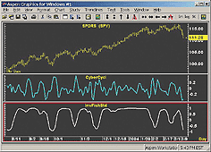

**Figure 15: TechniFilter Plus. Filter report.**

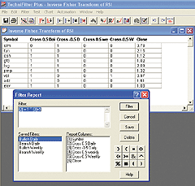

**Figure 16: TechniFilter Plus. Chart.**

**Code file:** [IFT.tdc](IFT.tdc)

*---Benzie Pikoos, RTR Software*

---

## eSignal: Inverse Fisher Transform

Here are eSignal JavaScript studies for the inverse Fisher transform of RSI and the cyber cycle with inverse Fisher transform.

```javascript
// Magazine: Technical Analysis of Stocks & Commodities, May 2004
// Article: The Inverse Fisher Transform by John F. Ehlers
// Study: INVERSE FISHER TRANSFORM OF RSI
// Provided By: TS Support, LLC for eSignal
var RSI = null;
function preMain(){
    setStudyTitle("INVERSE FISHER TRANSFORM OF RSI");
    setCursorLabelName("IFish",0);
    setDefaultBarFgColor(Color.red,0);
    addBand(.5, PS_SOLID, 1, Color.black);
    addBand(-.5, PS_SOLID, 1, Color.black);
    setDefaultBarThickness(2);
    setComputeOnClose();
}
function main(){
    wmaLength = 9;
    rsiLength = 5;
    if (RSI == null) RSI = new RSIStudy(rsiLength,"close");
    var IFish = 0, WtdSum = 0 ;
    Value1 = .1 * (RSI.getValue(RSIStudy.RSI) - 50);
    for(i = 0; i < wmaLength; i++)
        WtdSum += (wmaLength - i) * (.1 * (RSI.getValue(RSIStudy.RSI,-i) - 50)) ;
    CumWt = (wmaLength + 1 ) * wmaLength * .5 ;
    Value2 = WAverage = WtdSum / CumWt ;
    IFish = (Math.exp(2 * Value2) - 1) / (Math.exp(2 * Value2) + 1);
    return IFish;
}

// Magazine: Technical Analysis of Stocks & Commodities, May 2004
// Article: The Inverse Fisher Transform by John F. Ehlers
// Study: CYBER CYCLE WITH INVERSE FISHER TRANSFORM
// Provided By: TS Support, LLC for eSignal
var Smooth_1 = 0;
var Smooth_2 = 0;
var Cycle_1 = 0;
var Cycle_2 = 0;
function preMain(){
    setStudyTitle("CYBER CYCLE WITH INVERSE FISHER TRANSFORM");
    setCursorLabelName("Cycle",0);
    setDefaultBarFgColor(Color.green,0);
    setDefaultBarThickness(2);
    setComputeOnClose();
}
function main(alpha){
    if(alpha == null) alpha = .07;
    var Smooth = 0, Cycle = 0, ICycle = 0;
    Smooth = ((high() + low()) / 2 + high(-1) + low(-1) + high(-2) + low(-2) + (high(-3) + low(-3)) / 2 ) / 6;
    Cycle = (1 - .5 * alpha) * (1 - .5 * alpha) * (Smooth - 2 * Smooth_1 + Smooth_2) + 2 * (1 - alpha) *
              Cycle_1 - (1 - alpha) * (1 - alpha) * Cycle_2;
    if(getCurrentBarIndex() - getOldestBarIndex() < 7)
    Cycle = ((high() + low()) / 2 - high(-1) - low(-1) + high(-2) + low(-2)) / 4;
    ICycle = (Math.exp(2 * Cycle) - 1) / (Math.exp(2 * Cycle) + 1);
    Smooth_2 = Smooth_1;
    Smooth_1 = Smooth;
    Cycle_2 = Cycle_1;
    Cycle_1 = Cycle;
    return ICycle;
}
```

**Code file:** [IFT.efs](IFT.efs)

*---Raphel Finelli, eSignal*

---

```bibtex
@misc{traderstips200405,
  title     = {Traders' Tips: May 2004},
  journal   = {Technical Analysis of Stocks \& Commodities},
  volume    = {22},
  number    = {5},
  year      = {2004},
  month     = may,
  url       = {http://traders.com/Documentation/FEEDbk_docs/2004/05/TradersTips/TradersTips.html}
}
```
