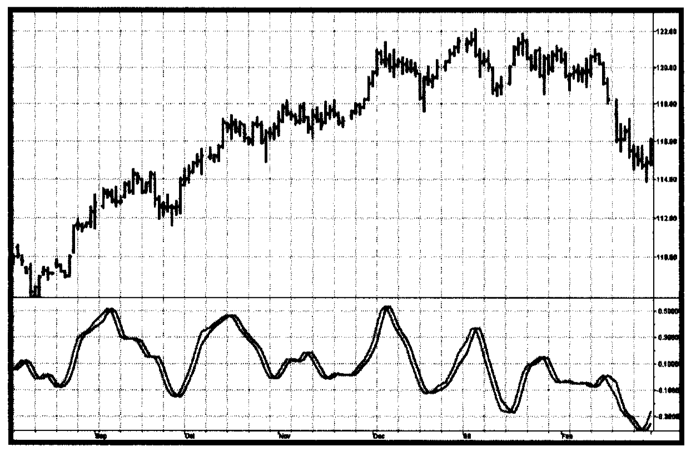

# Chapter 6: Relative Vigor Index

> "Get to the back of the boat," said Tom sternly.

This chapter describing the Relative Vigor Index (RVI) uses concepts dating back over three decades and also uses modern filter and digital signal processing theory to realize those concepts as a practical and useful indicator. The RVI merges the old concepts with the new technologies. The basic idea of the RVI is that prices tend to close higher than they open in up markets and tend to close lower than they open in down markets. The vigor of the move is thus established by where the prices reside at the end of the day. To normalize the index to the daily trading range, the change in price is divided by the maximum range of prices for the day. Thus, the basic equation for the RVI is

$$RVI = \frac{Close - Open}{High - Low}\tag{6.1}$$

In 1972, Jim Waters and Larry Williams published a description of their A/D Oscillator. In this case, A/D means accumulation/distribution rather than the usual advance/decline. Waters and Williams defined Buying Power (BP) and Selling Power (SP) as

$$BP = High - Open$$

$$SP = Close - Low$$

where the prices were the open, high, low, and closing prices for the day. The two values, BP and SP, show the additional buying strength relative to the open and the selling strength relative to the close to obtain an implied measure of the day's trading. Waters and Williams combined the measurement as the Daily Raw Figure (DRF). DRF is calculated as

$$DRF = \frac{BP + SP}{2 * (High - Low)}\tag{6.2}$$

The maximum value of 1 is reached when a market opens trading at the low and closes at the high. Conversely, the minimum value of 0 is reached when the market opens trading at the high and closes at the low. The day-to-day evaluation causes the DRF to vary radically and requires smoothing to make it usable.

We can expand the equation for the DRF as

$$\begin{aligned}
DRF &= \frac{1}{2}\left(\frac{High - Open + Close - Low}{High - Low}\right) \\[1ex]
&= \frac{1}{2}\left(\frac{High - Low + Close - Open}{High - Low}\right) \\[1ex]
&= \frac{1}{2}\left(1 + \frac{Close - Open}{High - Low}\right)
\end{aligned}\tag{6.3}$$

Clearly, the equation for the DRF is identical with the daily RVI expression except for the additive and multiplicative constants. It seems there are no new ideas in technical analysis. However, smoothing must be done to make the indicator practical. This is where modern filter theory contributes to the successful implementation of the RVI. I use the four-bar symmetrical finite impulse response (FIR) filter (described in Equation 4.1 and Figure 4.1) to independently smooth the numerator and the denominator.

The RVI is an oscillator, and we are therefore only concerned with the cycle modes of the market in its use. The sharpest rate of change for a cycle is at its midpoint. Therefore, in the ascending part of the cycle we would expect the difference between the close and open to be at a maximum. This is like a derivative in calculus, where the derivative of a sinewave produces a negative cosine wave. The derivative is therefore a waveform that leads the original sinewave by a quarter cycle. Also, from calculus, integration of a sinewave over a half-cycle period results in another sinewave delayed by a quarter cycle. Summing over a half cycle is basically the same as mathematically integrating, with the result that the waveshape of the sum is delayed by a quarter wavelength relative to the input. The net result of taking the differences and summing produces an oscillator output in phase with the cyclic component of the price. It is also possible to generate a leading function if the summation window is less than a half wavelength of the Dominant Cycle. If a cycle measurement is not available, you can sum the RVI components over a fixed default period. A nominal value of 8 is suggested because this is approximately half the period of most cycles of interest.

Calculating the RVI is straightforward. The numerator, consisting of Close - Open, is filtered in the four-bar symmetrical FIR filter before the terms are summed. The denominator, consisting of High - Low, is independently filtered in the four-bar symmetrical FIR filter before it is summed. The numerator and denominator are summed individually and the RVI is then computed as the ratio of the numerator to the denominator. Since the numerator and denominator are lagged the same amount due to filtering, the lag is removed by taking their ratio.

The rules for the use of the RVI are flexible. Just remember that it is an oscillator that is basically in phase with the cyclic component of the market prices. I prefer crossing line indicators because they are unambiguous in their signals. A simple Trigger line is just the RVI delayed by one bar.



**Figure 6.1** *The RVI Gives Crisp Indications of the Cyclic Turning Point*

The RVI oscillator is shown in Figure 6.1. The responsiveness and clarity of the signals are self-explanatory. The EasyLanguage code to compute the RVI is shown in Figure 6.2, and its eSignal Formula Script (EFS) code is shown in Figure 6.3.

```easylanguage
Inputs: Length(10);
Vars:   Num(0),
        Denom(0),
        count(0),
        RVI(0),
        Trigger(0);

Value1 = ((Close - Open) + 2*(Close[1] - Open[1]) + 2*(Close[2] - Open[2]) + (Close[3] - Open[3]))/6;
Value2 = ((High - Low) + 2*(High[1] - Low[1]) + 2*(High[2] - Low[2]) + (High[3] - Low[3]))/6;

Num = 0;
Denom = 0;
For count = 0 to Length - 1 begin
    Num = Num + Value1[count];
    Denom = Denom + Value2[count];
End;

If Denom <> 0 then RVI = Num / Denom;

Trigger = RVI[1];

Plot1(RVI, "RVI");
Plot2(Trigger, "Trigger");
```

**Figure 6.2** *EasyLanguage Code to Compute the RVI*

```javascript
/***********************************************************
Title:      RVI
Coded By:   Chris D. Kryza (Divergence Software, Inc.)
Email:      c.kryza@gte.net
Incept:     06/19/2003
Version:    1.0.0
Fix History:
06/19/2003 - Initial Release
1.0.0
***********************************************************/

//External Variables
var aRVIArray = new Array();
var aValue1Array = new Array();
var aValue2Array = new Array();

//== PreMain function required by eSignal to set things up
function preMain() {
    var x;
    setPriceStudy(false);
    setStudyTitle("RVI");
    setCursorLabelName("RVI", 0);
    setCursorLabelName("Trig", 1);
    setDefaultBarFgColor(Color.blue, 0);
    setDefaultBarFgColor(Color.red, 1);
    addBand(0, PS_SOLID, Color.black, 1, -55);
    //initialize arrays
    for (x = 0; x < 70; x++) {
        aRVIArray[x] = 0.0;
        aValue1Array[x] = 0.0;
        aValue2Array[x] = 0.0;
    }
}

//== Main processing function
function main(OscLength) {
    var x;
    var nNum;
    var nDenom;

    //initialize parameters if necessary
    if (OscLength == null) {
        OscLength = 8;
    }

    // study is initializing
    if (getBarState() == BARSTATE_ALLBARS) {
        return null;
    }

    //on each new bar, save array values
    if (getBarState() == BARSTATE_NEWBAR) {
        aRVIArray.pop();
        aRVIArray.unshift(0);
        aValue1Array.pop();
        aValue1Array.unshift(0);
        aValue2Array.pop();
        aValue2Array.unshift(0);
    }

    aValue1Array[0] = ((close() - open())
        + 2 * (close(-1) - open(-1))
        + 2 * (close(-2) - open(-2))
        + (close(-3) - open(-3))) / 6;

    aValue2Array[0] = ((high() - low())
        + 2 * (high(-1) - low(-1))
        + 2 * (high(-2) - low(-2))
        + (high(-3) - low(-3))) / 6;

    nNum = 0;
    nDenom = 0;
    for (x = 0; x < OscLength; x++) {
        nNum += aValue1Array[x];
        nDenom += aValue2Array[x];
    }

    if (nDenom != 0) aRVIArray[0] = nNum / nDenom;

    //return the calculated values
    return new Array(aRVIArray[0], aRVIArray[1]);
}
```

**Figure 6.3** *EFS Code to Compute the RVI*

## Key Points to Remember

- The RVI concept is that prices close higher than they open in up markets and close lower than they open in down markets.
- The RVI is a normalized oscillator, where the movement is normalized to the trading range of each bar.
- Lag-canceling four-bar symmetrical FIR filters are used to produce a readable indicator.
