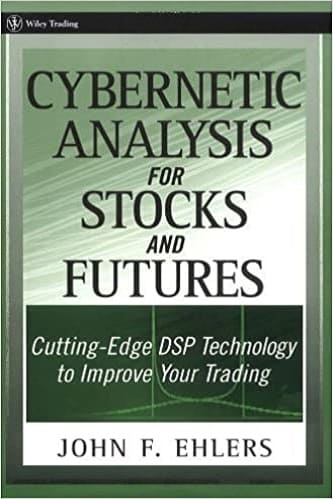

# Cybernetic Analysis for Stocks and Futures: Cutting-Edge DSP Technology to Improve Your Trading



**Author:** John F. Ehlers

**Year:** 2004

## BibTeX

```bibtex
@Book{ehlers2004cybernetic,
  author    = {Ehlers, John F.},
  title     = {Cybernetic Analysis for Stocks and Futures: Cutting-Edge DSP Technology to Improve Your Trading},
  publisher = {Wiley},
  year      = {2004},
  series    = {Wiley Trading},
  isbn      = {9780471463078},
}
```

## Chapters

1. [The Fisher Transform](ch1.md)
2. [Trends and Cycles](ch2.md)
3. [Trading the Trend](ch3.md)
4. [Trading the Cycle](ch4.md)
5. [The CG Oscillator](ch5.md)
6. [Relative Vigor Index](ch6.md)
7. [Oscillator Comparison](ch7.md)
8. [Stochasticization and Fisherization of Indicators](ch8.md)
9. [Measuring Cycles](ch9.md)
10. [Adaptive Indicators](ch10.md)
11. [The Sinewave Indicator](ch11.md)
12. [Smoothed Adaptive Momentum](ch12.md)
13. [Super Smoothers](ch13.md)
14. [Time Warp — Without Space Travel](ch14.md)
15. [Evaluating Trading Systems](ch15.md)
16. [Leading Indicators](ch16.md)
17. [Simplifying Simple Moving Average Computations](ch17.md)
