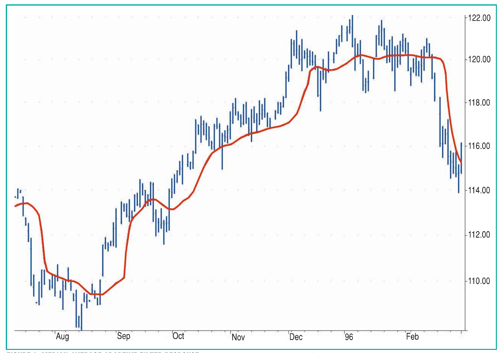

# What's The Difference?

- **Author:** John F. Ehlers
- **Publication:** Technical Analysis of STOCKS & COMMODITIES, Volume 23, March 2005, pp. 28–29
- **Article URL:** [Article PDF](https://technical.traders.com/archive/article.asp?file=\V23\C03\055EHL.pdf)
- **Traders' Tips URL:** [Traders' Tips, March 2005](http://traders.com/Documentation/FEEDbk_docs/2005/03/TradersTips/TradersTips.html)

---

## The Secret Behind The Filter

What's the difference between the median and the average? It's what drives this new adaptive smoothing filter.

Remember back in school when your teacher asked you what the difference was between the median and the average? I remember thinking, "Yeah, what is the difference?" as in, "Who cares?" As it turns out, you should care. It is exactly that difference that drives a unique new adaptive smoothing filter that I'm going to tell you about.

Average and median filters eliminate extraneous data in fundamentally different ways. An average folds "noise" in with the signal so that if enough points are selected, the noise is reduced by summing to its own (nearly) zero average value. On the other hand, a median filter eliminates noise by ignoring it. A big spike in the data has no impact at all on the median signal value. Median filters are used in video to eliminate impulsive, or "salt and pepper" noise on the picture. We will exploit these characteristics to create an adaptive smoothing filter.

## The Difference Is...

Consider a dataset that consists of 10 ones. Both the average and the median of this dataset is 1. Next, let's move that dataset forward as we would with a moving average, dropping the last old data sample and adding a new one. Assuming the value of the new data sample is 10, then the new average will be 1.9 (nine ones and one 10, divided by 10). On the other hand, the median of the new dataset still remains unchanged at 1. A median filter ranks all the samples within the filter and selects the middle one as the filter output. So there is a difference between median and averaging filters. That percentage difference becomes less as the respective filter lengths are made shorter.

Our procedure to find the best length for an adaptive filter is to measure the percentage difference between the outputs of same-length median and exponential moving average (EMA) filters using a search algorithm. In this algorithm, we start with a relatively long filter length. This length is an odd number to ensure the median is the exact center of the filter. We compute the absolute percentage difference between the filter outputs and then decrement the filter length by 2 to ensure the median is still at the center of the filter. The absolute value of the percentage difference is used because we want the filter to rapidly adjust to sharp movements, both up and down. Then the process is repeated until the percentage difference between the two filter outputs falls below some threshold value.

This is the shortest length filter for the prescribed threshold. We then take that length and compute the alpha of an EMA. Since this alpha can change with each new data sample, our output filter adapts to current market conditions.

The EasyLanguage code to compute the median-average adaptive filter is shown in Figure 1. The adaptive filter for the case where the threshold is set to 0.002 is shown in Figure 2.

## Median-Average Adaptive Filter EasyLanguage Code

```easylanguage
{*************************************************************
Median-Average Adaptive Filter
John Ehlers
*************************************************************}

Inputs: Price((H+L)/2),
        Threshold(.002);

Vars: Smooth(0),
      Length(30),
      alpha(0),
      Filt(0);

Smooth = (Price + 2*Price[1] + 2*Price[2] + Price[3]) / 6;

Length = 39;

Value3 = .2;

While Value3 > Threshold begin
    alpha = 2 / (Length + 1);
    Value1 = Median(Smooth, Length);
    Value2 = alpha*Smooth + (1 - alpha)*Value2[1];
    If Value1 <> 0 then Value3 = AbsValue(Value1 - Value2) / Value1;
    Length = Length - 2;
End;

If Length < 3 then Length = 3;

alpha = 2 / (Length + 1);

Filt = alpha*Smooth + (1 - alpha)*Filt[1];

Plot1(Filt);
```

**FIGURE 1: EASYLANGUAGE CODE TO COMPUTE THE MEDIAN-AVERAGE ADAPTIVE FILTER**



**FIGURE 2: MEDIAN-AVERAGE ADAPTIVE FILTER RESPONSE.** Here, the threshold is set to 0.002. The filter adjusts rapidly to the larger moves but doesn't really whipsaw when prices are in a congestion zone.

It is clear that this filter rapidly adjusts to the larger moves, but refuses to be jiggled during congestion zones of the price. Thus, we have a median-average adaptive filter that enables closely following price changes without introducing false whipsaw signals in sideways markets.

## About The Author

John F. Ehlers is a pioneer in introducing maximum entropy spectrum analysis to technical traders through his MESA software.

---

See our Traders' Tips section for program code implementing John Ehlers's technique.

---

## BibTeX

```bibtex
@article{ehlers_whats_the_difference_2005,
  author    = {Ehlers, John F.},
  title     = {What's The Difference?},
  journal   = {Technical Analysis of STOCKS \& COMMODITIES},
  volume    = {23},
  number    = {3},
  pages     = {28--29},
  year      = {2005},
  month     = mar,
  url       = {https://technical.traders.com/archive/article.asp?file=\V23\C03\055EHL.pdf}
}

@misc{traders_tips_2005_03,
  author       = {{Technical Analysis of STOCKS \& COMMODITIES}},
  title        = {Traders' Tips: What's The Difference? by John F. Ehlers},
  howpublished = {online},
  year         = {2005},
  month        = mar,
  url          = {http://traders.com/Documentation/FEEDbk_docs/2005/03/TradersTips/TradersTips.html}
}
```
