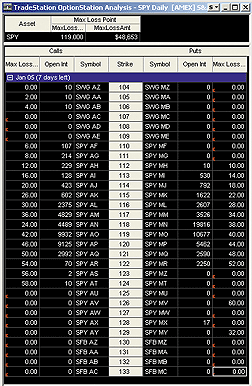
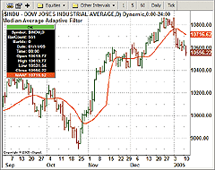
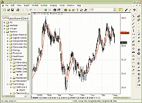
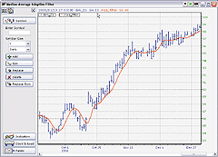
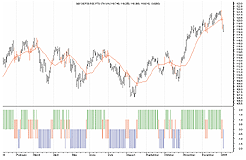
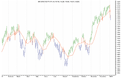

# Traders' Tips: March 2005

- **Article:** What's The Difference? by John F. Ehlers
- **Traders' Tips URL:** [Traders' Tips, March 2005](http://traders.com/Documentation/FEEDbk_docs/2005/03/TradersTips/TradersTips.html)

---

## TradeStation: March 2005

*Editor's note:* Since the TradeStation code for this month's primary Traders' Tips topic (John Ehlers' article "The Secret Behind The Filter: What's The Difference?" elsewhere in this issue) was already provided in the article by Ehlers, the following TradeStation code covers David White's article, "Setting Strike Price Probability At Expiration" (S&C, December 2004).

David White's article describes the calculation of the max-loss point. The max-loss point is the price at which the value of open options is minimized.



**FIGURE 1: TRADESTATION, SETTING STRIKE PRICE PROBABILITY.**

```easylanguage
Indicator: Max Loss Point (S) {for Option Pane}
variables:
 OIToStore( 0 ),
 Sym( "" ),
 SetTypeRtn( -1 ),
 SetStrikeRtn( -1 ),
 SetOIRtn( -1 ) ;
if CurrentOpenInt <> 0 then
 OIToStore = CurrentOpenInt
else
 OIToStore = PrevOpenInt ;
Sym = Symbol ;
SetTypeRtn = GVSetNamedInt(
 Sym, OptionType of Option ) ;
SetStrikeRtn = GVSetNamedFloat(
 Sym + " Strike", Strike of Option ) ;
SetOIRtn = GVSetNamedInt( Sym + " OI", OIToStore ) ;
if SetTypeRtn < 0 or SetStrikeRtn < 0 or
 SetOIRtn < 0
then
 RaiseRunTimeError(
  Sym + ":  Error setting named variable!" ) ;
Plot1( SetTypeRtn, "SetTypeRtn" ) ;
Indicator: Max Loss Point {for Asset Pane}
variables:
 Index( 0 ),
 Counter( 0 ),
 Sym( "" ),
 ErrorString( "Error!" ),
 NumOpts( 0 ),
 CounterOuter( 0 ),
 StrikeOuter( 0 ),
 CounterInner( 0 ),
 OptTypeInner( 0 ),
 StrikeInner( 0 ),
 OpenIntInner( 0 ),
 MaxLossStrike( 0 ),
 MaxLossAmt( 0 ),
 IntErrorCode( -999 ),
 FltErrorCode( -999.99 ) ;
arrays:
 OptionTypes[200]( 0 ),
 OptionStrikes[200]( 0 ),
 OptionOI[200]( 0 ),
 CallDollarVal[200]( 0 ),
 PutDollarVal[200]( 0 ),
 MaxLossAmts[200]( 0 ) ;
 
Index = 0 ;
Counter = 0 ;
Sym = GVGetIntNameByNum( Index, ErrorString ) ;
while Sym <> ErrorString
 begin
 OptionTypes[Counter] = GVGetNamedInt(
  Sym, IntErrorCode ) ;
 OptionStrikes[Counter] = GVGetNamedFloat(
  Sym + " Strike", FltErrorCode ) ;
 OptionOI[Counter] = GVGetNamedInt(
  Sym + " OI", IntErrorCode ) ;
 Counter = Counter + 1 ;
 Index = Index + 2 ;
 Sym = GVGetIntNameByNum( Index, ErrorString ) ;
 end ;
NumOpts = Counter ;
for CounterOuter = 0 to NumOpts - 1
 begin
 StrikeOuter = OptionStrikes[CounterOuter] ;
 CallDollarVal[CounterOuter] = 0 ;
 PutDollarVal[CounterOuter] = 0 ;
 MaxLossAmts[CounterOuter] = 0 ;
 CounterInner = 0 ;
 for CounterInner = 0 to NumOpts - 1
  begin
  OptTypeInner = OptionTypes[CounterInner] ;
  StrikeInner = OptionStrikes[CounterInner] ;
  OpenIntInner = OptionOI[CounterInner] ;
  if StrikeInner < StrikeOuter and
   OptTypeInner = Call
  then
    CallDollarVal[CounterOuter] =
    CallDollarVal[CounterOuter] +
    ( StrikeOuter - StrikeInner ) *
    OpenIntInner
  else if StrikeInner > StrikeOuter and
   OptTypeInner = Put then
   PutDollarVal[CounterOuter] =
   PutDollarVal[CounterOuter] + ( StrikeInner
   - StrikeOuter ) * OpenIntInner ;
  end ;
 MaxLossAmts[CounterOuter] =
  CallDollarVal[CounterOuter] +
  PutDollarVal[CounterOuter] ;
 end ;
MaxLossStrike = OptionStrikes[0] ;
MaxLossAmt = MaxLossAmts[0] ;
for Counter = 1 to NumOpts - 1
 begin
 if MaxLossAmts[Counter] < MaxLossAmt then
  begin
  MaxLossAmt = MaxLossAmts[Counter] ;
  MaxLossStrike = OptionStrikes[Counter] ;
  end ;
 end ;
Plot1( MaxLossStrike, "MaxLossStrk" ) ;
Plot2( MaxLossAmt, "MaxLossAmt" ) ;
```

External file: [MaxLossPoint.els](MaxLossPoint.els)

--Mark Mills
TradeStation Securities, Inc.
www.TradeStationWorld.com

---

## eSignal: March 2005

For this month's article by John F. Ehlers, "What's The Difference?" we've provided the following indicator, MedianAdaptiveFilter. The study has options to configure the thickness and color of the indicator via the Edit Studies option.

Here is an implementation of the median-average adaptive filter in eSignal. A sample chart is shown in Figure 2.



**FIGURE 2: eSIGNAL, MEDIAN ADAPTIVE FILTER.** Here is a demonstration of the median adaptive filter in eSignal.

```javascript
/*****************************************************************

Provided By : eSignal (c) Copyright 2005

Description:  Median-Average Adaptive Filter - by John F. Ehlers

Version 1.0  1/7/2005

Notes:

March 2005 Issue - "The Secret Behind The Filter: What's The Difference?"

Formula Parameters:       Defaults:

Thickness                           2

Color                               Red

*****************************************************************/

function preMain() {
    setPriceStudy(true);
    setStudyTitle("Median-Average Adaptive Filter ");
    setCursorLabelName("MAAF", 0);
 
    setShowTitleParameters(false);
 
    // Study Parameters
    var sp1 = new FunctionParameter("nThick", FunctionParameter.NUMBER);
        sp1.setName("Thickness");
        sp1.setDefault(2);
    var sp2 = new FunctionParameter("cColor", FunctionParameter.COLOR);
        sp2.setName("Color");
        sp2.setDefault(Color.red);
}

var bEdit = true;
var Price = new Array(4);
var Smooth = new Array(39);
var nFilter = null;
var nFilter_1 = 0;
var Value2 = 0;
var Value2_1 = 0;
var nThreshold = 0.002

function main(nThick, cColor) {
    if (bEdit == true) {
        setDefaultBarThickness(nThick);
        setDefaultBarFgColor(cColor);
        bEdit = false;
    }
 
    var nState = getBarState();
    if (nState == BARSTATE_NEWBAR) {
        nFilter_1 = nFilter;
        Value2_1 = Value2;
        Price.pop()
        Price.unshift((high(0)+low(0))/2)
        Smooth.pop();
        Smooth.unshift(0);
    }
    Price[0] = (high(0)+low(0))/2;
    if (Price[3] == null) return;
 
    Smooth[0] = (Price[0] + (2 * Price[1]) + (2 * Price[2]) + Price[3]) / 6;
    if (Smooth[38] == null) return;
 
    var Length = 39;
    var Value3 = .2;
    var alpha, Value1;
    while (Value3 > nThreshold) {
        alpha = 2 / (Length + 1);
        Value1 = Median(Length);
        Value2 = alpha*Smooth[0] + (1 - alpha)*Value2_1;
        if (Value1 != 0) Value3 = Math.abs(Value1 - Value2) / Value1;
        Length = Length - 2;
        if (Length <= 0) break;
    }
    if (Length < 3) Length = 3;
    alpha = 2 / (Length + 1);
    nFilter = (alpha*Smooth[0] + (1 - alpha)*nFilter_1);
    return nFilter;
}

function Median(Length) {
    var aArray = new Array(Length);
    var nMedian = null;
 
    for (var i = 0; i < Length; i++) {
        aArray[i] = Smooth[i];
    }
 
    aArray = aArray.sort(compareNumbers);
 
    nMedian = aArray[Math.round((Length-1)/2)];
    return nMedian;
}
function compareNumbers(a, b) {
   return a - b
}
```

External file: [MAAF.efs](MAAF.efs)

--Jason Keck
eSignal, a division of Interactive Data Corp.
800 815-8256, www.esignalcentral.com

---

## AmiBroker: March 2005

In "What's The Difference?" in this issue, John Ehlers presents an adaptive moving average that adjusts the smoothing parameter depending on the percentage difference between the outputs of the same-length median and exponential moving average.

Such adaptive filters can be coded easily using the AmiBroker Formula Language (AFL), and it takes just a few lines of code. Listing 1 shows the formula that plots a price chart and the adaptive moving average described in Ehlers' article. A sample chart is shown in Figure 3.



**FIGURE 3: AMIBROKER, MEDIAN-AVERAGE ADAPTIVE FILTER.**

```afl
LISTING 1
Price = ( H + L ) /2;
Threshold = 0.002;
Smooth = (Price + 2 * Ref( Price, -1 ) + 2 * Ref( Price, -2 ) + Ref( Price, -3 ) )/6;
Length = 39;
Value3 = 0.2;
AvgLength = 39;
for( Length = 39; Length >= 3; Length = Length - 2 )

{
   alpha = 2 / ( Length + 1 );
   Value1 = Median( Smooth, Length );
   Value2 = AMA( Smooth, alpha );
   Value3 = Nz( abs( Value1 - Value2 )/Value1 );
   AvgLength = IIf( Value3 > Threshold, Length, AvgLength );
}

alpha = 2 / (AvgLength + 1);

Filt = AMA( Smooth, alpha );

Plot( C, "Price", colorBlack, styleCandle );

Plot( Filt, "Filt", colorRed );
```

External file: [MAAF.afl](MAAF.afl)

A downloadable version of the formula is available from the AmiBroker.com website.

--Tomasz Janeczko, AmiBroker.com
www.amibroker.com

---

## NeuroShell Trader: March 2005

Ehlers' median-average adaptive filter can be easily implemented in NeuroShell Trader by using NeuroShell Trader's ability to call functions written in industry-standard languages. Although most indicators can easily be built with our point-and-click tools, this one uses a custom DLL for the median calculation within the while loop.

For more information on NeuroShell Trader, visit www.NeuroShell.com.

```basic
BASIC code for median-average adaptive filter
for use in NeuroShell Trader

Dim i&, Length&
Dim alpha#, FiltPrev#, Value1#, Value2#, Value2prev#, Value3#
Dim Smooth() As Double
 
  ReDim Smooth(0 To cnt-1)  'Create intermediate arrays
  ReDim sortarray(0 To MAXLENGTH-1) As Double
  For i = 3 To cnt - 1
    Smooth(i) = (@Price[i] + 2 * @Price[i-1] + 2 * @Price[i-2] + @Price[i-3]) / 6
    Length = MAXLENGTH '39
    Value3 = .2
    If i >= Length + 2 Then
      'First good bar requires some initialization of previous values
      If i = Length + 2 Then FiltPrev = Smooth(i-1): Value2prev = Smooth(i-1)
      While Value3 > Threshold
        alpha = 2 / (Length + 1)
        Value1 = Median(Smooth(), i, Length)
        Value2 = alpha * Smooth(i) + (1 - alpha) * Value2prev
        If Value1 <> 0 Then Value3 = Abs(Value1 - Value2) / Value1
        Length = Length - 2
      Wend
      If Length < 3 Then Length = 3
      alpha = 2 / (Length + 1)
      @Filt[i] = alpha * Smooth(i) + (1 - alpha) * FiltPrev
      FiltPrev = @Filt[i]
      Value2prev = Value2
    End If
  Next
 
  Erase Smooth  'Delete arrays
  Erase sortarray
```

External file: [MAAF.bas](MAAF.bas)

--Marge Sherald, Ward Systems Group, Inc.
301 662-7950, sales@wardsystems.com
www.neuroshell.com

---

## NeoTicker: March 2005

To create a NeoTicker version of the median-average adaptive filter presented in "What's The Difference?" by John Ehlers in this issue, an indicator developed using Delphi script is needed.

This indicator has two parameters. The first one is a formula for the average price series that the average or median is based on, and this has a default of (H+L)/2. The second one is threshold constant with default value 0.002. This indicator plots a line that represents the median-average adaptive filter calculation.



**FIGURE 4: NEOTICKER, MEDIAN-AVERAGE ADAPTIVE FILTER**

A downloadable version of this indicator will be available through the NeoTicker Yahoo! User Group website.

```delphi
Listing 1
function maa_filter : double;
var ind_smooth : variant;
    mylength, median_pos : integer;
    myalpha, value1, value2, value3, threshold : double;
    prev_value2 : double;
    init_length, i, median_pos : integer;
begin
   threshold := param2.real;
   init_length := 39;
   mylength := 39;
   value3 := 0.2;
   prev_value2 := 0;
   value2 := 0;
   if heap.size = 0 then
   begin
      heap.allocate(mylength+1);
      heap.fill(0, mylength, 0);
   end;
   itself.makeindicator('myprice', 'fml', ['1'], [param1.str]);
   ind_smooth := itself.makeindicator('mysmooth', 'fml', ['myprice'],
                        ['(data1+2*data1(1)+2*data1(2)+data1(3))/6']);
   while value3>threshold do
   begin
      myalpha := 2/(mylength+1);
      for i := 0 to mylength-1 do
         heap.value[i] := ind_smooth.value[i];
      heap.sort(0, mylength-1);
      if (mylength mod 2) > 0 then
      begin
         median_pos := ntlib.trunc(mylength/2);
         value1 := (heap.value[median_pos]+heap.value[median_pos+1])/2;
      end
      else
      begin
         median_pos := mylength/2;
         value1 := heap.value[median_pos];
      end;
      prev_value2 := Value2;
      value2 := myalpha*ind_smooth.value[0]+(1-myalpha)*prev_value2;
      if value1<>0 then
         value3 := ntlib.abs(value1-value2)/value1;
      mylength := mylength-2;
   end;
   if mylength<3 then mylength := 3;
   myalpha := 2/(mylength+1);
   result := myalpha*ind_smooth.value[0]+(1-myalpha)*heap.value[init_length];
   heap.value[init_length] := result;
end;
```

External file: [MAAF.ntk](MAAF.ntk)

--Kenneth Yuen, TickQuest Inc.
www.tickquest.com

---

## MetaStock: March 2005

*Editor's note:* This MetaStock Traders' Tip covers Barbara Star's article "Directional Breakout" (S&C, February 2005), not the Ehlers article.



**FIGURE 5: METASTOCK, DIRECTIONAL BREAKOUTS.** One way of displaying the directional breakout is by using a histogram.



```metastock
To enter the indicators into MetaStock:
1. In the Tools menu, select Indicator Builder.
2. Click New to open the Indicator Editor for a new indicator.
3. Type the name of the formula.
4. Click in the larger window and type in the formula.
5. Click OK.
6. Repeat steps 2-5 for the remaining two formulas.

Name: Directional Down
Formula:
If(H<Mov(C,20,S),-2,0)

Name: Directional Up
Formula:
If(L>Mov(C,20,S),2,0)

Name: Non-Directional
Formula:
c1:=H>=Mov(C,20,S) AND L<=Mov(C,20,S);
If(c1,1,0);
If(c1,-1,0)
```

External file: [DirectionalBreakout.mss](DirectionalBreakout.mss)

---

## BibTeX

```bibtex
@misc{traders_tips_2005_03,
  author       = {{Technical Analysis of STOCKS \& COMMODITIES}},
  title        = {Traders' Tips: What's The Difference? by John F. Ehlers},
  howpublished = {online},
  year         = {2005},
  month        = mar,
  url          = {http://traders.com/Documentation/FEEDbk_docs/2005/03/TradersTips/TradersTips.html}
}
```
