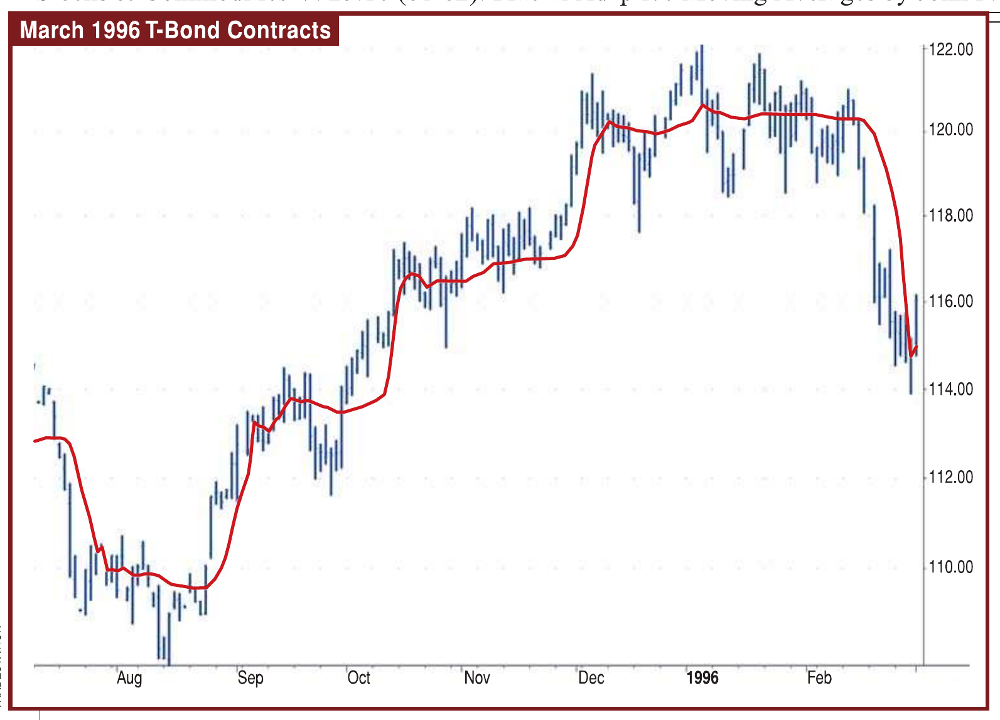

# Fractal Adaptive Moving Averages

- **Author:** John F. Ehlers
- **Publication:** Technical Analysis of STOCKS & COMMODITIES, Volume 23, October 2005, pp. 81–82
- **Article URL:** [Article PDF](https://technical.traders.com/archive/article.asp?file=\V23\C10\217EHLR.pdf)
- **Traders' Tips URL:** [Traders' Tips, October 2005](https://www.traders.com/Documentation/FEEDbk_docs/2005/10/TradersTips/TradersTips.html)

---

We all want to eliminate bad whipsaw trades. Here's a weapon you can add to your arsenal of technical indicators for just that purpose.

The objective of using filters is to separate the desirable signals from the undesirable ones. The practical application of moving averages often involves a tradeoff between the amount of smoothness required and the amount of lag that can be tolerated. Moving averages have this problem because the price data is not stationary and may have different bandwidths over different time intervals.

Various momentum-adaptive filtering techniques have been developed to take advantage of the nonstationary structure of prices. Adaptive filters have also been developed based on price statistics and the cyclic content of the price data. In this article, I will describe a different class of filters that monitors a measure of temporal nonstationarity and alters their bandwidth in response to this measure.

## Are Markets Fractal?

There is no argument that market prices are fractal. Fractal shapes are self-similar — that is, a particular fractal has the same roughness and sparseness no matter how closely you view them. For example, if you remove the labels from a five-minute chart, a daily chart, and a weekly chart, you would have difficulty telling them apart. This is the characteristic that makes them fractal. The fractal dimension that describes the sparseness at all magnification levels defines the self-similarity.

To determine the fractal dimension of a generalized pattern, we cover the pattern with N number of small objects of several various sizes s. The relationship of the number of objects in two sets of sizes is:

$$\frac{N_2}{N_1} = \left(\frac{s_1}{s_2}\right)^D$$

$$D = \frac{\log\left(\frac{N_2}{N_1}\right)}{\log\left(\frac{s_1}{s_2}\right)}$$

As an example of computing the fractal dimension, we start with a line segment that is 10 meters long. We choose the two small dimensions as $s_1$ = one meter and $s_2$ = 0.1 meter. Placing boxes on the line, we can fit 10 one-meter units on a side of the 10-meter line segment. Therefore, $N_1$ = 10. Similarly, we can fit 100 boxes that are 0.1 meters on a side on the 10-meter line, and therefore, $N_2$ = 100. The fractal dimension of the line computes to be:

$$D = \frac{\log(100/10)}{\log(1/0.1)} = 1.0$$

As a second example, we will use the pattern as a square that is 10 meters on a side. Retaining the same sizes of our small square objects as one meter and 0.1 meter, respectively, we get $N_1$ = 100 and $N_2$ = 10,000. When the square is our pattern, the fractal dimension will compute to be:

$$D = \frac{\log(10000/100)}{\log(1/0.1)} = 2.0$$

Natural fractals, such as a shoreline, lack the true regularity of an algorithmic structure but are self-similar in a statistical sense. Thus, in order to determine the fractal dimension of these natural shapes, we must average the measured fractal dimension made over different scales.

We could measure the fractal dimension of prices by covering the curve with a series of small boxes. This is a burdensome task, but if the price samples are uniformly spaced, the box count is approximately the average slope of the curve. Therefore, we can estimate the box count as the highest price during an interval minus the lowest price during that interval, divided by the length of the interval itself. The equation for the number of boxes is then:

$$N_1 = \frac{HighestPrice - LowestPrice}{Length}$$

We compute the fractal dimension by computing N over two equal intervals to get the averaging over each interval. Box1 covers the period from zero to T bars ago. Box2 covers the period from T to 2T bars ago. Therefore, $N_1$ = (HighestPrice − LowestPrice) over the interval from zero to T, divided by T. Similarly, $N_2$ = (HighestPrice − LowestPrice) over the interval from T to 2T, divided by T. We also define a $N_3$ = (HighestPrice − LowestPrice) over the entire interval from zero to 2T, divided by 2T. Since we are looking backward in time, the slope computation of the fractal dimension is:

$$D = \frac{\log(N_1 + N_2) - \log(N_3)}{\log(2)}$$

The fractal dimension varies over the range from D=1 to D=2. I use the fractal dimension to dynamically change the alpha of an exponential moving average (EMA). Since the prices are log-normal, it seems reasonable to use an exponential function to relate the fractal dimension to alpha. I chose the relationship as:

$$\alpha = \exp(-4.6 \cdot (D - 1))$$

When D=1, the exponent is zero — which means that $\alpha$ = 1. When alpha is one, the output of the exponential moving average is equal to the input. That's about as fast as anyone can make an average. On the other hand, $\alpha$ = 0.01 when D=2. This is a very slow moving average, analogous to a 200-day simple moving average. Thus, our fractal adaptive moving average (FRAMA) swings between being a fast moving average when D=1 and a very slow moving average when D=2. This adaptive structure rapidly follows major changes in price and slowly changes when the prices are in a congestion zone.



**FIGURE 1: FRAMA RESPONSE FOR LENGTH=16.** Here you see that FRAMA is very adaptive and smooth. Note that during a congestion period, it was very flat. This suggests that you will not be whipsawed in and out of trades.

The EasyLanguage code to compute FRAMA is given in the "FRAMA EasyLanguage code" sidebar. This code directly follows the development process described here in the text. The length input is the entire period to compute N3. Since this period is divided into two equal segments for N1 and N2, the length must be an even number. For the more adventurous reader, it might be instructive to plot the fractal dimension (the variable Dimen) as a standalone indicator to see if it creates some helpful signals.

As with any moving average, we are forced to compromise between responsiveness and smoothness. For that reason, the length parameter is an input that can easily be changed. On Figure 1, the chart of the March 1996 Treasury bond contract, you can see how adaptive and smooth FRAMA is.

Figure 1 shows that FRAMA can be a valuable weapon in your arsenal of technical indicators. It rapidly follows significant changes in price but becomes very flat in congestion zones so that bad whipsaw trades can be eliminated.

## FRAMA EasyLanguage Code

```easylanguage
Inputs:
    Price((H+L)/2);
    N(16);
{N must be an even number}

Vars:
    count(0);
    N1(0),
    N2(0),
    N3(0),
    HH(0),
    LL(0),
    Dimen(0),
    alpha(0),
    Filt(0);

N3 = (Highest(High, N) - Lowest(Low, N)) / N;

HH = High;
LL = Low;
For count = 0 to N/2 - 1 begin
    If High[count] > HH then HH = High[count];
    If Low[count] < LL then LL = Low[count];
End;
N1 = (HH - LL) / (N / 2);

HH = High[N / 2];
LL = Low[N / 2];
For count = N/2 to N - 1 begin
    If High[count] > HH then HH = High[count];
    If Low[count] < LL then LL = Low[count];
End;
N2 = (HH - LL) / (N / 2);

If N1 > 0 and N2 > 0 and N3 > 0 then Dimen = (Log(N1 + N2) - Log(N3)) / Log(2);

alpha = ExpValue(-4.6*(Dimen - 1));
If alpha < .01 then alpha = .01;
If alpha > 1 then alpha = 1;

Filt = alpha*Price + (1 - alpha)*Filt[1];
If CurrentBar < N + 1 then Filt = Price;

Plot1(Filt);
```

## About The Author

John F. Ehlers is a pioneer in introducing maximum entropy spectrum analysis to technical traders through his MESA software.

## Suggested Reading

- Chande, Tushar S., and Stanley Kroll [1994]. *The New Technical Trader*, John Wiley & Sons.
- Ehlers, John F. [2001]. *Rocket Science For Traders*, John Wiley & Sons.
- Ehlers, John F. [2004]. *Cybernetic Analysis For Stocks And Futures*, John Wiley & Sons.
- Kaufman, Perry J. [2005]. *New Trading Systems And Methods*, 4th ed., John Wiley & Sons.

---

See our Traders' Tips section for program code implementing John Ehlers' technique.

---

## BibTeX

```bibtex
@article{ehlers_frama_2005,
  author    = {Ehlers, John F.},
  title     = {Fractal Adaptive Moving Averages},
  journal   = {Technical Analysis of STOCKS \& COMMODITIES},
  volume    = {23},
  number    = {10},
  pages     = {81--82},
  year      = {2005},
  month     = oct,
  url       = {https://technical.traders.com/archive/article.asp?file=\V23\C10\217EHLR.pdf}
}

@misc{traders_tips_2005_10,
  author       = {{Technical Analysis of STOCKS \& COMMODITIES}},
  title        = {Traders' Tips: Fractal Adaptive Moving Averages by John F. Ehlers},
  howpublished = {online},
  year         = {2005},
  month        = oct,
  url          = {https://www.traders.com/Documentation/FEEDbk_docs/2005/10/TradersTips/TradersTips.html}
}
```
