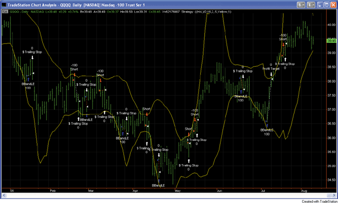
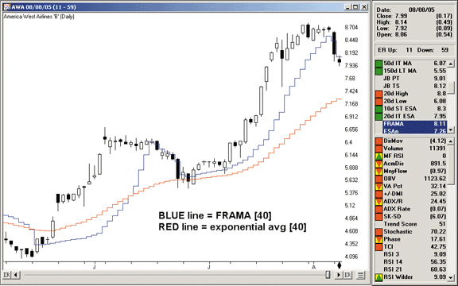
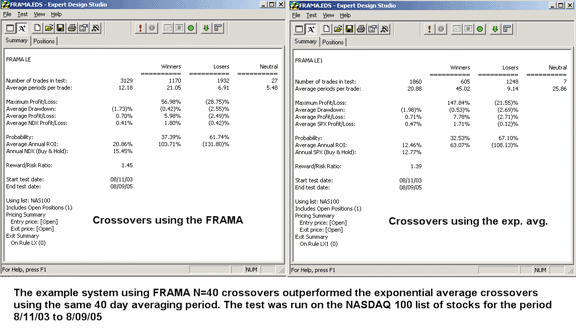
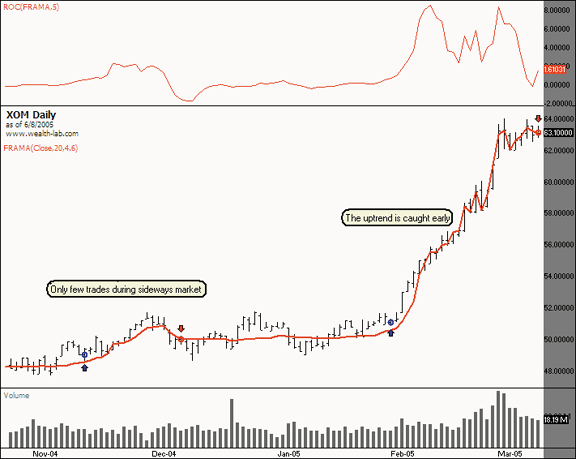
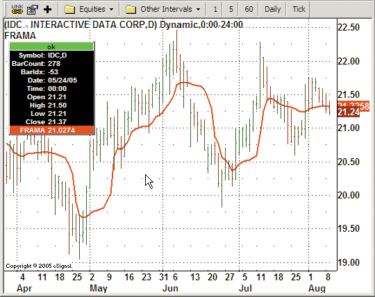
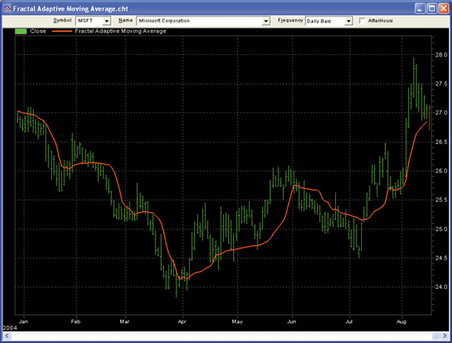
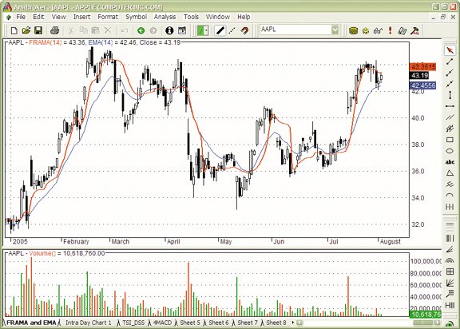
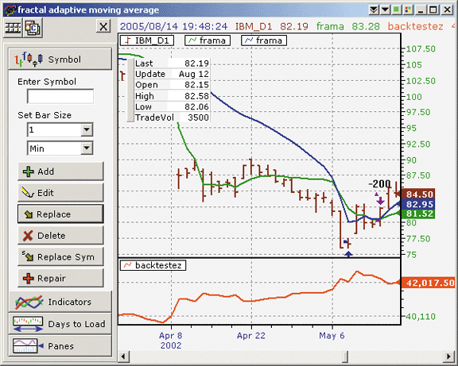

# Traders' Tips: October 2005

- **Article:** Fractal Adaptive Moving Averages by John F. Ehlers
- **Traders' Tips URL:** [Traders' Tips, October 2005](https://www.traders.com/Documentation/FEEDbk_docs/2005/10/TradersTips/TradersTips.html)

---

## TradeStation: October 2005

John Ehlers' article in this issue, "Fractal Adaptive Moving Averages," already presents some EasyLanguage code for an adaptive moving average. This adaptive moving average is based on the fractal properties of the price data.

We have converted Ehlers' code for this moving average into an EasyLanguage function, so that it can be called from any indicator or strategy. The function's name is "AdaptMovAvg_Fractal."

We have also adapted an existing strategy based on Bollinger Bands so that it calls this new function. The revised Bollinger Band strategy is called "FractalAMA Bands." It calls "AdaptMovAvg_Fractal" to compute the mean of the Bollinger Band, and uses a FRAMA-based standard deviation to compute the upper and lower bands.



**FIGURE 1: TRADESTATION, QQQQ.**

```easylanguage
Strategy:  FractalAMA Bands
{ The IntrabarOrderGeneration attribute is set to false in this strategy because
  strategy calculations depend on end-of-bar prices. }
[IntrabarOrderGeneration = false]
inputs:
 Price( 0.5 * ( H + L ) ),
 N( 16 ),
 NumDevsUp( 2 ),
 NumDevsDn( 2 ),
 TrailAmt( 0.5 ),
 BandColor( Yellow ),
 DataType( 1 ) ; { pass in 1 if you are working with the entire population, and 2
                    if you are working with a sample and want the standard deviation
                    for the population }
variables:
 Divisor( 0 ),
 Mean( 0 ),
 SumSqr( 0 ),
 AvgDiff( 0 ),
 FracStandardDev( 0 ),
 LowerBand( 0 ),
 UpperBand( 0 ),
 TL_ID1( -1 ),
 TL_ID2( -1 ) ;
// AvgDiff = 0 ;
Divisor = Iff( DataType = 1, N, N - 1 ) ;
if Divisor > 0 then
 begin
 Mean = AdaptMovAvg_Fractal( Price, N ) ;
 SumSqr = 0 ;
 for Value1 = 0 to N - 1
  begin
  SumSqr = SumSqr + Square( Price[Value1] - Mean ) ;
  end ;
 AvgDiff = SumSqr / Divisor ;
 end ;
if AvgDiff > 0 then
 FracStandardDev = SquareRoot( AvgDiff )
else
 FracStandardDev = 0 ;
LowerBand = Mean - NumDevsDn * FracStandardDev ;
UpperBand = Mean + NumDevsUp * FracStandardDev ;
if CurrentBar > 1 and Low crosses over LowerBand then
 Buy ( "BBandLE" ) next bar LowerBand stop ;
if CurrentBar > 1 and High crosses under UpperBand then
 SellShort next bar at UpperBand Stop ;
SetStopShare ;
SetDollarTrailing( TrailAmt ) ;
SetProfitTarget ( 3 * TrailAmt ) ;
{ Use trendlines to "plot" the bands on the chart }
TL_ID1 = TL_New( Date[1], Time[1], UpperBand[1], Date,
 Time, UpperBand ) ;
TL_SetColor( TL_ID1, BandColor ) ;
TL_ID2 = TL_New( Date[1], Time[1], LowerBand[1], Date,
 Time, LowerBand ) ;
TL_SetColor( TL_ID2, BandColor ) ;

Function:  AdaptMovAvg_Fractal
inputs:
 Price( NumericSeries ),
 N( NumericSimple ) ; { N must be an even number }
variables:
 N3( 0 ),
 HH( 0 ),
 LL( 0 ),
 HalfN( 0 ),
 Count( 0 ),
 N1( 0 ),
 N2( 0 ),
 Dimen( 0 ),
 Alpha( 0 ),
 Filt( 0 ) ;
N3 = ( Highest( High, N ) - Lowest( Low, N ) ) / N ;
HH = High ;
LL = Low ;
HalfN = 0.5 * N ;
for Count = 0 to HalfN - 1
 begin
 if High[Count] > HH
  then HH = High[Count] ;
 if Low[Count] < LL then
  LL = Low[Count] ;
 end ;
N1 = ( HH - LL ) / HalfN ;
HH = High[HalfN] ;
LL = Low[HalfN] ;
for Count = HalfN to N - 1
 begin
 if High[Count] > HH then
  HH = High[Count] ;
 if Low[Count] < LL then
  LL = Low[Count] ;
 end ;
N2 = ( HH - LL ) / HalfN ;
if N1 > 0 and N2 > 0 and N3 > 0 then
 Dimen = ( Log( N1 + N2 ) - Log( N3 ) ) / Log( 2 ) ;
Alpha = ExpValue( -4.6 * ( Dimen - 1 ) ) ;
if Alpha < 0.01 then
 Alpha = 0.01
else if Alpha > 1 then
 Alpha = 1 ;
Filt = Alpha * Price + ( 1 - Alpha ) * Filt[1] ;
if CurrentBar < N + 1 then
 Filt = Price ;
AdaptMovAvg_Fractal = Filt ;
```

External file: [FRAMA.els](FRAMA.els)

--Mark Mills
TradeStation Securities, Inc.
www.TradeStationWorld.com

---

## MetaStock: October 2005

John Ehlers' article in this issue, "Fractal Adaptive Moving Averages," introduces an indicator of the same name. In his indicator formula, he restricts the number of periods to an even number. The MetaStock formula here uses a modified version where the input is half of the total period.

To enter this indicator into MetaStock:

1. In the Tools menu, select Indicator Builder.
2. Click New to open the Indicator Editor for a new indicator.
3. Type the name of the formula.
4. Click in the larger window and input the following formula:

```metastock
Name:  FRAMA
Formula:
y:=Input("sample time periods",1,20,8);
y2:=2*y;
n1:=(HHV(H,y)-LLV(L,y))/y;
n2:=Ref((HHV(H,y)-LLV(L,y))/y,-y);
n3:=(HHV(H,y2)-LLV(L,y2))/y2;
x:=(Log(n1+n2)-Log(n3))/Log(2);
xt:=Exp(-4.6*(x-1));
x1:=If(xt<0.1,0.1,If(xt>1,1,xt));
x2:=1-x1;
If(Cum(1)=y2,
(MP() * x1) + (Ref(MP(),-1) * x2),
(MP() * x1) + (PREV * x2))
```

External file: [FRAMA.mss](FRAMA.mss)

---

## AIQ Expert Design Studio: October 2005

The AIQ code for John Ehlers' fractal adaptive moving average (FRAMA) is shown here together with two sample trading systems that we used in a backtest to determine if the FRAMA is an improvement over a standard exponential moving average.

A value of N=40 was used to run the FRAMA test. The exponential average test was run using a fixed period of 40 days. The systems buy when the price crosses above the moving average and sell when the price crosses below it.

Figure 1 shows a comparison of a FRAMA with N=40 to an exponential moving average for 40 days. The FRAMA is more responsive to price changes than the exponential moving average.



**FIGURE 2: AIQ EXPERT DESIGN STUDIO, FRAMA.**



**FIGURE 3: AIQ EXPERT DESIGN STUDIO, BACKTEST RESULTS FOR FRAMA.**

The AIQ code is shown here but can also be downloaded from www.aiqsystems.com.

```text
!! FRAMA Fractal Adaptive Moving Average
!! Author: John Ehlers
!! Coded by Richard Denning 8/9/05
!CODING ABREVIATIONS:
H is [high].
L is [low].
C is [close].
O is [open].
Price is  (H+L)/2.
Define N   40.    !MUST BE AN EVEN NUMBER
N3  is (highresult(H,N,0) - lowresult(L,N,0)) / N.
N1  is (highresult(H,N / 2 - 1,0)
  - lowresult(L,N / 2 - 1,0)) / (N / 2).
N2  is (highresult(H,N / 2,N / 2 - 1)
  - lowresult(L,N / 2,N / 2 - 1)) / (N / 2).
Dimen is iff(N1 > 0 and N2 > 0
  and N3 > 0,(ln(N1 + N2) - ln(N3)) / ln(2),0).
Alpha1 is Exp(-4.6 * (Dimen - 1)).
Alpha is iff(Alpha1 < 0.01,0.01,iff(Alpha1 > 1,1,Alpha1)).
Days  is ReportDate() - RuleDate().
Stop  if Days >   N + 2.
Stopesa  is iff(stop,Price, FILT).
FILT  is iff(ReportDate() - FirstDataDate() < N + 1,Price,
  Alpha * price + (1 - Alpha) * valresult(Stopesa, 1 )).
ESAn is expavg(Price,N).
List if 1.
!EXAMPLE SYSTEM USING FRAMA:
LE  if Price > FILT and valrule(Price < FILT,1).
LX if Price < FILT and valrule(Price > FILT,1).
!EXAMPLE SYSTEM USING EXPONENTIAL MOVING AVG:
LE1 if Price > ESAn and valrule(Price < ESAn,1).
LX1 if Price < ESAn and valrule(Price > ESAn,1).
```

External file: [FRAMA.eds](FRAMA.eds)

--Richard Denning
richard.denning@earthlink.net
www.aiqsystems.com

---

## Wealth-Lab: October 2005

In this month's Traders' Tips, we present a trend-following system based on the fractal adaptive moving average (FRAMA) indicator introduced by John Ehlers in his article this issue. Wealth-Lab's implementation uses the FRAMA indicator as a library include file.

The system uses the 20-day FRAMA of the closing price and also calculates the rate of change (ROC) of the past five days of FRAMA. It then waits for an increase of more than 0.5% (ROC > 0.5) to enter long positions and exits when the ROC drops below zero.



**FIGURE 4: WEALTH-LAB, FRACTAL ADAPTIVE MOVING AVERAGES.** In this figure, we can see that the FRAMA indicator is mostly flat in sideways phases while it is able to detect a trend very early, thus catching a big part of the move.

```wealthscript
WealthScript Code:
{$I 'FRAMA'}
var Bar, ROCPane: integer;
var F:integer = FRAMASeries(#Close, 20, 4.6);
var R:integer = ROCSeries(F, 5);
PlotSeriesLabel(F, 0, #red, #thick, 'FRAMA(Close,20,4.6)');
ROCPane:=CreatePane(75,true,true);
PlotSeriesLabel(R, ROCPane, #red, #thin,'ROC(FRAMA,5)');
for Bar := 20 to BarCount - 1 do
begin
  if not LastPositionActive then
    begin
    if @R[Bar] > 0.5 then BuyAtMarket(Bar+1, 'entry signal');
    end
  else
    begin
    if @R[Bar] < 0 then SellAtMarket(Bar+1, LastPosition, 'exit signal');
    end;
end;
```

External file: [FRAMA.wls](FRAMA.wls)

--Robert Sucher
www.wealth-lab.com

---

## eSignal: October 2005

For this issue's article by John Ehlers, "Fractal Adaptive Moving Averages," we've provided the eSignal formula file named "Frama.efs." The code is also displayed here.

The study has one parameter for the length, or periods, for the study that may be adjusted through the "Edit Studies" option of the Advanced Chart. The number entered will be forced to be the next higher even number if odd.



**FIGURE 5: eSIGNAL, FRACTAL ADAPTIVE MOVING AVERAGE.**

```javascript
/***************************************
Provided By : eSignal (c) Copyright 2005
Description:  Fractal Adaptive Moving Average - by John Ehlers
Version 1.0  8/9/2005
Notes:
October 2005 Issue - "FRAMA - Fractal Adaptive Moving Average"
* Study requires version 7.9 or higher.
* Length will be forced to be an even number. Odd numbers will be bumped up to the
  next even number.
Formula Parameters:     Defaults:
Length                              16
***************************************/
function preMain() {
    setPriceStudy(true);
    setStudyTitle("FRAMA ");
    setShowTitleParameters(false);
    setCursorLabelName("FRAMA", 0);
    setDefaultBarFgColor(Color.red, 0);
    setDefaultBarThickness(2, 0);
 
    var fp1 = new FunctionParameter("nLength", FunctionParameter.NUMBER);
        fp1.setName("Length");
        fp1.setDefault(16);
        fp1.setLowerLimit(1);
}
var bVersion = null;
var Filt = null;
var Filt_1 = null;   //previous bar's Filt
function main(nLength) {
    if (bVersion == null) bVersion = verify();
    if (bVersion == false) return;
    var nState = getBarState();
 
    if (nState == BARSTATE_NEWBAR) {
        Filt_1 = Filt;
    }
 
    var N = Math.round(nLength/2) * 2; // forces N to be even number
    var Price = hl2();
    var count = 0;
    var N1 = 0;
    var N2 = 0;
    var N3 = (highest(N, high()) - lowest(N, low())) / N;
    var HH = high(0);
    var LL = low(0);
    var Dimen = 0;
    var alpha = 0;
    Filt = 0;
 
    if (Filt_1 == null) Filt_1 = 0;
 
    for( count = 0; count <= (N/2 -1); count++) {
        if (high(-count) > HH) HH = high(-count);
        if (low(-count) < LL) LL = low(-count);
    }
    N1 = (HH - LL) / (N / 2);
    HH = high(-(N/2));
    LL = low(-(N/2));
 
    for (count = (N/2); count <= (N-1); count++) {
        if (high(-count) > HH) HH = high(-count);
        if (low(-count) < LL) LL = low(-count);
    }
    N2 = (HH - LL) / (N / 2);
 
    if (N1 > 0 && N2 > 0 && N3 > 0) {
        Dimen = (Math.log(N1 + N2) - Math.log(N3)) / Math.log(2);
    }
 
    alpha = Math.exp(-4.6*(Dimen - 1));
 
    if (alpha < 0.01) alpha = 0.01;
    if (alpha > 1) alpha = 1;
 
    Filt = (alpha*Price) + (1 - alpha)*Filt_1;
 
    if (getCurrentBarCount() < N) Filt = Price;
    return Filt;
}
/***** Support Functions *****/
function verify() {
 var b = false;
 if (getBuildNumber() < 700) {
  drawTextAbsolute(5, 35, "This study requires version 7.9 or later.", Color.white,
   Color.blue, Text.RELATIVETOBOTTOM|Text.RELATIVETOLEFT|Text.BOLD|Text.LEFT,
   null, 13, "error");
  drawTextAbsolute(5, 20, "Click HERE to
   upgrade.@URL=https://www.esignal.com/download/default.asp", Color.white, Color.blue,
   Text.RELATIVETOBOTTOM|Text.RELATIVETOLEFT|Text.BOLD|Text.LEFT, null, 13, "upgrade");
  return b;
 } else {
     b = true;
 }
 return b;
}
```

External file: [FRAMA.efs](FRAMA.efs)

--Jason Keck
eSignal, a division of Interactive Data Corp.
800 815-8256, www.esignalcentral.com

---

## NeuroShell Trader: October 2005

The fractal adaptive moving average introduced by John Ehlers in this issue can be easily implemented in NeuroShell Trader by combining a few of NeuroShell Trader's 800+ indicators and one custom indicator.

To implement the fractal adaptive moving average, select "New Indicator ..." from the Insert menu and use the Indicator Wizard to create the following indicators:

```text
N3:  Divide( Subtract( PriceRange( High, Low, n ), n )
N1:  Divide( Subtract( PriceRange( High, Low, n/2 ), n/2 )
N2:  Lag( N1, n/2 )
Dimen :  Divide( Subtract( Log( Add2( N1, N2 ), Log(N3), Log(2) )
Alpha:  Min2( Max2( Exp ( Multiply ( -4.6, Subtract ( Dimen, 1 ) ) ), .01), 1 )
Filt: AdaptiveExpAvg* ( Avg2( High, Low ), Alpha )
```



**FIGURE 6: NEUROSHELL TRADER, FRAMA.**

For more information on NeuroShell Trader, visit www.NeuroShell.com.

External file: [FRAMA.txt](FRAMA.txt)

--Marge Sherald, Ward Systems Group, Inc.
301 662-7950, sales@wardsystems.com
www.neuroshell.com

---

## AmiBroker: October 2005

In "Fractal Adaptive Moving Averages," John Ehlers presents a new method of adaptive smoothing based on the assumption that market prices are fractal. Coding the fractal adaptive moving average (FRAMA) in AmiBroker Formula Language (AFL) is straightforward.

Ready-to-use code is presented in Listing 1. For comparison purposes, the code also plots a standard exponential moving average of the same length (Figure 7).



**FIGURE 7: AMIBROKER, FRACTAL ADAPTIVE MOVING AVERAGE.** This AmiBroker screenshot shows a price chart of AAPL with a 14-day FRAMA (red line) and exponential moving average (blue line) of the same length.

```afl
// FRAMA - Fractal Adaptive Moving Average
Price = (H+L)/2;
N = Param( "N", 16, 2, 40, 2 ); // must be even

N3 = ( HHV( High, N ) - LLV( Low, N ) ) / N;

HH = HHV( High, N / 2 );
LL = LLV( Low, N / 2 );

N1 = ( HH - LL ) / ( N / 2 );

HH = HHV( Ref( High, - N/2 ), N/2 );
LL = LLV( Ref( Low, - N/2 ), N/ 2 );

N2 = ( HH - LL ) / ( N / 2 );

Dimen = IIf( N1 > 0 AND N2 > 0 AND N3 > 0, ( log( N1+N2) - log( N3 ) ) / log( 2 ), Null );

alpha = exp( -4.6 * (Dimen -1 ) );
alpha = Min( Max( alpha, 0.01 ), 1 ); // bound to 0.01...1 range

Frama = AMA( Price, alpha );

Plot( Frama, "FRAMA("+N+")", colorRed, styleThick );
Plot( EMA( C, N ) , "EMA("+N+")", colorBlue );
Plot( C, "Close", colorBlack, styleCandle );
```

A downloadable version of the formula is available from Amibroker.com website.

External file: [FRAMA.afl](FRAMA.afl)

--Tomasz Janeczko, AmiBroker.com
www.amibroker.com

---

## NeoTicker: October 2005

The fractal adaptive moving average (FRAMA) computation presented in the article "Fractal Adaptive Moving Averages" by John Ehlers can be implemented as a NeoTicker indicator. Listing 1 shows the code for this indicator.

The NeoTicker fractal adaptive moving average indicator plots a line that connects the calculation result of a fractal average for each bar. This indicator, like any other indicator, can be used in trading rules and strategies.



**FIGURE 8: NEOTICKER, FRACTAL ADAPTIVE MOVING AVERAGE.**

A downloadable version of this indicator and sample chart will be available at the NeoTicker Yahoo! User Group.

```basic
LISTING 1
function frama()
Const Filt = 0
      N    = 1
dim myhhv, myllv, myprice
   myhhv = itself.makeindicator ("hhv1", "hhv", Array("1.h"), _
                                 Array(params("N").str))
   myllv = itself.makeindicator ("llv1", "llv", Array("1.l"), _
                                 Array(params("N").str))
   myprice = itself.makeindicator ("price1", "fml", Array("1"), _
                                 Array(params("Price").str))
   if heap.size = 0 then
      heap.allocate(2)
      heap.value(Filt) = 0
      heap.value(N) = params("N").int
   end if
   if data1.barsnum(0) < (heap.value(N)+1) then
      itself.success = false
      heap.value(Filt) = myprice.value(0)
      exit function
   end if
   if (heap.value(N) mod 2) <> 0 then
      ntlib.debug("N must be even number, calculation abort")
      itself.success = false
      exit function
   end if
   N3 = (myhhv.value(0)-myllv.value(0))/heap.value(N)
   HH = data1.high(0)
   LL = data1.low(0)
   for i=0 to heap.value(N)/2-1
      if data1.high(i) > HH then
         HH = data1.high(i)
      end if
      if data1.low(i) < LL then
         LL = data1.low(i)
      end if
   next
   N1 = (HH-LL)/(heap.value(N)/2)
   HH = data1.high(heap.value(N)/2)
   LL = data1.low(heap.value(N)/2)
   for i=heap.value(N)/2 to heap.value(N)-1
      if data1.high(i) > HH then
         HH = data1.high(i)
      end if
      if data1.low(i) < LL then
         LL = data1.low(i)
      end if
   next
   N2 = (HH-LL)/(heap.value(N)/2)
   if N1>0 and N2>0 and N3>0 then
      Dimen = (ntlib.ln(N1+N2) - ntlib.ln(N3))/ntlib.ln(2)
      alpha = ntlib.exp(-4.6*(Dimen-1))
   end if
   if alpha<0.01 then alpha = 0.01
   if alpha>1 then alpha = 1
   frama = alpha*myprice.value(0)+(1-alpha)*heap.value(Filt)
   heap.value(Filt) = frama
end function
```

External file: [FRAMA.ntk](FRAMA.ntk)

--Kenneth Yuen, TickQuest Inc.
www.tickquest.com

---

## TradingSolutions: October 2005

In his article "Fractal Adaptive Moving Averages," John Ehlers describes an exponential moving average based on recent volatility, using fractal dimensions of recent prices to establish an alpha.

This function is also available as a downloadable file from the TradingSolutions website (www.tradingsolutions.com) in the Solution Library section.

```text
This code can be entered into TradingSolutions as follows:
Name: FRAMA Boxes
Inputs: High, Low, Period, Maximum Period
Div (Sub (HighestVL (High, Period, Maximum Period), LowestVL (Low, Period,
 Maximum Period)), Period)
Name: FRAMA Dimension
Inputs: High, Low, Period
Div (Sub (Log10 (Add (FRAMABoxes (High, Low, Div (Period, 2),Period), LagVL
 (FRAMABoxes (High, Low, Div (Period, 2), Period),Div (Period, 2), Period))),
 Log10 (FRAMABoxes (High, Low, Ident (Period), Period))), Log10 (2))
Name: FRAMA Alpha
Inputs: High, Low, Period
Max (Min (Exp (Mult (-4.6, Sub (FRAMADimension (High, Low, Period),1))),1),0.01)
Name: FRAMA
Inputs: High, Low, Period
EMA%% (Avg (High, Low), FRAMAAlpha (High, Low, Period))
```

External file: [FRAMA.tsl](FRAMA.tsl)

--Gary Geniesse
NeuroDimension, Inc.
800 634-3327, 352 377-5144
www.tradingsolutions.com

---

## Financial Data Calculator: October 2005

The article "Fractal Adaptive Moving Averages" by John Ehlers shows how to use a fractal dimension approximation to make an exponential moving average adaptive. In Financial Data Calculator (FDC), the implementation uses three custom functions.

```text
1. boxcount:
@ boxcount computes the boxcount each day for
@John Ehlers' Fractal Adaptive Moving Average
@syntax is 'n boxcount dataset' (n even)
N: #L
DS: #R
HH: N MOVMAX HIGH DS
LL: N MOVMIN LOW DS
(HH-LL)/N
Example: 10 BOXCOUNT IBM
2. fracdim:
@fracdim computes the fractal dimension each day
@for John Ehlers' Fractal Adaptive Moving Average
@syntax is 'n fracdim dataset' (n even)
N: #L
DS: #R
N3: N BOXCOUNT DS
N2: (N/2) BOXCOUNT DS
N1: (N/2) BOXCOUNT DS  BACK N/2
((LOG (N1 + N2)) -LOG N3)/LOG 2
Example: 10 FRACDIM IBM
3. frama:
@John Ehlers' Fractal Adaptive Moving Average
@syntax is 'n frama dataset'
N: #L
DS: #R
H: HIGH DS
L: LOW DS
ALPHA: EXP (-4.6 * (-1 + N FRACDIM DS ))
ALPHA EXPAVE (H + L)/2
Example: 10 FRAMA IBM
```

External file: [FRAMA.fdc](FRAMA.fdc)

--Bill Rafter
Mathematical Investment Decisions Inc.
856 857-9088, mathinvestdecisions.com

---

## BibTeX

```bibtex
@misc{traders_tips_2005_10,
  author       = {{Technical Analysis of STOCKS \& COMMODITIES}},
  title        = {Traders' Tips: Fractal Adaptive Moving Averages by John F. Ehlers},
  howpublished = {online},
  year         = {2005},
  month        = oct,
  url          = {https://www.traders.com/Documentation/FEEDbk_docs/2005/10/TradersTips/TradersTips.html}
}
```
