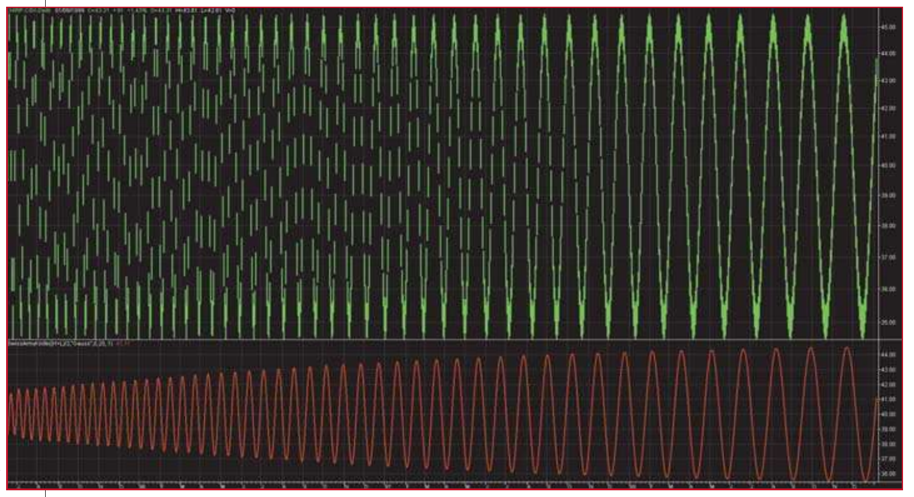
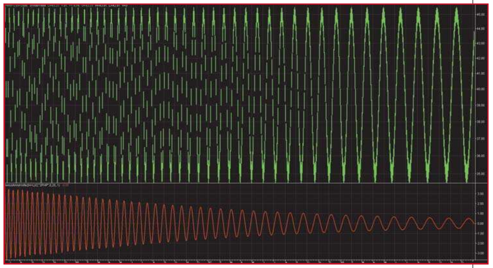
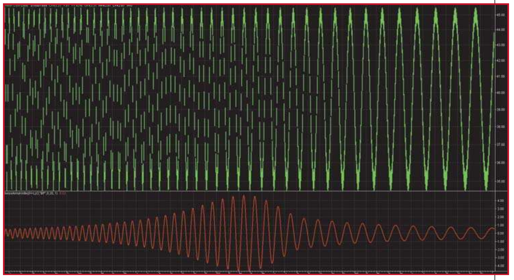
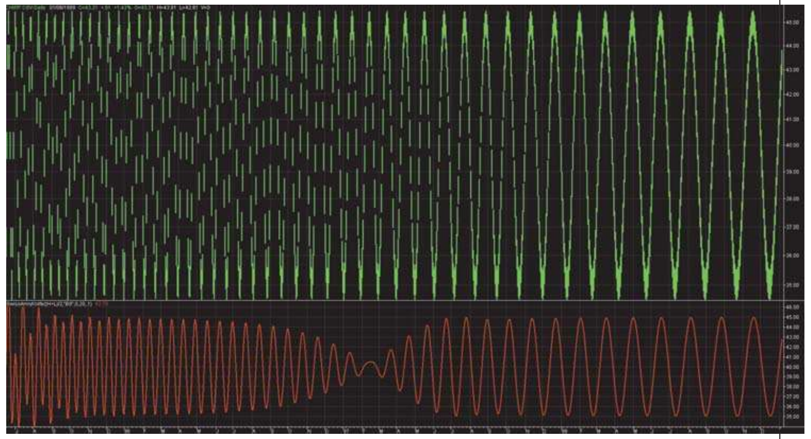
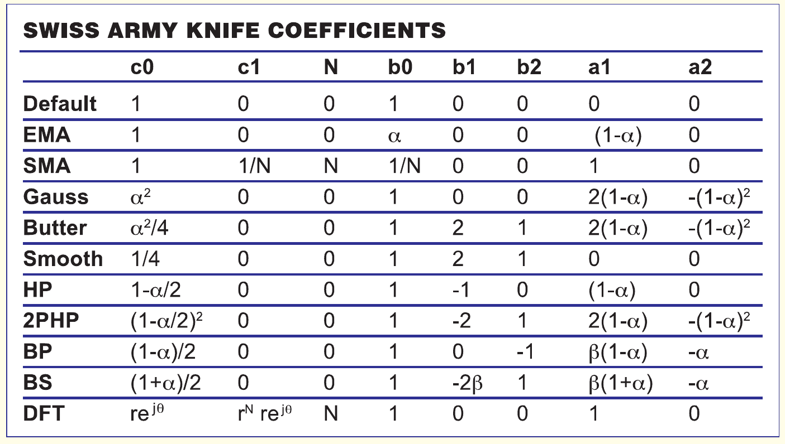

# Swiss Army Knife Indicator

- **Author:** John F. Ehlers
- **Publication:** Technical Analysis of STOCKS & COMMODITIES, Volume 24, January 2006, pp. 28–31, 50–53
- **Article URL:** [Article PDF](https://technical.traders.com/archive/article.asp?file=\V24\C01\005EHL.pdf)
- **Traders' Tips URL:** [Traders' Tips, January 2006](http://traders.com/Documentation/FEEDbk_docs/2006/01/TradersTips/TradersTips.html)

---

## The MacGyver Of Indicators

You've probably never heard of this indicator, but it has all the common functions such as smoothing and momentum generation. Find out why it's going to be your new best friend.

This indicator does some unusual things, such as band-stop and band reject filtering. Once you program this indicator into your trading platform, you can perform virtually any technical analysis technique with it. This unique general indicator results from general digital signal processing (DSP) concepts for discrete signal networks that appear in various forms in technical analysis.

## Z-Transforms

The description of this indicator involves Z-transforms. Z-transforms are a convenient way of solving difficult difference equations in much the same way that LaPlace transforms are used to solve differential equations in calculus. Difference equations arise from the use of sampled data, the way we have in technical analysis: Daily bars sample price data once a day. Intraday bars sample price data every minute, hour, or whatever. The concept is the same regardless of the sampling rate. In Z-transforms, $Z^{-1}$ stands for one sample period of delay. For simplicity, I will always refer to daily bars as the sample rate.

The transfer function of a discrete linear system is the ratio of the output of the system divided by the input. Since both the output and input can be described in terms of polynomials in the Z domain, we can write the transfer function of a very simple indicator as:

$$\frac{Output}{Input} = \frac{b_0 + b_1 Z^{-1}}{a_0 + a_1 Z^{-1}}$$

In this case, both the input and output involve only a constant term and a term having one unit of delay. By cross-multiplying and factoring, we can describe the output in terms of the input as:

$$Output = \frac{1}{a_0} \cdot (b_0 \cdot Input + b_1 Z^{-1} \cdot Input - a_1 Z^{-1} \cdot Output)$$

This equation is easily converted to indicator programming languages. For example, in EasyLanguage, N units of delay is noted as [N] after the variable. Thus, the transfer function programs to:

```
Output = 1/a0 * (b0 * Input + b1 * Input[1] - a1 * Output[1])
```

Suppose that $a_0 = 1$, $b_0 = \alpha$, $b_1 = 0$, and $a_1 = -(1-\alpha)$. In this case, the programmed equation is:

```
Output = alpha * Input + (1 - alpha) * Output[1]
```

In other words, the generalized simple expression becomes the familiar exponential moving average. Note that the coefficients for the input term and the output term sum to one. This means that the DC (direct current), or zero frequency, value of the filter is unity, so that if the input is constant for a long time, the output is (nearly) equal to the input.

With this introduction, you are ready for the Swiss Army Knife indicator (SWAK). The transfer response is a rational expression of two second-order polynomials as:

$$\frac{Output}{Input} = \frac{c_0 \cdot (b_0 + b_1 Z^{-1} + b_2 Z^{-2})}{1 - a_1 Z^{-1} - a_2 Z^{-2}} - c_1 Z^{-N}$$

Converting this to a programmable equation, we obtain:

```
Output = c0 * (b0 * Input + b1 * Input[1] + b2 * Input[2]) + a1 * Output[1] + a2 * Output[2] - c1 * Input[N]
```

All we have to do now is establish a table for the various coefficients to implement the SWAK. The equation need only be programmed once, and each of the coefficient sets can be "remarked out," except for the coefficient set desired in any instance.

## Exponential Moving Average

You have already been exposed to the exponential moving average (EMA). The complete coefficient set is:

| | $c_0$ | $c_1$ | $N$ | $b_0$ | $b_1$ | $b_2$ | $a_1$ | $a_2$ |
|---|---|---|---|---|---|---|---|---|
| **EMA** | 1 | 0 | 0 | $\alpha$ | 0 | 0 | $(1-\alpha)$ | 0 |

**FIGURE 1: EXPONENTIAL MOVING AVERAGE (EMA) COEFFICIENT SET**

But what does alpha mean? Alpha is commonly related to the equivalent smoothing of a simple moving average (SMA) of length L as:

$$\alpha = \frac{2}{L + 1}$$

If you tend to think of market data in terms of its frequency content as I do, the relationship between alpha and the cycle period where the corner of the attenuation starts is:

$$\alpha = \frac{\cos\left(\frac{2\pi}{Period}\right) + \sin\left(\frac{2\pi}{Period}\right) - 1}{\cos\left(\frac{2\pi}{Period}\right)}$$

In EasyLanguage, sines and cosines are computed in degrees rather than in radians, and therefore, 360 should be substituted for $2\pi$. As a check on your math, if we want to attenuate all cycle components shorter than 20 bars, we compute $\alpha = 0.2735$. This is roughly equivalent to a six-bar simple moving average (SMA).

## Simple Moving Average

A simple moving average sums N samples of data and divides the sum by N. A more efficient method of computing an SMA is to drop off the oldest term and add the newest data value divided by N. To implement this method of computing an SMA of length N, the coefficients of the SWAK indicator are:

| | $c_0$ | $c_1$ | $N$ | $b_0$ | $b_1$ | $b_2$ | $a_1$ | $a_2$ |
|---|---|---|---|---|---|---|---|---|
| **SMA** | 1 | $1/N$ | $N$ | $1/N$ | 0 | 0 | 1 | 0 |

**FIGURE 2: SIMPLE MOVING AVERAGE (SMA) COEFFICIENTS.** Here you see the coefficients of the Swiss Army Knife indicator for an SMA of length N.

Be careful of using this implementation of the SMA as initialization. For example, if you start with a zero value of the SMA and you are averaging a stock the price of which is approximately 30, it will take some time for the SMA to recover from the incorrect initial value. Initialization error recovery time can be reduced with a line of code similar to:

```
If CurrentBar < N then SMA = Price;
```

## Two-Pole Gaussian Filter

A Gaussian filter offers a very low lag compared to other smoothing filters of like order. (The order is the largest exponent in the transfer equation.) It can be implemented by taking an EMA of an EMA, but that method leaves the computation of the correct alpha to be nebulous. The double EMA is the equivalent of squaring the transfer response of an EMA. Therefore, the coefficients of the SWAK indicator for the two-pole Gaussian filter are:

| | $c_0$ | $c_1$ | $N$ | $b_0$ | $b_1$ | $b_2$ | $a_1$ | $a_2$ |
|---|---|---|---|---|---|---|---|---|
| **Gauss** | $\alpha^2$ | 0 | 0 | 1 | 0 | 0 | $2(1-\alpha)$ | $-(1-\alpha)^2$ |

**FIGURE 3: TWO-POLE GAUSSIAN FILTER COEFFICIENTS**

The correct value of alpha is related to the cut-off period that you wish to attenuate. It can be computed as:

$$\alpha = -\beta_1 + \sqrt{\beta_1^2 + 2\beta_1}$$

where:

$$\beta_1 = 2.415 \left(1 - \cos\left(\frac{2\pi}{Period}\right)\right)$$

Note that alpha has a different meaning than it did in the EMA equation. The same is true for beta in subsequent calculations.



**FIGURE 4: GAUSSIAN FILTER ATTENUATES SHORTER CYCLES.** Here you see that the Gaussian filter is a low-pass filter, which means that lower frequencies pass and attenuate the higher frequencies.

> The Swiss Army Knife indicator is a versatile approach that creates a variety of responses.

Figure 4 shows a theoretical "chirped" sinewave the period of which is slowly increasing from a 10-bar cycle at the left of the screen to a 40-bar cycle at the right of the screen. The period for the Gaussian filter is set at 20, which is near the center of the screen. The figure shows that the Gaussian filter is a low-pass filter, allowing the lower frequencies to pass and attenuating the higher frequencies.

## Two-Pole Butterworth Filter

The response of a two-pole Butterworth filter can be approximated by introducing a second order polynomial with binomial coefficients in the numerator of the transfer response of the Gaussian filter. The alpha is computed the same as for the Gaussian filter. Doing this, the SWAK indicator coefficients are:

| | $c_0$ | $c_1$ | $N$ | $b_0$ | $b_1$ | $b_2$ | $a_1$ | $a_2$ |
|---|---|---|---|---|---|---|---|---|
| **Butter** | $\alpha^2/4$ | 0 | 0 | 1 | 2 | 1 | $2(1-\alpha)$ | $-(1-\alpha)^2$ |

**FIGURE 5: TWO-POLE BUTTERWORTH FILTER.** Here you see the coefficients for the Swiss Army Knife indicator.

While trivial, but shown for completeness, a low-lag three-tap smoothing filter is obtained by eliminating the higher-order terms in the denominator of the transfer response. This smoother is implemented using the coefficients:

| | $c_0$ | $c_1$ | $N$ | $b_0$ | $b_1$ | $b_2$ | $a_1$ | $a_2$ |
|---|---|---|---|---|---|---|---|---|
| **Smooth** | $1/4$ | 0 | 0 | 1 | 2 | 1 | 0 | 0 |

**FIGURE 6: COEFFICIENTS USED FOR SMOOTHING**

The smoothing realized from this filter is extremely modest, rejecting only the two-bar cycle component.

## High-Pass Filter

A high-pass filter is the more general version of a momentum function. Its purpose is to eliminate the constant (DC) term and lower-frequency (longer-period) terms that do not contribute to the shorter-term cycles in the data.

| | $c_0$ | $c_1$ | $N$ | $b_0$ | $b_1$ | $b_2$ | $a_1$ | $a_2$ |
|---|---|---|---|---|---|---|---|---|
| **HP** | $1-\alpha/2$ | 0 | 0 | 1 | $-1$ | 0 | $(1-\alpha)$ | 0 |

**FIGURE 7: HIGH-PASS FILTER.** This filter eliminates the constant (DC) term and lower-frequency terms.

Alpha for the high-pass filter is computed exactly the same as it is for the EMA. That is:

$$\alpha = \frac{\cos\left(\frac{2\pi}{Period}\right) + \sin\left(\frac{2\pi}{Period}\right) - 1}{\cos\left(\frac{2\pi}{Period}\right)}$$

## Two-Pole High-Pass Filter

Just as we got sharper filtering by squaring the transfer response of the EMA to get a Gaussian low-pass filter, we can square the transfer response of the high-pass filter to improve the filtering. In general, there is an approximate one-bar lag penalty for obtaining the improved filtering. The SWAK indicator coefficients are:

| | $c_0$ | $c_1$ | $N$ | $b_0$ | $b_1$ | $b_2$ | $a_1$ | $a_2$ |
|---|---|---|---|---|---|---|---|---|
| **2PHP** | $(1-\alpha/2)^2$ | 0 | 0 | 1 | $-2$ | 1 | $2(1-\alpha)$ | $-(1-\alpha)^2$ |

**FIGURE 8: TWO-POLE HIGH-PASS FILTER.** Here you see the coefficients for the Swiss Army Knife indicator.

Alpha is computed exactly the same as for the Gaussian response:

$$\alpha = -\beta_1 + \sqrt{\beta_1^2 + 2\beta_1}$$

where:

$$\beta_1 = 2.415 \left(1 - \cos\left(\frac{2\pi}{Period}\right)\right)$$



**FIGURE 9: 2PHP FILTER ATTENUATES LONGER CYCLES.** This is a high-pass filter, which means that higher frequencies are allowed to pass and attenuate the lower frequencies.

Figure 9 shows the same theoretical "chirped" sinewave and the 2PHP response. The period for the 2PHP filter is set at 20, which is near the center of the screen. The figure shows that the 2PHP filter is a high-pass filter, allowing the higher frequencies to pass and attenuating the lower frequencies.

## Bandpass Filter

This is where the SWAK indicator starts to get interesting! It can generate bandpass response to extract only the frequency component of interest. For example, if you want to examine the weekly cycle in the data, just set the period to 5. Monthly data can be extracted by setting the period to 20, 21, or 22. Since the passband of the filter is finite, the exact setting of the center period is not crucial.

Another way to use the bandpass filter is to create a bank of them, separated by a fixed percentage, and display all of the filter outputs as an indicator set. Doing this, you can see at which filter the data peaks. For filters tuned to periods shorter than the dominant cycle in the data, the filter response will peak before the peak in the data. This way, you can estimate the current dominant cycle and, if the data are stationary, you can even predict the turning point.

The SWAK coefficients for the bandpass filter are:

| | $c_0$ | $c_1$ | $N$ | $b_0$ | $b_1$ | $b_2$ | $a_1$ | $a_2$ |
|---|---|---|---|---|---|---|---|---|
| **BP** | $(1-\alpha)/2$ | 0 | 0 | 1 | 0 | $-1$ | $\beta(1+\alpha)$ | $-\alpha$ |

**FIGURE 10: BANDPASS FILTER.** Here you see the coefficients for the Swiss Army Knife indicator.

In this case:

$$\beta = \cos\left(\frac{2\pi}{Period}\right)$$

Don't forget to substitute 360 for $2\pi$ in some languages. So if you wanted to examine monthly data, the value of beta would be 0.951.

The selectivity of the bandpass filter is established by the variable alpha. Alpha is a function of the center frequency of the filter as well as the width of the passband. Letting $\pm\delta$ be the descriptor of the filter passband, where $\delta$ is a percentage of the center, we can compute alpha as:

$$\alpha = \gamma - \sqrt{\gamma^2 - 1}$$

where:

$$\gamma = \frac{1}{\cos\left(\frac{2\pi \cdot \delta}{Period}\right)}$$

It is easy to get carried away with trying to make the bandpass filter passband either too narrow or too wide. As a guideline, I suggest keeping the half bandwidth between 5% and 50%. That is $0.05 < \delta < 0.5$.



**FIGURE 11: BAND-PASS RESPONSE ALLOWS ONLY A RANGE OF FREQUENCIES TO PASS**

Figure 11 shows the same theoretical "chirped" sinewave and the bandpass response of the SWAK. The period for the bandpass filter is set at 20, which is near the center of the screen. The bandpass response speaks for itself.

## Band-Stop Filter

It might be interesting to also examine the data if the weekly or monthly components were removed, leaving all the other components in place. The alpha and beta variables are computed exactly as they were for the bandpass filter. The SWAK coefficients are:

| | $c_0$ | $c_1$ | $N$ | $b_0$ | $b_1$ | $b_2$ | $a_1$ | $a_2$ |
|---|---|---|---|---|---|---|---|---|
| **BS** | $(1+\alpha)/2$ | 0 | 0 | 1 | $-2\beta$ | 1 | $\beta(1+\alpha)$ | $-\alpha$ |

**FIGURE 12: BAND-STOP FILTER.** The Swiss Army Knife coefficients are seen here.

An interesting set of indicators would be to compute a bank of band-stop filters, each having a percentage increase in the value of the center period, and plot them overlaid on your bar chart. The smoothest curve would be the one with the dominant cycle removed. The shorter and longer filters can also give you insight into the market action.



**FIGURE 13: BAND-STOP RESPONSE BLOCKS A RANGE OF FREQUENCIES**

Figure 13 again shows the same theoretical "chirped" sinewave, but with the band-stop response of the SWAK indicator. The period for the band-stop filter is set at 20, which is near the center of the screen. The band-stop response speaks for itself.

## Sliding Digital Fourier Transform

Fourier transforms are useless for technical analysis because the data is simply not stationary for a sufficient duration to make a valid estimate of the spectrum. Superior spectrum estimates can be made with the MESA algorithm or measurements of the dominant cycle can be made using the Hilbert transform. I include the description of the digital Fourier transform (DFT) here simply to show that it can be done with the SWAK indicator. The coefficients are:

| | $c_0$ | $c_1$ | $N$ | $b_0$ | $b_1$ | $b_2$ | $a_1$ | $a_2$ |
|---|---|---|---|---|---|---|---|---|
| **DFT** | $r\mathrm{e}^{j\theta}$ | $r\mathrm{e}^{j\theta}$ | $N$ | 1 | 0 | 0 | 1 | 0 |

**FIGURE 14: SLIDING DIGITAL FOURIER TRANSFORM (DFT).** Here you see the coefficients for the Swiss Army Knife indicator.

For stability, $r$ is any number slightly less than unity — such as 0.999. As with all Fourier transforms, analysis is performed only at discrete periods. Those periods are "k" where $k \leq N$, and the variable theta is computed as $\theta = 2\pi k / N$.

The programming solution involves complex arithmetic. Since the DFT is useless for trading, I have not included it in the SWAK EasyLanguage code.

## Summary

The Swiss Army Knife indicator is a versatile approach that creates a variety of responses that range from smoothers to oscillators. Novel bandpass and band-stop filters can also be produced. All of this can be done with one line of code in most platforms. The various responses come from the coefficients that can be called functions, if you prefer.



**SIDEBAR FIGURE 1:** Summary of coefficients of the 10 separate and distinct responses that can be generated from the Swiss Army Knife indicator.

Combinations of several SWAK outputs can also make a variety of new and unique indicators. For example, a moving average convergence/divergence (MACD) is just the difference of two EMAs. Why not try the difference of two Gaussian filters to get sharper filtering in the indicators? Even more interesting, why not try the difference of two bandpass filters — one a longer period center and the other a shorter period center — to eliminate even more unwanted junk from the data?

An interesting predictive oscillator can be obtained by plotting two bandpass filter differences, one having a slightly shorter set of periods than the other. The list goes on and on. For example, the difference of two band-stop filters is exactly out of phase with the difference of two bandpass filters with the same settings. Novel combinations of bandpass and band-stop filters could produce some illuminating indicators.

I hope I have met my goal of giving you an interesting new tool to use in your technical analysis, and perhaps some ideas on how you can create your own unique indicator.

## Swiss Army Knife EasyLanguage Code

```easylanguage
{
SWISS ARMY KNIFE INDICATOR
by John Ehlers
}
Inputs:
    Price((H+L)/2),
    N(0),
    Period(20),
    delta1(.1);
Vars:
    c0(1),
    c1(0),
    b0(1),
    b1(0),
    b2(0),
    a1(0),
    a2(0),
    alpha(0),
    beta1(0),
    gamma1(0),
    Filt(0);

If Type = "EMA" Then Begin
    If CurrentBar <= N then Filt = Price;
    alpha = (Cosine(360/Period) + Sine(360/Period) - 1) / Cosine(360/Period);
    b0 = alpha;
    a1 = 1 - alpha;
End;

If Type = "SMA" Then Begin
    If CurrentBar <= N then Filt = Price;
    c1 = 1/N;
    b0 = 1/N;
    a1 = 1;
End;

If Type = "Gauss" Then Begin
    If CurrentBar <= N then Filt = Price;
    beta1 = 2.415*(1 - Cosine(360 / Period));
    alpha = -beta1 + SquareRoot(beta1*beta1 + 2*beta1);
    c0 = alpha*alpha;
    a1 = 2*(1 - alpha);
    a2 = -(1 - alpha)*(1 - alpha);
End;

If Type = "Butter" Then Begin
    If CurrentBar <= N then Filt = Price;
    beta1 = 2.415*(1 - Cosine(360 / Period));
    alpha = -beta1 + SquareRoot(beta1*beta1 + 2*beta1);
    c0 = alpha*alpha / 4;
    b1 = 2;
    b2 = 1;
    a1 = 2*(1 - alpha);
    a2 = -(1 - alpha)*(1 - alpha);
End;

If Type = "Smooth" Then Begin
    c0 = 1/4;
    b1 = 2;
    b2 = 1;
End;

If Type = "HP" Then Begin
    If CurrentBar <= N then Filt = 0;
    alpha = (Cosine(360/Period) + Sine(360/Period) - 1) / Cosine(360/Period);
    c0 = 1 - alpha / 2;
    b1 = -1;
    a1 = 1 - alpha;
End;

If Type = "2PHP" Then Begin
    If CurrentBar <= N then Filt = 0;
    beta1 = 2.415*(1 - Cosine(360 / Period));
    alpha = -beta1 + SquareRoot(beta1*beta1 + 2*beta1);
    c0 = (1 - alpha / 2)*(1 - alpha / 2);
    b1 = -2;
    b2 = 1;
    a1 = 2*(1 - alpha);
    a2 = -(1 - alpha)*(1 - alpha);
End;

If Type = "BP" Then Begin
    If CurrentBar <= N then Filt = Price;
    beta1 = Cosine(360 / Period);
    gamma1 = 1 / Cosine(720*delta1 / Period);
    alpha = gamma1 - SquareRoot(gamma1*gamma1 - 1);
    c0 = (1 - alpha) / 2;
    b2 = -1;
    a1 = beta1*(1 + alpha);
    a2 = -alpha;
End;

If Type = "BS" Then Begin
    If CurrentBar <= N then Filt = Price;
    beta1 = Cosine(360 / Period);
    gamma1 = 1 / Cosine(720*delta1 / Period);
    alpha = gamma1 - SquareRoot(gamma1*gamma1 - 1);
    c0 = (1 + alpha) / 2;
    b1 = -2*beta1;
    b2 = 1;
    a1 = beta1*(1 + alpha);
    a2 = -alpha;
End;

If CurrentBar > N Then Begin
    Filt = c0*(b0*Price + b1*Price[1] + b2*Price[2]) + a1*Filt[1] +
        a2*Filt[2] - c1*Price[N];
    Plot1(Filt, "Swiss");
End;
```

## About The Author

John Ehlers is a pioneer in introducing maximum entropy spectrum analysis to technical traders through his MESA software.

## Suggested Reading

- Lyons, Richard, and Amy Bell [2004]. "The Swiss Army Knife Of Digital Networks," *IEEE Signal Processing Magazine*, May.
- Ehlers, John [2004]. *Cybernetic Analysis For Stocks And Futures*, John Wiley & Sons.
- Ehlers, John [2002]. *MESA And Trading Market Cycles*, 2d ed., John Wiley & Sons.
- Ehlers, John [2001]. *Rocket Science For Traders*, John Wiley & Sons.
- Ehlers, John [2000]. "Hilbert Indicators Tell You When To Trade," *Technical Analysis of STOCKS & COMMODITIES*, Volume 18: March.
- Wu, Amy [2002]. "Fast Fourier Transform," *Technical Analysis of STOCKS & COMMODITIES*, Volume 20: July.

---

See our Traders' Tips section for program code implementing John Ehlers's technique.

---

## BibTeX

```bibtex
@article{ehlers_swiss_army_knife_2006,
  author    = {Ehlers, John F.},
  title     = {Swiss Army Knife Indicator},
  journal   = {Technical Analysis of STOCKS \& COMMODITIES},
  volume    = {24},
  number    = {1},
  pages     = {28--31, 50--53},
  year      = {2006},
  month     = jan,
  url       = {https://technical.traders.com/archive/article.asp?file=\V24\C01\005EHL.pdf}
}

@misc{traders_tips_2006_01,
  author       = {{Technical Analysis of STOCKS \& COMMODITIES}},
  title        = {Traders' Tips: Swiss Army Knife Indicator by John F. Ehlers},
  howpublished = {online},
  year         = {2006},
  month        = jan,
  url          = {http://traders.com/Documentation/FEEDbk_docs/2006/01/TradersTips/TradersTips.html}
}
```
