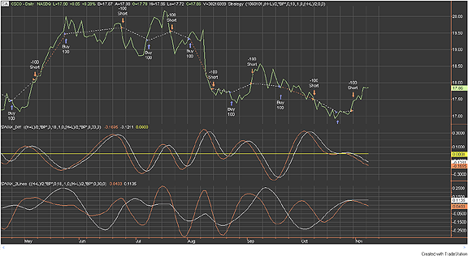
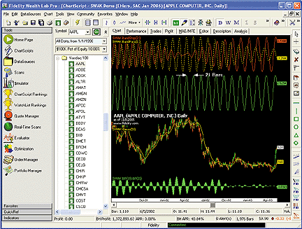
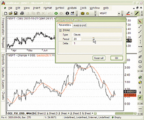
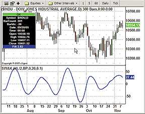
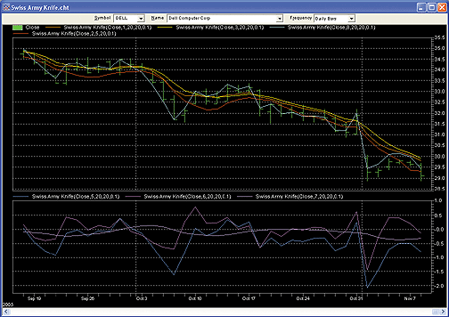
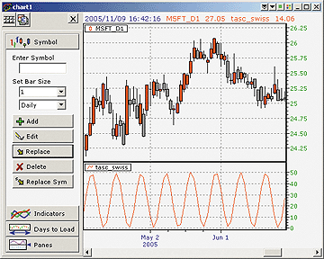
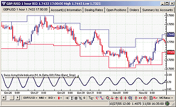
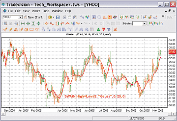

# Traders' Tips: January 2006

- **Article:** Swiss Army Knife Indicator by John F. Ehlers
- **Traders' Tips URL:** [Traders' Tips, January 2006](http://traders.com/Documentation/FEEDbk_docs/2006/01/TradersTips/TradersTips.html)

---

## TradeStation: January 2006

John Ehlers' article in this issue, "Swiss Army Knife Indicator," presents a generalized filtering algorithm capable of creating simple averages, exponential averages, Gaussian filters, Butterworth filters, smoothers, high-pass filters, two-pole high-pass filters, bandpass filters, and band-stop filters — all from the same code and just changing coefficient selections.

To download this code, search for the file "Swak.eld" at the TradeStation Support Center at www.TradeStation.com.



**FIGURE 1: TRADESTATION, SWISS ARMY KNIFE INDICATOR.** The subgraph 1 at the top of the chart shows CISCO daily line-on-close bars. The trades shown are generated from signals based on the bandpass filter with a 21-bar period and default 0.1 delta parameter.

--Mark Mills
TradeStation Securities, Inc.
www.TradeStationWorld.com

---

## Wealth-Lab: January 2006

We'll keep our Traders' Tip simple this month and recreate the chirped sine wave so that you too can easily visualize your filters on a theoretical signal. See Figure 2 for an example.



**FIGURE 2: WEALTH-LAB, CHIRPED SINE WAVE.** Here's a sample implementation of the chirped sine wave in Wealth-Lab.

```wealthscript
WealthScript code:
{$I 'SWAK'}
var Bar, CSW, CSWPane, SPane, OPane, bc, n, hBS, hBP, hGauss, hDiff: integer;
var t, StartFrq, Rate: float;
SetColorScheme( #Green, #Red, #Blue, #Black, #Black, #White );
bc := BarCount;
StartFrq := Trunc( bc / 100 );
Rate := Trunc( bc / 25 );
{* Create and plot a chirped sine wave, decreasing frequency *}
CSW := CreateSeries;
n := bc - 1;
for Bar := 0 to bc - 1 do
begin
  t := Bar / bc;
  @CSW[n] := Sin( 360 * ( StartFrq + t * Rate ) * t );
  Dec( n );
end;
CSWPane := CreatePane( 100, true, true );
PlotSeriesLabel( CSW, CSWPane, #Lime, #Thin, 'Chirped Sine' );
{* Run the Chirped signal through the filters and plot *}
SPane := CreatePane( 100, true, true );
hBS := SWAKSeries( CSW, 21, 'BS' );
PlotSeriesLabel( hBS, SPane, #Red, #Thin, 'SWAK BandStop(21)' );
hBP := SWAKSeries( CSW, 21, 'BP' );
PlotSeriesLabel( hBP, SPane, #Yellow, #Dotted, 'SWAK BandPass(21)' );
{* Predictive oscillator *}
OPane := CreatePane( 100, false, false );
hDiff := SubtractSeries( SWAKSeries( #Close, 19, 'BP' ), SWAKSeries( #Close, 21, 'BP' ) );
PlotSeriesLabel( hDiff, OPane, #Lime, #Histogram, 'SWAK BP(19)-BP(21)' );
{* Plot the SWAK Gaussian of the #Close series *}
hGauss := SWAKSeries( #Close, 50, 'Gauss' );
PlotSeriesLabel( hGauss, 0, #Yellow, #Thin, 'SWAK Gauss(50)' );
HideVolume;
```

External file: [SWAK.wls](SWAK.wls)

--Robert Sucher
www.wealth-lab.com

---

## AmiBroker: January 2006

In "Swiss Army Knife Indicator," John Ehlers presents an indicator that is based on the second-order infinite impulse response (IIR) filter. IIR filters are capable of producing many useful indicators, including EMA, SMA, Gaussian filter, Butterworth filter, high-pass filter, two-pole high-pass filter, bandpass, and band-stop filters.



**FIGURE 3: AMIBROKER, SWISS ARMY KNIFE INDICATOR.** This AmiBroker screenshot shows a daily candlestick chart of MSFT (upper pane) and point-change plot (lower pane) with various SWAK filters applied.

```afl
SetBarsRequired(100000,0);
PI = 3.1415926;
function Poly2ndOrder( input, N, c0, c1, b0, b1, b2, a1, a2 )
{
  output = input; // initialize for N first bars
  for( i = Max( N, 2 ); i < BarCount; i++ )
  {
     output[ i ] = c0[ i ] * ( b0 * input[ i ] +
                               b1 * input[ i - 1 ] +
                               b2 * input[ i - 2 ] ) +
                     a1 * output[ i - 1 ] +
                     a2 * output[ i - 2 ] -
                     c1 * input[ i - N ];
  }
  return output;
}
function SWAK( input, type, Period, delta )
{
  N = 0;
  an = 2 * PI / Period;
  c0 = b0 = 1;
  c1 = b1 = b2 = a1 = a2 = gamma1 = 0;
  beta1 = 2.415 * ( 1- cos( an ) );
  alpha = -beta1 + sqrt( beta1 ^ 2 + 2 * beta1 );
  alpha1 = ( cos( an ) + sin( an ) - 1 )/cos( an );
  if( type == "EMA" )
  {
    b0 = alpha1; a1 = 1 - alpha1;
  }
  if( type == "SMA" )
  {
    N = Period;
    c1 = b0 = 1/N; a1 = 1;
  }
  if( type == "Gauss" )
  {
    c0 = alpha ^ 2;
    a1 = 2 * ( 1- alpha ); a2 = -( 1 - alpha )*( 1 - alpha );
  }
  if( type == "Butter" )
  {
    c0 = ( alpha ^ 2 ) / 4;
    a1 = 2 * ( 1- alpha ); a2 = -( 1 - alpha )*( 1 - alpha );
    b1 = 2; b2 = 1;
  }
  if( type == "HP" )
  {
    c0 = 1 - alpha1 / 2;
    b1 = -1;
    a1 = 1 - alpha1;
  }
  if( type == "2PHP" )
  {
    c0 = ( 1 - alpha / 2 ) ^ 2;
    b1 = -2; b2 = 1; a1 = 2 * ( 1 - alpha ); a2 = - ( 1 - alpha ) ^ 2;
  }
  if( type == "BP" OR type == "BS" )
  {
    beta1 = cos( 2 * PI / Period );
    gamma1 = 1 / cos( 4 * PI * delta / Period );
    alpha = gamma1 - sqrt( gamma1 ^ 2 - 1 );
    a1 = beta1 * ( 1 + alpha );
    a2 = - alpha;
   if( type == "BP" )
   {
       c0 = ( 1 - alpha ) / 2;
       b2 = -1;
   }
   else
   {
       c0 = ( 1 + alpha ) / 2;
       b1 = - 2 * beta1;
       b2 = -1;
   }
  }
  return Poly2ndOrder( input, N, c0, c1, b0, b1, b2, a1, a2 );
}
// test code
P = C - C[ 0 ];
Plot( P, "Change", colorBlack );
type = ParamList("Type", "EMA|SMA|Gauss|Butter|HP|2PHP|BP|BS" );
period = Param("Period", 20, 1, 100, 1 );
delta = Param("Delta", 0.1, 0, 1, 0.01 );
Plot( SWAK( P, type, period, delta), type +_PARAM_VALUES(), colorRed );
```

External file: [SWAK.afl](SWAK.afl)

--Tomasz Janeczko, AmiBroker.com
www.amibroker.com

---

## eSignal: January 2006

For this month's article by John Ehlers, "Swiss Army Knife Indicator," we've provided the following formula for eSignal, "Swak.efs." The study plots the Swiss Army Knife indicator based on user-selected parameters.



**FIGURE 4: eSIGNAL, SWISS ARMY KNIFE INDICATOR.** Here is a demonstration of the Swiss Army Knife indicator in eSignal.

```javascript
/***************************************
Provided By : eSignal (c) Copyright 2005
Description:  Swiss Army Knife - by John F. Ehlers

Version 1.0  11/08/2005

Notes:
January 2006 Issue of Stocks and Commodities Magazine

* Study requires version 7.9 or higher.


Formula Parameters:                 Defaults:
Price                               HL/2
    [Open, High, Low, Close, HL/2, HLC/3, OHLC/4]
Type                                BP
    [EMA, SMA, Gauss, Butter, HP, 2PHP, BP, BS]
N                                   0
Period                              20
Delta                               .1
***************************************/


function preMain() {
    setStudyTitle("SWAK ");
    setCursorLabelName("Filt", 0);
    setDefaultBarThickness(2, 0);
    
    var fp1 = new FunctionParameter("sPrice", FunctionParameter.STRING);
        fp1.setName("Price");
        fp1.addOption("Open");
        fp1.addOption("High");
        fp1.addOption("Low");
        fp1.addOption("Close");
        fp1.addOption("HL/2");
        fp1.addOption("HLC/3");
        fp1.addOption("OHLC/4");
        fp1.setDefault("HL/2");
    var fp2 = new FunctionParameter("sType", FunctionParameter.STRING);
        fp2.setName("Type");
        fp2.addOption("EMA");
        fp2.addOption("SMA");
        fp2.addOption("Gauss");
        fp2.addOption("Butter");
        fp2.addOption("HP");
        fp2.addOption("2PHP");
        fp2.addOption("BP");
        fp2.addOption("BS");
        fp2.setDefault("BP");
    var fp3 = new FunctionParameter("nN", FunctionParameter.NUMBER);
        fp3.setName("N");
        fp3.setLowerLimit(0);
        fp3.setDefault(0);
    var fp4 = new FunctionParameter("nPeriod", FunctionParameter.NUMBER);
        fp4.setName("Period");
        fp4.setLowerLimit(0);
        fp4.setDefault(20);
    var fp5 = new FunctionParameter("nDelta", FunctionParameter.NUMBER);
        fp5.setName("Delta");
        fp5.setDefault(.1);
}

var bVersion = null;
var nBarCount = 0;

var bInit = false;
var Filt = null;
var Filt_0 = null;
var Filt_1 = null;
var Filt_2 = null;
var xPrice = null;

var c0 = 1;
var c1 = 0;
var b0 = 1;
var b1 = 0;
var b2 = 0;
var a1 = 0;
var a2 = 0;
var alpha = 0;
var beta1 = 0;
var gamma1 = 0;
var delta1 = .1

function main(sPrice, sType, nN, nPeriod, nDelta) {    

    if (bVersion == null) bVersion = verify();
    if (bVersion == false) return;    

    if (bInit == false) {
        switch (sPrice) {
            case "Open" :
                xPrice = open();
                break;
            case "High" :
                xPrice = high();
                break;
            case "Low" :
                xPrice = low();
                break;
            case "Close" :
                xPrice = close();
                break;
            case "HL/2" :
                xPrice = hl2();
                break;
            case "HLC/3" :
                xPrice = hlc3();
                break;
            case "OHLC/4" :
                xPrice = ohlc4();
                break;
            default: xPrice = hl2();
        }
        delta1 = nDelta;
        bInit = true;
    }

    if (getCurrentBarCount() > nN) {
        Filt = efsInternal("calcFilt", sType, nPeriod, nN, getSeries(xPrice));
        return Filt.getValue(0);
    } else {
        return;
    }
}


/***** Support Functions *****/

function calcFilt(type, Period, N, Price) {
    if (getBarState() == BARSTATE_NEWBAR) {
        nBarCount++;
        Filt_2 = Filt_1;
        Filt_1 = Filt_0;
    }
    
    switch (type) {
        case "EMA" :
            if (nBarCount <= N) {
                Filt_0 = Price.getValue(0);
                return Filt_0;
            }
            alpha = (Math.cos((2*Math.PI)/Period) + Math.sin((2*Math.PI)/Period)
                     - 1) / Math.cos((2*Math.PI)/Period);            
            b0 = alpha;
            a1 = 1 - alpha;
            break;
        case "SMA" :
            if (nBarCount <= N) {
                Filt_0 = Price.getValue(0);
                return Filt_0;
            }
            if (N == 0) N = 1;
            c0 = 1;
            c1 = 1 / N;
            b0 = 1 / N;
            b1 = 0;
            b2 = 0;
            a1 = 1;
            a2 = 0;
            break;
        case "Gauss" :
            if (nBarCount <= N) {
                Filt_0 = Price.getValue(0);
                return Filt_0;
            }
            beta1 = 2.415*(1 - Math.cos((2*Math.PI) / Period));
            alpha = -beta1 + Math.sqrt(beta1*beta1 + 2*beta1);
            c0 = alpha*alpha;
            a1 = 2*(1 - alpha);
            a2 = -(1 - alpha)*(1 - alpha);
            break;
        case "Butter" :
            if (nBarCount <= N) {
                Filt_0 = Price.getValue(0);
                return Filt_0;
            }
            beta1 = 2.415*(1 - Math.cos((2*Math.PI) / Period));
            alpha = -beta1 + Math.sqrt(beta1*beta1 + 2*beta1);
            c0 = alpha*alpha / 4;
            b1 = 2;
            b2 = 1;
            break;
        case "HP" :
            if (nBarCount <= N) {
                Filt_0 = 0;
                return Filt_0;
            }
            alpha = (Math.cos((2*Math.PI)/Period) + Math.sin((2*Math.PI)/Period)
                     - 1) / Math.cos((2*Math.PI)/Period);
            c0 = 1 - alpha / 2;
            b1 = -1;
            a1 = 1 - alpha;
            break;
        case "2PHP" :
            if (nBarCount <= N) {
                Filt_0 = 0;
                return Filt_0;
            }
            beta1 = 2.415*(1 - Math.cos((2*Math.PI) / Period));
            alpha = -beta1 + Math.sqrt(beta1*beta1 + 2*beta1);
            c0 = (1 - alpha / 2)*(1 - alpha / 2);
            b1 = -2;
            b2 = 1;
            a1 = 2*(1 - alpha);
            a2 = -(1 - alpha)*(1 - alpha);
           break;
        case "BP" :
            if (nBarCount <= N+4) {
                Filt_0 = 0;
                return Filt_0;
            }
            beta1 = Math.cos((2*Math.PI) / Period);
            gamma1 = 1 / Math.cos((((2*Math.PI)+(2*Math.PI))*delta1) / Period);
            alpha = gamma1 - Math.sqrt(gamma1*gamma1 - 1);
            c0 = (1 - alpha) / 2;
            b2 = -1;
            a1 = beta1*(1 + alpha);
            a2 = -alpha;
            break;
        case "BS" :
            if (nBarCount <= N+4) {
                Filt_0 = 0;
                return Filt_0;
            }
            beta1 = Math.cos((2*Math.PI) / Period);
            gamma1 = 1 / Math.cos((((2*Math.PI)+(2*Math.PI))*delta1) / Period);
            alpha = gamma1 - Math.sqrt(gamma1*gamma1 - 1);
            c0 = (1 + alpha) / 2;
            b1 = -2*beta1;
            b2 = 1;
            a1 = beta1*(1 + alpha);
            a2 = -alpha;
            break;
    }
    
    Filt_0 = c0*(b0*Price.getValue(0) + b1*Price.getValue(-1) + b2*Price.getValue(-2))
              + a1*Filt_1 + a2*Filt_2 - c1*Price.getValue(-N);
    return Filt_0;
}


function verify() {
    var b = false;
    if (getBuildNumber() < 700) {
        drawTextAbsolute(5, 35, "This study requires version 7.9 or later.", Color.white,
            Color.blue, Text.RELATIVETOBOTTOM|Text.RELATIVETOLEFT|Text.BOLD|Text.LEFT, null,
            13, "error");
        drawTextAbsolute(5, 20, "Click HERE to
            upgrade.@URL=https://www.esignal.com/download/default.asp", Color.white, Color.blue,
            Text.RELATIVETOBOTTOM|Text.RELATIVETOLEFT|Text.BOLD|Text.LEFT, null, 13, "upgrade");
        return b;
    } else {
        b = true;
    }
    
    return b;
}
```

--Jason Keck
eSignal, a division of Interactive Data Corp.
800 815-8256, www.esignalcentral.com

External file: [SWAK.efs](SWAK.efs)

---

## NeuroShell Trader: January 2006

The Swiss Army Knife indicator presented by John Ehlers in this issue can be easily implemented in NeuroShell Trader using NeuroShell Trader's ability to call external DLLs. After moving the EasyLanguage code given in the article to your preferred compiler and creating a DLL you can insert the resulting Swiss Army custom indicator using the following steps:

1. Select "New Indicator ..." from the Insert menu.
2. Select the Custom Indicator category.
3. Select the "Swiss Army Knife Indicator."
4. Select the parameters.

If you decide to use the Swiss Army Knife indicator in a prediction or a trading strategy, the parameters can be optimized by the Genetic Algorithm in NeuroShell Trader.



**FIGURE 5: NeuroShell, SWISS ARMY KNIFE INDICATOR.** Here is a sample NeuroShell chart demonstrating the various responses available with the Swiss Army Knife indicator.

Users of NeuroShell Trader can go to the STOCKS & COMMODITIES section of the NeuroShell Trader free technical support website at www.NeuroShell.com.

It should be noted that John Ehlers's Mesa cycle indicators and cybernetic analysis indicators are also available as add-ons to NeuroShell Trader.

--Marge Sherald, Ward Systems Group, Inc.
301 662-7950, sales@wardsystems.com
www.neuroshell.com

---

## NeoTicker: January 2006

The indicator presented in the article "Swiss Army Knife Indicator" by John Ehlers can be implemented in NeoTicker using our formula language. The indicator uses the following parameters:

- Price — Formula parameter; generate average price for price calculation
- Type — String parameter; selection for type of transformation to apply
- N — Real parameter; number of bars for SMA
- Period — Real parameter; period for filter calculations
- delta — Real parameter; bandwidth parameter for bandpass and band-stop filters

The first part of the code has assigned to it a list of constant values. These constants will make rest of the code more readable. The calculator for c0, c1, b0, b1, b2, a1, and a2 is done according to the type of transformation that is chosen. Then "Flit" is calculated accordingly.

This indicator, when applied to a data series, will return a transformation result (Figure 6).



**FIGURE 6: NEOTICKER, SWISS ARMY KNIFE INDICATOR.** Applying the indicator to a data series in NeoTicker will return a transformation result.

A downloadable version of this indicator will be available at the NeoTicker Yahoo! User Group.

```neoticker
'Constant
$EMA:=1;
$SMA:=2;
$Gauss:=3;
$Butter:=4;
$HP:=5;
$2PHP:=6;
$BP:=7;
$BS:=8;
'Converting Parameter Values
myPrice := fml(data1, param1);
$Type := choose(paramis(2, "EMA"),$EMA,paramis(2, "SMA"),$SMA,
                paramis(2, "Gauss"),$Gauss,paramis(2, "Butter"),$Butter,
                paramis(2, "HP"),$HP,paramis(2, "2PHP"),$2PHP,
                paramis(2, "BP"),$BP,paramis(2, "BS"),$BS,0);
$N := param3;
$myPeriod := param4;
$delta := param5;
'assignment calculation values
$gamma1 := if($Type=$BP or $Type=$BS,
               1/cos(720*$delta1/$myPeriod), 0);
$beta1 := choose($Type=$Gauss or $Type=$Butter or $Type=$2PHP,
                  2.415*(1-cos(360/$myPeriod)),
                 $Type=$BP or $Type=$BS,
                 cos(360/$myPeriod), 0);
$alpha := choose($Type=$EMA or $Type=$HP,
                 (cos(360/$myPeriod)+sin(360/$myPeriod)-1)/cos(360/$myPeriod),
                 $Type=$Gauss or $Type=$Butter or $Type=$2PHP,
                 -1*$beta1+sqrt($beta1*$beta1+2*$beta1),
                 $Type=$BP or $Type=$BS,
                 $gamma1-sqrt($gamma1*$gamma1-1), 0);
$c0 := choose($Type=$Gauss, $alpha*$alpha,
              $Type=$Butter, $alpha*$alpha/4,
              $Type=$HP, 1-$alpha/2,
              $Type=$2PHP, (1-$alpha/2)*(1-$alpha/2),
              $Type=$BP, (1-$alpha)/2,
              $Type=$BS, (1+$alpha)/2, 1);
$c1 := if($Type=$SMA,if($N=0, 0, 1/$N), 0);
$b0 := choose($Type=$EMA,$alpha,$Type=$SMA,if($N=0, 0, 1/$N),1);
$b1 := choose($Type=$Butter,2,$Type=$HP,-1,
              $Type=$2PHP,-2,$Type=$BS,-2*$beta1,0);
$b2 := choose($Type=$Butter or $Type=$2PHP or $Type=$BS,1,
              $Type=$BP,-1,0);
$a1 := choose($Type=$EMA or $Type=$HP,1-$alpha,
              $Type=$SMA,1,
              $Type=$2PHP or $Type=$Gauss,2*(1-$alpha),
              $Type=$BP or $Type=$BS, $beta1*(1+$alpha),0);
$a2 := choose($Type=$Gauss or $Type=$2PHP,-1*(1-$alpha)*(1-$alpha),
              $Type=$BP or $Type=$BS,-1*$alpha,0);
Flit := if(data1.barsnum(0)<=$N,
           if($Type=$HP or $Type=$2PHP,0,myPrice),
           $c0*($b0*myPrice+$b1*myPrice(1)+$b2*myPrice(2))+
           $a1*Flit(1)+$a2*Flit(2)-$c1*myPrice($N));
plot1 := Flit;
```

External file: [SWAK.ntk](SWAK.ntk)

--Kenneth Yuen, TickQuest Inc.
www.tickquest.com

---

## Trading Solutions: January 2006

In "Swiss Army Knife Indicator" in this issue, John Ehlers provides a general parameterized indicator that can replicate the behaviors of many different types of filters. These functions can be entered into TradingSolutions as follows. These functions are also available as a function file that can be downloaded from the TradingSolutions website.

```text
Function Name: Swiss Army Knife Indicator
Short Name: SWAK
Inputs: Price, c0, c1, N, b0, b1, b2, a1, a2, Initial Value
If (GT (Bar# (), N), Add (Mult (c0, Add (Mult (b0, Price), Add (Mult (b1, Lag (Price, 1)),
 Mult (b2, Lag (Price, 2))))), Add (Mult (a1, Prev (1)), Sub (Mult (a2, Prev (2)), Mult
 (c1, Lag (Price, N))))), Initial Value)
Function Name: SWAK Alpha for One-Pole Filter
Short Name: SWAK_OnePoleAlpha
Inputs: Period
Div (Add (Cos (DtoR (Div (360,Period))),Sub (Sin (DtoR (Div (360,Period))),1)),Cos (DtoR
 (Div (360,Period))))

Function Name: SWAK Exponential Moving Average
Short Name: SWAK_EMA
Inputs: Price, Period
SWAK (Price,1,0,0,SWAK_OnePoleAlpha (Period),0,0,Sub (1,SWAK_OnePoleAlpha (Period)),0,Price)

Function Name: SWAK Simple Moving Average
Short Name: SWAK_SMA
Inputs: Price, Period
SWAK (Price,1,Div (1,Period),Period,Div (1,Period),0,0,1,0,Price)

Function Name: SWAK Beta for Two-Pole Filter
Short Name: SWAK_TwoPoleBeta
Inputs: Period
Mult (2.415, Sub (1, Cos (DtoR (Div (360, Period)))))

Function Name: SWAK Alpha for Two-Pole Filter
Short Name: SWAK_TwoPoleAlpha
Inputs: Period
Sub (Sqrt (Add (Pow (SWAK_TwoPoleBeta (Period),2),Mult (2,SWAK_TwoPoleBeta (Period)))),
 SWAK_TwoPoleBeta (Period))

Function Name: SWAK Two-Pole Gaussian Filter
Short Name: SWAK_Gauss
Inputs: Price, Period
SWAK (Price,Pow (SWAK_TwoPoleAlpha (Period),2),0,0,1,0,0,Mult (2,Sub (1,SWAK_TwoPoleAlpha
 (Period))),Negate (Pow (Sub (1,SWAK_TwoPoleAlpha (Period)),2)),Price)

Function Name: SWAK Two-Pole Butterworth Filter
Short Name: SWAK_Butter
Inputs: Price, Period
SWAK (Price,Div (Pow (SWAK_TwoPoleAlpha (Period),2),4),0,0,1,2,1,0,0,Price)

Function Name: SWAK High-Pass Filter
Short Name: SWAK_HP
Inputs: Price, Period
SWAK (Price,Sub (1,SWAK_OnePoleAlpha (Period)),0,0,1,-1,0,Sub (1,SWAK_OnePoleAlpha (Period)),0,0)

Function Name: SWAK Two-Pole High-Pass Filter
Short Name: SWAK_2PHP
Inputs: Price, Period
SWAK (Price,Pow (Sub (1,Div (SWAK_TwoPoleAlpha (Period),2)),2),0,0,1,-2,1,Mult (2,Sub (1,
 SWAK_TwoPoleAlpha (Period))),Negate (Pow (Sub (1,SWAK_TwoPoleAlpha (Period)),2)),0)

Function Name: SWAK Beta for Bandpass Filter
Short Name: SWAK_BandpassBeta
Inputs: Period
Cos (DtoR (Div (360,Period)))

Function Name: SWAK Gamma for Bandpass Filter
Short Name: SWAK_BandpassGamma
Inputs: Period, delta
Div (1,Cos (DtoR (Div (Mult (720,delta),Period)))

Function Name: SWAK Alpha for Bandpass Filter
Short Name: SWAK_BandpassAlpha
Inputs: Period, delta
Sub (SWAK_BandpassGamma (Period,delta),Sqrt (Sub (Pow (SWAK_BandpassGamma (Period,delta),2),1)))

Function Name: SWAK Bandpass Filter
Short Name: SWAK_BP
Inputs: Price, Period, delta
SWAK (Price,Div (Sub (1,SWAK_BandpassAlpha (Period,delta)),2),0,0,1,0,-1,Mult (SWAK_BandpassBeta
 (Period), Add (1,SWAK_BandpassAlpha (Period,delta))), Negate (SWAK_BandpassAlpha (Period, delta)),
 Price)

Function Name: SWAK Band_Stop Filter
Short Name: SWAK_BS
Inputs: Price, Period, delta
SWAK (Price,Div (Sub (1,SWAK_BandpassAlpha (Period,delta)),2),0,0,1,Mult (-2,SWAK_BandpassBeta
 (Period)),1,Mult (SWAK_BandpassBeta (Period),Add (1,SWAK_BandpassAlpha (Period,delta))), Negate
 (SWAK_BandpassAlpha (Period,delta)),Price)
```

Additional examples of implementing indicators using SWAK can be found at the TradingSolutions website (www.tradingsolutions.com) in the Solution Library.

External file: [SWAK.tsl](SWAK.tsl)

--Gary Geniesse
NeuroDimension, Inc.
800 634-3327, 352 377-5144
www.tradingsolutions.com

---

## Financial Data Calculator: January 2006

The article "Swiss Army Knife Indicator" by John Ehlers produces a general-purpose indicator that includes a number of indicator types. All of these can be produced in the Financial Data Calculator (FDC) using the "filter" function.

Let us rewrite the SWAK transfer function as follows:

```
Output/Input = (b0 + b1Z-1 + b2Z-2 - bNZ-N )/(1 - a1Z-1 - a2Z-2)
```

where we have multiplied out and renamed the constants for simplicity. Then, to compute the corresponding indicator with the filter function, simply enter the following line:

```
'- bN  b2  b1  b0 ; a2  a1' filter dataset
```

where actual numbers are substituted for the symbols. Note that the order of the inputs is from past to future, and this is the reverse of the order shown in the article.

Here, we illustrate the FDC code for the various special cases given in the article. For clarity, we will choose actual numbers for the parameters.

```text
1. Exponential moving average with alpha = 0.2:
'.2;.8' filter dataset
This is equivalent with the Fdc expression:
.2 expave dataset
or, to use the corresponding equivalent number of days (9):
9 expave dataset
2. Simple five-day moving average using the Ehlers method: Normally, this
   is produced in Fdc by the input:
5 movave dataset
Ehlers's code used in the article would translate to:
'-.2 0 0 0 .2;1' filter dataset
```

This will initialize the beginning output to dataset values, but that will not produce the standard five-day moving average. This particular example requires an initialization:

```
'-.2 0 0 0 .2;1;(totave dataset first 5)' filter dataset
```

will reproduce the standard five-day moving average.

```
3. Two-pole Gaussian filter with alpha = 0.2
'04; -.64 1.6' filter dataset
```

In general, if alpha is assigned to the variable a, we could use the expression: `'(a^2);(-(1-a)^2),(2*(1 - a))' filter dataset`

The other examples can be similarly translated to FDC format by using the basic filter syntax expression shown at the beginning.

External file: [SWAK.fdc](SWAK.fdc)

--Robert C. Busby, 856 857-9088
Mathematical Investment Decisions Inc.
rbusby@mathinvestdecisions.com
www.financialdatacalculator.com

---

## VT Trader: January 2006

John Ehlers's article in this issue, "Swiss Army Knife Indicator," introduces an indicator by the same name. The SWAK indicator is a unique indicator capable of producing the functionality of 10 separate and distinct indicators all from a single coded indicator.

We'll be offering the SWAK indicator as a downloadable .vtscr indicator file in our user forums. The VT Trader code and instructions for creating this indicator are as follows:

```text
1. Navigator Window>Tools>Indicator Builder>[New] button
2. In the Indicator Bookmark, type the following text for each field:
Name: Swiss Army Knife Indicator
Short Name: vt-SWAK
Label Mask: Swiss Army Knife Indicator (%Price%, %Period%, Delta: %_Delta%, Filter:
 %FilterType:ls%)
Placement: New Frame
Inspect Alias: Swiss Army Knife Indicator
3. In the Input Bookmark, create the following variables:
[New] button... Name: Price , Display Name: Price , Type: price , Default: Median Price
[New] button... Name: Period , Display Name: Periods , Type: integer , Default: 20
[New] button... Name: _Delta , Display Name: Delta , Type: float , Default: 0.0100
[New] button... Name: FilterType , Display Name: Filter Type , Type: Enumeration ,
 Default: click [...] button, [New] button, then create the following entries: Default,
 EMA, SMA, Gauss, Butter, Smooth, HighPass, TwoPole_HighPass, Bandpass, Band_stop; then,
 click [OK] button
Default: Bandpass (chosen from list created)
4. In the Output Bookmark, create the following variables:
[New] button...
Var Name: Filt_SWAK
Name: Filter
Line Color: dark blue
Line Width: slightly thicker
Line Type: solid line
5. In the Formula Bookmark, copy and paste the following formula:
{Provided By: Visual Trading Systems, LLC (c) Copyright 2006}
{Description: Swiss Army Knife Indicator by John F. Ehlers}
{Notes: January 2006 Issue - The MacGyver of Indicators - Swiss Army Knife Indicator}
{SWAK Version 1.0}
Num:= if(FilterType=2,
      if(Period=0,1,Period), 0);
_Beta:= if(FilterType=3 or FilterType=4 OR FilterType=7, 2.415 * (1-Cos(360/Period)),
        if(FilterType=8 or FilterType=9, Cos(360/Period),
        0));
_Gamma:= if(FilterType=8 or FilterType=9, 1 / Cos(720 * _Delta / Period),
         0);
Alpha:= if(FilterType=1 OR FilterType=6, (Cos(360/Period) + Sin(360/Period)-1)/Cos(360/Period),
        if(FilterType=3 or FilterType=4 OR FilterType=7, -_Beta + Sqrt(_Beta * _Beta + 2 * _Beta),
        if(FilterType=8 OR FilterType=9, _Gamma - Sqrt(_Gamma * _Gamma - 1),
        0)));
c0:= if(FilterType=3, alpha * alpha,
     if(FilterType=4, alpha * alpha / 4,
     if(FilterType=5, 1/4,
     if(FilterType=6 OR FilterType=8,(1 - alpha) / 2,
     if(FilterType=7,(1 - alpha / 2) * (1 - alpha / 2),
     if(FilterType=9,(1 + alpha) / 2,
     1))))));
c1:= if(FilterType=2 OR FilterType=10, 1/Num, 0);
b0:= if(FilterType=1, Alpha ,
     if(FilterType=2, 1/Num, 1));
b1:= if(FilterType=4 OR FilterType=5, 2,
     if(FilterType=6, -1,
     if(FilterType=7, -2,
     if(FilterType=9, -2 * _Beta,
     0))));
b2:= if(FilterType=4 OR FilterType=5 OR FilterType=7 OR FilterType=9, 1,
     if(FilterType=8, -1,
     0));
a1:= if(FilterType=1, 1 - alpha,
     if(FilterType=2 OR FilterType=10, 1,
     if(FilterType=3 OR FilterType=4 OR FilterType=7, 2 * (1 - alpha),
     if(FilterType=8, _Beta * (1 - alpha),
     if(FilterType=9, _Beta * (1 + alpha),
     0)))));
a2:= if(FilterType=3 OR FilterType=4 OR FilterType=7 , -(1 - alpha) * (1 - alpha),
     if(FilterType=5, -(1 - alpha) * (1 - alpha),
     if(FilterType=8 OR FilterType=9, -alpha,
     0)));
Filt:= if(prev=NULL, if(FilterType=6 OR FilterType=7, 0, Price),
       c0 * (b0 * Price + b1 * ref(Price,-1) + b2 * ref(Price,-2)
       + a1 * PREV + a2 * ref(PREV,-1) - c1 * ref(Price,- Num)));
 
Filt_SWAK:= if(CUM(1)<=Period, NULL, Filt);
6. Click the "Save" icon to finish building the Swak indicator.
```

To attach the SWAK indicator to a chart, right-click with the mouse within the chart window, select "Add Indicators," then "Swiss Army Knife Indicator."



**FIGURE 7: VT TRADER, SWISS ARMY KNIFE INDICATOR.** Here is a sample VT Trader GBP/USD one-hour candlestick chart with the SWAK indicator applying a 14-period bandpass filter.

To learn more about VT Trader, visit www.cmsfx.com.

External file: [SWAK.vt](SWAK.vt)

--Vadim Sologubov and Chris Skidmore
Visual Trading Systems, LLC (courtesy of CMS Forex)
(866) 51-CMSFX, trading@cmsfx.com

---

## Tradecision: January 2006

In "Swiss Army Knife Indicator," John Ehlers illustrates digital filtering concepts. With the Tradecision Indicator Builder, you can easily code the SWAK indicator.

The syntax for the SWAK indicator is as follows:

```tradecision
{Provided by: Alyuda Research, Inc (c) 2005,
Version: Tradecision 2.0
Description: SWISS ARMY KNIFE INDICATOR by John F. Ehlers,
"Swiss Army Knife Indicator," January 2006 issue of
 Technical Analysis of STOCKS & COMMODITIES magazine}
Input
     Price: "Price", (High+Low)/2;
     Type: "Type", "EMA";
     N: "SMA Period", 0, 0;
     Period: "Period", 20, 0;
     delta1: "Delta", 0;
end_input
var
   c0 := 1;
   c1 := 0;
   b0 := 1;
   b1 := 0;
   b2 := 0;
   a1 := 0;
   a2 := 0;
   alpha := 0;
   beta1 := 0;
   gamma1 := 0;
end_var
```

[Editor's note: For the rest of the Tradecision code, please see www.Traders.com or download the formula from the link given below.]

Once you code this indicator, you can plot it on a chart using the "Insert Into Chart" command (see sample chart in Figure 8). While inserting it, you can set the type of filter you'd like.



**FIGURE 8: TRADECISION, SWISS ARMY KNIFE INDICATOR.** Here is the SWAK indicator (the red line) with the period set at 20, Gauss type, on a daily chart of MSFT in Tradecision.

You also can create the SWAK function that you can use as a trading rule or a neural model input.

External file: [SWAK.tdc](SWAK.tdc)

--Alex Grechanowski
Alyuda Research, Inc.
347 416-6083, alex@alyuda.com
www.alyuda.com, www.tradecision.com

---

## BibTeX

```bibtex
@misc{traders_tips_2006_01,
  author       = {{Technical Analysis of STOCKS \& COMMODITIES}},
  title        = {Traders' Tips: Swiss Army Knife Indicator by John F. Ehlers},
  howpublished = {online},
  year         = {2006},
  month        = jan,
  url          = {http://traders.com/Documentation/FEEDbk_docs/2006/01/TradersTips/TradersTips.html}
}
```
