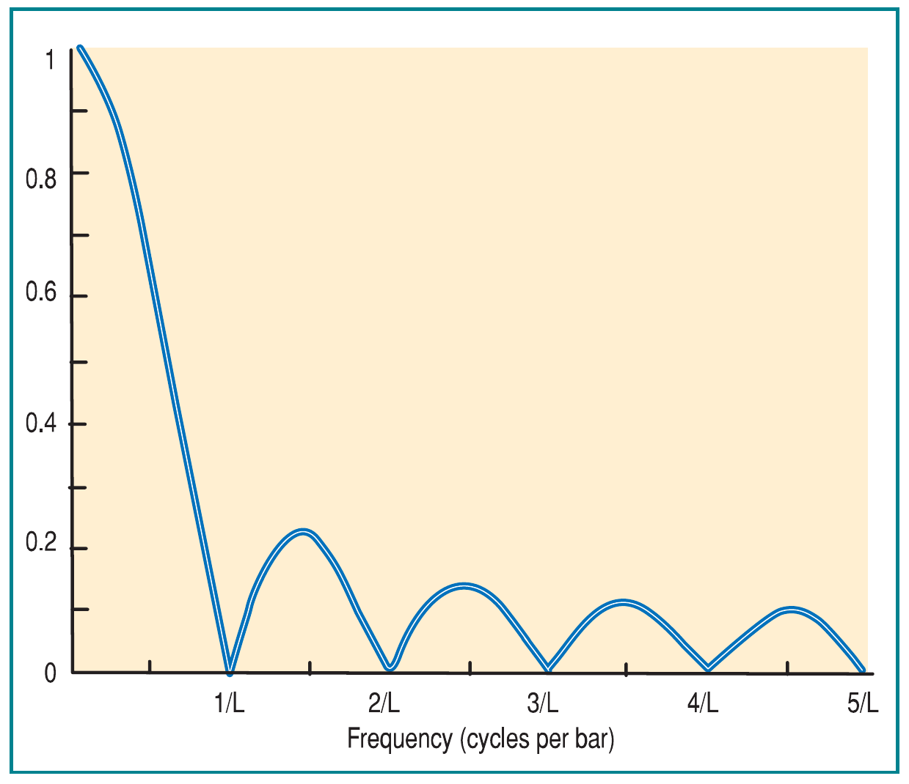
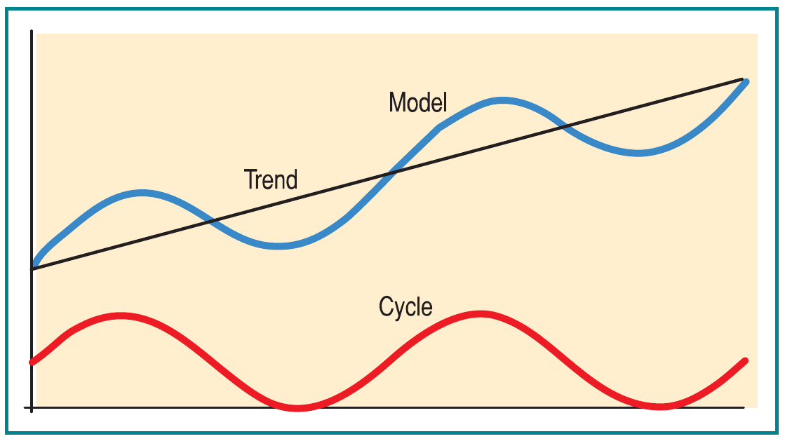
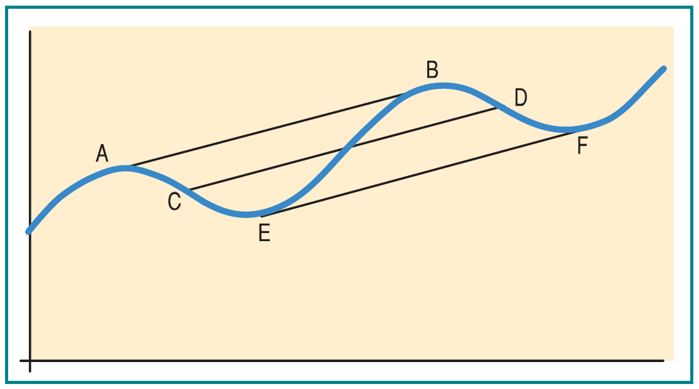
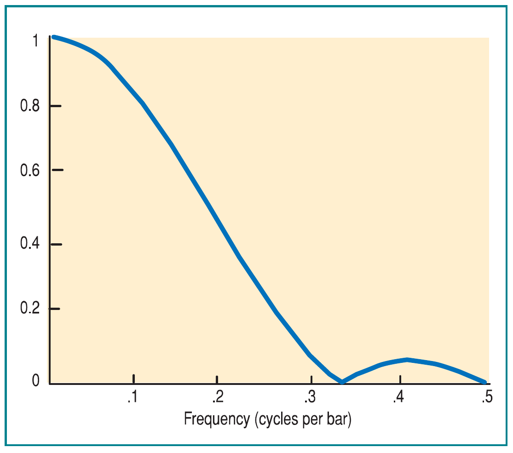
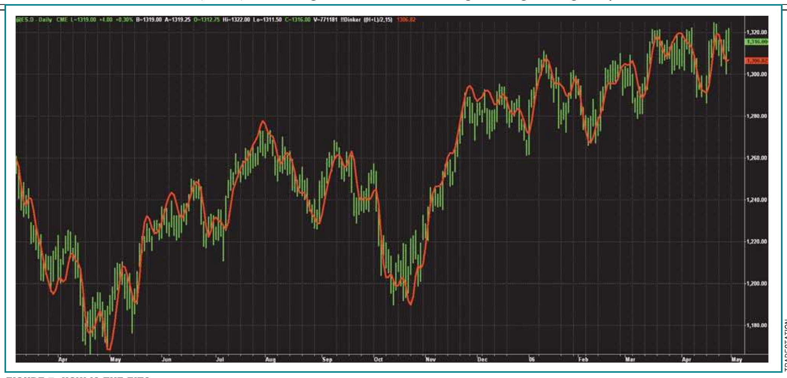
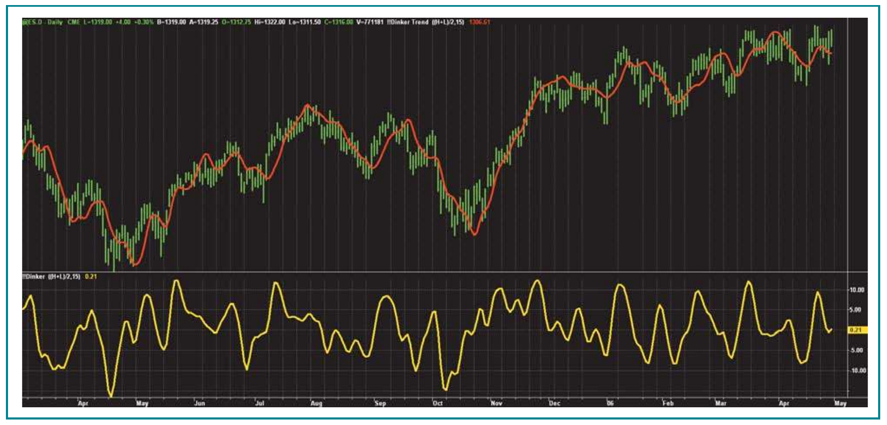
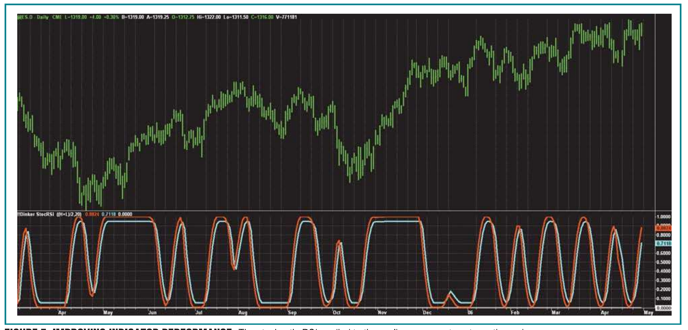

# Modeling The Market = Building Trading Strategies

- **Author:** John F. Ehlers
- **Publication:** Technical Analysis of STOCKS & COMMODITIES, Volume 24, Number 8, August 2006, pp. 20–26
- **Article URL:** [TASC V24:C08](https://technical.traders.com/archive/article.asp?file=\V24\C08\143EHLE.pdf)
- **Traders' Tips URL:** [Traders' Tips, August 2006](https://www.traders.com/Documentation/FEEDbk_docs/2006/08/TradersTips/TradersTips.html)

---

*The correct model can form the foundation for comprehensive trading strategies.*

## Introduction

Modeling the market is important because you can build comprehensive trading strategies if your model is correct. One example of a successful model is the famous Black-Scholes model for options; a variety of options strategies have been spawned from it. Another historical model is the Hodrick-Prescott filter, which attempts to isolate the trend and cyclic components of macroeconomic data. It finds the trend by penalizing variance of the cyclic component. Once the trend is found, the implied cycle component is established as the difference between the original price and the trend. The Hodrick-Prescott is not applicable for trading, usually being applied to monthly, quarterly, and annual data samples. Philosophically, the Hodrick-Prescott has the construction of the model exactly backward. Rather than first finding the trend, I know we can measure the cyclic component of the market, and by using that, we can derive an "instantaneous" trendline.

## Trends and Cycles

First, we start by assuming that our market model is made up of a trend component and a cyclic component and that we can add those two components together to synthesize a reasonable representation of the market. There are no overt constraints on these two components; the trend component does not have to be a straight line and can curve across the duration of the price chart. This is the instantaneous trendline. Similarly, the cyclic component is not constrained to have the same period. Its period or cycle length can vary across the chart also.

The cyclic period can be determined by rudimentary means such as counting the bars between successive major tops or bottoms or by sophisticated programs such as my MESA approach. Given that we know the dominant cycle, we can eliminate it by using a simple moving average (SMA) over the period of the dominant cycle. This differs from conventional moving averages by giving the freedom to change the averaging period from bar to bar.

The SMA completely removes the dominant cycle component because, for this period, there are as many sample points above the average as below it. Figure 1 shows how a simple moving average completely removes the cyclic component having a period equal to the length of the moving average and its entire harmonics. Further, frequencies higher than the dominant cycle are attenuated. As a result, we can generalize and say that the SMA tuned to the dominant cycle reduces the amplitude of all frequencies higher than that of the dominant cycle and passes all lower-frequency components. In other words, it is a tunable low-pass filter.


**FIGURE 1: REMOVING THE CYCLIC COMPONENT.** A simple moving average exactly removes the dominant cycle component and its harmonics and passes lower-frequency components.

So we have isolated the trend component of the market by using the SMA and removing the cyclic component. Unfortunately, this is not a good model of the trend component because the SMA has a lag of half the filter length (that is, to the center of the filter). Therefore, we need to compensate for this lag. Since the lag is a horizontal relocation from the true market, we can compensate in the case of a persistent trend by adding a vertical component equal to half the slope taken across the period of the SMA.

Figure 2 shows the oversimplified synthesis of the market (blue line) as the summation of the trend component (black line) and the cycle component (red line).


**FIGURE 2: TREND AND CYCLE COMPONENT.** The market model is the composite of the trend and cyclic components.

What is interesting about this model is that if we know the cycle period accurately, we can compute the slope of the trend. We can do this by taking the difference between the current price and the price exactly one period ago. This difference is exactly the slope of the trend. It doesn't matter if our current price is at the top of the cycle, at the bottom of the cycle, or in between; the slope determined this way is always the same and it is always the slope of the trend. The consistency of the slope over the dominant cycle is demonstrated in Figure 3. It doesn't matter if the slope is taken from A to B, C to D, or E to F — the slope remains the same.


**FIGURE 3: SLOPE IN DOMINANT CYCLE.** The trend slope is constant when taken across the dominant cycle.

The model of the trend component of the market is the instantaneous trendline. It is calculated as the sum of the SMA taken over the period of the dominant cycle and half the slope taken across this same period. As a generalization, it passes all frequencies lower than the dominant cycle frequency (longer periods).

The cyclic component comprises the output of a high-pass filter that passes all frequency components having frequencies higher than that of the dominant cycle. It is my experience that it is beneficial to smooth the cyclic component by removing the two-bar and three-bar components in a short finite impulse response (FIR) filter. The filter equation can be written as

    Smooth = (Price + 2*Price[1] + 2*Price[2] + Price[3]) / 6

and its frequency response is shown in Figure 4. The lag penalty for using this smoothing is only 1.5 bars, so the smoothing is still beneficial.


**FIGURE 4: FREQUENCY RESPONSE OF FIR FILTER.** An FIR filter smoothes by removing the two- and three-bar cyclic components.

## Programming the Model

Having developed the logic for our modeling of the market, now let's write some computer code to test it out. Sidebar 1 shows the EasyLanguage code to plot the instantaneous trendline as an indicator. Rather than make the dominant cycle variable by measurement, this code provides the length as an input that can be changed. If you use a variable-dominant cycle rather than a fixed-input length, you should be careful to use the accumulation algorithm for the SMA rather than the faster algorithms in most platforms that add the newest datapoint and discard the oldest datapoint. This faster algorithm fails when the period of the SMA is variable. In the code, I have smoothed the slope to improve the appearance of the instantaneous trendline.

The EasyLanguage code to plot the cyclic component can be seen in sidebar 2. It is simply a restatement of the high-pass filter described as "Swiss Army Knife indicator" with the addition of the FIR filter smoothing.

My final step in modeling the market is to combine the two components to complete the model. The EasyLanguage code for the complete model code is given in sidebar 3.

### Sidebar 1: EasyLanguage Code to Plot the Instantaneous Trendline

```easylanguage
Inputs:
    Price((H+L)/2),
    Length(20);

Vars:
    count(0),
    SMA(0),
    Slope(0),
    SmoothSlope(0),
    ITrend(0);

SMA = 0;
For count = 0 to Length - 1 Begin
    SMA = SMA + Price[count];
End;
SMA = SMA / Length;
Slope = Price - Price[Length - 1];
SmoothSlope = (Slope + 2*Slope[1] + 2*Slope[2] + Slope[3]) / 6;
ITrend = SMA + .5*SmoothSlope;

Plot1(ITrend, "ITrend");
```

### Sidebar 2: EasyLanguage Code to Plot the Cyclic Component

```easylanguage
Inputs:
    Price((H+L)/2),
    Length(20);

Vars:
    alpha(0),
    HP(0),
    SmoothHP(0);

alpha = (1 - Sine(360 / Length)) / Cosine(360 / Length);
HP = .5*(1 + alpha)*(Price - Price[1]) + alpha*HP[1];
SmoothHP = (HP + 2*HP[1] + 2*HP[2] + HP[3]) / 6;

IF CurrentBar < 4 Then SmoothHP = Price - Price[1];
IF CurrentBar = 1 THEN SmoothHP = 0;

Plot2(SmoothHP, "Cyclic Component");
```

### Sidebar 3: EasyLanguage Code for Modeling the Market

```easylanguage
Inputs:
    Price((H+L)/2),
    Length(20);

Vars:
    count(0),
    SMA(0),
    Slope(0),
    SmoothSlope(0),
    ITrend(0),
    alpha(0),
    HP(0),
    SmoothHP(0),
    Model(0);

SMA = 0;
For count = 0 to Length - 1 Begin
    SMA = SMA + Price[count];
End;
SMA = SMA / Length;
Slope = Price - Price[Length - 1];
SmoothSlope = (Slope + 2*Slope[1] + 2*Slope[2] + Slope[3]) / 6;
ITrend = SMA + .5*SmoothSlope;

alpha = (1 - Sine(360 / Length)) / Cosine(360 / Length);
HP = .5*(1 + alpha)*(Price - Price[1]) + alpha*HP[1];
SmoothHP = (HP + 2*HP[1] + 2*HP[2] + HP[3]) / 6;

IF CurrentBar < 4 Then SmoothHP = Price - Price[1];
IF CurrentBar = 1 THEN SmoothHP = 0;

Model = ITrend + SmoothHP;

Plot3(Model, "Model");
```

## Applying It

If we apply the code to price data without modification, we assume that a one-month trading period (20 bars) represents the dominant cycle. The code works better if we compute a variable-cycle period using a Hilbert transform discriminator or my MESA8 cycles-measuring program, but as I am a pragmatist, a fixed-dominant cycle period is adequate to demonstrate the model. In fact, when I applied the code to the daily bars of the continuous contract of the emini S&P futures contract, I got a better fit when I assumed a constant 15-bar dominant cycle period.

The model, overlaid on the bar chart as a red line, can be seen in Figure 5. Given all the assumptions, the model is a reasonable replica of the market with a small amount of smoothing. While not necessarily having minimum error in the mathematical sense, it is the kind of line a trader might draw by hand.


**FIGURE 5: HOW IS THE FIT?** Here you see that the model (red line) compares favorable with the price bars.

The two components of the market model can be seen in Figure 6. The cyclic component is displayed as the yellow line in the subgraph and the instantaneous trendline is shown as the red line overlaid on the bar chart. The instantaneous trendline certainly is not your father's straight-line trend!


**FIGURE 6: THE TWO COMPONENTS.** The trend and cyclic lines demonstrate the components of the market model.

Both the instantaneous trendline and cyclic components can be used independently to develop your trading system, depending on your style of trading. If you prefer to hold positions for a longer duration, you could trade the instantaneous trendline when it crosses a replica of itself delayed by one or two bars. The cyclic component probably has too much action to be successful, even for the more active traders. However, since it has an inherent zero mean, it can be used to improve oscillator-type indicators such as a stochastic or relative strength index (RSI).

The combination of the two indicators, called a stochasticRSI, does an excellent job of removing the chop when applied to the cyclic component as seen in Figure 7. The trading rules using this indicator say to buy when the red line crosses over the cyan line and to sell short when the red line crosses under the cyan line. This indicator does a reasonable job of capturing the major moves.


**FIGURE 7: IMPROVING INDICATOR PERFORMANCE.** The stochastic RSI applied to the cyclic component captures the major moves.

Still other reasonable trading rules derived from the market model can be used to improve trading. For example, don't buy on an oscillator signal if the slope of the instantaneous trendline is down. Conversely, don't sell short on an oscillator signal if the slope of the instantaneous trendline is up.

## Improving Indicator Performance

I have demonstrated that measuring or assuming a dominant cycle period can generate a two-component model of the market. Of course, a measured period would be preferable. One component is the instantaneous trendline that is composed of the SMA across the dominant cycle period plus half the slope across this period to compensate for the averaging lag. The instantaneous trendline contains the frequencies below that of the dominant cycle. The other component is the smoothed high-pass filter that contains the frequencies higher than the dominant cycle. Both components can be used to improve the performance of existing indicators.

## Suggested Reading

- Ehlers, John F. [2006]. "Swiss Army Knife Indicator," *Technical Analysis of STOCKS & COMMODITIES*, Volume 24: January.
- ——— [2004]. *Cybernetic Analysis For Stocks And Futures*, John Wiley & Sons.
- ——— [2001]. *Rocket Science For Traders*, John Wiley & Sons.

---

## BibTeX

```bibtex
@article{ehlers_2006_modeling_market,
  author       = {Ehlers, John F.},
  title        = {Modeling The Market = Building Trading Strategies},
  journal      = {Technical Analysis of STOCKS \& COMMODITIES},
  year         = {2006},
  month        = aug,
  volume       = {24},
  number       = {8},
  pages        = {20--26},
  url          = {https://technical.traders.com/archive/article.asp?file=\V24\C08\143EHLE.pdf}
}

@misc{traders_tips_2006_08,
  author       = {{Technical Analysis of STOCKS \& COMMODITIES}},
  title        = {Traders' Tips: Modeling The Market = Building Trading Strategies by John F. Ehlers},
  year         = {2006},
  month        = aug,
  howpublished = {online},
  url          = {https://www.traders.com/Documentation/FEEDbk_docs/2006/08/TradersTips/TradersTips.html}
}
```
