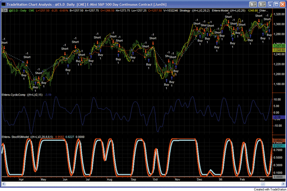
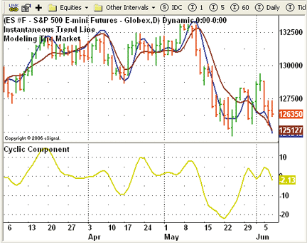
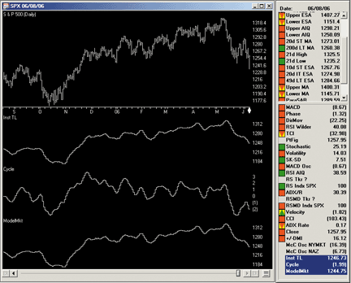
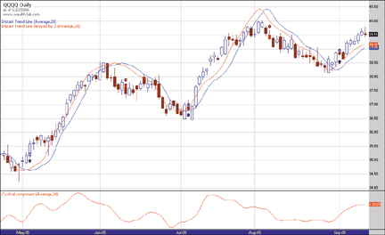
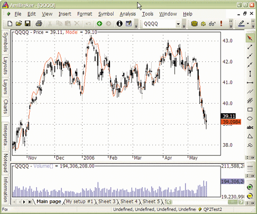
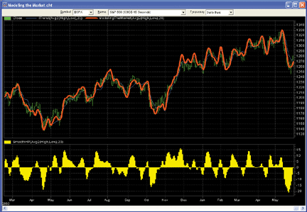
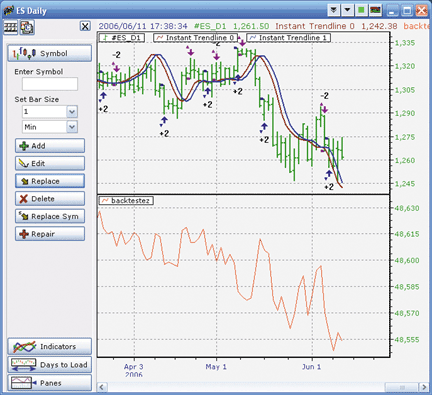
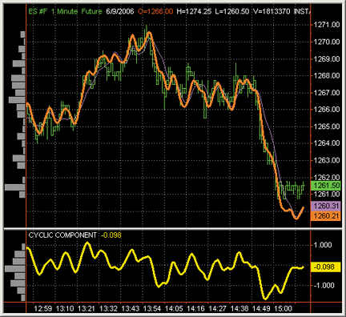
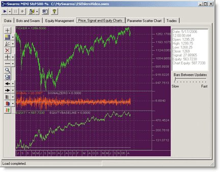
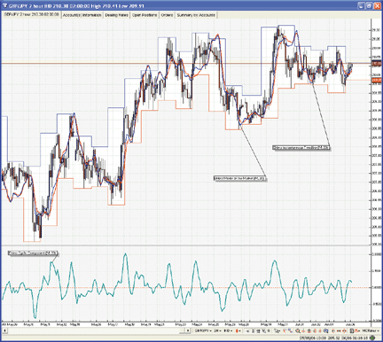

# Traders' Tips: August 2006

- **Article:** Modeling The Market = Building Trading Strategies by John F. Ehlers
- **Traders' Tips URL:** [Traders' Tips, August 2006](https://www.traders.com/Documentation/FEEDbk_docs/2006/08/TradersTips/TradersTips.html)

---


## TradeStation

John Ehlers' article in this issue, "Modeling The Market = Building
Trading Strategies," describes a process for extracting trend and cyclic
elements from market data, then recombining them for trading purposes.
The article includes code for three indicators. The author suggests that
three strategies could follow from his model.

Custom EasyLanguage code for two of the three indicators is shown
here. All three strategies and related indicators, including the StochasticRSI
transform, can be found in the EasyLanguage Library at TradeStation.com
within the file "EhlersModel.eld."

--Mark Mills TradeStation Securities, Inc. A subsidiary of TradeStation Group, Inc. www.TradeStationWorld.com



**FIGURE 1: TRADESTATION, EHLERS INDICATORS. The top subgraph
displays price data, Ehlers' model (yellow line) and the instantaneous
trend (red line). The second subgraph displays the cyclic component indicator.
The third subgraph displays the StochasticRSI transformation of Ehlers'
model. The simulated trades shown in the sample chart above were generated
in the EasyLanguage strategy by crosses of instantaneous trend and its
two-bar delay line.**


External file: [ModelingMarket-TradeStation.els](ModelingMarket-TradeStation.els)

```easylanguage
Strategy:  Ehlers-InstTrend
inputs:
 Price( MedianPrice ),
 Length( 20 ),
 Delay( 2 ) ;
variables:
 SMA( 0 ),
 Mom( 0 ),
 SmoothMom( 0 ),
 ITrend( 0 ) ;
SMA = Average( Price, Length ) ;
Mom = Momentum( Price, Length - 1 ) ;
SmoothMom = ( Mom + 2 * Mom[1] + 2 * Mom[2] +
 Mom[3] ) / 6 ;
ITrend = SMA + 0.5 * SmoothMom ;
if ITrend crosses over ITrend[Delay] then
 Buy next bar market
else if ITrend crosses under ITrend[Delay] then
 Sell short next bar at market ;
Strategy:  Ehlers-StoRSIModel
inputs:
 Price( MedianPrice ),
 Length( 20 ),
 RSILen( 8 ),
 StochLen( 8 ),
 WAveLen( 5 ) ;
variables:
 SMA( 0 ),
 Mom( 0 ),
 SmoothMom( 0 ),
 ITrend( 0 ),
 DegPerBar( 0 ),
 CosineValue( 0 ),
 Alpha( 0 ),
 OneBarDiff( 0 ),
 HP( 0 ),
 SmoothHP( 0 ),
 Synth( 0 ),
 CU( 0 ),
 CD( 0 ),
 Count( 0 ),
 CntPlus1( 0 ),
 CUAve( 0 ),
 CDAve( 0 ),
 RSI0( 0 ),
 RSILenLess1( 0 ),
 HiR( 0 ),
 LoR( 0 ),
 StochR( 0 ),
 StochRSI( 0 ),
 StochRSIDiv( 0 ),
 Trigger( 0 ) ;
SMA = Average( Price, Length ) ;
Mom = Momentum( Price, Length - 1 ) ;
SmoothMom = ( Mom + 2 * Mom[1] + 2 * Mom[2] +
 Mom[3] ) / 6 ;
ITrend = SMA + 0.5 * SmoothMom ;
DegPerBar = 360 / Length ;
CosineValue = Cosine( DegPerBar ) ;
if CosineValue <> 0 then
 Alpha = ( 1 - Sine ( DegPerBar ) ) / CosineValue ;
OneBarDiff = Price - Price[1] ;
HP = 0.5 * ( 1 + Alpha ) * OneBarDiff +
 Alpha * HP[1] ;
SmoothHP = ( HP + 2 * HP[1] + 2 * HP[2] + HP[3] ) / 6 ;
if CurrentBar = 1 then
 SmoothHP = 0
else if CurrentBar < 4 then
 SmoothHP = OneBarDiff ;
Synth = ITrend + SmoothHP ;
CU = 0 ;
CD = 0 ;
for Count = 0 to RSILen - 1
 begin
 CntPlus1 = Count + 1 ;
 if Synth[Count] > Synth[CntPlus1] then
  CU = CU + Synth[Count] - Synth[CntPlus1]
 else if Synth[Count] < Synth[CntPlus1] then
  CD = CD + Synth[CntPlus1] - Synth[Count] ;
 end ;
CU = CU / RSILen ;
CD = CD / RSILen ;
CUAve = CU ;
CDAve = CD ;
if CUAve <> -CDAve then
 RSI0 = CUAve / ( CUAve + CDAve ) ;
if CurrentBar > 1 then
 begin
 RSILenLess1 = RSILen - 1 ;
 CUAve = ( CUAve[1] * RSILenLess1 + CU ) / RSILen ;
 CDAve = ( CDAve[1] * RSILenLess1 + CD ) / RSILen ;
 end ;
if CUAve <> -CDAve then
 RSI0 = CUAve / ( CUAve + CDAve ) ;
HiR = Highest( RSI0, StochLen ) ;
LoR = Lowest( RSI0, StochLen ) ;
if HiR <> LoR then
 StochR = ( RSI0 - LoR ) / ( HiR - LoR ) ;
StochRSI = 0 ;
StochRSIDiv = 0 ;
for Count = 0 to WAveLen - 1
 begin
 StochRSI = StochRSI + ( WAveLen - Count ) *
  StochR[Count] ;
 StochRSIDiv = StochRSIDiv + Count + 1 ;
 end ;
if StochRSIDiv <> 0 then
 StochRSI = StochRSI / StochRSIDiv ;
Trigger = 0.05 + 0.9 * StochRSI[1] ;
if StochRSI crosses over Trigger then
 Buy next bar market
else if StochRSI crosses under Trigger then
 Sell short next bar at market ;
```


## MetaStock

John Ehlers' article in this issue, "Modeling The Market = Building
Trading Strategies," presents three new indicators. These indicators and
their formulas for MetaStock are shown here.

To enter these indicators into MetaStock, perform the following:

1. In the Tools menu, select Indicator Builder. 2. Click "New" to open the Indicator Editor for a new indicator. 3. Type the name of the formula. 4. Click in the larger window and type in the formula. 5. Click OK to close the Indicator Editor.


External file: [ModelingMarket-MetaStock-1.mst](ModelingMarket-MetaStock-1.mst)

```text
Name: Instantaneous Trendline
Formula:
pr:=MP();
len:=20;
sma:=Mov(pr,len,S);
sl:=pr-Ref(pr,-(len-1));
ssl:= (sl+(2*Ref(sl,-1))+(2*Ref(sl,-2))+Ref(sl,-3))/6;
sma+(0.5*ssl)
Name: cyclic component
Formula:
pr:=MP();
len:=20;
a:=(1-Sin(360/len))/Cos(360/len);
hp:=(0.5*(1+a)*(pr-Ref(pr,-1)))+(a*PREV);
shp:=
(hp+(2*Ref(hp,-1))+(2*Ref(hp,-2))+Ref(hp,-3))/6;
shp
Name: Modeling the Market
Formula:
pr:=MP();
len:=20;
sma:=Mov(pr,len,S);
sl:=pr-Ref(pr,-(len-1));
ssl:= (sl+(2*Ref(sl,-1))+(2*Ref(sl,-2))+Ref(sl,-3))/6;
a:=(1-Sin(360/len))/Cos(360/len);
hp:=(0.5*(1+a)*(pr-Ref(pr,-1)))+(a*PREV);
shp:=
(hp+(2*Ref(hp,-1))+(2*Ref(hp,-2))+Ref(hp,-3))/6;
sma+(0.5*ssl)+shp
```


## eSignal

eSIGNAL: MODELING THE MARKET

For this month's article by John Ehlers, "Modeling The Market = Building
Trading Strategies," we've provided three eSignal formula scripts: InstantaneousTrendLine.efs,
CyclicComponent.efs, and Model.efs.

The instantaneous trendline (Itl) and cyclic component (CC) studies
each have one formula parameter for the period length that may be configured
through the Edit Studies option in the Advanced Chart. The model study
has two length parameters, one for each the Itl and CC. The lengths for
these two components of the model study can be set at different values.
See Figure 2 for an example of the model indicator.



**FIGURE 2: eSIGNAL, MODELING INDICATOR. Here is a demonstration
of John Ehlers' model indicator in eSignal.**


External file: [ModelingMarket-eSignal.efs](ModelingMarket-eSignal.efs)

```javascript
/***************************************
Provided By : eSignal (c) Copyright 2006
Description:  Modeling The Market = Building Trading Strategies
              by John F. Ehlers
Version 1.0  06/05/2006
Notes:
* Aug 2006 Issue of Stocks and Commodities Magazine
* Study requires version 8.0.0 or higher.
Formula Parameters:                 Defaults:
Length                              20
***************************************/
function preMain() {
    setStudyTitle("Cyclic Component ");
    setCursorLabelName("CC", 0);
    setShowTitleParameters(false);
    setDefaultBarFgColor(Color.khaki, 0);
    setDefaultBarThickness(2, 0);
 
    var fp1 = new FunctionParameter("nLength", FunctionParameter.NUMBER);
        fp1.setName("Length");
        fp1.setLowerLimit(0);
        fp1.setDefault(20);
}
var bVersion = null;
var bInit = false;
var nAlpha   = null;
var xHL2     = null;
var xHP      = null;
var nHP_1    = null;
var nHP_0    = null;
function main(nLength) {
    if (bVersion == null) bVersion = verify();
    if (bVersion == false) return;
    if (bInit == false) {
        nAlpha = (1 - Math.sin((2*Math.PI)/nLength)) / Math.cos((2*Math.PI)/nLength);
        xHL2 = hl2();
        xHP = efsInternal("calcHP", xHL2, nAlpha);
        bInit = true;
    }
 
    var nSmoothHP = null;
    if (xHP.getValue(-3) == null || xHL2.getValue(-1) == null) return;
 
    nSmoothHP = (xHP.getValue(0) + (2*xHP.getValue(-1)) + (2*xHP.getValue(-2)) + xHP.getValue(-3)) /6;
      return nSmoothHP;
}
function calcHP(x, a) {
    if (nHP_1 == null) {
        nHP_1 = 0;
        return;
    } else if (getBarState() == BARSTATE_NEWBAR) {
        nHP_1 = nHP_0;
    }
 
    nHP_0 = (.5 * (1 + a) * (x.getValue(0) - x.getValue(-1)) + (a * nHP_1) );
    return nHP_0;
}
function verify() {
    var b = false;
    if (getBuildNumber() < 750) {
        drawTextAbsolute(5, 35, "This study requires version 8.0.0 or later.",
            Color.white, Color.blue, Text.RELATIVETOBOTTOM|Text.RELATIVETOLEFT|Text.BOLD|Text.LEFT,
            null, 13, "error");
        drawTextAbsolute(5, 20, "Click HERE to upgrade.@URL=https://www.esignal.com/download/default.asp",
            Color.white, Color.blue, Text.RELATIVETOBOTTOM|Text.RELATIVETOLEFT|Text.BOLD|Text.LEFT,
            null, 13, "upgrade");
        return b;
    } else {
        b = true;
    }
 
    return b;
}
/***************************************
Provided By : eSignal (c) Copyright 2006
Description:  Modeling The Market = Building Trading Strategies
              by John F. Ehlers
Version 1.0  06/05/2006
Notes:
* Aug 2006 Issue of Stocks and Commodities Magazine
* Study requires version 8.0.0 or higher.
Formula Parameters:                 Defaults:
Length                              20
***************************************/
function preMain() {
    setPriceStudy(true);
    setStudyTitle("Instantaneous Trend Line ");
    setCursorLabelName("ITL", 0);
    setShowTitleParameters(false);
    setDefaultBarFgColor(Color.maroon, 0);
    setDefaultBarThickness(2, 0);
 
    var fp1 = new FunctionParameter("nLength", FunctionParameter.NUMBER);
        fp1.setName("Length");
        fp1.setLowerLimit(0);
        fp1.setDefault(20);
}
var bVersion = null;
var bInit = false;
var xHL2   = null;
var xSMA   = null;
var xSlope = null;
function main(nLength) {
    if (bVersion == null) bVersion = verify();
    if (bVersion == false) return;
    if (bInit == false) {
        xHL2 = hl2();
        xSMA = sma(nLength, hl2());
        xSlope = efsInternal("calcSlope", xHL2, nLength);
        bInit = true;
    }
    var nSmoothSlope = null;
    var ITrend = null;
    if (xSlope.getValue(-3) == null) return;
 
    nSmoothSlope = (xSlope.getValue(0) + (2* xSlope.getValue(-1)) +
                    (2* xSlope.getValue(-2)) + xSlope.getValue(-3)) / 6;
    ITrend = xSMA.getValue(0) + (.5 * nSmoothSlope);
    return ITrend;
}
function calcSlope(x, n) {
    if (x.getValue(-(n-1)) == null) return;
    return (x.getValue(0) - x.getValue(-(n-1)) );
}
function verify() {
    var b = false;
    if (getBuildNumber() < 750) {
        drawTextAbsolute(5, 35, "This study requires version 8.0.0 or later.",
            Color.white, Color.blue, Text.RELATIVETOBOTTOM|Text.RELATIVETOLEFT|Text.BOLD|Text.LEFT,
            null, 13, "error");
        drawTextAbsolute(5, 20, "Click HERE to upgrade.@URL=https://www.esignal.com/download/default.asp",
            Color.white, Color.blue, Text.RELATIVETOBOTTOM|Text.RELATIVETOLEFT|Text.BOLD|Text.LEFT,
            null, 13, "upgrade");
        return b;
    } else {
        b = true;
    }
 
    return b;
}
/***************************************
Provided By : eSignal (c) Copyright 2006
Description:  Modeling The Market = Building Trading Strategies
              by John F. Ehlers
Version 1.0  06/05/2006
Notes:
* Aug 2006 Issue of Stocks and Commodities Magazine
* Study requires version 8.0.0 or higher.
Formula Parameters:                 Defaults:
ITL Length                          20
CC Length                           20
***************************************/
function preMain() {
    setPriceStudy(true);
    setStudyTitle("Modeling The Market ");
    setCursorLabelName("Model", 0);
    setShowTitleParameters(false);
    setDefaultBarFgColor(Color.blue, 0);
    setDefaultBarThickness(2, 0);
 
    var fp1 = new FunctionParameter("nLength_ITL", FunctionParameter.NUMBER);
        fp1.setName("ITL Length");
        fp1.setLowerLimit(0);
        fp1.setDefault(20);
    var fp2 = new FunctionParameter("nLength_CC", FunctionParameter.NUMBER);
        fp2.setName("CyclicC Length");
        fp2.setLowerLimit(0);
        fp2.setDefault(20);
}
var bVersion = null;
var bInit = false;
var nAlpha   = null;
var xHL2     = null;
var xHP      = null;
var nHP_1    = null;
var nHP_0    = null;
var xSMA     = null;
var xSlope   = null;
function main(nLength_ITL, nLength_CC) {
    if (bVersion == null) bVersion = verify();
    if (bVersion == false) return;
    if (bInit == false) {
        //nAlpha = (1 - Math.sin(360/nLength)) / Math.cos(360/nLength);
        /***************************************************************
            Math.sin and Math.cos in JavaScript are represented in Radians,
            TradeStations returns degrees.  To convert Math.sin(360/n) to
            Radians, replace 360 with (2*Math.PI).
            Or to convert Degrees to Radians => (Number * Math.PI) / 180
        ***************************************************************/
        nAlpha = (1 - Math.sin((2*Math.PI)/nLength_CC)) / Math.cos((2*Math.PI)/nLength_CC);
        xHL2 = hl2();
        xSMA = sma(nLength_ITL, hl2());
        xSlope = efsInternal("calcSlope", xHL2, nLength_ITL);
        xHP = efsInternal("calcHP", xHL2, nAlpha);
        bInit = true;
    }
 
    var nSmoothHP = null;
    var nSmoothSlope = null;
    var ITrend = null;
    var Model = null;
    if (xHP.getValue(-3) == null || xHL2.getValue(-1) == null) return;
 
    nSmoothHP = (xHP.getValue(0) + (2*xHP.getValue(-1)) + (2*xHP.getValue(-2)) + xHP.getValue(-3)) /6;
    if (xSlope.getValue(-3) == null) return;
 
    nSmoothSlope = (xSlope.getValue(0) + (2* xSlope.getValue(-1)) +
                    (2* xSlope.getValue(-2)) + xSlope.getValue(-3)) / 6;
    ITrend = xSMA.getValue(0) + (.5 * nSmoothSlope);
      Model = ITrend + nSmoothHP;
 
    return Model;
}
function calcHP(x, a) {
    if (nHP_1 == null) {
        nHP_1 = 0;
        return;
    } else if (getBarState() == BARSTATE_NEWBAR) {
        nHP_1 = nHP_0;
    }
    nHP_0 = (.5 * (1 + a) * (x.getValue(0) - x.getValue(-1)) + (a * nHP_1) );
    return nHP_0;
}
function calcSlope(x, n) {
    if (x.getValue(-(n-1)) == null) return;
    return (x.getValue(0) - x.getValue(-(n-1)) );
}
function verify() {
    var b = false;
    if (getBuildNumber() < 750) {
        drawTextAbsolute(5, 35, "This study requires version 8.0.0 or later.",
            Color.white, Color.blue, Text.RELATIVETOBOTTOM|Text.RELATIVETOLEFT|Text.BOLD|Text.LEFT,
            null, 13, "error");
        drawTextAbsolute(5, 20, "Click HERE to upgrade.@URL=https://www.esignal.com/download/default.asp",
            Color.white, Color.blue, Text.RELATIVETOBOTTOM|Text.RELATIVETOLEFT|Text.BOLD|Text.LEFT,
            null, 13, "upgrade");
        return b;
    } else {
        b = true;
    }
    return b;
}
```


## AIQ

The AIQ code for John Ehlers' set of indicators described in "Modeling
The Market = Building Trading Strategies" is shown here. The AIQ chart
in Figure 3 shows the three indicators plotted beneath a chart of the Standard
& Poor's 500.

This code can be downloaded from the AIQ website at www.aiqsystems.com.



**FIGURE 3: AIQ SYSTEMS, EHLERS INDICATORS. Here are the instantaneous
trendline, cyclic component, and market model indicators.**


External file: [ModelingMarket-AIQ.eds](ModelingMarket-AIQ.eds)

```text
!!! MODELING THE MARKET, TASC August 2006
!!  Author: John F. Ehlers
!!  Coded by: Richard Denning 6/08/06
!! INSTANANEOUS TRENDLINE
C is [close].
H is [high].
L is [low].
Price is (H+L)/2.
LL is 20.
SMA is simpleavg(Price,LL).
Slope is Price - valresult(Price,LL - 1).
sSlope is (Slope + 2 * valresult(Slope,1)
       + 2 * valresult(Slope,3) + valresult(Slope,3)) / 6.
ITrend is SMA + 0.5 * sSlope.
!! CYCLIC COMPONENT
SS is 2 * LL +1.
Alpha is (1 - sin(360 / LL)) / cos(360 / LL).
HP is expavg((1 + alpha) * (Price - valresult(Price,1)),SS).
sHP is (HP + 2 * valresult(HP,1)
      + 2 * valresult(HP,2) + valresult(HP,3)) / 6.
!! MODELING THE MARKET
Model is ITrend + sHP.
```


## Wealth-Lab

We created a ChartScript based on the instantaneous trendline indicator
described in John Ehlers' article, "Modeling The Market = Building Trading
Strategies." The instantaneous trendline indicator and the cyclic component
indicator are now part of the Wealth-Lab Code Library.

We chose to develop a trend-following system and used one of the methods
suggested by Ehlers. The system compares the instantaneous trendline with
its two-day delayed version and takes action as soon as one line crosses
over the other. The cyclical component is plotted for information purposes
but not used in the trading rules (Figure 4).

-- Jos� Cruset www.wealth-lab.com



**FIGURE 4: WEALTH-LAB, EHLERS INDICATORS. In this sample
price chart, the upper pane contains the instantaneous trendline (blue)
together with a copy shifted by two days (red). The lower pane contains
the cyclical component. All indicators use 20 days as a lookback period
and the average price (H+L)/2 as a parameter. The system enters the market
as soon as the red indicator crosses over the blue one. The chart shows
various profitable trades from May through September 2005 in the QQQQ when
a variety of up- and downtrends occurred.**


External file: [ModelingMarket-Wealth-Lab.wls](ModelingMarket-Wealth-Lab.wls)

```pascal
WealthScript code:
{$I 'CyclicComponent'}
var Bar: integer;
var CCPane: integer = CreatePane(100, false, false);
var CC: integer = CyclicComponentSeries(#Average, 20);
var ITL: integer = InstantaneousTrendLineSeries(#Average, 20);
var ITL1: integer = OffsetSeries(ITL, 2);
PlotSeriesLabel(ITL, 0, #Blue, #Thin, 'Instant Trend Line (Average,20)');
PlotSeriesLabel(ITL1, 0, #Red, #Thin, 'Instant Trend Line delayed by 2 (Average,20)');
PlotSeriesLabel(CC, CCPane, #Red, #Thin, 'Cyclical component (Average,20)');
HideVolume;
for Bar := 20 to BarCount - 1 do
begin
  if not LastPositionActive then
  begin
  If CrossOver(Bar, ITL1, ITL) then BuyAtMarket(Bar + 1, 'Uptrend signal');
  end
  else
  begin
  If CrossUnder(Bar, ITL1, ITL) then SellAtMarket(Bar + 1, LastPosition, 'Downtrend signal');
  end;
end;
```


## AmiBroker

In "Modeling The Market = Building Trading Strategies," John Ehlers
presents an enhancement of his previous developments -- a market model composed
of trend and cycle components (Figure 5). The coding for such a model in
AmiBroker Formula Language (Afl) is straightforward. The ready-to-use formula
for AmiBroker is presented in Listing 1. To apply the formula, please open
Formula Editor, paste in the code, and press the "Apply Indicator" button.



**FIGURE 5: AMIBROKER, EHLERS INDICATORS. Here are the instantaneous
trendline, cyclic component, and market model indicators.**


External file: [ModelingMarket-AmiBroker.afl](ModelingMarket-AmiBroker.afl)

```afl
LISTING 1
// Instantaneous Trendline
Price = (H+L)/2;
Length = Param("Length", 20, 2, 100, 1 );
SMA = MA( Price, Length );
Slope = Price - Ref( Price, - ( Length - 1 ) );
SmoothSlope = ( Slope + 2 * Ref( Slope, -1 )
 + 2 * Ref( Slope, -2 ) + Ref( Slope, -3 ) )/6;
ITrend = SMA + 0.5 * SmoothSlope;
// Cyclic Component
alpha = 0;
HP = 0;
SmoothHP = 0;
PI = 3.1415926;
alpha = ( 1 - sin( 2 * PI / Length ) )/cos( 2 * PI / Length );
HP = AMA2( Price - Ref( Price, -1 ), 0.5 * ( 1 + alpha ), alpha );
SmoothHP = ( HP + 2 * Ref( HP, -1 )
 + 2 * Ref( HP, -2 ) + Ref( HP, -3 ) ) / 6;
Plot( Price, "Price", colorBlack, styleCandle );
// components of model
// Plot( ITrend, "ITrend", colorRed );
// Plot( SmoothHP, "SmoothHP", colorRed );
Model = ITrend + SmoothHP;
Plot( Model, "Model", colorRed );
```


## NeuroShell Trader

The indicators described in John Ehlers' article "Modeling The Market
= Building Trading Strategies" can be easily implemented in NeuroShell
Trader using NeuroShell Trader's ability to call external dynamic linked
libraries (DLLs). Dynamic linked libraries can be written in C, C++, Power
Basic, Delphi, and IBasic. See Figure 6 for an example.

After moving the EasyLanguage code given in the article to your
preferred compiler and creating a DLL, you can insert the resulting instantaneous
trendline, cyclical component, and modeling the market indicators as follows:

If you decide to use the modeling the market indicators in a prediction
or a trading strategy, the parameters can be optimized by the genetic algorithm
built into NeuroShell Trader Professional.

It should be noted that John Ehler's Mesa8 cycle measuring indicators
and cybernetic analysis indicators are also available as add-ons to NeuroShell
Trader. For more information on these add-ons or NeuroShell Trader, visit
www.NeuroShell.com.

Users of NeuroShell Trader can go to the STOCKS & COMMODITIES section
of the NeuroShell Trader free technical support website to download a copy
of this or previous Traders' Tips.



**FIGURE 6: NeuroShell, EHLERS INDICATORS. This sample NeuroShell
Trader chart displays John Ehlers' three indicators discussed in this issue:
modeling the market indicator, the instantaneous trendline, and the cyclical
component indicators.**


External file: [ModelingMarket-NeuroShellTrader.nst](ModelingMarket-NeuroShellTrader.nst)

```text
1. Select "New Indicator ..." from the Insert menu.
2. Select the Custom Indicator category.
3. Select the desired indicator.
4. Select the parameters as you desire.
5. Select the "Finished" button.
```


## NeoTicker

In "Modeling The Market = Building Trading Strategies," John Ehlers
presents three indicators: the instantaneous trendline (Listing 1), the
cyclic component (Listing 2), and modeling the market (Listing 3). All
three indicators can be implemented in NeoTicker using formula language.
All three have two parameters: price and length. Price is a formula parameter
defaulted to (high+low)/2, and length is an integer parameter with a default
of 20.

Trading signals that are based on the instantaneous trendline are generated
by a crossover of a one-period delay and the actual. To test this trading
idea, a simple stop-and-reverse system can be built using Backtest EZ (Figure
7). The long and short signals (Listing 4) are written in NeoTicker formula
language.

Downloadable versions of these indicators and a chart group with
backtest EZ will be available at the NeoTicker blog site (https://blog.neoticker.com).



**FIGURE 7: NEOTICKER, INSTANTANEOUS TRENDLINE. Trading signals
based on John Ehlers' instantaneous trendline indicator are generated by
a crossover of a one-period delay and the actual. To test the method, a
simple stop-and-reverse system can be built using Backtest EZ (lower pane).**


External file: [ModelingMarket-NeoTicker.neo](ModelingMarket-NeoTicker.neo)

```text
LISTING 1
$Length := param2;
MyPrice := fml(data1, param1);
$SMA := average(MyPrice, $Length);
Slope := MO(MyPrice, $Length);
$SmoothSlope := (Slope + 2*Slope(1) + 2*Slope(2) + Slope(3))/6;
plot1 := $SMA+0.5*$SmoothSlope;
LISTING 2
$Length := param2;
myPrice := fml(data1, param1);
$alpha := frac((1-sin(360/$Length))/cos(360/$Length));
HP := 0.5*(1+$alpha)*(myPrice-myPrice(1))+$alpha*HP(1);
$SmoothHP := (HP+2*HP(1)+2*HP(2)+HP(3))/6;
plot1 := choose(CurrentBar=1, 0,
                CurrentBar<4, MyPrice-MyPrice(1), $SmoothHP);
LISTING 3
$Length := param2;
myPrice := fml(data1, param1);
$mySMA := average(myPrice, $Length);
mySlope := myPrice - myPrice(1);
$SmoothSlope := (mySlope + 2*mySlope(1) + 2*mySlope(2) + mySlope(3))/6;
$ITrend := $mySMA + $SmoothSlope;
$myalpha := frac((1-sin(360/$Length))/cos(360/$Length));
HP := 0.5*(1+$myalpha)*(myPrice - myPrice(1))+$myalpha*HP(1);
$SmoothHP := choose(Currentbar(0) = 1, 0, Currentbar(1) < 4,
             myPrice-myPrice(1), (HP+2*HP(1)+2*HP(2)+HP(3))/6);
plot1 := $ITrend;
plot2 := $SmoothHP;
plot3 := $ITrend + $SmoothHP;
LISTING 4
Long Entry: xabove(tasc_instantTL(1,data1,"(h+l)/2",20), tasc_instantTL(0,data1,"(h+l)/2",20))
Short Entry: xbelow (tasc_instantTL(1,data1,"(h+l)/2",20),
tasc_instantTL(0,data1,"(h+l)/2",20))
```


## MultiCharts

MultiCharts' scripting language is compatible with EasyLanguage, and
this means that you can use the TradeStation code provided in John Ehlers'
article "Modeling The Market = Building Trading Strategies" in MultiCharts.
Figure 8 shows an example of applying all three indicators described in
the article to MultiCharts.

To discuss this article and download a complete copy of the formulas,
please visit our discussion forum at forum.tssupport.com.



**FIGURE 8: MULTICHARTS, EHLERS INDICATORS. Here is a sample
chart of the emini S&P 500 continuous contract. The instantaneous trendline
(purple), the cyclic component indicator (yellow), and complete model (orange)
as an indicator have all been applied to the chart.**


## Trading Solutions

In his article "Modeling The Market = Building Trading Strategies,"
John Ehlers presents a way to model the market based on extracting the
underlying cyclic component from the instantaneous trendline.

These functions can be entered into TradingSolutions as described here.
These functions are also available as a function file that can be downloaded
from the TradingSolutions website (www.tradingsolutions.com) in the Solution
Library section.

These individual formulas can be used to create fields that can
be displayed in a chart with closing price. They can also be used as optimizable
inputs to a neural network or as optimizable elements of entry/exit system
rules.


External file: [ModelingMarket-TradingSolutions.tsf](ModelingMarket-TradingSolutions.tsf)

```text
Function Name: Ehlers Smoothing
Short Name: ESmoothing
Inputs: Data
Div (Add (Data, Add (Mult (2, Lag (Data, 1)), Add (Mult (2, Lag (Data, 2)), Lag (Data, 3)))), 6)
Function Name: Ehlers Slope
Short Name: ESlope
Inputs: Data, Period, Maximum Period
Sub (Data, LagVL (Data, Sub (Period, 1), Maximum Period))
Function Name: Ehlers Instantaneous Trendline
Short Name: EITrend
Inputs: Data, Period, Maximum Period
Add (MAVL (Data, Period, Maximum Period), Mult (0.5, ESmoothing (ESlope (Data, Period, Maximum Period))))
Function Name: Ehlers Cyclic Component HP
Short Name: ECycleHP
Inputs: Data, Period
Add (Mult (0.5, Mult (Add (1, Div (Sub (1, Sin (DtoR (Div (360, Period)))),
 Cos (DtoR (Div (360, Period))))), Change (Data,1))), Mult (Div (Sub (1,
 Sin (DtoR (Div (360, Period)))), Cos (DtoR (Div (360, Period)))), Prev (1)))
Function Name: Ehlers Cyclic Component SmoothHP
Short Name: ESmoothHP
Inputs: Data, Period
If (EQ (Bar# ( ), 1), 0, If (LT (Bar# ( ), 4), Change (Data, 1), ESmoothing (ECycleHP (Data, Period))))
Function Name: Ehlers Model
Short Name: EModel
Inputs: Data, Period, Maximum Period
Add (EITrend (Data, Period, Maximum Period), ESmoothHP (Data, Period))
```


## BioComp Profit

BIOCOMP DAKOTA: MODELING THE MARKET

In his article "Modeling The Market = Building Trading Strategies,"
author John Ehlers shows us how to create a market model using the instantaneous
trend and cycle components. In BioComp Dakota, you can easily recreate
this trading system by calling the EhlersInstTrend and EhlersHP functions.
However, we found the system to be most effective countertrading, which
means if today's value is greater than yesterday, you short the emini S&P
500 futures contract and vice versa.

Dakota's VB Script code for a "pessimist" (countertrader) version of
Ehlers' trading system is rather simple:

Dakota users can download this bot from the downloads page of the
private BioComp Dakota website at www.biocompsystems.com/products/Dakota/.



**FIGURE 9: BIOCOMP DAKOTA, EHLERS INDICATORS. Here is a sample
chart showing price, trading signals, and the equity curve for a swarm
of "Ehlers InstiTrend Pessimist" Bots on the emini S&P 500 futures
contract.**


External file: [ModelingMarket-BioCompProfit.vbs](ModelingMarket-BioCompProfit.vbs)

```vbscript
Function Script_CreateSignal(Prices())
 
  Dim Signal 'This is the value you are going to calculate
  Dim Ehlers
  PriceCtr = PriceCtr + 1
  Redim Preserve PriceHistory(PriceCtr)
  PriceHistory(PriceCtr) = Prices(2)
  Ehlers = Dakota.EhlersInstTrend(PriceHistory, ParameterValue(1)) +
           Dakota.EhlersHP(PriceHistory, ParameterValue(2))
  if PriorEhlers = 0 then
    PriorEhlers = Ehlers
  end if
  Signal = PriorEhlers - Ehlers
  PriorEhlers = Ehlers
  Script_CreateSignal = Signal
  Exit Function
End Function
```


## VT Trader

John F. Ehlers's article in this issue, "Modeling the Market = Building
Trading Strategies" discusses the benefits of isolating (and then adding
back together) the market's trend component and cyclic component to "synthesize
a reasonable representation of the market". Ehlers describes two indicators
suited for this purpose: the Instantaneous Trendline indicator (for isolating
the trend) and the Cyclic Component indicator (for isolating the cycles).
When combined, these indicators create the final "Model of the Market"
indicator. We'll be offering all three indicators for download in our user
forums. The VT Trader code and instructions for creating the indicators
are as follows (input variables are parameterized to allow customization):

To learn more about the VT Trader, please visit www.cmsfx.com.



**FIGURE 10: VT TRADER, EHLERS INDICATORS. This chart demonstrates
John Ehlers' instantaneous trendline (red line) and model of the market
(blue line) indicators overlaid on the price candles; Ehlers' cyclic component
indicator is displayed in its own frame below the price frame.**


External file: [ModelingMarket-VTTrader.vtl](ModelingMarket-VTTrader.vtl)

```text
Instantaneous Trendline Indicator:
1. Navigator Window>Tools>Indicator Builder>[New] button
2. In the Indicator Bookmark, type the following text for each field:
Name: TASC - 08/2006 - Ehlers Modeling The Market (Instantaneous Trendline)
Short Name: vt_EhlersiTrend
Label Mask: Ehlers Instantaneous Trendline (%Price%, %Periods%)
Placement: Price Frame
Inspect Alias: Ehlers Instantaneous Trendline
3. In the Input Bookmark, create the following variables:
[New] button... Name: Price , Display Name: Price , Type: price , Default: Median Price
[New] button... Name: Periods , Display Name: Periods , Type: integer , Default: 20
4. In the Output Bookmark, create the following variables:
[New] button...
Var Name: iTrend
Name: (iTrend)
Line Color: red
Line Width: slightly thicker
Line Type: solid line
5. In the Formula Bookmark, copy and paste the following formula:
{Provided By: Visual Trading Systems, LLC (c) Copyright 2006}
{Description: Modeling The Market = Building Trading Strategies by John F. Ehlers}
{Notes: August 2006 Issue - Modeling The Market = Building Trading Strategies}
{vt_EhlersiTrend Version 1.0}
SMA:= mov(Price,Periods,S);
Slope:= Price - ref(Price,-(Periods-1));
SmoothSlope:= (Slope + 2 * ref(Slope,-1) + 2 * ref(Slope,-2) + ref(Slope,-3)) / 6;
iTrend:= SMA + 0.5 * SmoothSlope;
6. Click the "Save" icon to finish building the Instantaneous Trendline indicator.
To attach the iTrend indicator to a chart click the right mouse button within the chart window
 and then select "Add Indicators" -> "TASC - 08/2006 - Ehlers Modeling The Market (Instantaneous
 Trendline)" from the indicator list.
Cyclic Component Indicator:
1. Navigator Window>Tools>Indicator Builder>[New] button
2. In the Indicator Bookmark, type the following text for each field:
Name: TASC - 08/2006 - Ehlers Modeling The Market (Cyclic Component)
Short Name: vt_EhlersCyclicComp
Label Mask: Ehlers Cyclic Component (%Price%, %Periods%)
Placement: New Frame
Inspect Alias: Ehlers Cyclic Component
3. In the Input Bookmark, create the following variables:
[New] button... Name: Price , Display Name: Price , Type: price , Default: Median Price
[New] button... Name: Periods , Display Name: Periods , Type: integer , Default: 20
4. In the Output Bookmark, create the following variables:
[New] button...
Var Name: SmoothHP
Name: (Cyclic Component)
Line Color: dark green
Line Width: slightly thicker
Line Type: solid line
5. In the Formula Bookmark, copy and paste the following formula:
{Provided By: Visual Trading Systems, LLC (c) Copyright 2006}
{Description: Modeling The Market = Building Trading Strategies by John F. Ehlers}
{Notes: August 2006 Issue - Modeling The Market = Building Trading Strategies}
{vt_EhlersCyclicComp Version 1.0}
CurrentBar:= BarCount();
alpha:= (Cos(360/Periods) + Sin(360/Periods)-1)/Cos(360/Periods);
HP:= 0.5 * (1+alpha) * (Price - ref(Price,-1)) + alpha * PREV;
SmoothHP:= if(CurrentBar=1,0,
           if(CurrentBar<4,Price-ref(Price,-1),
             (HP + 2 * ref(HP,-1) + ref(HP,-2) + ref(HP,-3)) / 6));
6. Click the "Save" icon to finish building the Cyclic Component indicator.
To attach the Cyclic Component indicator to a chart click the right mouse button within the
 chart window and then select "Add Indicators" -> "TASC - 08/2006 - Ehlers Modeling The Market
 (Cyclic Component)" from the indicator list.
Model of the Market Indicator
1. Navigator Window>Tools>Indicator Builder>[New] button
2. In the Indicator Bookmark, type the following text for each field:
Name: TASC - 08/2006 - Ehlers Modeling The Market (Model of the Market)
Short Name: vt_EhlersMarketModel
Label Mask: Ehlers Model of the Market (%Price%, %Periods%)
Placement: Price Frame
Inspect Alias: Ehlers Market Model
3. In the Input Bookmark, create the following variables:
[New] button... Name: Price , Display Name: Price , Type: price , Default: Median Price
[New] button... Name: Periods , Display Name: Periods , Type: integer , Default: 20
4. In the Output Bookmark, create the following variables:
[New] button...
Var Name: Model
Name: (Model)
Line Color: blue
Line Width: slightly thicker
Line Type: solid line
5. In the Formula Bookmark, copy and paste the following formula:
{Provided By: Visual Trading Systems, LLC (c) Copyright 2006}
{Description: Modeling The Market = Building Trading Strategies by John F. Ehlers}
{Notes: August 2006 Issue - Modeling The Market = Building Trading Strategies}
{vt_EhlersMarketModel Version 1.0}
{Ehlers Instantaneous Trendline}
SMA:= mov(Price,Periods,S);
Slope:= Price - ref(Price,-(Periods-1));
SmoothSlope:= (Slope + 2 * ref(Slope,-1) + 2 * ref(Slope,-2) + ref(Slope,-3)) / 6;
iTrend:= SMA + 0.5 * SmoothSlope;
{Ehlers Cyclic Component}
CurrentBar:= BarCount();
alpha:= (Cos(360/Periods) + Sin(360/Periods)-1)/Cos(360/Periods);
HP:= 0.5 * (1+alpha) * (Price - ref(Price,-1)) + alpha * PREV;
SmoothHP:= if(CurrentBar=1,0,if(CurrentBar<4,Price-ref(Price,-1),
           (HP + 2 * ref(HP,-1) + ref(HP,-2) + ref(HP,-3)) / 6));
{Ehlers Model of the Market}
Model:= iTrend + SmoothHP;
6. Click the "Save" icon to finish building the Model of the Market indicator.
To attach the Model of the Market indicator to a chart click the right mouse button within the
 chart window and then select "Add Indicators" -> "TASC - 08/2006 - Ehlers Modeling The Market
 (Model of the Market)" from the indicator list.
```


## Tradecision

In his article "Modeling The Market = Building Trading Strategies,"
John Ehlers illustrates the value of modeling the market while developing
comprehensive trading strategies. By using the Indicator Builder in Tradecision,
you can recreate Ehlers' cyclic component, instantaneous trendline, and
market model indicators and use them to build trading strategies that combine
the techniques with other indicator-based and money management rules.

Note: You can use the Tradecision Optimization wizard to find the best
parameters for your trading system.

Here is the code for the three indicators:

To download these indicators, visit the Traders' Tips area at https://tradecision.com/support/tasc_tips/tasc_traders_tips.htm.

Originally published in the August 2006 issue of Technical Analysis
of STOCKS & COMMODITIES magazine. All rights reserved. � Copyright 2006, Technical Analysis, Inc.


External file: [ModelingMarket-Tradecision.tdc](ModelingMarket-Tradecision.tdc)

```text
Cyclic component
Input
     Price: "Price", (H + l) / 2;
     Length: "Length", 20;
end_input
var
   Alpha := (1 ? Sin (360 / Length)) / Cos (360 / Length);
   HP := 0;
   SmoothHP := 0;
end_var
if (HistorySize > 1) then
   HP := 0.5 * (1 + alpha) * (Price - Price\1\) + Alpha * HP\1\;
else
   HP := 0;
if (HistorySize + 1) < 4 then
   SmoothHP := Price - Price\1\;
else
   SmoothHP := (HP + 2 * HP\1\ + 2 * HP\2\ + HP\3\) / 6;
 
if HistorySize = 0 then
   SmoothHP := 0;
return SmoothHP;
Instantaneous Trendline
Input
     Price: "Price", (H + l) / 2;
     Length: "Length", 20;
end_input
var
   SMA := SMA(Price, Length);
   Slope := Price - Price\Length - 1\;
   SmoothSlope := (Slope + 2 * Slope\1\ + 2 * Slope\2\ + Slope\3\) / 6;
   ITrend := SMA + 0.5 * SmoothSlope;
end_var
return ITrend;
Market Model
Input
     Price: "Price",(H +l) /2 ;
     Length: "Length", 20;
end_input
var
   Sma := SMA(Price, Length);
   Slope := Price - Price\Length - 1\;
   SmoothSlope := (Slope + 2 * Slope\1\ + 2 * Slope\2\ + Slope\3\) / 6;
   ITrend := SMA + 0.5 * SmoothSlope;
   Alpha := (1 - Sin(360 / Length)) / Cos(360 / Length);
   HP := 0;
   SmoothHP := 0;
end_var
if (HistorySize > 1) then
   HP := 0.5 * (1 + alpha) * (Price - Price\1\) + Alpha * HP\1\;
else
   HP := 0;
if (HistorySize + 1) < 4 then
   SmoothHP := Price - Price\1\;
else
   SmoothHP := (HP + 2 * HP\1\ + 2 * HP\2\ + HP\3\) / 6;
 
if HistorySize = 0 then
   SmoothHP := 0;
return ITrend + SmoothHP;
```


## BibTeX

```bibtex
@misc{traders_tips_2006_08,
  author       = {{Technical Analysis of STOCKS \& COMMODITIES}},
  title        = {Traders' Tips: Modeling The Market = Building Trading Strategies by John F. Ehlers},
  year         = {2006},
  month        = aug,
  howpublished = {online},
  url          = {https://www.traders.com/Documentation/FEEDbk_docs/2006/08/TradersTips/TradersTips.html}
}
```
