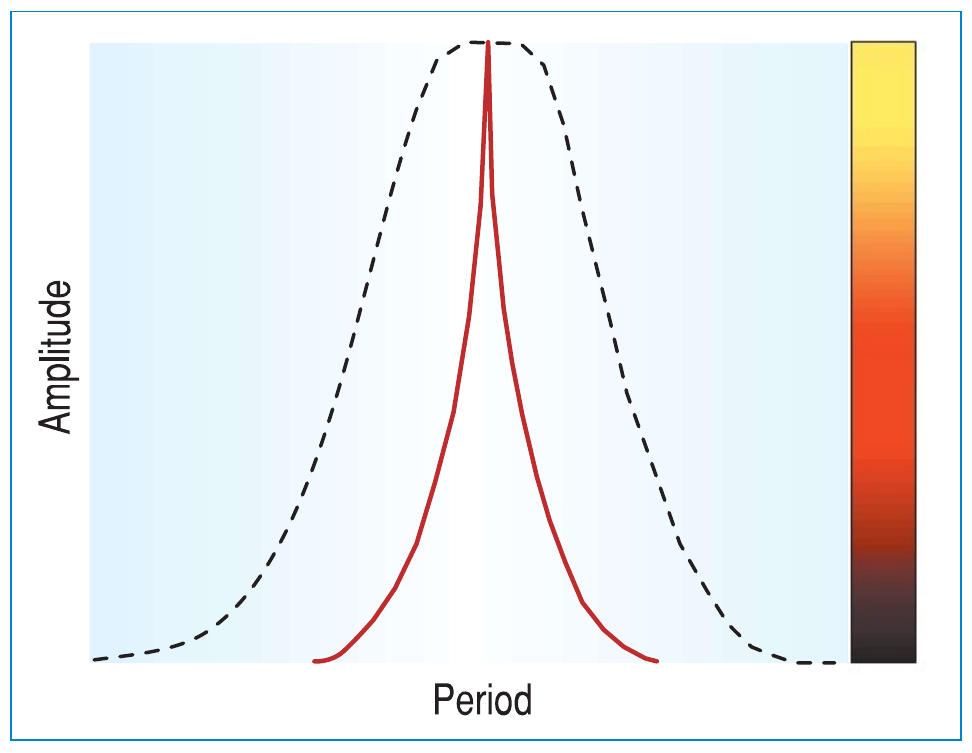
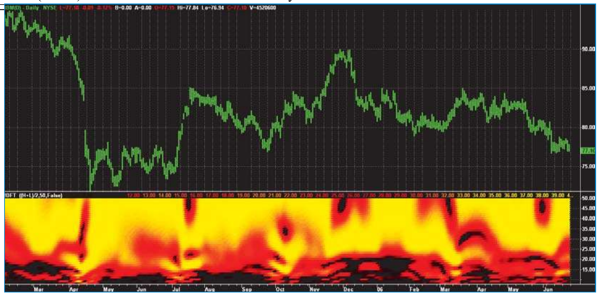
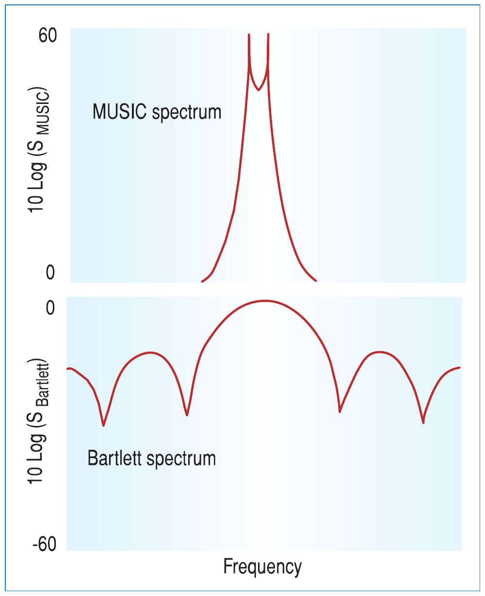
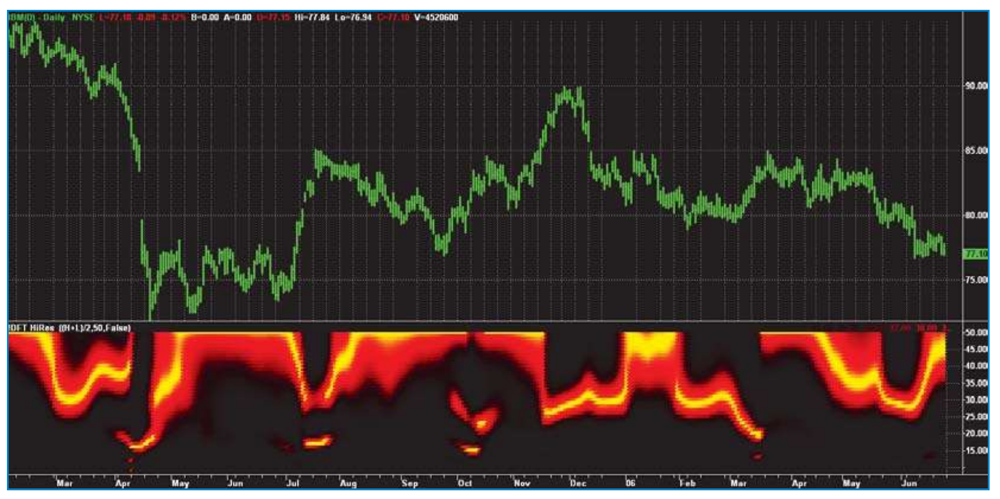
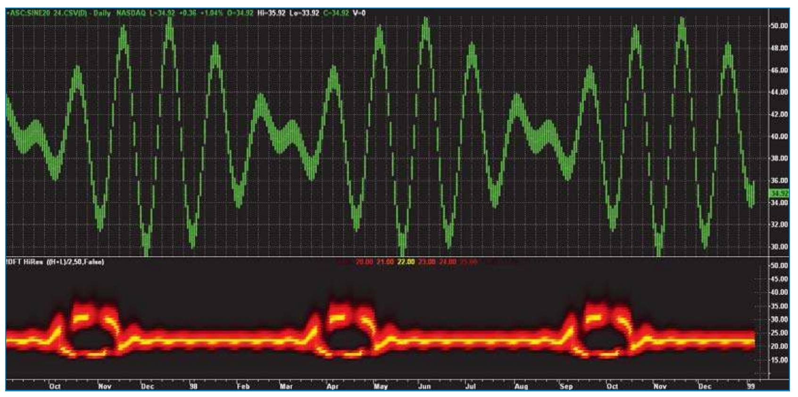
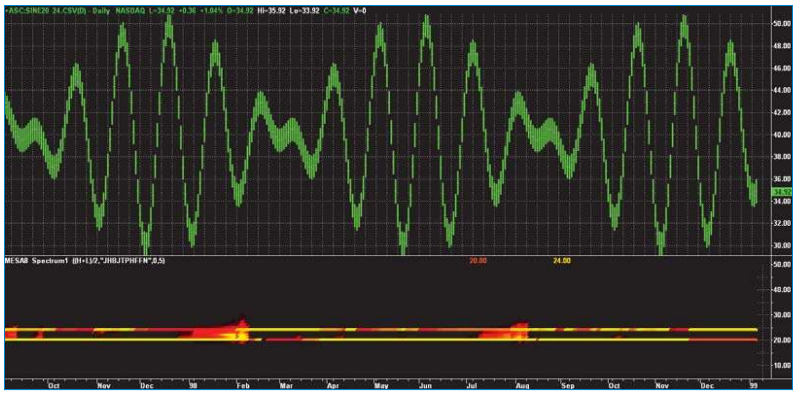

# Fourier Transform For Traders

- **Author:** John F. Ehlers
- **Publication:** Technical Analysis of STOCKS & COMMODITIES, Volume 25, January 2007, pp. 24--34
- **Article URL:** [Article PDF](https://technical.traders.com/archive/article.asp?file=\V25\C01\005EHL.pdf)
- **Traders' Tips URL:** [Traders' Tips, January 2007](http://traders.com/Documentation/FEEDbk_docs/2007/01/TradersTips/TradersTips.html)

---

*Dominant Cycle = Fog Lights*

*When market conditions are variable, adapting to them becomes a challenge. Here's how you can use a dominant cycle to tune the relevant indicators so you don't have to drive through the fog.*

It is intrinsically wrong to use a 14-bar relative strength index (RSI), a nine-bar stochastic, a 5/25 double moving average crossover, or any other fixed-length indicator when the market conditions are variable. It's like driving on a curving mountain road in a fog bank with your cruise control locked — and you've desperately got to clean your eyeglasses.

That market conditions are continuously changing is not even a subject of debate. There have been a number of attempts to adapt to changing market conditions. Volatility-based nonlinear moving averages are just one example of adapting to market changes. As I come from an information theory background, my answer to the question of how to adapt to changing conditions is to first measure the dominant market cycle and then tune the various indicators to that cycle period, or at least a fraction of it. Theoretically, an RSI performs best when the computation period is just half of a cycle period — that is, when all the movement is in one direction and then reverses so all the movement is in the other direction over the period of one cycle — and you get a full amplitude swing from the RSI.

## Fourier Transforms

Make no mistake: Measuring market cycles is difficult. Not only is there the problem of simultaneously solving for frequency, amplitude, and phase to arrive at an accurate estimate, but we must also realize the measurement is being made in a low signal-to-noise environment. Further, we must be concerned with the responsiveness of the measuring technique to capture the cycle periods that are continuously changing without introducing transient artifacts into the measurement. A variety of spectrum estimation techniques is available, ranging from the Fourier periodogram to modern high-resolution spectral analysis approaches.

I have long railed against the use of Fourier transforms in estimating market cycles because of their lack of resolution. Figure 1 represents a typical spectrum measurement. The horizontal axis is the frequency (or its reciprocal, cycle period) scale. The vertical axis is the amplitude scale. The frequency with the highest amplitude identifies the measured cycle.

If the width of the spectral line is narrow, just a spike like the solid line, then the cycle is identified with high resolution. If we have a high-resolution technique we could, in fact, identify two closely spaced cycle periods if they are present in the data. On the other hand, if we have a low-resolution measurement technique and the width of the spectral line is broad, two closely spaced cycles could be averaged together and you would not be able to identify them, as demonstrated by the dotted line (Figure 1).


**FIGURE 1: SPECTRUM CONVERSION.** Here the width of the spectral line is narrow (as seen by the spike in the solid line). This means the cycle is identified with high resolution.

On the right-hand vertical scale of Figure 1 you see a color bar. I convert the amplitude to colors ranging from white hot to ice cold through red hot. Conversion to color enables me to view the spectrum directly below the price bar chart as a heat map. If the spectrum measurement is focused with high resolution, then the spectral display appears as a yellow line. If the spectral line is wide, then it appears as a yellow blob in the heat-map display.

## Discrete Fourier Transform

Figure 2 shows the spectrum measured by a discrete Fourier transform (DFT) below the bar chart for IBM. The color in the heat map indicates the cycle amplitude and the cycle period is the vertical scale, scaled from eight to 50 bars at the right-hand side of the chart. The heat map is in time synchronism with the bar chart.


**FIGURE 2: DRIVING IN DENSE FOG.** The discrete Fourier transform (DFT) of IBM has a very poor spectral resolution.

Now you should see why I have advised against the use of Fourier transforms. There may be some cyclic activity, but it is so blurry it cannot be useful for trading. It is like driving in a dense fog with smeared glasses — maybe you can see something, but it would be better to pull off the road.

## High-Resolution Spectral Analysis

More recently I came across a relatively obscure paper during the course of my research on high-resolution spectral analysis techniques. Steven Kay and Cedric Demeure showed the spectra of Figure 3. (Taking artistic license, I have redrawn them. My drawings may not be precisely accurate, but they convey the concept.)

These are the spectra produced by the more modern MUSIC (multiple signal classification) algorithm and the spectrum produced by a Bartlett (Fourier-type) algorithm. Kay and Demeure posed the question of which had the highest resolution. The two spectral lines are obvious in the MUSIC spectrum but not in the Bartlett spectrum. We would conclude from this inspection that the Bartlett spectrum is inferior with respect to resolution.

Kay and Demeure showed the two spectra are simply related by the transformation:

$$S_{\text{Music}} = \frac{1}{1 - S_{\text{Bartlett}}}$$

Where: $0 \le S_{\text{Bartlett}} \le 1$

So when the Bartlett spectrum is 1, the denominator of the transformation goes to zero and the spectral line of the MUSIC spectrum goes to infinity. Of course, infinity is never reached in real-world measurements. The point is that the two techniques have the same resolution regardless of how they look in a visual inspection when the transform is taken into account.


**FIGURE 3: MUSIC (MULTIPLE SIGNAL CLASSIFICATION) AND BARTLETT (FOURIER-TYPE) SPECTRAL ESTIMATE.** A comparison of the spectra implies that MUSIC has a greater resolution.

Armed with this transform, I applied it to the DFT spectrum estimator using a 20-decibel amplification (100:1) of the peak spectral line. The result is a spectrum now useful for identifying the variable dominant cycle in the market, as shown in Figure 4. When the cycle period exceeds 50 bars, the market is in a trend and the cycle measurement can be of little help. Therefore, I limit the display to be between eight and 50 bars.


**FIGURE 4: TRANSFORMED DFT SPECTRAL ESTIMATE.** Once the transform was applied, the variable dominant cycle was more clearly identified.

The EasyLanguage code to apply the DFT and the transformation and plot the spectrum is given in the sidebar ("Transformed DFT EasyLanguage code"). Preprocessing is important for spectral analysis to avoid having undesired frequency components introduce cross products in the multiple steps of the analysis.

Therefore, I detrend the data by first passing it through a 40-bar high-pass filter. Since long cycles are rejected by the high-pass filter, the end effect errors of having noninteger cycles within the data window are relatively small. The high-pass filter is only a two-pole filter, so components out to our 50-bar plotting limit are passed. I eliminate the two-bar, three-bar, and four-bar cycle components by low-pass filtering in a six-element FIR filter.

After the DFT portion I also show how to extract the dominant cycle using a center of gravity algorithm. My experience is that this center of gravity approach yields the smoothest and most reliable estimate of the dominant cycle period. Traders converting this code to other platforms probably will have difficulty displaying the spectrum. However, extraction of the dominant cycle does not depend on spectrum plotting. The entire spectrum is computed before the dominant cycle is extracted.

The spectral estimate of Figure 4 confirms there is only one strong cycle present in the data most of the time. Simultaneous cycles are present with a low probability. Therefore, the concept of using a dominant cycle to tune indicators is valid or at least sufficiently valid to be used to your advantage to dynamically adjust your indicators.

## A Clearer Path

Kay and Demeure conclude that means other than visual inspection should be used to assess the resolution of spectral estimators. One approach is to create known data that contains two closely spaced cycles and see if the spectral estimator can discern whether two cycles are present. I therefore created a set of data containing a pure 20-bar cycle and a pure 24-bar cycle of equal amplitude. Figure 5 shows the measurement of the DFT spectral estimator. In a nutshell, it does not have sufficient resolution to identify that both these closely spaced cycles are present.


**FIGURE 5: MEASUREMENT OF THE DFT SPECTRAL ESTIMATOR.** The transformed DFT measurement of 20- and 24-bar cycles cannot isolate the two components.

I also applied MESA8 to this same data with the result displayed in Figure 6. Clearly, MESA8 does in fact have sufficient resolution to identify both cycles as being present.


**FIGURE 6: APPLYING MESA8 MEASUREMENT.** There is enough resolution to clearly identify the presence of both components.

Although the Kay and Demeure transform improve the resolution of a DFT spectral estimate, I still have some problems using the transformed DFT approach without reservation. The results generally track my more advanced techniques, but I am not convinced of its accuracy in low signal-to-noise environments. Further, it still takes a reasonable amount of historical data to make a measurement. That means it can be sluggish in response to rapid changes and mixed-cycle periods within the observation window and get averaged together even when their periods are widely spaced. Still, it is better than driving in the fog.

*John Ehlers is a pioneer in the use of cycles and DSP techniques in technical analysis. He is the author of the MESA8 program, and www.eminiz.com and www.indicez.com websites for trading.*

## Transformed DFT EasyLanguage Code

```easylanguage
Inputs:
    Price((H+L)/2),
    Window(50),
    ShowDC(False);

Vars:
    alpha1(0),
    HP(0),
    CleanedData(0),
    Period(0),
    n(0),
    MaxPwr(0),
    Num(0),
    Denom(0),
    DominantCycle(0),
    Color1(0),
    Color2(0);

//Arrays are sized to have a maximum Period of 50 bars
Arrays:
    CosinePart[50](0),
    SinePart[50](0),
    Pwr[50](0),
    DB[50](0);

//Get a detrended version of the data by High Pass Filtering
//with a 40 Period cutoff
If CurrentBar <= 5 Then Begin
    HP = Price;
    CleanedData = Price;
End;
If CurrentBar > 5 Then Begin
    alpha1 = (1 - Sine(360/40))/Cosine(360/40);
    HP = .5*(1 + alpha1)*(Price - Price[1]) + alpha1*HP[1];
    CleanedData = (HP + 2*HP[1] + 3*HP[2] + 3*HP[3] +
        2*HP[4] + HP[5])/12;
End;

//This is the DFT
For Period = 8 to 50 Begin
    CosinePart[Period] = 0;
    SinePart[Period] = 0;
    FOR n = 0 to Window - 1 Begin
        CosinePart[Period] = CosinePart[Period] +
            CleanedData[n]*Cosine(360*n/Period);
        SinePart[Period] = SinePart[Period] +
            CleanedData[n]*Sine(360*n/Period);
    End;
    Pwr[Period] = CosinePart[Period]*CosinePart[Period] +
        SinePart[Period]*SinePart[Period];
End;

//Find Maximum Power Level for Normalization
MaxPwr = Pwr[8];
For Period = 8 to 50 Begin
    If Pwr[Period] > MaxPwr Then MaxPwr = Pwr[Period];
End;

//Normalize Power Levels and Convert to Decibels
For Period = 8 to 50 Begin
    IF MaxPwr > 0 and Pwr[Period] > 0 Then DB[Period] = -
        10*LOG(.01 / (1 - .99*Pwr[Period] / MaxPwr))/Log(10);
    If DB[Period] > 20 then DB[Period] = 20;
End;

//Find Dominant Cycle using CG algorithm
Num = 0;
Denom = 0;
For Period = 8 to 50 Begin
    If DB[Period] < 3 Then Begin
        Num = Num + Period*(3 - DB[Period]);
        Denom = Denom + (3 - DB[Period]);
    End;
End;
If Denom <> 0 then DominantCycle = Num/Denom;
If ShowDC = True Then Plot1(DominantCycle, "S1", RGB(0, 0, 255),0,2);

//Plot the Spectrum as a Heatmap
For Period = 8 to 50 Begin
    //Convert Decibels to RGB Color for Display
    If DB[Period] > 10 Then Begin
        Color1 = 255*(2 - DB[Period]/10);
        Color2 = 0;
    End;
    If DB[Period] <= 10 Then Begin
        Color1 = 255;
        Color2 = 255*(1 - DB[Period]/10);
    End;

    If Period = 8 Then Plot8(8, "S8", RGB(Color1, Color2, 0),0,4);
    If Period = 9 Then Plot9(9, "S9", RGB(Color1, Color2, 0),0,4);
    If Period = 10 Then Plot10(10, "S10", RGB(Color1, Color2, 0),0,4);
    If Period = 11 Then Plot11(11, "S11", RGB(Color1, Color2, 0),0,4);
    If Period = 12 Then Plot12(12, "S12", RGB(Color1, Color2, 0),0,4);
    If Period = 13 Then Plot13(13, "S13", RGB(Color1, Color2, 0),0,4);
    If Period = 14 Then Plot14(14, "S14", RGB(Color1, Color2, 0),0,4);
    If Period = 15 Then Plot15(15, "S15", RGB(Color1, Color2, 0),0,4);
    If Period = 16 Then Plot16(16, "S16", RGB(Color1, Color2, 0),0,4);
    If Period = 17 Then Plot17(17, "S17", RGB(Color1, Color2, 0),0,4);
    If Period = 18 Then Plot18(18, "S18", RGB(Color1, Color2, 0),0,4);
    If Period = 19 Then Plot19(19, "S19", RGB(Color1, Color2, 0),0,4);
    If Period = 20 Then Plot20(20, "S20", RGB(Color1, Color2, 0),0,4);
    If Period = 21 Then Plot21(21, "S21", RGB(Color1, Color2, 0),0,4);
    If Period = 22 Then Plot22(22, "S22", RGB(Color1, Color2, 0),0,4);
    If Period = 23 Then Plot23(23, "S23", RGB(Color1, Color2, 0),0,4);
    If Period = 24 Then Plot24(24, "S24", RGB(Color1, Color2, 0),0,4);
    If Period = 25 Then Plot25(25, "S25", RGB(Color1, Color2, 0),0,4);
    If Period = 26 Then Plot26(26, "S26", RGB(Color1, Color2, 0),0,4);
    If Period = 27 Then Plot27(27, "S27", RGB(Color1, Color2, 0),0,4);
    If Period = 28 Then Plot28(28, "S28", RGB(Color1, Color2, 0),0,4);
    If Period = 29 Then Plot29(29, "S29", RGB(Color1, Color2, 0),0,4);
    If Period = 30 Then Plot30(30, "S30", RGB(Color1, Color2, 0),0,4);
    If Period = 31 Then Plot31(31, "S31", RGB(Color1, Color2, 0),0,4);
    If Period = 32 Then Plot32(32, "S32", RGB(Color1, Color2, 0),0,4);
    If Period = 33 Then Plot33(33, "S33", RGB(Color1, Color2, 0),0,4);
    If Period = 34 Then Plot34(34, "S34", RGB(Color1, Color2, 0),0,4);
    If Period = 35 Then Plot35(35, "S35", RGB(Color1, Color2, 0),0,4);
    If Period = 36 Then Plot36(36, "S36", RGB(Color1, Color2, 0),0,4);
    If Period = 37 Then Plot37(37, "S37", RGB(Color1, Color2, 0),0,4);
    If Period = 38 Then Plot38(38, "S38", RGB(Color1, Color2, 0),0,4);
    If Period = 39 Then Plot39(39, "S39", RGB(Color1, Color2, 0),0,4);
    If Period = 40 Then Plot40(40, "S40", RGB(Color1, Color2, 0),0,4);
    If Period = 41 Then Plot41(41, "S41", RGB(Color1, Color2, 0),0,4);
    If Period = 42 Then Plot42(42, "S42", RGB(Color1, Color2, 0),0,4);
    If Period = 43 Then Plot43(43, "S43", RGB(Color1, Color2, 0),0,4);
    If Period = 44 Then Plot44(44, "S44", RGB(Color1, Color2, 0),0,4);
    If Period = 45 Then Plot45(45, "S45", RGB(Color1, Color2, 0),0,4);
    If Period = 46 Then Plot46(46, "S46", RGB(Color1, Color2, 0),0,4);
    If Period = 47 Then Plot47(47, "S47", RGB(Color1, Color2, 0),0,4);
    If Period = 48 Then Plot48(48, "S48", RGB(Color1, Color2, 0),0,4);
    If Period = 49 Then Plot49(49, "S49", RGB(Color1, Color2, 0),0,4);
    If Period = 50 Then Plot50(50, "S50", RGB(Color1, Color2, 0),0,4);
End;
```

## Suggested Reading

Kay, Steven, and Cedric Demeure [1984]. "The High-Resolution Spectrum Estimator: A Subjective Entity," *Proceedings IEEE*, Volume 72: December.

---

*See our Traders' Tips section for program code implementing John Ehlers' technique.*

---

## BibTeX

```bibtex
@article{ehlers_fourier_transform_2007,
  author    = {John F. Ehlers},
  title     = {Fourier Transform For Traders},
  journal   = {Technical Analysis of STOCKS \& COMMODITIES},
  volume    = {25},
  number    = {1},
  pages     = {24--34},
  year      = {2007},
  month     = jan,
  publisher = {Technical Analysis, Inc.},
  url       = {https://technical.traders.com/archive/article.asp?file=\V25\C01\005EHL.pdf}
}

@misc{traders_tips_2007_01,
  author       = {{Technical Analysis of STOCKS \& COMMODITIES}},
  title        = {Traders' Tips: Fourier Transform For Traders by John F. Ehlers},
  year         = {2007},
  month        = jan,
  howpublished = {online},
  url          = {http://traders.com/Documentation/FEEDbk_docs/2007/01/TradersTips/TradersTips.html}
}
```
