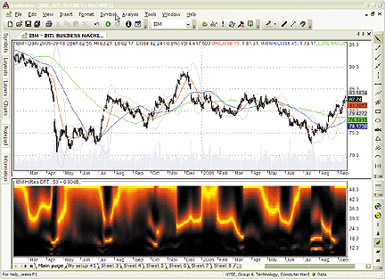
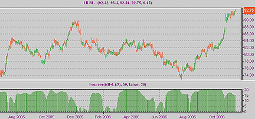
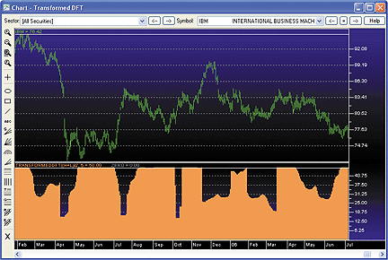
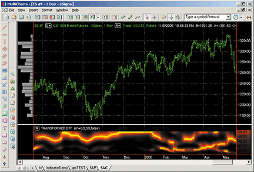
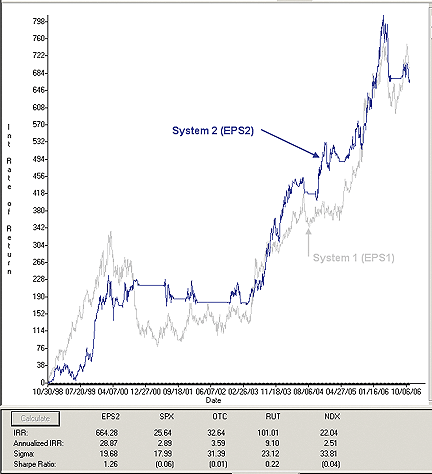
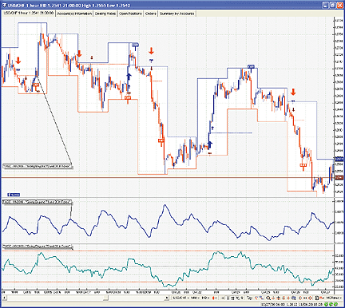

# Traders' Tips: January 2007

- **Article:** Fourier Transform For Traders by John F. Ehlers
- **Traders' Tips URL:** [Traders' Tips, January 2007](http://traders.com/Documentation/FEEDbk_docs/2007/01/TradersTips/TradersTips.html)

---

**Editor's note:** Most of this month's Traders' Tips are based on John Ehlers' article in this issue, "Fourier Transform For Traders." Code written in EasyLanguage for TradeStation is provided by the author in the article's sidebar titled "Transformed DFT EasyLanguage code." Additional code is presented here. Other tips in this section are on topics of the contributor's choosing.


## TradeStation: January 2007

John Ehlers' article in this issue, "Fourier Transform For Traders,"
suggests using the discrete Fourier transform (DFT) to tune indicators.
Here, we demonstrate this by building a DFT-adapted relative strength index
(RSI) strategy (Figure 1).

Rather than display the RSI for a single cycle length across the
entire chart, our adaptive RSI value reflects the DFT-calculated dominant
cycle length RSI. If the dominant cycle changes from 14 to 18 bars, the
RSI length parameter changes accordingly. Computationally, this requires
the strategy to continuously update values for all possible RSI cycle lengths
via a "for" loop and array.

Once the suite of possible RSI values is calculated, we use the DFT
to select the relevant RSI for the current bar. The strategy then trades
according to J. Welles Wilder's original rules for the RSI.

To download this EasyLanguage code, go to the Support Center at TradeStation.com.
Search for the file "Ehlers_Dft.Eld."


**FIGURE 1: TRADESTATION, DISCRETE FOURIER TRANSFORM (DFT)
AND DFT-ADAPTED RELATIVE STRENGTH INDEX (RSI). In this daily chart of the
continuous S&P 500 emini futures contract, the upper subgraph shows
RSI_DFT strategy trades. The middle subgraph displays the RSI_DFT indicator.
The original DFT is shown in the lower subgraph.**


External file: [FourierTransform.els](FourierTransform.els)


```easylanguage
Strategy:  Ehlers DFT
inputs:
 Price( MedianPrice ),
 Window( 50 ), { maximum Window = 50 }
 OverBought( 70 ),
 OverSold( 30 ),
 Frac( 0.5 ) ;
variables:
 HP( 0 ),
 CleanedData( 0 ),
 Per( 0 ),
 CosPer( 0 ),
 CycPer( 0 ),
 Alpha1( 0 ),
 Period( 0 ),
 n( 0 ),
 MaxPwr( 0 ),
 Num( 0 ),
 Denom( 0 ),
 ThreeMinus( 0 ),
 DominantCycle( 0 ),
 Change( 0 ),
 AbsChange( 0 ),
 Count( 0 ),
  DFT_RSI( 0 ) ;
{ arrays are sized for a maximum period of 50 bars }
arrays:
 CosinePart[50]( 0 ),
 SinePart[50]( 0 ),
 Pwr[50]( 0 ),
 DB[50]( 0 ),
 SF[50]( 0 ),
 NetChgAvg[50]( 0 ),
 TotchgAvg[50]( 0 ),
 RSIArray[50]( 0 ) ;
{ detrend data by high-pass filtering with a 40 period
  cut-off }
if CurrentBar <= 5 then
 begin
 HP = Price ;
 CleanedData = Price ;
 end
else if CurrentBar > 5 then
 begin
 Per = 360 / 40 ;
 CosPer = Cosine( Per ) ;
 if CosPer <> 0 then
  Alpha1 = ( 1 - Sine( Per ) ) / CosPer ;
 HP = 0.5 * ( 1 + Alpha1 ) * ( Price - Price[ 1 ] ) +
  Alpha1 * HP[1] ;
 CleanedData = ( HP + 2 * HP[1] + 3 * HP[2] + 3 *
  HP[3] + 2 * HP[4] + HP[5] ) / 12 ;
 end ;
{ calculate DFT }
for Period = 8 to 50
 begin
 CosinePart[Period] = 0 ;
 SinePart[Period] = 0 ;
 for n = 0 to Window - 1
  begin
  CycPer = ( 360 * n ) / Period ;
  CosinePart[Period] = CosinePart[Period] +
    CleanedData[n] * Cosine( CycPer ) ;
  SinePart[Period] = SinePart[Period] +
    CleanedData[n] * Sine( CycPer ) ;
  end ;
 Pwr[Period] = Square( CosinePart[Period] ) +
  Square( SinePart[Period] ) ;
 end ;
{ find maximum power level for normalization }
MaxPwr = Pwr[8] ;
for Period = 8 to 50
 begin
 if Pwr[Period] > MaxPwr then
  MaxPwr = Pwr[Period] ;
 end ;
{ normalize power levels and convert to decibels }
for Period = 8 to 50
 begin
 if MaxPwr > 0 and Pwr[Period] > 0 then
  DB[Period] = -10 * log( 0.01 / ( 1 - 0.99 *
   Pwr[Period] / MaxPwr ) ) / log( 10 ) ;
 if DB[Period] > 20 then
  DB[Period] = 20 ;
 end ;
{ find dominant cycle using CG algorithm }
Num = 0 ;
Denom = 0 ;
for Period = 8 to 50
 begin
 if DB[Period] < 3 then
  begin
  ThreeMinus = 3 - DB[Period] ;
  Num = Num + Period * ThreeMinus ;
  Denom = Denom + ThreeMinus ;
  end ;
 end ;
if Denom <> 0 then
 DominantCycle = Num / Denom ;
Change = Price - Price[1] ;
AbsChange = AbsValue( Change ) ;
for Count = 1 to Window
 begin
 if CurrentBar = 1 then
  begin
  SF[Count] = 1 / Count ;
  NetChgAvg[Count] = ( Price - Price[Count] ) /
   Count ;
  TotChgAvg[Count] = Average( AbsChange, Count ) ;
  end
 else
  begin
  NetChgAvg[Count] = NetChgAvg[Count][1] +
   SF[Count] * ( Change - NetChgAvg[Count][1] ) ;
  TotChgAvg[Count] = TotChgAvg[Count][1] +
   SF[Count] * ( AbsChange -
    TotChgAvg[Count][1] ) ;
  if TotChgAvg[Count] <> 0 then
   RSIArray[Count] = ( 50 *
    ( NetChgAvg[Count] / TotChgAvg[Count] +
      1 ) )
  else
   RSIArray[Count] = 50 ;
  end ;
 end ;
DFT_RSI = RSIArray[ iff( Frac * DominantCycle < 50,
 Frac * DominantCycle, 50 ) ] ;
{ CB > 1 check used to avoid spurious cross confirmation at CB = 1 }
if Currentbar > 1 then
 begin
 if DFT_RSI crosses over OverSold then
  Buy ( "RSI-LE" ) next bar at market ;
 if DFT_RSI crosses under OverBought then
  Sell Short ( "RSI-SE" ) next bar at market ;
 end ;
```


## eSignal: January 2007

eSIGNAL: Fourier Transform For Traders

For this month's Traders' Tip based on John Ehlers' article in this
issue, "Fourier Transform For Traders," we have provided the eSignal formula
"TransformedDFT.efs."

There are several formula parameters that may be configured through
the Edit Studies option in the Advanced Chart. There is an option to highlight
the dominant cycle (DC), which is off by default. When the option for displaying
the DC is on, the default color and size is blue and "2," respectively.
Both properties of the DC may also be modified through Edit Studies.

To discuss this study or download a complete copy of the formula, please
visit the EFS Library Discussion Board forum under the Bulletin Boards
link at www.esignalcentral.com. The eSignal formula script (EFS) is also
available for copying and pasting from the STOCKS & COMMODITIES website
at Traders.com.

--Jason Keck eSignal, a division of Interactive Data Corp. 800 815-8256, www.esignalcentral.com


**FIGURE 2: eSIGNAL, DISCRETE FOURIER TRANSFORM. Here is a
demonstration of the transformed discrete Fourier transform (DFT) in eSignal.
There is an option to highlight the dominant cycle (DC), which is off by
default. When the option for displaying the DC is on, the default color
and size is blue and "2," respectively.**


External file: [FourierTransform.efs](FourierTransform.efs)


```javascript
/***************************************
Provided By : eSignal (c) Copyright 2006
Description:  Fourier Transform for Traders
              by John Ehlers
Version 1.0  11/02/2006
Notes:
* Jan 2007 Issue of Stocks and Commodities Magazine
* Study requires version 8.0 or later.
Formula Parameters:                     Default:
Show Dominant Cycle                     false
Dominant Cycle Color                    blue
Dominant Cycle Size                     2
*****************************************************************/
function preMain() {
    setStudyTitle("Transformed DFT ");
    setShowCursorLabel(false);
    setShowTitleParameters(false);
    // Dominant Cycle properties
    setPlotType(PLOTTYPE_CIRCLE, 51);
    var fp1 = new FunctionParameter("bShowDC", FunctionParameter.BOOLEAN);
        fp1.setName("Show Dominant Cycle");
        fp1.setDefault(false);
    var fp2 = new FunctionParameter("nDC_color", FunctionParameter.COLOR);
        fp2.setName("Dominant Cycle Color");
        fp2.setDefault(Color.blue);
    var fp3 = new FunctionParameter("nDC_thick", FunctionParameter.NUMBER);
        fp3.setName("Dominant Cycle Size");
        fp3.setLowerLimit(1);
        fp3.setDefault(2);
}
// Global Variables
var bVersion  = null;    // Version flag
var bInit     = false;   // Initialization flag
var xPrice = null;
var xHP = null;
var xCleanData = null;
var nWindow = 50;
var nAlpha = (1 - Math.sin((2*Math.PI)/40)) / Math.cos((2*Math.PI)/40);
var aCosinePart = new Array(51);
var aSinePart = new Array(51);
var aPwr = new Array(51);
var aDB = new Array(51);
var aReturn = new Array(52);  // return array
function main(bShowDC, nDC_color, nDC_thick) {
    if (bVersion == null) bVersion = verify();
    if (bVersion == false) return;
    var nPeriod = 0;
    var n = 0;
    var nMaxPwr = 0;
    var nNum = 0;
    var nDenom = 0;
    var nDominantCycle = 0;
    var Color1 = null;
    var Color2 = null;
    //Initialization
    if (bInit == false) {
        setDefaultBarFgColor(nDC_color, 51);
        setDefaultBarThickness(nDC_thick, 51);
        xPrice = hl2();
        xHP = efsInternal("calcHP", xPrice);
        xCleanData = efsInternal("calcCleanData", xHP);
        bInit = true;
    }
    var nHP = xHP.getValue(0);
    var nCleanData = xCleanData.getValue(-nWindow);
    if (nHP == null || nCleanData == null) return;
    //This is the DFT
    nPeriod = 8;
    n = 0;
    for (nPeriod = 8; nPeriod <= 50; nPeriod++) {
        aCosinePart[nPeriod] = 0;
        aSinePart[nPeriod] = 0;
        for (n = 0; n <= nWindow; n++) {
            var nCD = xCleanData.getValue(-n);
            aCosinePart[nPeriod] = aCosinePart[nPeriod] +
                nCD*Math.cos((2*Math.PI)*n/nPeriod);
            aSinePart[nPeriod] = aSinePart[nPeriod] +
                nCD*Math.sin((2*Math.PI)*n/nPeriod);
        }
        aPwr[nPeriod] = aCosinePart[nPeriod]*aCosinePart[nPeriod] +
            aSinePart[nPeriod]*aSinePart[nPeriod];
    }
    //Find Maximum Power Level for Normalization
    nPeriod = 8;
    nMaxPwr = aPwr[nPeriod];
    for (nPeriod = 8; nPeriod <= 50; nPeriod++) {
        if (aPwr[nPeriod] > nMaxPwr) nMaxPwr = aPwr[nPeriod];
    }
    //Normalize Power Levels and Convert to Decibels
    nPeriod = 8;
    for (nPeriod = 8; nPeriod <= 50; nPeriod++) {
        if (nMaxPwr > 0 && aPwr[nPeriod] > 0) {
            aDB[nPeriod] = -10*Math.log(.01 /
                (1 - .99*aPwr[nPeriod] / nMaxPwr))/Math.log(10);
        }
        if (aDB[nPeriod] > 20) aDB[nPeriod] = 20;
    }
    //Find Dominant Cycle using CG algorithm
    nPeriod = 8;
    for (nPeriod = 8; nPeriod <= 50; nPeriod++) {
        if (aDB[nPeriod] < 3) {
            nNum += nPeriod*(3 - aDB[nPeriod]);
            nDenom += (3 - aDB[nPeriod]);
        }
    }
    if (nDenom != 0) {
        nDominantCycle = nNum/nDenom;
        if (bShowDC == true) {
            // Dominant Cycle
            aReturn[51] = nDominantCycle;
        }
    }
    //Plot the Spectrum as a Heatmap
    nPeriod = 8;
    for (nPeriod = 8; nPeriod <= 50; nPeriod++) {
        //Convert Decibels to RGB Color for Display
        if (aDB[nPeriod] > 10) {
            Color1 = Math.round(255*(2 - aDB[nPeriod]/10));
            Color2 = 0;
        } else if (aDB[nPeriod] <= 10) {
            Color1 = 255;
            Color2 = Math.round(255*(1 - aDB[nPeriod]/10));
        }
        aReturn[nPeriod] = nPeriod;
        setDefaultBarFgColor(Color.RGB(Color1 , Color2, 0), nPeriod);
        setDefaultBarThickness(4, nPeriod);
    }
    //  aReturn[51]  // contains the Dominant Cycle value
    return aReturn;
}
// calcHP globals
var nPrevHP = null;
var nCurrHP = null;
function calcHP(x) {
    if (getCurrentBarCount() <= 5 ) {
        nCurrHP = x.getValue(0);
        return nCurrHP;
    } else {
        if (x.getValue(-1) == null) return null;
        if (getBarState() == BARSTATE_NEWBAR) nPrevHP = nCurrHP;
        nCurrHP = ( 0.5*(1 + nAlpha)*(x.getValue(0) - x.getValue(-1)) + nAlpha*nPrevHP );
        return nCurrHP;
    }
}
function calcCleanData(x) {
//Get a detrended version of the data by High Pass Filtering
//with a 40 Period cutoff
    if (getCurrentBarCount() <= 5 ) {
        return x.getValue(0);
    } else {
        return (  x.getValue(0) +
                  2*x.getValue(-1) +
                  3*x.getValue(-2) +
                  3*x.getValue(-3) +
                  2*x.getValue(-4) +
                  x.getValue(-5)    ) / 12;
    }
}
function verify() {
    var b = false;
    if (getBuildNumber() < 779) {
        drawTextAbsolute(5, 35, "This study requires version 8.0 or later.",
            Color.white, Color.blue, Text.RELATIVETOBOTTOM|Text.RELATIVETOLEFT|Text.BOLD|Text.LEFT,
            null, 13, "error");
        drawTextAbsolute(5, 20, "Click HERE to upgrade.@URL=https://www.esignal.com/download/default.asp",
            Color.white, Color.blue, Text.RELATIVETOBOTTOM|Text.RELATIVETOLEFT|Text.BOLD|Text.LEFT,
            null, 13, "upgrade");
        return b;
    } else {
        b = true;
    }
    return b;
}
```


## Wealth-Lab: January 2007

This month's Traders' Tip, which is based on John Ehlers' article, "Fourier
Transform For Traders," gives us an excuse to shake some dust off a rarely
used indicator that's available in WealthLab's built-in library: the FIR
(finite impulse response).

Here, we used it in two (conceptually different) ways: once to build
the CleanedData series -- that is, a custom-weighted moving average -- and
then to build several convolutions (against variable-period sines and cosines)
that are needed when computing the periodogram.

The WealthScript code shown here also has a simple trading system to
show how "standard" indicators may easily become adaptive; here, we show
a simple moving average (whose length is dynamically set as one half of
DominantCycle) and a linear regression (one quarter of DominantCycle).
Trading is driven by their crossings (Figure 3).


**FIGURE 3: WEALTH-LAB, FINITE IMPULSE RESPONSE. Notice how
the "fast" line (variable-period linear regression, in red) closely follows
prices, while the "slow" line (variable-period SMA, in blue) will normally
stay away from the fast line but gets in sync quickly when trends are about
to end.**


External file: [FourierTransform.cs](FourierTransform.cs)


```csharp
const Window = 50;
// Transformed Discrete Fourier Transform -- Dominant Cycle
function TDFT_DCSeries(Series: integer; BuildHeatMap: boolean): integer;
begin
  var Name: string = 'TDFT_DC(' + GetDescription(Series) + ')';
  Result := FindNamedSeries(Name);
  if (Result >= 0) and
    (not BuildHeatMap or (FindNamedSeries(Name + '.8') >= 0)) then exit;
  if Result < 0 then Result := CreateNamedSeries(Name);
  var Period, n, Bar: integer;
  var C, S, DominantCycle: float;
  var HeatMap: array[8..Window] of integer;
  if BuildHeatMap then for Period := 8 to Window do begin
    HeatMap[Period] := AddSeriesValue(CreateNamedSeries(''), Period);
    SetDescription(HeatMap[Period], Name + '.' + IntToStr(Period));
  end;
  // Convert Decibels to RGB Color to Display
  var Color: array[0..18] of integer;
  for n := 0 to 9 do Color[n] := 990 - 10 * n; // yellow to red
  for n := 10 to 18 do Color[n] := 1800 - 100 * n; // red to black
  // Get detrended data by High Pass Filtering with a 40 Period cutoff
  var Alpha: float = (1 - Sin(360 / 40)) / Cos(360 / 40);
  var HP: integer = CreateSeries;
  for Bar := 1 to BarCount - 1 do
    @HP[Bar] := Alpha * @HP[Bar - 1] + Momentum(Bar, Series, 1) * (1 + Alpha) / 2;
  var CleanedData: integer = FIRSeries(HP, '1,2,3,3,2,1');
  // Prepare convolution series for DFT
  var CConv, SConv: array[8..Window] of integer;
  var CSum, SSum: array[8..Window] of float;
  for Period := 8 to Window do begin
    var CW: string = '';
    var SW: string = '';
    CSum[Period] := 1;
    SSum[Period] := 1;
    for n := 0 to Window - 1 do begin
      C := Round(Cos(360 * n / Period) * 100000);
      S := Round(Sin(360 * n / Period) * 100000);
      CW := CW + FloatToStr(C) + ',';
      SW := SW + FloatToStr(S) + ',';
      CSum[Period] := CSum[Period] + C;
      SSum[Period] := SSum[Period] + S;
    end;
    CConv[Period] := FIRSeries(CleanedData, CW + '1');
    SConv[Period] := FIRSeries(CleanedData, SW + '1');
  end;
  for Bar := Window + 4 to BarCount - 1 do begin
    // This is the DFT
    var MaxPwr: float = 0;
    var Pwr: array[8..Window] of float;
    for Period := 8 to Window do begin
      C := GetSeriesValue(Bar, CConv[Period]) * CSum[Period];
      S := GetSeriesValue(Bar, SConv[Period]) * SSum[Period];
      Pwr[Period] := C * C + S * S;
      // Find Maximum Power Level for Normalization
      MaxPwr := max(MaxPwr, Pwr[Period]);
    end;
    // Find Dominant Cycle using CG algorithm
    var Num: float = 0;
    var Den: float = 0;
    for Period := 8 to Window do if (Pwr[Period] > 0) then begin
      // Normalize Power Levels and Convert to Decibels
      var DB: float = 20 + 10 * Log10(1 - 0.99 * Pwr[Period] / MaxPwr);
```


## AmiBroker: January 2007

In "Fourier Transform For Traders" in this issue, John Ehlers presents
an interesting technique of improving the resolution of spectral analysis
that could be used to effectively measure market cycles. Better resolution
is obtained by a surprisingly simple modification of the discrete Fourier
transform.

Implementing the idea presented in the article is easy using AmiBroker's
Formula Language. Listing 1 shows the full-featured formula that implements
a high-pass filter and a six-tap low-pass finite impulse response (FIR)
filter on input, then does discrete Fourier transform calculations and
plots a spectrogram as a heat map (Figure 4). We have taken liberty of
adding extra parameters so the user can modify the analysis window length
and the high-pass filter cutoff frequency in real time using the parameters
window. Changing parameters on the fly and seeing the evolution of the
spectrogram is not only educational but also entertaining.

--Tomasz Janeczko, AmiBroker.com www.amibroker.com



**FIGURE 4: AMIBROKER, TRANSFORMED DISCRETE FOURIER TRANSFORM
(DFT). This screenshot shows a daily chart of IBM (upper pane) and the
transformed DFT spectral estimate that allows us to clearly identify the
variable dominant cycle. This chart effectively duplicates the results
presented in John Ehlers' article.**


External file: [FourierTransform.afl](FourierTransform.afl)


```afl
Listing 1
PI = 3.1415926;
Data = (H+L)/2;
// detrending ( high-pass filter )
HFPeriods = Param("HP filter cutoff", 40, 20, 100 );
alpha1 = ( 1-sin(2*pi/HFPeriods) ) / cos( 2 * pi / HFPeriods );
HP = AMA2( Data - Ref( Data, -1 ), 0.5 * ( 1 + alpha1 ), alpha1 );
// 6-tap low-pass FIR filter
CleanedData = ( HP + 2 * Ref( HP, -1 ) + 3 * Ref( HP, -2 ) +
   3 * Ref( HP, -3 ) + 2 * Ref( HP, -4 ) + Ref( HP, -5 ) )/12;
// Discrete Fourier Transform
WindowSize = Param("Window Size", 50, 20, 100 );
Maxpwr = 0;
x = BarIndex();
for( period = 8; period <= WindowSize; period++ )
{
  tx = 2 * pi * x / period;
  cosinepart = Sum( CleanedData * cos( tx ), WindowSize );
  sinepart = Sum( CleanedData * sin( tx ), WindowSize );
  pwr = cosinepart ^ 2 + sinepart ^ 2;
  Maxpwr = Max( Maxpwr, pwr );
  VarSet( "pwr"+period, pwr );
}
// Normalize and convert to decibels
for( period = 8; period <= WindowSize; period++ )
{
  pwr = VarGet("pwr"+period);
  db = -10 * log10( 0.01 / ( 1 - 0.99 * pwr / Maxpwr ) );
  db = Min( db, 20 ); // 'saturate' at -20db
  VarSet( "db"+period, db );
}
Title = Name() + " HiRes DFT : ";
// Plot Heat Map ( Spectrogram )
// and find dominant cycle
DcNum = DcDenom = 0;
for( k = 8; k <= WindowSize; k++ )
{
  db = VarGet("db"+k);
  // convert dB to color
  Red = IIf( db > 10, 255 * ( 2 - db/10 ), 255 );
  Green = IIf( db <= 10, 255 * ( 1 - db/10 ), 0 );
  PlotOHLC( k, k, k-1, k-1, "",
            ColorRGB( Red, Green, 0 ), styleCloud | styleNoLabel);
  if( SelectedValue( db ) <= 5 )
      Title = Title + k + " = " + StrFormat("%.2lf",-db) + "dB, ";
  // dominant cycle calcs
  DcNum = DcNum + (db < 3 ) * k * ( 3 - db );
  DcDenom = DcDenom + ( db < 3 ) * ( 3 - db );
}
if( ParamToggle("Show Dom. Cycle?", "No|Yes" ) )
{
  DominantCycle = DcNum / DcDenom;
  Plot( DominantCycle, "Dominant Cycle", colorBlue );
  Title = Title + "{{VALUES}}";
}
GraphZOrder = 1;
```


## NeuroShell Trader: January 2007

The dominant cycle indicator introduced by John Ehlers in his article
in this issue, "Fourier Transform For Traders," can be easily implemented
in NeuroShell Trader using NeuroShell Trader's ability to call indicators
written in common programming languages such as C, C++, Power Basic, IBasic,
or Delphi.

After converting the EasyLanguage code given in the article to your
preferred compiler, you can insert the resulting dominant cycle indicator
as follows:

A dynamic trading system can be easily created in NeuroShell Trader
by combining the Dynamic Cycle indicator with the adaptive-length indicators
available in John Ehlers' Cybernetic and Mesa8 NeuroShell Trader add-ons.
John Ehlers suggests that adaptive-length indicators linked to the dominant
cycle indicator, when combined with NeuroShell Trader's genetic optimizer,
could produce very robust systems. Similar strategies may also be created
using the Dominant Cycle indicator found in John Ehlers' Mesa8 NeuroShell
Trader Add-on.

Users of NeuroShell Trader can go to the STOCKS & COMMODITIES
section of the NeuroShell Trader free technical support website to download
a copy of this or any previous Traders' Tips.


**FIGURE 5: NEUROSHELL, FOURIER TRANSFORM. Here is a sample
NeuroShell chart demonstrating the dominant cycle indicator.**


## Tradecision: January 2007

In "Fourier Transform For Traders" in this issue, John Ehlers explains
how to use Fourier transforms for measuring and estimating market cycles.
Tradecision's Indicator Builder enables you to create a custom indicator
using the method that Ehlers describes.

This indicator allows you to build only some of the price data spectrum
components, defined by the parameter Peridq. The parameter Peridq is the
component to be analyzed with the fluctuations for the indicated period.
If the parameter ShowDC is true, Peridq is invalid, and the graph shows
the behavior of the dominant cycle component, calculated automatically.

Here is the code for the Fourier custom indicator:

To import the indicator into Tradecision, visit the "Traders' Tips
from Tasc magazine" at https://tradecision.com/support/tasc_tips/tasc_traders_tips.htm
or copy the code from the STOCKS & COMMODITIES website at www.Traders.com.
A sample chart is shown in Figure 6.

FIGURE 6: TRADECISION, FOURIER. Here is John Ehlers' Fourier indicator,
inserted here as a subchart on an IBM daily chart.



**FIGURE 6: TRADECISION, FOURIER. Here is John Ehlers' Fourier indicator,
inserted here as a subchart on an IBM daily chart.**


External file: [FourierTransform.tdc](FourierTransform.tdc)


```text
Input
     Price :"Price" ,((H+L)/2);
     Window:"Window",50;
     ShowDC:"ShowDC",false;
     Peridq:"Period",30,1,50;
end_input
var
alpha1:=0;
HP:=0;
CleanedData:=0;
Period:=0;
n:=0;
MaxPwr:=0;
Num:=0;
Denom:=0;
DominantCycle:=0;
array:CosinePart[50]:=0;
array:SinePart[50]:=0;
array:Pwr[50]:=0;
array:DB[50]:=0;
end_var
{Get a detrended version of the data by High Pass Filtering with
a 40 Period cutoff}
If HISTORYSIZE <= 5 Then Begin
   HP := Price;
   CleanedData := Price;
End; else Begin
    alpha1 := (1 - Sin(360/40))/Cos(360/40);
    HP := 0.5*(1 + alpha1)*(Price - Price\1\) + alpha1*HP\1\;
    CleanedData := (HP + 2*HP\1\ + 3*HP\2\ + 3*HP\3\ + 2*HP\4\ +   HP\5\)/12;
End;
{This is the DFT}
For Period := 8 to 50 do Begin
    CosinePart[Period] := 0;
    SinePart[Period] := 0;
    For n := 0 to Window - 1 do Begin
CosinePart[Period] := CosinePart[Period] + CleanedData\n\*Cos(360*n/Period);
      SinePart[Period] := SinePart[Period] + CleanedData\n\*Sin(360*n/Period);
    End;
    Pwr[Period] := CosinePart[Period]*CosinePart[Period] +
                   SinePart[Period]*SinePart[Period];
End;
{Find Maximum Power Level for Normalization}
MaxPwr := Pwr[8];
For Period := 8 to 50 do Begin
    If Pwr[Period] > MaxPwr Then MaxPwr := Pwr[Period];
End;
{Normalize Power Levels and Convert to Decibels}
For Period := 8 to 50 do Begin
    IF MaxPwr > 0 and Pwr[Period] > 0 Then DB[Period] := -
    10* LogN(0.01 / (1 - 0.99*Pwr[Period] / MaxPwr))/LogN(10);
    If DB[Period] > 20 then DB[Period] := 20;
End;
If ShowDC = True then Begin
{Find Dominant Cycle using CG algorithm}
Num := 0;Denom := 0;
For Period := 8 to 50 do  Begin
      If DB[Period] < 3 Then Begin
         Num := Num + Period*(3 - DB[Period]);
             Denom := Denom + (3 - DB[Period]);
      End;
End;
If Denom <> 0 then DominantCycle := Num/Denom;
this:=DominantCycle;
End;
Else this :=DB[Peridq];
return this;
```


## StrataSearch: January 2007

As John Ehlers states in his article in this issue, "Fourier Transform
For Traders," the transformed discrete Fourier transform (DFT) indicator
may not be perfect, but it's better than driving in the fog. However, when
it's combined with the right combination of additional indicators, the
transformed DFT can be an integral part of a complete trading system by
helping to identify cyclic versus trending periods and helping to identify
the length of those periods.

StrataSearch allows you to automatically run and test the transformed
DFT alongside a variety of other indicators and trading rules. With this
approach, you can easily identify trading rules that work well with the
transformed DFT.

A sample chart is shown in Figure 7.



**FIGURE 7: STRATASEARCH, TRANSFORMED DISCRETE FOURIER TRANSFORM
(DFT). The variable dominant cycle can be clearly identified using the
transformed DFT.**


External file: [FourierTransform.ss](FourierTransform.ss)


```text
Here is what the code looks like:
//****************************************************************
// Transformed DFT
//****************************************************************
TRANSFORMEDDFT_API int TransformedDFT(Prices *pPrices, Values *pResults,
 int nTotDays, Values *pValue1, Values *pValue2) {
 double alpha1;
 double *HP;
 double *CleanedData;
 int Period;
 int n;
 double MaxPwr;
 double Num;
 double Denom;
 double DominantCycle;
 int CurrentBar;
 double *Price;
 int Window;
 // Arrays are sized to have a maximum Period of 50 bars
 double CosinePart[51];
 double SinePart[51];
 double Pwr[51];
 double DB[51];
 Window = (int) pValue2->dValue;
 if(Window < 8) Window = 8;
 if(Window > 50) Window = 50;
 Price = (double *) malloc(sizeof(double) * nTotDays);
 ZeroMemory(Price, sizeof(double) * nTotDays);
 HP = (double *) malloc(sizeof(double) * nTotDays);
 ZeroMemory(HP, sizeof(double) * nTotDays);
 CleanedData = (double *) malloc(sizeof(double) * nTotDays);
 ZeroMemory(CleanedData, sizeof(double) * nTotDays);
 for(CurrentBar=0; CurrentBar<nTotDays; CurrentBar++) {
  ZeroMemory(CosinePart, sizeof(CosinePart));
  ZeroMemory(SinePart, sizeof(SinePart));
  ZeroMemory(Pwr, sizeof(Pwr));
  ZeroMemory(DB, sizeof(DB));
  Price[CurrentBar] = pValue1[CurrentBar].dValue;
  // Get a detrended version of the data by High Pass Filtering with a 40 Period cutoff
  if(CurrentBar <= 5) {
   HP[CurrentBar] = Price[CurrentBar];
   CleanedData[CurrentBar] = Price[CurrentBar];
  }
  if(CurrentBar > 5) {
   alpha1 = (1 - sin(DegreesToRadians(360/40)))/cos(DegreesToRadians(360/40));
   HP[CurrentBar] = .5*(1+alpha1)*(Price[CurrentBar] - Price[CurrentBar-1])+alpha1*HP[CurrentBar-1];
   CleanedData[CurrentBar] = (HP[CurrentBar] + 2*HP[CurrentBar-1] + 3*HP[CurrentBar-2] +
    3*HP[CurrentBar-3] + 2*HP[CurrentBar-4] + HP[CurrentBar-5])/12;
  }
  // Continue if there isn't sufficient data
  if(CurrentBar-Window < 0) {
   pResults[CurrentBar].dValue = 0;
   pResults[CurrentBar].chIsValid = 0;
   continue;
  }
  // This is the DFT
  for(Period=8; Period<=50; Period++) {
   CosinePart[Period] = 0;
   SinePart[Period] = 0;
   for(n=0; n<=Window-1; n++) {
    CosinePart[Period] = CosinePart[Period] +
CleanedData[CurrentBar-n]*cos(DegreesToRadians(360*n/Period));
    SinePart[Period] = SinePart[Period] +
CleanedData[CurrentBar-n]*sin(DegreesToRadians(360*n/Period));
   }
   Pwr[Period] = CosinePart[Period]*CosinePart[Period] +
    SinePart[Period]*SinePart[Period];
  }
  // Find Maximum Power Level for Normalization
  MaxPwr = Pwr[8];
  for(Period=8; Period<=50; Period++) {
   if(Pwr[Period] > MaxPwr)
    MaxPwr = Pwr[Period];
  }
  // Normalize Power Levels and Convert to Decibels
  for(Period=8; Period<=50; Period++) {
   if(MaxPwr > 0 && Pwr[Period] > 0) {
    DB[Period] = -10*log(.01 / (1-.99*Pwr[Period]/MaxPwr))/log(10);
    if(DB[Period] > 20)
     DB[Period] = 20;
   }
  }
  // Find Dominant Cycle using CG algorithm
  Num=0;
  Denom=0;
  for(Period=8; Period<=50; Period++) {
   if(DB[Period] < 3) {
    Num = Num + Period*(3-DB[Period]);
    Denom = Denom + (3-DB[Period]);
   }
  }
  if(Denom != 0) {
   DominantCycle = Num/Denom;
   pResults[CurrentBar].dValue = DominantCycle;
  } else {
   pResults[CurrentBar].dValue = 0;
  }
  pResults[CurrentBar].chIsValid = 'Y';
 }
 free(Price);
 free(HP);
 free(CleanedData);
 return 0;
}
```


## MultiCharts: January 2007

As our users know, MultiCharts' scripting language is fully compatible
with EasyLanguage. This means that you can use the TradeStation code for
John Ehlers' techniques right from sidebar in the article "Fourier Transform
For Traders" in this issue. The result of applying the transformed DTF
indicator as described by Ehlers to MultiCharts is demonstrated in Figure
8.

FIGURE 8: MULTICHARTS, TRANSFORMED DTF. On this chart of the S&P
emini continuous contracts, you can see how the indicator looks.

To discuss this article or download a copy of the formulas, please
visit our discussion forum at forum.tssupport.com.



**FIGURE 8: MULTICHARTS, TRANSFORMED DTF. On this chart of the S&P
emini continuous contracts, you can see how the indicator looks.**


## AIQ: January 2007

For this Traders' Tip, we'll look back to the November 2006 issue of
STOCKS & COMMODITIES and the article by Ron McEwan, "Entropic Analysis
of Equity Prices."

To test the effectiveness of the entropic indicator, I devised two trading
systems based on McEwan's suggestions as follows:

System 1 (test Eps1) Enter a long position if: 1) Two days ago the entropic indicator is less than 50, and 2) Yesterday and today the entropic is greater than 50 Exit the long position if the entropic drops below 50 for two days.

Reverse the rules for a short position (not tested).

System 2 (test Eps2) McEwan suggests that the indicator can be used as a buy signal when
it turns up from a low value and as a sell-short signal when it turns down
from a high value. I tried the fixed values suggested but, on the NASDAQ
100 stocks, there were not enough trades during my test period. Instead
of fixed values, I decided to put standard deviation bands around the indicator
as overbought and oversold levels to trigger entries. I also added a trend
filter so that the second system only trades in the direction of the intermediate
trend. The rules follow:

Enter a long position if: 1) The entropic crosses up from below a two standard deviation band
based on a 20-day simple moving average of the indicator, and 2) The 50-day simple moving average of the NASDAQ 100 index is sloping
upward based on a five-day linear regression line on the average.

Exit the long position if: 1) The entropic indicator crosses above the upper standard deviation
band set to two standard deviations from a 20-day simple moving average
of the indicator, or 2) The five-day linear regression slope of the 50-day simple moving
average of the NASDAQ 100 index is sloping downward.

I used a 30-day relative strength (strongest first) to select the trades,
taking two per day, and a maximum of 5 at 20% of the account balance each.

Enter a short position if: 1) The entropic crosses down from above a 2.5 standard deviation band
based on a 20-day simple moving average of the indicator, and 2) The 50-day simple moving average of the NASDAQ 100 index is sloping
downward based on a five-day linear regression line on the average.

Exit the short position if: 1) The entropic indicator crosses below the upper standard deviation
band set to two standard deviations from a 20-day simple moving average
of the indicator, or 2) A profit protect set to 100% above 1% is violated, or 3) A stop-loss of 5% is violated, or 4) The five-day linear regression slope of the 50-day simple moving
average of the NASDAQ 100 index is sloping downward.

I used a 30-day relative strength (weakest first) to select the trades,
taking two per day, and a maximum of 5 at 20% of the account balance each.

Both systems were tested over the period 10/30/1998 to 11/06/2007 using
the NASDAQ 100 stock list. A comparison of the two systems, trading the
long side, is shown in Figure 9. System 2 (test Eps2) is shown as the dark
blue line and it outperforms system 1. System 1 shows a 58.5% maximum drawdown,
which is much higher than the drawdown of 16.4% for system 2. In addition,
the Sharpe ratio of 1.26 is better on system 2 versus system 1's Sharpe
ratio of 0.76. The short side on system 2 was tested and it turned out
to have a consistent, downward-sloping equity curve (not shown), losing
24% over the test period (annualized loss of 3.4%) with a Sharpe ratio
of -1.25. The rate of loss is not large enough to make it worth trying
to trade the short side in reverse.

--Richard Denning AIQ Systems richard.denning@earthlink.net



**FIGURE 9: AIQ, ENTROPIC ANALYSIS. Here are the equity curves
that compare trading the long side only for two trading systems using the
entropic indicator to generate signals on NASDAQ 100 stocks.**


External file: [EntropicAnalysis.eds](EntropicAnalysis.eds)


```eds
!! ENTROPIC ANALYSIS OF EQUITY PRICES
! Author: Ron McEwan TASC Nov 2006 p. 56
! Coded by: Richard Denning 10/30/06
N is 30.
C is [close].
C1 is val([close],1).
EMA20 is expavg(C,20).
SMA50 is simpleavg(C,50).
LnRC1 is ln(C / C1).
SMAn is simpleavg(LnRC1,N).
RMS is sqrt((sum(LnRC1 * LnRC1,N)) / N).
EP is (((SMAn / RMS) + 1) / 2) * 100.
!! SYSTEM 1:
! Long if above 50 for 2 day , exit long if less than or equal to 50
LE if countof(EP > 50,2)=2 and countof(EP > 50,10,2)=0
 and slope2(EMA20,5)>0 and hasdatafor(100)>=60.
LX if countof(EP <= 50,2)=2.
!! SYSTEM 2:
! Set parameters for bands on EP:
 Define L              20.
 Define Factor1     2.
 Define Factor2     2.5.
! Standard Deviation of EP:
 Variance  is Variance(EP,L).
 StdDev  is Sqrt(Variance).
! Middle EP Band
 SMA  is simpleavg(EP,L).
! Upper EP Bands
 UpperEP1  is SMA + Factor1 * StdDev.
 UpperEP2 is SMA + Factor2 * StdDev.
! Lower EP Bands
 LowerEP1  is SMA - Factor1 * StdDev.
 LowerEP2  is SMA - Factor2 * StdDev.
! Use bands on the EP indicatior to generate signals:
LE1 if EP > LowerEP1 and valrule(EP < LowerEP1,1)
 and  TickerRule("NDX",slope2(SMA50,5)>0)
 and hasdatafor(100)>=60.
LX1 if EP > UpperEP1 or slope2(SMA50,5)<0.
SE1 if EP < UpperEP2 and valrule(EP > UpperEP2,1)
 and  TickerRule("NDX",slope2(SMA50,5)<0)
 and hasdatafor(100)>=60.
SX1 if EP <LowerEP1 or slope2(SMA50,5)>0.
```


## VT Trader: January 2007

For this month's Traders Tip, we'd like to revisit the August 2006 issue
of STOCKS & COMMODITIES. The Forex Focus section in that issue outlined
a trading system using the RSI and ATR indicators, which, according to
the article's author Jamie Saettele, tested profitably on intraday intervals:
the one-hour interval and the four-hour interval.

We'll be offering this trading system as well as a description of its
logic for download in our user forums. The VT Trader code and instructions
for creating the RSI/ATR trading system will be found there as well as
shown here. The input variables are parameterized to allow customization.

A sample chart is shown in Figure 10. To learn more about VT Trader,
visit www.cmsfx.com.

Return to January 2007 Contents

Originally published in the January 2007 issue of Technical Analysis
of STOCKS & COMMODITIES magazine. All rights reserved. � Copyright 2006, Technical Analysis,
Inc.



**FIGURE 10: VT TRADER, RSI/ATR TRADING SYSTEM. Here is Jamie
Saettele's RSI/ATR trading system on a one-hour candlestick chart of the
USD/CHF.**


External file: [FourierTransform.vtl](FourierTransform.vtl)


```text
1. Navigator Window>Tools>Trading Systems Builder>[New] button
2. In the Indicator Bookmark, type the following text for each field:
Name: TASC - 08/2006 - "Going Beyond 70 and 30 In Forex"
Short Name: TASC_082006_RSI_TS_01
Label Mask: TASC - 08/2006 - "Going Beyond 70 and 30 In Forex" (ATR(%atrperiods%),
 RSI(%rsipr%,%rsitpr%), %% of ATR Levels: %atrel%, %atrsl%)
3. In the Input Bookmark, create the following variables:
[New] button... Name: atrperiods , Display Name: ATR Periods , Type: integer , Default: 21
[New] button... Name: rsipr , Display Name: RSI Price , Type: price , Default: close
[New] button... Name: rsitpr , Display Name: RSI Periods , Type: integer , Default: 21
[New] button... Name: atrel , Display Name: % of ATR for Entry Level , Type: float , Default: 0.1500
[New] button... Name: atrsl , Display Name: % of ATR for Stoploss Level , Type: float , Default: 0.3000
4. In the Formula Bookmark, copy and paste the following formula:
{Provided By: Visual Trading Systems, LLC (c) Copyright 2007}
{Description: Going Beyond 70 and 30 In Forex - Trading System}
{Notes: August 2006 Issue ? Going Beyond 70 and 30 In Forex by Jamie Saettele}
{TASC_082006_RSI_TS_01 Version 1.0}
{Control Error}
Barnum:= BarCount();
{ATR Indicator}
_ATR:= ATR(atrperiods);
{Relative Strength Index}
rsi_r:= (rsipr - ref(rsipr,-1));
rsi_rs:= Wilders(if(rsi_r>0,rsi_r,0),rsitpr) / Wilders(if(rsi_r<0,Abs(rsi_r),0),rsitpr);
RSIndex:= 100-(100/(1+rsi_rs));
RSIML:= 50;
RSIUp:= 60;
RSIDown:= 40;
RSIOS:= 30;
RSIOB:= 70;
{1st Set of Entry/Exit Trade Signals}
PreLongEntryCond1:= Cross(RSIndex,RSIML);
PreLEC1High:= valuewhen(1,PreLongEntryCond1,H);
PreLEC1EntryLevel:= PreLEC1High + PREC((valuewhen(1,PreLongEntryCond1,_ATR) * atrel),4);
LongEntrySetup:= Cross(C,PreLEC1EntryLevel);
LongExitSetup:= Cross(RSIML,RSIndex) OR Cross(RSIOB,RSIndex);
LongTradeSetup:= If(PREV=NULL,LongEntrySetup,
 ref(barssince(PreLEC1EntryLevel<>ref(PreLEC1EntryLevel,
 -1))<barssince(LongEntrySetup),-1) and LongEntrySetup);
LongEntrySignal:= Long2TradeAlert=0 AND Cross(LongTradeSetup,0.5);
LongEntryPrice:= valuewhen(1,LongEntrySignal,C);
LongEntryInitialStop:= if(LongTradeAlert=1 OR LongEntrySignal
 OR LongExitSignal, valuewhen(1,LongEntrySignal,PreLEC1EntryLevel)
 - PREC((valuewhen(1,LongEntrySignal,_ATR) * atrsl),4), null);
LongExitSignal:= LongTradeAlert=1 AND (LongExitSetup OR Cross(LongEntryInitialStop,C));
LongExitPrice:= valuewhen(1,LongExitSignal,C);
LongTradeAlert:= SignalFlag(LongEntrySignal,LongExitSignal);
{----}
PreShortEntryCond1:= Cross(RSIML,RSIndex);
PreSEC1Low:= valuewhen(1,PreShortEntryCond1,L);
PreSEC1EntryLevel:= PreSEC1Low - PREC((valuewhen(1,PreShortEntryCond1,_ATR) * atrel),4);
ShortEntrySetup:= Cross(PreSEC1EntryLevel,C);
ShortExitSetup:= Cross(RSIndex,RSIML) OR Cross(RSIndex,RSIOS);
ShortTradeSetup:= If(PREV=NULL,ShortEntrySetup,
 ref(barssince(PreSEC1EntryLevel<>ref(PreSEC1EntryLevel,
 -1))<barssince(ShortEntrySetup),-1) and ShortEntrySetup);
ShortEntrySignal:= Short2TradeAlert=0 AND Cross(ShortTradeSetup,0.5);
ShortEntryPrice:= valuewhen(1,ShortEntrySignal,C);
ShortEntryInitialStop:= if(ShortTradeAlert=1 OR ShortEntrySignal
 OR ShortExitSignal, valuewhen(1,ShortEntrySignal,PreSEC1EntryLevel)
 + PREC((valuewhen(1,ShortEntrySignal,_ATR) * atrsl),4), null);
ShortExitSignal:= ShortTradeAlert=1 AND (ShortExitSetup OR Cross(C,ShortEntryInitialStop));
ShortExitPrice:= valuewhen(1,ShortExitSignal,C);
ShortTradeAlert:= SignalFlag(ShortEntrySignal,ShortExitSignal);
{***********************************************}
{2nd Set of Entry/Exit Signals}
Long2EntrySetup:= (LongTradeAlert=1 OR Cross(LongTradeAlert,0.5)) AND Cross(RSIndex,RSIUp);
Long2ExitSetup:= Cross(ShortEntrySignal,0.5) OR Cross(RSIDown,RSIndex);
Long2EntrySignal:= Long2TradeAlert=0 AND Long2EntrySetup;
Long2ExitSignal:= (Long2TradeAlert=1 AND Long2ExitSetup) OR
                  (Long2TradeAlert=1 AND Cross(ShortTradeSetup,0.5));
Long2TradeAlert:= SignalFlag(Long2EntrySignal,Long2ExitSignal);
Long2EntryPrice:= valuewhen(1,Long2EntrySignal,C);
Long2ExitPrice:= valuewhen(1,Long2ExitSignal,C);
{----}
Short2EntrySetup:= (ShortTradeAlert=1 OR Cross(ShortTradeAlert,0.5)) AND Cross(RSIDown,RSIndex);
Short2ExitSetup:= Cross(LongEntrySignal,0.5) OR Cross(RSIndex,RSIUp);
Short2EntrySignal:= Short2TradeAlert=0 AND Short2EntrySetup;
Short2ExitSignal:= (Short2TradeAlert=1 AND Short2ExitSetup) OR
                   (Short2TradeAlert=1 AND Cross(LongTradeSetup,0.5));
Short2TradeAlert:= SignalFlag(Short2EntrySignal,Short2ExitSignal);
Short2EntryPrice:= valuewhen(1,Short2EntrySignal,C);
Short2ExitPrice:= valuewhen(1,Short2ExitSignal,C);
{***********************************************}
{1st Set of Auto-Trading Variables}
OpenBuy:= LongEntrySignal and (eventCount('OpenBuy')=eventCount('CloseBuy'));
CloseBuy:= LongExitSignal and (eventCount('OpenBuy')>eventCount('CloseBuy'));
OpenSell:= ShortEntrySignal and (eventCount('OpenSell')=eventCount('CloseSell'));
CloseSell:= ShortExitSignal and (eventCount('OpenSell')>eventCount('CloseSell'));
{2nd Set of Auto-Trading Variables}
OpenBuy2:= Long2EntrySignal and (eventCount('OpenBuy2')=eventCount('CloseBuy2'));
CloseBuy2:= Long2ExitSignal and (eventCount('OpenBuy2')>eventCount('CloseBuy2'));
OpenSell2:= Short2EntrySignal and (eventCount('OpenSell2')=eventCount('CloseSell2'));
CloseSell2:= Short2ExitSignal and (eventCount('OpenSell2')>eventCount('CloseSell2'));
5. In the Output Bookmark, create the following variables:
[New] button...
Var Name: _ATR
Name: ATR
* Checkmark: Indicator Output
Select Indicator Output Bookmark
Color: blue
Line Width: slightly thicker
Line Style: solid
Placement: Additional Frame 1
[OK] button...
[New] button...
Var Name: RSIndex
Name: RSI
* Checkmark: Indicator Output
Select Indicator Output Bookmark
Color: dark green
Line Width: slightly thicker
Line Style: solid
Placement: Additional Frame 2
[OK] button...
[New] button...
Var Name: RSIOB
Name: RSI OverBought Level
* Checkmark: Indicator Output
Select Indicator Output Bookmark
Color: red
Line Width: thin
Line Style: dashed
Placement: Additional Frame 2
[OK] button...
[New] button...
Var Name: RSIUp
Name: RSI Up Level
* Checkmark: Indicator Output
Select Indicator Output Bookmark
Color: grey
Line Width: thin
Line Style: dashed
Placement: Additional Frame 2
[OK] button...
[New] button...
Var Name: RSIML
Name: RSI Middle Level
* Checkmark: Indicator Output
Select Indicator Output Bookmark
Color: grey
Line Width: thin
Line Style: dashed
Placement: Additional Frame 2
[OK] button...
[New] button...
Var Name: RSIDown
Name: RSI Down Level
* Checkmark: Indicator Output
Select Indicator Output Bookmark
Color: grey
Line Width: thin
Line Style: dashed
Placement: Additional Frame 2
[OK] button...
[New] button...
Var Name: RSIOS
Name: RSI OverSold Level
* Checkmark: Indicator Output
Select Indicator Output Bookmark
Color: red
Line Width: thin
Line Style: dashed
Placement: Additional Frame 2
[OK] button...
[New] button...
Var Name: LongEntryInitialStop
Name: Long Entry Initial Stoploss
* Checkmark: Indicator Output
Select Indicator Output Bookmark
Color: blue
Line Width: thin
Line Style: dashed
Placement: Price Frame
[OK] button...
[New] button...
Var Name: ShortEntryInitialStop
Name: Short Entry Initial Stoploss
* Checkmark: Indicator Output
Select Indicator Output Bookmark
Color: red
Line Width: thin
Line Style: dashed
Placement: Price Frame
[OK] button...
[New] button...
Var Name: LongEntrySignal
Name: LongEntrySignal
Description: Long Entry Signal Alert
* Checkmark: Graphic Enabled
* Checkmark: Alerts Enabled
Select Graphic Bookmark
Font [...]: Up Arrow
Size: Medium
Color: Blue
Symbol Position: Below price plot
Select Alerts Bookmark
Alerts Message: Long Entry Signal!
Choose sound for audible alert
[OK] button...
[New] button...
Var Name: LongExitSignal
Name: LongExitSignal
Description: Long Exit Signal Alert
* Checkmark: Graphic Enabled
* Checkmark: Alerts Enabled
Select Graphic Bookmark
Font [...]: Exit Sign
Size: Medium
Color: Blue
Symbol Position: Above price plot
Select Alerts Bookmark
Alerts Message: Long Exit Signal!
Choose sound for audible alert
[OK] button...
[New] button...
Var Name: ShortEntrySignal
Name: ShortEntrySignal
Description: Short Entry Signal Alert
* Checkmark: Graphic Enabled
* Checkmark: Alerts Enabled
Select Graphic Bookmark
Font [...]: Down Arrow
Size: Medium
Color: Red
Symbol Position: Above price plot
Select Alerts Bookmark
Alerts Message: Short Entry Signal!
Choose sound for audible alert
[OK] button...
[New] button...
Var Name: ShortExitSignal
Name: ShortExitSignal
Description: Short Exit Signal Alert
* Checkmark: Graphic Enabled
* Checkmark: Alerts Enabled
Select Graphic Bookmark
Font [...]: Exit Sign
Size: Medium
Color: Red
Symbol Position: Below price plot
Select Alerts Bookmark
Alerts Message: Short Exit Signal!
Choose sound for audible alert
[OK] button...
[New] button...
Var Name: Long2EntrySignal
Name: Long2EntrySignal
Description: Long Entry Signal 2 Alert
* Checkmark: Graphic Enabled
Select Graphic Bookmark
Font [...]: Up Arrow
Size: Small
Color: Dark Blue
Symbol Position: Below price plot
[OK] button...
[New] button...
Var Name: Long2ExitSignal
Name: Long2ExitSignal
Description: Long Exit Signal 2 Alert
* Checkmark: Graphic Enabled
Select Graphic Bookmark
Font [...]: Exit Sign
Size: Small
Color: Dark Blue
Symbol Position: Above price plot
[OK] button...
[New] button...
Var Name: Short2EntrySignal
Name: Short2EntrySignal
Description: Short Entry Signal 2 Alert
* Checkmark: Graphic Enabled
Select Graphic Bookmark
Font [...]: Down Arrow
Size: Small
Color: Dark Red
Symbol Position: Above price plot
[OK] button...
[New] button...
Var Name: Short2ExitSignal
Name: Short2ExitSignal
Description: Short Exit Signal 2 Alert
* Checkmark: Graphic Enabled
Select Graphic Bookmark
Font [...]: Exit Sign
Size: Small
Color: Dark Red
Symbol Position: Below price plot
[OK] button...
[New] button...
Var Name: OpenBuy
Name: OpenBuy
Description: Automated Open Buy Trade Command
* Checkmark: Trading Enabled
Select Trading Bookmark
Trade Action: Buy
Traders Range: 5
Hedge: no checkmark
EachTick Count: 1
[OK] button...
[New] button...
Var Name: CloseBuy
Name: CloseBuy
Description: Automated Close Buy Trade Command
* Checkmark: Trading Enabled
Select Trading Bookmark
Trade Action: Sell
Traders Range: 5
Hedge: no checkmark
EachTick Count: 1
[OK] button...
[New] button...
Var Name: OpenSell
Name: OpenSell
Description: Automated Open Sell Trade Command
* Checkmark: Trading Enabled
Select Trading Bookmark
Trade Action: Sell
Traders Range: 5
Hedge: no checkmark
EachTick Count: 1
[OK] button...
[New] button...
Var Name: CloseSell
Name: CloseSell
Description: Automated Close Sell Trade Command
* Checkmark: Trading Enabled
Select Trading Bookmark
Trade Action: Buy
Traders Range: 5
Hedge: no checkmark
EachTick Count: 1
[OK] button...
[New] button...
Var Name: OpenBuy2
Name: OpenBuy2
Description: Automated Open Buy 2 Trade Command
* Checkmark: Trading Enabled
Select Trading Bookmark
Trade Action: Buy
Traders Range: 5
Hedge: no checkmark
EachTick Count: 1
[OK] button...
[New] button...
Var Name: CloseBuy2
Name: CloseBuy2
Description: Automated Close Buy 2 Trade Command
* Checkmark: Trading Enabled
Select Trading Bookmark
Trade Action: Sell
Traders Range: 5
Hedge: no checkmark
EachTick Count: 1
[OK] button...
[New] button...
Var Name: OpenSell2
Name: OpenSell2
Description: Automated Open Sell 2 Trade Command
* Checkmark: Trading Enabled
Select Trading Bookmark
Trade Action: Sell
Traders Range: 5
Hedge: no checkmark
EachTick Count: 1
[OK] button...
[New] button...
Var Name: CloseSell2
Name: CloseSell2
Description: Automated Close Sell 2 Trade Command
* Checkmark: Trading Enabled
Select Trading Bookmark
Trade Action: Buy
Traders Range: 5
Hedge: no checkmark
EachTick Count: 1
[OK] button...
6. Click the "Save" icon to finish building this trading system. To attach this trading system
   to a chart right-click with the mouse within the chart window, select "Add Trading System" ->
   TASC - 08/2006 - "Going Beyond 70 and 30 In Forex" from the list. Once attached to the chart
   the parameters can be customized by right-clicking with the mouse over the displayed trading
   system label and selecting "Edit Trading Systems Properties".
```


## BibTeX

```bibtex
@misc{traders_tips_2007_01,
  author       = {{Technical Analysis of STOCKS \& COMMODITIES}},
  title        = {Traders' Tips: Fourier Transform For Traders by John F. Ehlers},
  year         = {2007},
  month        = jan,
  howpublished = {online},
  url          = {http://traders.com/Documentation/FEEDbk_docs/2007/01/TradersTips/TradersTips.html}
}
```
