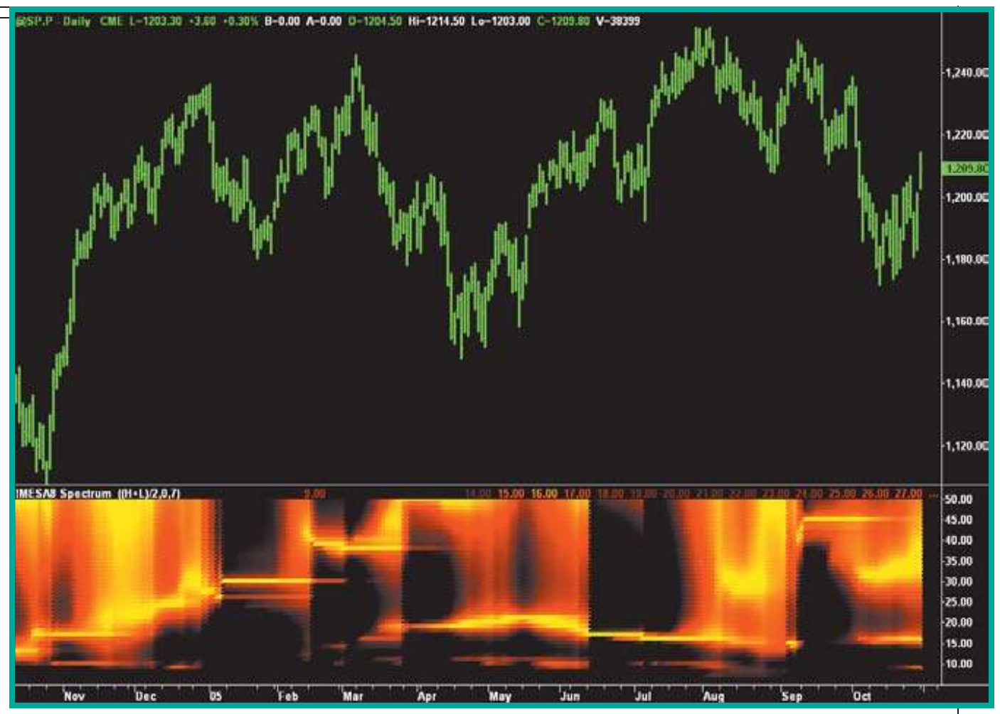
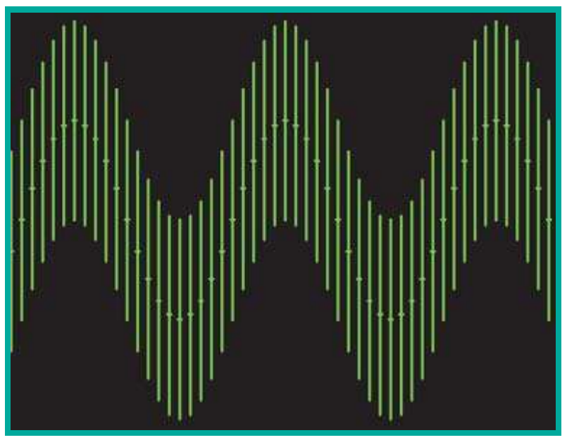
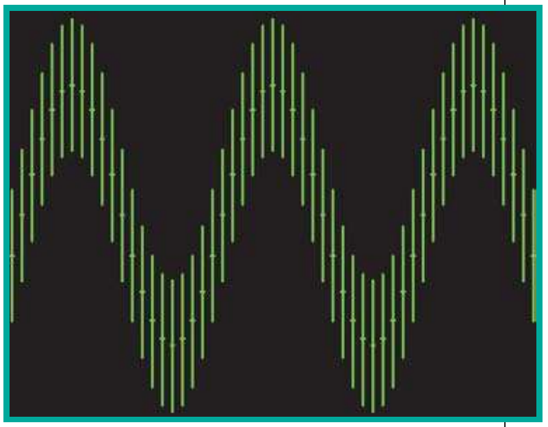
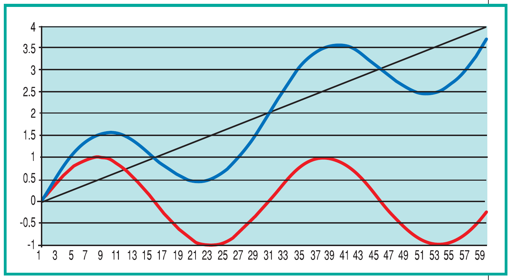
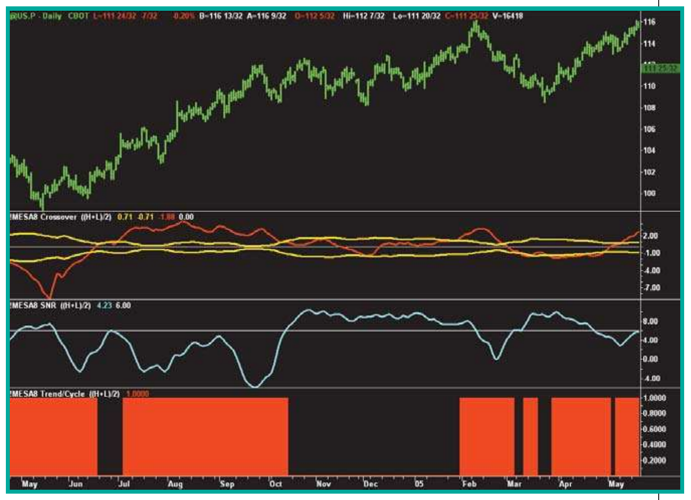

# When To Trade With Cycles

- **Author:** John F. Ehlers
- **Publication:** Technical Analysis of STOCKS & COMMODITIES, Volume 25, April 2007, pp. 32--34
- **Article URL:** [Article PDF](https://technical.traders.com/archive/article.asp?file=\V25\C04\070EHL.pdf)

---

*When should you trade the cycle mode in a market and when should you trade the trend mode? Find out with this indicator.*

## Introduction

In theory, trading with cycles is easy --- just buy at the valley and sell at the crest. This is just a variation of the old buy-low, sell-high dictum. In practice, however, trading with cycles is far more difficult. Just for openers, the very existence of market cycles is ephemeral and we must jump on them quickly to take advantage of any market inefficiency they represent. This is demonstrated by the MESA8 measurement of the historical spectra of the Standard & Poor's futures contract seen in Figure 1. The spectra are shown colorized over a 20-decibel range from white-hot, through red-hot, to ice-cold. Colorizing this way enables the display in a subgraph in synchronism with the bar chart. Figure 1 clearly shows how the dominant cycle in the data varies with time.


**FIGURE 1: MESA8-MEASURED SPECTRA.** On this chart of the S&P futures contract you can see that the dominant cycle in the data varies with time.

In addition, there are a number of other conditions that make trading with cycles more difficult besides temporal variability, perhaps to the point that the real question is, "When should I not trade with cycles?" The most significant among these conditions are signal to noise ratios, being swamped by the trend, and trend persistence.

## Signal To Noise Ratio

One of the purposes of measuring the market cycle is to determine market inefficiency because of a short-term coherence. If there is a coherence in prices, we can expect that coherence to continue, at least for a short while. We can identify this cycle component as the signal we are trying to exploit. On the other hand, the market is composed of a large number of traders with diverse objectives. If we are looking for a cycle period on the order of a month, the daily fluctuation in price is noise that can interfere with our signal. In this sense we can define the range of a given price bar from low to high as noise. If the noise amplitude is equal to the peak amplitude of the cycle, then we have the theoretical case displayed in Figure 2.

This is called 0 dB SNR, when the noise amplitude is equal to the signal peak amplitude (a decibel --- or dB --- is a logarithmic ratio of their respective powers). Murphy's law being what it is ("Whatever can go wrong, will"), we could have our cycle measured perfectly so that we entered the trade at the valley of the cycle and exited the trade at its crest and still have a breakeven profit. This occurs if we entered the long position (at the valley) at the high of the bar and exited the position at the crest, but at the low of that bar. As a result, 0 dB SNR defines a case where making a profit is unlikely because it is unlikely you will always know the cycle exactly.


**FIGURE 2: ZERO DECIBEL SNR.** In this case noise amplitude is equal to the signal peak amplitude.

A better-defining case for a minimum signal to noise ratio is 6 dB SNR, where the signal peak amplitude is twice the noise amplitude. The theoretical 6 dB SNR case can be seen in Figure 3.


**FIGURE 3: SIX-DECIBEL SNR.** Here the signal peak amplitude is twice the noise amplitude.

The profit we can realize in the noise-free case can be seen as the difference between the highest tick (at the center of the bar) and the lowest tick (at the center of that bar). The profit we can expect to realize due to noise in this case is exactly half the profit we would obtain in the noise-free case. This is a workable definition for the minimum signal to noise ratio that can be used when trading the cycle.

## Trend Swamping

It is possible a perfectly measured cycle will indicate that the correct trade at the moment is to go short. On the other hand, if the market is in a massive bull trend, it is easily possible the trend is so strong that it completely negates the advantage of the cyclic trade. A limiting case for trading cycles within a trend can be seen in Figure 4.

The theoretical cycle is shown as the red curve, and would have a profit of 2 if the trade were to sell short at the crest and exit at the valley. The theoretical trendline is shown as the straight black line and has a slope exactly equal to twice the peak amplitude of the cycle (or equal to the peak-to-peak amplitude, if you prefer).

Assuming a model where the cycle component and trend component are added together to form a composite waveform, the theoretical model price is shown as the blue line. Following an identical strategy of selling short at the crest and exiting at the valley, the profit is now about half the profit that was realized in the absence of the trend. The definition for trend swamping is when the trend slope across the period of the cycle exceeds twice the cycle amplitude that it is workable.


**FIGURE 4: TREND-LIMITING CASE FOR TRADING CYCLES.** From this chart you can conclude that when the trend slope across the period of the cycle exceeds twice the cycle amplitude, it is workable.

## Trend Persistence

As shown in Figure 4, we expect the cycle component of the market to crisscross the trend component about every half cycle. As a practical matter, there are times when the price stays on one side of the instantaneous trendline for an extended period. This usually happens when the cycle amplitude is relatively small. We find it helpful to avoid trading the cycles when the price has not crossed the instantaneous trendline within the last half cycle.

## Trading Mode Indicator

In MESA8 we measure the cycle period and show the cycle and instantaneous trend components. We also consolidate the conditions under which we should trade the cycle mode or the trend mode of the market. Figure 5 shows these components in a real-world example of the 30-year Treasury bond continuous contract for the year before June 2005.

The first subgraph below the price bars shows the trend slope as the red line, superimposed on the (plus and minus) amplitude of the cycle component shown in yellow. You would want to trade the cycle mode only when the red line is contained between the two yellow lines. The second subgraph shows the measured signal to noise as the cyan line relative to the white 6 dB threshold line. You would want to trade the cycle mode only when the signal to noise ratio exceeds 6 dB. The third subgraph clearly shows when to trade the trend mode (when the indicator is high) and when to trade the cycle mode (when the indicator is low).


**FIGURE 5: WHEN DO YOU WANT TO TRADE?** You want to trade only when the red line is contained between two yellow lines in the first subchart. In the second subchart, you want to trade when the signal to noise ratio exceeds 6dB. From the third subgraph you can see that when the indicator is high you trade the trend mode and when the indicator is low, you trade the cycle mode.

## Conclusions

It is not enough to know that cycles are present in market data in order to trade them effectively. In fact, success is not even guaranteed if you know all the characteristics of the cycle, such as its period and the current phase of the cycle. It is important to consider the amplitude of the cycle relative to the noise in the data and relative to the slope of the trend. If the relative cycle amplitude is not sufficient, it is better to use another trading technique or even to stand aside and not trade at all.

---

*John Ehlers is a pioneer in the use of cycles and DSP techniques in technical analysis. He is the author of the MESA8 program, and www.indicez.com and www.eminiz.com websites for trading.*

## Suggested Reading

- Ehlers, John F. [2007]. "Fourier Transform For Traders," *Technical Analysis of* STOCKS & COMMODITIES, Volume 25: January.
- ______ [2002]. "The Instantaneous Trendline," *Technical Analysis of* STOCKS & COMMODITIES, Volume 20: February.
- www.indicez.com
- www.eminiz.com

---

```bibtex
@article{ehlers2007when,
  author  = {Ehlers, John F.},
  title   = {When To Trade With Cycles},
  journal = {Technical Analysis of Stocks \& Commodities},
  volume  = {25},
  number  = {4},
  pages   = {32--34},
  year    = {2007},
  month   = apr,
}
```
