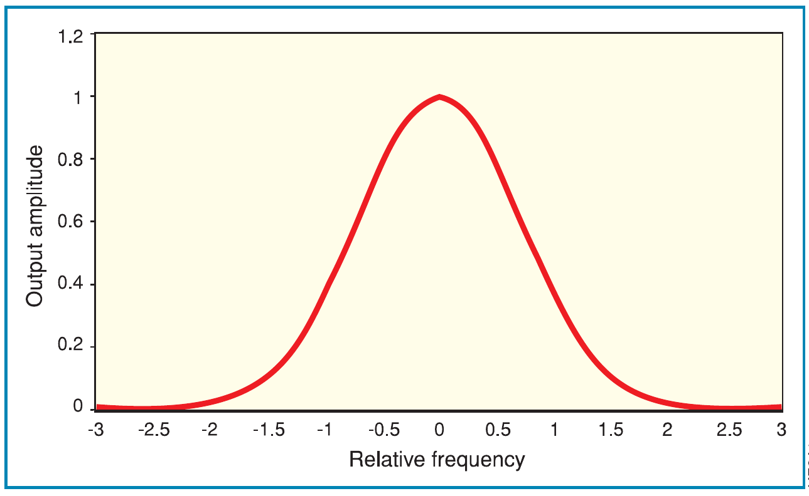
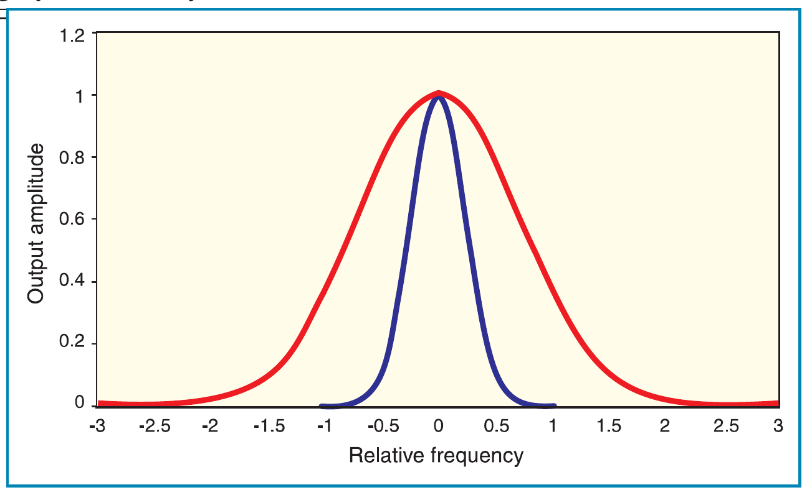
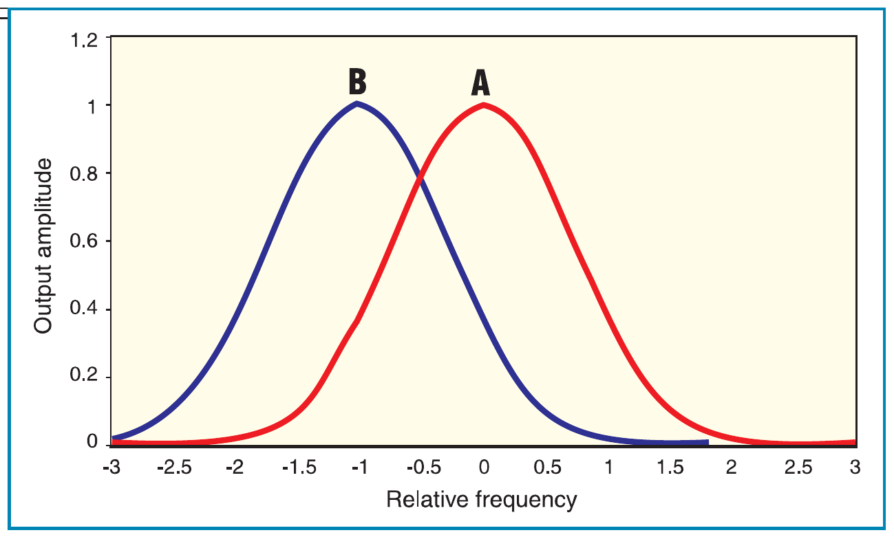
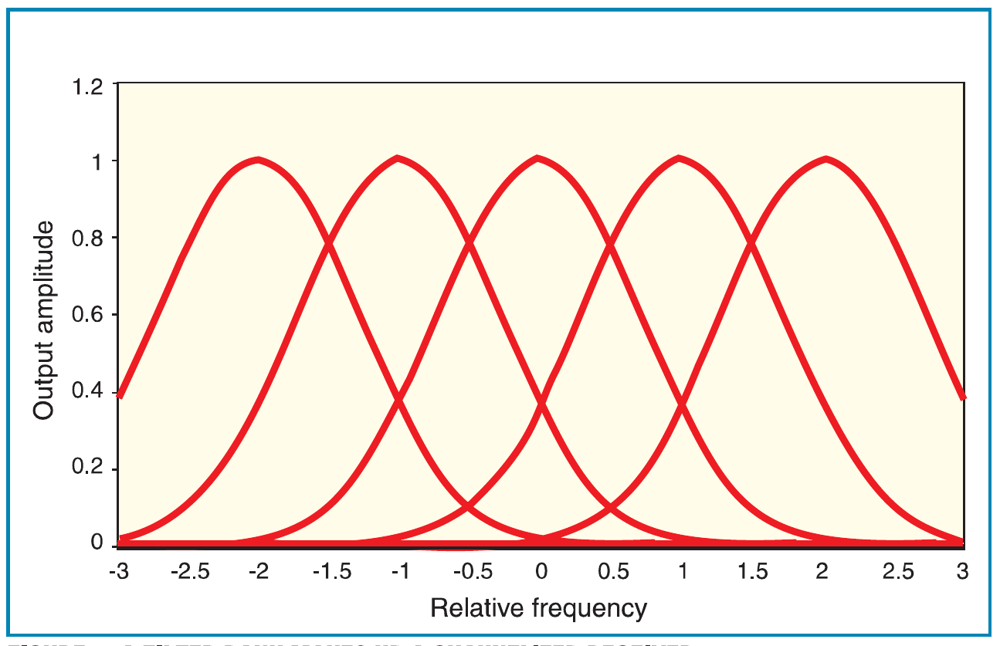
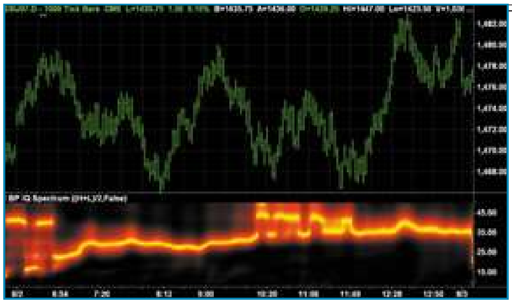
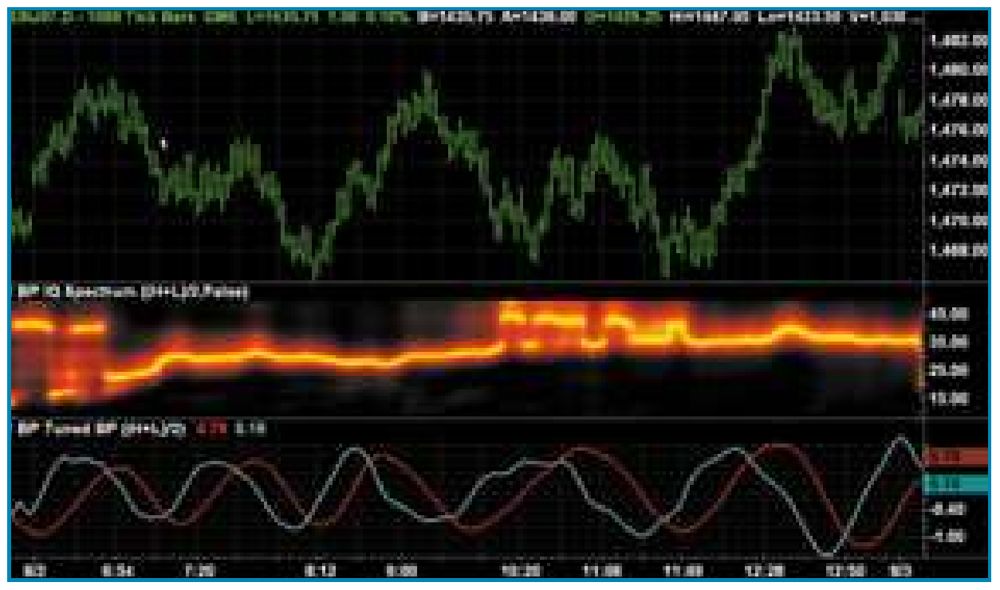

# Measuring Cycle Periods

- **Author:** John F. Ehlers
- **Publication:** Technical Analysis of STOCKS & COMMODITIES, Volume 26, March 2008, pp. 16--22
- **Article URL:** [Article PDF](https://technical.traders.com/archive/article.asp?file=\V26\C03\043EHLR.pdf)
- **Traders' Tips URL:** [Traders' Tips, March 2008](http://traders.com/Documentation/FEEDbk_docs/2008/03/TradersTips/TradersTips.html)

---

*Measuring cycle periods allows you to adjust your indicators so they adapt to current market conditions. Here's how.*

## Introduction

If you want to make your indicators and strategies adaptive to current market conditions, you must first measure the cycle periods that are present in the data. Given that you know the dominant cycle, you can then use that information to dynamically adjust your computations. For example, you can set the observation period of the relative strength index (RSI) to be half the dominant cycle. I have previously described a practical way to use direct Fourier transform (DFT) to estimate the market spectrum. But a DFT is not the only way to estimate the market spectrum.

## Using Bandpass Filters

In this article I describe a way to use bandpass filters to make the spectral estimate. Bandpass filters are advantageous in that the selectivity and the filter transient response can be controlled. This is important because not all filters are good for trading, since filters induce lag in the output and therefore cause a delay in your making trading decisions. In general, the more complicated a filter, the more lag is induced. The simple two-pole bandpass filter is nice because it provides no lag at the output for a steady state input signal at the frequency to which the bandpass filter is tuned.

First, let's understand some basics about bandpass filters. The response of the filter can be seen in Figure 1. This means that when equal amplitude signals at all relative frequencies are applied to the input of the filter, the filter rejects frequency components that are both higher and lower than the filter's tuned frequency. The frequency components at the output of the filter have their amplitudes shaped by the filter. The region within relative frequencies -0.5 to +0.5 is the passband of the bandpass filter because most of the energy getting through the filter falls in this range.

From a trading perspective, the rejection of the lower and higher frequency components has two effects. First, the lower frequencies (longer wavelengths) contain the trend information in the input waveform, so rejecting them detrends the data. Second, the higher frequencies contain rapid variations as a function of time, so rejecting them performs a smoothing operation on the data. What could be better than a filter that has no lag, detrends the data, and also smoothes it? The big *if* in this situation is that all this is true only *if* the filter is tuned to the steady state dominant cycle in the data. Because the bandpass filter has frequency selectivity, we can make use of this fact to determine the dominant cycle in the data. I will describe how to do that later.


**FIGURE 1: BANDPASS FILTER RESPONSE TO NORMALIZED FREQUENCIES.** Here you see the response of the filter. Note that most of the energy getting through the filter falls within relative frequencies of the -0.5 to +0.5 range.

## Adjusting The Passband

The bandpass filter can have an adjustable passband. Figure 2 shows the original filter having a passband of relative frequencies from -0.5 to +0.5 in red as well as a filter having a much greater selectivity in blue — that is, the passband is narrower. In principle, we can make the passband of a bandpass filter arbitrarily narrow, but we don't want to do this in trading because narrowing the passband has a negative influence on the transient response of the filter.

For example, a bell is designed to be a highly selective bandpass filter. When the clapper strikes the bell, the bell continues to ring out at its tuned frequency. Thus, we hear the response to the event, but the event itself is lost. Further, the ringing continues long after the initial event has come and gone.

Any highly selective filter has this ringing phenomenon, and this ringing is not helpful in the interpretation of market action. Yes, we wish to extract the dominant cycle information from the data, but we also hope that any transitory filter response to a sudden change dies down quickly. The only way for this to happen is to widen the passband of the bandpass filter.

Dealing with responses in most trading data is not a big problem because the dominant cycles tend to drift with time rather than jumping from one cycle period to another. On the other hand, if you are using intraday data you must be wary of gap openings because these represent severe responses that can distort a filter-based analysis.

Basically, we want to take advantage of the selectivity of the bandpass filter to discern the dominant cycle in the data. After finding that cycle, we can dynamically tune any of a host of indicators.


**FIGURE 2: ORIGINAL AND NARROW PASSBAND BANDPASS FILTERS.** Here you see the original filter in red and another one with greater selectivity (blue). Keep in mind that narrowing the passband of a bandpass filter is not helpful in interpreting market action.

Figure 3 shows the basic concept of how we do this. If the input signal falls within the passband of filter A, then the output of filter A will have a larger amplitude than the output of filter B. Conversely, if the input signal falls within the passband of filter B, then the output of filter B will have a larger amplitude than the output of filter A. So all we have to do to measure the spectrum of the input signal is to establish a contiguous bank of overlapping filters as shown in Figure 4 and measure the amplitude of the signal at the output of each filter.


**FIGURE 3: BANDPASS FILTERS ENABLE SIGNAL SELECTION.** If the input signal falls within the passband of filter A, then the output of filter A will have a larger amplitude than the output of filter B. Conversely, if the input signal falls within the passband of filter B, then the output of filter B will have a larger amplitude than the output of filter A.


**FIGURE 4: A FILTER BANK MAKES UP A CHANNELIZED RECEIVER.** To measure the spectrum of the input signal you have to establish a contiguous bank of overlapping filters and measure the amplitude of the signal at the output of each filter.

## Measuring The Amplitude

Since the passband of each filter is relatively narrow, the signal at each output can be characterized as a sine wave with a slowly varying phase. You may recall from calculus that

$$\frac{d(\sin(\omega t))}{dt} = \omega \cos(\omega t)$$

Therefore, multiplying the rate of change of the output of each filter by Period/2π results in a cosine wave being created at the output of each filter also. Both the sine wave and cosine wave have the generalized amplitude A. Further, from the familiar trigonometric identity

$$A^2 = A^2 \sin^2(x) + A^2 \cos^2(x)$$

we have a measure of the amplitude of the signal at the output of each filter by squaring and adding the sine wave and cosine wave together. That is basically all there is to generating the spectrum of the market data.

## Code Details

Some of the details are easier to explain with reference to the EasyLanguage code in the first sidebar. When translating the code to other languages, several features should be noted. First, the entire code is completed for each bar and the value of the variables are retained from bar to bar. However, the values of arrays are not automatically indexed to each price bar. Second, EasyLanguage uses degrees rather than radians as arguments of its trigonometric functions. Finally, the notation Price[1] — that is, with the square brackets — means the value of price one bar ago with respect to variables. The square bracket notation also gives the position within an array.

There are only two inputs to the indicator. One is price, and it is my habit to use the average of the high and low of each bar. Using closing prices is fine. The other input is the decision whether to show the display of the dominant cycle (ShowDC). As usual, variables and arrays are defined and initialized. The first calculation is a 40-bar high-pass filter used to detrend the data. The detrended data is then smoothed in a low-lag six-tap finite impulse response (FIR) filter.

Delta is the half-bandwidth of each bandpass filter relative to its center frequency. For example, if delta = 0.15, then a filter centered at a 20-bar cycle period would have its passband extend from a 17-bar cycle to a 23-bar cycle. Delta starts at a value of 0.5 to minimize a start-up transient. Delta gradually reduces to reach a value of 0.15 after about 50 bars at the beginning.

The next section of code actually computes the bandpass filters in channel centers from eight bars to 50 bars in one-bar increments. I have taken the approach of using the smoothed and detrended data as the I[N] variable (notation for the inphase component) and the rate of change data as the Q[N] variable (notation for the quadrature component) before applying the bandpass filter. Both components are filtered in identical channelized bandpass filters so they have identical lag and phase shifts. The two components are squared and summed to compute the instantaneous amplitude of the signal at the output of each filter channel.

Next, the code finds the largest amplitude signal for normalization purposes. The normalized amplitude is then converted to decibels simultaneously with application of the nonlinear transform to sharpen the display. The nonlinear transformation was described in my article on the practical application of DFTs for trading in the January 2006 issue of STOCKS & COMMODITIES. The dominant cycle is then computed as the center of gravity from those channels whose amplitude is larger than -3 dB relative to the largest amplitude channel. Using the center of gravity results in a smoother result than just selecting the highest amplitude channel.

The channel amplitudes are then converted to a color value. If the amplitude falls between zero and 10 dB, the color transitions from yellow to red and, if the amplitude falls between 10 and 20 dB, the color transitions from red to black. Finally, each channel output is plotted as a colorized line, where vertical position in its subgraph corresponds to the amplitude of the signal at the output of that channel. This way, the measured spectrum can be plotted in synchronism with the bar chart (Figure 5).

## EasyLanguage Code To Display The Spectrum Derived From A Filter Bank

```easylanguage
Inputs:
    Price((H+L)/2),
    ShowDC(False);

Vars:
    alpha1(0),
    delta(0.1),
    beta(0),
    gamma(0),
    alpha(0),
    N(0),
    Num(0),
    Denom(0),
    DC(0),
    DomCyc(0),
    Period(0),
    MaxAmpl(0),
    Color1(0),
    Color2(0),
    HP(0),
    SmoothHP(0);

Arrays:
    I[50](0),
    OldI[50](0),
    OlderI[50](0),
    Q[50](0),
    OldQ[50](0),
    OlderQ[50](0),
    Real[50](0),
    OldReal[50](0),
    OlderReal[50](0),
    Imag[50](0),
    OldImag[50](0),
    OlderImag[50](0),
    Ampl[50](0),
    OldAmpl[50](0),
    DB[50](0);

alpha1 = (1 - Sine(360 / 40)) / Cosine(360 / 40);
HP = .5*(1 + alpha1)*(Price - Price[1]) + alpha1*HP[1];
SmoothHP = (HP + 2*HP[1] + 3*HP[2] + 3*HP[3] + 2*HP[4] +
    HP[5]) / 12;

IF CurrentBar < 7 Then SmoothHP = Price - Price[1];
IF CurrentBar = 1 THEN SmoothHP = 0;

delta = -.015*CurrentBar + .5;
If delta < .15 then delta = .15;

If CurrentBar > 6 Then Begin
    For N = 8 to 50 Begin
        beta = Cosine(360 / N);
        gamma = 1 / Cosine(720*delta / N);
        alpha = gamma - SquareRoot(gamma*gamma - 1);

        Q[N] = (N / 6.283185)*(SmoothHP - SmoothHP[1]);
        I[N] = SmoothHP;
        Real[N] = .5*(1 - alpha)*(I[N] - OlderI[N]) + beta*(1
            + alpha)*OldReal[N] - alpha*OlderReal[N];
        Imag[N] = .5*(1 - alpha)*(Q[N] - OlderQ[N]) +
            beta*(1 + alpha)*OldImag[N] - alpha*OlderImag[N];
        Ampl[N] = (Real[N]*Real[N] + Imag[N]*Imag[N]);
    End;
End;

For N = 8 to 50 Begin
    OlderI[N] = OldI[N];
    OldI[N] = I[N];
    OlderQ[N] = OldQ[N];
    OldQ[N] = Q[N];
    OlderReal[N] = OldReal[N];
    OldReal[N] = Real[N];
    OlderImag[N] = OldImag[N];
    OldImag[N] = Imag[N];
    OldAmpl[N] = Ampl[N];
End;

MaxAmpl = Ampl[10];
For N = 8 to 50 Begin
    If Ampl[N] > MaxAmpl then MaxAmpl = Ampl[N];
End;

For N = 8 to 50 Begin
    IF MaxAmpl <> 0 AND (Ampl[N] / MaxAmpl) > 0 THEN DB[N] =
        -10*Log(.01 / (1 - .99*Ampl[N] / MaxAmpl)) / Log(10);
    If DB[N] > 20 then DB[N] = 20;
End;

Num = 0;
Denom = 0;
For N = 8 to 50 Begin
    If DB[N] <= 3 Then Begin
        Num = Num + N*(20 - DB[N]);
        Denom = Denom + (20 - DB[N]);
    End;
    If Denom <> 0 Then DC = Num / Denom;
End;
DomCyc = Median(DC, 10);

If ShowDC = True Then Plot1(DomCyc, "DC", RGB(0, 0, 255), 0, 2);

For N = 8 to 50 Begin
    IF DB[N] <= 10 THEN Begin
        Color1 = 255;
        Color2 = 255*(1 - DB[N] / 10);
    END;
    IF DB[N] > 10 THEN Begin
        Color1 = 255*(2 - DB[N] / 10);
        Color2 = 0;
    END;
    If N = 8 Then Plot8(N, "S8", RGB(Color1, Color2, 0), 0, 5);
    If N = 9 Then Plot9(N, "S9", RGB(Color1, Color2, 0), 0, 5);
    If N = 10 Then Plot10(N, "S10", RGB(Color1, Color2, 0), 0, 5);
    If N = 11 Then Plot11(N, "S11", RGB(Color1, Color2, 0), 0, 5);
    If N = 12 Then Plot12(N, "S12", RGB(Color1, Color2, 0), 0, 5);
    If N = 13 Then Plot13(N, "S13", RGB(Color1, Color2, 0), 0, 5);
    If N = 14 Then Plot14(N, "S14", RGB(Color1, Color2, 0), 0, 5);
    If N = 15 Then Plot15(N, "S15", RGB(Color1, Color2, 0), 0, 5);
    If N = 16 Then Plot16(N, "S16", RGB(Color1, Color2, 0), 0, 5);
    If N = 17 Then Plot17(N, "S17", RGB(Color1, Color2, 0), 0, 5);
    If N = 18 Then Plot18(N, "S18", RGB(Color1, Color2, 0), 0, 5);
    If N = 19 Then Plot19(N, "S19", RGB(Color1, Color2, 0), 0, 5);
    If N = 20 Then Plot20(N, "S20", RGB(Color1, Color2, 0), 0, 5);
    If N = 21 Then Plot21(N, "S21", RGB(Color1, Color2, 0), 0, 5);
    If N = 22 Then Plot22(N, "S22", RGB(Color1, Color2, 0), 0, 5);
    If N = 23 Then Plot23(N, "S23", RGB(Color1, Color2, 0), 0, 5);
    If N = 24 Then Plot24(N, "S24", RGB(Color1, Color2, 0), 0, 5);
    If N = 25 Then Plot25(N, "S25", RGB(Color1, Color2, 0), 0, 5);
    If N = 26 Then Plot26(N, "S26", RGB(Color1, Color2, 0), 0, 5);
    If N = 27 Then Plot27(N, "S27", RGB(Color1, Color2, 0), 0, 5);
    If N = 28 Then Plot28(N, "S28", RGB(Color1, Color2, 0), 0, 5);
    If N = 29 Then Plot29(N, "S29", RGB(Color1, Color2, 0), 0, 5);
    If N = 30 Then Plot30(N, "S30", RGB(Color1, Color2, 0), 0, 5);
    If N = 31 Then Plot31(N, "S31", RGB(Color1, Color2, 0), 0, 5);
    If N = 32 Then Plot32(N, "S32", RGB(Color1, Color2, 0), 0, 5);
    If N = 33 Then Plot33(N, "S33", RGB(Color1, Color2, 0), 0, 5);
    If N = 34 Then Plot34(N, "S34", RGB(Color1, Color2, 0), 0, 5);
    If N = 35 Then Plot35(N, "S35", RGB(Color1, Color2, 0), 0, 5);
    If N = 36 Then Plot36(N, "S36", RGB(Color1, Color2, 0), 0, 5);
    If N = 37 Then Plot37(N, "S37", RGB(Color1, Color2, 0), 0, 5);
    If N = 38 Then Plot38(N, "S38", RGB(Color1, Color2, 0), 0, 5);
    If N = 39 Then Plot39(N, "S39", RGB(Color1, Color2, 0), 0, 5);
    If N = 40 Then Plot40(N, "S40", RGB(Color1, Color2, 0), 0, 5);
    If N = 41 Then Plot41(N, "S41", RGB(Color1, Color2, 0), 0, 5);
    If N = 42 Then Plot42(N, "S42", RGB(Color1, Color2, 0), 0, 5);
    If N = 43 Then Plot43(N, "S43", RGB(Color1, Color2, 0), 0, 5);
    If N = 44 Then Plot44(N, "S44", RGB(Color1, Color2, 0), 0, 5);
    If N = 45 Then Plot45(N, "S45", RGB(Color1, Color2, 0), 0, 5);
    If N = 46 Then Plot46(N, "S46", RGB(Color1, Color2, 0), 0, 5);
    If N = 47 Then Plot47(N, "S47", RGB(Color1, Color2, 0), 0, 5);
    If N = 48 Then Plot48(N, "S48", RGB(Color1, Color2, 0), 0, 5);
    If N = 49 Then Plot49(N, "S49", RGB(Color1, Color2, 0), 0, 5);
    If N = 50 Then Plot50(N, "S50", RGB(Color1, Color2, 0), 0, 5);
End;
```

## Applying It

I chose an interesting example display as a 1,000-tick chart for the day session of the S&P emini futures contract on August 2, 2007. This chart is of passing interest because an equitick chart has a nonlinear horizontal time axis because each bar contains exactly 1,000 ticks. This way, the chart is kind of a money flow, or at least activity flow, indicator itself. The chart shows a relatively consistent cycle period between 30 and 35 bars, with a little jitter in the late morning.


**FIGURE 5: CHANNELIZED RECEIVER SPECTRUM DISPLAY.** Each channel output is plotted as a colorized line, where the vertical position in its subgraph corresponds to the amplitude of the signal at the output of that channel.

Perhaps the bigger question is "So how is this information useful?" In the sidebar "EasyLanguage code for a dominant cycle tuned bypass filter," I show the code where the measured dominant cycle is used to tune a bandpass filter. The code is exactly the same as that to compute the spectrum, except the measured dominant cycle is then used to tune a bandpass filter. The sine and cosine outputs of this filter are plotted so that the crossovers can be used as buy and sell signals.

Since both the inphase and quadrature components are available, additional tweaking is easily done to modify the phase of the plotted indicator. Figure 6 shows the response of the dominant cycle-tuned bandpass filter for the same equitick chart. The sine component is plotted in red and the cosine component is plotted in cyan. The sine component is clearly a smoothed replica of the price bars and the cosine component is a leading function — sometimes leading a little too much — of the sine component.


**FIGURE 6: DOMINANT CYCLE-TUNED BANDPASS FILTER RESPONSE.** The sine component is plotted in red and the cosine component is plotted in cyan. The sine component is clearly a smoothed replica of the price bars and the cosine component is a leading function of the sine component.

## EasyLanguage Code For A Dominant Cycle Tuned Bypass Filter

```easylanguage
Inputs:
    Price((H+L)/2);

Vars:
    delta(0.1),
    gamma(0),
    alpha(0),
    beta(0),
    N(0),
    Period(0),
    MaxAmpl(0),
    Num(0),
    Denom(0),
    DC(0),
    DomCyc(0),
    Color1(0),
    Color2(0),
    alpha1(0),
    HP(0),
    SmoothHP(0);

Arrays:
    I[50](0),
    OldI[50](0),
    OlderI[50](0),
    Q[50](0),
    OldQ[50](0),
    OlderQ[50](0),
    Real[50](0),
    OldReal[50](0),
    OlderReal[50](0),
    Imag[50](0),
    OldImag[50](0),
    OlderImag[50](0),
    Ampl[50](0),
    OldAmpl[50](0),
    DB[50](0);

alpha1 = (1 - Sine(360 / 40)) / Cosine(360 / 40);
HP = .5*(1 + alpha1)*(Price - Price[1]) + alpha1*HP[1];
SmoothHP = (HP + 2*HP[1] + 3*HP[2] + 3*HP[3] + 2*HP[4] +
    HP[5]) / 12;

IF CurrentBar < 7 Then SmoothHP = Price - Price[1];
IF CurrentBar = 1 THEN SmoothHP = 0;

delta = -.015*CurrentBar + .5;
If delta < .15 then delta = .15;

If CurrentBar > 6 Then Begin
    For N = 8 to 50 Begin
        beta = Cosine(360 / N);
        gamma = 1 / Cosine(720*delta / N);
        alpha = gamma - SquareRoot(gamma*gamma - 1);

        Q[N] = (N / 6.283185)*(SmoothHP - SmoothHP[1]);
        I[N] = SmoothHP;
        Real[N] = .5*(1 - alpha)*(I[N] - OlderI[N]) + beta*(1 +
            alpha)*OldReal[N] - alpha*OlderReal[N];
        Imag[N] = .5*(1 - alpha)*(Q[N] - OlderQ[N]) + beta*(1
            + alpha)*OldImag[N] - alpha*OlderImag[N];
        Ampl[N] = (Real[N]*Real[N] + Imag[N]*Imag[N]);
    End;
End;

For N = 8 to 50 Begin
    OlderI[N] = OldI[N];
    OldI[N] = I[N];
    OlderQ[N] = OldQ[N];
    OldQ[N] = Q[N];
    OlderReal[N] = OldReal[N];
    OldReal[N] = Real[N];
    OlderImag[N] = OldImag[N];
    OldImag[N] = Imag[N];
    OldAmpl[N] = Ampl[N];
End;

MaxAmpl = Ampl[10];
For N = 8 to 50 Begin
    If Ampl[N] > MaxAmpl then MaxAmpl = Ampl[N];
End;

For N = 8 to 50 Begin
    IF MaxAmpl <> 0 AND (Ampl[N] / MaxAmpl) > 0 THEN DB[N]
        = -10*Log(.01 / (1 - .99*Ampl[N] / MaxAmpl)) / Log(10);
    If DB[N] > 20 then DB[N] = 20;
End;

Num = 0;
Denom = 0;
For N = 10 to 50 Begin
    If DB[N] <= 3 Then Begin
        Num = Num + N*(20 - DB[N]);
        Denom = Denom + (20 - DB[N]);
    End;
    If Denom <> 0 Then DC = Num / Denom;
End;
DomCyc = Median(DC, 10);
If DomCyc < 8 Then DomCyc = 20;

beta = Cosine(360 / DomCyc);
gamma = 1 / Cosine(720*delta / DomCyc);
alpha = gamma - SquareRoot(gamma*gamma - 1);

Value1 = .5*(1 - alpha)*(SmoothHP - SmoothHP[1]) + beta*(1
    + alpha)*Value1[1] - alpha*Value1[2];
Value2 = (DomCyc / 6.28)*(Value1 - Value1[1]);

Plot1(Value1, "Sine", Red, default, 2);
Plot2(Value2, "Cosine", Cyan, default, 2);
```

## More Than One Way

There's more than one way to skin a cat — more than one way to measure the spectrum and establish the dominant cycle in market data. Knowing the dominant cycle is crucial to the creation of adaptive indicators, and adaptive indicators can have a significant contribution to your bottom-line trading performance because that way you can anticipate and implement trades at the cyclic turning points.

## About The Author

*John Ehlers is a pioneer in the use of cycles and DSP techniques in technical analysis. He is the author of the MESA8 program, and www.eminiz.com and www.indicez.com websites for trading.*

## Suggested Reading

Ehlers, John [2007]. "Fourier Transform For Traders," *Technical Analysis of STOCKS & COMMODITIES*, Volume 25: January.

Ehlers, John [2006]. "Swiss Army Knife Indicator," *Technical Analysis of STOCKS & COMMODITIES*, Volume 24: January.

---

‡EasyLanguage (TradeStation)
‡MESA Software

*See our Traders' Tips section beginning on page 70 for program code implementing John Ehlers' technique.*

---

## BibTeX

```bibtex
@article{ehlers_2008_measuring_cycle_periods,
  author    = {Ehlers, John F.},
  title     = {Measuring Cycle Periods},
  journal   = {Technical Analysis of STOCKS \& COMMODITIES},
  volume    = {26},
  number    = {3},
  pages     = {16--22},
  year      = {2008},
  month     = mar,
  url       = {https://technical.traders.com/archive/article.asp?file=\V26\C03\043EHLR.pdf}
}

@misc{traders_tips_2008_03,
  author       = {{Technical Analysis of STOCKS \& COMMODITIES}},
  title        = {Traders' Tips: Measuring Cycle Periods},
  howpublished = {online},
  year         = {2008},
  month        = mar,
  url          = {http://traders.com/Documentation/FEEDbk_docs/2008/03/TradersTips/TradersTips.html}
}
```
