# Traders' Tips: March 2008

- **Article:** Measuring Cycle Periods by John Ehlers
- **Traders' Tips URL:** [Traders' Tips, March 2008](http://traders.com/Documentation/FEEDbk_docs/2008/03/TradersTips/TradersTips.html)

---

## TradeStation

John Ehlers' article in this issue, "Measuring Cycle Periods," describes the use of bandpass filters to estimate the length, in bars, of the currently dominant price cycle. In the article, Ehlers presents two indicators and also proposes a trading strategy.

Here, we'll provide EasyLanguage code for the indicators EhlersSpectrum and EhlersDominantCycle. The strategy is called "EhlersBandPassStrat." A sample chart implementing the indicators is shown in Figure 1.

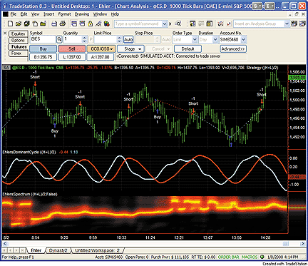

**FIGURE 1: TRADESTATION, EHLERS' SPECTRUM INDICATOR AND DOMINANT CYCLE INDICATOR. Here are Ehlers' indicators applied to a 1,000-tick chart of the continuous S&P 500 emini futures contract (day session).**

To download the EasyLanguage code for this study, go to the Support Center at TradeStation.com. Search for the file "Ehlers Cycle Measurement.eld."

TradeStation does not endorse or recommend any particular strategy.

```easylanguage
Indicator:  EhlersSpectrum
inputs:
    Price( MedianPrice ),
    ShowDC( false ) ;
variables:
    alpha1( 0 ),
    alpha1Plus1( 0 ),
    Log10( 0 ),
    HP( 0 ),
    SmoothHP( 0 ),
    EhlersDelta( 0.1 ),
    EhlersBeta( 0 ),
    Cos720Delta( 0 ),
    EhlersGamma( 0 ),
    alpha( 0 ),
    OneMinusAlpha( 0 ),
    OnePlusAlpha( 0 ),
    N( 0 ),
    TwoPi( 6.2831854 ),
    MaxAmpl( 0 ),
    Num( 0 ),
    Denom( 0 ),
    DC( 0 ),
    DomCyc( 0 ),
    Cos720DeltaDom( 0 ),
    CycleLine1( 0 ),
    CycleLine2( 0 ),
    Color1( 0 ),
    Color2( 0 ),
    PlotColor( 0 ) ;
arrays:
    EhlersI[50]( 0 ),
    OldI[50]( 0 ),
    OlderI[50]( 0 ),
    Q[50]( 0 ),
    OldQ[50]( 0 ),
    OlderQ[50]( 0 ),
    Real[50]( 0 ),
    OldReal[50]( 0 ),
    OlderReal[50]( 0 ),
    Imag[50]( 0 ),
    OldImag[50]( 0 ),
    OlderImag[50]( 0 ),
    Ampl[50]( 0 ),
    OldAmpl[50]( 0 ),
    DB[50]( 0 ) ;
if CurrentBar = 1 then
    begin
     { 360 / 40 = 9 }
    alpha1 = ( 1 - Sine( 9 ) ) / Cosine( 9 ) ;
    alpha1Plus1 = alpha1 + 1 ;
    Log10 = Log( 10 ) ;
    end ;
HP = 0.5 * alpha1Plus1 * ( Price - Price[1] ) +
 alpha1 * HP[1] ;
SmoothHP = ( HP + 2 * HP[1] + 3 * HP[2] + 3 * HP[3] +
 2 * HP[4] + HP[5] ) / 12 ;
if CurrentBar = 1 then
    SmoothHP = 0
else if CurrentBar  6 then
    begin
    for N = 8 to 50
        begin
        EhlersBeta = Cosine( 360 / N ) ;
        Cos720Delta = Cosine( 720 * EhlersDelta / N ) ;
        if Cos720Delta <> 0 then
            EhlersGamma = 1 / Cos720Delta ;
        alpha = EhlersGamma -
         SquareRoot( Square( EhlersGamma ) - 1 ) ;
        OneMinusAlpha = 1 - alpha ;
        OnePlusAlpha = 1 + alpha ;
        Q[N] = ( N / TwoPi ) * ( SmoothHP -
         SmoothHP[1] ) ;
        EhlersI[N] = SmoothHP ;
        Real[N] = 0.5 * OneMinusAlpha * ( EhlersI[N] -
         OlderI[N] ) + EhlersBeta * OnePlusAlpha *
         OldReal[N] - alpha * OlderReal[N] ;
        Imag[N] = 0.5 * OneMinusAlpha * ( Q[N] -
         OlderQ[N] ) + EhlersBeta * OnePlusAlpha *
         OldImag[N] - alpha * OlderImag[N] ;
        Ampl[N] = ( Square( Real[N] ) +
         Square( Imag[N] ) ) ;
        end ;
    end ;
for N = 8 to 50
    begin
    OlderI[N] = OldI[N] ;
    OldI[N] = EhlersI[N] ;
    OlderQ[N] = OldQ[N] ;
    OldQ[N] = Q[N] ;
    OlderReal[N] = OldReal[N] ;
    OldReal[N] = Real[N] ;
    OlderImag[N] = OldImag[N] ;
    OldImag[N] = Imag[N] ;
    OldAmpl[N] = Ampl[N] ;
    end ;
MaxAmpl = Ampl[10] ;
for N = 8 to 50
    begin
    if Ampl[N] > MaxAmpl then
        MaxAmpl = Ampl[N] ;
    end ;
for N = 8 to 50
    begin
    if MaxAmpl <> 0 and ( Ampl[N] / MaxAmpl ) > 0 then
        DB[N] = -10 * Log( 0.01 / ( 1 - .99 * Ampl[N] /
         MaxAmpl ) ) / Log10 ;
    if DB[N] > 20 then
        DB[N] = 20 ;
    end ;
Num = 0 ;
Denom = 0 ;
for N = 10 to 50
    begin
    if DB[N]  0 then
        DC = Num / Denom ;
    end ;
DomCyc = Median( DC, 10 ) ;
if ShowDC = true then
    Plot1( DomCyc, "DC", RGB( 0, 0, 255 ), 0, 2 ) ;
for N = 8 to 50
    begin
    if DB[N]  10 then
        begin
        Color1 = 255 * ( 2 - DB[N] / 10 ) ;
        Color2 = 0 ;
        end ;
    PlotColor = RGB( Color1, Color2, 0 ) ;
    if CurrentBar > 10 then
        begin
        switch N
            begin
            case 8:
                Plot8( N, "S8", PlotColor, 0, 5 ) ;
            case 9:
                Plot9( N, "S9", PlotColor, 0, 5 ) ;
            case 10:
                Plot10( N, "S10", PlotColor, 0, 5 ) ;
            case 11:
                Plot11( N, "S11", PlotColor, 0, 5 ) ;
            case 12:
                Plot12( N, "S12", PlotColor, 0, 5 ) ;
            case 13:
                Plot13( N, "S13", PlotColor, 0, 5 ) ;
            case 14:
                 Plot14( N, "S14", PlotColor, 0, 5 ) ;
            case 15:
                Plot15( N, "S15", PlotColor, 0, 5 ) ;
            case 16:
                Plot16( N, "S16", PlotColor, 0, 5 ) ;
            case 17:
                 Plot17( N, "S17", PlotColor, 0, 5 ) ;
            case 18:
                Plot18( N, "S18", PlotColor, 0, 5 ) ;
            case 19:
                Plot19( N, "S19", PlotColor, 0, 5 ) ;
            case 20:
                Plot20( N, "S20", PlotColor, 0, 5 ) ;
            case 21:
                 Plot21( N, "S21", PlotColor, 0, 5 ) ;
            case 22:
                Plot22( N, "S22", PlotColor, 0, 5 ) ;
            case 23:
                 Plot23( N, "S23", PlotColor, 0, 5 ) ;
            case 24:
                Plot24( N, "S24", PlotColor, 0, 5 ) ;
            case 25:
                Plot25( N, "S25", PlotColor, 0, 5 ) ;
            case 26:
                 Plot26( N, "S26", PlotColor, 0, 5 ) ;
            case 27:
                 Plot27( N, "S27", PlotColor, 0, 5 ) ;
            case 28:
                 Plot28( N, "S28", PlotColor, 0, 5 ) ;
            case 29:
                 Plot29( N, "S29", PlotColor, 0, 5 ) ;
            case 30:
                 Plot30( N, "S30", PlotColor, 0, 5 ) ;
            case 31:
                 Plot31( N, "S31", PlotColor, 0, 5 ) ;
            case 32:
                 Plot32( N, "S32", PlotColor, 0, 5 ) ;
            case 33:
                 Plot33( N, "S33", PlotColor, 0, 5 ) ;
            case 34:
                 Plot34( N, "S34", PlotColor, 0, 5 ) ;
            case 35:
                 Plot35( N, "S35", PlotColor, 0, 5 ) ;
            case 36:
                 Plot36( N, "S36", PlotColor, 0, 5 ) ;
            case 37:
                 Plot37( N, "S37", PlotColor, 0, 5 ) ;
            case 38:
                 Plot38( N, "S38", PlotColor, 0, 5 ) ;
            case 39:
                 Plot39( N, "S39", PlotColor, 0, 5 ) ;
            case 40:
                 Plot40( N, "S40", PlotColor, 0, 5 ) ;
            case 41:
                 Plot41( N, "S41", PlotColor, 0, 5 ) ;
            case 42:
                 Plot42( N, "S42", PlotColor, 0, 5 ) ;
            case 43:
                Plot43( N, "S43", PlotColor, 0, 5 ) ;
            case 44:
                 Plot44( N, "S44", PlotColor, 0, 5 ) ;
            case 45:
                 Plot45( N, "S45", PlotColor, 0, 5 ) ;
            case 46:
                 Plot46( N, "S46", PlotColor, 0, 5 ) ;
            case 47:
                Plot47( N, "S47", PlotColor, 0, 5 ) ;
            case 48:
                 Plot48( N, "S48", PlotColor, 0, 5 ) ;
            case 49:
                 Plot49( N, "S49", PlotColor, 0, 5 ) ;
            case 50:
                Plot50( N, "S50", PlotColor, 0, 5 ) ;
            end ;
           end ;
    end ;
Indicator:  EhlersDominantCycle
inputs:
    Price( MedianPrice ) ;
variables:
    alpha1( 0 ),
    alpha1Plus1( 0 ),
    Log10( 0 ),
    HP( 0 ),
    SmoothHP( 0 ),
    EhlersDelta( 0.1 ),
    EhlersBeta( 0 ),
    Cos720Delta( 0 ),
    EhlersGamma( 0 ),
    alpha( 0 ),
    OneMinusAlpha( 0 ),
    OnePlusAlpha( 0 ),
    N( 0 ),
    TwoPi( 6.2831854 ),
    MaxAmpl( 0 ),
    Num( 0 ),
    Denom( 0 ),
    DC( 0 ),
    DomCyc( 0 ),
    Cos720DeltaDom( 0 ),
    SineLine( 0 ),
    CosineLine( 0 ) ;
arrays:
    EhlersI[50]( 0 ),
    OldI[50]( 0 ),
    OlderI[50]( 0 ),
    Q[50]( 0 ),
    OldQ[50]( 0 ),
    OlderQ[50]( 0 ),
    Real[50]( 0 ),
    OldReal[50]( 0 ),
    OlderReal[50]( 0 ),
    Imag[50]( 0 ),
    OldImag[50]( 0 ),
    OlderImag[50]( 0 ),
    Ampl[50]( 0 ),
    OldAmpl[50]( 0 ),
    DB[50]( 0 ) ;
if CurrentBar = 1 then
    begin
     { 360 / 40 = 9 }
    alpha1 = ( 1 - Sine( 9 ) ) / Cosine( 9 ) ;
    alpha1Plus1 = alpha1 + 1 ;
    Log10 = Log( 10 ) ;
    end ;
HP = 0.5 * alpha1Plus1 * ( Price - Price[1] ) +
 alpha1 * HP[1] ;
SmoothHP = ( HP + 2 * HP[1] + 3 * HP[2] + 3 * HP[3] +
 2 * HP[4] + HP[5] ) / 12 ;
if CurrentBar = 1 then
    SmoothHP = 0
else if CurrentBar  6 then
    begin
    for N = 8 to 50
        begin
        EhlersBeta = Cosine( 360 / N ) ;
        Cos720Delta = Cosine( 720 * EhlersDelta / N ) ;
        if Cos720Delta <> 0 then
            EhlersGamma = 1 / Cos720Delta ;
        alpha = EhlersGamma -
         SquareRoot( Square( EhlersGamma ) - 1 ) ;
        OneMinusAlpha = 1 - alpha ;
        OnePlusAlpha = 1 + alpha ;
        Q[N] = ( N / TwoPi ) * ( SmoothHP -
         SmoothHP[1] ) ;
        EhlersI[N] = SmoothHP ;
        Real[N] = 0.5 * OneMinusAlpha * ( EhlersI[N] -
         OlderI[N] ) + EhlersBeta * OnePlusAlpha *
         OldReal[N] - alpha * OlderReal[N] ;
        Imag[N] = 0.5 * OneMinusAlpha * ( Q[N] -
         OlderQ[N] ) + EhlersBeta * OnePlusAlpha *
         OldImag[N] - alpha * OlderImag[N] ;
        Ampl[N] = ( Square( Real[N] ) +
         Square( Imag[N] ) ) ;
        end ;
    end ;
for N = 8 to 50
    begin
    OlderI[N] = OldI[N] ;
    OldI[N] = EhlersI[N] ;
    OlderQ[N] = OldQ[N] ;
    OldQ[N] = Q[N] ;
    OlderReal[N] = OldReal[N] ;
    OldReal[N] = Real[N] ;
    OlderImag[N] = OldImag[N] ;
    OldImag[N] = Imag[N] ;
    OldAmpl[N] = Ampl[N] ;
    end ;
MaxAmpl = Ampl[10] ;
for N = 8 to 50
    begin
    if Ampl[N] > MaxAmpl then
        MaxAmpl = Ampl[N] ;
    end ;
for N = 8 to 50
    begin
    if MaxAmpl <> 0 and ( Ampl[N] / MaxAmpl ) > 0 then
        DB[N] = -10 * Log( 0.01 / ( 1 - .99 * Ampl[N] /
         MaxAmpl ) ) / Log10 ;
    if DB[N] > 20 then
        DB[N] = 20 ;
    end ;
Num = 0 ;
Denom = 0 ;
for N = 10 to 50
    begin
    if DB[N]  0 then
        DC = Num / Denom ;
    end ;
DomCyc = Median( DC, 10 ) ;
if DomCyc  0 then
    EhlersGamma = 1 / Cos720DeltaDom ;
alpha = EhlersGamma - SquareRoot( Square( EhlersGamma )
 - 1 ) ;
SineLine = 0.5 * ( 1 - alpha ) * ( SmoothHP -
 SmoothHP[1] ) + EhlersBeta * ( 1 + alpha ) *
 SineLine[1] - alpha * SineLine[2] ;
CosineLine = ( DomCyc / TwoPi ) * ( SineLine -
 SineLine[1] ) ;
if CurrentBar > 10 then
    begin
    Plot1( SineLine, "Sine", Red, default, 2 ) ;
    Plot2( CosineLine, "Cosine", Cyan, default, 2 ) ;
    end ;
Strategy:  EhlerBandPassStrat
inputs:
    Price( MedianPrice ) ;
variables:
    alpha1( 0 ),
    alpha1Plus1( 0 ),
    Log10( 0 ),
    HP( 0 ),
    SmoothHP( 0 ),
    EhlersDelta( 0.1 ),
    EhlersBeta( 0 ),
    Cos720Delta( 0 ),
    EhlersGamma( 0 ),
    alpha( 0 ),
    OneMinusAlpha( 0 ),
    OnePlusAlpha( 0 ),
    N( 0 ),
    TwoPi( 6.2831854 ),
    MaxAmpl( 0 ),
    Num( 0 ),
    Denom( 0 ),
    DC( 0 ),
    DomCyc( 0 ),
    Cos720DeltaDom( 0 ),
    SineLine( 0 ),
    CosineLine( 0 ) ;
arrays:
    EhlersI[50]( 0 ),
    OldI[50]( 0 ),
    OlderI[50]( 0 ),
    Q[50]( 0 ),
    OldQ[50]( 0 ),
    OlderQ[50]( 0 ),
    Real[50]( 0 ),
    OldReal[50]( 0 ),
    OlderReal[50]( 0 ),
    Imag[50]( 0 ),
    OldImag[50]( 0 ),
    OlderImag[50]( 0 ),
    Ampl[50]( 0 ),
    OldAmpl[50]( 0 ),
    DB[50]( 0 ) ;
 
if CurrentBar = 1 then
    begin
     { 360 / 40 = 9 }
    alpha1 = ( 1 - Sine( 9 ) ) / Cosine( 9 ) ;
    alpha1Plus1 = alpha1 + 1 ;
    Log10 = Log( 10 ) ;
    end ;
HP = 0.5 * alpha1Plus1 * ( Price - Price[1] ) +
 alpha1 * HP[1] ;
SmoothHP = ( HP + 2 * HP[1] + 3 * HP[2] + 3 * HP[3] +
 2 * HP[4] + HP[5] ) / 12 ;
 
if CurrentBar = 1 then
    SmoothHP = 0
else if CurrentBar  6 then
    begin
    for N = 8 to 50
        begin
        EhlersBeta = Cosine( 360 / N ) ;
        Cos720Delta = Cosine( 720 * EhlersDelta / N ) ;
        if Cos720Delta <> 0 then
            EhlersGamma = 1 / Cos720Delta ;
        alpha = EhlersGamma -
         SquareRoot( Square( EhlersGamma ) - 1 ) ;
        OneMinusAlpha = 1 - alpha ;
        OnePlusAlpha = 1 + alpha ;
        Q[N] = ( N / TwoPi ) * ( SmoothHP -
         SmoothHP[1] ) ;
        EhlersI[N] = SmoothHP ;
        Real[N] = 0.5 * OneMinusAlpha * ( EhlersI[N] -
         OlderI[N] ) + EhlersBeta * OnePlusAlpha *
         OldReal[N] - alpha * OlderReal[N] ;
        Imag[N] = 0.5 * OneMinusAlpha * ( Q[N] -
         OlderQ[N] ) + EhlersBeta * OnePlusAlpha *
         OldImag[N] - alpha * OlderImag[N] ;
        Ampl[N] = ( Square( Real[N] ) +
         Square( Imag[N] ) ) ;
        end ;
    end ;
for N = 8 to 50
    begin
    OlderI[N] = OldI[N] ;
    OldI[N] = EhlersI[N] ;
    OlderQ[N] = OldQ[N] ;
    OldQ[N] = Q[N] ;
    OlderReal[N] = OldReal[N] ;
    OldReal[N] = Real[N] ;
    OlderImag[N] = OldImag[N] ;
    OldImag[N] = Imag[N] ;
    OldAmpl[N] = Ampl[N] ;
    end ;
MaxAmpl = Ampl[10] ;
for N = 8 to 50
    begin
    if Ampl[N] > MaxAmpl then
        MaxAmpl = Ampl[N] ;
    end ;
for N = 8 to 50
    begin
    if MaxAmpl <> 0 and ( Ampl[N] / MaxAmpl ) > 0 then
        DB[N] = -10 * Log( 0.01 / ( 1 - .99 * Ampl[N] /
         MaxAmpl ) ) / Log10 ;
    if DB[N] > 20 then
        DB[N] = 20 ;
    end ;
Num = 0 ;
Denom = 0 ;
for N = 10 to 50
    begin
    if DB[N]  0 then
        DC = Num / Denom ;
    end ;
DomCyc = Median( DC, 10 ) ;
if DomCyc  0 then
    EhlersGamma = 1 / Cos720DeltaDom ;
alpha = EhlersGamma - SquareRoot( Square( EhlersGamma )
 - 1 ) ;
SineLine = 0.5 * ( 1 - alpha ) * ( SmoothHP -
IndicatorIndicator SmoothHP[1] ) + EhlersBeta * ( 1 + alpha ) *
 SineLine[1] - alpha * SineLine[2] ;
CosineLine = ( DomCyc / TwoPi ) * ( SineLine -
 SineLine[1] ) ;
if CurrentBar > 10 then
    begin
    if CosineLine crosses over SineLine then
        Buy next bar market
    else if CosineLine crosses under SineLine then
        Sell short next bar at market ;
    end ;
```

--Mark Mills
TradeStation Securities, Inc.
A subsidiary of TradeStation Group, Inc.
www.TradeStation.com

---

## eSignal

For this month's tip, we've provided the eSignal formulas named "ChRSpectrum.efs" and "DCTunedBypassFilter.efs" based on the code given in John Ehlers' article in this issue, "Measuring Cycle Periods."

Both studies contain formula parameters that may be configured through the Edit Studies option in the Advanced Chart to change the color and thickness of the indicators. The spectrum study also has a parameter to turn on/off the dominant cycle display. A sample chart is shown in Figure 2.

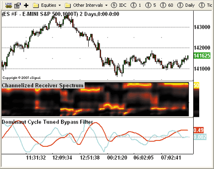

**FIGURE 2: eSIGNAL, EHLERS CYCLE INDICATORS. Here is a demonstration of Ehlers' spectrum indicator and dominant cycle tuned bypass filter in eSignal.**

To discuss these studies or download complete copies of the formulas, please visit the EFS Library Discussion Board forum under the Forums link at www.esignalcentral.com or visit our EFS KnowledgeBase at www.esignalcentral.com/support/kb/efs/.

```javascript
// ChRSpectrum.efs
/***************************************
Provided By : eSignal (c) Copyright 2008
Description:  Measuring Cycle Periods
              by John Ehlers
Version 1.0  1/04/2008
Notes:
* March 2008 Issue of Stocks and Commodities Magazine
* Study requires version 8.0 or later.
Formula Parameters:                     Default:
Show Dominant Cycle                     false
Dominant Cycle Color                    blue
Dominant Cycle Size                     2
*****************************************************************/
function preMain() {
    setStudyTitle("Channelized Receiver Spectrum ");
    setShowCursorLabel(false);
    setShowTitleParameters(false);
    // Dominant Cycle properties
    setPlotType(PLOTTYPE_CIRCLE, 51);
    setDefaultBarBgColor(Color.black, 0);
    var fp1 = new FunctionParameter("bShowDC", FunctionParameter.BOOLEAN);
        fp1.setName("Show Dominant Cycle");
        fp1.setDefault(false);
    var fp2 = new FunctionParameter("nDC_color", FunctionParameter.COLOR);
        fp2.setName("Dominant Cycle Color");
        fp2.setDefault(Color.blue);
    var fp3 = new FunctionParameter("nDC_thick", FunctionParameter.NUMBER);
        fp3.setName("Dominant Cycle Size");
        fp3.setLowerLimit(1);
        fp3.setDefault(2);
}
// Global Variables
var bVersion  = null;    // Version flag
var bInit     = false;   // Initialization flag
var xPrice = null;
var xHP = null;
var xCleanData = null;
var aDB = new Array(51);
var aReturn = new Array(52);  // return array
var nDelta = 0.1;
var nBeta = 0;
var nGamma = 0;
var nAlpha = 0;
var nMaxAmpl = 0;
var nNum = 0;
var nDenom = 0;
var nDC = 0;
var nDomCyc = 0;
var aDC  = new Array(10);
var aQ          = new Array(51);
var aI          = new Array(51);
var aReal       = new Array(51);
var aOlderI     = new Array(51);
var aOldReal    = new Array(51);
var aOlderReal  = new Array(51);
var aImag       = new Array(51);
var aOldQ       = new Array(51);
var aOlderQ     = new Array(51);
var aOldImag    = new Array(51);
var aOlderImag  = new Array(51);
var aAmpl       = new Array(51);
var aOldI       = new Array(51);
var aOldAmpl    = new Array(51);
for (var j = 0; j  6 ) {
        nPeriod = 8;
        for (nPeriod = 8; nPeriod  nMaxAmpl) {
            nMaxAmpl = aAmpl[nPeriod];
        }
    }
 
 
    nPeriod = 8;
    for (nPeriod = 8; nPeriod  0 ) {
            aDB[nPeriod] = -10 * Math.log(.01 / (1 - .99*aAmpl[nPeriod] / nMaxAmpl)) / Math.log(10);
        }
        if (aDB[nPeriod] > 20 ) {
            aDB[nPeriod] = 20;
        }
    }
    nNum = 0;
    nDemon = 0;
    nPeriod = 8;
    for (nPeriod = 8; nPeriod  10) {
            Color1 = Math.round(255*(2 - aDB[nPeriod]/10));
            Color2 = 0;
        }
        aReturn[nPeriod] = nPeriod;
        setDefaultBarFgColor(Color.RGB(Color1 , Color2, 0), nPeriod);
        setDefaultBarThickness(4, nPeriod);
    }
 
    //  aReturn[51]  // contains the Dominant Cycle value
 
    return aReturn;
}
// calcHP globals
var nPrevHP = null;
var nCurrHP = null;
function calcHP(x) {
    var nAlpha1 = (1 - Math.sin((2*Math.PI)/40)) / Math.cos((2*Math.PI)/40);
    var nHP = null;
 
    if (getCurrentBarCount()  6 ) {
        nPeriod = 8;
        for (nPeriod = 8; nPeriod  nMaxAmpl) {
            nMaxAmpl = aAmpl[nPeriod];
        }
    }
 
    nPeriod = 8;
    for (nPeriod = 8; nPeriod  0 ) {
            aDB[nPeriod] = -10 * Math.log(.01 / (1 - .99*aAmpl[nPeriod] / nMaxAmpl)) / Math.log(10);
        }
        if (aDB[nPeriod] > 20 ) {
            aDB[nPeriod] = 20;
        }
    }
    nNum = 0;
    nDemon = 0;
    nPeriod = 8;
    for (nPeriod = 8; nPeriod <= 50; nPeriod++) {
        if (aDB[nPeriod] <= 3 ) {
            nNum = nNum + nPeriod*(20 - aDB[nPeriod]);
            nDenom = nDenom + (20 - aDB[nPeriod]);
        }
        if (nDenom != 0 ) {
            nDC = nNum / nDenom;
            aDC[0] = nDC;
        }
    }
    nDomCyc = Median(aDC, 10);
    if (nDomCyc < 8 ) {
        nDomCyc = 20;
    }
    nBeta = Math.cos((2*Math.PI)/nDomCyc);
    nGamma = 1 / Math.cos((((2*Math.PI)+(2*Math.PI)) * nDelta) / nDomCyc);
    nAlpha = nGamma - Math.sqrt(nGamma*nGamma - 1);
    nValue1 = .5*(1 - nAlpha)*(xCleanData.getValue(0) - xCleanData.getValue(-1)) +
        nBeta*(1 + nAlpha)*nValue1_1 - nAlpha*nValue1_2;
    nValue2 = (nDomCyc / 6.28)*(nValue1 - nValue1_1);
 
    return new Array(nValue1, nValue2);
}
// calcHP globals
var nPrevHP = null;
var nCurrHP = null;
function calcHP(x) {
    var nAlpha1 = (1 - Math.sin((2*Math.PI)/40)) / Math.cos((2*Math.PI)/40);
    var nHP = null;
 
    if (getCurrentBarCount() <= 5 ) {
        nCurrHP = x.getValue(0);
        return nCurrHP;
    } else {
        if (x.getValue(-1) == null) return null;
        if (getBarState() == BARSTATE_NEWBAR) nPrevHP = nCurrHP;
        nCurrHP = ( 0.5*(1 + nAlpha1)*(x.getValue(0) - x.getValue(-1)) + nAlpha1*nPrevHP );
        return nCurrHP;
    }
}
function calcCleanData(x, xP) {  //SmoothHP
    if (getCurrentBarCount() == 1 ) {
        return 0;
    } else if (getCurrentBarCount() <= 7 ) {
        return xP.getValue(0) - xP.getValue(-1);
    } else {
        return (  x.getValue(0) +
                  2*x.getValue(-1) +
                  3*x.getValue(-2) +
                  3*x.getValue(-3) +
                  2*x.getValue(-4) +
                  x.getValue(-5)    ) / 12;
    }
}
function Median(myArray, Length) {
    var aArray = new Array(Length);
    var nMedian = null;
 
    for (var i = 0; i < Length; i++) {
        aArray[i] = myArray[i];
    }
 
    aArray = aArray.sort(compareNumbers);
 
    nMedian = aArray[Math.round((Length-1)/2)];
    return nMedian;
}
function compareNumbers(a, b) {
   return a - b
}
function verify() {
    var b = false;
    if (getBuildNumber() < 779) {
        drawTextAbsolute(5, 35, "This study requires version 8.0 or later.",
            Color.white, Color.blue, Text.RELATIVETOBOTTOM|Text.RELATIVETOLEFT|Text.BOLD|Text.LEFT,
            null, 13, "error");
        drawTextAbsolute(5, 20, "Click HERE to upgrade.@URL=https://www.esignal.com/download/default.asp",
            Color.white, Color.blue, Text.RELATIVETOBOTTOM|Text.RELATIVETOLEFT|Text.BOLD|Text.LEFT,
            null, 13, "upgrade");
        return b;
    } else {
        b = true;
    }
 
    return b;
}
```

```javascript
// DCTunedBypassFilter.efs

```

--Jason Keck
eSignal, a division of Interactive Data Corp.
800 815-8256, www.esignalcentral.com

---

## Wealth-Lab

We've coded John Ehlers' filter bank to measure the dominant cycle (DC) and the sine and cosine filter components in WealthScript for Wealth-Lab version 5.0 (.Net), based on John Ehlers' article in this issue, "Measuring Cycle Periods."

The CycleFilterDC function plots and returns the DC series and its components, so it's a trivial matter to make use of them in a trading strategy.

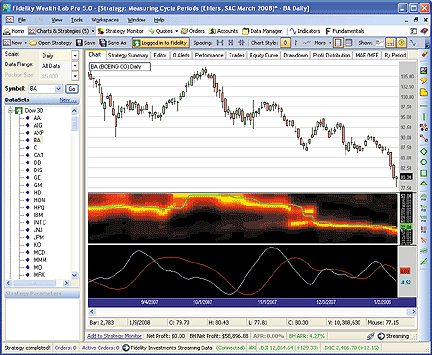

**FIGURE 3: WEALTH-LAB, DOMINANT CYCLE. In this daily chart of cyclical price action, you can just about verify the dominant cycle measurement (plotted in lime green on the heat map) by visual inspection.**

```csharp
/* Code for the WealthLab.Strategies namespace */
public class MeasuringCyclePeriods : WealthScript
{
   public class ArrayHolder
   {   // current, old, older
      internal double I, I2, I3;
      internal double Q, Q2, Q3;
      internal double R, R2, R3;
      internal double Im, Im2, Im3;
      internal double A;
      internal double dB;
   }
   public DataSeries CycleFilterDC(DataSeries ds, out DataSeries sine, out DataSeries cosine)
   {
      double twoPi = 2 * Math.PI;
 
      // Initialize arrays
      ArrayHolder[] ah = new ArrayHolder[51];
      for( int n = 8; n  maxAmpl ? ah[n].A : maxAmpl;
         }
         double num = 0;   double den = 0;
         for( int n = 8; n  0 )
               ah[n].dB = 10 * Math.Log10( (1 - 0.99 * ah[n].A / maxAmpl) / 0.01 );
            ah[n].dB = ah[n].dB > 20 ? 20 : ah[n].dB;
            SetSeriesBarColor(bar, DB[n], color[(int)Math.Round(ah[n].dB)]);
 
            if( ah[n].dB  0 ) domCycle = num/den;
            result[bar] = domCycle;
 
            ah[n].I3 = ah[n].I2;
            ah[n].I2 = ah[n].I;
            ah[n].Q3 = ah[n].Q2;
            ah[n].Q2 = ah[n].Q;
            ah[n].R3 = ah[n].R2;
            ah[n].R2 = ah[n].R;
            ah[n].Im3 = ah[n].Im2;
            ah[n].Im2 = ah[n].Im;
         }
      }
      result = Median.Series(result, 10);
      PlotSeries(dbPane, result, Color.Lime, WealthLab.LineStyle.Solid, 2);
 
      // sine and cosine components
      sine = Low - Low;  sine.Description = "sine(DC)";
      double a2 = 0d;
      for(int bar = 10; bar > 1) );
      cosine.Description = "cosine(DC)";
 
      ChartPane sinePane = CreatePane( 40, false, false );
      for(int bar = 0; bar < Bars.Count; bar++)
         SetPaneBackgroundColor(sinePane, bar, Color.Black);
      PlotSeries(sinePane, sine, Color.Red, LineStyle.Solid, 1);
      PlotSeries(sinePane, cosine, Color.Cyan, LineStyle.Solid, 1);
      return result;
   }
 
   protected override void Execute()
   {
      HideVolume();
      DataSeries avgPrice = (High + Low) / 2;
      avgPrice.Description = "Avg Price";
 
      // Get the dominant cycle, sine and cosine, and plot the heat map
      DataSeries sine, cosine;
      DataSeries DC = CycleFilterDC(avgPrice, out sine, out cosine);
 
      /* Use the DC, sine, and cosine DataSeries in a Trading Strategy here */
   }
```

--Robert Sucher
www.wealth-lab.com

---

## AmiBroker

In "Measuring Cycle Periods" in this issue, author John Ehlers presents a very interesting technique of measuring dominant market cycle periods by means of multiple bandpass filtering. By utilizing an approach similar to audio equalizers, the signal (here, the price series) is fed into a set of simple second-order infinite impulse response bandpass filters.

Filters are tuned to 8,9,10,...,50 periods. The filter with the highest output represents the dominant cycle. Implementing the idea presented in the article is easy using the AmiBroker Formula Language.

Listing 1 shows a full-featured formula that implements a high-pass filter and a six-tap low-pass Fir filter on input, then 42 parallel Iir band-pass filters. Finally, it plots the spectrogram as a heat map. A sample chart is shown in Figure 4.

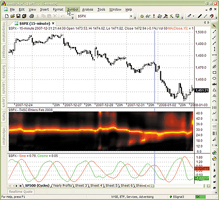

**FIGURE 4: AMIBROKER, EHLERS' DOMINANT CYCLE INDICATORS. Here is a sample 15-minute S&P 500 index price chart with a channelized receiver spectrum display (middle pane) and dominant cycle-tuned band-pass filter response (bottom pane).**

As an option, the formula can also plot a dominant cycle-tuned band-pass filter response. To do so, the user needs to open the Parameters dialog and turn on "tuned filter display."

```afl
PI = 3.1415926;
Data = (H+L)/2;
// detrending ( high-pass filter )
HFPeriods = Param("HP filter cutoff", 40, 20, 100 );
alpha1 = ( 1-sin(2*pi/HFPeriods) ) / cos( 2 * pi / HFPeriods );
HP = AMA2( Data - Ref( Data, -1 ), 0.5 * ( 1 + alpha1 ), alpha1 );
// 6-tap low-pass FIR filter
SmoothHP  = ( HP + 2 * Ref( HP, -1 ) + 3 * Ref( HP, -2 ) +
   3 * Ref( HP, -3 ) + 2 * Ref( HP, -4 ) + Ref( HP, -5 ) )/12;
SmoothHPDiff = SmoothHP - Ref( SmoothHP, -1 );
x = BarIndex();
delta = -0.015 * x + 0.5;
delta = Max( delta, 0.15 );
Q  = 0;
Real = 0;
Imag = 0;
Ampl = 0;
DB =  0;
I = SmoothHP;
MaxAmpl = 0;
for( N = 8; N <= 50; N++ )
{
  beta = cos( 2 * PI / N );
  Q = ( N / ( 2 * PI ) ) * SmoothHPDiff;
 
  for( bar = 8; bar < BarCount; bar++ )
  {
     gamma = 1 / cos( 4 * PI * delta[ bar ] / N );
     alpha = gamma - sqrt( gamma ^ 2 - 1 );
 
     Real[ bar ] = 0.5 * ( 1 - alpha ) * ( I[ bar ] - I[ bar - 1 ] ) +
                   beta * ( 1 + alpha ) * Real[ bar - 1 ] -
                   alpha * Real[ bar - 2 ];
     Imag[ bar ] = 0.5 * ( 1- alpha ) * ( Q[ bar ] - Q[ bar - 1 ] ) +
                beta * ( 1 + alpha ) * Imag[ bar - 1 ] -
                alpha * Imag[ bar - 2 ];
   }
   Ampl = Real ^ 2 + Imag ^ 2;
   MaxAmpl = Max( MaxAmpl, Ampl );
   VarSet("Ampl"+N, Ampl );
}
TunedFilterDisplay = ParamToggle("Dom Cycle Tuned Filter", "No|Yes" );
// Plot Heat Map ( Spectrogram )
// and find dominant cycle
DcNum = DcDenom = 0;
for( N = 8; N <= 50; N++ )
{
   Ampl = VarGet("Ampl"+N);
   db  = Nz( -10 * log10( 0.01 / ( 1 - 0.99 * Ampl / MaxAmpl ) ) );
 
   db = Min( db, 20 ) ;
   Red = IIf( db <= 10, 255, 255 * ( 2 - db/10 ) );
   Green = IIf( db <= 10, 255 * ( 1 - db/10 ), 0 );
   if( NOT TunedFilterDisplay  )
      PlotOHLC( N, N, N-1, N-1, "", ColorRGB( Red, Green, 0 ),
                                    styleCloud | styleNoLabel );
   DcNum = DcNum + (db < 3 ) * N * ( 20 - db );
   DcDenom = DcDenom + ( db < 3 ) * ( 20 - db );
}
DC = DcNum / DcDenom;
if( ParamToggle("Show Dom. Cycle?", "No|Yes" ) )
{
  DomCycle = Median( DC, 10 );
  Plot( DomCycle, "Dominant Cycle", colorBlue );
}
if( TunedFilterDisplay )
{
   DomCycle = Median( DC, 10 );
   DomCycle = Max( DomCycle, 8 );
   Value = 0;
   for( bar = 10; bar < BarCount; bar++ )
   {
     beta = cos( 2 * PI / domCycle[ bar ] );
     gamma = 1 / cos( 4 * PI * delta[ bar ] / DomCycle[ bar ] );
     alpha = gamma - sqrt( gamma ^ 2 - 1 );
     Value[ bar ] = 0.5 * ( 1 - alpha ) * SmoothHPDiff[ bar ] +
           beta * ( 1 + alpha ) * Value[ bar - 1 ] -
           alpha * Value[ bar - 2 ];
   }
   Value2 = ( domCycle / ( 2 * PI ) ) * ( Value - Ref( Value, -1 ) );
   Plot( Value, "Sine", colorRed );
   Plot( Value2, "Cosine", colorGreen );
}
GraphZOrder = 1;
```

--Tomasz Janeczko, AmiBroker.com
www.amibroker.com

---

## NeuroShell Trader

John Ehlers' bandpass dominant cycle and dominant cycle-tuned bandpass filter response indicators discussed in his article in this issue, "Measuring Cycle Periods," can be easily implemented in NeuroShell Trader using NeuroShell Trader's ability to program functions in standard languages such as C, C++, Power Basic, or Delphi. A sample NeuroShell chart is shown in Figure 5.

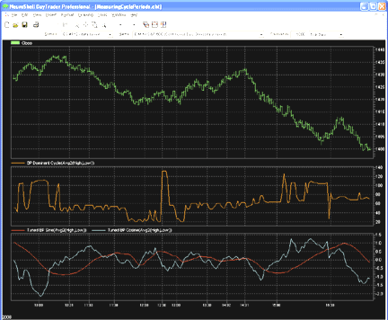

**FIGURE 5: NEUROSHELL, EHLERS' CYCLE INDICATORS. This sample NeuroShell Trader chart shows the dominant cycle indicator and the dominant cycle-tuned bandpass filter response indicators.**

You can recreate Ehlers' bandpass dominant cycle indicator and the tuned bandpass sine and cosine indicator by moving the EasyLanguage code provided in Ehlers' article to your preferred compiler and setting up the corresponding functions. You can insert the resulting indicators as follows:

1. Select "New Indicator ..." from the Insert menu.
2. Choose the Ehlers Band Pass Filter category.
3. Select the bandpass dominant cycle, tuned bandpass sine or cosine indicators.
4. To match Ehlers' code, change "Price from close" to "Divide (Add2 (High, Low), 2)" from the Arithmetic category.
5. Select the Finished button.

Dynamic trading systems can be easily set up in NeuroShell Trader by combining the dominant cycle indicators with the adaptive length indicators available in John Ehlers' Cybernetic and Mesa8 NeuroShell Trader add-ons. Ehlers suggests that adaptive length indicators linked to the dominant cycle indicator, when combined with NeuroShell Trader's genetic optimizer, could produce very robust systems. Similar strategies can also be created using the dominant cycle indicator found in John Ehlers' Mesa8 NeuroShell Trader Add-on.

Users of NeuroShell Trader can go to the STOCKS & COMMODITIES section of the NeuroShell Trader free technical support website to download a copy of this or any previously published Traders' Tips.

For more information on NeuroShell Trader, visit www.NeuroShell.com.

--Marge Sherald, Ward Systems Group, Inc.
301 662-7950, sales@wardsystems.com
www.neuroshell.com

---

## Worden Blocks

To use the study described here, you will need the free Blocks software. Go to www.Blocks.com to download the software and get detailed information on the available data packs.

To load the spectrum study that is described by John Ehlers in his article in this issue, "Measuring Cycle Periods," open Blocks, then click the Indicators button. Browse to the "SC Traders Tips" folder, then click on "Measuring Cycle Periods."

The spectrum can be used to analyze any plot, so you'll be prompted with a dialog to "Add Measuring Cycles to." Click on "price history," then click OK. Or choose a different plot to analyze. See Figure 6.

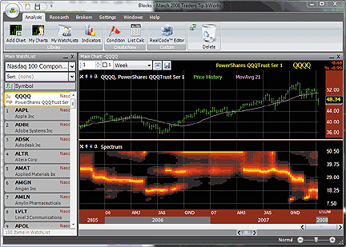

**FIGURE 6: WORDEN BLOCKS, EHLERS' CYCLE INDICATORS. The intensity of the spectrum shows the dominant cycle of the price graph.**

To download the Blocks analysis software, go to www.Blocks.com. To choose your Blocks Analysis Packs, call 800 776-4940 or order online at the Blocks website.

--Bruce Loebrich and Patrick Argo
Worden Brothers, Inc.

---

## StrataSearch

Based on John Ehlers' article in this issue, "Measuring Cycle Periods," we chose to implement the dominant cycle-tuned bandpass filter response to test Ehlers' suggestion to use the sine and cosine crossovers as buy and sell signals. If the sine closely follows the price pattern as suggested, and the cosine is an effective leading function of the sine, then it seems to make sense that a crossover implementation would work well.

What we discovered in our tests is that crossovers happen at frequent intervals, even when price has not moved significantly. This leads to a higher percentage of losing trades, particularly when spread, slippage, and commissions are accounted for. Nevertheless, the cosine crossover was quite effective at identifying reversals very early in many cases, so this indicator could prove quite effective when used alongside other indicators. In particular, the use of an indicator to confirm a certain level of recent volatility, as well as an indicator to confirm significant rate of change, could prove quite helpful.

A sample chart is shown in Figure 7.

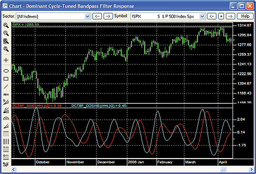

**FIGURE 7: STRATASEARCH, DOMINANT CYCLE-TUNED BANDPASS FILTER RESPONSE. As discussed by John Ehlers in his article in this issue, the cosine (cyan) component proves to be a helpful leading function of the sine (red) component.**

As with all other Traders' Tips, additional information, including plug-ins, can be found in the Shared Area of the StrataSearch user forum. This month's plug-in contains a number of prebuilt trading rules that will allow you to include this indicator in your automated searches. Simply install the plug-in and let StrataSearch identify which supporting indicators might be helpful.

```cpp
//************************************************************************************
// DOMINANT CYCLE-TUNED BANDPASS FILTER RESPONSE - Sine
//************************************************************************************
DCTBF_API int DCTBF_Sine(Prices *pPrices, Values *pResults, int nTotDays, Values *pValue1) {
    double alpha1;
    int CurrentBar;
    double *Price;
    double *HP;
    double *SmoothHP;
    double delta;
    double beta;
    double gamma;
    double alpha;
    int N;
    double MaxAmpl;
    double Num;
    double Denom;
    double *DC;
    double DomCyc;
    double *Value1;
    double *Value2;
    double Q[51];
    double I[51];
    double Real[51];
    double Imag[51];
    double Ampl[51];
    double OldQ[51];
    double OldI[51];
    double OlderQ[51];
    double OlderI[51];
    double OldReal[51];
    double OldImag[51];
    double OlderReal[51];
    double OlderImag[51];
    double OldAmpl[51];
    double DB[51];
    Price = (double *) malloc(sizeof(double) * nTotDays);
    ZeroMemory(Price, sizeof(double) * nTotDays);
    HP = (double *) malloc(sizeof(double) * nTotDays);
    ZeroMemory(HP, sizeof(double) * nTotDays);
    SmoothHP = (double *) malloc(sizeof(double) * nTotDays);
    ZeroMemory(SmoothHP, sizeof(double) * nTotDays);
    DC = (double *) malloc(sizeof(double) * nTotDays);
    ZeroMemory(DC, sizeof(double) * nTotDays);
    Value1 = (double *) malloc(sizeof(double) * nTotDays);
    ZeroMemory(Value1, sizeof(double) * nTotDays);
    Value2 = (double *) malloc(sizeof(double) * nTotDays);
    ZeroMemory(Value2, sizeof(double) * nTotDays);
    for(CurrentBar=0; CurrentBar= 6)
            SmoothHP[CurrentBar] = (HP[CurrentBar] + 2*HP[CurrentBar-1] + 3*HP[CurrentBar-2]
                                   + 3*HP[CurrentBar-3] + 2*HP[CurrentBar-4] + HP[CurrentBar-5]) / 12;
        if(CurrentBar  5) {
            for(N=8; N MaxAmpl)
                MaxAmpl = Ampl[N];
        }
        for(N=8; N 0)
                DB[N] = -10*log(.01 / (1 - .99*Ampl[N] / MaxAmpl)) / log(10);
            if(DB[N] > 20)
                DB[N] = 20;
        }
        Num = 0;
        Denom = 0;
        for(N=10; N 9)
            DomCyc = Median(&DC[CurrentBar], 10);
        if(DomCyc < 8)
            DomCyc = 20;
        beta = cos(DegreesToRadians(360 / DomCyc));
        gamma = 1 / cos(DegreesToRadians(720*delta / DomCyc));
        alpha = gamma - sqrt(gamma*gamma - 1);
        if(CurrentBar<2) {
            pResults[CurrentBar].dValue = 0;
            pResults[CurrentBar].chIsValid = 0;
            continue;
        }
        Value1[CurrentBar] = .5*(1 - alpha)*(SmoothHP[CurrentBar] - SmoothHP[CurrentBar-1])
                              + beta*(1 + alpha)*Value1[CurrentBar-1] - alpha*Value1[CurrentBar-2];
        Value2[CurrentBar] = (DomCyc / 6.28)*(Value1[CurrentBar] - Value1[CurrentBar-1]);
        pResults[CurrentBar].dValue = Value1[CurrentBar];
        pResults[CurrentBar].chIsValid = 'Y';
    }
    free(Price);
    free(HP);
    free(SmoothHP);
    free(DC);
    free(Value1);
    free(Value2);
    return 0;
}
```

--Pete Rast, Avarin Systems Inc
www.StrataSearch.com

---

## Strategy Desk

In this month's Traders' Tips column we'll look at cycles, as discussed by John Ehlers in his article in this issue, "Measuring Cycle Periods."

Here is a StrategyDesk interpretation. The formulas shown here will assist you in building an oscillator to help you find cycles in market data.

We'll start by using a moving average; specifically, a centered moving average. This concept is not new, but the idea is to choose your desired length and then shift it to the left on the chart by half the number of periods used for the average. The end result is that it generally rests more squarely on top of the market data instead of lagging. Longer averages will tend not to follow the price action as well as shorter averages.

An example is shown on the chart in Figure 8. A 20-period simple moving average is overlaid on the S&P 500 and shifted 10 periods to the left. This is accomplished in StrategyDesk by overlaying a simple moving average of 20 periods and choosing -10 for the offset amount.

Next we'll create an oscillator using this centered moving average. This is done on a chart by choosing "Custom Study Wizard" from the Studies menu and adding the following formula:

```
Bar[Close,D] / MovingAverage[MA,Close,20,-10,D]
```

We've chosen to title this "Close to 20-day centered Sma."

Finally, place this newly created oscillator below your chart with a line across the level at 1 to see positive and negative crossovers. This is displayed in the chart in Figure 8.

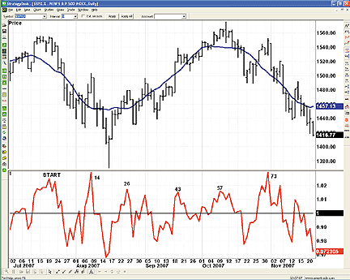

**FIGURE 8: TD AMERITRADE, PERIODIC REPETITIONS. The chart shows the number of periods from the starting point where the upper extremes have occurred. You can see that cycles have appeared roughly every 14 trading days.**

The next step is to look for periodic repetitions. Using StrategyDesk's cursor tracking window we can see how many periods have elapsed by simply clicking and moving the cursor on the chart. Figure 8 shows the number of periods from the starting point where the upper extremes have occurred. You'll see that these cycles have appeared roughly every 14 trading days.

This is just one example of finding cycles. If you have questions about this formula or functionality, please call TD Ameritrade's StrategyDesk free help line at 800 228-8056, or access the Help Center via the StrategyDesk application. StrategyDesk is a downloadable application that is free for all TD Ameritrade clients. Regular commission rates apply.

TD Ameritrade and StrategyDesk do not endorse or recommend any particular trading strategy.

--Jeff Anderson
TD AMERITRADE Holding Corp.
www.tdameritrade.com

---

## SwingTracker

We have introduced the BP IQ spectrum indicator into SwingTracker 5.13.088 based on John Ehlers's article in this issue, "Measuring Cycle Periods." A sample chart is shown in Figure 9.

To discuss these tools, please visit our forum at forum.mrswing.com. Our development staff can assist your needs at support.mrswing.com.

For information or free trial, visit www.swingtracker.com.

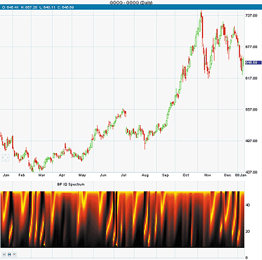

**FIGURE 9: SWINGTRACKER, EHLERS' SPECTRUM INDICATORS. Here is a demonstration of the BP IQ spectrum indicator.**

```java
SpectrumDSRenderer.java
package com.iqpartners.chart.render;
import java.awt.Graphics;
import java.awt.Graphics2D;
import java.awt.RenderingHints;
import java.awt.Color;
import com.iqpartners.data.DataSet;
public class SpectrumDSRenderer extends DataSetRenderer {
    /** Constructor */
    public SpectrumDSRenderer() {
    }
    /**
     * Draw a histogram
     */
    @Override
    public void plot(RendererContext rc, DataSet dsRed, DataSet dsGreen, Graphics g) {
        Graphics2D g2 = (Graphics2D) g.create();
        g2.setRenderingHint(RenderingHints.KEY_ANTIALIASING, RenderingHints.VALUE_ANTIALIAS_ON);
        Float[] red = dsRed.getData();
        Float[] green = dsGreen.getData();
        for (int i = 0; i = 1) {
                    tickVal = 0;
                    label = "0";
                    g.setColor(ColorSchemeManager.current().label());
                    g.drawString(label, rc.getXMax() + fontDelta + 1, rc.getY(tickVal) + fontDelta);
                    g.setColor(ColorSchemeManager.current().grid());
                    g.drawLine(rc.getXMin(), rc.getY(tickVal), rc.getXMax() - 3, rc.getY(tickVal));
                    int step = (int) (r.getHigh() / 3) + 1;
                    for (int i = step; i  0.5) ? 0.2F : 0.1F;
                    for (float i = step; i  5) {
                for (int n = 8; n  MaxAmpl) {
                    MaxAmpl = Ampl[n];
                }
            }
            for (int n = 8; n  0)) {
                    DB[n] = (float) (-10.0 * Math.log(0.01 / (1 - 0.99 * Ampl[n] / MaxAmpl)) / Math.log(10));
                } else {
                    DB[n] = 0.0f;
                }
                if (DB[n] > 20) {
                    DB[n] = 20.0f;
                }
            }
            float Num = 0.0f;
            float Denom = 0.0f;
            for (int n = 8; n <= 50; n++) {
                if (DB[n] <= 3) {
                    Num = Num + n * (20 - DB[n]);
                    Denom = Denom + (20 - DB[n]);
                }
                if (Denom != 0.0f) {
                    DC.addFloat(Num / Denom, i);
                }
            }
            for (int n = 8; n <= 50; n++) {
                if (DB[n] <= 10) {
                    Color1[n].addFloat(255.0f, i);
                    float color = 255 * (1 - DB[n] / 10);
                    Color2[n].addFloat(color, i);
                } else {
                    float color = 255 * (2 - DB[n] / 10);
                    Color1[n].addFloat(color, i);
                    Color2[n].addFloat(0.0f, i);
                }
            }
        }
        DataSet DomCyc = DataSet.SMA(DC, 10);
        for (int n = 8; n <= 50; n++) {
            Color1[n].setLevel(n);
            Color1[n].setDataSetRenderer(new SpectrumDSRenderer());
            addDataSetPair("DS_" + Integer.toString(n), Color1[n], Color2[n]);
        }
        calculateHigh();
        calculateLow();
    }
    @Override
    public void calculateHigh() {
        high = 50;
    }
    @Override
    public void calculateLow() {
        low = 8;
    }
    public String getOverlayName() {
        // Initiliaze localization
        ResourceBundle messages;
        TranslatedMessages translatedMessages = TranslatedMessages.instance();
        messages = translatedMessages.getBundle();
        return messages.getString("bp_iq_spectrum");
    }
}
```

--Larry Swing
theboss@mrswing.com
www.mrswing.com

---

## Gecko Software

As discussed in John Ehlers' article in this issue, "Measuring Cycle Periods," it is well known and well documented that one of the greatest advantages of trading the commodities market is the fact that they move in such strong definable cycles through measured periods.

For the year 2007, gold traders who followed the historical seasonal cycle through the previous year's time frame would have profited significantly if they took advantage of this single most important phenomenon.

In the sample Track 'n Trade futures chart in Figure 10, the graph at the bottom of the screen is a representation of the past 10-year price cycle in blue, with the 15-year price cycle in red as the overlay. In this graph, we can see that the overall 10- and 15-year historical cycle indicates that the price of gold has a historically strong rally starting in early September of each year. As a gold trader, we look forward to this rally as a regular occurrence, with this past year being no different. As we see from the price chart, the price of gold continued to rally throughout the remainder of the year, as it has traditionally done during years past, as represented by the historical price average indicator. Looking forward in time, we also see that gold tends to rally through the year all the way into February of the following year before finding any kind of price relief.

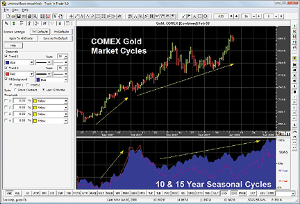

**FIGURE 10: GECKO SOFTWARE, 10-YEAR AND 15-YEAR HISTORICAL CYCLES. Here is a demonstration of historical seasonal cycles of the gold market in Track 'n Trade.**

Track 'n Trade allows the trader to manage and modify the historical time frames from within the left-pane control panel, giving the user the ability to manipulate the data in a number of different ways. As seen in this example, we have chosen to see the 10-year historical cycle represented in blue and the 15-year represented in red. Track 'n Trade also has the ability to activate historical price averages as an overlay, directly in reference to price, also available from the left-pane control panel.

--Lan H. Turner
www.geckosoftware.com

---

## AIQ

The AIQ code for the set of indicators that Barbara Star discusses in her December 2007 article, "Confirming Price Trend," is shown here. Figure 11 shows the two linear regression indicators plotted on a chart of Express Scripts.

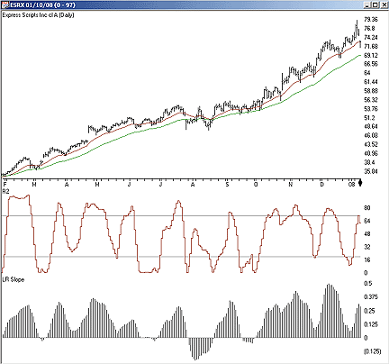

**FIGURE 11: AIQ, LINEAR REGRESSION INDICATORS. Here, the linear regression indicators r-squared and linear regression slope for a 20-day period are shown on a chart of Express Scripts.**

This code can be downloaded from the AIQ website at www.aiqsystems.com and also from www.tradersedgesystems.com/traderstips.htm.

```
! CONFIRMING PRICE TREND
! Author: Barbara Star, TASC Dec 2007
! Coded by: Richard Denning 01/07/08
C     is [close].
C1    is valresult(C,1).
C2    is valresult(C,2).
C3    is valresult(C,3).
C4    is valresult(C,4).
C5    is valresult(C,5).
C6    is valresult(C,6).
C7    is valresult(C,7).
C8    is valresult(C,8).
C9    is valresult(C,9).
C10    is valresult(C,10).
C11    is valresult(C,11).
C12    is valresult(C,12).
C13    is valresult(C,13).
C14    is valresult(C,14).
C15    is valresult(C,15).
C16    is valresult(C,16).
C17    is valresult(C,17).
C18    is valresult(C,18).
C19    is valresult(C,19).
! CONSTANTS FOR N = 20:
! N        = 20.
! SUM_X        = 210.
! SUM_X*SUM_X      = 44100.
! SUM_X2     = 2870.
SUM_Y    is sum(C,20).
SUM_XY    is C19 + 2*C18 + 3*C17 + 4*C16 + 5*C15 + 6*C14 + 7*C13
          + 8*C12 + 9*C11 + 10*C10 + 11*C9 + 12*C8 + 13*C7 + 14*C6
          + 15*C5 + 16*C4 + 17*C3 + 18*C2 + 19*C1 + 20*C.
SUM_Y2    is sum(C*C,20).
R    is ((20*SUM_XY-210*SUM_Y)
       / sqrt((20*2870-44100)*(20*SUM_Y2-SUM_Y*SUM_Y))).
R2    is R*R.
! INDICATORS TO PLOT:
   ! R2 TIMES 100:
    PlotR2    is R2 * 100.
   ! LINEAR REGRESSION SLOPE INDICATOR
    LRS20     is slope2(C,20).
```

--Richard Denning, AIQ Systems
richard.denning@earthlink.net

---

## VT Trader

For this month's Traders' Tip, we're revisiting an article by Martha Stokes from the September 2007 issue of S&C titled "The Angle Of Ascent." In that article, Stokes discusses the merits of determining the angle at which price is ascending or descending to better pinpoint trade entries. She goes on to mention that the ideal angle of ascent is 45 degrees on the most recent price action.

For our purposes, we'll use the linear regression indicator, which can be found in VT Trader, as the basis for determining the angle of ascent. The VT Trader code and instructions for recreating the angle of ascent indicator are as follows:

Angle of ascent indicator

1. Navigator Window>Tools>Indicator Builder>[New] button

2. In the Indicator Bookmark, type the following text for each field:

```
Name: TASC TASC - 03/2008 - Angle of Ascent Indicator
Short Name: vt_AofA
Label Mask: TASC - 03/2008 - Angle of Ascent Indicator (LRI: %RegPeriods%, %Price%,
            LRI Pre-Smoothing: %SmoothPeriods%, %SmoothType% | Slope Periods: %slopeper%)
Placement: New Frame
Inspect Alias: Angle of Ascent Indicator
```

3. In the Input Bookmark, create the following variables:

```
[New] button... Name: RegPeriods , Display Name: Regression Periods , Type: integer , Default: 8
[New] button... Name: Price , Display Name: Regression Price , Type: price , Default: close
[New] button... Name: SmoothPeriods , Display Name: Pre-Smoothing Price Periods , Type: integer , Default: 1
[New] button... Name: SmoothType , Display Name: Pre-Smoothing MA Type , Type: MA type , Default: Simple
[New] button... Name: slopeper , Display Name: Slope Periods , Type: integer , Default: 8
```

4. In the Output Bookmark, create the following variables:

```
[New] button...
Var Name: Degrees
Name: (Degree of Angle)
Line Color: dark green
Line Width: slightly thicker
Line Type: solid
```

5. In the Horizontal Line Bookmark, create the following variables:

```
[New] button...
Value: +45.0000
Color: red
Width: thin
Style: dashed line
[New] button...
Value: +0.0000
Color: black
Width: thin
Style: dashed line
[New] button...
Value: -45.0000
Color: red
Width: thin
Style: dashed line
```

6. In the Formula Bookmark, copy and paste the following formula:

```
{Provided By: Visual Trading Systems, LLC & Capital Market Services, LLC (c) Copyright 2008}
{Description: Angle of Ascent Indicator}
{Notes: T.A.S.C., September 2007 - "The Angle of Ascent" by Martha Stokes}
{vt_AofA Version 1.0}
{Calculate Linear Regression Indicator}
SmoothData:= mov(Price,SmoothPeriods,SmoothType);
LRI:= linreg(SmoothData,RegPeriods);
{Determine the Angle of Ascent of LRI}
NormalizedDifferenceInPrice:= if(SymbolPoint()=0.0001,10000,100);
Rise:= (LRI - ref(LRI,-slopeper)) * NormalizedDifferenceInPrice;
Run:= slopeper;
Slope:= Rise/Run;
Angle:= atan(Slope);
Degrees:= Angle * 180 / PI;
```

7. Click the "Save" icon to finish building the angle of ascent indicator.

To attach the indicator to a chart (Figure 12), click the right mouse button within the chart window and then select "Add Indicators" -> "TASC - 03/2008 - Angle of Ascent Indicator" from the indicator list.

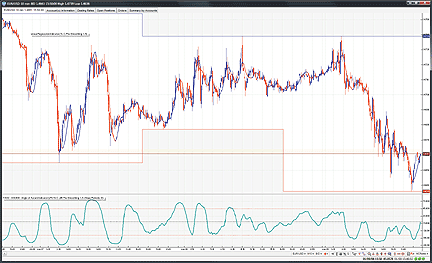

**FIGURE 12: VT TRADER, LINEAR REGRESSION AND ANGLE OF ASCENT. Here is the angle of ascent indicator displayed over a EUR/USD 10-minute candlestick chart.**

To learn more about VT Trader, please visit www.cmsfx.com.

--Chris Skidmore
CMS Forex
(866) 51-CMSFX, trading@cmsfx.com
www.cmsfx.com
