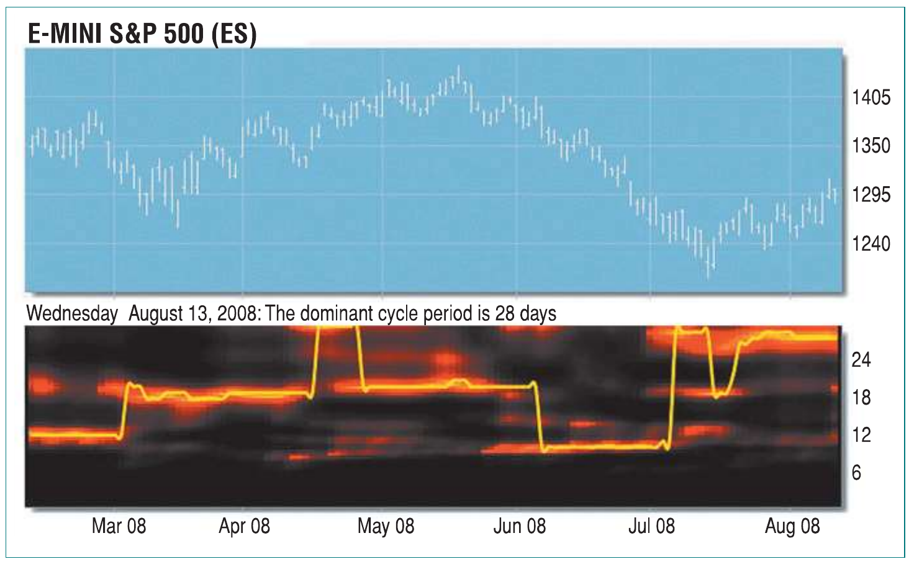
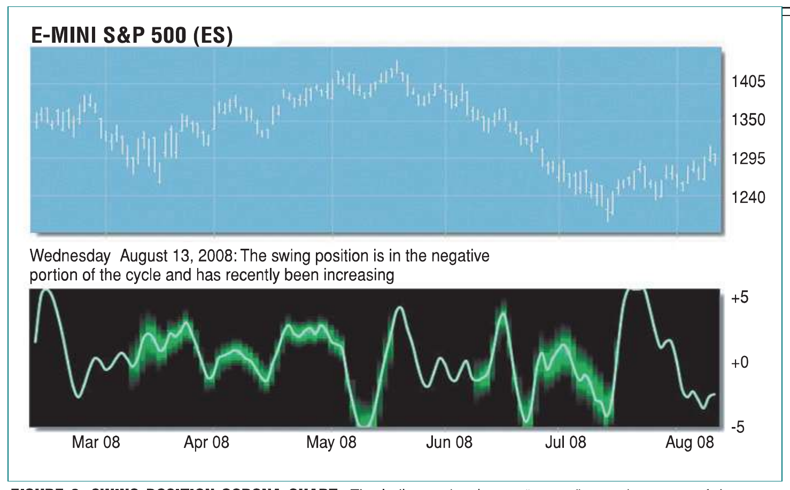
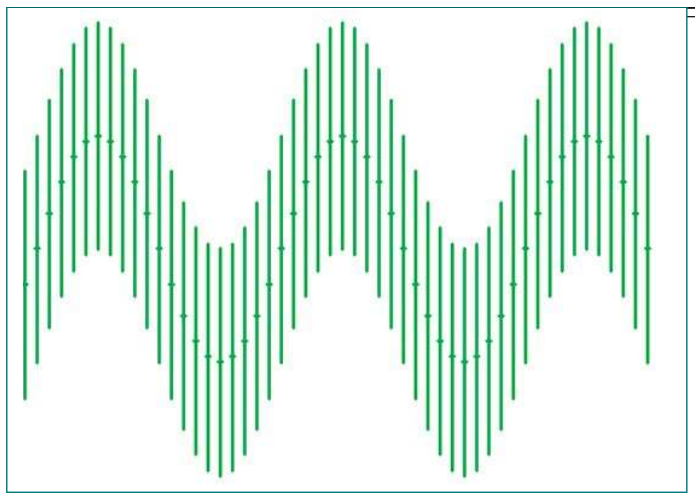
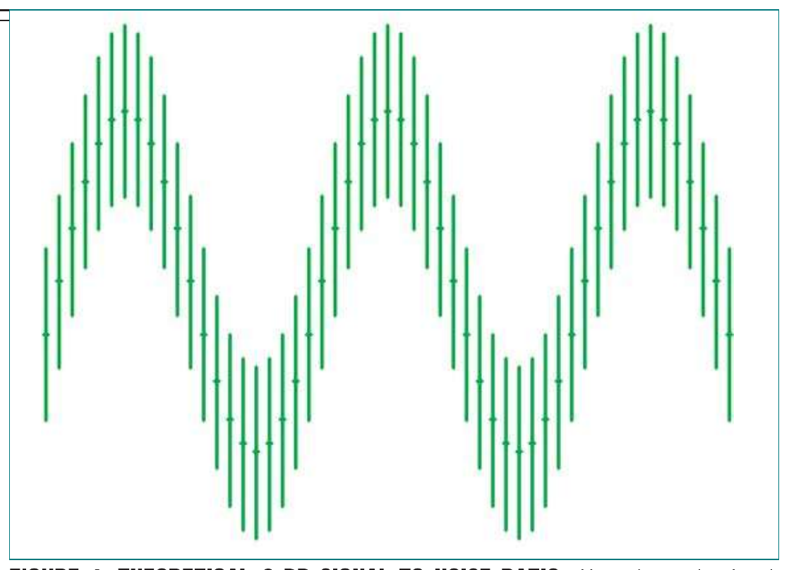
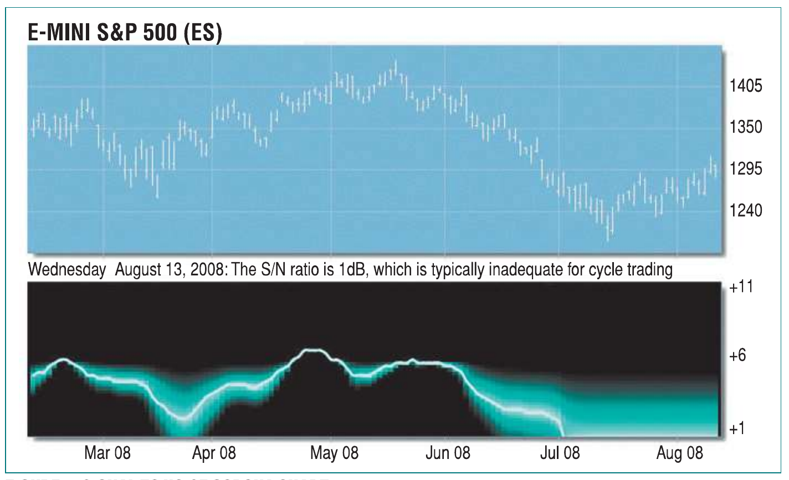
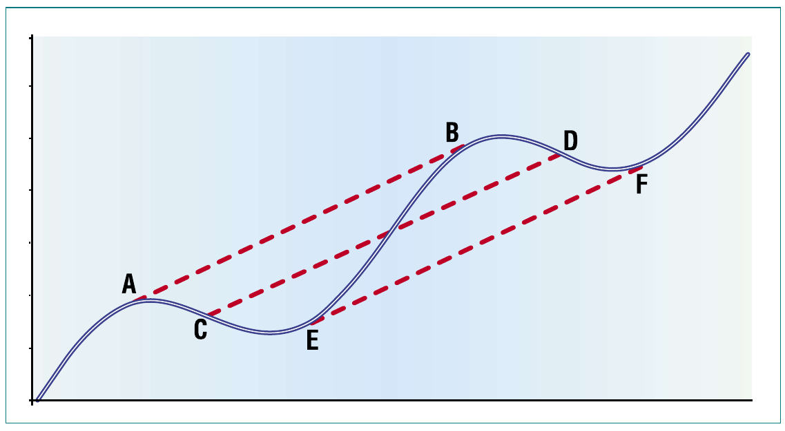
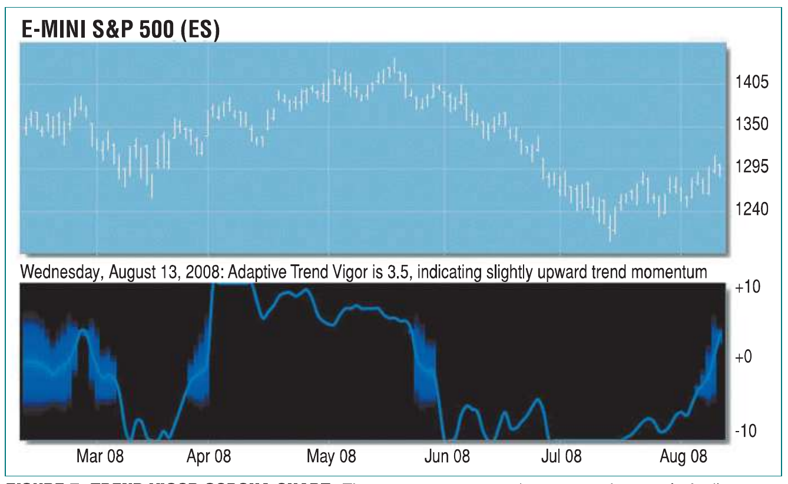
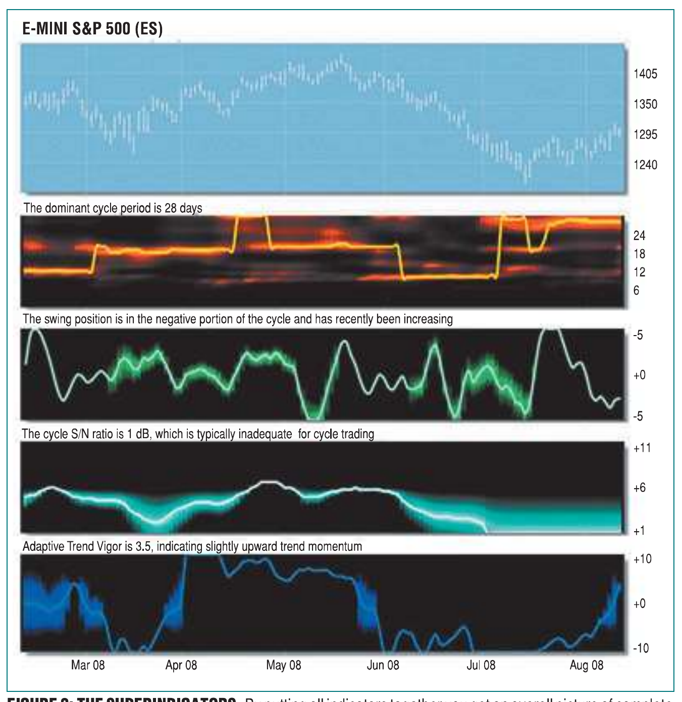

```bibtex
@article{ehlers_corona_charts_2008,
  author  = {Ehlers, John F.},
  title   = {Corona Charts},
  journal = {Technical Analysis of Stocks \& Commodities},
  volume  = {26},
  number  = {11},
  pages   = {18--24},
  year    = {2008},
  url     = {https://technical.traders.com/archive/article.asp?file=\V26\C11\200EHLE.pdf}
}

@misc{tasc_traders_tips_2008_11,
  title   = {Traders' Tips: Corona Charts},
  author  = {{Technical Analysis, Inc.}},
  journal = {Technical Analysis of Stocks \& Commodities},
  year    = {2008},
  month   = {11},
  url     = {https://www.traders.com/Documentation/FEEDbk_docs/2008/11/TradersTips/TradersTips.html},
  note    = {Traders' Tips based on ``Corona Charts'' by John F. Ehlers}
}
```

# Corona Charts

*Look! Up In The Sky!*

*Supercomputers, superdelegates, and now, superindicators. Here's a look at the up-and-coming group of indicators that tell you when a signal is strong and when it's not.*

---

Never heard of corona charts? You will. They are the next-generation group of superindicators because they not only give you a multidimensional view of market activity, but also because each indicator alerts you when its signal is strong and when it is weak.

Each indicator in this group is based on sound scientific measurements rather than on anecdotal evidence and heuristics. All the indicators start with the measurement of the dominant cycle and are therefore adaptive to market conditions. There are a total of four indicators in the corona chart series. These are:

1. The spectrum (from which the dominant cycle is extracted)
2. The cycle signal to noise ratio
3. The swing position
4. The trend vigor.

The spectrum measures cyclic activity over a cycle period range from six bars to 30 in a bank of continuous digital filters. Longer cycle periods are not taken into consideration because they can be viewed as trend segments. Shorter cycle periods are not considered because of the aliasing† noise encountered with the data sampling process. The amplitude of each filter output is compared to the strongest signal, and the result is displayed over an amplitude range of 20 decibels (dB).

This display is in the form of a heat map. Now, imagine the strongest signal being white-hot. As the amplitudes decrease, the display "cools off" through red-hot to ice-cold. The colors range from bright yellow for the strongest signal to black for the weakest. The dominant cycle line is extracted from the strongest signals in the spectrum.

The spectrum display is described with reference to Figure 1. The spectrum is time-synchronized with the bar chart above it. The vertical axis of the display shows the measured cycle period over the range, again from six bars to 30. The ideal condition is a thin horizontal yellow line. This denotes a consistent cycle period that is well focused at the dominant cycle.

The market, however, is often not so accommodating. You will see periods where the spectrum gets fuzzy; that means the cyclic energy is not concentrated at the dominant cycle and is more vague. You will also see times when the dominant cycle is drifting upward or downward, signifying slow changes in the cycle periods.



**Figure 1: Spectrum Chart.** The thin horizontal yellow line shows the ideal condition. Fuzzy areas in the spectrum mean that cyclic energy is not concentrated at the dominant cycle. Sometimes the dominant cycle shifts up or down, slowly as well as rapidly.

## Swing Position

Figure 2 shows the swing position corona chart. It is time-synchronized with the bar chart and the vertical axis is on an arbitrary scale from -10 to +10. Since the purpose of this indicator is to anticipate the turning points, regions near the minimum and maximum are the strongest. The indicator develops a "corona" near the center of the range, signifying that a turning point is not imminent. You will also note a corona being displayed when the market is in a trend and there is very little cyclic swing.

The period of March through May 2008 had some volatility, but the swings were not sufficient for effective cycle trading. On the other hand, nice cyclic swings were identified in February 2008 and May 2008, coming out of the downtrend at the end of July 2008.



**Figure 2: Swing Position Corona Chart.** The indicator develops a "corona" near the center of the range signifying that a reversal is not imminent. A corona is displayed when the market is in a trend and there is little cyclic swing. In February 2008, May 2008, and July 2008 there were some nice cyclic swings.

There are other times when the dominant cycle shifts rapidly from one value to another. Rapid shifts can occur because the cycle strength is low or harmonics are present in the data. For example, early in July 2008 the market was in a downtrend and hardly any cycle activity was present. That caused the dominant cycle to shift to a long period and the spectrum became indistinct with multiple components.

Once the period of the dominant cycle is known, the question remains of where we are within the cycle position. Of course, we can look at the bar chart and judge where we had the last significant low (or high) and estimate the next cyclic turning point to be a half cycle in the future from that point.

However, since the market does not consist of perfect cycles, we have a better way to show where the market is within the cycle position. We do this by correlating the prices with a perfect sine wave having the dominant cycle period. This correlation produces a smooth waveform that lets us better estimate the swing position and impending turning points.

## Market Noise

The absolute amplitude of the cycle waveform is not particularly important. In addition, longer cycles typically have a larger swing than shorter cycles. What *is* important is the amplitude of the cycle relative to conditions for trading.

One such relative measure is the cycle amplitude relative to noise. There can be many definitions of noise in the market, but for trading purposes I chose the average bar height to be noise because there is not much tradable information within the bar. Using this definition, Figure 3 shows the condition where the wave amplitude of the dominant cycle is equal to the noise amplitude. This is the case when the signal to noise ratio is zero dB. Even if we have the cycle position perfectly diagnosed, it is still possible to buy at the high of the cycle low and sell at the low of the cycle high for exactly zero profit, not including commissions.



**Figure 3: Theoretical Zero dB Signal to Noise Ratio.** Here the cycle signal amplitude is equal to the noise amplitude.

Another theoretical example is shown in Figure 4. In this case, the wave amplitude of the signal is twice the amplitude of the noise. Now we have a reasonable expectation of profit based on the cycle, no matter what our intrabar entry and exit may be. This is the 6 dB signal to noise ratio case. The market rarely has a signal to noise ratio in excess of 6 dB.



**Figure 4: Theoretical 6 dB Signal to Noise Ratio.** Here the cycle signal amplitude is twice the noise amplitude.

The signal to noise ratio corona chart can be seen in Figure 5. As with the other corona charts, it is synchronized with the bar chart above it. The vertical scale is from 1 dB to 11 dB. The signal to noise ratio starts to develop a corona below 4 dB, warning that the ratio may become too low to swing trade on the basis of the cycle alone.

When the market started into a downtrend in early June 2008, the cycle amplitude was low to nonexistent. Therefore, the signal to noise ratio became very low. The noise level was approximately constant, but the cycle signal amplitude just wasn't there. In this case, the indicator was telling you not to trade on the basis of cycles in this period. On the other hand, the signal to noise ratio was sufficiently high for cycles-based trading from the middle of April 2008 through the early part of June 2008.



**Figure 5: Signal to Noise Corona Chart.** At the start of a downtrend in early June 2008, the cycle amplitude was low to nonexistent, so the signal to noise ratio became very low. But from mid-April 2008 till early June 2008, the signal to noise ratio was sufficiently high for cycles-based trading.

## The Strength of the Trend

The final corona chart handles the question of working with trends. Defining the onset and/or the end of a trend is difficult, and most measures involve substantial lag. In fact, whether a trend exists at all is often subject to debate.

I assert that trend determinations are best found by first knowing the dominant cycle. Figure 6 illustrates my point. The picture shows a theoretical cycle superimposed on a trend. If we know the cycle period, we can measure the trend as the momentum over one full cycle period. This measurement is uniform, regardless of where we are within the cycle. We can measure from cycle peak to cycle peak (A to B), midpoint to midpoint (C to D), or cycle valley to cycle valley (E to F), and the estimate of the trend slope is exactly the same.



**Figure 6: Theoretical Cycle in a Trend.** Here you see a theoretical cycle superimposed on a trend.

The basis of our trend strength corona chart is the slope of the momentum taken over a full dominant cycle period. The trend slope is normalized to the amplitude of the dominant cycle, and it is scaled to range from -10 to +10. A value of +2 means the trend upslope is twice the cycle amplitude, while a value of -2 means the trend downslope is twice the cycle amplitude. It is prudent to not trade the trend if this corona indicator is within the range from -2 to +2.

When the indicator is in this range, you will see it develop its corona. Conversely, if the indicator is larger than +2, it is not wise to trade short on the basis of a cyclic swing. You can, however, use the cyclic indicator to trade in the direction of the uptrend by picking your entry point on the basis of the cycle.

Similarly, if the indicator is smaller than -2, it is not wise to trade long on the basis of a cyclic swing. You can, however, use the cyclic indicator to trade in the direction of the downtrend by picking your entry point on the basis of the cycle.



**Figure 7: Trend Vigor Corona Chart.** There's a strong uptrend movement from early April 2008 to mid-May 2008. There is a strong downtrend movement from early June 2008 to the end of July 2008.

Figure 7 shows there is a strong uptrend movement from early April 2008 to the middle of May 2008. Then, there is a strong downtrend movement from early June 2008 to the latter part of July 2008. Cyclic trading opportunities occurred when the indicator developed its corona in February 2008, early in April 2008, and the latter part of May 2008.

Figure 8 shows the four corona charts as a composite grouping. By putting all the indicators together in time synchronization, we can get a better overall picture of the market's activity. For example, February 2008 would have been a good time to be trading cycles because the market had excellent swings, the cycle signal to noise ratio was relatively high, and the trend vigor was neither up nor down. Then in March 2008 the signal to noise ratio dropped, the trend vigor showed a move to the upside, and the cyclic swings were not very strong. This would have been a good time to buy and hold.

By May 2008 the uptrend was weakening as shown by the trend vigor, the signal to noise ratio was relatively high, the cycle period was consistent, and the cyclic swings were strong. This was a good time to buy the valleys and sell the peaks on the basis of the swing position. Finally, in June 2008 the signal to noise ratio deteriorated and the trend vigor showed a decided downtrend. Therefore, this would have been a good time to sell short and hold.



**Figure 8: The Superindicators.** By putting all indicators together you get an overall picture of complete market activity. You can see when the market is cycling and when it is trending. It tells you which mode is most appropriate for trading at any given time.

## Superindicators

The corona charts are superindicators that give you a multidimensional picture of market activity. In addition to lines as with conventional indicators, each indicator develops a corona aura that shows you that particular indicator is not very strong at the moment.

Taken together, the corona charts give you a complete picture of whether the market is trending or cycling and tells you which mode is most appropriate for trading at the moment. The most effective trading is done when you are able to switch between trading with the trend or trading with the cycle as the market conditions dictate.

Corona charts are available for free at www.eminiz.com. The sidebars (available at Traders.com) contain the TradeStation EasyLanguage code if you prefer to have them on your own computer. The ELD files for these indicators can also be downloaded.

---

*John Ehlers is a pioneer in the use of cycles and DSP techniques in technical analysis. He is the author of the MESA8 program and is the chief scientist for www.eminiz.com and www.isignals.com.*

## Suggested Reading

- Ehlers, John F. [2007]. "Trade In Your IRA," *Technical Analysis of STOCKS & COMMODITIES*, Volume 25: March.
- ———. [2007]. "When To Trade With Cycles," *Technical Analysis of STOCKS & COMMODITIES*, Volume 25: April.
