# Traders' Tips: Corona Charts (November 2008)

- **URL:** <https://www.traders.com/Documentation/FEEDbk_docs/2008/11/TradersTips/TradersTips.html>
- **Article:** "Corona Charts" by John F. Ehlers

```bibtex
@misc{tasc_traders_tips_2008_11,
  title   = {Traders' Tips: Corona Charts},
  author  = {{Technical Analysis, Inc.}},
  journal = {Technical Analysis of Stocks \& Commodities},
  year    = {2008},
  month   = {11},
  url     = {https://www.traders.com/Documentation/FEEDbk_docs/2008/11/TradersTips/TradersTips.html},
  note    = {Traders' Tips based on ``Corona Charts'' by John F. Ehlers}
}
```

---

Here is this month's selection of Traders' Tips, contributed by various developers of technical analysis software to help readers more easily implement some of the strategies presented in this and other issues.

---

## TradeStation: Corona Charts

**Contributor:** Mark Mills, TradeStation Securities, Inc. (a subsidiary of TradeStation Group, Inc.)
**Website:** [www.TradeStation.com](https://www.TradeStation.com)

John Ehlers's corona indicators, as described in his article in this issue, "Corona Charts," provide a "multidimensional" view of market activity. EasyLanguage code for the studies was already provided by Ehlers for the article. To download this EasyLanguage code, go to the TradeStation and EasyLanguage Support Forum (<https://www.tradestation.com/Discussions/forum.aspx?Forum_ID=213>) and search for the file "CoronaCharts.Eld."

This article is for informational purposes. No type of trading or investment recommendation, advice or strategy is being made, given or in any manner provided by TradeStation Securities or its affiliates.

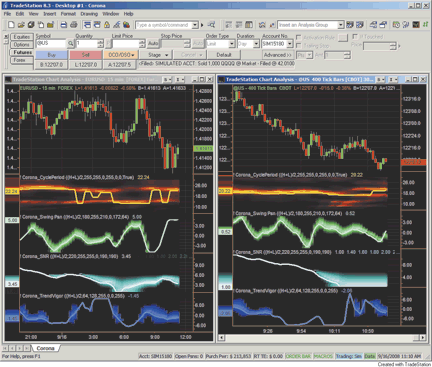

**FIGURE 1: TRADESTATION, CORONA CHARTS AND ITS INDICATORS.** Ehlers's corona indicators shown here are: cycle period, swing position, signal to noise ratio, and trend vigor. The left pane displays a 15-minute chart of the forex symbol EUR/USD. The right pane displays a 400-tick chart of the continuous 30-year bond futures contract.

---

## Wealth-Lab: Corona Charts

**Contributor:** Robert Sucher
**Website:** [www.wealth-lab.com](https://www.wealth-lab.com/)

Even if you don't use corona charts for trading, you still might be able to impress someone with these colorful charts -- my spouse certainly was! We wrapped the indicator creation and plotting in a tidy SuperIndicators method so that all four indicators can be returned to a Strategy script in a single call. The full translation for Wealth-Lab 5 (.NET) WealthScript can be found in the STOCKS & COMMODITIES Traders' Tips section at the Wealth-Lab.com wiki site.

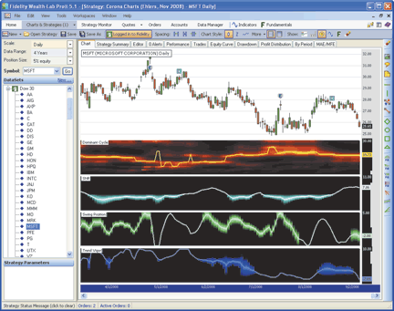

**FIGURE 2: WEALTH-LAB, CORONA CHART.** The trend vigor's ominous corona in June 2008 provided a good warning that MSFT's March--April rally had lost its steam.

**External file:** [`Corona_wealthlab.cs`](Corona_wealthlab.cs)

```csharp
using System;
using System.Collections;
using System.Collections.Generic;
using System.Text;
using System.Drawing;
using WealthLab;
using WealthLab.Indicators;

namespace WealthLab.Strategies
{
   public class CoronaCharts : WealthScript
   {
      public const double twoPi = 2 * Math.PI;
      public const double fourPi = 4 * Math.PI;
      
      public class ArrayHolder
      {   // current, old, older
         internal double I, I2, I3;  
         internal double Q, Q2, Q3;
         internal double R, R2, R3;
         internal double Im, Im2, Im3; 
         internal double A; 
         internal double dB, dB2;  
      }
      
      // Keep cntMax fifo samples and find the Highest and Lowest lead for samples in the list
      
private void PhaseList(ref ArrayList fifo, int cntMax, double lead, out double H, out double L)
      {
         H = lead; L = lead;
         if( fifo.Count < cntMax ) 
            fifo.Add(lead);
         else {
            fifo.RemoveAt(0);
            fifo.Add(lead);
         }
         for (int n = 0; n < fifo.Count - 1; n++) {
            double val = (double)fifo[n];
            if( val > H ) H = val;
            if( val < L ) L = val;
         }
      }
      
      public void SuperIndicators(DataSeries ds, out DataSeries domCycMdn,
         out DataSeries snrSer, out DataSeries psnSer, out DataSeries tvSer)
      // ... (see external file for full implementation)
      
      protected override void Execute()
      {
         DataSeries dc, snr, swing, tv;
         SuperIndicators(AveragePrice.Series(Bars), out dc, out snr, out swing, out tv);
      }
   }
}
```

---

## eSignal: Corona Charts

**Contributor:** Jason Keck, eSignal, a division of Interactive Data Corp.
**Phone:** 800 815-8256
**Website:** [www.esignalcentral.com](https://www.esignalcentral.com/)

For this month's Traders' Tip, we've provided the following eSignal formulas:

- CoronaChartCyclePeriod.efs
- CoronaChartSignalToNoiseRatio.efs
- CoronaChartSwingPosition.efs
- CoronaChartTrendVigor.efs

based on the formula code from John Ehlers's article in this issue, "Corona Charts." To discuss this study or download a complete copy of the eSignal formula code, please visit the EFS Library Discussion Board forum under the Forums link at [www.esignalcentral.com](https://www.esignalcentral.com/) or visit our EFS KnowledgeBase at [www.esignalcentral.com/support/kb/efs/](https://www.esignalcentral.com/support/kb/efs/).

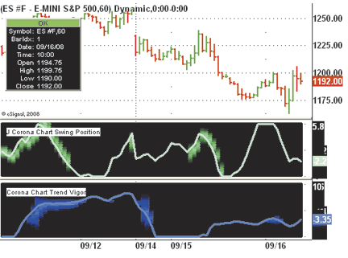

**FIGURE 3: eSIGNAL, CORONA CHART.** This sample eSignal corona chart shows the cycle period and signal-to-noise-ratio indicators.


**FIGURE 4: eSIGNAL, CORONA CHART.** This sample eSignal corona chart shows the swing position and trend vigor indicators.

**External file:** [`Corona_esignal.efs`](Corona_esignal.efs)

```javascript
// Corona Chart Trend Vigor EFS code (excerpt -- see external file for all 4 indicators)

var fpArray = new Array();
var bInit = false;
var bVersion = null;

function preMain() {
    setPriceStudy(false);
    setShowCursorLabel(false);
    setShowTitleParameters( false );
    setStudyTitle("Corona Chart Trend Vigor");
    // ...
}

function main(ViewLine) {
    // Full implementation in Corona_esignal.efs
}
```

---

## AmiBroker: Corona Charts

**Contributor:** Tomasz Janeczko, AmiBroker.com
**Website:** [www.amibroker.com](https://www.amibroker.com/)

In the article "Corona Charts" in this issue, John Ehlers further develops his earlier work on market cycles. A new kind of indicator is presented that uses a glow-like effect to present another dimension of data. Implementation of corona charts in AmiBroker Formula Language (AFL) is based on earlier AmiBroker code that helps detect dominant cycles in data. We have added a new parameter that allows you to switch between spectrum charts and corona charts for swing positions. To use it, simply enter the code in the AmiBroker Formula Editor, then choose the Tools->Apply Indicator menu from the editor. You can use the parameters window (available from the right-click menu) to set the period for the high-pass filter and to switch the chart type.

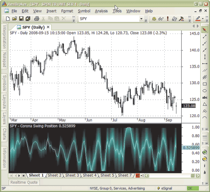

**FIGURE 5: AMIBROKER, CORONA CHART.** The daily chart of SPY is shown in the upper pane with a corona swing chart in the lower pane. A corona is displayed when the market is in a trend and there is little cyclic component.

**External file:** [`Corona_amibroker.afl`](Corona_amibroker.afl)

```afl
SetChartBkGradientFill( ColorRGB(0,0,0), ColorRGB(0,0,0)); 
PI = 3.1415926; 

Data = (H+L)/2; 

// detrending ( high-pass filter ) 
HFPeriods = Param("HP filter cutoff", 30, 20, 100 ); 
alpha1 = ( 1-sin(2*pi/HFPeriods) ) / cos( 2 * pi / HFPeriods ); 
HP = AMA2( Data - Ref( Data, -1 ), 0.5 * ( 1 + alpha1 ), alpha1 ); 

// 6-tap low-pass FIR filter 
SmoothHP  = ( HP + 2 * Ref( HP, -1 ) + 3 * Ref( HP, -2 ) + 
   3 * Ref( HP, -3 ) + 2 * Ref( HP, -4 ) + Ref( HP, -5 ) )/12; 

SmoothHPDiff = SmoothHP - Ref( SmoothHP, -1 ); 

x = BarIndex(); 

delta = -0.015 * x + 0.5; 
delta = Max( delta, 0.15 ); 

Q  = 0; 
Real = 0; 
Imag = 0; 
Ampl = 0; 
DB =  0; 

I = SmoothHP; 

MaxAmpl = 0; 

MinPeriod = 6; 
MaxPeriod = 30; 
PeriodStep = 0.5; 

for( N = MinPeriod; N <= MaxPeriod; N += PeriodStep ) 
{ 
   beta = cos( 2 * PI / N ); 
   Q = ( N / ( 2 * PI ) ) * SmoothHPDiff; 

   for( bar = 12; bar < BarCount; bar++ ) 
   { 
     gamma = 1 / cos( 4 * PI * delta[ bar ] / N ); 
     alpha = gamma - sqrt( gamma * gamma - 1 ); 
     
     Real[ bar ] = 0.5 * ( 1 - alpha ) * ( I[ bar ] - I[ bar - 1 ] ) + 
                   beta * ( 1 + alpha ) * Real[ bar - 1 ] - 
                   alpha * Real[ bar - 2 ]; 

     Imag[ bar ] = 0.5 * ( 1- alpha ) * ( Q[ bar ] - Q[ bar - 1 ] ) + 
                 beta * ( 1 + alpha ) * Imag[ bar - 1 ] - 
                 alpha * Imag[ bar - 2 ]; 
   } 

   Ampl = Real * Real + Imag * Imag; 
   MaxAmpl = Max( MaxAmpl, Ampl ); 
   VarSet("Ampl"+N, Ampl ); 
} 

CoronaSwingPos = ParamToggle("Chart Type", "Spectrum|Corona Swing Pos" ); 

// Plot Heat Map ( Spectrogram ) 
// and find dominant cycle 
DcNum = DcDenom = 0; 
for( N = MinPeriod; N <= MaxPeriod; N += PeriodStep ) 
{ 
   Ampl = VarGet("Ampl"+N); 

   db  = Nz( -10 * log10( 0.01 / ( 1 - 0.99 * Ampl / MaxAmpl ) ) ); 
   db = Min( db, 20 ) ; 

   Red = IIf( db <= 10, 255, 255 * ( 2 - db/10 ) ); 
   Green = IIf( db <= 10, 255 * ( 1 - db/10 ), 0 ); 

   if( NOT CoronaSwingPos ) 
      PlotOHLC( N, N, N-PeriodStep, N-PeriodStep, "", 
       ColorRGB( Red, Green, 0 ), styleCloud | styleNoLabel); 

   DcNum = DcNum + (db <= 6 ) * N * ( 20 - db ); 
   DcDenom = DcDenom + ( db <= 6 ) * ( 20 - db ); 
}     

DC = DcNum / DcDenom; 

if( NOT CoronaSwingPos ) 
{ 
  DomCycle = Median( DC, 5 ); 

  Plot( DomCycle, "Dominant Cycle", colorYellow); 
  Title = EncodeColor( colorWhite ) + "{{NAME}} - Spectrum - DC " + DomCycle; 
} 

if( CoronaSwingPos ) 
{ 
   DomCycle = Median( DC, 5 ); 
   DomCycle = Max( DomCycle, 6 ); 
   BP2 = 0; 
   DataDiff = Data - Ref( Data, -2 ); 

   for( bar = 10; bar < BarCount; bar++ ) 
   { 
     beta = cos( 2 * PI / domCycle[ bar ] ); 
     gamma = 1 / cos( 4 * PI * delta[ bar ] / DomCycle[ bar ] ); 
     alpha = gamma - sqrt( gamma ^ 2 - 1 ); 

     BP2[ bar ] = 0.5 * ( 1 - alpha ) * DataDiff[ bar ] +   
           beta * ( 1 + alpha ) * BP2[ bar - 1 ] - 
           alpha * BP2[ bar - 2 ]; 
   } 

   Q2 = ( domCycle / ( 2 * PI ) ) * ( BP2 - Ref( BP2, -1 ) ); 
   Lead60 = 0.5 * BP2 + 0.866 * Q2; 

   HL = HHV( Lead60, 50 ); 
   LL = LLV( Lead60, 50 ); 

   Psn = ( Lead60 - LL )/( HL - LL ); 

   HL = HHV( Psn, 20 ); 
   LL = LLV( Psn, 20 ); 

   Width = IIf( HL - LL > 0.85, 0.85, ( HL - LL ) ); 

  for( N = 0; N < 50; N++ ) 
  { 
     Raster =  log( Width/( 0.2 + abs( Psn - N/50 ) ) );   

     Raster = Min( 2, Max( 0, Raster ) ); 
     CR =  128*Raster; 
     y = 0.02 * N; 
     PlotOHLC( y, y+0.01, y -0.01, y-0.01, "", ColorRGB( 0, CR, CR ), 
      styleCloud | styleNoLabel ); 
  } 
  Plot( Psn, "", ColorRGB( 0, 255, 255 )); 
  Title = EncodeColor( colorWhite ) + "{{NAME}} - Corona Swing Position " + Psn; 
} 

GraphZOrder = 1; 
```

---

## NeuroShell Trader: Corona Charts

**Contributor:** Marge Sherald, Ward Systems Group, Inc.
**Phone:** 301 662-7950, sales@wardsystems.com
**Website:** [www.neuroshell.com](https://www.neuroshell.com/)

John Ehlers's corona chart indicators can be easily implemented in NeuroShell Trader using NeuroShell Trader's ability to call functions written in standard languages like C, C++, Power Basic, or Delphi. Because the code for this tip is so lengthy, we have elected to use that facility instead of using our "point and click" Indicator Wizard. After moving the EasyLanguage code given in the article to your preferred compiler and creating a dynamic link library (DLL) from it, you can insert the resulting indicators as follows:

1. Select "New Indicator..." from the Insert menu.
2. Choose the External Program & Library Calls category.
3. Select the appropriate External DLL Call indicator.
4. Set up the parameters to match your dynamic link library.
5. Select the Finished button.

Dynamic trading systems can be easily created in NeuroShell Trader by combining the corona chart indicators with the adaptive-length indicators available in John Ehlers's Cybernetic and Mesa8 NeuroShell Trader add-ons. Ehlers suggests that adaptive-length indicators linked to the cycle period indicator, when combined with NeuroShell Trader's genetic optimizer, could produce very robust systems. Users of NeuroShell Trader can go to the STOCKS & COMMODITIES section of the NeuroShell Trader free technical support website to download a copy of any Traders' Tip.

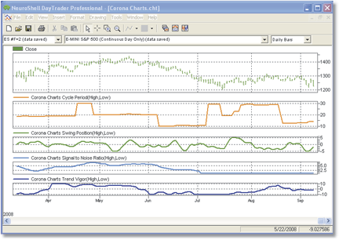

**FIGURE 6: NEUROSHELL, CORONA CHART.** Here is a sample NeuroShell chart demonstrating the corona charts indicators.

---

## Worden Brothers Blocks: The MIDAS Touch

**Contributor:** Bruce Loebrich and Patrick Argo, Worden Brothers, Inc.
**Website:** [www.Blocks.com](https://www.blocks.com/)

Note: To use the indicators and charts in this Traders' Tip, you will need the free Blocks software. Go to www.Blocks.com to download the software and get free US stock charts and scans. The MIDAS and I-MIDAS indicators from Andrew Coles's article in the September 2008 issue, "The Midas Touch," can be implemented in Blocks using RealCode. RealCode is based on the Microsoft Visual Basic.Net framework and uses the Visual Basic (VB) language syntax.

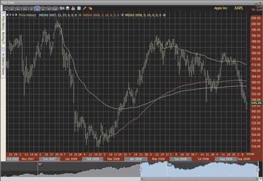

**FIGURE 7: WORDEN BROTHERS BLOCKS, MIDAS CHARTS.** Here, the MIDAS is applied to daily chart of AAPL. After you plot the first instance of MIDAS, you can right-click on the indicator, select "copy," then paste it into the pane again. Then adjust the color and date/time settings for each plot.

**External file:** [`MIDAS_worden.vb`](MIDAS_worden.vb)

```vb
'# Year = UserInput.Integer = 2008
'# Month = UserInput.Integer = 1
'# Day = UserInput.Integer = 1
'# Leave the Hour, Minute, Second values set to 0 for MIDAS.
'# Hour = UserInput.Integer = 0
'# Minute = UserInput.Integer = 0
'# Second = UserInput.integer = 0
Static StartDate As Date
Static CumPrice As Double
Static CumVolume As Double
If isFirstBar Then
        StartDate = New Date(Year,Month,Day,Hour,Minute,Second)
        CumPrice = 0
        CumVolume = 0
End If
If CurrentDate >= StartDate Then
        CumPrice += Price.Last * Volume
        CumVolume += Volume
        Plot = CumPrice / CumVolume
Else
        Plot = Single.NaN
End If
```

---

## AIQ: MOCS Exit Indicator

**Contributor:** Richard Denning, richard.denning@earthlink.net for AIQ Systems
**Website:** [www.aiqsystems.com](https://www.aiqsystems.com/)

The AIQ code for Michael J. Carr's Mocs exit indicator from his August 2008 article, "Relative Strength As A Selling Tool," is given here. Using relative strength as an exit indicator can be very effective and is often overlooked when we are designing exits for our strategies. The relative strength of the stock to the S&P 500 index (RS_SPX) is inserted into the MACD formula in place of the price.

Three indicators are generated:

```
MOCS = 12-bar EMA of RS_SPX - 26 bar EMA of RS_SPX
sigMOCS = 9-bar EMA of MOCS
difMOCS = MOCS - sigMOCS
```

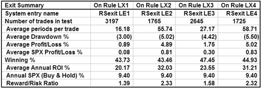

**FIGURE 8: AIQ, MOCS EXIT INDICATOR.** Here is a comparison of four relative strength exits using the MOCS indicator. Exit LX2 had the best metrics compared to the other three approaches.

**External file:** [`MOCS_aiq.txt`](MOCS_aiq.txt)

```text
!! RELATIVE STRENGTH AS A SELLING TOOL
! Author: Michael J. Carr, CMT, TASC Aug 2008
! Coded by: Richard Denning 9/15/08
! www.TradersEdgeSystems.com

C is [close].

! MOMENTUM OF COMPARATIVE STRENGTH (MOCS)
RSspx is C / tickerUDF("SPX",C)*100000.
RSema12 is expavg(RSspx,12).
RSema26 is expavg(RSspx,26).

! MACD FORMULA APPLIED TO RS
MOCS is RSema12 - RSema26.
sigMOCS is expavg(MOCS,9).

difMOCS is  MOCS - sigMOCS.

! ENTRY RULES FOR TESTING EXITS:
LE1 if C > highresult(C,30,1) and difMOCS > 0 and MOCS > 0.
LE2 if LE1.
LE3 if LE1.
LE4 if LE1.

! VARIOUS EXITS USING MOCS:
LX1 if difMOCS < 0.
LX2 if  MOCS < 0.       
LX3 if MOCS < 0 or countof(difMOCS < 0,6)=6 .
LX4 if MOCS < 0 and countof(difMOCS < 0,6)=6 .
```

---

## TradersStudio: Corona Charts

**Contributor:** Richard Denning, richard.denning@earthlink.net for TradersStudio
**Website:** [www.TradersStudio.com](https://www.tradersstudio.com/)

I have prepared TradersStudio code for John Ehlers's article in this issue, "Corona Charts." The corona effects do not show on the indicator panels but instead are shown on a color report. These two figures show the current values for the four indicators and also their relative signal strength, also known as the corona, as represented by the color of the report cell.

The color key is as follows:

```
 Light green = Strong signal with little or no fuzz
Light yellow = Moderately strong signal with some fuzz
      Yellow = Weaker signal with more fuzz
      Yellow = Even weaker signal with even more fuzz
         Red = Very weak signal with a high level of fuzz
       White = No rating regarding signal strength
```

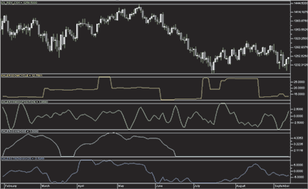

**FIGURE 9: TRADERSTUDIO, CORONA CHARTS.** Here are Ehlers's four indicators as shown on a chart of the emini S&P 500 futures contract.

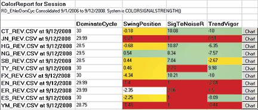

**FIGURE 10: TRADERSTUDIO, COLOR REPORT.** Here is a color report on a portfolio of futures as of September 12, 2008.

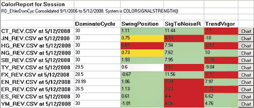

**FIGURE 11: TRADERSTUDIO, COLOR REPORT.** Here is a color report on a portfolio of futures as of May 1, 2008.

**External file:** [`Corona_traderstudio.txt`](Corona_traderstudio.txt)

```vb
Function EhlersDC(colorRGB)
    Dim price As BarArray, DC As BarArray
    Dim HP As BarArray, SmoothHP As BarArray
    ' ... (see external file for full implementation)
    
    alpha1 = (1 - Sin(DegToRad(360/30))) / Cos(DegToRad(360/30))
    HP = .5*(1 + alpha1)*(price - price[1]) + alpha1*HP[1]
    SmoothHP = (HP + 2*HP[1] + 3*HP[2] + 3*HP[3] + 2*HP[4] + HP[5]) / 12
    ' ...
    EhlersDC = DomCyc
End Function
```

---

## Trade Ideas: Fading the Market

**Contributor:** Dan Mirkin, Trade Ideas, LLC
**Website:** [www.trade-ideas.com](https://www.trade-ideas.com/), dan@trade-ideas.com

This strategy fades certain movements to take advantage of our market view that today's markets are -- and will continue to be -- very volatile. Our hypothesis, given this view of the market, states that stocks moving up at least 75 cents in the last minute tend to be lower over the next 15 minutes. The idea is to put short offers out at the time of the alert.

Copy the following string directly into Trade Ideas PRO using the "Collaborate" feature (right-click in any strategy window):

```
https://www.trade-ideas.com/View.php?O=20000000000000000000000000000000000000000000000000000000
_1D_0&QRUN=0.75&MaxPrice=300&MaxSpread=5&MinDNbbo=0.1&MinPrice=10&MinRV=3&MinVol=500000&WN=Over+Extended+Up+Move
```

Alert and filter settings:

- Running up now: 0.75 ($)
- Min price = 10 ($)
- Max price = 300 ($)
- Max spread = 5 (pennies)
- Min distance from inside market = 0.1 (%)
- Min daily volume = 500,000 (shares/day)
- Min current volume = 3 (ratio)

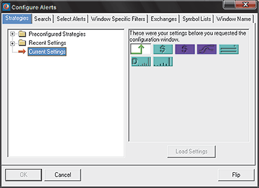

**FIGURE 12: TRADE IDEAS.** Here is the Trade Ideas PRO strategy configuration for the strategy named "Overextended up move."

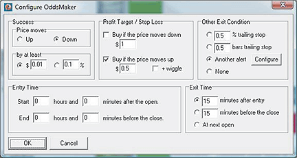

**FIGURE 13: TRADE IDEAS, BACKTESTING.** The trade rules for the strategy are shown here. You can use The OddsMaker facility in Trade Ideas to backtest the strategy.

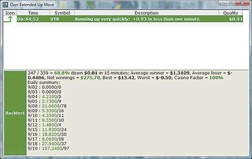

**FIGURE 14: TRADE IDEAS, BACKTEST RESULTS.** Here are sample results from backtesting the "Overextended Up Move" strategy. Results shown here are for the period 9/1/2008 to 9/19/2008.

---

## VT Trader: Guppy Multiple Moving Average (GMMA)

**Contributor:** Chris Skidmore, Visual Trading Systems, LLC (courtesy of CMS Forex)
**Phone:** (866) 51-CMSFX, trading@cmsfx.com
**Website:** [www.cmsfx.com](https://www.cmsfx.com/)

For this month's Traders' Tip, we're revisiting two articles by Daryl Guppy and Chen Jing titled "True Price Value" and "Parallel Listings And True Price Value" from the April 2008 and May 2008 issues of STOCKS & COMMODITIES. In those two articles, Guppy and Jing discuss the role that psychological trading behavior plays in the relationship between price and value using examples from the Chinese and Hong Kong markets.

**External file:** [`GMMA_vttrader.txt`](GMMA_vttrader.txt)

```text
{Provided By: Visual Trading Systems, LLC & Capital Market Services, LLC (c) Copyright 2008}
{Description: Guppy Multiple Moving Average (GMMA)}
{vt_GMMA Version 1.0}

{Short-Term Moving Averages}

ShortMA1:= mov(MaPrice,3,MaType);
ShortMA2:= mov(MaPrice,5,MaType);
ShortMA3:= mov(MaPrice,8,MaType);
ShortMA4:= mov(MaPrice,10,MaType);
ShortMA5:= mov(MaPrice,12,MaType);
ShortMA6:= mov(MaPrice,15,MaType);

{Long-Term Moving Averages}

LongMA1:= mov(MaPrice,30,MaType);
LongMA2:= mov(MaPrice,35,MaType);
LongMA3:= mov(MaPrice,40,MaType);
LongMA4:= mov(MaPrice,45,MaType);
LongMA5:= mov(MaPrice,50,MaType);
LongMA6:= mov(MaPrice,60,MaType);
```

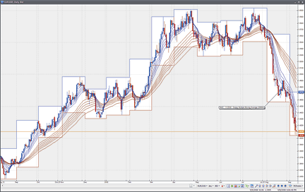

**FIGURE 15: VT TRADER, GUPPY MULTIPLE MOVING AVERAGE.** Here, the GMMA is attached to a EUR/USD daily candle chart.

---

*Originally published in the November 2008 issue of Technical Analysis of STOCKS & COMMODITIES magazine. All rights reserved. Copyright 2008, Technical Analysis, Inc.*
