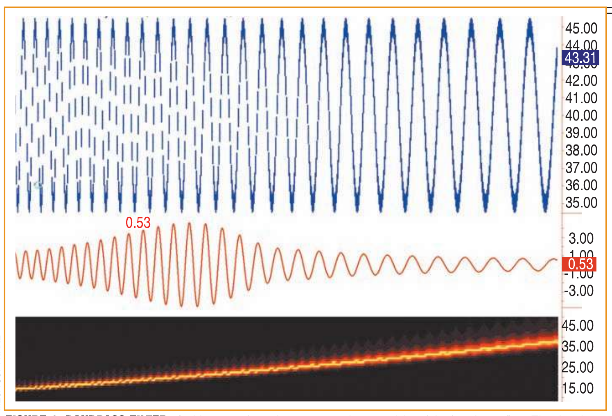
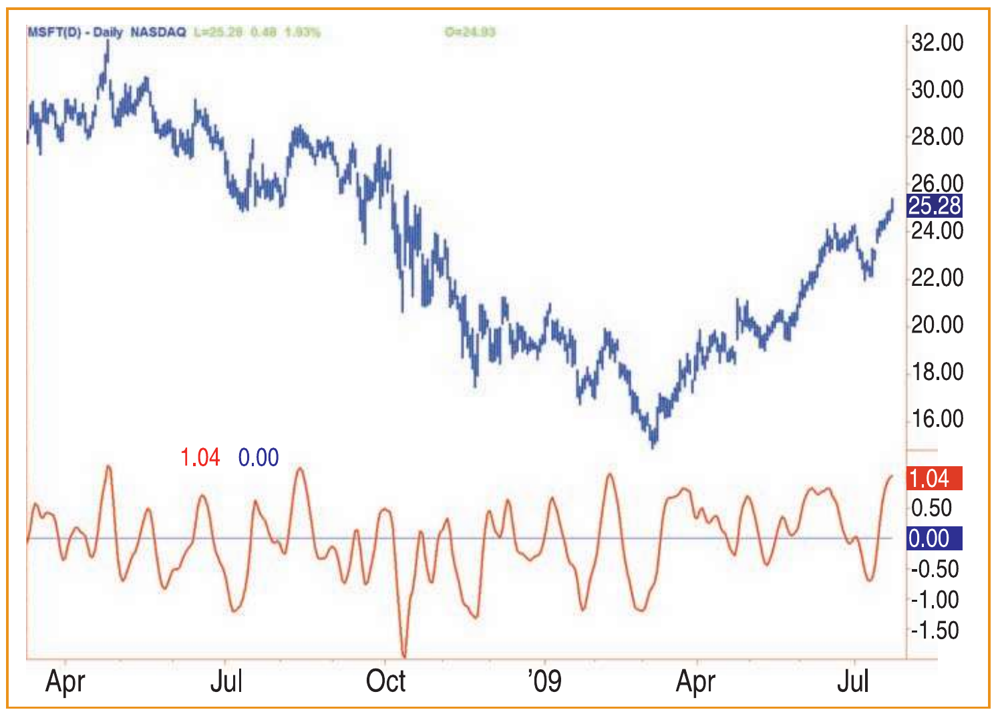
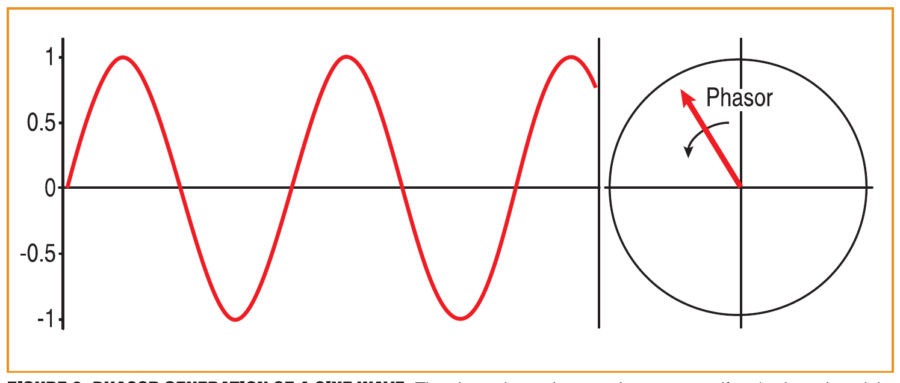
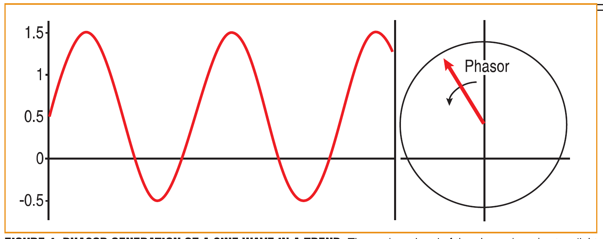
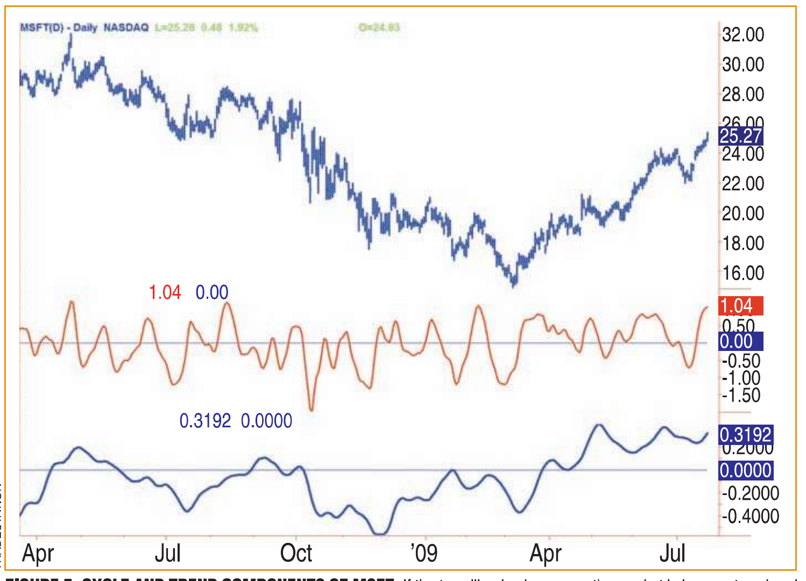
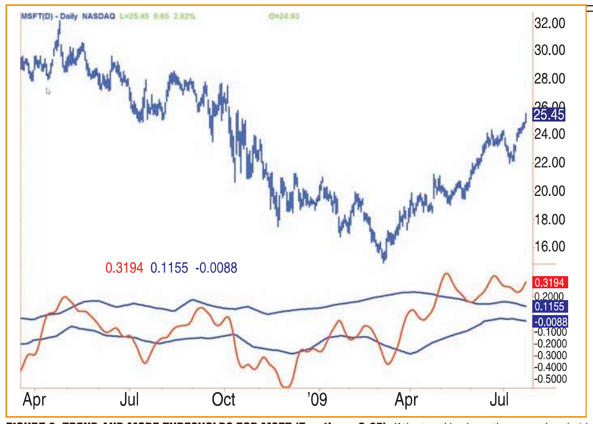

# Empirical Mode Decomposition

*Cycle Vs. Trend Mode Detection*

- **Author:** John F. Ehlers and Ric Way
- **Publication:** Technical Analysis of STOCKS & COMMODITIES, Volume 28, March 2010, pp. 19–24
- **Article URL:** [Article PDF](https://technical.traders.com/archive/article.asp?file=\V28\C03\043EHLR.pdf)
- **Traders' Tips URL:** [Traders' Tips, March 2010](https://www.traders.com/Documentation/FEEDbk_docs/2010/03/TradersTips.html)

---

*Is the market trending or is it in a cycle mode? Identify the mode of the market and trade accordingly.*

Even the most casual chart reader will be able to spot the times when the market is cycling and other times when longer-term trends are in play. Cycling markets are ideal for swing trading. However, attempting to trade the swing in a trending market can be a recipe for disaster. Similarly, applying trend trading techniques during a cycling market can equally wreak havoc in your account. Cycle or trend modes can be identified in hindsight. But it would be useful to have an objective scientific approach to guide you to the current market mode.

A number of tools are already available to differentiate between cycle and trend modes; measuring the trend slope over the cycle period to the amplitude of the cyclic swing is one possibility. However, this article describes a unique approach to determining the market mode.

## Cycle Mode

We begin by thinking of cycle mode in terms of frequency or its inverse, periodicity. The markets are fractal, so daily, weekly, and intraday charts are indistinguishable when time scales are removed. Thus, it is useful to think of the cycle period in terms of its bar count. For example, a 20-bar cycle using daily data corresponds to a cycle period of approximately one month.

When viewed as a wave form, slow-varying price trends constitute the wave form's low-frequency components and day-to-day fluctuations (noise) constitute the high-frequency components. The objective in cycle mode is to filter out the unwanted components — both low-frequency trends and the high-frequency noise — and retain only the range of frequencies over the desired swing period.

A filter for doing this is called a *bandpass* filter and the range of frequencies passed is the filter's bandwidth. The bandpass filter code in EasyLanguage can be found in the sidebar "Bandpass filter code" for convenience. The input variable delta is the approximate half-bandwidth of the filter. For the default settings with delta = 0.1, the filter will pass periods centered at 20 bars +/- two bars. The filter passes cycle components ranging between 18- and 22-bar periods while attenuating frequencies above and below this range. The bandwidth can be expanded by increasing delta. This has the advantage that the filtered prices are more responsive to rapid changes in the cycle periodicity. On the other hand, a tradeoff occurs if delta becomes too small. In this case, the filter has a long memory and can ring out like a bell, having once been energized.


**FIGURE 1: BANDPASS FILTER.** A chirp wave form demonstrates the selectivity of the bandpass filter. The data is an idealized sine wave whose frequency varies continuously from high to low. The bottom subgraph shows the measured cycle period. The subgraph immediately below the input data is the bandpass-filtered output.

Figure 1 demonstrates the action of the bandpass filter. The data is an idealized sine wave whose frequency varies continuously from high to low. The bottom subgraph shows the measured cycle period. The subgraph immediately below the input data is the bandpass-filtered output. This shows how the desired cycle components are passed unattenuated while the undesired low- and high-frequency components are greatly reduced in amplitude. Note that the input data average value of 40 has been removed by the filter, but the full amplitude swing has been retained where the period is 20 bars.


**FIGURE 2: MSFT DATA AND ITS BANDPASS FILTERED OUTPUT (DELTA = 0.5).** The filtered output clearly identifies cyclic turning points and other times when the trend swamps out any possibility of successful swing trading.

Figure 2 demonstrates how the filter works on actual market data. In this case, the data is Microsoft (MSFT) prices over approximately one year. The period of the market cycles has not been measured in advance. Thus, we choose to increase delta to 0.5 so that cycle periods from approximately 10 bars to 30 bars are passed. In addition, expanding the filter bandwidth increases the responsiveness to more rapid changes in the data. The filtered output clearly identifies cyclic turning points (I'll let you line them up with a straightedge) and other times when the trend swamps out any possibility of successful swing trading.

Returning to the theoretical aspects of a cycle, one way to picture the sine wave is as generated by a phasor. The phasor is a unit vector that rotates uniformly about the origin, as shown in Figure 3. A sine wave results from the horizontal projection of the phasor on the vertical axis. This can be visualized as a pen tied to the end of a string with the other end anchored with a nail. The string is rotated counterclockwise while the paper moves beneath the pen like a seismograph or an electrocardiogram. We will use a variation of this phasor diagram to identify market trends.


**FIGURE 3: PHASOR GENERATION OF A SINE WAVE.** The phasor is a unit vector that rotates uniformly about the origin. A sine wave results from the horizontal projection of the phasor on the vertical axis.

## Trend Mode

Market data is seldom as well behaved as technicians would prefer. For example, an uptrend is marked by higher swing highs and higher swing lows. This means that our ideal sine wave generated by the phasor cannot be used without modification because a wave form with higher highs and higher lows will necessarily have a nonzero mean.

However, the nonzero mean of filtered trending data changes relatively slowly compared to the cycle period. Therefore, if we measure the mean (or more approximately, the average) of the cycle, this slow variation is a true reflection of the trend. To see if this is true, let's return to the phasor diagram this time with the anchored end of the phasor at a slight positive vertical offset from the origin. This case is shown in Figure 4.


**FIGURE 4: PHASOR GENERATION OF A SINE WAVE IN A TREND.** The anchored end of the phasor here is at a slight positive vertical offset from the origin. This variation is a true reflection of the trend.

So we now have a method to empirically decompose the market data into a cycle component and a trend component. The cycle component is extracted by bandpass-filtering the data. The trend component is extracted by averaging the bandpass-filtered data over the most recent two cycle periods (to get smoothing without too much lag). This averaging recovers the mean offset of the cycle and is a scaled and smoothed version of the trend.

The EasyLanguage code to decompose to the trend is given in the sidebar "Extracting the trend." Note this code is exactly the same as the bandpass code with the addition of the averaging of the bandpass-filtered data.

The cycle and trend components of MSFT are shown together in Figure 5. Basically, if the trendline is above zero, the market is in an uptrend and if the trendline is below zero, the market is in a downtrend. Cycle mode signals work best when the mean is near zero.


**FIGURE 5: CYCLE AND TREND COMPONENTS OF MSFT.** If the trendline is above zero the market is in an uptrend and if the trendline is below zero the market is in a downtrend. Cycle mode signals work best when the mean is near zero.

## Mode Identification

There must be a better way to determine whether the market is in a cycle mode or trend mode other than gazing at squiggly lines on your computer screen. One approach is to compare the peak swings of the cycle mode to the amplitude of the trend mode. We do this by capturing the peaks and averaging these peaks in a relatively long moving average. Correspondingly, you can capture the valleys and average them in a relatively long moving average. We then take a fraction of these averages as the thresholds between a trend mode and a cycle mode. If the trend is above the upper threshold, the market is in an uptrend. If the trend is below the lower threshold, the market is in a downtrend. When the trend falls between the two threshold levels, the market is in a cycle mode.

The setting of the fraction of the averaged peaks and valleys to be used to establish the thresholds is subjective and can be adjusted to fit your trading style. Personally, we prefer to trade in the cycle mode and therefore set the thresholds relatively far apart. This way, you can stop swing trading when the market is clearly in a trend.

The market mode indicator for the MSFT example is shown in Figure 6, where we have set the fraction input to 0.25. The code for this mode indicator is given in the sidebar "Empirical mode decomposition." Except for the addition of the two threshold levels, this code has the same components as the bandpass filter and the trend indicator.


**FIGURE 6: TREND AND MODE THRESHOLDS FOR MSFT (Fraction = 0.25).** If the trend is above the upper threshold the market is in an uptrend. If the trend is below the lower threshold the market is in a downtrend. When the trend falls between the two threshold levels the market is in a cycle mode.

## Cycle or Trend

The cycle mode component of market activity can be clearly identified using a bandpass filter. The bandwidth of the filter can be narrowed if the cycle period is known with relative accuracy. Otherwise, the filter bandwidth can be widened to capture a broader range of cyclic activity. Since higher swing highs and higher swing lows are experienced in uptrending markets, the uptrend can be identified by the positive average of the filtered data over an integer number of cycle periods. Similarly, lower swing highs and lower swing lows are typical in downtrending markets.

Downtrends can be identified by the negative average of the filtered data over an integer number of cycle periods. The delineation between the cycle mode and trend mode can be made by comparing a fraction of the averaged cycle peaks and valleys to the trendline derived using empirical mode decomposition.

## Bandpass Filter Code, In EasyLanguage

```easylanguage
Inputs:
    Price((H+L)/2),
    Period(20),
    delta(.1);

Vars:
    gamma(0),
    alpha(0),
    beta(0),
    BP(0);

beta = Cosine(360 / Period);
gamma = 1 / Cosine(720*delta / Period);
alpha = gamma - SquareRoot(gamma*gamma - 1);
BP = .5*(1 - alpha)*(Price - Price[2]) + beta*(1 + alpha)*BP[1] - alpha*BP[2];

Plot1(BP);
Plot2(0);
```

## Extracting The Trend, In EasyLanguage

```easylanguage
Inputs:
    Price((H+L)/2),
    Period(20),
    Delta(.1);

Vars:
    gamma(0),
    alpha(0),
    beta(0),
    BP(0),
    Trend(0);

beta = Cosine(360 / Period);
gamma = 1 / Cosine(720*delta / Period);
alpha = gamma - SquareRoot(gamma*gamma - 1);
BP = .5*(1 - alpha)*(Price - Price[2]) + beta*(1 + alpha)*BP[1] - alpha*BP[2];
Trend = Average(BP, 2*Period);

Plot1(Trend);
Plot2(0);
```

## Empirical Mode Decomposition, In EasyLanguage

```easylanguage
Inputs:
    Price((H+L)/2),
    Period(20),
    delta(.5),
    Fraction(.1);

Vars:
    alpha(0),
    beta(0),
    gamma(0),
    BP(0),
    I(0),
    Mean(0),
    Peak(0),
    Valley(0),
    AvgPeak(0),
    AvgValley(0);

beta = Cosine(360 / Period);
gamma = 1 / Cosine(720*delta / Period);
alpha = gamma - SquareRoot(gamma*gamma - 1);
BP = .5*(1 - alpha)*(Price - Price[2]) + beta*(1 + alpha)*BP[1] - alpha*BP[2];
Mean = Average(BP, 2*Period);

Peak = Peak[1];
Valley = Valley[1];

If BP[1] > BP and BP[1] > BP[2] Then Peak = BP[1];
If BP[1] < BP and BP[1] < BP[2] Then Valley = BP[1];

AvgPeak = Average(Peak, 50);
AvgValley = Average(Valley, 50);

Plot1(Mean);
Plot2(Fraction*AvgPeak);
Plot6(Fraction*AvgValley);
```

## About The Authors

John Ehlers is a pioneer in the use of cycles and DSP techniques in technical analysis. He is the author of the MESA8 program and is the chief scientist for www.isignals.com. Ric Way is an independent software developer specializing in programming algorithmic trading systems in C#. He may be reached at ricway@taosgroup.org.

## Suggested Reading

Ehlers, John F. [2008]. "Corona Charts," *Technical Analysis of* STOCKS & COMMODITIES, Volume 26: November.

‡MESA Software ‡TradeStation ‡EasyLanguage

---

*See our Traders' Tips section beginning on page 67 for program code implementing John Ehlers' technique.*

---

## BibTeX

```bibtex
@article{ehlers_way_empirical_mode_decomposition_2010,
  author    = {John F. Ehlers and Ric Way},
  title     = {Empirical Mode Decomposition},
  journal   = {Technical Analysis of STOCKS \& COMMODITIES},
  volume    = {28},
  number    = {3},
  pages     = {19--24},
  year      = {2010},
  month     = mar,
  publisher = {Technical Analysis, Inc.},
  howpublished = {online},
  url       = {https://technical.traders.com/archive/article.asp?file=\V28\C03\043EHLR.pdf}
}

@misc{traders_tips_2010_03,
  author       = {{Technical Analysis of STOCKS \& COMMODITIES}},
  title        = {Traders' Tips: Empirical Mode Decomposition},
  year         = {2010},
  month        = mar,
  howpublished = {online},
  url          = {https://www.traders.com/Documentation/FEEDbk_docs/2010/03/TradersTips.html}
}
```
