```bibtex
@misc{tasc_traders_tips_2010_03,
  title   = {Traders' Tips: Empirical Mode Decomposition},
  author  = {{Technical Analysis, Inc.}},
  journal = {Technical Analysis of Stocks \& Commodities},
  year    = {2010},
  month   = {3},
  url     = {https://www.traders.com/Documentation/FEEDbk_docs/2010/03/TradersTips.html},
  note    = {Traders' Tips based on ``Empirical Mode Decomposition'' by John Ehlers and Ric Way}
}
```

# Traders' Tips — March 2010

This month's Traders' Tips are based on "Empirical Mode Decomposition" by John Ehlers and Ric Way, which presents methods based on bandpass filtering to distinguish *trending* from *cycling* markets.

---

## TradeStation: Empirical Mode Decomposition

**Contributor:** Mark Mills, TradeStation Securities, Inc.

The article's trading suggestions were used to create the EmpiricalMode strategy for TradeStation. If the strategy determines the market is in trending mode, it trades with the trend. If in cycling mode, it trades cycle extremes using Bollinger bands to trigger entries.

**Download:** Search for "EmpiricalMode.eld" at the [TradeStation forum](https://www.tradestation.com/Discussions/forum.aspx?Forum_ID=213).

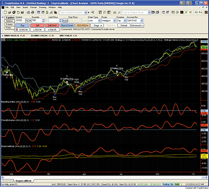

**Figure 1:** A daily chart of Google (GOOG) showing the empirical mode decomposition studies. Upper subgraph: daily price bars and ModeTrader strategy trades. Subgraph 2: band-pass filter. Subgraph 3: TrendExtraction indicator. Subgraph 4: EmpiricalMode indicator.

**External file:** [`EMD_tradestation.els`](EMD_tradestation.els)

```easylanguage
Indicator:  BandPassFilter
inputs:
	Price( 0.5 * ( High + Low ) ),
	Period( 20 ),
	Delta1( 0.1 ) ;

variables:
	Beta1( 0 ),
	Gamma1( 0 ),
	Alpha( 0 ),
	HalfAlphaDiff( 0 ),
	Beta1OnePlusAlpha( 0 ),
	BP( 0 ) ;

Beta1 = Cosine( 360 / Period ) ;
Gamma1 = 1 / Cosine( 720 * Delta1 / Period ) ;
Alpha = Gamma1 - SquareRoot( Square( Gamma1 ) - 1 ) ;
HalfAlphaDiff = 0.5 * ( 1 - Alpha ) ;
Beta1OnePlusAlpha = Beta1 * ( 1 + Alpha ) ;
BP = HalfAlphaDiff * ( Price - Price[2] ) +
 Beta1OnePlusAlpha * BP[1] - Alpha * BP[2] ;

Plot1( BP, "BandPass" ) ;
Plot2( 0, "Zero" ) ;

Indicator:  TrendExtractor
inputs:
	Price( 0.5 * ( High + Low ) ),
	Period( 20 ),
	Delta1( 0.1 ) ;

variables:
	Beta1( 0 ),
	Gamma1( 0 ),
	Alpha( 0 ),
	HalfAlphaDiff( 0 ),
	Beta1OnePlusAlpha( 0 ),
	BP( 0 ),
	Trend( 0 ) ;

Beta1 = Cosine( 360 / Period ) ;
Gamma1 = 1 / Cosine( 720 * Delta1 / Period ) ;
Alpha = Gamma1 - SquareRoot( Square( Gamma1 ) - 1 ) ;
HalfAlphaDiff = 0.5 * ( 1 - Alpha ) ;
Beta1OnePlusAlpha = Beta1 * ( 1 + Alpha ) ;
BP = HalfAlphaDiff * ( Price - Price[2] ) +
 Beta1OnePlusAlpha * BP[1] - Alpha * BP[2] ;
Trend = Average( BP, 2 * Period ) ;

Plot1( Trend, "Trend" ) ;
Plot2( 0, "Zero" ) ;

Indicator:  EmpiricalMode
inputs:
	Price( 0.5 * ( High + Low ) ),
	Period( 20 ),
	Delta1( 0.5 ),
	Fraction( 0.1 ) ;

variables:
	Beta1( 0 ),
	Gamma1( 0 ),
	Alpha( 0 ),
	HalfAlphaDiff( 0 ),
	Beta1OnePlusAlpha( 0 ),
	BP( 0 ),
	Trend( 0 ),
	Peak( 0 ),
	Valley( 0 ),
	AvgPeak( 0 ),
	FracAvgPeak( 0 ),
	AvgValley( 0 ),
	FracAvgValley( 0 ) ;

Beta1 = Cosine( 360 / Period ) ;
Gamma1 = 1 / Cosine( 720 * Delta1 / Period ) ;
Alpha = Gamma1 - SquareRoot( Square( Gamma1 ) - 1 ) ;
HalfAlphaDiff = 0.5 * ( 1 - Alpha ) ;
Beta1OnePlusAlpha = Beta1 * ( 1 + Alpha ) ;
BP = HalfAlphaDiff * ( Price - Price[2] ) +
 Beta1OnePlusAlpha * BP[1] - Alpha * BP[2] ;
Trend = Average( BP, 2 * Period ) ;

if BP[1] > BP and BP[1] > BP[2] then 
	Peak = BP[1]
else if BP[1] < BP and BP[1] < BP[2] then 
	Valley = BP[1] ;

AvgPeak = Average( Peak, 50 ) ;
FracAvgPeak = Fraction * AvgPeak ;
AvgValley = Average( Valley, 50 ) ;
FracAvgValley = Fraction * AvgValley ;

Plot1( Trend, "Trend" ) ;
Plot2( FracAvgPeak, "AvgPeak" ) ;
Plot3( FracAvgValley, "AvgValley" ) ;

Strategy:  ModeTrader
inputs:
	TradingMode( 1 { 1 = Trend, 2 = Cycle } ),
	Price( 0.5 * ( High + Low ) ),
	Period( 20 ),
	Delta1( 0.5 ),
	Fraction( 0.1 ),
	PctTrail( 3 ),
	NumDevs( 2 ) ;

variables:
	Beta1( 0 ),
	Gamma1( 0 ),
	Alpha( 0 ),
	HalfAlphaDiff( 0 ),
	Beta1OnePlusAlpha( 0 ),
	BP( 0 ),
	Trend( 0 ),
	Peak( 0 ),
	Valley( 0 ),
	AvgPeak( 0 ),
	FracAvgPeak( 0 ),
	AvgValley( 0 ),
	FracAvgValley( 0 ),
	LowerBand( 0 ),
	UpperBand( 0 ) ;

Once
	if TradingMode <> 1 and TradingMode <> 2 then
		RaiseRunTimeError( "TradingMode must be 1" +
	 	 " or 2." ) ;

Beta1 = Cosine( 360 / Period ) ;
Gamma1 = 1 / Cosine( 720 * Delta1 / Period ) ;
Alpha = Gamma1 - SquareRoot( Square( Gamma1 ) - 1 ) ;
HalfAlphaDiff = 0.5 * ( 1 - Alpha ) ;
Beta1OnePlusAlpha = Beta1 * ( 1 + Alpha ) ;
BP = HalfAlphaDiff * ( Price - Price[2] ) +
 Beta1OnePlusAlpha * BP[1] - Alpha * BP[2] ;
Trend = Average( BP, 2 * Period ) ;

if BP[1] > BP and BP[1] > BP[2] then 
	Peak = BP[1]
else if BP[1] < BP and BP[1] < BP[2] then 
	Valley = BP[1] ;

AvgPeak = Average( Peak, 50 ) ;
FracAvgPeak = Fraction * AvgPeak ;
AvgValley = Average( Valley, 50 ) ;
FracAvgValley = Fraction * AvgValley ;

if TradingMode = 1 then
	if Trend crosses over FracAvgPeak then 
		Buy next bar market
	else if Trend crosses under FracAvgValley then
		Sell Short next bar at market ;

LowerBand = BollingerBand( Price, Period, - NumDevs ) ;
UpperBand = BollingerBand( Price, Period, NumDevs ) ;

if CurrentBar > 1 
	and TradingMode = 2 
	and Trend > FracAvgValley 
	and Trend < FracAvgPeak
then 
	if Price crosses over LowerBand then
		Buy ( "BBandLE" ) next bar LowerBand stop 
	else if Price crosses under UpperBand then
		SellShort ( "BBandSE" ) next bar at UpperBand
		 stop ;

SetStopShare ;
SetDollarTrailing( Price * PctTrail * 0.01 ) ;
```

---

## eSignal: Empirical Mode Decomposition

**Contributor:** Jason Keck, eSignal, a division of Interactive Data Corp.

Three formulas provided: BandpassFilter.efs, ExtractingTrend.efs, and EmpiricalModeDecomposition.efs. All contain parameters *length*, *delta*, and *price* (price source). The EMD formula also contains *fraction*.

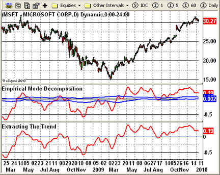

**Figure 2:** eSignal, Empirical Mode Decomposition.

**External files:**
- [`EMD_BandpassFilter_esignal.efs`](EMD_BandpassFilter_esignal.efs)
- [`EMD_ExtractingTrend_esignal.efs`](EMD_ExtractingTrend_esignal.efs)
- [`EMD_esignal.efs`](EMD_esignal.efs) (EmpiricalModeDecomposition)

```javascript
/*********************************
Provided By:
   eSignal (Copyright c eSignal), a division of Interactive Data
   Corporation. 2010. All rights reserved.

Description:        Bandpass Filter
Version:            1.00  01/08/2010
**********************************/
// See EMD_BandpassFilter_esignal.efs for full code

/*********************************
Description:        Extracting The Trend
Version:            1.00  01/08/2010
**********************************/
// See EMD_ExtractingTrend_esignal.efs for full code

/*********************************
Description:        Empirical Mode Decomposition
Version:            1.00  01/08/2010
**********************************/
// See EMD_esignal.efs for full code
```

---

## MetaStock: Empirical Mode Decomposition

**Contributor:** William Golson, MetaStock Technical Support

Three indicators for MetaStock: Bandpass, Extracting the Trend, and Empirical Mode Decomposition.

**External file:** [`EMD_metastock.txt`](EMD_metastock.txt)

```text
{ Bandpass }
prd:=Input("number of periods",5,200,20);
dlta:=Input("Delta",0.01,5,0.1);
plot:=MP();

beta:=Cos(360/prd);
gam:=1/Cos((720*dlta)/prd);
alpha:=gam-Sqrt(gam*gam-1);
bp:=.5*(1-alpha)*(plot-Ref(plot,-2))+beta*(1+alpha)*PREV-alpha*Ref(PREV,-1);
bp
```

```text
{ Extracting the Trend }
prd:=Input("number of periods",5,200,20);
dlta:=Input("Delta",0.01,5,0.1);
plot:=MP();

beta:=Cos(360/prd);
gam:=1/Cos((720*dlta)/prd);
alpha:=gam-Sqrt(gam*gam-1);
bp:=.5*(1-alpha)*(plot-Ref(plot,-2))+beta*(1+alpha)*PREV-alpha*Ref(PREV,-1);
Mov(bp,2*prd,S)
```

```text
{ Empirical Mode Decomposition }
prd:=Input("number of periods",5,200,20);
dlta:=Input("Delta",0.01,5,0.1);
fra:=Input("fraction",0.01, 0.5, 0.1);
plot:=MP();

beta:=Cos(360/prd);
gam:=1/Cos((720*dlta)/prd);
alpha:=gam-Sqrt(gam*gam-1);
bp:=.5*(1-alpha)*(plot-Ref(plot,-2))+beta*(1+alpha)*PREV-alpha*Ref(PREV,-1);
pk:= If(Ref(bp,-1)>Max(bp,Ref(bp,-2)), Ref(bp,-1),PREV);
va:= If(Ref(bp,-1)<Min(bp,Ref(bp,-2)), Ref(bp,-1),PREV);
abp:=Mov(bp,2*prd,S);
apk:=Mov(pk,50,S);
ava:=Mov(va,50,S);
abp;
fra*apk;
fra*ava
```

---

## Wealth-Lab: Empirical Mode Decomposition

**Contributor:** Robert Sucher, www.wealth-lab.com

A combined script with sample strategy in C# for Wealth-Lab 5. The strategy enters long when the cycle turns up within the threshold zone and exits on a 4% closing profit or after five bars.

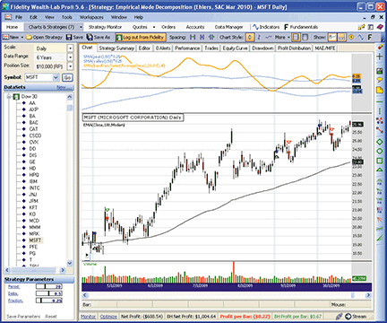

**Figure 3:** Representative trades from the sample Wealth-Lab strategy based on EMD.

**External file:** [`EMD_wealthlab.cs`](EMD_wealthlab.cs)

```csharp
using System;
using System.Collections.Generic;
using System.Text;
using System.Drawing;
using WealthLab;
using WealthLab.Indicators;

namespace WealthLab.Strategies
{
   public class EmpiricalModeDecomp : WealthScript
   {
      StrategyParameter _period;
      StrategyParameter _delta;
      StrategyParameter _fraction;
      
      public EmpiricalModeDecomp()
      {
         _period = CreateParameter("Period", 20, 5, 50, 1);
         _delta = CreateParameter("Delta", 0.5, 0.05, 1, 0.05);
         _fraction = CreateParameter("Fraction", 0.25, 0.1, 1, 0.05);
      }

      public DataSeries BandPassSeries(DataSeries ds, int period, double delta)
      {
         DataSeries res = new DataSeries(ds, "BandPassSeries(" + ds.Description + "," + period + "," + delta + ")");
         double beta = Math.Cos(2 * Math.PI / period);
         double gamma = 1/ Math.Cos(4 * Math.PI * delta / period);
         double alpha = gamma - Math.Sqrt(gamma * gamma - 1d);
         
         for (int bar = 2; bar < ds.Count; bar++)
         {
            res[bar] = 0.5 * (1 - alpha) * (ds[bar] - ds[bar - 2])
               + beta * (1 + alpha) * res[bar - 1] - alpha * res[bar - 2];
         }         
         return res; 
      }
      
      protected override void Execute()
      {            
         int per = _period.ValueInt;
         double delta = _delta.Value;
         double fraction = _fraction.Value;
         
         DataSeries bp = BandPassSeries(AveragePrice.Series(Bars), per, delta);
         DataSeries ema = EMA.Series(Close, 100, EMACalculation.Modern);
         DataSeries mean = SMA.Series(bp, 2 * per);
         mean.Description = "SMA(" + bp.Description + "," + 2 * per + ")";
         DataSeries peak = new DataSeries(Bars, "peak()");
         DataSeries valley = new DataSeries(Bars, "valley()");
         double pk = 0d; 
         double v = 0d;
         for(int bar = 2; bar < Bars.Count; bar++)
         {            
            if( bp[bar-1] > bp[bar] && bp[bar-1] > bp[bar-2] ) 
               pk = bp[bar - 1];
            if( bp[bar-1] < bp[bar] && bp[bar-1] < bp[bar-2] ) 
               v = bp[bar-1];
            peak[bar] = pk;
            valley[bar] = v;
         }         
         int avgPer = (int)(2.5 * per);
         DataSeries avgPeak = fraction * SMA.Series(peak, avgPer);
         DataSeries avgValley = fraction * SMA.Series(valley, avgPer);
         
         ChartPane cp = CreatePane( 40, true, false );
         DrawHorzLine(cp, 0d, Color.Black, LineStyle.Dashed, 1);
         PlotSeries(PricePane, ema, Color.Black, LineStyle.Solid, 1);
         PlotSeries(cp, avgPeak, Color.DodgerBlue, LineStyle.Solid, 1);
         PlotSeries(cp, avgValley, Color.DodgerBlue, LineStyle.Solid, 1);
         PlotSeries(cp, mean, Color.Orange, LineStyle.Solid, 2);
         
         /* Sample Trading Strategy */
         for (int bar = 2 * 100; bar < Bars.Count; bar++)
         {
            bool setup = mean[bar] > avgValley[bar] 
               && mean[bar] < avgPeak[bar]
               && ema[bar] > ema[bar-1];
            
            if (IsLastPositionActive)
            {
               Position p = LastPosition;
               if (bar - p.EntryBar > 4)
                  SellAtMarket(bar + 1, p, "Time Based");
               else if (Close[bar] > p.EntryPrice * 1.04)
                  SellAtClose(bar, p, "Profit Target");
            }
            else if ( setup && TurnUp(bar, mean) )
            {               
               SetBackgroundColor(bar, Color.LightCyan);
               BuyAtMarket(bar + 1);   
            }
         }
      }
   }
}
```

---

## AmiBroker: Empirical Mode Decomposition

**Contributor:** Tomasz Janeczko, AmiBroker.com

Bandpass filtering implemented in AmiBroker Formula Language with a `Poly2ndOrder` helper function. Use ParamToggle to switch between Cycle and Trend display modes.

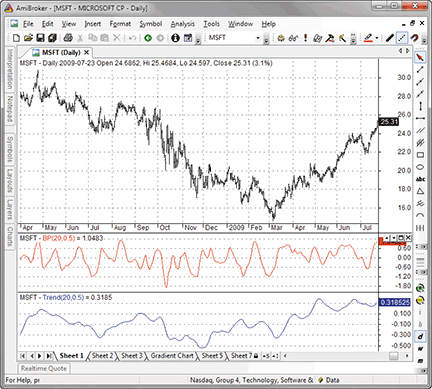

**Figure 4:** Cycle (middle pane) and trend (bottom pane) components for MSFT.

**External file:** [`EMD_amibroker.afl`](EMD_amibroker.afl)

```afl
SetBarsRequired( sbrAll );
PI = 3.1415926;

function Poly2ndOrder( input, N, c0, c1, b0, b1, b2, a1, a2 )
{
   output = input;
  for( i = Max( N, 2 ); i < BarCount; i++ )
  {
     output[ i ] =   c0[ i ] * ( b0 * input[ i ] +
                                 b1 * input[ i - 1 ] +
                                 b2 * input[ i - 2 ] ) +
                     a1 * output[ i - 1 ] +
                     a2 * output[ i - 2 ] -
                     c1 * input[ i - N ];
  }
  return output;
}

function BandPass( input, Period, delta )
{
   N = 0;
   c0 = b0 = 1;
   c1 = b1 = b2 = a1 = a2 = gamma1 = 0;
   beta1 = cos( 2 * PI / Period );
   gamma1 = 1 / cos( 4 * PI * delta / Period );
   alpha = gamma1 - sqrt( gamma1 ^ 2 - 1 );
   a1 = beta1 * ( 1 + alpha );
   a2 = - alpha;
   c0 = ( 1 - alpha ) / 2;
   b2 = -1;
   return Poly2ndOrder( input, N, c0, c1, b0, b1, b2, a1, a2 );
}

Period = Param("Period", 20, 2, 100 );
Delta = Param("Delta", 0.5, 0.01, 1, 0.01 );

BP = BandPass( (H+L)/2, Period, Delta );
Trend = MA( BP, 2 * Period );

if( ParamToggle("Mode", "Cycle|Trend", 0 ) == 0 )
 Plot( BP, "BP"+_PARAM_VALUES(), colorRed );
else
 Plot( Trend, "Trend"+_PARAM_VALUES(), colorBlue );
```

---

## Worden Brothers StockFinder: Empirical Mode Decomposition

**Contributors:** Bruce Loebrich and Patrick Argo, Worden Brothers, Inc.

Implemented using RealCode (VB.NET). The indicator plots the empirical mode decomposition line along with peak and valley thresholds.

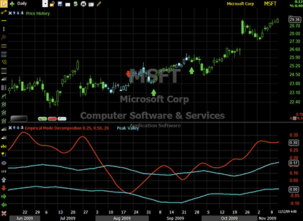

**Figure 5:** The EMD line with peak/valley lines identifying cycling (cyan bars), uptrend (green arrows), and downtrend (red arrows).

**External file:** [`EMD_stockfinder.vb`](EMD_stockfinder.vb)

```vbnet
'# Cumulative
'# Period = UserInput.Integer = 20
'# Delta = UserInput.Single = 0.5
'# Fraction = UserInput.Single = 0.1
Static gamma As Single
Static alpha As Single
Static beta As Single
Static BP(2,2) As Single
Static Offset(2) As Integer
Static Trend As Single
Static Peak(1) As Single
Static Valley(1) As Single
Static AvgPeak As Single
Static AvgValley As Single
If isFirstBar Then
	beta = Math.Cos((360 / Period) * Math.PI / 180)
	gamma = 1 / Math.Cos((720 * delta / Period) * Math.PI / 180)
	alpha = gamma - ((gamma * gamma - 1) ^ .5)
	' ... initialization continues
End If
' See EMD_stockfinder.vb for full code
```

---

## NeuroShell Trader: Empirical Mode Decomposition

**Contributor:** Marge Sherald, Ward Systems Group, Inc.

The bandpass filter can be implemented as a compiled DLL in C/C++/Power Basic/Delphi. The EMD trend and threshold indicators are built from it using NeuroShell's Indicator Wizard.

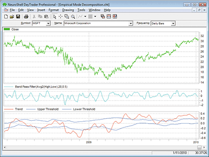

**Figure 6:** Bandpass filter, trend, and EMD trend/threshold indicators.

**External file:** [`EMD_neuroshell.txt`](EMD_neuroshell.txt)

```text
BP:
BandPassFilter( Avg2( High, Low), 20, 0.5 )

Trend:
MovAvg ( BP, 40 )

Upper threshold:
Multiply2 ( 0.25 , MovAvg ( SelectiveLag ( Lag(BP,1) , And2( A>B( Lag(BP,1), BP ), A>B( Lag(BP,1), Lag(BP,2) ) ), 1 ), 50 ) )

Lower threshold:
Multiply2 ( 0.25 , MovAvg ( SelectiveLag ( Lag(BP,1) , And2( A<B( Lag(BP,1), BP ), A<B( Lag(BP,1), Lag(BP,2) ) ), 1 ), 50 ) )
```

---

## AIQ: Flat-Base Breakout System

**Contributor:** Richard Denning, for AIQ Systems

Note: This tip is based on "The Search for Your Trading Style" by Donald Pendergast (TASC January 2010), not the EMD article. It implements a flat-base breakout system with a 55-day base, declining volatility filter, and Chaikin money flow.

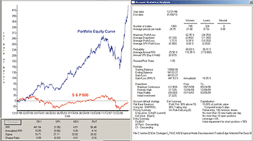

**Figure 7:** Equity curve for the flat-base breakout system (Dec 1998 to Jan 2010).

**External file:** [`FlatBaseBreakout_aiq.txt`](FlatBaseBreakout_aiq.txt)

```text
! FLAT BASE BREAKOUT
! From the article named "The Search for Your Trading Style"
! Author: Donald Pendergast, TASC January 2010
! Coded by: Richard Denning 1/09/10

baseLen is 55.
bsATR	is 5.
stpATR	is 3.
atrLen	is 7.
cmfLen	is 100.
minPrice	is 5.
minVme	is 3000. 

! See FlatBaseBreakout_aiq.txt for full code
```

---

## TradersStudio: Empirical Mode Decomposition

**Contributor:** Richard Denning, for TradersStudio

Indicator code plus a simple trend-following system: go long when the mean crosses over AvgPeak, exit when it crosses back under; go short when mean crosses under AvgValley, exit when it crosses back over.

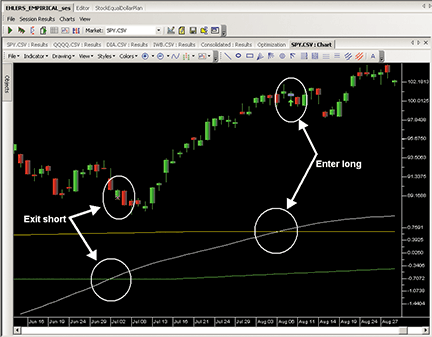

**Figure 8:** The empirical indicator with entry/exit signals.

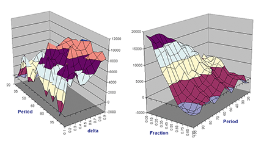

**Figure 9:** Three-dimensional parameter map for the trend-following system.

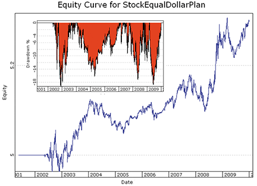

**Figure 10:** Log equity (blue) and underwater equity (red) curves for a portfolio of SPY, DIA, QQQQ, IWB (June 2002 to December 2009).

Code available at [TradersStudio](https://www.tradersstudio.com) and [TradersEdgeSystems](https://www.tradersedgesystems.com/traderstips.htm).

---

## TradingSolutions: Empirical Mode Decomposition

**Contributor:** Gary Geniesse, NeuroDimension, Inc.

Functions implemented: EBPF_Beta, EBPF_Gamma, EBPF_Alpha, EBPF (Bandpass Filter), EBPF_Trend, EBPF_Peak, EBPF_Valley, EBPF_Upper, EBPF_Lower.

**External file:** [`EMD_tradingsolutions.txt`](EMD_tradingsolutions.txt)

```text
Function Name: Ehlers Bandpass Filter
Short Name: EBPF
Inputs: Price, Period, Delta
Sub (Add (Mult (0.5, Mult (Sub (1, EBPF_Alpha (Period, Delta)), Sub (Price, Lag (Price, 2)))), Mult (Mult (EBPF_Beta (Period), Add (1, EBPF_Alpha (Period, Delta))), Prev (1))), Mult (EBPF_Alpha (Period, Delta), Prev (2)))

// See EMD_tradingsolutions.txt for all function definitions
```

---

## Tradecision: Empirical Mode Decomposition

**Contributor:** Yana Timofeeva, Alyuda Research

Four indicators: Bandpass Filter, Extracting the Trend, EMD Peak, and EMD Valley.

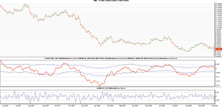

**Figure 11:** Bandpass filter and trend with mode thresholds (Fraction = 0.2). Above upper threshold = uptrend; below lower threshold = downtrend; between = cycle mode.

**External file:** [`EMD_tradecision.txt`](EMD_tradecision.txt)

```text
BANDPASS FILTER indicator:
input
Price:"Enter the Price:", MedianPrice;
Period:"Enter the Period:", 20;
Delta:"Enter the Delta:", 0.1;
end_input

var
gamma:=0; alpha:=0; beta:=0; BP1:=0; BP2:=0; BP:=0;
end_var

beta:=Cos(360 / Period);
gamma:=1 / Cos(720 * delta / Period);
alpha:=gamma - SquareRoot(gamma * gamma - 1);
BP1:=0.5 * (1 - alpha) * (Price - Price\2\);
BP2:=BP1 + beta * (1 + alpha) * BP1\1\ ;
BP:=BP2 - alpha * BP1\2\;
return BP;

// See EMD_tradecision.txt for all indicators
```

---

## NinjaTrader: Empirical Mode Decomposition

**Contributors:** Raymond Deux & Austin Pivarnik, NinjaTrader, LLC

The EMD indicator is available for download at [NinjaTrader](https://www.ninjatrader.com/SC/March2010SC.zip). Import via File > Utilities > Import NinjaScript. Requires NinjaTrader 6.5 or greater.

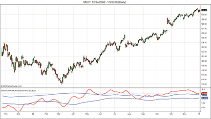

**Figure 12:** EMD indicator applied to a daily chart of Microsoft (MSFT).

**External files:** [`ninja-trader/EmpiricalModeDecomposition.cs`](ninja-trader/EmpiricalModeDecomposition.cs), [`ninja-trader/@SMA.cs`](ninja-trader/@SMA.cs)

---

## NeoTicker: Empirical Mode Decomposition

**Contributor:** TickQuest, Inc.

Three indicators using NeoTicker's formula language: Bandpass Filter, Extracting the Trend, and Empirical Mode Decomposition. A `deg2rad` function simulates EasyLanguage's degree-based cosine.

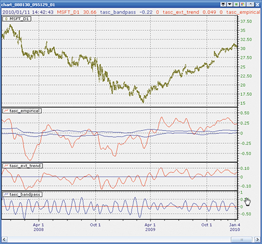

**Figure 13:** NeoTicker EMD strategy.

**External file:** [`EMD_neoticker.txt`](EMD_neoticker.txt)

```text
LISTING 3 - Empirical Mode Decomposition
myprice := (h+l)/2;
$period := param1;
$delta := param2;
$fraction := param3;
$beta  := cos (deg2rad (360 / $period));
$gamma := 1 / cos (deg2rad (720 * $delta / $period));
$alpha := $gamma - sqrt ($gamma * $gamma - 1);
BP := 0.5*(1-$alpha)*(data1-data1(2))+$beta*(1+$alpha)*BP(1)-$alpha*BP(2);
Peak := if((BP(1) > BP) and (BP(1) > BP(2)), BP(1), Peak);
Valley := if((BP(1) < BP) and (BP(1) < BP(2)), BP(1), Valley);
plot1 := average(BP, 2*$period);
plot2 := $fraction*average(Peak, 50);
plot3 := $fraction*average(Valley, 50);
```

---

## Wave59: Empirical Mode Decomposition

**Contributor:** Earik Beann, Wave59 Technologies Int'l, Inc.

Color-coded bars: red = downtrend, blue = uptrend, black = cycle mode.

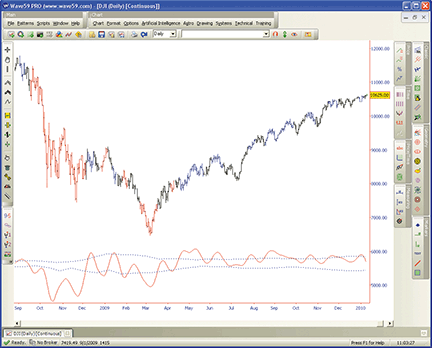

**Figure 14:** Cycle indicator on a daily DJIA chart with color-coded bars.

**External file:** [`EMD_wave59.txt`](EMD_wave59.txt)

```text
Indicator:  Ehlers_EmpiricalModeDecomposition
input:price( (high+low)/2 ), period(20), delta(0.1), fraction(0.1), color(red), threshcolor(blue);
 
if (barnum == barsback) {
    bp, peak, valley=0;
} 

beta = cos(360/period);
gamma = 1/cos(720*delta/period);   
alpha = gamma - sqrt(gamma*gamma - 1);   
bp=0.5*(1-alpha)*(price-price[2]) + beta*(1+alpha)*bp[1] - alpha*bp[2];
mean=average(bp, 2*period);   
    
peak = peak[1];
valley = valley[1];   
if (bp[1]>bp and bp[1]>bp[2]) peak = bp[1];
if (bp[1]<bp and bp[1]<bp[2]) valley = bp[1];
avgpeak = average(peak, 50);
avgvalley = average(valley, 50);
   
plot1 = mean;       
plot2 = fraction*avgpeak;
plot3 = fraction*avgvalley; 

if (mean>fraction*avgpeak) colorbar(barnum, blue, 1);
if (mean<fraction*avgvalley) colorbar(barnum, red, 1);
```

---

## VT Trader: Empirical Mode Decomposition

**Contributor:** Chris Skidmore, CMS Forex

The EMD indicator for VT Trader with input variables: Price, Period, Delta, Fraction. Outputs: Mean, Upper_Threshold, Lower_Threshold.

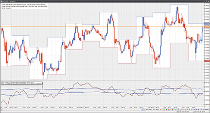

**Figure 15:** EMD indicator on a EUR/USD one-hour candlestick chart.

**External file:** [`EMD_vttrader.txt`](EMD_vttrader.txt)

```text
{Provided By: Capital Market Services, LLC & Visual Trading Systems, LLC}
{Copyright: 2010}
{Description: TASC, March 2010 - Empirical Mode Decomposition by John F. Ehlers and Ric Way}
b:= cos(360/Period);
g:= 1/cos(720*d/Period);
a:= g-sqrt(g*g-1);
BP:= if(IsDefined(BP)=0,0,BP);
BP:= 0.5*(1-a)*(Price-ref(Price,-2))+b*(1+a)*ref(BP,-1)-a*ref(BP,-2);
Mean:= mov(BP,2*Period,S);
_Peak:= if(ref(BP,-1)>BP and ref(BP,-1)>ref(BP,-2),ref(BP,-1),PREV(0));
_Valley:= if(ref(BP,-1)<BP and ref(BP,-1)<ref(BP,-2),ref(BP,-1),PREV(0));
AvgPeak:= mov(_Peak,50,S);
AvgValley:= mov(_Valley,50,S);
Upper_Threshold:= Fraction*AvgPeak;
Lower_Threshold:= Fraction*AvgValley;
```

---

## EasyLanguage: Empirical Mode Decomposition — Article Code

**Contributors:** John Ehlers (www.isignals.com) and Ric Way

The original EasyLanguage code from the article: Bandpass Filter, Extracting the Trend, and Empirical Mode Decomposition.

**External file:** [`EMD_easylanguage.els`](EMD_easylanguage.els)

```easylanguage
EMPIRICAL MODE DECOMPOSITION IN EASYLANGUAGE
Inputs:	
	Price((H+L)/2),
	Period(20),
	delta(.5),
	Fraction(.1);

Vars:	
	alpha(0), beta(0), gamma(0),
	BP(0), Mean(0), Peak(0), Valley(0),
	AvgPeak(0), AvgValley(0);

beta = Cosine(360 / Period);
gamma = 1 / Cosine(720*delta / Period);
alpha = gamma - SquareRoot(gamma*gamma - 1);
BP = .5*(1 - alpha)*(Price - Price[2]) + beta*(1 + alpha)*BP[1] - alpha*BP[2];
Mean = Average(BP, 2*Period);
Peak = Peak[1];
Valley = Valley[1];
If BP[1] > BP and BP[1] > BP[2] Then Peak = BP[1];
If BP[1] < BP and BP[1] < BP[2] Then Valley = BP[1];

AvgPeak = Average(Peak, 50);
AvgValley = Average(Valley, 50);

Plot1(Mean);
Plot2(Fraction*AvgPeak);
Plot6(Fraction*AvgValley);
```

---

*Originally published in the March 2010 issue of Technical Analysis of STOCKS & COMMODITIES magazine. All rights reserved. Copyright 2010, Technical Analysis, Inc.*
