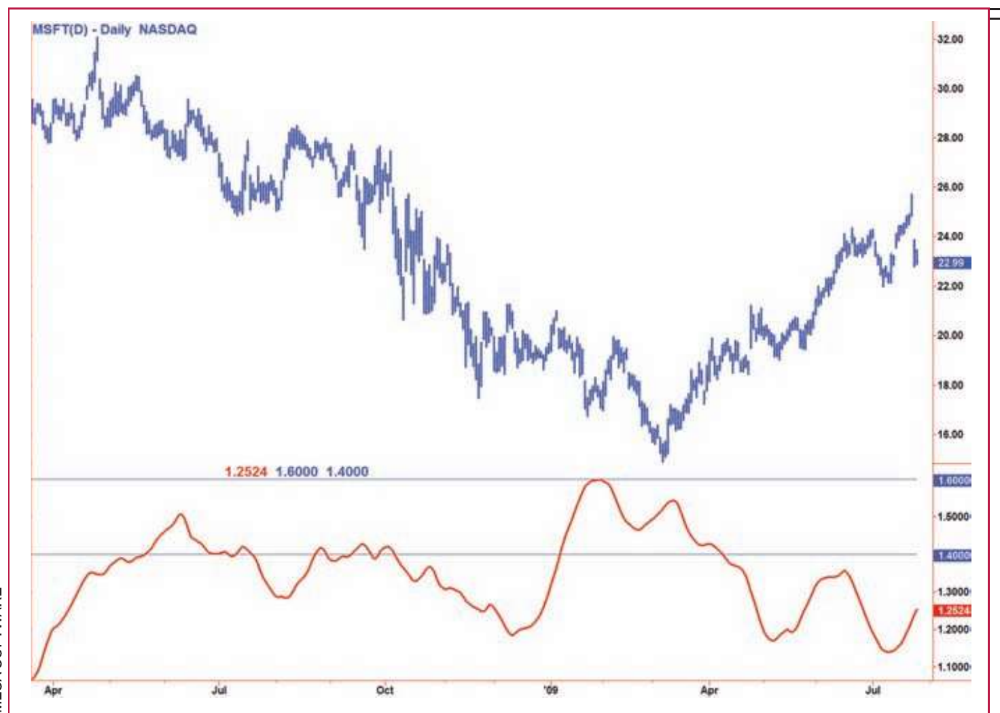
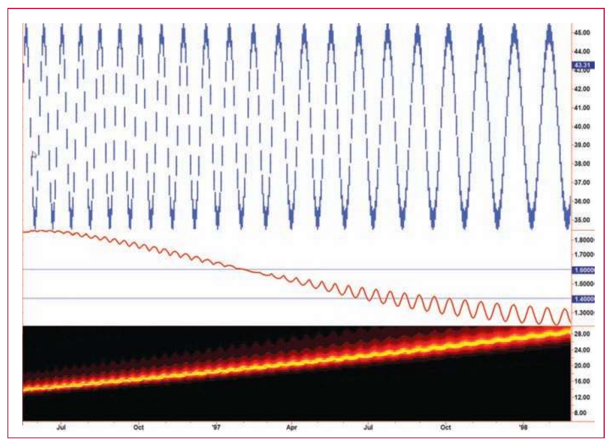

# Fractal Dimension As A Market Mode Sensor

- **Author:** John F. Ehlers and Ric Way
- **Publication:** Technical Analysis of STOCKS & COMMODITIES, Volume 28, June 2010, pp. 16--20
- **Article URL:** [Article PDF](https://technical.traders.com/archive/article.asp?file=\V28\C06\109EHLR.pdf)
- **Traders' Tips URL:** [Traders' Tips, June 2010](https://www.traders.com/Documentation/FEEDbk_docs/2010/06/TradersTips.html)

---

*You can use the fractal dimension as a natural way to sense whether the market is in a cycle mode or trend mode.*

## Cycle Or Trend?

Is the market trending or cycling? What intuitively seems like an easy question to answer is perhaps one of the most vexing in all technical analysis. If a trader knows the market mode, then a straightforward approach could be taken to adapt a trading strategy to that mode. We would apply a swing trading technique such as an overbought/oversold oscillator in cycle mode and a trend-following technique such as a moving average crossing in trend mode. In this article, we address the cycle/trend problem using the fractal dimension.

A number of tools have been developed to differentiate between cycle and trend modes. For example, we can compare the trend slope over a full cycle period to the amplitude swing of the cycle and use the ratio. More recently, we developed empirical mode decomposition to separate the market into cycle and trend mode components. In this article, we will consider the fractal dimension as a natural way to determine whether the market is in a cycle mode or trend mode.

## Fractal Dimension

There is no argument that market prices are fractal. Price charts look similar regardless of time frame. If you remove the labels from a five-minute chart, a daily chart, and a weekly chart, you would have difficulty telling them apart. Fractal shapes are self-similar because they have the same roughness and sparseness regardless of time interval. This self-similarity can be defined by the fractal dimension that describes sparseness at all magnification levels.

To determine the fractal dimension of a generalized pattern, we cover the pattern with a number N of small objects of several various sizes S. The relationship of the number of objects in two sets of sizes is:

$$\frac{N2}{N1} = \left(\frac{S1}{S2}\right)^D$$

$$D = \frac{\log\left(\frac{N2}{N1}\right)}{\log\left(\frac{S1}{S2}\right)}$$

As an example, we can start with a pattern that is a line segment 10 meters long. We chose the two small dimensions as S1 = one meter and S2 = 0.1 meter. Placing boxes along the line, we can fit 10 one-meter boxes on the segment, and therefore N1 = 10. Similarly, we can fit 100 0.1-meter boxes on the same 10 one-meter line segment, and therefore, N2 = 100. The fractal dimension of the line then computes to:

$$D = \frac{\log\left(\frac{100}{10}\right)}{\log\left(\frac{1}{0.1}\right)} = 1.0$$

As a second example, we will use the pattern as a square that is 10 meters on a side instead of a line segment. Retaining the same sizes of our small boxes as one meter and 0.1 meter on a side, respectively, we get N1 = 100 and N2 = 10,000. When the square is our pattern, the fractal dimension therefore computes to be:

$$D = \frac{\log\left(\frac{10000}{100}\right)}{\log\left(\frac{1}{0.1}\right)} = 2.0$$

A perfect square represents an idealized geometry not found in nature. Natural fractals like that of a seashore lack the true regularity of an algorithmic structure but are self-similar in a statistical sense. Thus, in order to determine the fractal dimension of natural shapes, we must average the measured fractal dimension made over different scales.

We could measure the fractal dimension of prices by covering the curve with a series of small boxes. This is burdensome, but if we take into account that the price samples are uniformly spaced, the box count is approximately the average slope of the curve. Therefore, we can estimate the box count as the highest price during an interval minus the lowest price during that interval, divided by the length of the interval itself. The equation for the number of boxes is then:

$$N1 = \frac{\text{HighestPrice} - \text{LowestPrice}}{\text{Length}}$$

We compute the fractal dimension by computing N over two equal intervals to get the averaging over each interval. Interval 1 covers the period from zero to T bars ago. Interval 2 covers the period from T to 2T bars ago. Therefore, N1 = (HighestPrice − LowestPrice) over the interval from zero to T, divided by T. Similarly, N2 = (HighestPrice − LowestPrice) is over the interval from T to 2T, divided by T. We also define a N3 = (HighestPrice − LowestPrice) over the entire interval from zero to 2T, divided by 2T. Since we are looking backward in time, the slope computation of the fractal dimension is:

$$D = \frac{\log(N1 + N2) - \log(N3)}{\log(2)}$$

The fractal dimension varies over the range from D = 1 to D = 2. When D = 1 prices are in a straight line — that is, the market is in a trend mode — the trend can be up, down, or sideways because the fractal dimension has no sense of slope. When D = 2, the prices are swinging up and down within the box over the observation period; in other words, the market is in a cycle mode. When D = 1.5, we have the boundary between being in a trend mode or cycle mode. Since the measurement of the fractal dimension is only an estimate, there is no clear-cut, black & white distinction between trend mode or cycle mode at the boundary. Thus, we choose to plot a "fuzzy" boundary extending from D = 1.4 to D = 1.6 within that range.

## The Fractal Dimension Indicator

The EasyLanguage code to compute the fractal dimension indicator is given in the sidebar "Fractal Dimension Indicator." We choose to use the average of the high and low prices to compute a line indicator (price) because this average is smoother than the closing price alone with respect to high-frequency components. We then smooth price using a four-tap finite impulse response (FIR) filter to entirely notch out the two- and three-bar cycle components. A FIR filter is similar to a moving average except that the selected coefficients enable the elimination of the undesired two- and three-bar period cycle components.

The computation of N1, N2, and N3 are as previously described. We then smooth the ratio using a 20-bar moving average to create the resulting fractal dimension indicator. The length of the moving average is somewhat arbitrary, with 20 being a good match for the default input setting of N = 30. The indicator is plotted as Plot1, with the fuzzy boundaries plotted as Plot2 and Plot3.

## Fractal Dimension Indicator In EasyLanguage

```easylanguage
Inputs: Price((H + L)/2),
        N(30); {N must be an even number}

Vars:   Smooth(0),
        count(0),
        N1(0),
        N2(0),
        N3(0),
        HH(0),
        LL(0),
        Ratio(0),
        Dimen(0);

Smooth = (Price + 2*Price[1] + 2*Price[2] + Price[3]) / 6;
N3 = (Highest(Smooth, N) - Lowest(Smooth, N)) / N;
HH = Smooth;
LL = Smooth;
For count = 0 to N/2 - 1 begin
    If Smooth[count] > HH then HH = Smooth[count];
    If Smooth[count] < LL then LL = Smooth[count];
End;
N1 = (HH - LL) / (N / 2);
HH = Smooth[N / 2];
LL = Smooth[N / 2];
For count = N/2 to N - 1 begin
    If Smooth[count] > HH then HH = Smooth[count];
    If Smooth[count] < LL then LL = Smooth[count];
End;
N2 = (HH - LL) / (N / 2);
If N1 > 0 and N2 > 0 and N3 > 0 then Ratio = .5*((Log(N1
+ N2) - Log(N3)) / Log(2) + Dimen[1]);
Dimen = Average(Ratio, 20);
Plot1(Dimen);
Plot2(1.6, "1.6", Blue);
Plot3(1.4, "1.4", Blue);
```

## The Fractal Dimension In Action

The fractal dimension indicator is applied to approximately one year of data of Microsoft Corp. (MSFT) in Figure 1. The indicator shows that MSFT is in a trend from mid-July 2008 until January 2009. From the slope of the data, this is clearly a downtrend. Between January and mid-April 2009, the indicator is in the fuzzy region and from mid-April it begins another trend. This time the trend is up, as determined by the slope of the data.


**FIGURE 1: FRACTAL DIMENSION INDICATOR IN ACTION.** Here you see the fractal dimension indicator applied on the chart of Microsoft (MSFT). The indicator shows that MSFT is in a trend from mid-July 2008 until January 2009. From the slope of the data, this is clearly a downtrend. Between January and mid-April 2009, the indicator is in the fuzzy region, and from mid-April begins another trend. This time the trend is up, as determined by the slope of the data.

It may be instructive to describe the action of the fractal dimension indicator from a theoretical perspective. In Figure 2, this indicator is applied to a sine wave the period of which is continuously increasing from left to right. The period has been measured in the bottom subgraph, and the period is indicated on its vertical axis. In this case, we have set the input N = 20. When the cycle period is less than N, the cycle swings fill the box and a cycle mode indication results. When the cycle period is greater than N, the indicator reads segments of the longer cycles as trends. This is a reasonable interpretation of a trend. However, the prices tend to fill the box near the peaks and valleys of the longer cycles. The moving average in the indicator reduces the excursions of these swings to improve interpretation of the trend mode.


**FIGURE 2: FRACTAL DIMENSION INDICATOR APPLIED TO A THEORETICAL SINE WAVE.** The period of the sine wave continuously increases from left to right. The period has been measured in the bottom subgraph, and the period is indicated on its vertical axis. In this case, we have set the input N = 20. When the cycle period is less than N, the cycle swings "fill the box" and a cycle mode indication results. When the cycle period is greater than N, the indicator reads segments of the longer cycles as trends.

## Trend Or Cycle?

By its very design, the fractal dimension is a natural descriptor of trend modes and cycle modes in the market. Its use provides you with another tool to better apply your strategies for either swing trading or trend-following trading.

## About The Authors

*John Ehlers is a pioneer in the use of cycles and DSP techniques in technical analysis. He is the author of the MESA8 program and is the chief scientist for www.isignals.com. Ric Way is an independent software developer specializing in programming algorithmic trading systems in C#. He may be reached at ricway@taosgroup.org.*

## Suggested Reading

Ehlers, John F., and Ric Way [2010]. "Empirical Mode Decomposition," *Technical Analysis of STOCKS & COMMODITIES*, Volume 28: March.

---

‡EasyLanguage (TradeStation)
‡MESA Software

*See our Traders' Tips section beginning on page 70 for program code implementing John Ehlers' technique.*

---

## BibTeX

```bibtex
@article{ehlers_way_2010_fractal_dimension,
  author    = {Ehlers, John F. and Way, Ric},
  title     = {Fractal Dimension As A Market Mode Sensor},
  journal   = {Technical Analysis of STOCKS \& COMMODITIES},
  volume    = {28},
  number    = {6},
  pages     = {16--20},
  year      = {2010},
  month     = jun,
  url       = {https://technical.traders.com/archive/article.asp?file=\V28\C06\109EHLR.pdf}
}

@misc{traders_tips_2010_06,
  author       = {{Technical Analysis of STOCKS \& COMMODITIES}},
  title        = {Traders' Tips: Fractal Dimension As A Market Mode Sensor},
  howpublished = {online},
  year         = {2010},
  month        = jun,
  url          = {https://www.traders.com/Documentation/FEEDbk_docs/2010/06/TradersTips.html}
}
```
