# Traders' Tips: June 2010

- **Article:** Fractal Dimension As A Market Mode Sensor by John Ehlers and Ric Way
- **Traders' Tips URL:** [Traders' Tips, June 2010](https://www.traders.com/Documentation/FEEDbk_docs/2010/06/TradersTips.html)

---

## TradeStation

John Ehlers� and Ric Way�s article in this issue, �Fractal Dimension As A Market Mode Sensor,� provides a method of calculating the fractal dimension of any price series. The authors suggest using the calculations to distinguish trending from cycling price movement. A strategy to backtest the idea that the changes in the fractal dimension can identify the beginning of trending market phases is included in the article.

To download the adapted EasyLanguage code, go to the TradeStation and EasyLanguage Support Forum (https://www.tradestation.com/Discussions/forum.aspx?Forum_ID=213). Search for the file �EhlersFractalDimension.eld.�

A sample chart is shown in Figure 1.

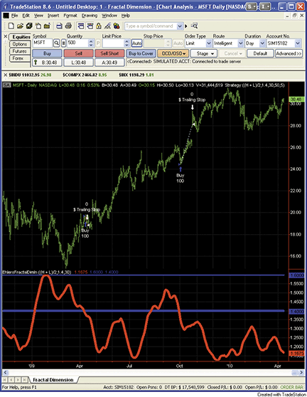

**Figure 1: TRADESTATION, fractal dimension indicator.Here, the EhlerFractDimIn indicator is plotted on a daily chart of Microsoft, Inc. (MSFT). The top pane displays price bars and strategy trades based on the calculated fractal dimension. The bottom pane displays the fractal dimension values over time as a red line. Movement above and below the blue lines denotes entering and exiting of cycling and trending periods of price action.**

```easylanguage
Indicator:  EhlersFractalDimIn
inputs: 
	Price( MedianPrice ), 
	Threshold( 1.4 ),
	N( 30 ) ; { N must be an even number } 

variables: 
	HalfN( 0 ),
	NMinus1( 0 ),
	HalfNMinus1( 0 ),
	Log2( 0 ),
	Smooth( 0 ), 
	N3( 0 ), 
	HH( 0 ), 
	LL( 0 ), 
	Count( 0 ), 
	N1( 0 ), 
	N2( 0 ), 
	Ratio( 0 ), 
	Dimen( 0 ) ;

Once
	begin
	if Mod( N, 2 ) <> 0 or N = 0 then
		RaiseRuntimeError( "The input N must be an" +
	 	 " even number." ) ;
	HalfN = 0.5 * N ;
	NMinus1 = N - 1 ;
	HalfNMinus1 = HalfN - 1 ;
	Log2 = Log( 2 ) ;
	end ;

Smooth = ( Price + 2 * Price[1] + 2 * Price[2] +
 Price[3] ) / 6 ; 
N3 = ( Highest( Smooth, N ) - Lowest( Smooth, N ) ) /
 N ;  
HH = Smooth ; 
LL = Smooth ; 

for Count = 0 to HalfNMinus1 
	begin 
	if Smooth[Count] > HH then
		HH = Smooth[Count] ; 
	if Smooth[Count] < LL then
		LL = Smooth[Count] ; 
	end ;
 
N1 = ( HH - LL ) / HalfN ; 
HH = Smooth[HalfN] ; 
LL = Smooth[HalfN] ; 

for Count = HalfN to NMinus1 
	begin 
	if Smooth[Count] > HH then
 		HH = Smooth[Count] ;
    if Smooth[Count] < LL then
		LL = Smooth[Count] ; 
	end ;
 
N2 = ( HH - LL ) / HalfN ; 

if N1 > 0 and N2 > 0 and N3 > 0 then 
	Ratio = 0.5 * ( ( Log( N1 + N2 ) - Log( N3 ) ) /
	 Log2 + Dimen[1] ) ; 

Dimen = Average( Ratio, 20 ) ; 

Plot1( Dimen, "Dimen" ) ; 
Plot2( 1.6, "1.6", Blue ) ; 
Plot3( Threshold, "Trigger", Blue ) ; 


Strategy: 
inputs: 
	Price( MedianPrice ), 
	Threshold( 1.4 ),
	N( 30 ), { N must be an even number } 
	TrendLength( 10 ),
	StopLossPct( 5 ) ;

variables: 
	HalfN( 0 ),
	NMinus1( 0 ),
	HalfNMinus1( 0 ),
	Log2( 0 ),
	Smooth( 0 ), 
	N3( 0 ), 
	HH( 0 ), 
	LL( 0 ), 
	Count( 0 ), 
	N1( 0 ), 
	N2( 0 ), 
	Ratio( 0 ), 
	Dimen( 0 ) ;

Once
	begin
	if Mod( N, 2 ) <> 0 or N = 0 then
		RaiseRuntimeError( "The input N must be an" +
	 	 " even number." ) ;
	HalfN = 0.5 * N ;
	NMinus1 = N - 1 ;
	HalfNMinus1 = HalfN - 1 ;
	Log2 = Log( 2 ) ;
	end ;

Smooth = ( Price + 2 * Price[1] + 2 * Price[2] +
 Price[3] ) / 6 ; 
N3 = ( Highest( Smooth, N ) - Lowest( Smooth, N ) ) /
 N ;  
HH = Smooth ; 
LL = Smooth ; 

for Count = 0 to HalfNMinus1 
	begin 
	if Smooth[Count] > HH then
		HH = Smooth[Count] ; 
	if Smooth[Count] < LL then
		LL = Smooth[Count] ; 
	end ;

N1 = ( HH - LL ) / HalfN ; 
HH = Smooth[HalfN] ; 
LL = Smooth[HalfN] ; 

for Count = HalfN to NMinus1 
	begin 
	if Smooth[Count] > HH then
 		HH = Smooth[Count] ;
    if Smooth[Count] < LL then
		LL = Smooth[Count] ; 
	end ;
 
N2 = ( HH - LL ) / HalfN ; 

if N1 > 0 and N2 > 0 and N3 > 0 then 
	Ratio = 0.5 * ( ( Log( N1 + N2 ) - Log( N3 ) ) /
	 Log2 + Dimen[1] ) ; 

Dimen = Average( Ratio, 20 ) ; 

if Dimen crosses under Threshold then
	begin
	if Close > Average( Close, TrendLength ) then
		Buy next bar market 
	else 
		Sell short next bar at market ;
	end ;

SetStopShare ;
SetDollarTrailing( iff( EntryPrice > 0, EntryPrice,
 Close ) * 0.01 * StopLossPct ) ;

```

This article is for informational purposes. No type of trading or investment recommendation, advice, or strategy is being made, given, or in any manner provided by TradeStation Securities or its affiliates.

�Mark MillsTradeStation Securities, Inc.A subsidiary of TradeStation Group, Inc.www.TradeStation.com

## eSignal

For this month�s Traders� Tip, we�ve provided the formula �FractalDimension.efs, based on the code from John Ehlers� and Ric Way�s article in this issue, �Fractal Dimension As A Market Mode Sensor.�

The study contains the following formula parameters:Price source, N, Band 1andBand 2, which may be configured through the Edit Studies window (Advanced Chart menu → Edit Studies).

To discuss this study or download a complete copy of the formula code, please visit theEfsLibrary Discussion Board forum under the Forums link atwww.esignalcentral.comor visit ourEfsKnowledgeBase atwww.esignalcentral.com/support/kb/efs/. The eSignal formula scripts (Efs) are also available for copying and pasting from theStocks & Commoditieswebsite atTraders.com.

A sample chart is shown in Figure 2.

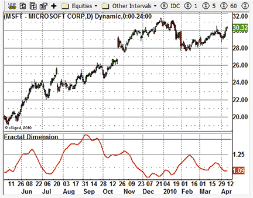

**Figure 2: eSIGNAL, fractal dimension indicator**

�Jason KeckeSignal, a division of Interactive Data Corp.800 815-8256,www.esignalcentral.com

## Wealth-Lab

While the WealthScript code that replicates John Ehlers� and Ric Way�sfractal dimension indicator(Fdi) is shown here, for ease of use,Fdiwill also be added to Wealth-Lab�sTascIndicators library.

A sample chart is shown in Figure 3. From the chart it is clear that when theFdiis rising, the market tends to remain in a trading range, and conversely, the market trends as the indicator falls.

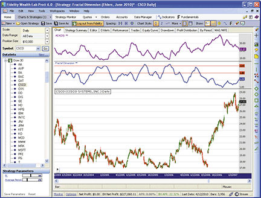

**Figure 3: WEALTH-LAB, fractal dimension indicator.The information provided by the fractal dimension indicator is not unlike that of J. Welles Wilder�s ADX, albeit inverted.**

```csharp
WealthScript Code (C#): 
using System;
using System.Collections.Generic;
using System.Text;
using System.Drawing;
using WealthLab;
using WealthLab.Indicators;

namespace WealthLab.Strategies
{
   public class FractalDim : WealthScript
   {
      StrategyParameter _n;
      StrategyParameter _per;

      public FractalDim()
      {
         _n = CreateParameter("N", 30, 10, 60, 2);   // An even number
         _per = CreateParameter("Average Period", 20, 10, 55, 1);
      }

      protected override void Execute()
      {   
         HideVolume();
         int N = _n.ValueInt;
         int avPer = _per.ValueInt;
         DataSeries avg = AveragePrice.Series(Bars);
         DataSeries smooth = FIR.Series(avg, "1,2,2,1");
         DataSeries n3 = (Highest.Series(smooth, N) - Lowest.Series(smooth, N)) / N;
         
         int per = N / 2;         
         DataSeries n1 = (Highest.Series(smooth, per) - Lowest.Series(smooth, per)) / per;
         DataSeries smooth_ = smooth >> per;
         DataSeries n2 = (Highest.Series(smooth_, per) - Lowest.Series(smooth_, per))/ per;
         
         DataSeries ratio = new DataSeries(Bars, "Fractal Ratio");
         DataSeries dimen = new DataSeries(Bars, "Fractal Dimension");
         double log2 = Math.Log(2);
         for (int bar = N; bar < Bars.Count; bar++)
         {
            if (n1[bar] > 0 && n2[bar] > 0 && n3[bar] > 0)
               ratio[bar] = 0.5 * ((Math.Log(n1[bar] + n2[bar]) - Math.Log(n3[bar])) / log2 + dimen[bar-1]);
            else
               ratio[bar] = ratio[bar-1];
            
            if (bar < avPer)
               dimen[bar] = ratio[bar];
            else
               dimen[bar] = SMA.Value(bar, ratio, avPer);
         }
         
         ChartPane fdPane = CreatePane(40, false, true);
         DrawHorzLine(fdPane, 1.4, Color.Blue, LineStyle.Solid, 1);
         DrawHorzLine(fdPane, 1.6, Color.Blue, LineStyle.Solid, 1);
         PlotSeries(fdPane, dimen, Color.Red, LineStyle.Solid, 2);   
      }
   }
}

```

�Robert Sucherwww.wealth-lab.com

## AmiBroker

In �Fractal Dimension As A Market Mode Sensor� in this issue, authors John Ehlers and Ric Way present the fractal dimension indicator.

Implementing it is easy in AmiBroker Formula Language. A ready-to-use formula for the article is presented in the Listing 1. To use it, enter the formula in theAflEditor, then press the �Insert Indicator� button. Then you would need to click on the chart with the right mouse button and choose �Parameters� from the context menu in order to define parameterN.

A sample chart is shown in Figure 4.

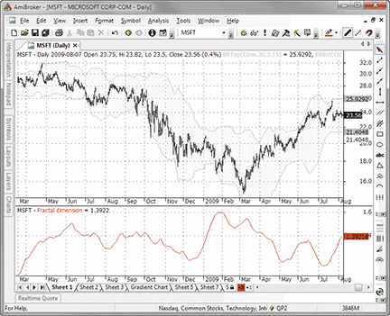

**Figure 4: AMIBROKER, fractal dimension indicator.Here is a MSFT price chart with classic 30-day Bollinger bands (upper pane) and the fractal dimension indicator (lower pane), replicating the chart presented in Ehlers� and Way�s article.**

```afl
LISTING 1

Price = (H+L)/2; 

N = Param("N", 30, 10, 100, 2 ); 

Smooth = ( Price + 
         2 * Ref( Price, -1 ) + 
         2 * Ref( Price, -2 ) + 
         Ref( Price, -3 ) ) / 6; 

N3 = (HHV( Smooth, N ) - LLV( Smooth, N ))/N; 

HH2 = HHV( Smooth, N/2 ); 
LL2 = LLV( Smooth, N/2 ); 

N1 = ( HH2 - LL2 )/(N/2); 

N2 = Ref( HH2 - LL2, - N/2 )/(N/2); 

Ratio = ( log( N1 + N2 ) - log( N3 ) )/log( 2 ); 

dimen = Null; 

for( i = 20+N; i < BarCount; i++ ) 
{ 
   ratio[ i ] += Nz( dimen[ i - 1 ] ); 
   ratio[ i ] *= 0.5; 

   for( sr = 0, k = 0; k < 20; k++ ) 
     sr += ratio[ i - k ]; 

   dimen[ i ] = sr / 20; 
} 

Plot( Dimen, "Fractal dimension", colorRed ); 

PlotGrid( 1.6, colorBlue ); 
PlotGrid( 1.4, colorBlue ); 
```

�Tomasz Janeczko, AmiBroker.comwww.amibroker.com

## Worden Brothers StockFinder

The fractal dimension indicator described inJohn Ehlers� and Ric Way�s article in this issuehas now been made available in the StockFinder indicator library.

You can add the indicator to your chart by clicking the �Add Indicator/Condition� button or by simply typing �/Fractal� and choosing �fractal dimension indicator� from the list of available indicators.

Horizontal lines are plotted at the 1.40 and 1.60 levels to define the �fuzzy� range (see Figure 5).

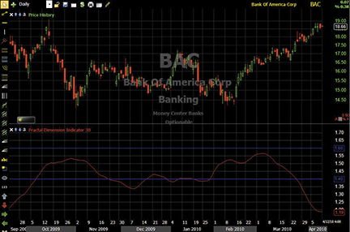

**Figure 5: STOCKFINDER, fractal dimension indicator.Bank of America (BAC) cycled within the �fuzzy� range from October 2009 until March 2010. The fractal dimension indicator has dipped well below the 1.40 level to indicate a trend, and, as you can see from the price graph, the trend is up.**

For more information or to start a free trial of StockFinder, visit www.StockFinder.com.

� Bruce Loebrich and Patrick ArgoWorden Brothers, Inc.www.StockFinder.com

## NeuroShell Trader

The fractal dimension indicator presented byJohn Ehlers and Ric Way in their article in this issuecan be easily implemented in NeuroShell Trader using NeuroShell Trader�s ability to call external programs. The fractal dimension indicator can be written in C, C++, Power Basic, or Delphi.

After moving the EasyLanguage code given in the article to your preferred compiler to create the fractal dimension indicator, you can insert the resulting indicators as follows:

Select �New Indicator �� from the Insert menu.Choose theExternal Program & Library Callscategory.Select the appropriateExternalDllCallindicator.Setup the parameters to match yourDll.Select theFinishedbutton.

We think neural networks and genetic algorithms can play an important part in building trading strategies using the fractal dimension indicator as an input. In two quickly built genetically optimized nets, we also input a regression slope to determine which way the trend was going. The first net was trained onMsftfrom 2003, producing a 37.1% annualized return through April 6, 2010. In the second, we held out a year, training only to April 3, 2009, and producing an annualized 30.3% return.  More important, the second net persisted, showing a 24.2% return in the last held out year.

Users of NeuroShell Trader can go to theStocks & Commoditiessection of the NeuroShell Trader free technical support website to download a copy of this or any past Traders� Tips.

A sample chart is shown in Figure 6.

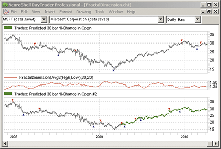

**Figure 6: NEUROSHELL TRADER, fractal dimension indicator.This sample NeuroShell Trader chart displays the fractal dimension indicator along with two example neural network trading systems.**

�Marge Sherald, Ward Systems Group, Inc.301 662-7950,sales@wardsystems.comwww.neuroshell.com

## AIQ

TheAiqcode is given here for the fractal dimension indicator based on �Fractal Dimension As A Market Mode Sensor� by John Ehlers and Ric Way in this issue.

In Figure 7, I show the indicator plotted on a chart of the S&P 500Etf(Spy).

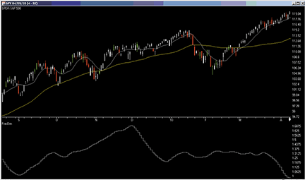

**Figure 7: AIQ SYSTEMS, fractal dimension indicator.Here is a sample chart of the SPY with the fractal dimension indicator.**

The code can be downloaded from theAiqwebsite atwww.aiqsystems.comand also fromwww.tradersedgesystems.com/traderstips.htm.

```eds
! FRACTAL DIMENSION AS A MARKET MODE SENSOR
! Author: John Ehlers, TASC June 2010
! Coded by: Richard Denning
! www.TradersEdgeSystems.com

!INPUT:
N 	is 30.	!must be even integer

!FRACTAL DIMENSION INDICATOR:
HalfN	is N*0.5.
Price	is ([high]+[low])*0.5.
Smooth	is (Price + 2*Valresult(Price,1) + 2*Valresult(Price,2) 
		+ Valresult(Price,3)) / 6.
N1	is (HighResult(Smooth,HalfN) 
		- LowResult(Smooth,HalfN)) / (HalfN).
N2	is (HighResult(Smooth,HalfN,HalfN) 
		- LowResult(Smooth,HalfN,HalfN)) / (HalfN).
N3	is (HighResult(Smooth,N) - LowResult(Smooth,N)) / N.
barsInto	is reportDate() - ruleDate().
end	if barsInto > 60.
fracDimen is iff(end, Price, dimen ).
dimen	is 0.5*( ( Ln(N1+N2) - Ln(N3)  ) 
		/ Ln(2) + ValResult(fracDimen, 1) ).
!PLOT as custom indicator:
dimenFinal is ^SimpleAvg(dimen,20).
```

�Richard Denningrichard.denning@earthlink.netfor AIQ Systems

## TradersStudio

The TradersStudio code is given here for John Ehlers� and Ric Way�s fractal dimension indicator and related functions, based on �Fractal Dimension As A Market Mode Sensor� in this issue.

To test the effectiveness of the fractal dimension indicator (Fdi), I chose three different portfolios of futures contracts using reverse-adjusted daily bar data supplied by Pinnacle Data Systems:

Emini index portfolio: EN, ER, ES & YMFull-size index portfolio: DJ, MD, ND, SPDay session futures portfolio: AD, BO, BP, C, CC, CD, CL, CT, DJ, DX, ED, FA, FC, FX, GC, HG, HO, HU, JO, JY, KC, KW, LC, LH, NG, NK, PB, RB, S, SB, SF,  SI, SM, SP, TA, TD, UA, W

On each of these portfolios, I ran tests with both a typical oscillator and a typical trend-following system. Then to determine the effectiveness of the trend/cycle filter, I tested the typical systems both with and without the trend filter. The oscillator system uses a slow D stochastic, entering when the oscillator indicates a reversal from an overbought or oversold level. The trend-following system uses a 20-bar channel breakout for entries.

For the oscillator system, I eliminated the signals when theFdiwas in the trend mode. For the trend-following system, I eliminated signals when the Fdi was in the cycle mode.

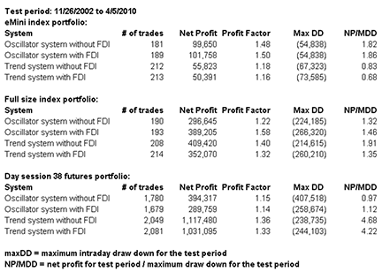

**Figure 8: TRADERSSTUDIO, TABLE OF COMPARATIVE METRICS.Shown are comparative metrics for the two types of systems with and without the fractal dimension filter (FDI).**

The code for each of these test systems and the explanation of the rules can be found atwww.TradersEdgeSystems.com/traderstips.htm. In the table in Figure 8, I show some sample metrics for backtests from 11/26/2002 to 4/5/2010 for all three portfolios. The filter applied to the oscillator shows some improvement over taking all signals, whereas the filter applied to the trend-following system did not improve any of the metrics. The results were consistent with all three portfolios. In Figures 9 and 10, I show the comparative equity curves for the two systems traded both with and without theFdifilter.

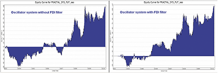

**Figure 9: TRADERSSTUDIO, SLOW STOCHASTIC SYSTEM.Equity curves are shown for a slow stochastic system with and without the fractal dimension filter (FDI) on the eMini index portfolio.**

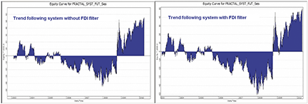

**Figure 10: TRADERSSTUDIO, CHANNEL BREAKOUT SYSTEM.Equity curves are shown for the channel breakout system with and without the fractal dimension (FDI) filter on the emini index portfolio.**

The code can be downloaded from the TradersStudio website atwww.TradersStudio.com→ Traders Resources FreeCode and also fromwww.TradersEdgeSystems.com/traderstips.htm.

```basic
'FRACTAL DIMENSION AS A MARKET MODE SENSOR
'Author: John Ehlers, TASC June 2010
'Coded by: Richard Denning
'www.TradersEdgeSystems.com

Function FRACTAL(fracLen)
    'default value for fracLen = 30
    Dim Price As BarArray
    Dim Smooth As BarArray
    Dim count 
    Dim N1 As BarArray
    Dim N2 As BarArray
    Dim N3 As BarArray
    Dim HH As BarArray
    Dim LL As BarArray
    Dim Ratio As BarArray
    Dim Dimen As BarArray

    If fracLen Mod 2 > 0 Then fracLen = fracLen + 1
    Price = (H+L)/2
    Smooth = (Price + 2*Price[1] + 2*Price[2] + Price[3]) / 6
    
    'N3 = the average median 'smooth' over entire N length bars:
    N3 = (Highest(Smooth,fracLen,0)-Lowest(Smooth,fracLen,0))/fracLen
    HH = Smooth
    LL = Smooth
    For count = 0 To fracLen / 2 - 1
        If Smooth[count] > HH Then
            HH = Smooth[count]
        End If
        If Smooth[count] < LL Then
            LL = Smooth[count]
        End If
    Next
    
    'N1 = the average median 'smooth' over N/2 length bars:
    N1 = (HH - LL) / (fracLen / 2)
    HH = Smooth[fracLen / 2]
    LL = Smooth[fracLen / 2]
    For count = fracLen / 2 To fracLen - 1
        If Smooth[count] > HH Then
            HH = Smooth[count]
        End If
        If Smooth[count] < LL Then
            LL = Smooth[count]
        End If
    Next
    
    'N2 = the average median 'smooth' over  N/2 length bars:
    N2 = (HH - LL) / (fracLen / 2)
    If N1 > 0 And N2 > 0 And N3 > 0 Then
        Ratio = .5*((Log(N1 + N2) - Log(N3)) / Log(2) + Dimen[1])
    End If
    Dimen = Average(Ratio, 20, 0)
    FRACTAL = Dimen
End Function
'--------------------------------------------------------------------
'For plotting indicator on a chart:

Sub FRACTAL_IND(fracLen,upperLine,lowerLine)
    'default values:
    'fracLen =30
    'upperLine=1.6
    'lowerLine=1.4
    plot1(FRACTAL(fracLen))
    plot2(upperLine)
    plot3(lowerLine)
End Sub
'--------------------------------------------------------------------

```

�Richard Denningrichard.denning@earthlink.netfor TradersStudio

## StrataSearch

In their article in this issue, John Ehlers and Ric Way present an indicator to help determine the market mode (�Fractal Dimension As A Market Mode Sensor�).

There is no doubt that many indicators work best in specific markets. For example, some indicators work best in volatile markets, and others work best in trending markets. But identifying the current market condition is often a tricky task in itself. The fractal dimension indicator, however, appears to do a fine job of identifying trending markets.

As a test, we first ran a simple moving average crossover system against the S&P 500 symbols for the year 2009, using standard spread, slippage, and commission settings. Next, we ran the same system again, but this time trading only when the fractal dimension indicator was below 1.4. The results were impressive. In particular, the percentage of profitable trades rose from an average of 45% to an average of 80%. The number of trades dropped significantly as well, so this simple test may not have created a complete system. But it did provide confirmation of the effectiveness of the indicator.

StrataSearch users can explore this indicator further by testing it alongside thousands of other trading rules in an automated search for winning systems. If it worked this well on a simple moving average crossover, it may produce powerful results when used alongside other indicators. Additional information, including plugins for the fractal dimension indicator, can be found in the Shared Area of the StrataSearch user forum.

A sample chart is shown in Figure 11.

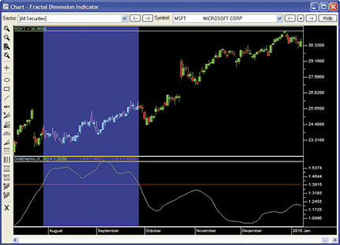

**Figure 11: STRATASEARCH, fractal dimension indicator.When the fractal dimension indicator rises above 1.4, the stock is not trending (blue shaded area). But when the indicator drops below 1.4 (nonshaded area), a strong trend is indicated.**

```text
//*********************************************************
// Fractal Dimension Indicator
//*********************************************************
Price = parameter("Price");
N = parameter("Days");

Smooth = (Price + 
	2*ref(Price, -1) + 
	2*ref(Price, -2) + 
	ref(Price, -3)) / 6;
N3 = (High(Smooth, N) - Low(Smooth, N)) / N;

HH = Smooth;
LL = Smooth;
count = 0;
while(count < N / 2) {
	HH = if(ref(Smooth, -count) > HH, 
		ref(Smooth, -count), HH);
	LL = if(ref(Smooth, -count) < LL, 
		ref(Smooth, -count), LL);
	count+=1;
};
N1 = (HH - LL) / (N / 2);

HH = ref(Smooth, -(N / 2));
LL = ref(Smooth, -(N / 2));
count = N / 2;
while(count < N) {
	HH = if(ref(Smooth, -count) > HH, 
		ref(Smooth, -count), HH);
	LL = if(ref(Smooth, -count) < LL, 
		ref(Smooth, -count), LL);
	count+=1;
};
N2 = (HH - LL)/(N / 2);

Dimen = mov(0.5 * ((Log(N1 + N2) - Log(N3)) / 
	Log(2) + $PREV), 20, simple);
```

�Pete RastAvarin Systems, Inc.www.StrataSearch.com

## NinjaTrader

The fractal dimension indicator presented by John Ehlers and Ric Way in their article in this issue (�Fractal Dimension As A Market Mode Sensor�), has now been implemented as an indicator available for download atwww.ninjatrader.com/SC/June2010SC.zip.

Once it has been downloaded, from within the NinjaTrader Control Center window, select the menu File → Utilities → Import NinjaScript and select the downloaded file. This indicator is for NinjaTrader version 6.5 or greater.

You can review the indicator�s source code by selecting the menu Tools → Edit NinjaScript → Indicator from within the NinjaTrader Control Center window and selecting �FractalDimensionIndicator.�

NinjaScript indicators are compiledDlls that run native, not interpreted, which provides you with the highest performance possible.

A sample chart implementing the strategy is shown in Figure 12.

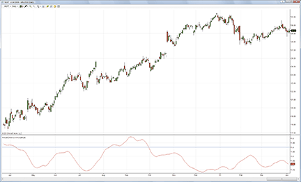

**Figure 12: NINJATRADER, fractal dimension indicator.In this chart example, the fractal dimension indicator is applied to a daily chart of Microsoft (MSFT).**

�Raymond Deux & Austin PivarnikNinjaTrader, LLCwww.ninjatrader.com

External code files:

- [ninja-trader/@MAX.cs](ninja-trader/@MAX.cs)
- [ninja-trader/@MIN.cs](ninja-trader/@MIN.cs)
- [ninja-trader/@SMA.cs](ninja-trader/@SMA.cs)
- [ninja-trader/FractalDimensionIndicator.cs](ninja-trader/FractalDimensionIndicator.cs)

## NeoTicker

The fractal dimension indicator, which is presented by John Ehlers and Ric Way in their article in this issue, �Fractal Dimension As A Market Mode Sensor,� can be implemented using NeoTicker formula language.

This indicator has two parameters.Priceis a formula parameter with a default of (H+L)/2. This parameter will allow the user to change what the price calculation is based on;Nis the number of periods to look back.

A downloadable version of this indicator will be available at the NeoTicker blog site (https://blog.neoticker.com).

A sample chart implementing the strategy is shown in Figure 13.

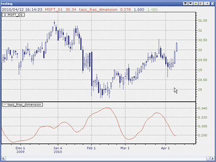

**Figure 13: NEOTICKER, fractal dimension indicator**

```text
LISTING 1 
myprice := fml(data1, param1);
$N := param2;
' force N divide by 2 into integer when N input is not a even number
$half_N := if(mod($N, 2) > 0, round($N/2), $N/2);
smooth := (myprice + 2*myprice(1) + 2*myprice(2) + myprice(3))/4;
$N3 := safediv((hhv(smooth,$N) - llv(smooth,$N)),$N,0);
$N1 := safediv((hhv(smooth,$half_N) - llv(smooth, $half_N)),$half_N,0);
$N2 := safediv((hhv($half_N,smooth,$half_N)-llv($half_N,smooth,$half_N)),$half_N,0);
Ratio := if(($N1>0) and ($N2>0) and ($N3>0),
         0.5*(log10($N1+$N2) - log10($N3))/(log10(2) + $dimen), 0);
$dimen := average(Ratio, 20);
plot1 := $dimen;
plot2 := 1.6;
plot3 := 1.4;
success1 := if(mod($N, 2) > 0, 0, 1);
```

�Kenneth YuenTickQuest, Inc.

## TradingSolutions

In �Fractal Dimension As A Market Mode Sensor� in this issue, John Ehlers and Ric Way present a calculation for the fractal dimension and how it can be used for helping to determine market trend detection.

These functions are described below and are also available as a function file that can be downloaded from the TradingSolutions website (www.tradingsolutions.com) in the Free Systems section.

```text
Function Name: Ehlers Smoothing
Short Name: ESmoothing
Inputs: Data
Div (Add (Data, Add (Mult (2, Lag (Data, 1)), Add (Mult (2, Lag (Data, 2)), Lag (Data, 3)))), 6)

Function Name: Ehlers Fractal Box Count
Short Name: EBoxCount
Inputs: Price, Calc Period, Constant Period
Div (Sub (HighestVL (ESmoothing (Price), Calc Period, Constant Period), LowestVL
 (ESmoothing (Price), Calc Period, Constant Period)), Calc Period)

Function Name: Ehlers Fractal Dimension Indicator
Short Name: EFDI
Inputs: Price, Period
If (And (GT (EBoxCount (Price, Div (Period, 2), Period), 0), And (GT (LagVL (EBoxCount
 (Price, Div (Period, 2), Period), Div (Period, 2), Period), 0), GT (EBoxCount (Price,
 Period, Period), 0))), MA (Mult (0.5, Add (Div (Sub (Ln (Add (EBoxCount (Price, Div
 (Period, 2), Period), LagVL (EBoxCount (Price, Div (Period, 2), Period), Div (Period, 2),
 Period))), Ln (EBoxCount (Price, Period, Period))), Ln (2)), Prev (1))), 20), 0)

```

�Gary GeniesseNeuroDimension, Inc.800 634-3327, 352 377-5144www.tradingsolutions.com

## Updata

This tip is based on �Fractal Dimension As A Market Mode Sensor� in this issue by John Ehlers and Ric Way.

In the article, Ehlers and Way describe a method for identifying when a market is in trend or cyclical mode by creating an oscillator based on a measure of the self-similarity of the data across different intervals, known as the fractal dimension. Data is tending toward trend mode as the fractal dimension approaches 1, the direction of which is determined by the slope of data. The data tends toward cyclical mode as the fractal dimension approaches 2. There is a �fuzzy� boundary from 1.6 to 1.4 where mode cannot be determined.

The Updata code for this indicator has been made available in the Updata Indicator Library and may be downloaded by clicking the Custom menu and then Indicator Library. Those who cannot access the library due to a firewall may paste the following code into the Updata custom editor and save it.

A sample chart is shown in Figure 14.

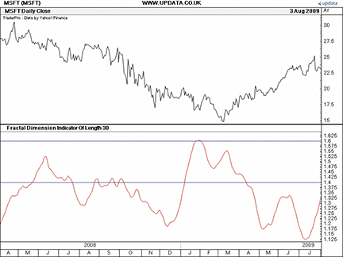

**FIGURE 14: UPDATA, fractal dimension indicator.This chart shows the fractal dimension indicator on Microsoft (MSFT). Values below 1.4 from April to July 2009 indicate the data is trending, the direction of which is determined by the slope of data, which is up.**

```text
PARAMETER "N {N must be even}" #N=30 
NAME "Fractal Dimension Indicator Of Length" #N
DISPLAYSTYLE 3LINES
INDICATORTYPE CHART 
COLOUR RGB(255,0,0)
COLOUR2 RGB(0,0,255)
COLOUR3 RGB(0,0,255)
@SMOOTH=0
#COUNT=0
@N1=0
@N2=0
@N3=0
@HH=0
@LL=0
@RATIO=0
@DIMEN=0
@PRICE=0 
 
FOR #CURDATE=0 TO #LASTDATE
    
    @PRICE=(HIGH+LOW)/2
    @SMOOTH=(@PRICE+2*HIST(@PRICE,1)+2*HIST(@PRICE,2)+HIST(@PRICE,3))/6
    @N3=(PHIGH(@SMOOTH,#N)-PLOW(@SMOOTH,#N))/#N 
    @HH=@SMOOTH
    @LL=@SMOOTH    
    For #COUNT=0 TO (#N/2)-1
       if HIST(@SMOOTH,#COUNT)>@HH
          @HH=HIST(@SMOOTH,#COUNT)
       elseif HIST(@SMOOTH,#COUNT)<@LL 
          @LL=HIST(@SMOOTH,#COUNT)
       endif 
    Next
    @N1=(@HH-@LL)/(#N/2)
    @HH=HIST(@SMOOTH,#N/2)
    @LL=HIST(@SMOOTH,#N/2)    
    For #COUNT=(#N/2) TO (#N-1)
       if HIST(@SMOOTH,#COUNT)>@HH
          @HH=HIST(@SMOOTH,#COUNT)
       elseif HIST(@SMOOTH,#COUNT)<@LL 
          @LL=HIST(@SMOOTH,#COUNT)
       endif 
    Next
    @N2=(@HH-@LL)/(#N/2)   
    If @N1>0 AND @N2>0 AND @N3>0
       @RATIO=0.5*((LN(@N1+@N2)-LN(@N3))/LN(2)+HIST(@DIMEN,1)) 
    EndIf
      
    @DIMEN=SGNL(@RATIO,20,M) 
    @PLOT=@DIMEN
    @PLOT2=1.6
    @PLOT3=1.4  
   
NEXT
```

�Updata Support TeamSupport@updata.co.ukwww.updata.co.uk

## Chartsy

For Windows + Mac + Linux

The fractal dimension indicator described in the article by John Ehlers and Ric Way in this issue (�Fractal Dimension As A Market Mode Sensor�) is available as an indicator plugin in Chartsy. To install, please go to Tools → Plugins → Available Plugins, check it, and click Install.

You can find the Java source code for this indicatorhere.

A sample chart is shown in Figure 15. An indicator properties window is shown in Figure 16.

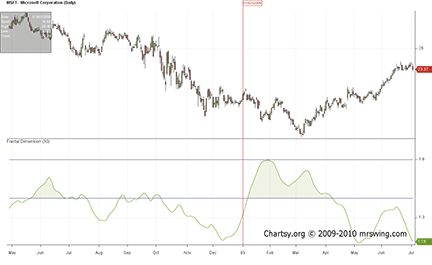

**Figure 15: CHARTSY, FRACTAL DIMENSION INDICATOR**

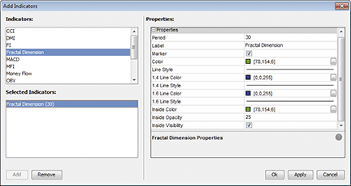

**Figure 16: CHARTSY, indicator properties window**

To download Chartsy, discuss these tools, or help us develop other tools, please visit our forum atwww.chartsy.org. Our development staff will be happy to help & develop your needs and you can become a Chartsy contributor yourself.

�Larry Swing(281) 968-2718,theboss@mrswing.comwww.mrswing.com

## VT Trader

This tip is based on the article �Fractal Dimension As A Market Mode Sensor� by John Ehlers and Ric Way in this issue.

We�ll be offering the fractal dimension indicator for download in our online forums. The VT Trader code and instructions for recreating the indicator are as follows:

VT Trader�s Ribbon → Technical Analysis menu → Indicators group → Indicators Builder → [New] button

In the General tab, type the following text into each corresponding text box:

```text
Name: TASC - 06/2010 - Fractal Dimension
Function Name Alias: tasc_FractalDimension
Label Mask: TASC - 06/2010 - Fractal Dimension (%Price%,%Periods%,%SmPer%,%SmType%) = %Dimen%
Placement: New Frame
Data Inspection Alias: Fractal Dimension
```

In the Input Variable(s) tab, create the following variables:

```text
[New] button�
Name: Price
Display Name: Price
Type: price
Default: Median Price

[New] button�
Name: Periods
Display Name: Periods (must be even number)
Type: integer (with bounds)
Default: 30
Min Bounds: 2
Max Bounds: 9998

[New] button�
Name: SmPer
Display Name: Smoothing Periods
Type: integer (with bounds)
Default: 20
Min Bounds: 1
Max Bounds: 9999

[New] button�
Name: SmType
Display Name: Smoothing Type
Type: MA Type
Default: Simple
```

In the Output Variable(s) tab, create the following variables:

```text
[New] button�
Var Name: Dimen
Name: (Dimension)
Line Color: dark blue
Line Width: slightly thicker
Line Type: solid
```

In the Horizontal Line tab, create the following horizontal lines:

```text
[New] button�
Value: +1.6000
Line Color: red
Line Width: thin
Line Type: dashed

[New] button�
Value: +1.4000
Line Color: red
Line Width: thin
Line Type: dashed
```

In the Formula tab, copy and paste the following formula:

```text
{Provided By: Capital Market Services, LLC & Visual Trading Systems, LLC}
{Copyright: 2010}
{Description: TASC, June 2010 - �Cycle or Trend? Fractal Dimension As A Market Mode Sensor�
 by John F. Ehlers and Ric Way}
{File: tasc_FractalDimension.vtscr - Version 1.0}

N:= Periods;
HalfN:= Int(Periods/2);
Smooth:= (Price + 2*ref(Price,-1) + 2*ref(Price,-2) + ref(Price,-3)) / 6;
N1:= (ref(HHV(H,HalfN),-HalfN) - ref(LLV(L,HalfN),-HalfN)) / HalfN;
N2:= (HHV(H,HalfN) - LLV(L,HalfN)) / HalfN;
N3:= (HHV(H,N) - LLV(L,N)) / N;
Ratio:= 0.5 * ((Log(N1+N2) - Log(N3)) / Log(2)+if(Dimen<>Null,Dimen,C));
Dimen:= mov(Ratio,SmPer,SmType);
```

Click the �Save� icon in the toolbar to finish building the Fractal Dimension indicator.

To attach the indicator to a chart, click the right mouse button within the chart window and then select �Add Indicator� → �TASC - 06/2010 - Fractal Dimension� from the indicator list (Figure 17).

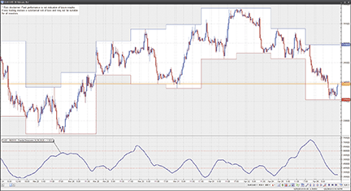

**FIGURE 17: VT TRADER, fractal dimension indicator.Here, the fractal dimension indicator is attached to a EUR/USD 30-minute candlestick chart.**

To learn more about VT Trader, visitwww.cmsfx.com.

Risk disclaimer: Forex trading involves a substantial risk of loss and may not be suitable for all investors.

�Chris SkidmoreCMS Forex(866) 51-CMSFX,trading@cmsfx.comwww.cmsfx.com

## Trading Blox

In �Fractal Dimension As A Market Mode Sensor� in this issue, authors John Ehlers and Ric Way explain how to calculate the fractal indicator to recognize the market mode (that is, trending or cycling).

This indicator can be implemented in Trading Blox using the following steps:

Create a new Auxiliary Blox. Name it �Fractal Dimension Indicator�

Define the parameter: Lookback (integer)

Define the Instrument Permanent Variables: N1, N2, N3, Ratio, Smooth, Dimen, Line14 and Line16. All IPVs are of type �Series� with �Block� scope and a default value of zero, except for Dimen, Line14 and Line16 (scope: �System,� plot on graph area: �Fractal�).

Define the indicator calculations in the �Update Indicators� script of the block:

```text
'-------------------------------------------------------------------

'Trader's Tips June 2010
'Fractal Dimension Indicator by John Ehlers
'Code by Jez Liberty - Au.Tra.Sy
'jez@automated-trading-system.com
'https://www.automated-trading-system.com/

Smooth = (PriceHL + 2*PriceHL[1] + 2*PriceHL[2] + PriceHL[3]) / 6
'Calculate N1, N2 and N3 using Highest and Lowest values over different periods
N3 = ( Highest(Smooth, Lookback, 0) - Lowest(Smooth, Lookback, 0) ) / Lookback
N2 = 2*( Highest(Smooth, Lookback/2, 0) - Lowest(Smooth, Lookback/2, 0) ) / Lookback
N1 = 2*( Highest(Smooth, Lookback/2, Lookback/2) - Lowest(Smooth, Lookback/2, Lookback/2) ) / Lookback

if N1 > 0 and N2 > 0 and N3 > 0 then
	Ratio = .5*((Log(N1 + N2) - Log(N3)) / Log(2) + Dimen[1])
endif

Dimen = Average(Ratio,20)
'---------------------------------------------------------------------
```

This code can be downloaded fromhttps://www.automated-trading-system.com/free-code/

Figure 18 is an example of the fractal dimension indicator applied to a price series in Trading Blox.

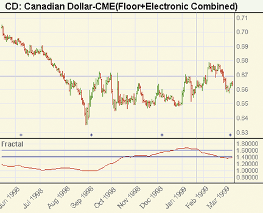

**FIGURE 18: Trading Blox, fractal indicator.Note the difference when the market trend persists and when the market oscillates.**

�Jez Liberty, Au.Tra.Syjez@automated-trading-system.comfor Trading Blox

## EasyLanguage (Ehlers & Way article code)

We choose to use the average of the high and low prices to compute a line indicator (price) because this average is smoother than the closing price alone with respect to high-frequency components. We then smooth price using a four-tap finite impulse response (Fir) filter to entirely notch out the two- and three-bar cycle components. AFirfilter is similar to a moving average except that the selected coefficients enable the elimination of the undesired two- and three-bar period cycle components.

```easylanguage
FRACTAL DIMENSION INDICATOR IN EASYLANGUAGE
Inputs:	Price((H + L)/2),
	N(30); {N must be an even number}

Vars:	Smooth(0),
	count(0),
	N1(0),
	N2(0),
	N3(0),
	HH(0),
	LL(0),
	Ratio(0),
	Dimen(0);

Smooth = (Price + 2*Price[1] + 2*Price[2] + Price[3]) / 6;
N3 = (Highest(Smooth, N) - Lowest(Smooth, N)) / N;
HH = Smooth;
LL = Smooth;
For count = 0 to N / 2 - 1 begin
	If Smooth[count] > HH then HH = Smooth[count];
	If Smooth[count] < LL then LL = Smooth[count];
End;
N1 = (HH - LL) / (N / 2);
HH = Smooth[N / 2];
LL = Smooth[N / 2];
For count = N / 2 to N - 1 begin
	If Smooth[count] > HH then HH = Smooth[count];
	If Smooth[count] < LL then LL = Smooth[count];
End;
N2 = (HH - LL)/(N / 2);
If N1 > 0 and N2 > 0 and N3 > 0 then Ratio = .5*((Log(N1 + N2) - Log(N3)) / Log(2) + Dimen[1]);
Dimen = Average(Ratio, 20);
Plot1(Dimen);
Plot2(1.6, �1.6�, Blue);
Plot3(1.4, �1.4�, Blue);

```

�John Ehlerswww.isignals.com�Ric Wayricway@taosgroup.org.

## BibTeX

```bibtex
@misc{traders_tips_2010_06,
  author       = {{Technical Analysis of STOCKS \& COMMODITIES}},
  title        = {Traders' Tips: Fractal Dimension As A Market Mode Sensor},
  howpublished = {online},
  year         = {2010},
  month        = jun,
  url          = {https://www.traders.com/Documentation/FEEDbk_docs/2010/06/TradersTips.html}
}
```
