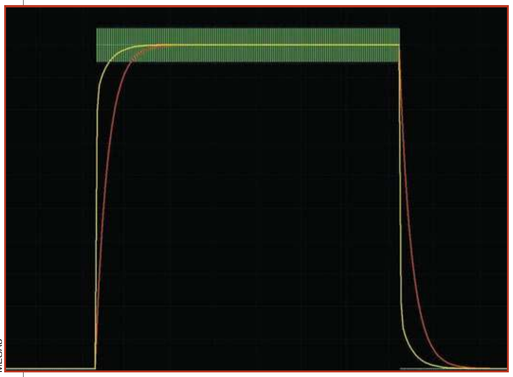
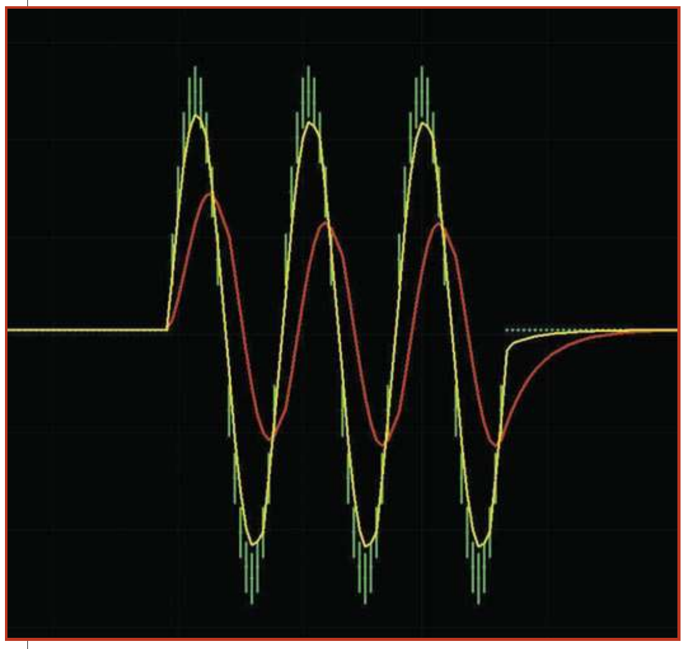
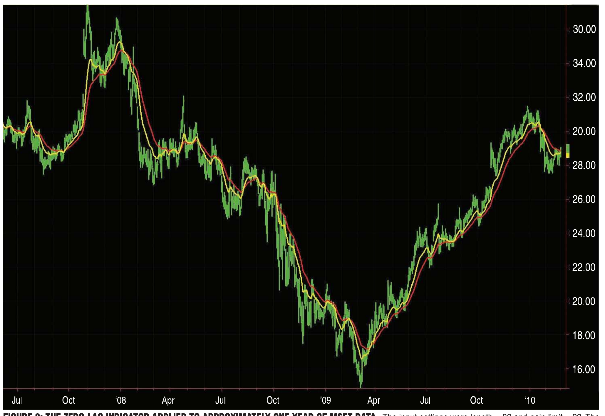
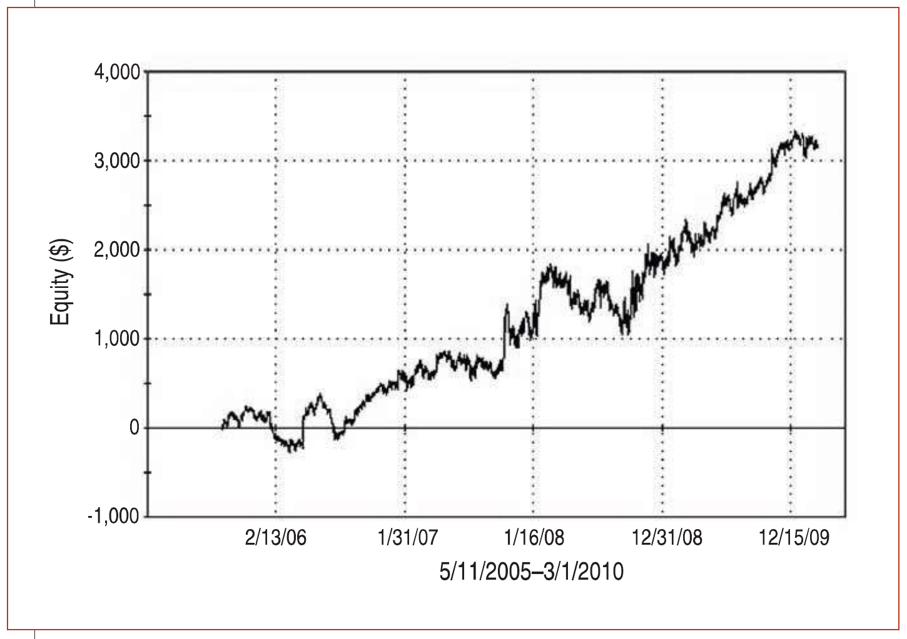

# Zero Lag (Well, Almost)

- **Author:** John Ehlers and Ric Way
- **Publication:** Technical Analysis of STOCKS & COMMODITIES, Volume 28, November 2010, pp. 30--35
- **Article URL:** [Article PDF](https://technical.traders.com/archive/article.asp?file=\V28\C011\211EHLE.pdf)
- **Traders' Tips URL:** [Traders' Tips, November 2010](https://www.traders.com/Documentation/FEEDbk_docs/2010/11/TradersTips.html)

---

A little lag is a good thing. Here's how you can remove a selected amount from an exponential moving average and use the filter in an effective trading strategy.

---

All smoothing filters and moving averages have lag. The lag is necessary because the smoothing is done using past data. Therefore, the averaging includes the effects of the data as of several bars ago. In this article we show you how to remove a selected amount of lag from an exponential moving average (EMA). Removing all the lag is not necessarily a good thing, because with no lag, the indicator would just track out the price you were filtering; the amount of lag removed is a tradeoff with the amount of smoothing you are willing to forgo. We show you the effects of lag removal in an indicator and then use the filter in an effective trading strategy.

## The EMA

An exponential moving average (EMA) is computed by taking a fraction of the current price and adding to it the quantity (1 — fraction) times the previously computed value of the EMA. That fraction is called the "smoothing factor" and is commonly called $\alpha$ (alpha), and alpha is always less than 1. The equation for an EMA can be written as:

$$EMA = \alpha \cdot Price + (1 - \alpha) \cdot EMA[1]$$

where EMA[1] is the value of the EMA one bar ago.

Engineers often describe filters in terms of their impulse response. An impulse is where the data has a finite value at one sample and a zero value at all other samples. Suppose an impulse of data has a value of $1/\alpha$. When the EMA is applied to this impulse, the filter output at the end of the first sample is just 1 because there is no previous value in the filter. On the next sample, the input value is zero, and the previous value of 1 is multiplied by $(1 - \alpha)$, so the output is $(1 - \alpha)$. On the third sample, there again is no new input and the previous value of $(1 - \alpha)$ is multiplied by $(1 - \alpha)$, so the output is $(1 - \alpha)^2$.

The process continues with each new data sample, with the result that the filtered output response to the impulse decays as the exponent of the compliment of the smoothing factor — hence the name "exponential moving average." When alpha is small, the EMA gives a high degree of smoothing and a relatively large amount of lag. When alpha is large (but less than 1), the EMA does very little smoothing and has very little lag.

Traders should also take note that the sum of the coefficients in the filter, $\alpha$ and $(1 - \alpha)$, sum to 1. This means that if the data input is a constant value, the filtered output will eventually almost reach that constant value as well. It is a common coding error to not have the filter coefficients sum to 1. This is why we always write the EMA code to explicitly reflect the smoothing factor and its compliment.

One of the earliest mentions of the relationship between the lag of an EMA and the length of a simple moving average (SMA) was in a 1984 issue of Technical Analysis of STOCKS & COMMODITIES, in an article written by S&C founder Jack Hutson. In it, he found that the EMA smoothing factor is related to the length of an SMA as:

$$\alpha = 2 / (Length + 1)$$

For interested readers, the mathematical derivation of EMA lag related to the length of an SMA can also be found in my book *Rocket Science For Traders*. Since minimalization of lag is crucial to the effectiveness of indicators, several authors have devised ways to make the EMA smoothing factor vary with volatility in price. Software developer Mark Jurik also has commercially available filters for various platforms that are specifically designed to minimize lag.

The method described in this article is fundamentally different from previous approaches. Here, we acknowledge the EMA filter has an error term. That error for the current data sample is just:

$$Error = Price - EMA[1]$$

We introduce this error term into the equation in addition to the value of the new data sample. We further change the amplitude of the error term by multiplying the error by a gain term. We call the new filter EC (for "error correcting") instead of EMA. So the equation for the EC filter is:

$$EC = \alpha \cdot (Price + Gain \cdot (Price - EC[1])) + (1 - \alpha) \cdot EC[1]$$

The equation is simple, but its results are profound. If the gain is zero, the EC becomes just an EMA. If the gain is sufficiently large, the error term causes EC to track the price for all practical purposes — that is, there is virtually no lag or smoothing. We seek a value of gain that is a happy medium between tracing out the price and the EMA. We do this by limiting the maximum amount of allowable gain. If the difference between the price and the previous value of EC is small, we do not want a large value of gain. Further, the previous value of EC can be either greater or less than the current price. To properly apply the error correction, the gain must swing both positive and negative.

The computation of the zero-lag indicator in EasyLanguage is described in the first sidebar, "EasyLanguage Code For Zero-Lag Indicator." There are two user inputs: the length of the equivalent SMA and the "GainLimit." The gain limit input is 10 times the actual gain used in the computation because the error-correcting loop variable works in incremental steps of 1 and we want the gain to be incremented in steps of 0.1. The smoothing factor alpha and EMA are computed after the variables are declared. Next, a loop searches for the least amount of error, varying gain from the lower gain limit to the upper gain limit. When a lower error is computed, the values of best gain and least error are recorded.

Once the loop has completed its work, the "BestGain" value is used to compute the EC indicator. Then both the EMA and EC are plotted on the chart.

It is good practice to test indicators on theoretical waveforms to see if they behave as expected. For example, the zero-lag indicator response to a step function is shown in Figure 1 where the SMA length is set to 12 and the gain limit is set to 50. In Figure 1, we see that the EC indicator line has significantly faster rise and fall times than the EMA. In addition, there are no transient overshoots, which are usually associated with more complicated indicators.


**FIGURE 1: ZERO LAG EC (YELLOW) AND EMA (RED) RESPONSE TO A STEP FUNCTION.** The SMA length is set to 12 and the gain limit is set to 50. Note that the EC indicator line has significantly faster rise and fall times than the EMA.

Another stress test observes how the indicator responds to a short burst of waves. This test assesses how the indicator will respond to wave-like transients in the data. Figure 2 shows the EC and EMA lines responding to a three-cycle burst of waves that are 20 bars long. The zero-lag indicator inputs are again set to a SMA length of 12 and a gain limit of 50. Not only are there no significant transients, but we can also consider the idea of using the EC and EMA line crossovers as entry and exit signals.


**FIGURE 2: EC AND EMA RESPONDING TO A THREE-CYCLE BURST OF WAVES THAT ARE 20 BARS LONG.** The zero-lag indicator inputs are set to a SMA length of 12 and a gain limit of 50. The zero-lag indicator provides reliable crossover signals.

When we apply the zero-lag indicator to real market data — using closing prices, for example — we know the EC line will not faithfully follow the close, instead providing a leading indicator relative to the EMA. In general, when the EC is above the EMA, the stock is in a bull mode, and when the EC is below the EMA, the stock is bearish.


**FIGURE 3: THE ZERO-LAG INDICATOR APPLIED TO APPROXIMATELY ONE YEAR OF MSFT DATA.** The input settings were length = 32 and gain limit = 22. The red line is the EMA and the yellow line is the EC error-corrected line. The EC provides a leading indicator relative to the EMA.

The line crossovers of the zero-lag indicator suggest that an automatic crossover trading system is feasible using the crossings of the EC and EMA lines as entry and exit signals for both long and short positions. However, a problem arises when the least error is relatively small. In this situation, the EC and EMA have almost the same value, and therefore, a considerable number of undesirable whipsaw trades are made under this condition. The whipsaw trades can be reduced by setting an additional condition that the least error must be greater than some threshold value at the same time the EC and EMA lines cross. The code for this strategy can be found in the second sidebar, "EasyLanguage For Zero-Lag Strategy." In this code, "Thresh" is an input parameter. To make the code more universal for all symbols, the threshold is compared to a percentage of the least error normalized to the closing price.

When the zero-lag strategy was applied to five years of 100 shares of MSFT with settings length = 32, gain limit = 22, and thresh = 0.75, we obtained the following hypothetical results:

| Metric | Value |
|--------|-------|
| Net profit | $3,107 |
| # Trades | 20 |
| Profit/trade | $155 |
| % Profitable trades | 60% |
| Profit factor | 4.1 |


**FIGURE 4: THE EQUITY CURVE OVER A FIVE-YEAR PERIOD.** The zero-lag strategy shows uniform equity growth on MSFT. The relatively few trades over the five-year observation period indicate the zero-lag trading strategy is a trend-follower.

The relatively few trades over the five-year observation period indicate that the zero-lag trading strategy is a trend-follower. A selection of a shorter period for the equivalent SMA length can turn it into a swing trader. If this is done in the case of MSFT, the percentage wins increases, the profit factor decreases, and the equity growth curve has less of a consistent growth than shown in Figure 4.

> Zero lag is a new concept in adaptive technical analysis. This simple technique of applying a measured amount of error correction has resulted in both an effective technical indicator and automatic trading strategy that are free from the transients that usually accompany more sophisticated filters.

## EasyLanguage Code For The Zero-Lag Indicator

```easylanguage
Inputs:
  Length(20),
  GainLimit(50);

Vars:
  alpha(0),
  Gain(0),
  BestGain(0),
  EC(0),
  Error(0),
  LeastError(0),
  EMA(0);

alpha = 2 / (Length + 1);
EMA = alpha*Close + (1 - alpha)*EMA[1];
LeastError = 1000000;
For Value1 = -GainLimit to GainLimit Begin
  Gain = Value1 / 10;
  EC = alpha*(EMA + Gain*(Close - EC[1])) + (1 - alpha)*EC[1];
  Error = Close - EC;
  If AbsValue(Error) < LeastError Then Begin
    LeastError = AbsValue(Error);
    BestGain = Gain;
  End;
End;
EC = alpha*(EMA + BestGain*(Close - EC[1])) + (1 - alpha)*EC[1];

Plot1(EC);
Plot3(EMA);
```

## EasyLanguage For Zero-Lag Strategy

```easylanguage
Inputs:
  Length(20),
  GainLimit(50),
  Thresh(1);

Vars:
  alpha(0),
  Gain(0),
  BestGain(0),
  EC(0),
  Error(0),
  LeastError(0),
  EMA(0);

alpha = 2 / (Length + 1);
EMA = alpha*Close + (1 - alpha)*EMA[1];
LeastError = 1000000;
For Value1 = -GainLimit to GainLimit Begin
  Gain = Value1 / 10;
  EC = alpha*(EMA + Gain*(Close - EC[1])) + (1 - alpha)*EC[1];
  Error = Close - EC;
  If AbsValue(Error) < LeastError Then Begin
    LeastError = AbsValue(Error);
    BestGain = Gain;
  End;
End;
EC = alpha*(EMA + BestGain*(Close - EC[1])) + (1 - alpha)*EC[1];

If EC Crosses Over EMA and 100*LeastError / Close > Thresh Then Buy Next Bar on Open;
If EC Crosses Under EMA and 100*LeastError / Close > Thresh Then Sell Short Next Bar on Open;
```

## About The Authors

John Ehlers is a pioneer in the use of cycles and DSP techniques in technical analysis. He is the author of the MESA9 program and is the chief scientist for www.stockspotter.com. Ric Way is an independent software developer specializing in programming algorithmic trading systems in C#. He may be reached at ricway@taosgroup.org.

## Suggested Reading

- Chande, Tushar S., and Stanley Kroll [1994]. *The New Technical Trader*, John Wiley & Sons.
- Ehlers, John F. [2001]. *Rocket Science For Traders*, John Wiley & Sons.
- Hutson, Jack [1984]. "Filter Price Data: Moving Averages Vs. Exponential Moving Averages," Technical Analysis of STOCKS & COMMODITIES, Volume 2: 2.
- Kaufman, P.J. [2005]. *New Trading Systems And Methods*, 4th edition, John Wiley & Sons.

---

## BibTeX

```bibtex
@article{ehlers_way_2010_zero_lag,
  author    = {Ehlers, John F. and Way, Ric},
  title     = {Zero Lag (Well, Almost)},
  journal   = {Technical Analysis of STOCKS \& COMMODITIES},
  volume    = {28},
  number    = {11},
  pages     = {30--35},
  year      = {2010},
  month     = nov,
  url       = {https://technical.traders.com/archive/article.asp?file=\V28\C011\211EHLE.pdf}
}

@misc{traders_tips_2010_11,
  author       = {{Technical Analysis of STOCKS \& COMMODITIES}},
  title        = {Traders' Tips: Zero Lag (Well, Almost)},
  howpublished = {online},
  year         = {2010},
  month        = nov,
  url          = {https://www.traders.com/Documentation/FEEDbk_docs/2010/11/TradersTips.html}
}
```
