# Traders' Tips: November 2010

- **Article:** Zero Lag (Well, Almost) by John Ehlers and Ric Way
- **Traders' Tips URL:** [Traders' Tips, November 2010](https://www.traders.com/Documentation/FEEDbk_docs/2010/11/TradersTips.html)

---


## TRADESTATION: November 2010

TRADESTATION: ZERO-LAG EMA

In �Zero Lag (Well, Almost)� in this issue, authors John Ehlers and Ric Way present their zero-lag indicator and strategy.

We have adapted their zero-lagEmaby extending the functionality in an additional chart indicator named �ZeroLagEMAInd2� (see following code). An alert was added so that the user can be alerted when a crossing of the averages occurs, and a ShowMe dot can be plotted on the detection of a crossing. In addition, PaintBar functionality was added in the same indicator to paint the bars depending on which average (EC orEma) is larger. The moving average plots, ShowMe dots, and PaintBars can all be toggled on and off via the inputs of the indicator. More notes can be found in the code.

To download the EasyLanguage code for ZeroLagEMAInd2 and  the original zero-lagEmaindicator and strategy, go to the TradeStation and EasyLanguage Support Forum (https://www.tradestation.com/Discussions/forum.aspx??Forum_ID=213) and search for the file �Ehlers_ZeroLagEMA.eld.�

A sample chart is shown in Figure 1.

Figure 1: TRADESTATION, ZERO-LAG EMA.Shown here is a daily bar chart of Microsoft displaying the indicator �ZeroLagEMAInd2� (with all plots turned on). The yellow line is the EC average (EMA corrected with the gain). The red line is the EMA. The yellow and magenta dots are for the crossing of the moving averages, including the threshold requirement described by John Ehlers and Ric Way in their article. Finally, the bars are painted cyan when the EC is above the EMA, and red when the EC is below the EMA.

This article is for informational purposes. No type of trading or investment recommendation, advice, or strategy is being made, given, or in any manner provided by TradeStation Securities or its affiliates.

�Chris ImhofTradeStation Securities, Inc.A subsidiary of TradeStation Group, Inc.www.TradeStation.com

BACK TO LIST


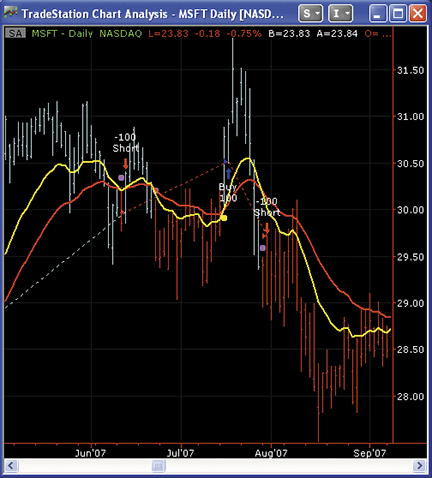
**FIGURE 1.**


```easylanguage
ZeroLagEMAInd2

inputs:
	Length( 20 ),
	GainLimit( 50 ),
	Thresh( 1 ), { see article for threshold explanation }
	UseThreshold( true ), { if true, then the threshold is used for the 
        ShowMe dots and crossing alert - see notes below } 
	DrawMALines( true ), { if true, the Moving Average lines are plotted }
	DrawShowMeDots( false ), { if true, ShowMe dots are plotted when a cross 
        of EC and EMA are detected }
	DotOffsetTicks( 10 ), { offset for the ShowMe dots }
	DrawPaintBars( false ) ; { draw PaintBars, color depending on EC > EMA }

variables:
	ATick( 0 ),
	alpha( 0 ),
	Gain( 0 ),
	BestGain( 0 ),
	EC( 0 ),
	Error( 0 ),
	LeastError( 0 ),
	EMA( 0 ),
	CrossOver( false ),
	CrossUnder( false ) ;

if CurrentBar = 1 then
	ATick = MinMove / PriceScale ; { calculate value of a tick }

alpha = 2 / ( Length + 1 ) ;
EMA = alpha * Close + ( 1 - alpha ) * EMA[1] ;
LeastError = 1000000 ;

for Value1 = -GainLimit to GainLimit 
	begin
	Gain = Value1 / 10 ;
	EC = alpha *( EMA + Gain * ( Close - EC[1] ) ) + ( 1 - alpha ) * EC[1] ;
	Error = Close - EC ;
	If AbsValue( Error ) < LeastError then 
		begin
		LeastError = AbsValue( Error ) ;
		BestGain = Gain ;
		end ;
	end ;

EC = alpha * ( EMA + BestGain * ( Close - EC[1] ) ) + ( 1 - alpha ) * EC[1] ;

if DrawMALines then
	begin
	Plot1( EC, "EC" ) ;
	Plot2( EMA, "EMA" ) ;
	end ;

{
The requirements for crosses over or under of EC in relation to EMA is 
dependent upon the "UseThreshold" input.  If the input is set to "True", 
the Threshold requirement is taken into account, similar to the strategy 
code posted by John Ehlers. Note that the CrossOver and CrossUnder variables 
not only control the plotting of the ShowMe dots but also the triggering of the alert.
}
CrossOver = IffLogic( UseThreshold, EC crosses over EMA and 
 100 * LeastError / Close > Thresh, EC crosses over EMA ) ;

CrossUnder = IffLogic( UseThreshold, EC crosses under EMA and 
 100 * LeastError / Close > Thresh, EC crosses under EMA ) ;

if CrossOver then
	begin
	if DrawShowMeDots then
		Plot3( Low - ATick * DotOffsetTicks, "ECxEMA", Yellow ) ;
	Alert( "EC cross over EMA" ) ; { alert for cross over }
	end ;
if CrossUnder then
	begin 
	if DrawShowMeDots then
		Plot3( High + ATick * DotOffsetTicks, "ECxEMA", Magenta ) ;
	Alert( "EC cross under EMA" ) ; { alert for cross under }
	end ;

{
This code emulates the PaintBar study.  If EC is above EMA, the bars are painted cyan,
 otherwise they are painted red.  Note that the plot styles has specific settings to 
 paint the bars properly.  If indicator is applied to a candlestick chart, the thickness 
 of the plots may need to adjusted. 
}	
If DrawPaintBars then
	begin
	Plot4( High ) ;
	Plot5( Low ) ;
	Plot6( Open ) ;
	Plot7( Close ) ;
	if EC > EMA then 
		begin
		SetPlotColor( 4, Cyan ) ;
		SetPlotColor( 5, Cyan ) ;
		SetPlotColor( 6, Cyan ) ;
		SetPlotColor( 7, Cyan ) ;
		end
	else
		begin
		SetPlotColor( 4, Red ) ;
		SetPlotColor( 5, Red ) ;
		SetPlotColor( 6, Red ) ;
		SetPlotColor( 7, Red ) ;
		end
	end ;
 
```


## WEALTH-LAB: November 2010

WEALTH-LAB: ZERO-LAG STRATEGY

We hope that the zero-lag EC filter presented by John Ehlers and Ric Way in their article in this issue, �Zero Lag (Well, Almost),� becomes an addition to the trader�s arsenal. To be employed in a Wealth-Lab strategy, all it takes is to install (or update if you haven�t done so already) the TascIndicators library from thewww.wealth-lab.comsite.

Our tests of the always-in-market system described in the article on several diversified portfolios show that it has potential but may benefit from further optimization and refinement. (See Figure 2.)

Figure 2: WEALTH-LAB, ZERO-LAG STUDY.Here is a sample Wealth-Lab Developer chart (60-minute) showing the EC filter applied to October 2010 crude oil.

It�s pleasing to see how this responsive, leading indicator tracks trends, but traders should never underestimate the amount of time spent by markets in range-trading and consolidation phases. As can be seen on the crude oil chart in Figure 2, the least-error filter (the green line in its upper half) is doing a good job ruling out the low-probability signals, yet it misses some here and there. To improve performance, adding some other filter to detect nontrending conditions might be appropriate.

�Eugenewww.wealth-lab.com

BACK TO LIST


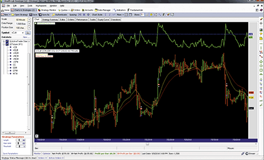
**FIGURE 2.**


```csharp
C# code:

using System;
using System.Collections.Generic;
using System.Text;
using System.Drawing;
using WealthLab;
using WealthLab.Indicators;
using TASCIndicators;	// The EC filter and Least Error

namespace WealthLab.Strategies
{
	public class ZeroLag1011 : WealthScript
	{
		private StrategyParameter paramLength;
		private StrategyParameter paramGain;
		private StrategyParameter paramThresh;
		
		public ZeroLag1011()
		{
			paramLength = CreateParameter("Length", 32, 2, 100, 1);
			paramGain = CreateParameter("Gain Limit", 22, 2, 100, 1);
			paramThresh = CreateParameter("Threshold", 0.75, 0.5, 2, 0.25);
		}
		
		protected override void Execute()
		{
			int Length = paramLength.ValueInt;
			int GainLimit = paramGain.ValueInt;
			double Thresh = paramThresh.Value;
			
			// Data series
			EMA ema = EMA.Series( Close, Length, EMACalculation.Modern );
			EC ec = EC.Series( Close, Length, GainLimit );
			LeastError le = LeastError.Series( Close, Length, GainLimit );
			
			SetBarColors( Color.LimeGreen, Color.OrangeRed );
			
			// This EMA-based indicator is "unstable": allow it to stabilize
			for(int bar = Length * 3; bar < Bars.Count; bar++)
			{
				SetBackgroundColor( bar, Color.Black );
				
				// Detect crossover/crossunder and LeastError above threshold
				bool maXo = CrossOver( bar, ec, ema ) & ( le[bar] > Thresh );
				bool maXu = CrossUnder( bar, ec, ema ) & ( le[bar] > Thresh );
					
				// The initial trade
				if (Positions.Count == 0){
					if ( maXo ) 
						BuyAtMarket( bar + 1 );
					else if( maXu )
						ShortAtMarket( bar + 1 );
				}
					// All subsequent trades of the SAR system
				else 
				{
					Position p = LastPosition;	
					if ( p.PositionType == PositionType.Long )  {
						if ( maXu )  {
							SellAtMarket( bar + 1, p );
							ShortAtMarket( bar + 1 );
						}
					}
					else  {
						if ( maXo ) {
							CoverAtMarket( bar + 1, p );
							BuyAtMarket( bar + 1 );
						}
					}
				}	
			}
			
			// Plotting the EC, EMA, and Least Error
			WealthLab.LineStyle solid = LineStyle.Solid;
			PlotSeries( PricePane, ec, Color.Gold, solid, 1 );
			PlotSeries( PricePane, ema, Color.Red, solid, 1 );
			ChartPane lePane = CreatePane( 30,true,true );
			PlotSeries( lePane, le, Color.LimeGreen, solid, 2 );
			DrawHorzLine( lePane, Thresh, Color.Blue, LineStyle.Dashed, 2 );
			HideVolume();
		}
	}
}


```


## ESIGNAL: November 2010

eSIGNAL: ZERO-LAG STRATEGY

For this month�s Traders� Tip, we�ve provided two formulas, �ZeroLag_EC.efs� and �ZeroLag_EC_Strategy.efs,� based on the formula code from the article in this issue by John Ehlers and Ric Way titled �Zero Lag (Well, Almost).�

The studies contain formula parameters to set thelengthandgain limit, which may be configured through the Edit Studies window (Advanced Chart menu → Edit Studies). The strategy formula is configured for backtesting based on the strategy provided in Ehlers and Way�s article and contains one additional formula parameter to set: the threshold value of the strategy.

Sample charts are shown in Figures 3 and 4.

Figure 3: eSIGNAL, ZERO-LAG INDICATOR

Figure 4: eSIGNAL, ZERO-LAG STRATEGY

To discuss this study or download complete copies of the formula code, please visit theEfsLibrary Discussion Board forum under the Forums link atwww.esignalcentral.comor visit ourEfsKnowledgeBase atwww.esignalcentral.com/support/kb/efs/. The eSignal formula scripts (Efs) are also available for copying and pasting from theStocks & Commoditieswebsite atTraders.com.

�Jason KeckInteractive Data Desktop Solutions800 815-8256,www.eSignal.com/support/

BACK TO LIST


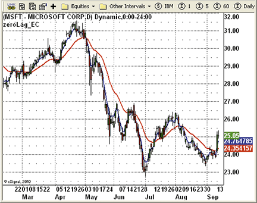
**FIGURE 3.**


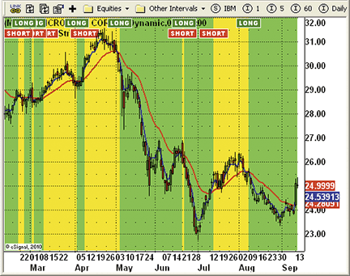
**FIGURE 4.**


```javascript
ZeroLag_EC.efs

/*********************************
Provided By:                                                      
    Interactive Data Corporation (Copyright � eSignal) 2010.      
    All rights reserved. This sample eSignal Formula Script (EFS) 
    is for educational purposes only. Interactive Data Corporation
    reserves the right to modify and overwrite this EFS file with 
    each new release.                                             

Description:        
    Zero Lag (Well, Almost) Indicator by John Ehlers and Ric Way
Version:  1.0  13/09/2010
 
Formula Parameters:            Default:
    Length                              20
    Gain Limit                          50
    
Notes:
    
**********************************/

var fpArray = new Array();
var bVersion = null;

function preMain()
{
    setPriceStudy(true);
    setStudyTitle("zeroLag_EC");
    setCursorLabelName("zeroLag_EMA", 0);
    setDefaultBarStyle(PS_SOLID, 0);
    setDefaultBarFgColor(Color.red, 0);
    setDefaultBarThickness(2, 0);
    setPlotType(PLOTTYPE_LINE, 0);
    setCursorLabelName("zeroLag_EC", 1);
    setDefaultBarStyle(PS_SOLID, 1);
    setDefaultBarFgColor(Color.blue, 1);
    setDefaultBarThickness(2, 1);
    setPlotType(PLOTTYPE_LINE, 1);
    var x=0;
    fpArray[x] = new FunctionParameter("gLength", FunctionParameter.NUMBER);
	with(fpArray[x++]){
        setName("Length");
        setLowerLimit(1);		
        setDefault(20);
    }
    fpArray[x] = new FunctionParameter("gGainLimit", FunctionParameter.NUMBER);
	with(fpArray[x++]){
	    setName("Gain Limit");
        setLowerLimit(1);		
        setDefault(50);
    }
}

var bMainInit = false; 
var xEMA = null;
var xEC = null;
var nAlpha = 0;

function main(gLength, gGainLimit)
{
    var nGain = 0;
    var nBestGain = 0;
    var nError = 0;
    var nLeastError = 1000000;
 
    if (bVersion == null) bVersion = verify();
    if (bVersion == false) return;   
    var nBarState = getBarState();
    if (nBarState == BARSTATE_ALLBARS) {
        if (gLength == null) gLength = 20;
        if (gGainLimit == null) gGainLimit = 50;
        nAlpha = 2/(gLength+1);
    }    
    if (!bMainInit)
    {
        xEMA = efsInternal("calcEMA",nAlpha);
        xEC = efsInternal("calcEC",nAlpha,gGainLimit,xEMA);
    }

    var nEMA = xEMA.getValue(0);
    var nEC = xEC.getValue(0);
    if( nEMA == null || nEC == null) return ;

    return new Array( nEMA, nEC) ;
}

function calcEMA(nAlpha)
{
    if (getCurrentBarCount()==1) var nRefEMA = close(0) 
    else  var nRefEMA = ref(-1);
    var vEMA = nAlpha*close(0)+(1-nAlpha)*nRefEMA;
    return vEMA;
}

var nBestGain = 0;

function calcEC(nAlpha,nGaintLimit, xEMA)
{
    var nLeastError = 1000000;
    if (getCurrentBarCount()==1) var nRefEC = close(0) 
    else var nRefEC = ref(-1);

    var nClose = close(0);
    var vEMA = xEMA.getValue(0);
    var nCount = 0;
    var nGain = 0;
    var nError = 0;
    var vEC = 0 ;
    for (nCount=-nGaintLimit; nCount<=nGaintLimit; nCount++)
    {
        nGain = nCount/10;
        vEC = nAlpha*(vEMA+nGain*(nClose-nRefEC))+(1-nAlpha)*nRefEC;
        nError = nClose - vEC;
        if (Math.abs(nError) vEMA2 && vEC1 < vEMA1 && 100*nLeastError/nClose > gThresh) 
    {
        drawTextRelative(0, TopRow1, " LONG ", Color.white, Color.green,
         Text.PRESET|Text.CENTER|Text.FRAME, "Arial Black", 10, "b"+(nBarCount));
        if(!Strategy.isLong()) Strategy.doLong("Entry Long", Strategy.MARKET, Strategy.THISBAR);
    }
    if (vEC2 < vEMA2 && vEC1 > vEMA1 && 100*nLeastError/nClose > gThresh)
    {
        drawTextRelative(0, TopRow1+1,  " SHORT ", Color.white, Color.red,
         Text.PRESET|Text.CENTER|Text.FRAME, "Arial Black", 10, "b"+(getCurrentBarCount())); 
        if(!Strategy.isShort()) Strategy.doShort("Entry Short", Strategy.MARKET, Strategy.THISBAR);
    }
	if(Strategy.isLong()) setBarBgColor(Color.lime);
	if(Strategy.isShort()) setBarBgColor(Color.yellow);
        
    return new Array( nEMA, nEC) ;
}

function calcEMA(nAlpha)
{
    if (getCurrentBarCount()==1) var nRefEMA = close(0) 
    else  var nRefEMA = ref(-1);
    var vEMA = nAlpha*close(0)+(1-nAlpha)*nRefEMA;
    return vEMA;
}

var nBestGain = 0;
function calcEC(nAlpha,nGaintLimit, xEMA)
{
    var nLeastError = 1000000;
    if (getCurrentBarCount()==1) var nRefEC = close(0) 
    else var nRefEC = ref(-1);
    var nClose = close(0);
    var vEMA = xEMA.getValue(0);
    var nCount = 0;
    var nGain = 0;
    var nError = 0;
    var vEC = 0 ;
    for (nCount=-nGaintLimit; nCount<=nGaintLimit; nCount++)
    {
        nGain = nCount/10;
        vEC = nAlpha*(vEMA+nGain*(nClose-nRefEC))+(1-nAlpha)*nRefEC;
        nError = nClose - vEC;
        if (Math.abs(nError)
```


## AMIBROKER: November 2010

AMIBROKER: ZERO-LAG STRATEGY

Implementing the zero-lag moving average presented by John Ehlers and Ric Way in theirarticle in this issueis straightforward in AmiBroker Formula Language.

A ready-to-use formula for the article is presented in Listing 1. The code includes both the indicator code and a trading strategy based on a zero-lag average as presented in the article. The formula can be used in the Automatic Analysis window (for backtesting) and as a chart. To use it, enter the formula in theAflEditor, then press the �Insert Indicator� button to see the chart, or press �Backtest� to perform a historical test of the strategy.

A sample chart is shown in Figure 5.

Figure 5: AMIBROKER, ZERO-LAG INDICATOR.Shown here is a daily chart of MSFT (green) with a 32-bar exponential moving average (red line) and an EC (error-corrected) line (length=32, gain limit=22), replicating the chart from John Ehlers and Ric Way�s article.

�Tomasz Janeczko, AmiBroker.comwww.amibroker.com

BACK TO LIST


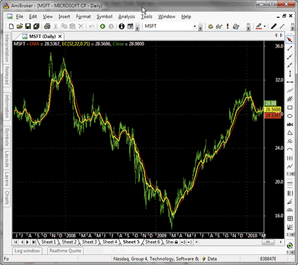
**FIGURE 5.**


```afl
Listing 1

// Zero-Lag Indicator for AmiBroker 
// TASC Traders Tips November 2010 
// 

Length = Param("Length", 32, 0, 100 ); 
GainLimit = Param("Gain limit", 22, 1, 100 ); 
Threshold = Param("Threshold", 0.75, 0.1, 10, 0.01 ); 

alpha = 2 / ( Length + 1 ); 

iEMA = AMA( Close, alpha ); 

EC = Close[ 0 ]; 

for( bar = 0; bar < BarCount; bar++ ) 
{ 
 EC1 = EC; 

 LeastError = 1e9; 
 BestEC = 0; 

 for( gain = -0.1 * GainLimit; gain < 0.1 * GainLimit; gain += 0.1 ) 
 { 
   EC = alpha * ( iEMA[ bar ] + gain * ( Close[ bar ] - EC1 ) ) + 
       ( 1 - alpha ) * EC1; 

   Error = abs( Close[ bar ] - EC ); 

   if( Error < LeastError ) 
   { 
    LeastError = Error; 
    BestEC = EC; 
   } 
 } 
 iEC[ bar ] = BestEC;   
 iLeastError[ bar ] = LeastError; 
} 
Plot( iEMA, "EMA", colorRed ); 
Plot( iEC, "EC" + _PARAM_VALUES(), colorYellow, styleThick ); 
Plot( C, "Close", ParamColor("Color", colorGreen ), ParamStyle("Style") | GetPriceStyle() ); 

// strategy rules 
Buy = Cross( iEC, iEMA ) AND 100 * iLeastError / Close > Threshold; 
Short = Cross( iEMA, iEC ) AND 100 * iLeastError / Close > Threshold; 
Sell = Short; 
Cover = Buy; 
// trade on next bar open 
SetTradeDelays( 1, 1, 1, 1 ); 
BuyPrice = SellPrice = CoverPrice = ShortPrice = Open; 


```


## WORDEN BROTHERS STOCKFINDER: November 2010

WORDEN BROTHERS STOCKFINDER: ZERO-LAG STRATEGY

The zero-lag indicator fromJohn Ehlers and Ric Way�s articlehas now been made available in the StockFinder version 5 indicator library.

You can add the indicator to your chart by clicking the �Add Indicator/Condition� button or by simply typing �/zero lag� and choosing it from the list of available indicators (Figure 6).

Figure 6: STOCKFINDER, ZERO-LAG STUDY.The red line is the EMA and the yellow line is the EC (error-corrected) line.

The indicator was constructed using RealCode, which is based on the Microsoft VisualBasic.Net framework and uses the Visual Basic (VB) language syntax. RealCode is compiled into a .Net assembly and run by the StockFinder application.

To download the StockFinder software and get a free trial, go towww.StockFinder.com.

� Bruce Loebrich and Patrick ArgoWorden Brothers, Inc.www.StockFinder.com

BACK TO LIST


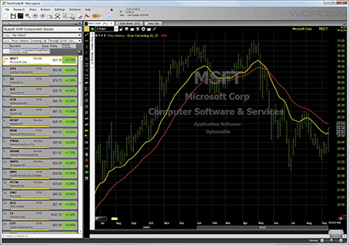
**FIGURE 6.**


```basic
'|******************************************************************
'|*** StockFinder RealCode Indicator - Version 5.0 www.worden.com 
'|*** Copy and paste this header and code into StockFinder *********
'|*** Indicator: Zero Lag - Error Correcting
'|******************************************************************
'# Length = UserInput.Integer = 20
'# GainLimit = UserInput.Integer = 50
Static alpha As Single
Static EC(1) As Single
Static EMA As Single
If isFirstBar Then
                alpha = 2 / (Length + 1)
                EC(0) = Price.Last
                EMA = Price.Last
End If
EC(1) = EC(0)
EMA = alpha * Price.Last + (1 - alpha) * EMA
Dim LeastErr As Single = Single.MaxValue
Dim BestGain As Single
For Value1 As Integer = -GainLimit To GainLimit
                Dim Gain As Single = Value1 / 10
                EC(0) = alpha * (EMA + Gain * (Price.Last - EC(1))) + (1 - alpha) * EC(1)
                Dim Err As Single = Price.Last - EC(0)
                If System.Math.Abs(Err) < LeastErr Then
                                LeastErr = System.Math.Abs(Err)
                                BestGain = Gain
                End If
Next
EC(0) = alpha * (EMA + BestGain * (Price.Last - EC(1))) + (1 - alpha) * EC(1)
OpenValue = EMA
HighValue = System.Math.Max(EMA, EC(0))
LowValue = System.Math.Min(EMA, EC(0))
Plot = EC(0)


```


## NEUROSHELL: November 2010

NEUROSHELL TRADER: ZERO-LAG STRATEGY

The zero-lag indicator described in thearticle by John Ehlers and Ric Wayin this issue can be easily implemented in NeuroShell Trader using NeuroShell Trader�s ability to call external programs. The programs can be written in standard programming languages such as C, C++, Power Basic, or Delphi.

After moving the EasyLanguage code given in the article to your preferred programming language and creating aDll, you can insert the resulting zero-lag indicator as follows:

To recreate the zero-lag trading system, select �New Trading Strategy�� from the Insert menu and enter the following in the appropriate locations of the Trading Strategy Wizard:

If you have NeuroShell Trader Professional, you can also choose whether the parameters should be optimized. After backtesting the trading strategies, use the �Detailed Analysis�� button to view the backtest and trade-by-trade statistics for each strategy.

Figure 7: NEUROSHELL TRADER, ZERO-LAG STUDY.Here is a sample NeuroShell Trader chart displaying the zero-lag indicator and system.

Users of NeuroShell Trader can go to theStocks & Commoditiessection of the NeuroShell Trader free technical support website to download a copy of this or any previous Traders� Tips.

A sample chart is shown in Figure 7.

�Marge Sherald, Ward Systems Group, Inc.301 662-7950,sales@wardsystems.comwww.neuroshell.com

BACK TO LIST


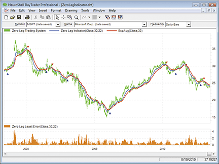
**FIGURE 7.**


```
Generate a buy long market order if all of the following are true:

CrossAbove( ZeroLagIndicator(Close, 32, 22), ExpAvg(Close, 22))
A>B ( Multiply2( 100, Divide( ZeroLagLeastError(Close, 32, 22), Close )), 1)

Generate a sell short market order if all of the following are true:

CrossBelow( ZeroLagIndicator(Close, 32, 22), ExpAvg(Close, 22))
A>B ( Multiply2( 100, Divide( ZeroLagLeastError(Close, 32, 22), Close )), 1)

```


## TRADERSSTUDIO: November 2010

TRADERSSTUDIO: ZERO-LAG EMA

The TradersStudio code for the zero-lagEmaindicator, function, and system as described in �Zero Lag (Well, Almost)� by John Ehlers and Ric Way in this issue is provided here.

The coded version that I have provided also includes the system that was supplied by the authors in their article. The system is always in the market either long or short. To test the indicator, I ran a longer period (1/1/1996 to 9/13/1910) onMsftusing the authors� suggested parameters.

The resulting equity curve is shown in Figure 8. I also tested using the same parameters and test periods onQqqqand on a portfolio of 76 liquidNasdaqstocks, many of which are in theNasdaq100. The results of these two additional tests are shown in Figures 9 and 10, respectively. All tests traded a constant 200 shares of each stock and applied round-turn slippage and a commission of $6 per share.

Figure 8: TRADERSSTUDIO, ZERO-LAG SYSTEM ON MSFT.Shown here is a sample equity curve for the zero-lag system on MSFT for the period 1/1/1996 to 9/13/2010.

Figure 9: TRADERSSTUDIO, ZERO-LAG SYSTEM ON QQQQ.Shown here is a sample equity curve for the zero-lag system on QQQQ for the period 1/1/1996 to 9/13/2010.

Figure 10: TRADERSSTUDIO, ZERO-LAG SYSTEM ON NASDAQ.Shown here is a sample equity curve for the zero-lag system on a portfolio of 76 NASDAQ stocks for the period 1/1/1996 to 9/13/2010.

www.TradersStudio.com → Traders Resources → FreeCode

www.TradersEdgeSystems.com/traderstips.htm

�Richard Denninginfo@TradersEdgeSystems.comfor TradersStudio

BACK TO LIST


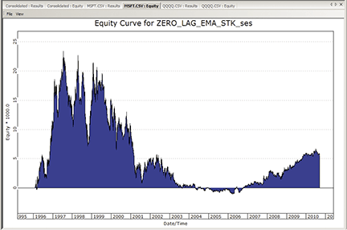
**FIGURE 8.**


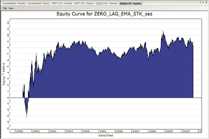
**FIGURE 9.**


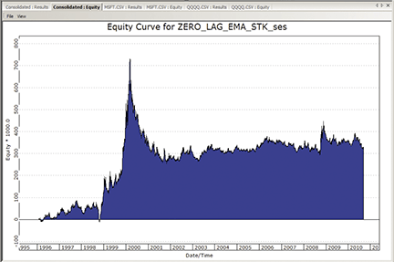
**FIGURE 10.**


## AIQ: November 2010

AIQ: SPECIAL K

TheAiqcode for Martin J. Pring�s Special K indicator from his January 2009 article in S&C, �Identifying And Timing With The Special K,� is provided here.

In Figure 11, I show the Special K indicator on a chart of theQqqq Etf. Crossovers on the indicator seem to call significant market turns.

Figure 11: AIQ SYSTEMS, PRING SPECIAL K INDICATOR.Here is a sample chart of the QQQQ ETF with the Special K indicator.

The code andEdsfile can be downloaded fromwww.TradersEdgeSystems.com/traderstips.htm.

�Richard Denninginfo@TradersEdgeSystems.comfor AIQ Systems

BACK TO LIST


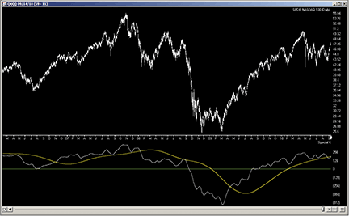
**FIGURE 11.**


```eds
! THE SPECIAL K INDICATOR
! Author: Martin J. Pring, TASC Jan 2009
! Coded by: Richard Denning 9/14/10
! www.TradersEdgeSystems.com

! INPUTS:
len1 is 100.
len2 is 100.

! UDFs:
C is [close].
rc10 is (C / valresult(C,10)-1)*100.
rc15 is (C / valresult(C,15)-1)*100.
rc20 is (C / valresult(C,20)-1)*100.
rc30 is (C / valresult(C,30)-1)*100.
rc50 is (C / valresult(C,50)-1)*100.
rc65 is (C / valresult(C,65)-1)*100.
rc75 is (C / valresult(C,75)-1)*100. 
rc100 is (C / valresult(C,100)-1)*100.
rc195 is (C / valresult(C,195)-1)*100.
rc265 is (C / valresult(C,265)-1)*100.
rc390 is (C / valresult(C,390)-1)*100.
rc530 is (C / valresult(C,530)-1)*100.

SpecK is simpleavg(rc10,10)*1 + 
	simpleavg(rc15,10)*2 + 
	simpleavg(rc20,10)*3 + 
	simpleavg(rc30,15)*4 + 
	simpleavg(rc50,50)*1 + 
	simpleavg(rc65,65)*2 + 
	simpleavg(rc75,75)*3 + 
	simpleavg(rc100,100)*4 + 
	simpleavg(rc195,130)*1 + 
	simpleavg(rc265,130)*2 + 
	simpleavg(rc390,130)*3 + 
	simpleavg(rc530,195)*4.   !Plot

SpecKMA is simpleavg(simpleavg(SpecK,len1),len2). 

HD if hasdatafor(550) >= 530.

! PLOT THE FOLLOWING TWO UDFs 
! AS A TWO LINE INDICATOR
! WITH A ZERO LINE AS SUPPORT:
   SKplot1 is iff(HD,SpecK,0).
   SKplot2 is iff(HD,SpecKMA,0).


```


## TRADECISION: November 2010

TRADECISION: ZERO-LAG STRATEGY

In their article in this issue, �Zero Lag (Well, Almost),� John Ehlers and Ric Way have investigated how to remove a selected amount of lag from an exponential moving average and then use the filter in an effective trading strategy.

To replicate the strategy in Tradecision using Tradecision�s Indicator Builder, first set up theZero_Lagindicator with the following code:

Then, using Tradecision�s Strategy Builder, set up the Zero_Lag strategy using the following code:

To import this strategy into Tradecision, visit the area �Traders� Tips fromTascMagazine� atwww.tradecision.com/support/tasc_tips/tasc_traders_tips.htmor copy the code from theStocks & Commoditieswebsite atwww.traders.com.

A sample chart is shown in Figure 12.

FIGURE 12: TRADECISION, ZERO-LAG INDICATOR AND STRATEGY ON QQQQ.The EC provides a leading indicator that is a close relative to the EMA. In general, when the EC is above the EMA, the stock is in a bull mode, and when the EC is below the EMA, the stock is bearish.

�Yana Timofeeva, Alyuda Research510 931-7808,sales@tradecision.comwww.tradecision.com

BACK TO LIST


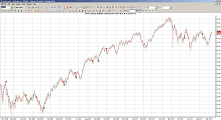
**FIGURE 12.**


```tradecision
ZERO_LAG indicator
ins
Length : "Enter Period",20;
GainLimit:"Enter Gain Limit",50;
end_ins
var
alpha:=0;
Gain:=0;
BestGain:=0;
EC:=0;
Error:=0;
LeastError:=0;
EMA:=0;
Value1:=0;
end_var

if HistorySize < 1 then return c;
alpha:=2 / (Length + 1);
EMA:=alpha * Close + (1 - alpha) * EMA\1\;
LeastError:=1000000;
for Value1:= -GainLimit to GainLimit do begin
	Gain:=Value1 / 10;
	EC:=alpha * (EMA + Gain * (Close - EC\1\)) + (1 - alpha) * EC\1\;
	Error:=Close - EC;
	if Abs(Error) < LeastError then
		begin
			LeastError:=Abs(Error);
			BestGain:=Gain;
		end;
end;
EC:=alpha * (EMA + BestGain * (Close - EC\1\)) + (1 - alpha) * EC\1\;

return EC;

```


```tradecision
ZERO_LAG strategy
Long Rule:
var
Length := 20;
GainLimit:=50;
alpha:=0;
Gain:=0;
BestGain:=0;
EC:=0;
Error:=0;
LeastError:=0;
EMA:=0;
Value1:=0;
Thresh:=1;
end_var

if HistorySize < 1 then return false;
alpha:=2 / (Length + 1);
EMA:=alpha * Close + (1 - alpha) * EMA\1\;
LeastError:=1000000;
for Value1:= -GainLimit to GainLimit do begin
	Gain:=Value1 / 10;
	EC:=alpha * (EMA + Gain * (Close - EC\1\)) + (1 - alpha) * EC\1\;
	Error:=Close - EC;
	if Abs(Error) < LeastError then
		begin
			LeastError:=Abs(Error);
			BestGain:=Gain;
		end;
end;
EC:=alpha * (EMA + BestGain * (Close - EC\1\)) + (1 - alpha) * EC\1\;

return CrossAbove(EC,EMA) and 100*LeastError / Close > Thresh;

Short Rule:
var
Length := 20;
GainLimit:=50;
alpha:=0;
Gain:=0;
BestGain:=0;
EC:=0;
Error:=0;
LeastError:=0;
EMA:=0;
Value1:=0;
Thresh:=1;
end_var

if HistorySize < 1 then return false;
alpha:=2 / (Length + 1);
EMA:=alpha * Close + (1 - alpha) * EMA\1\;
LeastError:=1000000;
for Value1:= -GainLimit to GainLimit do begin
	Gain:=Value1 / 10;
	EC:=alpha * (EMA + Gain * (Close - EC\1\)) + (1 - alpha) * EC\1\;
	Error:=Close - EC;
	if Abs(Error) < LeastError then
		begin
			LeastError:=Abs(Error);
			BestGain:=Gain;
		end;
end;
EC:=alpha * (EMA + BestGain * (Close - EC\1\)) + (1 - alpha) * EC\1\;

return CrossBelow(EC,EMA) and 100*LeastError / Close > Thresh;


```


## NINJATRADER: November 2010

NinjaTrader source files: [ninja-trader/](ninja-trader/) (ZLagEMA.cs, ZLagEMATS.cs)

NINJATRADER: ZERO-LAG STRATEGY

The ZLagEmais an indicator and automated strategy discussed by John Ehlers and Ric Way in their article in this issue, �Zero Lag (Well, Almost),� and has now been made available for download atwww.ninjatrader.com/SC/November2010SC.zip.

Once it�s downloaded, from within the NinjaTrader Control Center window, select the menu File → Utilities → Import NinjaScript and select the downloaded file. This indicator is for NinjaTrader version 6.5 or greater.

You can review the strategy source code by selecting the menu Tools → Edit NinjaScript → Strategy from within the NinjaTrader Control Center window and selecting �ZLagEMATS.� The source code for the indicator is available by clicking Tools → Edit NinjaScript → Indicator and selecting �ZLagEMA.�

NinjaScript indicators and strategies are compiledDlls that run native, not interpreted, which provides you with the highest performance possible.

A sample chart implementing the strategy is shown in Figure 13.

Figure 13: NINJATRADER, ZERO-LAG STRATEGY.This screenshot shows the ZLagEMATS strategy applied to a daily chart of Microsoft (MSFT).

�Raymond Deux & Ryan MillardNinjaTrader, LLCwww.ninjatrader.com

BACK TO LIST


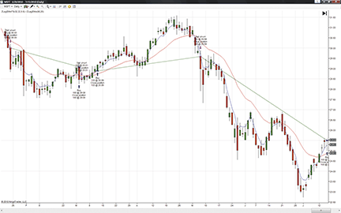
**FIGURE 13.**


## NEOTICKER: November 2010

NEOTICKER: ZERO-LAG STRATEGY

In �Zero Lag (Well, Almost)� in this issue, authors John Ehlers and Ric Way present a special version of the exponential moving average (Ema). ThisEmacan be implemented in NeoTicker using a Delphi script. It returns two plots and has two integer parameters.

The indicator is named �TascZero Lag� (Listing 1) with two integer parameters,lengthandgain limit, and it will plot both the regular exponential moving average and the error-correcting (EC) exponential moving average.

We can implement the moving average crossover system described in the article using NeoTicker�s power indicator, Backtest EZ. This indicator takes in crossover signals using formulas and allows users to customize the size and exit method.

For a downloadable version of the zero-lag indicator as well as the moving average crossover system, refer to the NeoTicker blog site (https://blog.neoticker.com).

A sample chart implementing the strategy is shown in Figure 14.

Figure 14: NEOTICKER, ZERO-LAG STRATEGY

�Kenneth YuenTickQuest, Inc.

BACK TO LIST


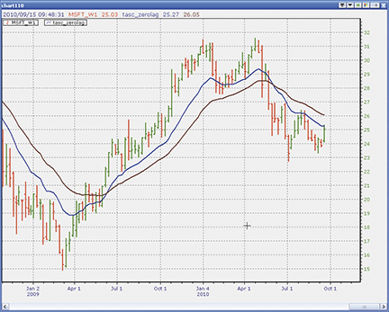
**FIGURE 14.**


```pascal
Listing 1

function tasc_zerolag : double;
Const TempVal = 10;
      PrevEMA = 0;
      PrevEC  = 1;
var alpha, Gain : double;
    BestGain, EC : double;
    LeastError, Error, EMA : double;
    Value1, NGainLimit, GainLimit : integer;
begin
  if itself.firstcall then
  begin
    heap.allocate(TempVal);
    heap.fill (0, TempVal-1, 0);
  end;
  alpha := 2/(param1.int+1);
  EMA := alpha*data1.close[0] + (1-alpha)*heap.value[PrevEMA];
  LeastError := 1000000;
  NGainLimit := -1*param2.int;
  GainLimit := param2.int;
  for Value1 := NGainLimit to GainLimit do
  begin
    Gain  := Value1/10;
    EC    := alpha*(EMA+Gain*(data1.close[0]-heap.value[PrevEC])) +
            (1-alpha)*heap.value[PrevEC];
    Error := data1.close[0]-EC;
    if NTLib.abs(Error) < LeastError then
    begin
      LeastError := ntlib.abs(Error);
      BestGain := Gain;
    end;
  end;

  itself.plot [1] := alpha*(EMA + BestGain*(data1.close[0]-heap.value[PrevEC])) +
                     (1-alpha)*heap.value[PrevEC];
  itself.plot [2] := EMA;
  heap.value [PrevEMA] := EMA;
  heap.value [PrevEC]  := EC;
end;


```


## WAVE59: November 2010

WAVE59: ZERO-LAG STRATEGY

In �Zero Lag (Well, Almost)� in this issue, authors John Ehlers and Ric Way describe their zero-lag exponential moving average system. Figure 15 shows the standalone indicator on the December S&P emini.

FIGURE 15: WAVE59, ZERO-LAG INDICATOR

The following script implements this indicator in Wave59. As always, users of Wave59 can download these scripts directly using the QScript Library found athttps://www.wave59.com/library.

�Patrick J. StilesWave59 Technologies Int�l, Inc.www.wave59.com

BACK TO LIST


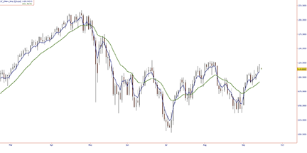
**FIGURE 15.**


```basic
Indicator:  SC_Ehlers_Way
input: length(20),gainlimit(50),EC_Color(Blue),EMA_Color(green),EC_thickness(2),EMA_Thickness(2);

#Initialize variables on first bar
if (barnumber==barsback)
{
   alpha=0;
   gain=0;
   bestgain=0;
   ec=0;
   error=0;
   leasterror=0;
   ema=0;
}

alpha = 2 /(length + 1);
ema = alpha*close +(1 - alpha)*ema[1];
leasterror = 1000000;
for (value1 = -gainlimit to gainlimit by 1) 
{
   gain = value1 / 10;
   ec = alpha*(ema + gain*(close - ec[1])) +(1 - alpha)*ec[1];
   error = close - ec;
   if (abs(error) < leasterror)  
   {
      leasterror = abs(error);
      bestgain = gain;
   }
}
ec = alpha*(ema + bestgain*(close - ec[1])) +(1 - alpha)*ec[1];

If (barnum > barsback+(length*1.5))
{
plot1=ec;
color1=ec_color;
thickness1=ec_thickness;   

plot2=ema;
color2=ema_color;
thickness2=ema_thickness;
}                        

System: SC_Ehlers_Way_System

input: length(20),gainlimit(50),thresh(1);

#Initialize variables on first bar
if (barnumber==barsback)
{
   alpha=0;
   gain=0;
   bestgain=0;
   ec=0;
   error=0;
   leasterror=0;
   ema=0;
}
alpha = 2 /(length + 1);
ema = alpha*close +(1 - alpha)*ema[1];
leasterror = 1000000;
for (value1 = -gainlimit to gainlimit by 1) 
{
   gain = value1 / 10;
   ec = alpha*(ema + gain*(close - ec[1])) +(1 - alpha)*ec[1];
   error = close - ec;
   if (abs(error) < leasterror) 
   {
      leasterror = abs(error);
      bestgain = gain;
   }
}
ec = alpha*(ema + bestgain*(close - ec[1])) +(1 - alpha)*ec[1];   
If (barnum > barsback+(length*1.5)) 
{
plot1=ec;
plot2=ema;
if ((ec crosses over ema) and (100*leasterror / close > thresh)) 
buy(1,open,"nettopen","gtc");
if ((ec crosses under ema) and (100*leasterror / close > thresh)) 
sell(1,open,"nettopen","gtc");
]


```


## UPDATA: November 2010

UPDATA: ZERO-LAG INDICATOR AND SYSTEM

This Traders� Tip is based on the article by John Ehlers and Ric Way in this issue, �Zero Lag (Well, Almost).�

The authors create an error-correcting filter for an exponential moving average (Ema) that seeks to minimize the lag effect of increasing periods. Increasing the gain parameter from zero changes the filter from anEmawith lag to effectively zero lag (albeit with zero smoothing also). The crossover of these lines can be used to form a trading strategy, with the addition of some threshold value for the difference between the close and error-correcting line.

The new Updata Professional Version 7 accepts code written in VB.Net and C# in addition to our user-friendly custom code. Versions of this indicator and system in all these languages may be downloaded by clicking the Custom menu and then System or Indicator Library. Those who cannot access the library due to firewall issues may paste the code here into the Updata Custom editor and save it.

A sample chart is shown in Figure 17.

FIGURE 17: UPDATA, ZERO-LAG INDICATOR.This chart shows the zero-lag indicator (yellow) and exponential moving average (red) on Microsoft (MSFT). When the zero-lag indicator is above the exponential moving average, it�s considered bullish.

�Updata Support teamsupport@updata.co.ukwww.updata.co.uk

BACK TO LIST


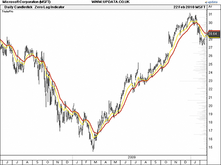
**FIGURE 16.**


```basic
' the queryForParameters function needs to fill up the arrays that are passed in, and return the
' number of parameters that the indicator refers to.
' iRets - returns types of the variables required - eg PRICEVARIABLE, INDICATORVARIABLE
' sNames - returns the short name for the parameter
' sDescrips - returns the long descriptive text for the variable shown on the prompt dialog
' defaults - returns the default value (must be of the correct type) for this parameter
  
public function queryForParameters(iRets() as Updata.VariableTypes, sNames() as String,sDescrips()
 as String,defaults as object()) as integer 
implements ICustomIndicator.queryForParameters
iRets(0)=VariableTypes.PriceVariable
sNames(0)="Average"
sDescrips(0)="Exp. Mov. Avg. Period"
defaults(0)=CType(32,Integer)
iRets(1)=VariableTypes.PriceVariable
sNames(1)="GainLimit"
sDescrips(1)="Gain Limit"
defaults(1)=CType(22,Integer)
queryForParameters=2
end function
  
' recalculateAll does the full recalculation of your indicator based on source data
' you need to fill up the dRet double array with return values.
' dSrc: the data of the main chart this is drawn on, first index=point, second=field, OHLCV
' note that study lines may only return one point per field
' oParams: returns the values of the parameters specified in queryForParameters, correctly formatted
'note that lines and lists will be returned as price arrays, again OHLCV or just C if a study
' dRet: The data to be returned, this has one Double()() for each line returned.
'each Double()() is the same length as the source data, and each index in
' the source data should match the same index in the dest data
' iTradeTypes: return values from the tradetypes above, or ignore if not a system
' dTradeOpenPrices: return price to open a new position at
' dTradeClosePrices: return price to close a position at
' iTradeAmount: return size of holding to place, leave blank to use defaults
  
public function recalculateAll(dSrc()() as Double,oParams() as object,dRet()()() as
 Double,iTradeTypes()() as Integer,dTradeOpenPrices()() as Double,dTradeClosePrices()()
  as Double,iTradeAmounr()() as Integer,dStopLevels()() as Double) as Boolean implements
   ICustomIndicator.recalculateAll
  
dim SeriesLength As Integer=dRet(0).Length 
dim Length As Integer=CType(oParams(0),Integer)
dim GainLimit as Integer=CType(oParams(1),Integer) 
dim alpha As Double
dim Gain As Double
dim BestGain As Double   
dim EC(SeriesLength) As Double 
dim ECTemp As Double
dim iError As Double
dim LeastError As Double
dim EMA(SeriesLength) As Double
dim Sum As Double 
dim Close(SeriesLength) As Double  
dim i As Integer
dim j As Integer 
 
FOR i=0 to SeriesLength-1
  
alpha=2/(Length+1)
Close(i)=dSrc(i)(3)
  
If i
```


## VT TRADER: November 2010

VT TRADER: ZERO-LAG INDICATOR

This Traders� Tip is based on �Zero Lag (Well, Almost)� by John Ehlers and Ric Way in this issue.

We�ll be offering the zero-lag indicator for download in our online forums. The VT Trader code and instructions for recreating this indicator are as follows:

To attach the indicator to a chart (Figure 18), click the right-mouse button within the chart window and select �Add Indicator� → �TASC - 11/2010 - Zero-Lag Indicator� from the indicator list.

Figure 18: VT TRADER, ZERO-LAG INDICATOR.Here is an example of the zero-lag indicator (green) and EMA (purple) attached to a EUR/USD 30-minute candlestick chart.

To learn more about VT Trader, visitwww.cmsfx.com.

Risk disclaimer: Forex trading involves a substantial risk of loss and may not be suitable for all investors.

�Chris SkidmoreCMS Forex(866) 51-CMSFX,trading@cmsfx.comwww.cmsfx.com

BACK TO LIST


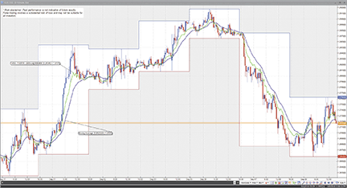
**FIGURE 17.**


## TRADESIGNAL: November 2010

TRADESIGNAL: ZERO-LAG INDICATOR

The zero-lag indicator presented by John Ehlers in his article in this issue can be easily implemented in TradeSignal's free interactive online charting tool found at www.TradesignalOnline.com (Figure 19). In the tool, select "New Strategy," enter the code in the online code editor, and save it. The strategy can now be added to any chart with a simple drag & drop. Both the indicator and strategy have been made available in the Lexicon section of the website at www.TradesignalOnline.com, where they can be imported with a single click.

Ehlers Zero Lag Indicator:

Ehlers Zero Lag Strategy:

Figure 19: TRADESIGNAL, ZERO-LAG INDICATOR Shown here is Tradesignal Online with John Ehlers' zero-lag strategy on MSFT.

�Sebastian Schenck, Tradesignal GmbHsupport@tradesignalonline.comwww.TradesignalOnline.com,www.Tradesignal.com

BACK TO LIST


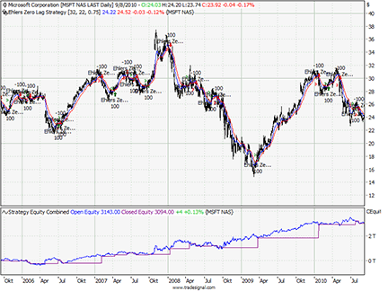
**FIGURE 18.**


```javascript

Meta:
	Subchart( False ),
	Weblink("https://www.tradesignalonline.com/lexicon/default.aspx?name=John+Ehlers+Zero+Lag"),
	Synopsis("Modified Exponential Moving Average. Developed by John Ehlers, published in Trades Tips 11/2010");
	
Inputs:
	Length( 20 , 1 ),
	GainLimit( 50 , 1 );
	
Vars:
	alpha(0), Gain(0), BestGain(0), EC(0), Error(0), LeastError(0), EMA(0);
	
alpha = 2 / (Length + 1);
EMA = alpha*Close + (1 - alpha)*EMA[1];
LeastError = 1000000;

For Value1 = -GainLimit to GainLimit 
	Begin
		Gain = Value1 / 10;
		EC = alpha*(EMA + Gain*(Close - EC[1])) + (1 -
		alpha)*EC[1];
		Error = Close - EC;
		
		If AbsValue( Error ) < LeastError Then 
			Begin
				LeastError = AbsValue(Error);
				BestGain = Gain;
			End;
	End;
	
EC = alpha*(EMA + BestGain*(Close - EC[1])) + (1 - alpha)*EC[1];

DrawLIne( EC, "Zero Lag", StyleSolid, 1, Blue );
DrawLine( EMA, "Ema", StyleSolid, 1, Red );


```


```javascript

Meta:
	Subchart( False ),
	Weblink("https://www.tradesignalonline.com/lexicon/default.aspx?name=John+Ehlers+Zero+Lag"),
	Synopsis("Zero Lag Indicator. Developed by John Ehlers, published in Stocks & Commodities 11/2010");
	
Inputs:
	Length( 20 , 1 ),
	GainLimit( 50 , 1 ),
	Thresh( 1.0 );
	
Vars:
	alpha(0), Gain(0), BestGain(0), EC(0), Error(0), LeastError(0), EMA(0);
	
alpha = 2 / (Length + 1);
EMA = alpha*Close + (1 - alpha)*EMA[1];
LeastError = 1000000;

For Value1 = -GainLimit to GainLimit 
	Begin
		Gain = Value1 / 10;
		EC = alpha*(EMA + Gain*(Close - EC[1])) + (1 -
		alpha)*EC[1];
		Error = Close - EC;
		
		If AbsValue( Error ) < LeastError Then 
			Begin
				LeastError = AbsValue(Error);
				BestGain = Gain;
			End;
	End;
	
EC = alpha*(EMA + BestGain*(Close - EC[1])) + (1 - alpha)*EC[1];

DrawLIne( EC, "Zero Lag", StyleSolid, 1, blue );
DrawLine( EMA, "Ema", StyleSolid, 1, Red );

If EC Crosses Over EMA and 100 * LeastError / Close > Thresh 
	Then Buy Next Bar at Market;
	
If EC Crosses Under EMA and 100 * LeastError / Close > Thresh Then 
	Short Next Bar at Market;


```


---

## BibTeX

```bibtex
@misc{traders_tips_2010_11,
  author       = {{Technical Analysis of STOCKS \& COMMODITIES}},
  title        = {Traders' Tips: Zero Lag (Well, Almost)},
  howpublished = {online},
  year         = {2010},
  month        = nov,
  url          = {https://www.traders.com/Documentation/FEEDbk_docs/2010/11/TradersTips.html}
}
```
