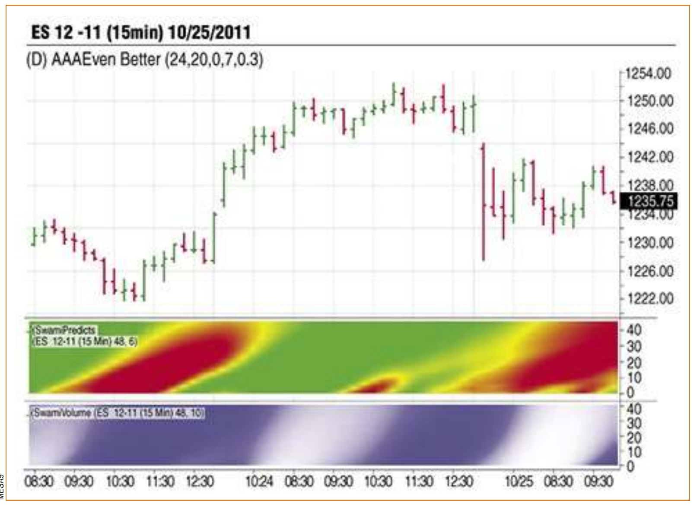
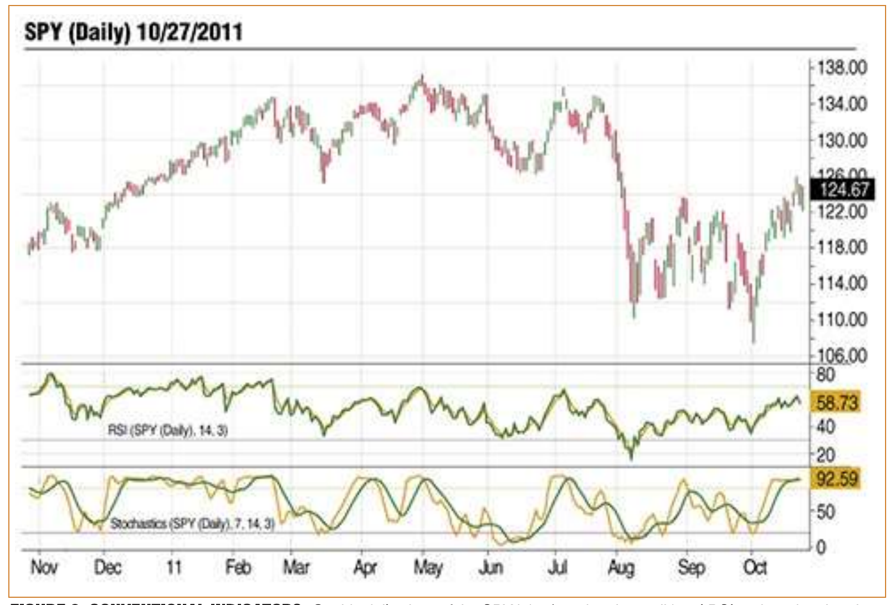
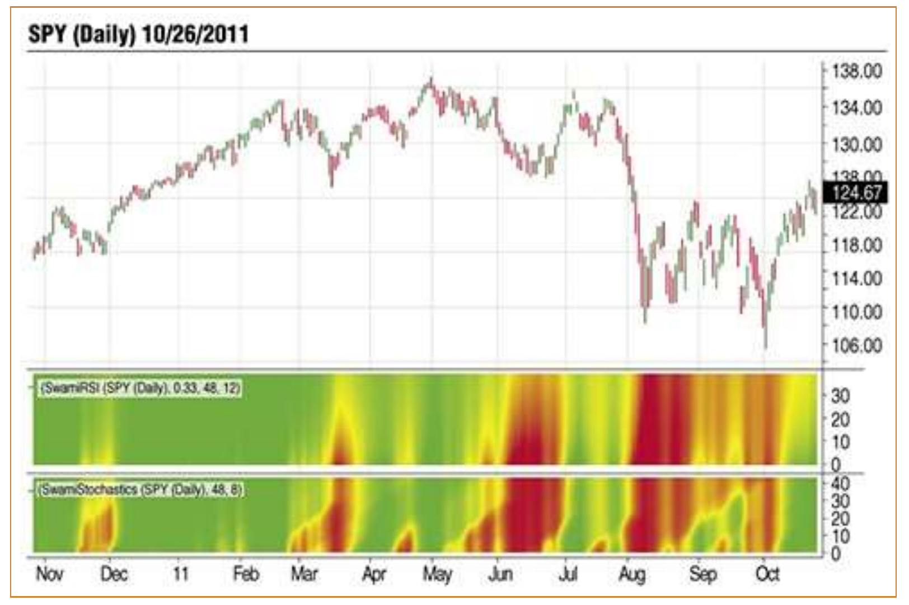

# Introducing SwamiCharts

- **Author:** John Ehlers and Ric Way
- **Publication:** Technical Analysis of STOCKS & COMMODITIES, Volume 30, March 2012, pp. 15--22
- **Article URL:** [Article PDF](https://technical.traders.com/archive/article.asp?file=\V30\C03\258EHLE.pdf)
- **Traders' Tips URL:** [Traders' Tips, March 2012](https://www.traders.com/Documentation/FEEDbk_docs/2012/03/TradersTips.html)

---

Traditional technical indicators tend to provide a narrow view of the market. This technique can give you a broader one and help you select an indicator lookback period.

---

Here's to technology in the 21st century! Computer hardware is fast and plentiful, with GPU graphics processors in our tablets and smartphones, and now, we can catch up with visualization improvements in our technical indicators. The SwamiCharts data visualization technique is a mosaic of technical indicator readings at multiple lookback periods, with each reading pieced together into a heatmap chart. This technique retains the core functionality of the technical indicators you are already familiar with while condensing more information into an easy-to-interpret heatmap.

In this, the first of several articles, we introduce SwamiCharts as a better way to visualize technical indicators in a big-picture context. We illustrate why the narrow scope offered by traditional indicators can result in a myopic view and how SwamiCharts solves this issue.

## What's A Good Lookback Period?

When J. Welles Wilder introduced the relative strength index (RSI) in the late 1970s, a number of early technicians questioned why he used a 14-day lookback period. This led one of these authors of this article, John Ehlers, to a decades-long quest for the "correct" lookback period and spawned the idea for his MESA cycles-measuring program.

MESA enables indicator lookback periods to be adaptive to measured market conditions. Alternative techniques have been suggested, but each has inherent limitations:

1. The visualization may be narrow in scope. You're not seeing the big-picture view of the indicator's response to a range of periods.
2. The process of dynamically adjusting the lookback period introduces noise.
3. Adaptive techniques introduce lag.

Traditional indicators give you details, but what does it mean? For example, a chart of the RSI shows you precisely when the indicator crosses over 80, but does this occurrence always indicate the same thing? SwamiCharts offer a tradeoff for a better visualization — a wider view of the indicator's true meaning. In addition, SwamiCharts provide a solution in the choice of lookback period. And of course, you can always continue to plot your old favorite classic indicator alongside a SwamiCharts version if you so choose.

In this article you will see several classic technical indicators rendered as SwamiCharts and be given tips on how to write your own indicators that way as well.

## SwamiCharts Basics

SwamiCharts are created as technical indicator readings at multiple lookback periods, with a resulting heatmap chart. Instead of showing numeric values, indicator readings are converted to colors where red indicates bearish and green indicates bullish, or blue indicates cold and white indicates hot, and so forth. The vertical y-axis represents the lookback period from lowest to highest. At each lookback, the indicator is plotted as a horizontal slice. As you move up the y-axis, each subsequent y-axis position shows the indicator reading at the next longer lookback period.

At any given time or time range, scanning the bottom portion of a SwamiChart shows the indicator readings at shorter lookback periods and the top portion shows the longer readings. With traditional technical indicators you have to set the lookback period at a middle-ground level to avoid whipsaws. With SwamiCharts, the shorter readings give you an earlier indication of change, and at the same time, the longer readings provide confirmation and continuation. SwamiCharts provide a better big-picture view of the indicator's true meaning in context.

Let's begin with an example. Figure 1 shows the emini Standard & Poor's 500 contract using 15-minute bars with the Swami Predict and Swami Volume indicators. At 11:30 am on October 23, 2011, prices began to move up on low (deep blue) volume.


**FIGURE 1: VOLUME LEADING PRICE.** Here you see the 15-minute chart of the emini S&P 500 contract with the Swami Predict and Swami Volume indicators. The changes in color make it easy to understand the price/volume relationship.

At noon, Swami Predict turned bullish at the shorter lookback periods. Prices gapped up slightly at the open on October 24 as volume remained relatively low. At 8:30 on October 24, prices were continuing to rise on increasing volume (blue becoming white) as more and more traders took note and began to accumulate. Then at 10:00, Swami Predict gave early warning that the uptrend could fade as the indicator turned bearish, again at shorter lookback periods.

Volume was heavy but did not reach the white-hot stage. By 11:30 the volume dried up and prices peaked, an indication of an impending reversal. The reversal occurred on a volatile gapdown and volume picked up as the selling intensified. Selling reached a white-hot peak at 8:30 on October 25.

By 9:30 the volume began to taper off, a possible indication that most sellers who wanted to get out had done so. Swami Predict then began to show a possible new early bullish indication, a green patch at the far bottom right of the chart. However, at that point we had to wait for prices to begin to rise before initiating a long position. This was necessary in case the previous selloff had merely paused.

In conclusion, volume leads price but the relationship is complex, depending on whether price moves are in an early or late stage, whether they occur at peaks or valleys, and whether they occur after a significant runup or selloff. SwamiCharts show the complex price/volume relationship more clearly than a traditional volume bar chart.

## Expanding Visibility

Next, we show how certain classic technical indicators appear almost the same when seen as SwamiChart renderings, even though they may look very different in their traditional technical indicator views. Figure 2 is a daily chart of SPY for about one year from the time this article was written. The traditional RSI is in the first subgraph and the traditional stochastics indicator is in the second subgraph. These indicators seem to be telling you different things about the price movement. We won't go into details but suffice it to say that they are clearly providing different information regarding when to buy and when to sell.


**FIGURE 2: CONVENTIONAL INDICATORS.** On this daily chart of the SPY it is clear that the traditional RSI and stochastics show different information.

Let's see how the RSI and stochastics indicators look in SwamiCharts format in Figure 3. At a glance you can see they are telling you pretty much the same information about the market activity. The green areas show when the market is moving up, the red areas show when the market is moving down, and yellow denotes the transition region between the two. In other words, yellow is a warning that price reversals may be imminent. As you would expect, the signals at the bottom of the charts occur before those same signals appear at the elevation midpoint and the top of the chart. Since shorter lookback periods use less data in the computation of the indicator than longer lookback periods, the resultant indicator lag is less at shorter periods.

Therefore, the proper use of SwamiCharts indicators is to first scan the bottom of the chart for the first flash that there is a change of indicator status. Then, viewing the chart as a whole, you should put that flash in context of all lookback periods to establish your trading position.


**FIGURE 3: SWAMICHARTS RSI AND SWAMI STOCHASTIC.** From these charts you can see that they show similar information. The green areas show when the market is moving up, the red areas show when the market is moving down, and yellow denotes the transition region between the two.

## Roll Your Own SwamiCharts

The code for the SwamiCharts stochastics can be seen in the sidebar, "SwamiCharts Stochastics EasyLanguage Code." The computation is fundamentally identical to the computation of the traditional indicator. The biggest difference is that instead of variables, the stochastic (Stoc), numerator (Num), and denominator (Denom) must be arrays. These arrays are in the loop for the lookback period (N) so the indicator is computed across time for each lookback period. Instead of being scaled from zero to 100, the indicators are scaled from zero to 1. If the indicator value is much below 0.5, the resultant display will be red. If the indicator value is much above 0.5, the display will be green. The indicator display will be yellow if its value is in the vicinity of 0.5.

You can write your own SwamiCharts custom indicator if you create the arrays for all lookback periods, scale the indicator values to fall between zero and 1, and use the heatmap display code without any additional changes.

## Swami Classic Indicators

The Aroon indicator was introduced by Tushar Chande. Chande designed the Aroon to distinguish between periods of trending versus trading ranges. Green indicates uptrends, while red indicates downtrends. As with SwamiCharts stochastics, the lower portion of the chart shows shorter lookback periods and gives you an early view, while the middle portion provides confirmation and the upper portion (longest lookback periods) provides continuation.

SwamiCharts Aroon gives you additional insight into the confirmation and continuation of the trend because you are visualizing a composite of lookback range from 12 to 48 bars. An early emergence of an uptrend (downtrend) is identified by a transition from red to green (green to red) at the lower lookback periods (bottom of the chart). If the trend is confirmed and continues, the indicator will stairstep to longer lookback periods. An abrupt color change at multiple lookback periods often signals a significant change.

The SwamiCharts CCI is an indicator based on the classic commodity channel index (CCI) oscillator. An overbought (bearish) condition is shown in red and an oversold (bullish) condition is shown in green. A yellow color indicates an intermediate condition. SwamiCharts CCI gives a larger overview by using channel lengths that vary from 12 to 48 bars in the vertical scale and by displaying the position relative to the channel using colors.

The RSI is a well-known momentum oscillator that measures the speed and change of price movements. SwamiCharts RSI gives you an early view of the change of price movements by varying the calculation period over a range of lookback periods.

Stochastics is another popular price oscillator that has withstood the test of time. The Swami stochastics indicator becomes green when entering an expected bullish period and red when entering an expected bearish period. SwamiCharts stochastics gives you an early view of the change of price movements by varying the calculation period over a range from 12 to 48 bars.

## Advanced SwamiCharts Indicators

For those interested in programming, we encourage you to create SwamiCharts versions of your favorites. In the course of developing SwamiCharts, we feel we have developed a deeper understanding of complete market activity, and you may feel the same when you see your own results. If you attempt to program your own traditional indicators as SwamiCharts, you will find some real dogs — indicators that don't indicate anything, or worse yet, the wrong thing.

We have created some advanced SwamiCharts indicators and will be describing their use in the next article of this series.

## SwamiCharts Stochastics EasyLanguage Code

```easylanguage
Vars:
  N(0),
  J(0),
  HH(0),
  LL(0),
  Color1(0),
  Color2(0),
  Color3(0);

Arrays:
  Stoc[48, 2](0),
  Num[48, 2](0),
  Denom[48, 2](0);

For N = 6 to 48 Begin
  Num[N, 2] = Num[N, 1];
  Denom[N, 2] = Denom[N, 1];
  Stoc[N, 2] = Stoc[N, 1];
  HH = 0;
  LL = 1000000;
  For J = 0 to N - 1 Begin
    If Close[J] > HH Then HH = Close[J];
    If Close[J] < LL Then LL = Close[J];
  End;
  Num[N, 1] = .5*(Close - LL) + .5*Num[N, 2];
  Denom[N, 1] = .5*(HH - LL) + .5*Denom[N, 2];
  If Denom[N, 1] <> 0 Then Stoc[N, 1] = .2*(Num[N, 1] /
    Denom[N, 1]) + .8*Stoc[N, 2];
End;

//Plot as a Heatmap
For N = 6 to 48 Begin
  // StopLight Colors
  If Stoc[N, 1] >= .5 Then Begin
    Color1 = 255*(2 - 2*Stoc[N, 1]);
    Color2 = 255;
    Color3 = 0;
  End
  Else If Stoc[N, 1] < .5 Then Begin
    Color1 = 255;
    Color2 = 255*2*Stoc[N, 1];
    Color3 = 0;
  End;
  If N = 4 Then Plot4(4, "S4", RGB(Color1, Color2, Color3),0,4);
  If N = 5 Then Plot5(5, "S5", RGB(Color1, Color2, Color3),0,4);
  If N = 6 Then Plot6(6, "S6", RGB(Color1, Color2, Color3),0,4);
  If N = 7 Then Plot7(7, "S7", RGB(Color1, Color2, Color3),0,4);
  If N = 8 Then Plot8(8, "S8", RGB(Color1, Color2, Color3),0,4);
  { ... Plot9 through Plot48 follow the same pattern ... }
  If N = 48 Then Plot48(48, "S48", RGB(Color1, Color2, Color3),0,4);
End;
```

## About The Authors

S&C Contributing Editor John Ehlers is a pioneer in the use of cycles and DSP techniques in technical analysis. He is the author of the MESA9 program, is the chief scientist for stockspotter.com, and is the inventor of SwamiCharts. Ric Way is an independent software developer specializing in programming algorithmic trading systems in C#. He may be reached at ricway@taosgroup.org.

TradeStation and NinjaTrader source code for SwamiCharts renditions of several classic technical indicators (Aroon, commodity channel index [CCI], RSI, and stochastics) may be downloaded for free at SwamiCharts.com. In addition, SwamiCharts indicators will be available on the ThinkOrSwim platform.

## Suggested Reading

- Chande, Tushar [2001]. *Beyond Technical Analysis: How To Develop And Implement A Winning Trading System*, 2d ed., John Wiley & Sons.
- Chande, Tushar, and Stanley Kroll [1994]. *The New Technical Trader*, John Wiley & Sons.
- Ehlers, John F. [2001]. *Rocket Science For Traders*, John Wiley & Sons.

---

See our Traders' Tips section beginning on page 62 for implementation and commentary of John Ehlers and Ric Way's technique in various technical analysis programs.

---

## BibTeX

```bibtex
@article{ehlers_way_2012_introducing_swamicharts,
  author    = {Ehlers, John F. and Way, Ric},
  title     = {Introducing SwamiCharts},
  journal   = {Technical Analysis of STOCKS \& COMMODITIES},
  volume    = {30},
  number    = {3},
  pages     = {15--22},
  year      = {2012},
  month     = mar,
  url       = {https://technical.traders.com/archive/article.asp?file=\V30\C03\258EHLE.pdf}
}

@misc{traders_tips_2012_03,
  author       = {{Technical Analysis of STOCKS \& COMMODITIES}},
  title        = {Traders' Tips: Introducing SwamiCharts},
  howpublished = {online},
  year         = {2012},
  month        = mar,
  url          = {https://www.traders.com/Documentation/FEEDbk_docs/2012/03/TradersTips.html}
}
```
