# Traders' Tips: March 2012

- **Article:** Introducing SwamiCharts by John Ehlers and Ric Way
- **Traders' Tips URL:** [Traders' Tips, March 2012](https://www.traders.com/Documentation/FEEDbk_docs/2012/03/TradersTips.html)

---


## TRADESTATION: March 2012

In �Introducing SwamiCharts� in this issue, authors John Ehlers & Ric
  Way present the use of SwamiCharts to better visualize market activity using
  an indicator that presents a heatmap visualization. The authors provide descriptions
  for the construction of SwamiCharts using Aroon, stochastics, CCI, and RSI.

We are providing the four indicators and a sample strategy using the _SwamiChart_RSI
  calculations. The strategy enters long when the RSI is oversold and the shorter
  time frame RSI values start increasing. Likewise, when the RSI is overbought
  and the short time frame RSIs start to decrease, the strategy enters short.
  This strategy is a reversing strategy that is always in the market.

To download the EasyLanguage code for the indicators and strategy, first navigate
  to the EasyLanguage FAQs and Reference Posts Topic in the EasyLanguage Support
  Forum (https://www.tradestation.com/Discussions/Topic.aspx?Topic_ID=47452),
  scroll down, and click on the link labeled �Traders� Tips, TASC.� Then select
the appropriate link for the month and year. The ELD filename is �_SwamiCharts.eld.�

The EasyLanguage code is also shown here.

A sample chart is shown in Figure 1.

FIGURE 1: TRADESTATION, SWAMICHARTS. Here is a sample
    five-minute chart of @ES along with the _SwamiChart_RSI indicator and _SwamiChart_RSIStrat.

This article is for informational purposes. No type of trading or investment
    recommendation, advice, or strategy is being made, given, or in any manner
    provided by TradeStation Securities or its affiliates.

�Chris ImhofTradeStation Securities, Inc.A subsidiary of TradeStation Group, Inc.www.TradeStation.com

BACK TO LIST


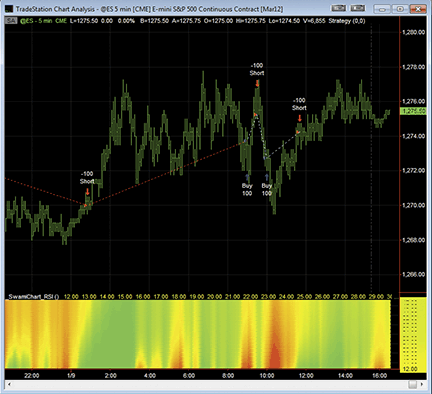
**FIGURE 1.**


```easylanguage
_SwamiChart_Aroon (Indicator)

{ TASC March 2012 }
{ Introducing Swami Charts }

variables:
	N( 0 ),
	J( 0 ),
	HH( 0 ),
	LL( 0 ),
	HighBarsBack( 0 ),
	LowBarsBack( 0 ),
	Color1( 0 ),
	Color2( 0 ),
	Color3( 0 ) ;

arrays:
	Aroon[60]( 0 ) ;
	
for N = 4 to 60 
	begin
	HH = Close ;
	LL = Close ;
	for J = 0 to N begin
		if High[J] > HH then 
			begin
			HH = High[J] ;
			HighBarsBack = J ;
			end ;
		if Low[J] < LL then 
			begin
			LL = Low[J] ;
			LowBarsBack = J ;
			end ;
	end ;

	Aroon[N] = 0 ;
	if HighBarsBack > LowBarsBack then 
		Aroon[N] = 1 ;
	end ;

for N = 8 to 48 
	begin
	Color3 = 0 ;
	if Aroon[N] = 0 then 
		begin
		Color1 = 0 ;
		Color2 = 255 ;
		end ;
	if Aroon[N] = 1 then 
		begin
		Color1 = 255 ;
		Color2 = 0 ;
		end ;

	if N = 4 then 
		Plot4( 4, "S4", 
		 RGB( Color1, Color2, Color3 ), 0, 4 ) ;
	if N = 5 then 
		Plot5( 5, "S5", 
		 RGB( Color1, Color2, Color3 ), 0, 4 ) ;
	if N = 6 then 
		Plot6( 6, "S6", 
		 RGB( Color1, Color2, Color3 ), 0, 4 ) ;
	if N = 7 then 
		Plot7( 7, "S7", 
		 RGB( Color1, Color2, Color3 ), 0, 4 ) ;
	if N = 8 then 
		Plot8( 8, "S8", 
		 RGB( Color1, Color2, Color3 ), 0, 4 ) ;
	if N = 9 then 
		Plot9( 9, "S9", 
		 RGB( Color1, Color2, Color3 ), 0, 4 ) ;
	if N = 10 then 
		Plot10( 10, "S10", 
		 RGB( Color1, Color2, Color3 ), 0, 4 ) ;
	if N = 11 then 
		Plot11( 11, "S11", 
		 RGB( Color1, Color2, Color3 ), 0, 4 ) ;
	if N = 12 then 
		Plot12( 12, "S12", 
		 RGB( Color1, Color2, Color3 ), 0, 4 ) ;
	if N = 13 then 
		Plot13( 13, "S13", 
		 RGB( Color1, Color2, Color3 ), 0, 4 ) ;
	if N = 14 then 
		Plot14( 14, "S14", 
		 RGB( Color1, Color2, Color3 ), 0, 4 ) ;
	if N = 15 then 
		Plot15( 15, "S15", 
		 RGB( Color1, Color2, Color3 ), 0, 4 ) ;
	if N = 16 then 
		Plot16( 16, "S16", 
		 RGB( Color1, Color2, Color3 ), 0, 4 ) ;
	if N = 17 then 
		Plot17( 17, "S17", 
		 RGB( Color1, Color2, Color3 ), 0, 4 ) ;
	if N = 18 then 
		Plot18( 18, "S18", 
		 RGB( Color1, Color2, Color3 ), 0, 4 ) ;
	if N = 19 then 
		Plot19( 19, "S19", 
		 RGB( Color1, Color2, Color3 ), 0, 4 ) ;
	if N = 20 then 
		Plot20( 20, "S20", 
		 RGB( Color1, Color2, Color3 ), 0, 4 ) ;
	if N = 21 then 
		Plot21( 21, "S21", 
		 RGB( Color1, Color2, Color3 ), 0, 4 ) ;
	if N = 22 then 
		Plot22( 22, "S22", 
		 RGB( Color1, Color2, Color3 ), 0, 4 ) ;
	if N = 23 then 
		Plot23( 23, "S23", 
		 RGB( Color1, Color2, Color3 ), 0, 4 ) ;
	if N = 24 then 
		Plot24( 24, "S24", 
		 RGB( Color1, Color2, Color3 ), 0, 4 ) ;
	if N = 25 then 
		Plot25( 25, "S25", 
		 RGB( Color1, Color2, Color3 ), 0, 4 ) ;
	if N = 26 then 
		Plot26( 26, "S26", 
		 RGB( Color1, Color2, Color3 ), 0, 4 ) ;
	if N = 27 then 
		Plot27( 27, "S27", 
		 RGB( Color1, Color2, Color3 ), 0, 4 ) ;
	if N = 28 then 
		Plot28( 28, "S28", 
		 RGB( Color1, Color2, Color3 ), 0, 4 ) ;
	if N = 29 then 
		Plot29( 29, "S29", 
		 RGB( Color1, Color2, Color3 ), 0, 4 ) ;
	if N = 30 then 
		Plot30( 30, "S30", 
		 RGB( Color1, Color2, Color3 ), 0, 4 ) ;
	if N = 31 then 
		Plot31( 31, "S31", 
		 RGB( Color1, Color2, Color3 ), 0, 4 ) ;
	if N = 32 then 
		Plot32( 32, "S32", 
		 RGB( Color1, Color2, Color3 ), 0, 4 ) ;
	if N = 33 then 
		Plot33( 33, "S33", 
		 RGB( Color1, Color2, Color3 ), 0, 4 ) ;
	if N = 34 then 
		Plot34( 34, "S34", 
		 RGB( Color1, Color2, Color3 ), 0, 4 ) ;
	if N = 35 then 
		Plot35( 35, "S35", 
		 RGB( Color1, Color2, Color3 ), 0, 4 ) ;
	if N = 36 then 
		Plot36( 36, "S36", 
		 RGB( Color1, Color2, Color3 ), 0, 4 ) ;
	if N = 37 then 
		Plot37( 37, "S37", 
		 RGB( Color1, Color2, Color3 ), 0, 4 ) ;
	if N = 38 then 
		Plot38( 38, "S38", 
		 RGB( Color1, Color2, Color3 ), 0, 4 ) ;
	if N = 39 then 
		Plot39( 39, "S39", 
		 RGB( Color1, Color2, Color3 ), 0, 4 ) ;
	if N = 40 then 
		Plot40( 40, "S40", 
		 RGB( Color1, Color2, Color3 ), 0, 4 ) ;
	if N = 41 then 
		Plot41( 41, "S41", 
		 RGB( Color1, Color2, Color3 ), 0, 4 ) ;
	if N = 42 then 
		Plot42( 42, "S42", 
		 RGB( Color1, Color2, Color3 ), 0, 4 ) ;
	if N = 43 then 
		Plot43( 43, "S43", 
		 RGB( Color1, Color2, Color3 ), 0, 4 ) ;
	if N = 44 then 
		Plot44( 44, "S44", 
		 RGB( Color1, Color2, Color3 ), 0, 4 ) ;
	if N = 45 then 
		Plot45( 45, "S45", 
		 RGB( Color1, Color2, Color3 ), 0, 4 ) ;
	if N = 46 then 
		Plot46( 46, "S46", 
		 RGB( Color1, Color2, Color3 ), 0, 4 ) ;
	if N = 47 then 
		Plot47( 47, "S47", 
		 RGB( Color1, Color2, Color3 ), 0, 4 ) ;
	if N = 48 then 
		Plot48( 48, "S48", 
		 RGB( Color1, Color2, Color3 ), 0, 4 ) ;
	if N = 49 then 
		Plot49( 49, "S49", 
		 RGB( Color1, Color2, Color3 ), 0, 4 ) ;
	if N = 50 then 
		Plot50( 50, "S50", 
		 RGB( Color1, Color2, Color3 ), 0, 4 ) ;
	if N = 51 then 
		Plot51( 51, "S41", 
		 RGB( Color1, Color2, Color3 ), 0, 4 ) ;
	if N = 52 then 
		Plot52( 52, "S42", 
		 RGB( Color1, Color2, Color3 ), 0, 4 ) ;
	if N = 53 then 
		Plot53( 53, "S43", 
		 RGB( Color1, Color2, Color3 ), 0, 4 ) ;
	if N = 54 then 
		Plot54( 54, "S44", 
		 RGB( Color1, Color2, Color3 ), 0, 4 ) ;
	if N = 55 then 
		Plot55( 55, "S45", 
		 RGB( Color1, Color2, Color3 ), 0, 4 ) ;
	if N = 56 then 
		Plot56( 56, "S46", 
		 RGB( Color1, Color2, Color3 ), 0, 4 ) ;
	if N = 57 then 
		Plot57( 57, "S47", 
		 RGB( Color1, Color2, Color3 ), 0, 4 ) ;
	if N = 58 then 
		Plot58( 58, "S48", 
		 RGB( Color1, Color2, Color3 ), 0, 4 ) ;
	if N = 59 then 
		Plot59( 59, "S49", 
		 RGB( Color1, Color2, Color3 ), 0, 4 ) ;
	if N = 60 then 
		Plot60( 60, "S50", 
		 RGB( Color1, Color2, Color3 ), 0, 4 ) ;

	end ;


_SwamiChart_CCI (Indicator)

{ TASC March 2012 }
{ Introducing Swami Charts }

variables:
	N( 0 ),
	Color1( 0 ),
	Color2( 0 ),
	Color3( 0 ) ;

arrays:
	CCIAvg[48, 2]( 0 ) ;

for N = 12 to 48 
	begin
	CCIAvg[N, 2] = CCIAvg[N, 1] ;
	CCIAvg[N, 1] = 0.33 * ( ( CCI( N ) / 100 + 1 ) 
	 / 2 ) + 0.67 * CCIAvg[N, 2] ;
	if CCIAvg[N, 1] > 1 then 
		CCIAvg[N, 1] = 1 ;
	if CCIAvg[N, 1] < 0 then 
		CCIAvg[N, 1] = 0 ;
	end ;

for N = 12 to 48 
	begin
	if CCIAvg[N, 1] >= 0.5 then 
		begin
		Color1 = 255 * ( 2 - 2 * CCIAvg[N, 1] ) ;
		Color2 = 255 ;
		Color3 = 0 ;
		end
	else if CCIAvg[N, 1] < 0.5 then
		begin
		Color1 = 255 ;
		Color2 = 255 * 2 * CCIAvg[N, 1] ;
		Color3 = 0 ;
		end ;

	if N = 12 then 
		Plot12( 12, "S12", 
		 RGB( Color1, Color2, Color3 ), 0, 4 ) ;
	if N = 13 then 
		Plot13( 13, "S13", 
		 RGB( Color1, Color2, Color3 ), 0, 4 ) ;
	if N = 14 then 
		Plot14( 14, "S14", 
		 RGB( Color1, Color2, Color3 ), 0, 4 ) ;
	if N = 15 then 
		Plot15( 15, "S15", 
		 RGB( Color1, Color2, Color3 ), 0, 4 ) ;
	if N = 16 then 
		Plot16( 16, "S16", 
		 RGB( Color1, Color2, Color3 ), 0, 4 ) ;
	if N = 17 then 
		Plot17( 17, "S17", 
		 RGB( Color1, Color2, Color3 ), 0, 4 ) ;
	if N = 18 then 
		Plot18( 18, "S18", 
		 RGB( Color1, Color2, Color3 ), 0, 4 ) ;
	if N = 19 then 
		Plot19( 19, "S19", 
		 RGB( Color1, Color2, Color3 ), 0, 4 ) ;
	if N = 20 then 
		Plot20( 20, "S20", 
		 RGB( Color1, Color2, Color3 ), 0, 4 ) ;
	if N = 21 then 
		Plot21( 21, "S21", 
		 RGB( Color1, Color2, Color3 ), 0, 4 ) ;
	if N = 22 then 
		Plot22( 22, "S22", 
		 RGB( Color1, Color2, Color3 ), 0, 4 ) ;
	if N = 23 then 
		Plot23( 23, "S23", 
		 RGB( Color1, Color2, Color3 ), 0, 4 ) ;
	if N = 24 then 
		Plot24( 24, "S24", 
		 RGB( Color1, Color2, Color3 ), 0, 4 ) ;
	if N = 25 then 
		Plot25( 25, "S25", 
		 RGB( Color1, Color2, Color3 ), 0, 4 ) ;
	if N = 26 then 
		Plot26( 26, "S26", 
		 RGB( Color1, Color2, Color3 ), 0, 4 ) ;
	if N = 27 then 
		Plot27( 27, "S27", 
		 RGB( Color1, Color2, Color3 ), 0, 4 ) ;
	if N = 28 then 
		Plot28( 28, "S28", 
		 RGB( Color1, Color2, Color3 ), 0, 4 ) ;
	if N = 29 then 
		Plot29( 29, "S29", 
		 RGB( Color1, Color2, Color3 ), 0, 4 ) ;
	if N = 30 then 
		Plot30( 30, "S30", 
		 RGB( Color1, Color2, Color3 ), 0, 4 ) ;
	if N = 31 then 
		Plot31( 31, "S31", 
		 RGB( Color1, Color2, Color3 ), 0, 4 ) ;
	if N = 32 then 
		Plot32( 32, "S32", 
		 RGB( Color1, Color2, Color3 ), 0, 4 ) ;
	if N = 33 then 
		Plot33( 33, "S33", 
		 RGB( Color1, Color2, Color3 ), 0, 4 ) ;
	if N = 34 then 
		Plot34( 34, "S34", 
		 RGB( Color1, Color2, Color3 ), 0, 4 ) ;
	if N = 35 then 
		Plot35( 35, "S35", 
		 RGB( Color1, Color2, Color3 ), 0, 4 ) ;
	if N = 36 then 
		Plot36( 36, "S36", 
		 RGB( Color1, Color2, Color3 ), 0, 4 ) ;
	if N = 37 then 
		Plot37( 37, "S37", 
		 RGB( Color1, Color2, Color3 ), 0, 4 ) ;
	if N = 38 then 
		Plot38( 38, "S38", 
		 RGB( Color1, Color2, Color3 ), 0, 4 ) ;
	if N = 39 then 
		Plot39( 39, "S39", 
		 RGB( Color1, Color2, Color3 ), 0, 4 ) ; 
	if N = 40 then 
		Plot40( 40, "S40", 
		 RGB( Color1, Color2, Color3 ), 0, 4 ) ;
	if N = 41 then 
		Plot41( 41, "S41", 
		 RGB( Color1, Color2, Color3 ), 0, 4 ) ;
	if N = 42 then 
		Plot42( 42, "S42", 
		 RGB( Color1, Color2, Color3 ), 0, 4 ) ;
	if N = 43 then 
		Plot43( 43, "S43", 
		 RGB( Color1, Color2, Color3 ), 0, 4 ) ;
	if N = 44 then 
		Plot44( 44, "S44", 
		 RGB( Color1, Color2, Color3 ), 0, 4 ) ;
	if N = 45 then 
		Plot45( 45, "S45", 
		 RGB( Color1, Color2, Color3 ), 0, 4 ) ;
	if N = 46 then 
		Plot46( 46, "S46", 
		 RGB( Color1, Color2, Color3 ), 0, 4 ) ;
	if N = 47 then 
		Plot47( 47, "S47", 
		 RGB( Color1, Color2, Color3 ), 0, 4 ) ;
	if N = 48 then 
		Plot48( 48, "S48", 
		 RGB( Color1, Color2, Color3 ), 0, 4 ) ;

	end ;


_SwamiChart_RSI (Indicator)

{ TASC March 2012 }
{ Introducing Swami Charts }

variables:
	N( 0 ),
	Change( 0 ),
	ChgRatio( 0 ),
	Color1( 0 ),
	Color2( 0 ),
	Color3( 0 ) ;

arrays:
	NetChgAvg[48, 2]( 0 ),
	TotChgAvg[48, 2]( 0 ),
	MyRSI[48, 2]( 0 ) ;

for N = 12 to 48 
	begin
		
	NetChgAvg[N, 2] = NetChgAvg[N, 1] ;
	TotChgAvg[N, 2] = TotChgAvg[N, 1] ;
	MyRSI[N, 2] = MyRSI[N, 1] ;
	Change = Close - Close[1] ;
	NetChgAvg[N, 1] = NetChgAvg[N, 2] + ( 1 / N ) 
	 * ( Change - NetChgAvg[N, 2] ) ;
	TotChgAvg[N, 1] = TotChgAvg[N, 2] + ( 1 / N ) * 
	 ( AbsValue( Change ) - TotChgAvg[N, 2] ) ;

	if TotChgAvg[N, 1] <> 0 then 
		ChgRatio = NetChgAvg[N, 1] / TotChgAvg[N, 1] 
	else 
		ChgRatio = 0 ;

	MyRSI[N, 1] = 0.33 * ( 4 * ChgRatio + 1 ) / 
	 2 + 0.67 * MyRSI[N, 2] ;

	if MyRSI[N, 1] > 1 then 
		MyRSI[N, 1] = 1 ;

	if MyRSI[N, 1] < 0 then 
		MyRSI[N, 1] = 0 ;

	end ;

for N = 12 to 48 
	begin
	
	if MyRSI[N, 1] >= 0.5 then 
		begin
		Color1 = 255 *( 2 - 2 * MyRSI[N, 1] ) ;
		Color2 = 255 ;
		Color3 = 0 ;
		end
	else if MyRSI[N, 1] < 0.5 then 
		begin
		Color1 = 255 ;
		Color2 = 255 * 2 * MyRSI[N, 1] ;
		Color3 = 0 ;
		end ;

	if N = 12 then 
		Plot12( 12, "S12", 
		 RGB( Color1, Color2, Color3 ), 0, 4 ) ;
	if N = 13 then 
		Plot13( 13, "S13", 
		 RGB( Color1, Color2, Color3 ), 0, 4 ) ;
	if N = 14 then 
		Plot14( 14, "S14", 
		 RGB( Color1, Color2, Color3 ), 0, 4 ) ;
	if N = 15 then 
		Plot15( 15, "S15", 
		 RGB( Color1, Color2, Color3 ), 0, 4 ) ;
	if N = 16 then 
		Plot16( 16, "S16", 
		 RGB( Color1, Color2, Color3 ), 0, 4 ) ;
	if N = 17 then 
		Plot17( 17, "S17", 
		 RGB( Color1, Color2, Color3 ), 0, 4 ) ;
	if N = 18 then 
		Plot18( 18, "S18", 
		 RGB( Color1, Color2, Color3 ), 0, 4 ) ;
	if N = 19 then 
		Plot19( 19, "S19", 
		 RGB( Color1, Color2, Color3 ), 0, 4 ) ;
	if N = 20 then 
		Plot20( 20, "S20", 
		 RGB( Color1, Color2, Color3 ), 0, 4 ) ;
	if N = 21 then 
		Plot21( 21, "S21", 
		 RGB( Color1, Color2, Color3 ), 0, 4 ) ;
	if N = 22 then 
		Plot22( 22, "S22",  
		 RGB( Color1, Color2, Color3 ), 0, 4 ) ;
	if N = 23 then 
		Plot23( 23, "S23", 
		 RGB( Color1, Color2, Color3 ), 0, 4 ) ;
	if N = 24 then 
		Plot24( 24, "S24", 
		 RGB( Color1, Color2, Color3 ), 0, 4 ) ;
	if N = 25 then 
		Plot25( 25, "S25", 
		 RGB( Color1, Color2, Color3 ), 0, 4 ) ;
	if N = 26 then 
		Plot26( 26, "S26", 
		 RGB( Color1, Color2, Color3 ), 0, 4 ) ;
	if N = 27 then 
		Plot27( 27, "S27", 
		 RGB( Color1, Color2, Color3 ), 0, 4 ) ;
	if N = 28 then 
		Plot28( 28, "S28", 
		 RGB( Color1, Color2, Color3 ), 0, 4 ) ;
	if N = 29 then 
		Plot29( 29, "S29", 
		 RGB( Color1, Color2, Color3 ), 0, 4 ) ;
	if N = 30 then 
		Plot30( 30, "S30", 
		 RGB( Color1, Color2, Color3 ), 0, 4 ) ;
	if N = 31 then 
		Plot31( 31, "S31", 
		 RGB( Color1, Color2, Color3 ), 0, 4 ) ;
	if N = 32 then 
		Plot32( 32, "S32", 
		 RGB( Color1, Color2, Color3 ), 0, 4 ) ;
	if N = 33 then 
		Plot33( 33, "S33", 
		 RGB( Color1, Color2, Color3 ), 0, 4 ) ;
	if N = 34 then 
		Plot34( 34, "S34", 
		 RGB( Color1, Color2, Color3 ), 0, 4 ) ;
	if N = 35 then 
		Plot35( 35, "S35", 
		 RGB( Color1, Color2, Color3 ), 0, 4 ) ;
	if N = 36 then 
		Plot36( 36, "S36", 
		 RGB( Color1, Color2, Color3 ), 0, 4 ) ;
	if N = 37 then 
		Plot37( 37, "S37", 
		 RGB( Color1, Color2, Color3 ), 0, 4 ) ;
	if N = 38 then 
		Plot38( 38, "S38", 
		 RGB( Color1, Color2, Color3 ), 0, 4 ) ;
	if N = 39 then 
		Plot39( 39, "S39", 
		 RGB( Color1, Color2, Color3 ), 0, 4 ) ;
	if N = 40 then 
		Plot40( 40, "S40", 
		 RGB( Color1, Color2, Color3 ), 0, 4 ) ;
	if N = 41 then 
		Plot41( 41, "S41", 
		 RGB( Color1, Color2, Color3 ), 0, 4 ) ;
	if N = 42 then 
		Plot42( 42, "S42", 
		 RGB( Color1, Color2, Color3 ), 0, 4 ) ;
	if N = 43 then 
		Plot43( 43, "S43", 
		 RGB( Color1, Color2, Color3 ), 0, 4 ) ;
	if N = 44 then 
		Plot44( 44, "S44", 
		 RGB( Color1, Color2, Color3 ), 0, 4 ) ;
	if N = 45 then 
		Plot45( 45, "S45", 
		 RGB( Color1, Color2, Color3 ), 0, 4 ) ;
	if N = 46 then 
		Plot46( 46, "S46", 
		 RGB( Color1, Color2, Color3 ), 0, 4 ) ;
	if N = 47 then 
		Plot47( 47, "S47", 
		 RGB( Color1, Color2, Color3 ), 0, 4 ) ;
	if N = 48 then 
		Plot48( 48, "S48", 
		 RGB( Color1, Color2, Color3 ), 0, 4 ) ;
	
	end ;


_SwamiChart_Stoch (Indicator)

{ TASC March 2012 }
{ Introducing Swami Charts }
			
variables:
	N( 0 ),
	J( 0 ),
	HH( 0 ),
	LL( 0 ),
	Color1( 0 ),
	Color2( 0 ),
	Color3( 0 ) ;

arrays:
	Stoc[48, 2]( 0 ),
	Num[48, 2]( 0 ),
	Denom[48, 2]( 0 ) ;

for N = 6 to 48 
	begin
	Num[N, 2] = Num[N, 1] ;
	Denom[N, 2] = Denom[N, 1] ;
	Stoc[N, 2] = Stoc[N, 1] ;
	HH = 0 ;
	LL = 1000000 ;
	for J = 0  to N - 1 
		begin
		if Close[J] > HH then 
			HH = Close[J] ;
 	    if Close[J] < LL then 
			LL = Close[J] ;
		end ; 
	Num[N, 1] = 0.5 * ( Close - LL ) + 
	 0.5 * Num[N, 2] ;
	Denom[N, 1] = 0.5 * ( HH - LL ) + 
	 0.5 * Denom[N, 2] ;
	if Denom[N, 1] <> 0 then 
		Stoc[N, 1] = 0.2 * ( Num[N, 1] / 
		 Denom[N, 1] ) + 0.8 * Stoc[N, 2] ;
	end ;

for N = 6 to 48 
	begin
		
	if Stoc[N, 1] >= 0.5 then 
		begin
		Color1 = 255 * ( 2 - 2 * Stoc[N, 1] ) ;
		Color2 = 255 ;
		Color3 = 0 ;
		end
	else if Stoc[N, 1] < 0.5 then 
		begin
		Color1 = 255 ;
		Color2 = 255 * 2 * Stoc[N, 1] ;
		Color3 = 0 ;
		end ;

	if N = 4 then 
		Plot4( 4, "S4", 
		 RGB( Color1, Color2, Color3 ), 0, 4 ) ;
	if N = 5 then 
		Plot5( 5, "S5", 
		 RGB( Color1, Color2, Color3 ), 0, 4 ) ;
	if N = 6 then 
		Plot6( 6, "S6", 
		 RGB( Color1, Color2, Color3 ), 0, 4 ) ;
	if N = 7 then 
		Plot7( 7, "S7", 
		 RGB( Color1, Color2, Color3 ), 0, 4 ) ;
	if N = 8 then 
		Plot8( 8, "S8", 
		 RGB( Color1, Color2, Color3 ), 0, 4 ) ;
	if N = 9 then 
		Plot9( 9, "S9", 
		 RGB( Color1, Color2, Color3 ), 0, 4 ) ;
	if N = 10 then 
		Plot10( 10, "S10", 
		 RGB( Color1, Color2, Color3 ), 0, 4 ) ;
	if N = 11 then 
		Plot11( 11, "S11", 
		 RGB( Color1, Color2, Color3 ), 0, 4 ) ;
	if N = 12 then 
		Plot12( 12, "S12", 
		 RGB( Color1, Color2, Color3 ), 0, 4 ) ;
	if N = 13 then 
		Plot13( 13, "S13", 
		 RGB( Color1, Color2, Color3 ), 0, 4 ) ;
	if N = 14 then 
		Plot14( 14, "S14", 
		 RGB( Color1, Color2, Color3 ), 0, 4 ) ;
	if N = 15 then 
		Plot15( 15, "S15", 
		 RGB( Color1, Color2, Color3 ), 0, 4 ) ;
	if N = 16 then 
		Plot16( 16, "S16", 
		 RGB( Color1, Color2, Color3 ), 0, 4 ) ;
	if N = 17 then 
		Plot17( 17, "S17", 
		 RGB( Color1, Color2, Color3 ), 0, 4 ) ;
	if N = 18 then 
		Plot18( 18, "S18", 
		 RGB( Color1, Color2, Color3 ), 0, 4 ) ;
	if N = 19 then 
		Plot19( 19, "S19", 
		 RGB( Color1, Color2, Color3 ), 0, 4 ) ;
	if N = 20 then 
		Plot20( 20, "S20", 
		 RGB( Color1, Color2, Color3 ), 0, 4 ) ;
	if N = 21 then 
		Plot21( 21, "S21", 
		 RGB( Color1, Color2, Color3 ), 0, 4 ) ;
	if N = 22 then 
		Plot22( 22, "S22", 
		 RGB( Color1, Color2, Color3 ), 0, 4 ) ;
	if N = 23 then 
		Plot23( 23, "S23", 
		 RGB( Color1, Color2, Color3 ), 0, 4 ) ;
	if N = 24 then 
		Plot24( 24, "S24", 
		 RGB( Color1, Color2, Color3 ), 0, 4 ) ;
	if N = 25 then 
		Plot25( 25, "S25", 
		 RGB( Color1, Color2, Color3 ), 0, 4 ) ;
	if N = 26 then 
		Plot26( 26, "S26", 
		 RGB( Color1, Color2, Color3 ), 0, 4 ) ;
	if N = 27 then 
		Plot27( 27, "S27", 
		 RGB( Color1, Color2, Color3 ), 0, 4 ) ;
	if N = 28 then 
		Plot28( 28, "S28", 
	 	RGB( Color1, Color2, Color3 ), 0, 4 ) ;
	if N = 29 then 
		Plot29( 29, "S29", 
		 RGB( Color1, Color2, Color3 ), 0, 4 ) ;
	if N = 30 then 
		Plot30( 30, "S30", 
		 RGB( Color1, Color2, Color3 ), 0, 4 ) ;
	if N = 31 then 
		Plot31( 31, "S31", 
		 RGB( Color1, Color2, Color3 ), 0, 4 ) ;
	if N = 32 then 
		Plot32( 32, "S32", 
		 RGB( Color1, Color2, Color3 ), 0, 4 ) ;
	if N = 33 then 
		Plot33( 33, "S33", 
		 RGB( Color1, Color2, Color3 ), 0, 4 ) ;
	if N = 34 then 
		Plot34( 34, "S34", 
		 RGB( Color1, Color2, Color3 ), 0, 4 ) ;
	if N = 35 then 
		Plot35( 35, "S35", 
		 RGB( Color1, Color2, Color3 ), 0, 4 ) ;
	if N = 36 then 
		Plot36( 36, "S36", 
		 RGB( Color1, Color2, Color3 ), 0, 4 ) ;
	if N = 37 then 
		Plot37( 37, "S37", 
		 RGB( Color1, Color2, Color3 ), 0, 4 ) ;
	if N = 38 then 
		Plot38( 38, "S38", 
		 RGB( Color1, Color2, Color3 ), 0, 4 ) ;
	if N = 39 then 
		Plot39( 39, "S39", 
		 RGB( Color1, Color2, Color3 ), 0, 4 ) ;
	if N = 40 then 
		Plot40( 40, "S40", 
		 RGB( Color1, Color2, Color3 ), 0, 4 ) ;
	if N = 41 then 
		Plot41( 41, "S41", 
		 RGB( Color1, Color2, Color3 ), 0, 4 ) ;
	if N = 42 then 
		Plot42( 42, "S42", 
		 RGB( Color1, Color2, Color3 ), 0, 4 ) ;
	if N = 43 then 
		Plot43( 43, "S43", 
		 RGB( Color1, Color2, Color3 ), 0, 4 ) ;
	if N = 44 then 
		Plot44( 44, "S44", 
		 RGB( Color1, Color2, Color3 ), 0, 4 ) ;
	if N = 45 then 
		Plot45( 45, "S45", 
	 	 RGB( Color1, Color2, Color3 ), 0, 4 ) ;
	if N = 46 then 
		Plot46( 46, "S46", 
		 RGB( Color1, Color2, Color3 ), 0, 4 ) ;
	if N = 47 then 
		Plot47( 47, "S47", 
		 RGB( Color1, Color2, Color3 ), 0, 4 ) ;
	if N = 48 then 
		Plot48( 48, "S48", 
		 RGB( Color1, Color2, Color3 ), 0, 4 ) ;

 	end ;

_SwamiChart_RSIStrat (Strategy)

{ TASC March 2012 }
{ Introducing Swami Charts }

inputs:
	LongColor( 50 ),
	ShortColor( 50 ) ;

variables:
	N( 0 ),
	Change( 0 ),
	ChgRatio( 0 ),
	Color1( 0 ),
	Color2( 0 ),
	Color3( 0 ),
	Color1Tot( 0 ),
	Color2Tot( 0 ),
	ColorCount( 0 ),
	Color1Avg( 0 ),
 	Color2Avg( 0 ) ;

arrays:
	NetChgAvg[48, 2]( 0 ),
	TotChgAvg[48, 2]( 0 ),
	MyRSI[48, 2]( 0 ) ;

for N = 12 to 48 
	begin
		
	NetChgAvg[N, 2] = NetChgAvg[N, 1] ;
	TotChgAvg[N, 2] = TotChgAvg[N, 1] ;
	MyRSI[N, 2] = MyRSI[N, 1] ;
	Change = Close - Close[1] ;
	NetChgAvg[N, 1] = NetChgAvg[N, 2] + ( 1 / N ) 
	 * ( Change - NetChgAvg[N, 2] ) ;
	TotChgAvg[N, 1] = TotChgAvg[N, 2] + ( 1 / N ) * 
	 ( AbsValue( Change ) - TotChgAvg[N, 2] ) ;

	if TotChgAvg[N, 1] <> 0 then 
		ChgRatio = NetChgAvg[N, 1] / TotChgAvg[N, 1] 
	else 
		ChgRatio = 0 ;

	MyRSI[N, 1] = 0.33 * ( 4 * ChgRatio + 1 ) / 
	 2 + 0.67 * MyRSI[N, 2] ;

	if MyRSI[N, 1] > 1 then 
		MyRSI[N, 1] = 1 ;

	if MyRSI[N, 1] < 0 then 
		MyRSI[N, 1] = 0 ;

	end ;

ColorCount = 0 ;
Color1Tot = 0 ;
Color2Tot = 0 ;

for N = 12 to 48 
	begin
	
	if MyRSI[N, 1] >= 0.5 then 
		begin
		Color1 = 255 *( 2 - 2 * MyRSI[N, 1] ) ;
		Color2 = 255 ;
		Color3 = 0 ;
		end
	else if MyRSI[N, 1] < 0.5 then 
		begin
		Color1 = 255 ;
		Color2 = 255 * 2 * MyRSI[N, 1] ;
		Color3 = 0 ;
		end ;
	
	Color1Tot = Color1Tot + Color1 ;
	Color2Tot = Color2Tot + Color2 ;
	ColorCount = ColorCount + 1 ;
	end ;

Color1Avg = Color1Tot / ColorCount ;
Color2Avg = Color2Tot / ColorCount ;

{ Long Entry }
if Color1Avg = 255 and Color2Avg > LongColor then
	buy next bar market ;

{ Short Entry }
if Color1Avg > ShortColor and Color2Avg = 255 then
	sellshort next bar market ;

```


## eSIGNAL: March 2012

For this month�s Traders� Tip, we�ve provided the formula SwamiCharts_Stochastic.efs
based on the code from John Ehlers & Ric Way�s article in this issue, �Introducing SwamiCharts.�

The study contains formula parameters to set the values for the fastest period,
  lowest period, and line thickness, which may be configured through the Edit
Chart window (right-click on the chart and select �edit chart�).

To discuss this study or download complete copies of the formula code, please
  visit the EFS Library Discussion Board forum under the forums link from the
  support menu at www.esignal.com or visit our EFS KnowledgeBase at https://www.esignal.com/support/kb/efs/.
  The eSignal formula script (EFS) is also available below fordownloador
  for copying and pasting.

A sample chart is shown in Figure 2.

FIGURE 2: ESIGNAL, SWAMICHARTS STOCHASTICS

�Jason KeckeSignal, an Interactive Data company800 779-6555,www.eSignal.com

BACK TO LIST


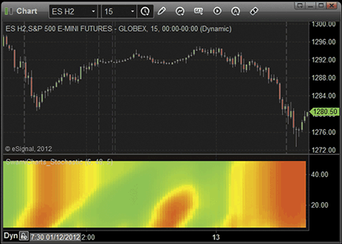
**FIGURE 2.**


```
/*********************************
Provided By:  
    Interactive Data Corporation (Copyright � 2012) 
    All rights reserved. This sample eSignal Formula Script (EFS)
    is for educational purposes only. Interactive Data Corporation
    reserves the right to modify and overwrite this EFS file with 
    each new release. 

Description:        
    Introducing SwamiCharts by John Ehlers
	
Version:            1.00  11/01/2012

Formula Parameters:                     Default:
Fastest Period                          6
Lowest Period                           48
Line Thickness                          5

Notes:
    The related article is copyrighted material. If you are not a subscriber
    of Stocks & Commodities, please visit www.traders.com.

**********************************/
var fpArray = new Array();

function preMain () {
    
    setStudyTitle("SwamiCharts_Stochastic");
    
    setShowCursorLabel(false);
           
    setComputeOnClose(true);
    
    var x=0;      
    fpArray[x] = new FunctionParameter("fastPeriod", FunctionParameter.NUMBER);
    with(fpArray[x++])
    {
        setName("Fastest Period");
        setLowerLimit(1);
        setUpperLimit(20);
        setDefault(6);
    }
    
    fpArray[x] = new FunctionParameter("slowPeriod", FunctionParameter.NUMBER);
    with(fpArray[x++])
    {
        setName("Lowest Period");
        setLowerLimit(40);
        setUpperLimit(100);
        setDefault(48);
    }	
    
    fpArray[x] = new FunctionParameter("lineThickness", FunctionParameter.NUMBER);
    with(fpArray[x++])
    {
        setName("Line Thickness");
        setLowerLimit(1);
        setUpperLimit(20);
        setDefault(5);
    }	
}

var bInit = false;
var bVersion = null;

var resArray = null;
var xhhArray = null;
var xllArray = null;
var numArray = null;
var denomArray = null;
var stochArray = null;

function main (fastPeriod, slowPeriod, lineThickness) 
{
    if (bVersion == null) bVersion = verify();
    if (bVersion == false) return;    
	
    if (!bInit) 
    {
        resArray = new Array();         
        xhhArray = new Array();
        xllArray = new Array();
        numArray = new Array();
        denomArray = new Array();
        stochArray = new Array();    
        
        for (var i = fastPeriod; i <= slowPeriod; i++) 
        {
            resArray.push(i);
            
            xhhArray.push(hhv(i, high()));
            xllArray.push(llv(i, low()));                                  
                        
            numArray.push(0);
            denomArray.push(0);
            stochArray.push(0);
            
            setDefaultBarThickness(lineThickness, i - fastPeriod);
	}
				
	bInit = true;
    }

    for (var i = 0; i <= slowPeriod - fastPeriod; i++) 
    {
        var vhh = xhhArray[i].getValue(0);
        var vll = xllArray[i].getValue(0);         
        
        if (vhh == null || vll == null)
            return;
        
	numArray[i] = (close(0) - vll + numArray[i]) / 2;
	denomArray[i] = (vhh - vll + denomArray[i]) / 2;
            
	if (denomArray[i] != 0)
            stochArray[i] = 0.2 * (numArray[i] / denomArray[i]) + 0.8 * stochArray[i];

	var colorR = 255;
	var colorG = 255;
	var colorB = 0;

	if (stochArray[i] > 0.5)
	{
            colorR = 255 * (2 - 2 * stochArray[i]);
	}
	else 
	{
            colorG = 255 * 2 * stochArray[i];
	}
             
	setBarFgColor(Color.RGB(colorR, colorG, colorB), i);
    }

    return resArray;
}


// verify version
function verify() {
    var b = false;
    if (getBuildNumber() < 779) {
        drawTextAbsolute(5, 35, "This study requires version 8.0 or later.", 
            Color.white, Color.blue, Text.RELATIVETOBOTTOM|Text.RELATIVETOLEFT|Text.BOLD|Text.LEFT,
            null, 13, "error");
        drawTextAbsolute(5, 20, "Click HERE to upgrade.@URL=https://www.esignal.com/download/default.asp", 
            Color.white, Color.blue, Text.RELATIVETOBOTTOM|Text.RELATIVETOLEFT|Text.BOLD|Text.LEFT,
            null, 13, "upgrade");
        return b;
    } else {
        b = true;
    }
    return b;
}
```


## WEALTH-LAB: March 2012

Wealth-Lab 6�s C# translation of the EasyLanguage code from John Ehlers & Ric
  Way�s article in this issue, �Introducing SwamiCharts,� is shown here and is
also available to Wealth-Lab customers through the Strategy Download feature.

Discretionary traders using technical analysis could find some value using
  the SwamiCharts stochastics heatmap to determine entry points in ongoing trends.
  While �no Swami expert am I� (think of the Yoda character from theStar
  Warsmovie series when reading that), it�s my perception that the main
  trend may be better identified using higher scales, such as weekly. Then look
  to the SwamiCharts heatmap at a lower scale, such as daily, to enter a trade
  when a countertrend move begins to dissipate � that is, when the green starts
  appearing at the bottom of the SwamiCharts pane and correlates to a break in
an identifiable resistance area, as demonstrated in Figure 3.

FIGURE 3: WEALTH-LAB, STOCH IFT STRATEGY. Shown here
    is the SwamiCharts stochastics indicator (inset) on a chart of Apple Inc.
    daily and weekly showing trade opportunities after consolidative pullbacks.

�Robert Sucherwww.wealth-lab.com

BACK TO LIST


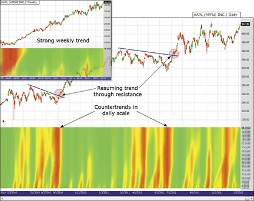
**FIGURE 3.**


```csharp
Wealth-Lab 6 strategy code (C#):

using System;
using System.Collections.Generic;
using System.Text;
using System.Drawing;
using WealthLab;

namespace WealthLab.Strategies
{
   public class SwamiStochastics : WealthScript
   {   
      StrategyParameter _plotWidth;
      
      public SwamiStochastics()
      {
         _plotWidth = CreateParameter("Plot Width", 6, 2, 10, 1);
      }
      
      public class ArrayHolder
      {
         internal double Stoc, Num, Denom;
      }
      
      public void SwamiStochHeatMap(DataSeries ds, int plotThickness)
      {
         int r = 0; int g = 0; int b = 0;
         string s = ds.Description + ")";   
         DataSeries swStoch = new DataSeries(ds, "SwamiStoch(" + s);
         DataSeries[] swamistoch = new DataSeries[49];
         
         // Initialize array
         ArrayHolder[] ah = new ArrayHolder[49];   
         for( int n = 4; n < 49; n++ )
            ah[n] = new ArrayHolder();
         
         // Create and plot the heatmap series (change bar colors later)
         HideVolume();  HidePaneLines();
         ChartPane swPane = CreatePane(50, false, false );
         for( int n = 4; n < 49; n++ ) 
         {
            swamistoch[n] = swStoch + n;
            swamistoch[n].Description = "SwamiSto." + n.ToString();   
            PlotSeries(swPane, swamistoch[n], Color.LightGray, LineStyle.Solid, plotThickness);
         }
         
         for(int bar = 48; bar < Bars.Count; bar++)
         {         
            double num2, denom2, stoch2;

            for (int n = 4; n < 49; n++) 
            {
               num2 = ah[n].Num;
               denom2 = ah[n].Denom;
               stoch2 = ah[n].Stoc;
               
               double hh = 0;
               double ll = 1e10;
               for (int j = 0; j < n; j++)   
               {
                  if (ds[bar - j] > hh) hh = ds[bar - j];
                  if (ds[bar - j] < ll) ll = ds[bar - j];
               }
               ah[n].Num = 0.5 * (ds[bar] - ll) + 0.5 * num2;
               ah[n].Denom = 0.5 * (hh - ll) + 0.5 * denom2;
               if (ah[n].Denom != 0)
               {
                  ah[n].Stoc = 0.2 * (ah[n].Num / ah[n].Denom) + 0.8 * stoch2;
               }
               
               if (ah[n].Stoc >= 0.5) {                  
                  r = Convert.ToInt32(255 * (2 - 2 * ah[n].Stoc)); 
                  g = 255;
               }
               else {
                  r = 255;
                  g = Convert.ToInt32(255 * 2 * ah[n].Stoc);
               }
               SetSeriesBarColor(bar, swamistoch[n], Color.FromArgb(r, g, b));   
            }
         }         
      }      
      
      protected override void Execute()
      {
         SwamiStochHeatMap(Close, _plotWidth.ValueInt);      
      }
   }
}

```


## AMIBROKER: March 2012

In �Introducing SwamiCharts� in this issue, authors John Ehlers & Ric
  Way present a new way to display classic indicators. They call their technique
SwamiCharts.

Implementing SwamiCharts in AmiBroker Formula Language is easy, thanks to
  its powerful array processing. The resulting code is very short compared to
  the way it may need to be implemented in some other platforms. The code is
  shown here. To use it, enter the formula in the AFL Editor, then press the
  Insert Indicator button to display the chart.

The formula implements SwamiCharts stochastics, but you can easily create
  SwamiCharts out of any indicator of your choice. Simply replace �StochK� with
  another indicator, as explained in the commented code below. Just make sure
  that indicator has a normalized range of zero to 100 (such as RSI, stochastics,
MFI, etc.) or adjust the scaling factor (100) accordingly.

A sample chart is shown in Figure 4.

FIGURE 4: AMIBROKER, SWAMICHARTS. Here is a daily chart
    of SPY (upper pane) and the SwamiChart stochastic (lower pane).

�Tomasz Janeczko, AmiBroker.comwww.amibroker.com

BACK TO LIST


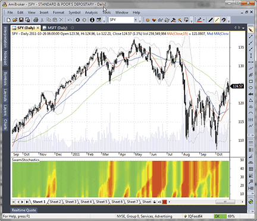
**FIGURE 4.**


```afl
Title = "SwamiStochastics"; 

for( N = 6; N <= 48; N++ ) 
{ 
 // Replace this line with the indicator of your choice, like RSI( N )
 indicator = StochK( N, 4 ) / 100; 

 red = IIf( indicator >= 0.5, 255 * ( 2 - 2 * indicator ), 255 ); 
 green = IIf( indicator < 0.5, 255 * 2 * indicator, 255 ); 
 blue = 0; 

 Color = ColorRGB( red, green, blue ); 

 PlotOHLC( N, N+1, N, N, "", Color, styleCloud | styleNoLabel ); 
}

```


## NEUROSHELL TRADER: March 2012

The neural networks in NeuroShell Trader can transform the visual discretionary
  information detailed in �Introducing SwamiCharts� by John Ehlers & Ric
Way in this issue into an analytical trading system.

We started with five-, 10-, 15-, and 20-period RSI indicators, which are displayed
  on the chart in Figure 5. The five-period RSI (pink) shows early market direction
  but often overreacts. We decided to feed the five-, 10-, 15-, and 20-period
  RSI indicators into a neural network in order to predict the one-bar percent
  change in the opening price. We let the genetic algorithm optimizer refine
  the periods to maximize the net profit and maintain a slowly rising equity
  curve. We limited the ranges for each copy of RSI to match the shorter to longer
  time frames mentioned in the article.

FIGURE 5: NEUROSHELL TRADER, SWAMICHARTS. This sample
    NeuroShell Trader chart displays different versions of RSI and the neural
    network prediction with trading signals.

The optimizer found that three-, 10-, 15-, and 20-period versions of RSI fed
  into a neural network made the best model. No scripting, coding, or programming
  of any kind was involved. The chart in Figure 5 was created using the wizards
  in NeuroShell Trader.

Users of NeuroShell Trader�s Power User versions can put neural net predictions
from different time frames on the same chart to expand the analysis.

Users of NeuroShell Trader can go to theStocks & Commoditiessection
  of the NeuroShell Trader free technical support website to download a copy
of this or any previous Traders� Tip.

�Marge Sherald, Ward Systems Group, Inc.301 662-7950,sales@wardsystems.comwww.neuroshell.com

BACK TO LIST


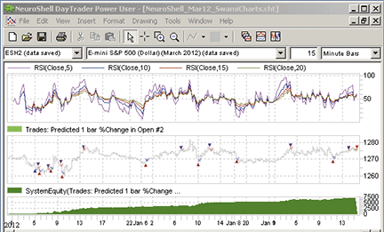
**FIGURE 5.**


## AIQ: March 2012

The AIQ code based on John Ehlers & Ric Way�s article in this issue, �Introducing SwamiCharts,� is provided at www.TradersEdgeSystems.com/traderstips.htm.

Note that I did not attempt to replicate the SwamiCharts as displayed in Ehlers & Way�s
  article mainly because I am not a discretionary trader but rather focus on
  mechanical systems. I wanted to take the concept of multiple parameter sets
for an indicator and see how this concept could be used in a trading system.

I decided to try a long-term trend-following system trading the NASDAQ 100
  list of stocks using moving averages of various lengths. I created an indicator
  that uses five simple moving average lengths (10, 20, 50, 100, 200). If the
  close is above the moving average, then it gets a value of +1; otherwise, it
  gets a value of -1. I then simply sum the five values from the different lengths
  to create the SMA_SWAMI indicator. I then created a system with the indicator
  by entering long when the indicator is greater than or equal to 4 and exit
  when it drops to less than -4. I didn�t test the short side of the system,
  only the buy side. The code to test the short side is provided but was not
tested.

FIGURE 6: AIQ SYSTEMS, SMA_SWAMI SYSTEM. Here is an equity
    curve for the theoretical SMA_SWAMI system compared to the S&P 500 with
    the test statistics for the SMA_SWAMI system trading the NASDAQ 100 list
    of stocks from 1/3/2000 to 1/13/2012.

In Figure 6, I show the equity curve and test statistics for the SMA_SWAMI
  system trading the NASDAQ 100 list of stocks from 1/3/2000 to 1/13/2012. The
  system averaged 13% compounded annual return with a maximum drawdown of 45%
  during the 2007�09 bear market.

This system is for illustrative purposes only and is not meant to be a finished
  system for live trading.

Again, the code and EDS file can be downloaded fromwww.TradersEdgeSystems.com/traderstips.htm.
  The code is also shown here:

�Richard Denninginfo@TradersEdgeSystems.comfor AIQ Systems

BACK TO LIST


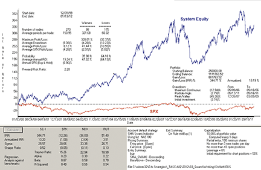
**FIGURE 6.**


```eds
!INTRODUCING SWAMI CHARTS
!Authors: John Ehlers and Ric Way, TASC March 2012
!System author: Richard Denning 1/15/2012
!Coded by: Richard Denning 1/15/2012
!www.TradersEdgeSystems.com

!INPUTS:
buyLvl is 4.
exitBuyLvl is -4.
sellLvl is -3.
exitSellLvl is 0.

C is [close].
sma10 is simpleavg(C,10).
sma20 is simpleavg(C,20).
sma50 is simpleavg(C,50).
sma100 is simpleavg(C,100).
sma200 is simpleavg(C,200).

sig10 is iff(C > sma10,1,-1).
sig20 is iff(C > sma20,1,-1).
sig50 is iff(C > sma50,1,-1).
sig100 is iff(C > sma100,1,-1).
sig200 is iff(C > sma200,1,-1).

SMA_SWAMI is sig10 + sig20 + sig50 + sig100 + sig200.

BarsAbove is countof(C > sma10,20).

buy if SMA_SWAMI >= buyLvl and valrule(SMA_SWAMI < buyLvl,1).
exitBuy if SMA_SWAMI < exitBuyLvl.
sell if SMA_SWAMI <= sellLvl.
exitSell if SMA_SWAMI > exitSellLvl.

```


## TRADERSSTUDIO: March 2012

The TradersStudio code for John Ehlers & Ric Way�s article in this issue, �Introducing SwamiCharts,� is provided at the websites noted below. The download includes
the following code files:

I did not attempt to replicate the SwamiCharts that are displayed in the article
  mainly because I am not a discretionary trader but rather focus completely
  on mechanical systems. I wanted to take the concept of multiple parameter sets
  for an indicator and see how this concept could be used in a system.

My first attempt was to combine seven different lengths of the RSI and then
  use all lengths to generate trading signals. Using the S&P contract, I
  decided to trade one contract each time that one of the seven RSI subsystems
  fired a signal. Thus, without applying compounding, the system could be long
  or short anywhere from zero to seven contracts at any point in time. I determined
  the entry and exit levels for each of the following RSI lengths: 2, 3, 5, 8,
  13, 21, 34 (a Fibonacci series) by running optimizations for each length separately.
  The indicator plot simply shows the net signal from the system. For example,
  if all seven subsystems are long, then the indicator will read �7.� If three
are long and one is short and the rest are flat, then the indicator will read �2.�

I ran a quick test in the Tradeplan module using the compounding/sizing method
  called TS_PercentMargin (provided with the software) with parameters of 4%
  of margin and 100 contracts maximum. In Figure 7, I show the resulting logarithmic
  equity curve trading the S&P futures contract, and in Figure 8, I show
  the resulting underwater equity curve in percentages. In Figure 9, I show the
  yearly returns from 2000 through 2011. The average annual compounded return
  for the test is 20.8% with a maximum drawdown of 50.3% in 2008. The system
  did quickly recover from this deep drawdown.

FIGURE 7: TRADERSSTUDIO, THEORETICAL SYSTEM RESULTS.
    Here is the logarithmic equity curve for the theoretical RSI_Swami_3 system
    trading the S&P futures contract for the period 1/1/2000 to 12/31/2011.

FIGURE 8: TRADERSSTUDIO, UNDERWATER EQUITY. Here is an
    underwater equity curve for the RSI_Swami_3 system trading the S&P futures
    contract for the period 1/1/2000 to 12/31/2011.

FIGURE 9: TRADERSSTUDIO, RETURNS. Here are theoretical
    yearly returns for the RSI_Swami_3 system trading the S&P futures contract
    for the period 1/1/2000 to 12/31/2011.

This system is for illustrative purposes only and is not meant to be a finished
  system for live trading.

The TradersStudio code files are available from the following websites:

�Richard Denninginfo@TradersEdgeSystems.comfor TradersStudio

BACK TO LIST


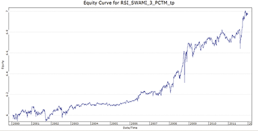
**FIGURE 7.**


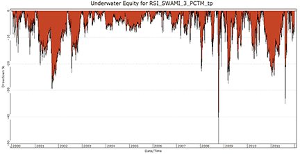
**FIGURE 8.**


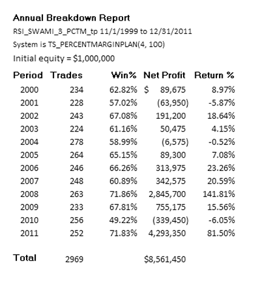
**FIGURE 9.**


```basic
'INTRODUCING SWAMI CHARTS
'Authors: John Ehlers and Ric Way, TASC March 2012
'Coded by: Richard Denning 1/15/2012
'www.TradersEdgeSystems.com

Function RSI_SWAMI_3_FUN()
Dim myRSI2,myRSI3,myRSI5,myRSI8,myRSI13,myRSI21,myRSI34
Dim entryLvlA,entryLvlB,exitLvlA,exitLvlB,exitLvlC
Dim sig2 As BarArray
Dim sig3 As BarArray
Dim sig5 As BarArray
Dim sig8 As BarArray
Dim sig13 As BarArray
Dim sig21 As BarArray
Dim sig34 As BarArray

entryLvlA = 10
entryLvlB = 20
exitLvlA = 0
exitLvlB = 5
exitLvlC = 10

myRSI2 = rsi(C,2,0) 
myRSI3 = rsi(C,3,0) 
myRSI5 = rsi(C,5,0) 
myRSI8 = rsi(C,8,0) 
myRSI13 = rsi(C,13,0) 
myRSI21 = rsi(C,21,0)
myRSI34 = rsi(C,34,0) 

If myRSI2 < 50 - entryLvlA Then sig2 = 1
If myRSI2 > 50 + entryLvlA Then sig2 = -1

If myRSI3 < 50 - entryLvlA Then sig3 = 1
If myRSI3 > 50 + entryLvlA Then sig3 = -1

If myRSI5 < 50 - entryLvlA Then sig5 = 1
If myRSI5 > 50 + entryLvlA Then sig5 = -1

If myRSI8 < 50 - entryLvlA Then sig8 = 1
If myRSI8 > 50 + entryLvlA Then sig8 = -1

If myRSI13 < 50 - entryLvlA Then sig13 = 1
If myRSI13 > 50 + entryLvlA Then sig13 = -1

If myRSI21 < 50 - entryLvlA Then sig21 = 1
If myRSI21 > 50 + entryLvlA Then sig21 = -1

If myRSI34 < 50 - entryLvlB Then sig34 = 1
If myRSI34 > 50 + entryLvlB Then sig34 = -1

RSI_SWAMI_3_FUN = sig2 + sig3 + sig5 + sig8 + sig13 + sig21 + sig34

End Function
'---------------------------------------------------------------------

'indicator plot:

Sub RSI_SWAMI_3_IND()
plot1(RSI_SWAMI_3_FUN())
plot2(7)
plot3(-7)
End Sub
'---------------------------------------------------------------------

'INTRODUCING SWAMI CHARTS
'Authors: John Ehlers and Ric Way, TASC March 2012
'System author: Richard Denning 1/15/2012
'Coded by: Richard Denning 1/15/2012
'www.TradersEdgeSystems.com

'trading system (not part of article):

Sub RSI_SWAMI_3()
Dim myRSI2,myRSI3,myRSI5,myRSI8,myRSI13,myRSI21,myRSI34
Dim entryLvlA,entryLvlB,exitLvlA,exitLvlB,exitLvlC

entryLvlA = 10  'when rsi is < 40 (longs) or > 60 (shorts)
entryLvlB = 20  'when rsi is < 30 (longs) or > 70 (shorts)
exitLvlA = 0    'see exit formula-has not effect when = 0
exitLvlB = 5    'see exit formula-allows exits when before reversing level is reached
exitLvlC = 10   'see exit formula-allows exits when before reversing level is reached

'use Fibonacci series for multiple lengths on the RSI incidator
myRSI2 = rsi(C,2,0) 
myRSI3 = rsi(C,3,0) 
myRSI5 = rsi(C,5,0) 
myRSI8 = rsi(C,8,0) 
myRSI13 = rsi(C,13,0) 
myRSI21 = rsi(C,21,0)
myRSI34 = rsi(C,34,0) 

tradesallowed = SameDirectDiffSignals
exitsallowed = SameDirectDiffSignals

'for each length that has a new signal, trade one contract
'when not applying sizing, maximum contracts will be 7 

If myRSI2 < 50 - entryLvlA Then Buy("LE2",1,0,Market,Day)
If exitLvlA > 0 And myRSI2 > 50 + entryLvlA - exitLvlA Then ExitLong("LX2","LE2",1,0,Market,Day)
If myRSI2 > 50 + entryLvlA Then Sell("SE2",1,0,Market,Day)
If exitLvlA > 0 And myRSI2 < 50 - entryLvlA + exitLvlA Then ExitShort("SX2","SE2",1,0,Market,Day)

If myRSI3 < 50 - entryLvlA Then Buy("LE3",1,0,Market,Day)
If exitLvlA > 0 And myRSI3 > 50 + entryLvlA - exitLvlA Then ExitLong("LX3","LE3",1,0,Market,Day)
If myRSI3 > 50 + entryLvlA Then Sell("SE3",1,0,Market,Day)
If exitLvlA > 0 And myRSI3 < 50 - entryLvlA + exitLvlA Then ExitShort("SX3","SE3",1,0,Market,Day)

If myRSI5 < 50 - entryLvlA Then Buy("LE5",1,0,Market,Day)
If exitLvlA > 0 And myRSI5 > 50 + entryLvlA - exitLvlA Then ExitLong("LX5","LE5",1,0,Market,Day)
If myRSI5 > 50 + entryLvlA Then Sell("SE5",1,0,Market,Day)
If exitLvlA > 0 And myRSI5 < 50 - entryLvlA + exitLvlA Then ExitShort("SX5","SE5",1,0,Market,Day)

If myRSI8 < 50 - entryLvlA Then Buy("LE8",1,0,Market,Day)
If exitLvlB > 0 And myRSI8 > 50 + entryLvlA - exitLvlB Then ExitLong("LX8","LE8",1,0,Market,Day)
If myRSI8 > 50 + entryLvlA Then Sell("SE8",1,0,Market,Day)
If exitLvlB > 0 And myRSI8 < 50 - entryLvlA + exitLvlB Then ExitShort("SX8","SE8",1,0,Market,Day)

If myRSI13 < 50 - entryLvlA Then Buy("LE13",1,0,Market,Day)
If exitLvlC > 0 And myRSI13 > 50 + entryLvlA - exitLvlC Then ExitLong("LX13","LE13",1,0,Market,Day)
If myRSI13 > 50 + entryLvlA Then Sell("SE13",1,0,Market,Day)
If exitLvlC > 0 And myRSI13 < 50 - entryLvlA + exitLvlC Then ExitShort("SX13","SE13",1,0,Market,Day)

If myRSI21 < 50 - entryLvlA Then Buy("LE21",1,0,Market,Day)
If exitLvlC > 0 And myRSI21 > 50 + entryLvlA - exitLvlC Then ExitLong("LX21","LE21",1,0,Market,Day)
If myRSI13 > 50 + entryLvlA Then Sell("SE21",1,0,Market,Day)
If exitLvlC > 0 And myRSI13 < 50 - entryLvlA + exitLvlC Then ExitShort("SX21","SE21",1,0,Market,Day)

If myRSI34 < 50 - entryLvlB Then Buy("LE34",1,0,Market,Day)
If exitLvlA > 0 And myRSI34 > 50 + entryLvlB - exitLvlA Then ExitLong("LX34","LE34",1,0,Market,Day)
If myRSI34 > 50 + entryLvlB Then Sell("SE34",1,0,Market,Day)
If exitLvlA > 0 And myRSI34 < 50 - entryLvlB + exitLvlA Then ExitShort("SX34","SE34",1,0,Market,Day)
End Sub
'----------------------------------------------------------------------------------------

```


## NINJATRADER: March 2012

NinjaTrader source files: [ninja-trader/](ninja-trader/) (SwamiStochastics.cs, @Stochastics.cs, @SMA.cs, @MIN.cs, @MAX.cs)

SwamiCharts stochastics, as discussed in �Introducing SwamiCharts� by John
  Ehlers & Ric Way in this issue, has been implemented as an indicator available
for download atwww.ninjatrader.com/SC/March2012SC.zip.

Once you have it downloaded, from within the NinjaTrader Control Center window,
  select the menu File → Utilities → Import NinjaScript and select
  the downloaded file. This file is for NinjaTrader version 7 or greater.

You can review the indicator source code by selecting the menu Tools → Edit
  NinjaScript → Indicator from within the NinjaTrader Control Center window
and selecting �Swami-Stochastics.�

NinjaScript uses compiled DLLs that run native, not interpreted, which provides
  you with the highest performance possible.

A sample chart implementing the strategy is shown in Figure 10.

FIGURE 10: NINJATRADER, SWAMICHARTS. This screenshot
    shows the Swami Stochastics indicator applied to a 15-minute chart of the
    emini S&P (ES 03-12).

�Art Runelis, Raymond Deux & Ryan MillardNinjaTrader, LLCwww.ninjatrader.com

BACK TO LIST


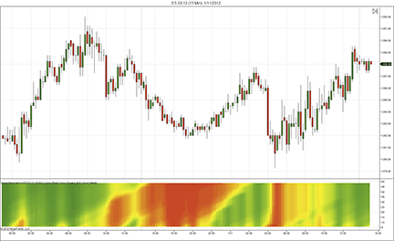
**FIGURE 10.**


## UPDATA: March 2012

This Traders� Tip is based on the article by John Ehlers & Ric Way in
  this issue, �Introducing SwamiCharts.� The majority of indicators show one
  value per datapoint for a static input. The heatmap display of SwamiCharts
  can show, via color changing, how this value alters across multiple periods
at the same datapoint.

The Updata code for this indicator is in the Updata Library and may be downloaded
  by clicking the Custom menu and Indicator Library. Those who cannot access
  the library due to a firewall may paste the code shown here into the Updata
  Custom editor and save it.

A sample chart is shown in Figure 11.

FIGURE 11: UPDATA, SWAMICHARTS. This chart shows the
    daily S&P 500 with SwamiChart (48,6) applied. The red gradient most recently
    shows stochastics with negative values for periods less than 30.

�Updata support teamsupport@updata.co.ukwww.updata.co.uk

BACK TO LIST


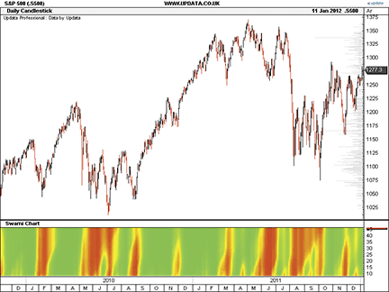
**FIGURE 11.**


```basic
Imports System.Drawing
Imports Updata
 
Public Class Updata_TestIndicator
    Implements ICustomIndicator
 
    Public Sub init() Implements ICustomIndicator.init
    End Sub
 
    Public Function getLines(ByVal iLineStyles() As LineStyles, ByVal iChartStyles() As ChartStyles, ByVal sNames() As String, ByVal iColours() As Integer, ByVal iColours2() As Integer) As Integer Implements ICustomIndicator.getLines
        iLineStyles(0) = LineStyles.Dot
        iChartStyles(0) = ChartStyles.Chart
        iColours(0) = Color.Red.ToArgb()
        iColours2(0) = Color.Red.ToArgb()
        sNames(0) = �Swami Chart�
        getLines = 1
    End Function
    'Dialog prompt-not needed 
    Public Function queryForParameters(ByVal iRets() As Updata.VariableTypes, ByVal sNames() As String, ByVal sDescrips() As String, ByVal defaults As Object()) As Integer Implements ICustomIndicator.queryForParameters
        queryForParameters = 0
    End Function
    ' these global variables are maintained between the last calculation, and the current paint
    ' all this information is required to plot the heatmap
    Private Colour1(48, 1) As Integer
    Private Colour2(48, 1) As Integer
 
    Public Function recalculateAll(ByVal dSrc()() As Double, ByVal oParams() As Object, ByVal dRet()()() As Double, ByVal iTradeTypes()() As Integer, ByVal dTradeOpenPrices()() As Double, ByVal dTradeClosePrices()() As Double, ByVal iTradeAmounr()() As Integer, ByVal dStopLevels()() As Double) As Boolean Implements ICustomIndicator.recalculateAll
       If dSrc.Length = 0 Then
           recalculateAll = False
       End If
       dim HH as Integer
       dim LL as Integer 
       dim i,k,j,z As Integer
       dim Stoc(48, dRet(0).Length) as Double
       dim Num(48, dRet(0).Length) as Integer
       dim Denom(48, dRet(0).Length) as Integer
       ReDim Colour1(48, dRet(0).Length)
       ReDim Colour2(48, dRet(0).Length)
         For i = 50 To dRet(0).Length-1 
            For j = 6 to 48 
               HH = 0
               LL = 1000000                
               For k = 0 to j - 1 
                  If dSrc(i-k)(3)>HH Then HH=dSrc(i-k)(3)
                  If dSrc(i-k)(3)6
                  Num(j,i)=0.5*(dSrc(i)(3)-LL)+0.5*Num(j,i-1)
                  Denom(j,i)=0.5*(HH-LL)+0.5*Denom(j,i-1) 
               Else
                  Num(j,i)=0.5*(dSrc(i)(3)-LL) 
                  Denom(j,i)=0.5*(HH-LL) 
               End If               
               If Denom(j,i) <> 0 Then Stoc(j,i) = 0.2*(Num(j,i)/Denom(j,i)) + 0.8*Stoc(j,i-1) 
            Next j  
             'Plot the Spectrum as a Heatmap   
             For j = 6 To 48
                 'Convert Stochastic to RGB Color for Display
                 If Stoc(j,i)>0.5 Then
                     Colour1(j,i) = System.Math.Max(255*(2-2*Stoc(j,i)),0)
                     Colour2(j,i) = 255
                 End If
                 If Stoc(j, i)<0.5 Then
                     Colour1(j,i) = 255
                     Colour2(j,i) = System.Math.Max(255*2*Stoc(j,i),0)
                 End If
             Next j       
            'force a 6 to 48 range
            For z = 0 To dRet(0)(i).Length - 1
                dRet(0)(i)(z) = 6
                If i Mod 2 = 0 Then
                    dRet(0)(i)(z) = 48
                End If
            Next z
         Next i 
        recalculateAll = True
    End Function
    ' reserved for future support
    Public Function recalculateLast(ByVal dSrc()() As Double, ByVal oParams() As Object, ByVal dRet()()() As Double) As Boolean Implements ICustomIndicator.recalculateLast
        recalculateLast = False
    End Function 
 
    Public Function paint(ByVal g As System.Drawing.Graphics, ByVal oParams() As Object, ByVal ds()()() As Double, ByVal iFirstVisible As Integer, ByVal iLastVisible As Integer, ByVal c As iGraphFunctions, ByVal iLineNum As Integer) As Boolean Implements ICustomIndicator.paint
        If iLineNum = 1 Then
            paint = False
        Else
            'Line Conditions
            Dim x,y,y2,i,j As Integer
            Dim pLastPoint As Point   
            'checks to see it�s not just refreshing the last point
            If (iFirstVisible iFirstVisible Then
                            If y - y2 > 1 Then
                                g.FillRectangle(brush,x,y2,x-pLastPoint.x+1,y-y2+1)
                            Else
                                g.FillRectangle(brush,x,y2,x-pLastPoint.x+1,1)
                            End If
                        End If
                        pLastPoint=New Point(x,y)
                    Next i
                Next j
            End Using
            paint = True
        End If
    End Function 
End Class

```


## OMNITRADER: March 2012

In theirarticle in this issue, John Ehlers & Ric Way demonstrate a method
  of producing heatmaps from common indicators. This is accomplished by calculating
  the indicator with a series of values of the parameter, then generating a color
  coding for each bar based on the indicator value. Heatmaps of this type are
  provided by Nirvana�s Cycle Trader plugin, which has preconfigured heatmaps
for some of the most popular indicators.

These heatmaps can also be produced in OmniLanguage, though the implementation
  is not as elegant. To ensure our heatmaps match those in the article, we have
  used the stochastics %D line in this example. (See Figure 12.) We vary the
  primary parameter from four to 48 periods, while fixing the two smoothing parameters
  at three and nine periods, respectively. The concept can be similarly applied
  to other indicators.

FIGURE 12: OMNITRADER, SWAMICHARTS. Here is a sample
    chart of GOOG with the StochHeat indicator.

For the sake of completeness, we have included code for the %D indicator (PercentD.txt)
  and the heatmap-generation code (StochHeat.txt),
  available below. The code will work with the professional versions of both
  OmniTrader and VisualTrader.

To use the software, copy the two files to the VBA folder of your OmniTrader
  or VisualTrader directory. The next time you start OT or VT, these indicators
  will be available for use. If desired, the calculations can be modified using
  the Omni-Language IDE.

For more information on Nirvana�s Cycle Trader and source code for this article,
visithttps://www.omnitrader.com/CycleTrader.

�Jeremy WilliamsNirvana Systems, Inc.www.omnitrader.com,www.nirvanasystems.com

BACK TO LIST


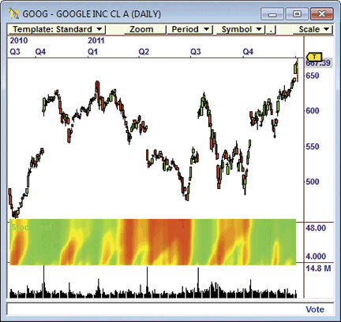
**FIGURE 12.**


```
'**************************************************************
'*   Percent D Indicator (PercentD.txt)
'*     by Jeremy Williams
'*	   January 13, 2012
'*
'*	Adapted from Technical Analysis of Stocks and Commodities
'*     March 2012
'*
'*  Summary: 
'*
'*      This indicator plots a the Percent D line of a 
'*  Stochastics Indicator. The smoothing periods for this 
'*  indicator are set at 3 and 9 respectively. For more 
'*  information see "Introducing SwamiCharts" in the March 2012
'*  edition of Technical Analysis of Stocks and Commodities.
'*
'*  Parameters:
'*  
'*  Periods- Sets the number of periods used for the base 
'*  calculation of the Stochastics indicator
'*
'*  Notes:
'*
'*  The two smoothing parameters for a traditional stochastics
'*  are fixed at 3 and 9 respectively for this indicator.
'*
'************************************************************** 

#Indicator
#Param "Periods",14

Dim HH As Single
Dim LL As Single
Dim Num As Single
Dim Denom AS Single
Dim D As Single

' Calculate the highs and lows
HH= HHV(Periods)
LL=LLV(Periods)

' Calculate numerator and denominator with smoothing
' Note: alpha of .5 equates to a 3 period EMA
Num = .5*(Close-LL)+.5*Num[1]
Denom = .5*(HH-LL)+.5*Denom[1]

' Calcuate the %D line
' Note: alpha of .2 equates to a 9 period EMA
If Denom <>0 Then 
	D= .2*Num/Denom +.8*D[1]
Else
	D= 0
End IF

' Plot the Percent D indicator
Plot("PercentD", D)

' Return the calculated Value
Return D 
```


```
'**************************************************************
'*   Stochastic Heat (StochHeat.txt)
'*     by Jeremy Williams
'*	   January 13, 2012
'*
'*	Adapted from Technical Analysis of Stocks and Commodities
'*     March 2012
'*
'*  Summary: 
'*
'*      This indicator plots a Heatmap of the Percent D line 
'*  of the Stochastics Indicator. For more information see
'*  "Introducing SwamiCharts" in the March 2012 edition of
'*  Technical Analysis of Stocks and Commodities.
'*
'*  Notes:
'*
'*  This indicator requires the PercentD (PercentD.txt) 
'*  indicator to function. This can be found at: 
'*  
'*  www.omnitrader.com/ProSI
'*
'*  This indicator is only a visual tool and does not
'*  return a value.
'*
'************************************************************** 

#Indicator

' Setup Plot area Y- Axis from 4 to 48 corresponding with the
' period of the Stochastic used.
SetScales(4,48)

' Process the 4 period stochastics
Dim oColor4 As Object
Dim myStoch4 As Single
myStoch4 =  PercentD(4)

' Color heatmap line based on value
If myStoch4 < .50 Then
	oColor4 = Color.FromARGB(255,255*2*myStoch4,0)
Else 
	oColor4 = Color.FromARGB(255*(2-2*myStoch4),255,0)
End If

' Plot line for period 4 stochastics
Plot("4",4,oColor4,10)

' Contiune similarly for other periods.
Dim oColor5 As Object
Dim myStoch5 As Single
myStoch5 = PercentD(5)
If myStoch5 < .50 Then
	oColor5 = Color.FromARGB(255,255*2*myStoch5,0)
Else 
	oColor5 = Color.FromARGB(255*(2-2*myStoch5),255,0)
End If
Plot("5",5,oColor5,10)

Dim oColor6 As Object
Dim myStoch6 As Single
myStoch6 = PercentD(6)
If myStoch6 < .50 Then
	oColor6 = Color.FromARGB(255,255*2*myStoch6,0)
Else 
	oColor6 = Color.FromARGB(255*(2-2*myStoch6),255,0)
End If
Plot("6",6,oColor6,10)

Dim oColor7 As Object
Dim myStoch7 As Single
myStoch7 = PercentD(7)
If myStoch7 < .50 Then
	oColor7 = Color.FromARGB(255,255*2*myStoch7,0)
Else 
	oColor7 = Color.FromARGB(255*(2-2*myStoch7),255,0)
End If
Plot("7",7,oColor7,10)

Dim oColor8 As Object
Dim myStoch8 As Single
myStoch8 = PercentD(8)
If myStoch8 < .50 Then
	oColor8 = Color.FromARGB(255,255*2*myStoch8,0)
Else 
	oColor8 = Color.FromARGB(255*(2-2*myStoch8),255,0)
End If
Plot("8",8,oColor8,10)

Dim oColor9 As Object
Dim myStoch9 As Single
myStoch9 = PercentD(9)
If myStoch9 < .50 Then
	oColor9 = Color.FromARGB(255,255*2*myStoch9,0)
Else 
	oColor9 = Color.FromARGB(255*(2-2*myStoch9),255,0)
End If
Plot("9",9,oColor9,10)

Dim oColor10 As Object
Dim myStoch10 As Single
myStoch10 = PercentD(10)
If myStoch10 < .50 Then
	oColor10 = Color.FromARGB(255,255*2*myStoch10,0)
Else 
	oColor10 = Color.FromARGB(255*(2-2*myStoch10),255,0)
End If
Plot("10",10,oColor10,10)

Dim oColor11 As Object
Dim myStoch11 As Single
myStoch11 = PercentD(11)
If myStoch11 < .50 Then
	oColor11 = Color.FromARGB(255,255*2*myStoch11,0)
Else 
	oColor11 = Color.FromARGB(255*(2-2*myStoch11),255,0)
End If
Plot("11",11,oColor11,10)

Dim oColor12 As Object
Dim myStoch12 As Single
myStoch12 = PercentD(12)
If myStoch12 < .50 Then
	oColor12 = Color.FromARGB(255,255*2*myStoch12,0)
Else 
	oColor12 = Color.FromARGB(255*(2-2*myStoch12),255,0)
End If
Plot("12",12,oColor12,10)

Dim oColor13 As Object
Dim myStoch13 As Single
myStoch13 = PercentD(13)
If myStoch13 < .50 Then
	oColor13 = Color.FromARGB(255,255*2*myStoch13,0)
Else 
	oColor13 = Color.FromARGB(255*(2-2*myStoch13),255,0)
End If
Plot("13",13,oColor13,10)


Dim oColor14 As Object
Dim myStoch14 As Single
myStoch14 = PercentD(14)
If myStoch14 < .50 Then
	oColor14 = Color.FromARGB(255,255*2*myStoch14,0)
Else 
	oColor14 = Color.FromARGB(255*(2-2*myStoch14),255,0)
End If
Plot("14",14,oColor14,10)

Dim oColor15 As Object
Dim myStoch15 As Single
myStoch15 = PercentD(15)
If myStoch15 < .50 Then
	oColor15 = Color.FromARGB(255,255*2*myStoch15,0)
Else 
	oColor15 = Color.FromARGB(255*(2-2*myStoch15),255,0)
End If
Plot("15",15,oColor15,10)

Dim oColor16 As Object
Dim myStoch16 As Single
myStoch16 = PercentD(16)
If myStoch16 < .50 Then
	oColor16 = Color.FromARGB(255,255*2*myStoch16,0)
Else 
	oColor16 = Color.FromARGB(255*(2-2*myStoch16),255,0)
End If
Plot("16",16,oColor16,10)


Dim oColor17 As Object
Dim myStoch17 As Single
myStoch17 = PercentD(17)
If myStoch17 < .50 Then
	oColor17 = Color.FromARGB(255,255*2*myStoch17,0)
Else 
	oColor17 = Color.FromARGB(255*(2-2*myStoch17),255,0)
End If
Plot("17",17,oColor17,10)


Dim oColor18 As Object
Dim myStoch18 As Single
myStoch18 = PercentD(18)
If myStoch18 < .50 Then
	oColor18 = Color.FromARGB(255,255*2*myStoch18,0)
Else 
	oColor18 = Color.FromARGB(255*(2-2*myStoch18),255,0)
End If
Plot("18",18,oColor18,10)


Dim oColor19 As Object
Dim myStoch19 As Single
myStoch19 = PercentD(19)
If myStoch19 < .50 Then
	oColor19 = Color.FromARGB(255,255*2*myStoch19,0)
Else 
	oColor19 = Color.FromARGB(255*(2-2*myStoch19),255,0)
End If
Plot("19",19,oColor19,10)

Dim oColor20 As Object
Dim myStoch20 As Single
myStoch20 = PercentD(20)
If myStoch20 < .50 Then
	oColor20 = Color.FromARGB(255,255*2*myStoch20,0)
Else 
	oColor20 = Color.FromARGB(255*(2-2*myStoch20),255,0)
End If
Plot("20",20,oColor20,10)

Dim oColor21 As Object
Dim myStoch21 As Single
myStoch21 = PercentD(21)
If myStoch21 < .50 Then
	oColor21 = Color.FromARGB(255,255*2*myStoch21,0)
Else 
	oColor21 = Color.FromARGB(255*(2-2*myStoch21),255,0)
End If
Plot("21",21,oColor21,10)


Dim oColor22 As Object
Dim myStoch22 As Single
myStoch22 = PercentD(22)
If myStoch22 < .50 Then
	oColor22 = Color.FromARGB(255,255*2*myStoch22,0)
Else 
	oColor22 = Color.FromARGB(255*(2-2*myStoch22),255,0)
End If
Plot("22",22,oColor22,10)


Dim oColor23 As Object
Dim myStoch23 As Single
myStoch23 = PercentD(23)
If myStoch23 < .50 Then
	oColor23 = Color.FromARGB(255,255*2*myStoch23,0)
Else 
	oColor23 = Color.FromARGB(255*(2-2*myStoch23),255,0)
End If
Plot("23",23,oColor23,10)


Dim oColor24 As Object
Dim myStoch24 As Single
myStoch24 = PercentD(24)
If myStoch24 < .50 Then
	oColor24 = Color.FromARGB(255,255*2*myStoch24,0)
Else 
	oColor24 = Color.FromARGB(255*(2-2*myStoch24),255,0)
End If
Plot("24",24,oColor24,10)

Dim oColor25 As Object
Dim myStoch25 As Single
myStoch25 = PercentD(25)
If myStoch25 < .50 Then
	oColor25 = Color.FromARGB(255,255*2*myStoch25,0)
Else 
	oColor25 = Color.FromARGB(255*(2-2*myStoch25),255,0)
End If
Plot("25",25,oColor25,10)

Dim oColor26 As Object
Dim myStoch26 As Single
myStoch26 = PercentD(26)
If myStoch26 < .50 Then
	oColor26 = Color.FromARGB(255,255*2*myStoch26,0)
Else 
	oColor26 = Color.FromARGB(255*(2-2*myStoch26),255,0)
End If
Plot("26",26,oColor26,10)

Dim oColor27 As Object
Dim myStoch27 As Single
myStoch27 = PercentD(27)
If myStoch27 < .50 Then
	oColor27 = Color.FromARGB(255,255*2*myStoch27,0)
Else 
	oColor27 = Color.FromARGB(255*(2-2*myStoch27),255,0)
End If
Plot("27",27,oColor27,10)

Dim oColor28 As Object
Dim myStoch28 As Single
myStoch28 = PercentD(28)
If myStoch28 < .50 Then
	oColor28 = Color.FromARGB(255,255*2*myStoch28,0)
Else 
	oColor28 = Color.FromARGB(255*(2-2*myStoch28),255,0)
End If
Plot("28",28,oColor28,10)


Dim oColor29 As Object
Dim myStoch29 As Single
myStoch29 = PercentD(29)
If myStoch29 < .50 Then
	oColor29 = Color.FromARGB(255,255*2*myStoch29,0)
Else 
	oColor29 = Color.FromARGB(255*(2-2*myStoch29),255,0)
End If
Plot("29",29,oColor29,10)

Dim oColor30 As Object
Dim myStoch30 As Single
myStoch30 = PercentD(30)
If myStoch30 < .50 Then
	oColor30 = Color.FromARGB(255,255*2*myStoch30,0)
Else 
	oColor30 = Color.FromARGB(255*(2-2*myStoch30),255,0)
End If
Plot("30",30,oColor30,10)

Dim oColor31 As Object
Dim myStoch31 As Single
myStoch31 = PercentD(31)
If myStoch31 < .50 Then
	oColor31 = Color.FromARGB(255,255*2*myStoch31,0)
Else 
	oColor31 = Color.FromARGB(255*(2-2*myStoch31),255,0)
End If
Plot("31",31,oColor31,10)

Dim oColor32 As Object
Dim myStoch32 As Single
myStoch32 = PercentD(32)
If myStoch32 < .50 Then
	oColor32 = Color.FromARGB(255,255*2*myStoch32,0)
Else 
	oColor32 = Color.FromARGB(255*(2-2*myStoch32),255,0)
End If
Plot("32",32,oColor32,10)


Dim oColor33 As Object
Dim myStoch33 As Single
myStoch33 = PercentD(33)
If myStoch33 < .50 Then
	oColor33 = Color.FromARGB(255,255*2*myStoch33,0)
Else 
	oColor33 = Color.FromARGB(255*(2-2*myStoch33),255,0)
End If
Plot("33",33,oColor33,10)


Dim oColor34 As Object
Dim myStoch34 As Single
myStoch34 = PercentD(34)
If myStoch34 < .50 Then
	oColor34 = Color.FromARGB(255,255*2*myStoch34,0)
Else 
	oColor34 = Color.FromARGB(255*(2-2*myStoch34),255,0)
End If
Plot("34",34,oColor34,10)


Dim oColor35 As Object
Dim myStoch35 As Single
myStoch35 = PercentD(35)
If myStoch35 < .50 Then
	oColor35 = Color.FromARGB(255,255*2*myStoch35,0)
Else 
	oColor35 = Color.FromARGB(255*(2-2*myStoch35),255,0)
End If
Plot("35",35,oColor35,10)


Dim oColor36 As Object
Dim myStoch36 As Single
myStoch36 = PercentD(36)
If myStoch36 < .50 Then
	oColor36 = Color.FromARGB(255,255*2*myStoch36,0)
Else 
	oColor36 = Color.FromARGB(255*(2-2*myStoch36),255,0)
End If
Plot("36",36,oColor36,10)

Dim oColor37 As Object
Dim myStoch37 As Single
myStoch37 = PercentD(37)
If myStoch37 < .50 Then
	oColor37 = Color.FromARGB(255,255*2*myStoch37,0)
Else 
	oColor37 = Color.FromARGB(255*(2-2*myStoch37),255,0)
End If
Plot("37",37,oColor37,10)


Dim oColor38 As Object
Dim myStoch38 As Single
myStoch38 = PercentD(38)
If myStoch38 < .50 Then
	oColor38 = Color.FromARGB(255,255*2*myStoch38,0)
Else 
	oColor38 = Color.FromARGB(255*(2-2*myStoch38),255,0)
End If
Plot("38",38,oColor38,10)


Dim oColor39 As Object
Dim myStoch39 As Single
myStoch39 = PercentD(39)
If myStoch39 < .50 Then
	oColor39 = Color.FromARGB(255,255*2*myStoch39,0)
Else 
	oColor39 = Color.FromARGB(255*(2-2*myStoch39),255,0)
End If
Plot("39",39,oColor39,10)


Dim oColor40 As Object
Dim myStoch40 As Single
myStoch40 = PercentD(40)
If myStoch40 < .50 Then
	oColor40 = Color.FromARGB(255,255*2*myStoch40,0)
Else 
	oColor40 = Color.FromARGB(255*(2-2*myStoch40),255,0)
End If
Plot("40",40,oColor40,10)


Dim oColor41 As Object
Dim myStoch41 As Single
myStoch41 = PercentD(41)
If myStoch41 < .50 Then
	oColor41 = Color.FromARGB(255,255*2*myStoch41,0)
Else 
	oColor41 = Color.FromARGB(255*(2-2*myStoch41),255,0)
End If
Plot("41",41,oColor41,10)


Dim oColor42 As Object
Dim myStoch42 As Single
myStoch42 = PercentD(42)
If myStoch42 < .50 Then
	oColor42 = Color.FromARGB(255,255*2*myStoch42,0)
Else 
	oColor42 = Color.FromARGB(255*(2-2*myStoch42),255,0)
End If
Plot("42",42,oColor42,10)


Dim oColor43 As Object
Dim myStoch43 As Single
myStoch43 = PercentD(43)
If myStoch43 < .50 Then
	oColor43 = Color.FromARGB(255,255*2*myStoch43,0)
Else 
	oColor43 = Color.FromARGB(255*(2-2*myStoch43),255,0)
End If
Plot("43",43,oColor43,10)


Dim oColor44 As Object
Dim myStoch44 As Single
myStoch44 = PercentD(44)
If myStoch44 < .50 Then
	oColor44 = Color.FromARGB(255,255*2*myStoch44,0)
Else 
	oColor44 = Color.FromARGB(255*(2-2*myStoch44),255,0)
End If
Plot("44",44,oColor44,10)


Dim oColor45 As Object
Dim myStoch45 As Single
myStoch45 = PercentD(45)
If myStoch45 < .50 Then
	oColor45 = Color.FromARGB(255,255*2*myStoch45,0)
Else 
	oColor45 = Color.FromARGB(255*(2-2*myStoch45),255,0)
End If
Plot("45",45,oColor45,10)


Dim oColor46 As Object
Dim myStoch46 As Single
myStoch46 = PercentD(46)
If myStoch46 < .50 Then
	oColor46 = Color.FromARGB(255,255*2*myStoch46,0)
Else 
	oColor46 = Color.FromARGB(255*(2-2*myStoch46),255,0)
End If
Plot("46",46,oColor46,10)


Dim oColor47 As Object
Dim myStoch47 As Single
myStoch47 = PercentD(47)
If myStoch47 < .50 Then
	oColor47 = Color.FromARGB(255,255*2*myStoch47,0)
Else 
	oColor47 = Color.FromARGB(255*(2-2*myStoch47),255,0)
End If
Plot("47",47,oColor47,10)


Dim oColor48 As Object
Dim myStoch48 As Single
myStoch48 = PercentD(48)
If myStoch48 < .50 Then
	oColor48 = Color.FromARGB(255,255*2*myStoch48,0)
Else 
	oColor48 = Color.FromARGB(255*(2-2*myStoch48),255,0)
End If
Plot("48",48,oColor48,10)

Return 0     ' Return the value calculated by the indicator

```


## TRADESIGNAL ONLINE: March 2012

The SwamiCharts stochastics indicator introduced by John Ehlers & Ric
  Way in their article in this issue, �Introducing SwamiCharts,� can easily be
  used with our online charting tool at www.tradesignalonline.com. Just check
  the Infopedia section for our lexicon. There, you will see the SwamiCharts
  stochastics indicator that you can make available for your personal account.
  Click on it and select Open Script. The indicator will then be available for
you to apply to any chart you wish. See Figure 13 for an example.

FIGURE 13: TRADESIGNAL ONLINE, SWAMICHARTS STOCHASTICS.
    Here is a chart by Tradesignal Online with the SwamiCharts stochastics indicator
    shown on a daily chart of the S&P 500.

The source code is shown here:

�Sebastian Schenck, Tradesignal GmbHsupport@tradesignalonline.comwww.TradesignalOnline.com,www.Tradesignal.com

BACK TO LIST


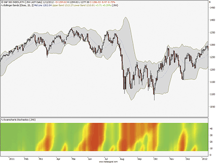
**FIGURE 13.**


```easylanguage
Meta:
	Subchart( True ),
	Synopsis("Swamichart Stochastics Indicator, based on John Ehlers march 2012 article in TAS&C."),
	Weblink("https://www.tradesignalonline.com/lexicon/view.aspx?id=Swamicharts%20Stochastics");

Vars:
	N(0), J(0), HH(0), LL(0), Color1(0), Color2(0), Color3(0);

Arrays:
	Stoc[48, 2](0), Num[48, 2](0), Denom[48, 2](0);
	
For N = 6 to 48 
	Begin
		Num[N, 2] = Num[N, 1];
		Denom[N, 2] = Denom[N, 1];
		Stoc[N, 2] = Stoc[N, 1];
		HH = 0;
		LL = 1000000;
		
		For J = 0 to N - 1 
			Begin
				If Close[J] > HH Then 
					HH = Close[J];
				
				If Close[J] < LL Then 
					LL = Close[J];
			End;
			
		Num[N, 1] = .5*(Close - LL) + .5*Num[N, 2];
		Denom[N, 1] = .5*(HH - LL) + .5*Denom[N, 2];

		If Denom[N, 1] <> 0 Then 
			Stoc[N, 1] = .2*(Num[N, 1] /
		
		Denom[N, 1]) + .8*Stoc[N, 2];
	End;

For N = 6 to 48 
	Begin

		If Stoc[N, 1] >= .5 Then 
			Begin
				Color1 = 255*(2 - 2*Stoc[N, 1]);
				Color2 = 255;
				Color3 = 0;
			End
		Else If Stoc[N, 1] < .5 Then 
			Begin
				Color1 = 255;
				Color2 = 255*2*Stoc[N, 1];
				Color3 = 0;
			End;
	
		If N = 4 Then Plot4(4, "S4", RGB(Color1, Color2, Color3), 0,4);
		If N = 5 Then Plot5(5, "S5", RGB(Color1, Color2, Color3),0,4);
		If N = 6 Then Plot6(6, "S6", RGB(Color1, Color2, Color3),0,4);
		If N = 7 Then Plot7(7, "S7", RGB(Color1, Color2, Color3),0,4);
		If N = 8 Then Plot8(8, "S8", RGB(Color1, Color2, Color3),0,4);
		If N = 9 Then Plot9(9, "S9", RGB(Color1, Color2, Color3),0,4);
		If N = 10 Then Plot10(10, "S10", RGB(Color1, Color2, Color3),0,4);
		If N = 11 Then Plot11(11, "S11", RGB(Color1, Color2, Color3),0,4);
		If N = 12 Then Plot12(12, "S12", RGB(Color1, Color2, Color3),0,4);
		If N = 13 Then Plot13(13, "S13", RGB(Color1, Color2, Color3),0,4);
		If N = 14 Then Plot14(14, "S14", RGB(Color1, Color2, Color3),0,4);
		If N = 15 Then Plot15(15, "S15", RGB(Color1, Color2, Color3),0,4);
		If N = 16 Then Plot16(16, "S16", RGB(Color1, Color2, Color3),0,4);
		If N = 17 Then Plot17(17, "S17", RGB(Color1, Color2, Color3),0,4);
		If N = 18 Then Plot18(18, "S18", RGB(Color1, Color2, Color3),0,4);
		If N = 19 Then Plot19(19, "S19", RGB(Color1, Color2, Color3),0,4);
		If N = 20 Then Plot20(20, "S20", RGB(Color1, Color2, Color3),0,4);
		If N = 21 Then Plot21(21, "S21", RGB(Color1, Color2, Color3),0,4);
		If N = 22 Then Plot22(22, "S22", RGB(Color1, Color2, Color3),0,4);
		If N = 23 Then Plot23(23, "S23", RGB(Color1, Color2, Color3),0,4);
		If N = 24 Then Plot24(24, "S24", RGB(Color1, Color2, Color3),0,4);
		If N = 25 Then Plot25(25, "S25", RGB(Color1, Color2, Color3),0,4);
		If N = 26 Then Plot26(26, "S26", RGB(Color1, Color2, Color3),0,4);
		If N = 27 Then Plot27(27, "S27", RGB(Color1, Color2, Color3),0,4);
		If N = 28 Then Plot28(28, "S28", RGB(Color1, Color2, Color3),0,4);
		If N = 29 Then Plot29(29, "S29", RGB(Color1, Color2, Color3),0,4);
		If N = 30 Then Plot30(30, "S30", RGB(Color1, Color2, Color3),0,4);
		If N = 31 Then Plot31(31, "S31", RGB(Color1, Color2, Color3),0,4);
		If N = 32 Then Plot32(32, "S32", RGB(Color1, Color2, Color3),0,4);
		If N = 33 Then Plot33(33, "S33", RGB(Color1, Color2, Color3),0,4);
		If N = 34 Then Plot34(34, "S34", RGB(Color1, Color2, Color3),0,4);
		If N = 35 Then Plot35(35, "S35", RGB(Color1, Color2, Color3),0,4);
		If N = 36 Then Plot36(36, "S36", RGB(Color1, Color2, Color3),0,4);
		If N = 37 Then Plot37(37, "S37", RGB(Color1, Color2, Color3),0,4);
		If N = 38 Then Plot38(38, "S38", RGB(Color1, Color2, Color3),0,4);
		If N = 39 Then Plot39(39, "S39", RGB(Color1, Color2, Color3),0,4);
		If N = 40 Then Plot40(40, "S40", RGB(Color1, Color2, Color3),0,4);
		If N = 41 Then Plot41(41, "S41", RGB(Color1, Color2, Color3),0,4);
		If N = 42 Then Plot42(42, "S42", RGB(Color1, Color2, Color3),0,4);
		If N = 43 Then Plot43(43, "S43", RGB(Color1, Color2, Color3),0,4);
		If N = 44 Then Plot44(44, "S44", RGB(Color1, Color2, Color3),0,4);
		If N = 45 Then Plot45(45, "S45", RGB(Color1, Color2, Color3),0,4);
		If N = 46 Then Plot46(46, "S46", RGB(Color1, Color2, Color3),0,4);
		If N = 47 Then Plot47(47, "S47", RGB(Color1, Color2, Color3),0,4);
		If N = 48 Then Plot48(48, "S48", RGB(Color1, Color2, Color3),0,4);
	End;
	
// *** Copyright tradesignal GmbH ***
// *** www.tradesignal.com ***
```


## MICROSOFT EXCEL: March 2012

Spreadsheet: [code/SwamiCharts.xlsm](code/SwamiCharts.xlsm)

The heatmap is a concept with many interesting applications. Heatmaps are
  a component of John Ehlers�s MESA software (www.mesasoftware.com) and are presented
  in two of Ehlers�s past S&C articles, �Measuring Cycle Periods� (March
  2008) and �Corona Charts� (November 2008), as well as in Ehlers & Ric Way�s
article in this issue, �Introducing SwamiCharts.�

In their article in this issue, Ehlers & Way extend the heatmap concept
  to additional indicators and provide a detailed example of the stochastic indicator.

I have used a variant of Excel�s 3D surface charting capability � the contour
chart � to map the stochastic indicator values into the color domain.

To simplify an otherwise tedious task of setting colors for a hundred or more
  value scale steps, I have provided a separate �Colors4� tab where the user
  can set up the value scale min and max along with the number of steps between.
  There is a place on this tab to code the RGB color component formulas that
  should be used to determine the color for each value. These correspond to the
  formulas that set colors 1, 2, and 3 in the EasyLanguage code given in the
article�s sidebar.

The underlying macro that uses this tab to set the contour colors for the
  target chart is initiated by clicking a button on the Colors4 tab. Be patient:
  For a step count of 100, this macro can take a minute or more. If you increase
  the step count, you can reduce any visual color banding at the cost of run
  time for the macro as well as when the Excel graphics engine renders the target
  chart.

However, once the color setup is complete, you never need to consider the
  color map again unless you decide to alter the color component formulas or
  the value min, max, or interval step counts.

Please note: In past Traders� Tips, to allow for the widest possible reader
  access, I presented Excel spreadsheets in the Office XP format (.xls), since
  any newer version of Excel (including Excel 2007 & 2010) can use spreadsheets
  built in Excel XP. However, I have built this Traders� Tip spreadsheet using
  Excel 2010 (.xlsm) and it isnotcompletely compatible with Excel
  XP, even if your Excel XP has the compatibility fixes installed. The contour
  chart will not display the proper colors, and the macro to set the colors will
  fail because of incompatible object properties. In testing with XP, I also
  found that on occasion, Excel XP would render the chart as a 3D side view rather
  than the expected top view. As of this writing, I have not been able to find
  a suitable workaround.

The spreadsheet file for this Traders� Tip, �SwamiCharts.xlsm,� can be downloadedhere.

A sample chart is shown in Figure 14.

FIGURE 14: EXCEL, SWAMICHART. This sample chart produced
    with Microsoft Excel 2010 spreadsheet software shows a SwamiChart of the
    stochastic oscillator on the S&P 500, modeled after John Ehlers & Ric
  Way�s technique presented in their article elsewhere in this issue.

�Ron McAllisterExcel and VBA programmerrpmac_xltt@sprynet.com

BACK TO LIST

Originally published in the March 2012 issue ofTechnical Analysis ofStocks & Commoditiesmagazine.All rights reserved. � Copyright 2012, Technical Analysis, Inc.

Return to
    Contents


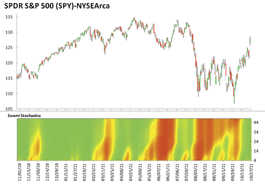
**FIGURE 14.**


---

## BibTeX

```bibtex
@misc{traders_tips_2012_03,
  author       = {{Technical Analysis of STOCKS \& COMMODITIES}},
  title        = {Traders' Tips: Introducing SwamiCharts},
  howpublished = {online},
  year         = {2012},
  month        = mar,
  url          = {https://www.traders.com/Documentation/FEEDbk_docs/2012/03/TradersTips.html}
}
```
