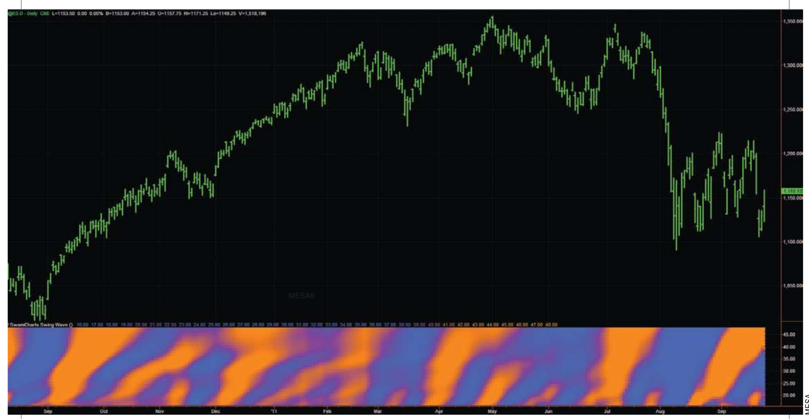
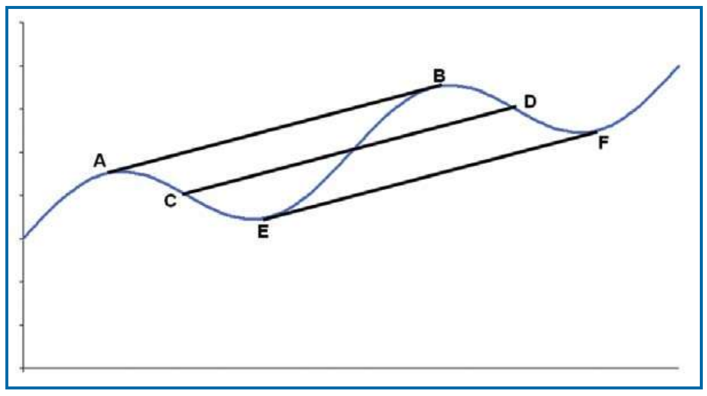
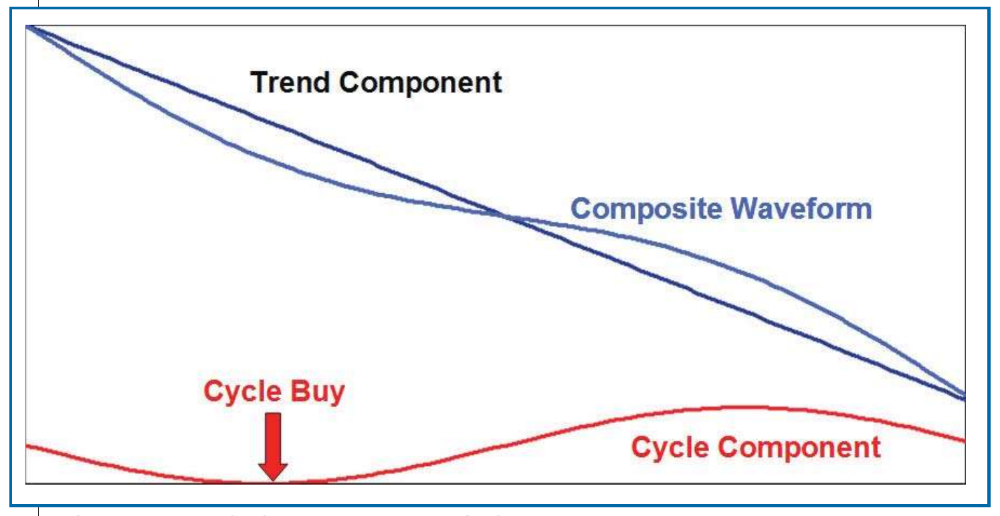
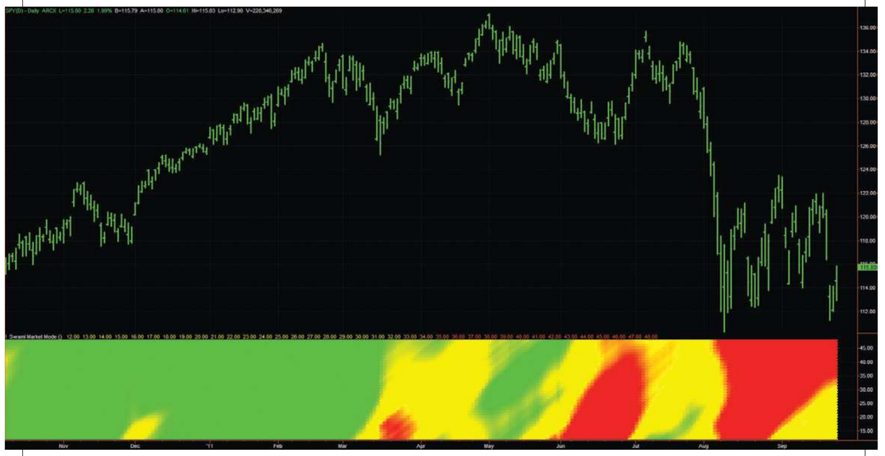

# Setting Strategies With SwamiCharts

- **Author:** John F. Ehlers and Ric Way
- **Publication:** Technical Analysis of STOCKS & COMMODITIES, Volume 30, April 2012, pp. 12--18
- **Article URL:** [Article PDF](https://technical.traders.com/archive/article.asp?file=\V30\C04\278EHLE.pdf)
- **Traders' Tips URL:** [Traders' Tips, April 2012](https://www.traders.com/Documentation/FEEDbk_docs/2012/04/TradersTips.html)

---

Once you have identified a cyclical movement, you may think the most difficult part is over. Unfortunately, not all cycles are tradable. Here's one indicator that can tell you the best time to use a swing wave as an effective trading signal.

---

For the most part, the rendering of technical indicators has not changed since the days of pencil & paper charting. The powers of modern computers have made this unnecessary and allowed for deeper insight into market activity. In our last article, we introduced SwamiCharts as a new and intuitive way to view indicators in context of all lookback periods. SwamiCharts accomplished this by using the vertical scale as the indicator lookback period and painting the indicator value at each lookback period as a color.

In this article, we will show you how to see all the waves in the data, which leads to some startling conclusions. However, the existence of cycles does not necessarily mean they are all tradable; for example, the cyclic swings can be overwhelmed by the slope of a trend. We will show you how to compute this and how to use the result as a decision to follow the trend or to swing trade.

## SwamiCharts Swing Wave

If you know the correct cycle period, the best way to isolate the wave is to use a bandpass filter. We decided to use the EasyLanguage code to compute the bandpass filter in corona charts to measure the dominant cycle and one of the filters in the Swiss army knife indicator. For your convenience, a two-pole bandpass filter EasyLanguage code fragment is shown in the first sidebar, "EasyLanguage Code Fragment To Compute A Bandpass Filter." The bandpass filter code is displayed in the second sidebar, "Bandpass Filter Code In EasyLanguage." In the code, delta = 0.1 means the filter has a +/-10% passband about the tuned cycle period.

In the SwamiCharts swing wave, we use an array of bandpass filters over the full range of cycle periods of interest. The swing wave vertical scale is the cycle period. Cycle valleys are painted blue, while cycle peaks are painted orange. You will find the code for the corona chart swing position in the third sidebar, "Corona Chart Swing Position." The resultant swing wave indicator can be seen in Figure 1.


**FIGURE 1: SWAMICHARTS SWING WAVE DISPLAYS ALL MARKET WAVES.** This gives you an idea of how complex market waves can be, making it difficult to trade with cycles. The monthly waves are at the bottom of the indicator and the quarterly waves are at the top of the indicator.

Figure 1 shows just how complex the market waves can be and how difficult trading with cycles can be. In broad terms, we see that we have monthly waves at the bottom of the indicator and quarterly waves at the top of the indicator. The monthly cycles result from companies having to make their numbers each month and quarterly cycles result from quarterly earnings reports.

The interaction between all the waves is more important to us. For example, there are occasions where the SwamiCharts swing wave is blue from bottom to top, meaning all the waves are aligned at their cyclic valleys. There are also other occasions where the swing wave is orange from bottom to top, meaning all the waves are aligned at their cycle peaks. These alignments lead us to ponder what would happen if we were to add the fundamental, second harmonic, and third harmonic together. We have not yet had the opportunity to explore this possibility, but it certainly could have the potential to identify major tops and bottoms.

Although swing wave shows all the market waves, it does not address the amplitude of the cyclic swings. Certainly not all the waves are tradable; for example, the cycles are swamped by the trend from September 2010 through February 2011. Fortunately, the SwamiCharts market mode indicator works well in letting you know when to trade the trend and when to swing trade.

Before we discuss that indicator, let us examine trends in the context of cycles.

## Computing The Trend

A simplified model of a segment of market activity is a straight-line trend with a relatively short-term cycle superimposed on it. When we measure the slope of the trend, we get an accurate measurement only if we use one cycle period, or multiple cycle periods, as the length of measurement. This is true regardless of whether you use a moving average, a simple momentum, or linear regression for the computation. Figure 2 shows that you get the correct solution for the slope using the correct computation length regardless of whether the measurement is made peak to peak, midpoint to midpoint, or valley to valley.

On the other hand, an exaggerated estimate of the slope is made if the selected half cycle length is from E to B in Figure 2. Similarly, an incorrect estimate of the slope is made with the same half cycle length (but later in time) from B to F.


**FIGURE 2: COMPUTING THE TREND.** A correct slope estimate is made only when the computation duration is a multiple of the cycle period.

## When To Hold 'Em

The slope of the trend compared to the peak-to-peak swing of the cycle is an important ratio in trading, as demonstrated in Figure 3. The composite waveform in blue is composed of the trend component shown in black and the cycle component shown in red. In this case, the downtrend slope is much larger than the peak-to-peak swing of the cycle. Even though a clear buy signal occurs at the valley of the cycle component, as can happen when the cycle is isolated using an oscillator, it would be folly to act on that signal because the slope of the trend swamps the cycle activity.

When the uptrend slope over one cycle period exceeds the peak-to-peak cycle amplitude, it is best to hold a long position throughout the trend. Similarly, when the downtrend slope over one cycle period exceeds the peak-to-peak cycle amplitude, it is best to hold a short position (or be flat) throughout the trend. Only when the peak-to-peak cycle amplitude exceeds the value of the trend slope is it advisable to swing trade.


**FIGURE 3: WHEN TO HOLD 'EM AND WHEN TO FOLD 'EM.** The slope of the trend compared to the peak-to-peak swing of the cycle is an important ratio. The downtrend slope is much larger than the peak-to-peak swing of the cycle. Even though there is a clear buy signal, swing trading the cycle is not a good idea when the trend slope overwhelms the peak-to-peak amplitude of the cycle.

## Market Mode Indicator

I discussed the market mode indicator in my S&C March 2010 article "Empirical Mode Decomposition." The EasyLanguage code for this indicator can be found in the fourth sidebar, "EasyLanguage Code For Market Mode Indicator." The SwamiCharts market mode indicator measures the trend slope as well as the peak-to-peak cycle amplitude over the full range of cycle periods of interest. The vertical scale of the indicator is the cycle period for which the computation is made and the value of the ratio of the trend slope to the cycle amplitude is rendered as a color. If the ratio is greater than +1 the color is green, signifying a trend up. If the ratio is less than -1, the color is red, signifying a trend down. If the ratio falls between -1 and +1, this is a condition for swing trading and is shown in yellow. Figure 4 shows the market mode indicator.


**FIGURE 4: SWAMICHARTS MARKET MODE INDICATOR.** SwamiCharts market mode shows when to trade uptrends, downtrends, as well as swing trade.

The market mode indicator makes it clear that it is not advisable to stand in the way when a market trend is established. Many years ago, J.M. Hurst estimated that cyclic swings were useful for trading only about 15% of the time. The overview afforded by the modern technology of the market mode indicator, such as in Figure 4, proves that Hurst was substantially correct.

## Conclusion

Unfettered by the concepts developed in the dark ages of technical analysis, SwamiCharts multiplies the technology of modern computers to render indicators that are much richer in information. The additional information available at a glance gives every trader greater insight into market activity.

In this article, we described two SwamiChart indicators that display the complexity of market activity in such a way that actionable trading strategies result. The swing wave indicator shows the interaction of all the market waves. All these waves are not necessarily tradable, and the market mode indicator shows the best times to use these swing waves as trading signals.

TradeStation and NinjaTrader source code for SwamiCharts renditions of several classic technical indicators (Aroon, commodity channel index [CCI], RSI, and stochastics) may be downloaded for free at SwamiCharts.com. In addition, SwamiCharts indicators will be available on the ThinkOrSwim platform.

## EasyLanguage Code Fragment To Compute A Bandpass Filter

```easylanguage
delta = 0.1;

beta = Cosine(360 / Period);

gamma = 1 / Cosine(720*delta / Period);

alpha = gamma - SquareRoot(gamma*gamma - 1);

BP = .5*(1 - alpha)*(Price - Price[2])
     + beta*(1 + alpha)*BP[1] - alpha*BP[2];
```

## Bandpass Filter Code In EasyLanguage

```easylanguage
Inputs:
  Price((H+L)/2),
  Period(20),
  delta(.1);

Vars:
  gamma(0),
  alpha(0),
  beta(0),
  BP(0);

beta = Cosine(360 / Period);

gamma = 1 / Cosine(720*delta / Period);

alpha = gamma - SquareRoot(gamma*gamma - 1);

BP = .5*(1 - alpha)*(Price - Price[2]) +
     beta*(1 + alpha)*BP[1] - alpha*BP[2];

Plot1(BP);
Plot2(0);
```

(From "Empirical Mode Decomposition," March 2010 STOCKS & COMMODITIES)

## EasyLanguage Code For Market Mode Indicator

```easylanguage
Inputs:
  Price((H+L)/2),
  Period(20),
  delta(.5),
  Fraction(.1);

Vars:
  alpha(0),
  beta(0),
  gamma(0),
  BP(0),
  Mean(0),
  Peak(0),
  Valley(0),
  AvgPeak(0),
  AvgValley(0);

beta = Cosine(360 / Period);

gamma = 1 / Cosine(720*delta / Period);

alpha = gamma - SquareRoot(gamma*gamma - 1);

BP = .5*(1 - alpha)*(Price - Price[2]) + beta*(1 + alpha)*BP[1] - alpha*BP[2];

Mean = Average(BP, 2*Period);

Peak = Peak[1];
Valley = Valley[1];
If BP[1] > BP and BP[1] > BP[2] Then Peak = BP[1];
If BP[1] < BP and BP[1] < BP[2] Then Valley = BP[1];

AvgPeak = Average(Peak, 50);
AvgValley = Average(Valley, 50);

Plot1(Mean);
Plot2(Fraction*AvgPeak);
Plot6(Fraction*AvgValley);
```

(From "Empirical Mode Decomposition," S&C March 2010)

## About The Authors

S&C Contributing Editor John Ehlers is a pioneer in the use of cycles and DSP techniques in technical analysis. He is the author of the MESA9 program, is the chief scientist for stockspotter.com, and is the inventor of SwamiCharts. Ric Way is an independent software developer specializing in programming algorithmic trading systems in C#. He may be reached at ricway@taosgroup.org.

## Suggested Reading

- Ehlers, John F., and Ric Way [2012]. "Introducing SwamiCharts," Technical Analysis of STOCKS & COMMODITIES, Volume 30: March.
- [2010]. "Empirical Mode Decomposition," Technical Analysis of STOCKS & COMMODITIES, Volume 28: March.
- [2008]. "Corona Charts," Technical Analysis of STOCKS & COMMODITIES, Volume 26: November.
- Ehlers, John [2005]. "Swiss Army Knife Indicator," Technical Analysis of STOCKS & COMMODITIES, Volume 23: January.

---

See our Traders' Tips section beginning on page 66 for commentary and implementation of John Ehlers' and Ric Way's technique in various technical analysis programs.

---

## BibTeX

```bibtex
@article{ehlers_way_2012_setting_strategies,
  author    = {Ehlers, John F. and Way, Ric},
  title     = {Setting Strategies With SwamiCharts},
  journal   = {Technical Analysis of STOCKS \& COMMODITIES},
  volume    = {30},
  number    = {4},
  pages     = {12--18},
  year      = {2012},
  month     = apr,
  url       = {https://technical.traders.com/archive/article.asp?file=\V30\C04\278EHLE.pdf}
}

@misc{traders_tips_2012_04,
  author       = {{Technical Analysis of STOCKS \& COMMODITIES}},
  title        = {Traders' Tips: Setting Strategies With SwamiCharts},
  howpublished = {online},
  year         = {2012},
  month        = apr,
  url          = {https://www.traders.com/Documentation/FEEDbk_docs/2012/04/TradersTips.html}
}
```
