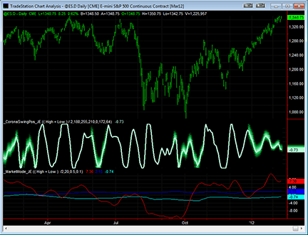
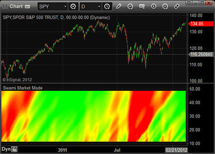
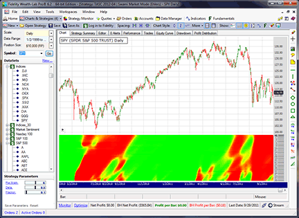
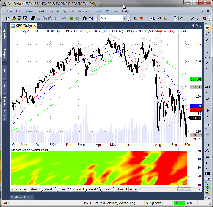
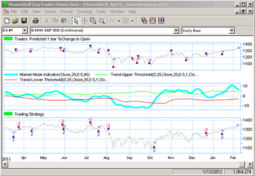
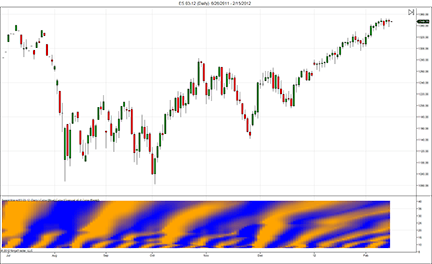
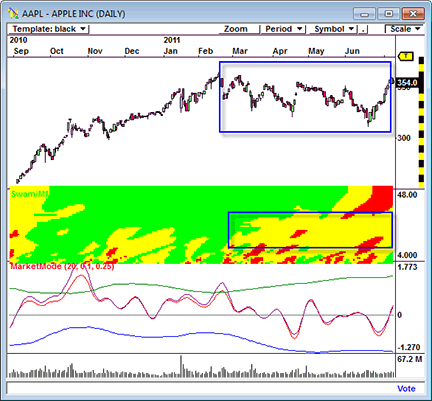
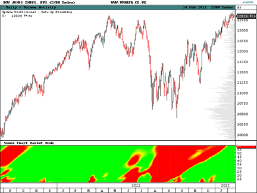
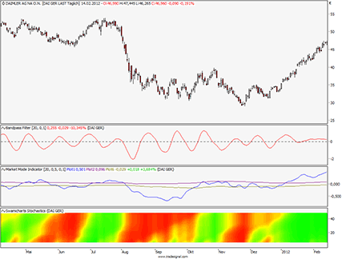

# Traders' Tips: April 2012

- **Article:** Setting Strategies With SwamiCharts by John F. Ehlers and Ric Way
- **Traders' Tips URL:** [Traders' Tips, April 2012](https://www.traders.com/Documentation/FEEDbk_docs/2012/04/TradersTips.html)

---


## TRADESTATION: April 2012

In �Setting Strategies With SwamiCharts� in this issue, authors John Ehlers & Ric Way describe the use of SwamiCharts to examine market structure and analyze market waves and market trend. (The indicators are available at their website,www.swamicharts.com.) Presented here are three indicators corresponding to the ones introduced in their article.

To download the EasyLanguage code for the indicators, first navigate to the EasyLanguage FAQs and Reference Posts Topic in the EasyLanguage support forum (https://www.tradestation.com/Discussions/Topic.aspx?Topic_ID=47452), scroll down, and click on the link labeled �Traders� Tips, TASC.� Then select the appropriate link for the month and year. The ELD filename is �_SwamiCharts_Apr2012.eld.�

The code is also shown below.

A sample chart implementing the SwamiCharts indicators is shown in Figure 1.

FIGURE 1: TRADESTATION, SWAMICHARTS INDICATORS. A daily bar chart of @ES.D along with the _CoronaSwingPos_JE and _MarketMode_JE indicators is shown here.

This article is for informational purposes. No type of trading or investment recommendation, advice, or strategy is being made, given, or in any manner provided by TradeStation Securities or its affiliates.

�Chris ImhofTradeStation Securities, Inc.A subsidiary of TradeStation Group, Inc.www.TradeStation.com

BACK TO LIST



**FIGURE 1.**


```easylanguage
_BandPassFilter_JE (Indicator)

{ TASC, April, 2012 }
{ John Ehlers, Ric Way }
{ Band Pass Filter }
	
inputs:
	Price(( High + Low ) / 2 ),
	Period( 20 ),
	BPDdelta( 0.1 ) ;

variables:
	BPGamma( 0 ),
	BPAlpha( 0 ),
	BPBeta( 0 ),
	BP( 0 ) ;

BPBeta = Cosine( 360 / Period ) ;

BPGamma = 1 / Cosine( 720 * BPDdelta / Period ) ;
BPAlpha = BPGamma - 
 SquareRoot( BPGamma * BPGamma - 1 ) ;

BP = 0.5 * ( 1 - BPAlpha ) * ( Price - Price[2] ) +
 BPBeta * ( 1 + BPAlpha ) * BP[1] - BPAlpha * BP[2] ;

Plot1( BP ) ;
Plot2( 0 ) ;

{ From "Empirical Mode Decomposition,"
March 2010 Stocks & Commodities }


_CoronaSwingPos_JE (Indicator)

{ TASC, April, 2012 }
{ John Ehlers, Ric Way }

{
Corona Chart Swing Position written by 
John F. Ehlers copyright (c) 2008

The swing position indicator shows the phasing of 
the data within the dominant cycle. A value of -5
means the cycle is at its valley, while a value of
+5 means the cycle is at its peak.  In a pure cycle,
the swing position will trace out the shape of
a sine wave.
}

inputs:
	Price( ( High + Low ) / 2 ),
	LineR( 180 ),
	LineG( 255 ),
	LineB( 210 ),
	FuzzR( 0 ),
	FuzzG( 172 ),
	FuzzB( 64 ) ;

variables:
	BPDelta( 0.1 ),
	BPGamma( 0 ),
	alpha( 0 ),
	BPBeta( 0 ),
	N( 0 ),
	Period( 0 ),
	MaxAmpl( 0 ),
	Num( 0 ),
	Denom( 0 ),
	DC( 0 ),
	DomCyc( 0 ),
	Color1( 0 ),
	Color2( 0 ),
	Color3( 0 ),
	alpha1( 0 ),
	HP( 0 ),
	SmoothHP( 0 ),
	gamma2( 0 ),
	alpha2( 0 ),
	beta2( 0 ),
	delta2( 0.1 ),
	BP2( 0 ),
	Q2( 0 ),
	Lead60( 0 ),
	HL( 0 ),
	LL( 0 ),
	count( 0 ),
	Psn( 0 ),
	Width( 0 ) ;

arrays:
	IArray[60]( 0 ),
	OldI[60]( 0 ),
	OlderI[60]( 0 ),
	Q[60]( 0 ),
	OldQ[60]( 0 ),
	OlderQ[60]( 0 ),
	Real[60]( 0 ),
	OldReal[60]( 0 ),
	OlderReal[60]( 0 ),
	Imag[60]( 0 ),
	OldImag[60]( 0 ),
	OlderImag[60]( 0 ),
	Ampl[60]( 0 ),
	OldAmpl[60]( 0 ),
	DB[60]( 0 ),
	OldDB[60]( 0 ),
	Raster[50]( 0 ),
	OldRaster[50]( 0 ) ;

alpha1 = ( 1 - Sine( 360 / 30 ) ) / Cosine( 360 / 30 );
HP = 0.5 * ( 1 + alpha1 ) * ( Price - Price[1] ) + 
	alpha1 * HP[1] ;
SmoothHP = ( HP + 2 * HP[1] + 3 * HP[2] + 3 * HP[3] + 
	2 * HP[4] +
 HP[5] ) / 12 ;

if CurrentBar < 7 then 
 	SmoothHP = Price - Price[1] ;

if CurrentBar = 1 then
	SmoothHP = 0 ;

BPDelta = -0.015 * CurrentBar + 0.5 ;

if BPDelta < 0.1 then 
	BPDelta = 0.1 ;

if CurrentBar > 12 then
	begin
	for N = 12 to 60 
		begin
		BPBeta = Cosine( 720 / N ) ;
		BPGamma = 1 / Cosine( 1440 * BPDelta / N ) ;
		alpha = BPGamma - 
			SquareRoot( BPGamma * BPGamma - 1 ) ;
		Q[N] = ( 0.5 * N / 6.28318 ) * 
			( SmoothHP - SmoothHP[1] ) ;
		IArray[N] = SmoothHP ;
		Real[N] = 0.5 * ( 1 - alpha ) * ( IArray[N] 
			- OlderI[N] ) + BPBeta * ( 1 +
		 alpha ) * OldReal[N] - alpha * OlderReal[N] ;
		Imag[N] = 0.5 * ( 1 - alpha ) * ( Q[N] - 
			OlderQ[N] ) + BPBeta * ( 1 +
		 alpha )* OldImag[N] - alpha * OlderImag[N] ;
		Ampl[N] = ( Real[N] * Real[N] + 
			Imag[N] * Imag[N] ) ;
		end ;
	end ;

for N = 12 to 60 
	begin
	OlderI[N] = OldI[N] ;
	OldI[N] = IArray[N] ;
	OlderQ[N] = OldQ[N] ;
	OldQ[N] = Q[N] ;
	OlderReal[N] = OldReal[N] ;
	OldReal[N] = Real[N] ;
	OlderImag[N] = OldImag[N] ;
	OldImag[N] = Imag[N] ;
	OldAmpl[N] = Ampl[N] ;
	OldDB[N] = DB[N] ;
	end;

for N = 1 to 50 
	begin
	OldRaster[N] = Raster[N] ;
	end ;

MaxAmpl = Ampl[12] ;

for N = 12 to 60 
	begin
	if Ampl[N] > MaxAmpl then 
		MaxAmpl = Ampl[N] ;
	end;

for N = 12 to 60 
	begin
	if MaxAmpl <> 0 and (Ampl[N] / MaxAmpl) > 0 then 
		DB[N] = -10 * Log( 0.01 / ( 1 - 0.99 * 
		 Ampl[N] / MaxAmpl ) ) / Log( 10 ) ;
	DB[N] = 0.33 * DB[N] + 0.67 * OldDB[N] ;
	if DB[N] > 20 then 
		DB[N] = 20 ;
	end ;

Num = 0 ;
Denom = 0 ;

for N = 12 to 60 
	begin
	if DB[N] <= 6 then 
		begin
		Num = Num + N * ( 20 - DB[N] ) ;
		Denom = Denom + ( 20 - DB[N] ) ;
		end ;
	if Denom <> 0 then 
		DC = 0.5 * Num / Denom ;
	end ;

DomCyc = Median( DC, 5 ) ;

if DomCyc < 6 then 
	DomCyc = 6 ;
beta2 = Cosine( 360 / DomCyc ) ;
gamma2 = 1 / Cosine( 720 * delta2 / DomCyc ) ;
alpha2 = gamma2 - SquareRoot( gamma2 * gamma2 - 1 ) ;
BP2 = 0.5 * ( 1 - alpha2 ) * ( Price - Price[2] ) + 
	beta2 * ( 1 + alpha2 ) * BP2[1] - alpha2 * BP2[2] ;
Q2 = ( DomCyc / 6.28318 ) * ( BP2 - BP2[1] ) ;
Lead60 = 0.5 * BP2 + 0.866 * Q2 ;
HL = Lead60 ;
LL = Lead60 ;

for count = 0 to 50 
	begin
	if Lead60[count] > HL then 
		HL = Lead60[count] ;
	if Lead60[count] < LL then 
		LL = Lead60[count] ;
	end ;

Psn = ( Lead60 - LL ) / ( Hl - LL ) ;
HL = Psn ;
LL = Psn ;

for count = 0 to 20 
	begin
	if Psn[count] > HL then 
		HL = Psn[count] ;
	if Psn[count] < LL then 
		LL = Psn[count] ;
	end ;

if HL - LL > .85 then 
	Width =  .01 
else 
	Width = 0.15 * ( HL - LL ) ;

for N = 1 to 50 
	begin
	Raster[N] = 20 ;
	if N < Round( 50 * Psn, 0 ) then 
		Raster[N] = 0.5 * ( Power( ( 20 * Psn - 
		 0.4 * N ) / Width, 0.95 ) 
		 + 0.5 * OldRaster[N] ) ;
	if N > Round( 50 * Psn, 0 ) then 
		Raster[N] = 0.5 * ( Power( ( -20 * Psn + 
		0.4 * N ) / Width, 0.95 ) + 
		 0.5 * OldRaster[N] ) ;
	if N = Round( 50 * Psn, 0 ) then 
		Raster[N] = 0.5 * OldRaster[N] ;
	if Raster[N] < 0 then 
		Raster[N] = 0 ;
	if Raster[N] > 20 then 
		Raster[N] = 20 ;
	if HL - LL > 0.8 then 
		Raster[N] = 20 ;
	OldRaster[N] = Raster[N] ;
	end ;

Plot1( 10 * Psn - 5, "S51", RGB( LineR, LineG, 
	LineB ), 0, 2 ) ;

for N = 1 to 50 
	begin
	if Raster[N] <= 10 then 
		begin
		Color1 = LineR + Raster[N]*
			(FuzzR - LineR) / 10 ;
		Color2 = LineG + Raster[N]*
			(FuzzG - LineG) / 10 ;
		Color3 = LineB + Raster[N]*
			(FuzzB - LineB) / 10 ;
		END;
	if Raster[N] > 10 then 
		begin
		Color1 = FuzzR*(2 - Raster[N] / 10);
		Color2 = FuzzG*(2 - Raster[N] / 10);
		Color3 = FuzzB*(2 - Raster[N] / 10);
		END;
	
	if N = 2 then 
		Plot2( 0.2 * N - 5, "S2", RGB( Color1, Color2, 
		Color3 ), 0, 5 ) ;
	if N = 3 then 
		Plot3( 0.2 * N - 5, "S3", RGB( Color1, Color2, 
		Color3 ), 0, 5 ) ;
	if N = 4 then 
		Plot4( 0.2 * N - 5, "S4", RGB( Color1, Color2, 
		Color3 ), 0, 5 ) ;
	if N = 5 then 
		Plot5( 0.2 * N - 5, "S5", RGB( Color1, Color2, 
		Color3 ), 0, 5 ) ;
	if N = 6 then 
		Plot6( 0.2 * N - 5, "S6", RGB( Color1, Color2, 
		Color3 ), 0, 5 ) ;
	if N = 7 then 
		Plot7( 0.2 * N - 5, "S7", RGB( Color1, Color2, 
		Color3 ), 0, 5 ) ;
	if N = 8 then 
		Plot8( 0.2 * N - 5, "S8", RGB( Color1, Color2, 
		Color3 ), 0, 5 ) ;
	if N = 9 then 
		Plot9( 0.2 * N - 5, "S9", RGB( Color1, Color2, 
		Color3 ), 0, 5 ) ;
	if N = 10 then 
		Plot10( 0.2 * N - 5, "S10", 
		RGB( Color1, Color2, Color3 ), 0, 5 ) ;
	if N = 11 then 
		Plot11( 0.2 * N - 5, "S11", 
		RGB( Color1, Color2, Color3 ), 0, 5 ) ;
	if N = 12 then 
		Plot12( 0.2 * N - 5, "S12", 
		RGB( Color1, Color2, Color3 ), 0, 5 ) ;
	if N = 13 then 
		Plot13( 0.2 * N - 5, "S13", 
		RGB( Color1, Color2, Color3 ), 0, 5 ) ;
	if N = 14 then 
		Plot14( 0.2 * N - 5, "S14", 
		RGB( Color1, Color2, Color3 ), 0, 5 ) ;
	if N = 15 then 
		Plot15( 0.2 * N - 5, "S15", 
		RGB( Color1, Color2, Color3 ), 0, 5 ) ;
	if N = 16 then 
		Plot16( 0.2 * N - 5, "S16", 
		RGB( Color1, Color2, Color3 ), 0, 5 ) ;
	if N = 17 then 
		Plot17( 0.2 * N - 5, "S17", 
		RGB( Color1, Color2, Color3 ), 0, 5 ) ;
	if N = 18 then 
		Plot18( 0.2 * N - 5, "S18", 
		RGB( Color1, Color2, Color3 ), 0, 5 ) ;
	if N = 19 then 
		Plot19( 0.2 * N - 5, "S19", 
		RGB( Color1, Color2, Color3 ), 0, 5 ) ;
	if N = 20 then 
		Plot20( 0.2 * N - 5, "S20", 
		RGB( Color1, Color2, Color3 ), 0, 5 ) ;
	if N = 21 then 
		Plot21( 0.2 * N - 5, "S21", 
		RGB( Color1, Color2, Color3 ), 0, 5 ) ;
	if N = 22 then 
		Plot22( 0.2 * N - 5, "S22", 
		RGB( Color1, Color2, Color3 ), 0, 5 ) ;
	if N = 23 then 
		Plot23( 0.2 * N - 5, "S23", 
		RGB( Color1, Color2, Color3 ), 0, 5 ) ;
	if N = 24 then 
		Plot24( 0.2 * N - 5, "S24", 
		RGB( Color1, Color2, Color3 ), 0, 5 ) ;
	if N = 25 then 
		Plot25( 0.2 * N - 5, "S25", 
		RGB( Color1, Color2, Color3 ), 0, 5 ) ;
	if N = 26 then 
		Plot26( 0.2 * N - 5, "S26", 
		RGB( Color1, Color2, Color3 ), 0, 5 ) ;
	if N = 27 then 
		Plot27( 0.2 * N - 5, "S27", 
		RGB( Color1, Color2, Color3 ), 0, 5 ) ;
	if N = 28 then 
		Plot28( 0.2 * N - 5, "S28", 
		RGB( Color1, Color2, Color3 ), 0, 5 ) ;
	if N = 29 then 
		Plot29( 0.2 * N - 5, "S29", 
		RGB( Color1, Color2, Color3 ), 0, 5 ) ;
	if N = 30 then 
		Plot30( 0.2 * N - 5, "S30", 
		RGB( Color1, Color2, Color3 ), 0, 5 ) ;
	If N = 31 then 
		Plot31( 0.2 * N - 5, "S31", 
		RGB( Color1, Color2, Color3 ), 0, 5 ) ;
	If N = 32 then 
		Plot32( 0.2 * N - 5, "S32", 
		RGB( Color1, Color2, Color3 ), 0, 5 ) ;
	if N = 33 then 
		Plot33( 0.2 * N - 5, "S33", 
		RGB( Color1, Color2, Color3 ), 0, 5 ) ;
	if N = 34 then 
		Plot34( 0.2 * N - 5, "S34", 
		RGB( Color1, Color2, Color3 ), 0, 5 ) ;
	if N = 35 then 
		Plot35( 0.2 * N - 5, "S35", 
		RGB( Color1, Color2, Color3 ), 0, 5 ) ;
	if N = 36 then 
		Plot36( 0.2 * N - 5, "S36", 
		RGB( Color1, Color2, Color3 ), 0, 5 ) ;
	if N = 37 then 
		Plot37( 0.2 * N - 5, "S37", 
		RGB( Color1, Color2, Color3 ), 0, 5 ) ;
	if N = 38 then 
		Plot38( 0.2 * N - 5, "S38", 
		RGB( Color1, Color2, Color3 ), 0, 5 ) ;
	if N = 39 then 
		Plot39( 0.2 * N - 5, "S39", 
		RGB( Color1, Color2, Color3 ), 0, 5 ) ;
	if N = 40 then 
		Plot40( 0.2 * N - 5, "S40", 
		RGB( Color1, Color2, Color3 ), 0, 5 ) ;
	if N = 41 then 
		Plot41( 0.2 * N - 5, "S41", 
		RGB( Color1, Color2, Color3 ), 0, 5 ) ;
	if N = 42 then 
		Plot42( 0.2 * N - 5, "S42", 
		RGB( Color1, Color2, Color3 ), 0, 5 ) ;
	if N = 43 then 
		Plot43( 0.2 * N - 5, "S43", 
		RGB( Color1, Color2, Color3 ), 0, 5 ) ;
	if N = 44 then 
		Plot44( 0.2 * N - 5, "S44", 
		RGB( Color1, Color2, Color3 ), 0, 5 ) ;
	if N = 45 then 
		Plot45( 0.2 * N - 5, "S45", 
		RGB( Color1, Color2, Color3 ), 0, 5 ) ;
	if N = 46 then 
		Plot46( 0.2 * N - 5, "S46", 
		RGB( Color1, Color2, Color3 ), 0, 5 ) ;
	if N = 47 then 
		Plot47( 0.2 * N - 5, "S47", 
		RGB( Color1, Color2, Color3 ), 0, 5 ) ;
	if N = 48 then 
		Plot48( 0.2 * N - 5, "S48", 
		RGB( Color1, Color2, Color3 ), 0, 5 ) ;
	if N = 49 then 
		Plot49( 0.2 * N - 5, "S49", 
		RGB( Color1, Color2, Color3 ), 0, 5 ) ;
	if N = 50 then 
		Plot50( 0.2 * N - 5, "S50", 
		RGB( Color1, Color2, Color3 ), 0, 5 ) ;
	end ;


_MarketMode_JE (Indicator)

{ TASC, April, 2012 }
{ John Ehlers, Ric Way }

inputs:
	Price( ( High + Low )  /2 ),
	Period( 20 ),
	BPDelta( 0.5 ),
	Fraction( 0.1 ) ;

variables:
	BPAlpha( 0 ),
	BPBeta( 0 ),
	BPGamma( 0 ),
	BP( 0 ),
	MeanCalc( 0 ),
	Peak( 0 ),
	Valley( 0 ),
	AvgPeak( 0 ),
	AvgValley( 0 ) ; 

BPBeta = Cosine( 360 / Period ) ;
BPGamma = 1 / Cosine( 720 * BPDelta / Period ) ;

BPAlpha = BPGamma - 
 SquareRoot( BPGamma * BPGamma - 1 ) ;

BP = 0.5 * ( 1 - BPAlpha ) * ( Price - Price[2] )
 + BPBeta * ( 1 + BPAlpha ) * BP[1] - BPAlpha * BP[2] ;

MeanCalc = Average( BP, 2 * Period ) ;
Peak = Peak[1] ;
Valley = Valley[1] ;

if BP[1] > BP and BP[1] > BP[2] then
	Peak = BP[1] ;
if BP[1] < BP and BP[1] < BP[2] then
	Valley = BP[1] ;

AvgPeak = Average( Peak, 50 ) ;
AvgValley = Average( Valley, 50 ) ;

Plot1( MeanCalc, "Mean" ) ;
Plot2( Fraction * AvgPeak, "Peak" ) ;
Plot6( Fraction * AvgValley, "Valley" ) ;

{ From "Empirical Mode Decomposition" S&C March }

```


## eSIGNAL: April 2012

For this month�s Traders� Tip, we�ve provided the formulas,Corona_Chart_Swing_Position.efs,Market_Mode_Indicator.efs, andSwamiCharts_Market_Mode.efsbased on the formula code from John Ehlers & Ric Way�s article in this issue, �Setting Strategies With SwamiCharts.�

The SwamiCharts_Market_Mode.efs study contains formula parameters to set the values for the fastest period, lowest period, delta, fraction, price, and line thickness, which may be configured through the Edit Chart window (right-click on the chart and select Edit Chart). The Market_Mode_Indicator.efs study contains formula parameters to set the values for length, delta, fraction and price. The SwamiCharts_Market_Mode.efs study contains one formula parameter to toggle the View Line.

To discuss this study or download complete copies of the formula code, please visit the EFS Library Discussion Board forum under the Forums link from the support menu atwww.esignal.comor visit our EFS KnowledgeBase athttps://www.esignal.com/support/kb/efs/. The eSignal formula scripts (EFS) are also available for copying and pasting below.

A sample chart is shown in Figure 2.

FIGURE 2: eSIGNAL, SWAMICHARTS INDICATORS

�Jason KeckeSignal, an Interactive Data company800 779-6555,www.eSignal.com

BACK TO LIST



**FIGURE 2.**


```
Corona_Chart_Swing_Position.efs

/*********************************
Provided By:  
    eSignal (Copyright c eSignal), a division of Interactive Data 
    Corporation. 2012. All rights reserved. This sample eSignal 
    Formula Script (EFS) is for educational purposes only and may be 
    modified and saved under a new file name.  eSignal is not responsible
    for the functionality once modified.  eSignal reserves the right 
    to modify and overwrite this EFS file with each new release.
   

Description:        
    Setting Strategies With SwamiCharts

Version:            1.00  13/02/2012

Notes:
    The swing position indicator shows the phasing of
    the data within the dominant cycle. A value of -5 means the
    cycle is at its valley. A value of +5 means the cycle is at its
    peak. In a pure cycle the Swing Position will trace out the
    shape of a sine wave.
    The related article is copyrighted material. If you are not
    a subscriber of Stocks & Commodities, please visit www.traders.com.

Formula Parameters:                     Default:
    View Line                           True
**********************************/

var fpArray = new Array();
var bInit = false;
var bVersion = null;

function preMain() {

    setPriceStudy(false);
    setShowCursorLabel(false);
    setShowTitleParameters( false );
    setStudyTitle("Corona Chart Swing Position");
    setDefaultBarThickness(3, 50);

    var x=0;

    fpArray[x] = new FunctionParameter("ViewLine", FunctionParameter.BOOLEAN);
    with(fpArray[x++]){
        setName("View Line");
        setDefault(true);
    }    

}

var	nLineR = 180;
var	nLineG = 255;
var	nLineB = 210;
var	nFuzzR = 0;
var	nFuzzG = 172;
var	nFuzzB = 64;
var xPrice = null;

var nRef_Global = 0;
var	ndelta = 0.1;
var	ngamma = 0;
var	nalpha = 0;
var	nbeta = 0;
var	nN = 0;
var	nPeriod = 0;
var	nMaxAmpl = 0;
var	nNum = 0;
var	nDenom = 0;
var	nDC = 0;
var	nDomCyc = 0;
var	nColor1 = 0;
var	nColor2 = 0;
var	nColor3 = 0;
var	nalpha1 = 0;
var	xHP = null;
var	nSmoothHP = 0;
var	nSmoothHP1 = 0;
var ngamma2 = 0;
var	nalpha2 = 0;
var	nbeta2 = 0;
var	ndelta2 = 0.1;
var	nBP2 = 0;
var	nBP2_1 = 0;
var	nBP2_2 = 0;
var	nQ2 = 0;
var	nHL = 0;
var	nLL = 0;
var	ncount = 0;
var	nWidth = 0;
var nCalc_HP_Ref = 0;


var xResultArray = new Array(51);

var	aI = new Array(61);
var	aOldI = new Array(61);
var	aOlderI = new Array(61);
var	aQ = new Array(61);
var	aOldQ = new Array(61);
var	aOlderQ = new Array(61);
var	aReal = new Array(61);
var	aOldReal = new Array(61);
var	aOlderReal = new Array(61);
var	aImag = new Array(61);
var	aOldImag = new Array(61);
var	aOlderImag = new Array(61);
var	aAmpl = new Array(61);
var	aOldAmpl = new Array(61);
var	aDB = new Array(61);
var	aOldDB = new Array(61);
var aDC = new Array(61);
var	aPsn = new Array(61);

var	aRaster = new Array(51);
var	aOldRaster = new Array(51);
var	aLead60 = new Array(51);


function main(ViewLine) {
    var nResCounter = 0;
    var nState = getBarState();
    var pi = 3.1415926;
    var nCounter = 0;

    if (bVersion == null) bVersion = verify();
    if (bVersion == false) return;   


    if (nState == BARSTATE_ALLBARS) {
        resetVars();
    }
    
	nalpha1 = (1 - (Math.sin(pi * (360 / 30) / 180)) / (Math.cos(pi * (360 / 30) / 180)));

     
    if ( bInit == false ) {
        bShowDC  = ViewLine;
        xPrice = hl2();
        xHP = efsInternal("Calc_HP", xPrice, nalpha1);
        bInit = true; 
        drawTextPixel( 10, 10,"J Corona Chart Swing Position", Color.black,  null, Text.RELATIVETOLEFT | Text.RELATIVETOTOP, "Name" ,10, -10 );             
    } 
    
    if (getCurrentBarCount() < 5) return;


    if (nState == BARSTATE_NEWBAR) {
        nSmoothHP1 = nSmoothHP;
        
        aDC.pop();
        aDC.unshift(nDC);

        aLead60.pop();
        aLead60.unshift(0.5 * nBP2 + 0.866 * nQ2);

        aPsn.pop();
        aPsn.unshift((aLead60[0] - nLL) / (nHL - nLL));

        nBP2_2 = nBP2_1;
        nBP2_1 = nBP2;
        
        for (nN = 12; nN <= 60; nN++) {
            aOlderI[nN] = aOldI[nN];
            aOldI[nN] = aI[nN];
            aOlderQ[nN] = aOldQ[nN];
            aOldQ[nN] = aQ[nN];
            aOlderReal[nN] = aOldReal[nN];
            aOldReal[nN] = aReal[nN];
            aOlderImag[nN] = aOldImag[nN];
            aOldImag[nN] = aImag[nN];
            aOldAmpl[nN] = aAmpl[nN];
            aOldDB[nN] = aDB[nN];
        }
    }    

   	nSmoothHP = 0 
    if (xPrice.getValue(-1) != null) nSmoothHP = xPrice.getValue(0) - xPrice.getValue(-1);
    
    if (xHP.getValue(-5) != null) {
        nSmoothHP = (xHP.getValue(0) + 2 * xHP.getValue(-1) + 3 * xHP.getValue(-2) + 3 * xHP.getValue(-3) + 2 * xHP.getValue(-4) + xHP.getValue(-5)) / 12;
    }


	ndelta = (-0.015) * getCurrentBarCount() + 0.5;
	if (ndelta < 0.1) ndelta = 0.1;


	if (getCurrentBarCount() > 12) {
		for (nN = 12; nN <= 60; nN++) {
			nbeta = Math.cos(pi * (720 / nN) / 180);
			ngamma = 1 / Math.cos(pi * (1440 * ndelta / nN) / 180);
			nalpha = ngamma -  Math.sqrt(ngamma * ngamma - 1);
			aQ[nN] = (0.5 * nN / 6.28318) * (nSmoothHP - nSmoothHP1);
			aI[nN] = nSmoothHP;
			aReal[nN] = 0.5 * (1 - nalpha) * (aI[nN] - aOlderI[nN]) + nbeta * (1 + nalpha) * aOldReal[nN] -	nalpha * aOlderReal[nN];
			aImag[nN] = 0.5 * (1 - nalpha) * (aQ[nN] - aOlderQ[nN]) + nbeta * (1 + nalpha) * aOldImag[nN] -	nalpha * aOlderImag[nN];
			aAmpl[nN] = (aReal[nN] * aReal[nN] + aImag[nN] * aImag[nN]);
		}
	}


	nMaxAmpl = aAmpl[12];
	for (nN = 12; nN <= 60; nN++) {
        if (aAmpl[nN] > nMaxAmpl) nMaxAmpl = aAmpl[nN];
	}

     
	for (nN = 12; nN <= 60; nN++) {
		if (nMaxAmpl != 0 && (aAmpl[nN] / nMaxAmpl) > 0) 
		    aDB[nN] = (-10) * Math.log(0.01 / (1 - 0.99 * aAmpl[nN] / nMaxAmpl)) / Math.log(10);
		aDB[nN] = 0.33 * aDB[nN] + 0.67 * aOldDB[nN];
		if (aDB[nN] > 20) aDB[nN] = 20;
	}

	nNum = 0;
	nDenom = 0;
	for (nN = 12; nN <= 60; nN++) {
		if (aDB[nN] <= 6) {
			nNum = nNum + nN * (20 - aDB[nN]);
			nDenom = nDenom + (20 - aDB[nN]);
		}
		if (nDenom != 0) {
            nDC = 0.5 * nNum / nDenom;
            aDC[0] = nDC;
        }
	}


	nDomCyc = Median(aDC, 5);
	if (nDomCyc < 6) nDomCyc = 6;


	nbeta2 = Math.cos(pi * (360 / nDomCyc) / 180);
	ngamma2 = 1 / Math.cos(pi * (720 * ndelta2 / nDomCyc) / 180);
	nalpha2 = ngamma2 - Math.sqrt(ngamma2 * ngamma2 - 1);

	nBP2 = 0.5 * (1 - nalpha2) * (xPrice.getValue(0) - xPrice.getValue(-1)) + nbeta2 * (1 + nalpha2) * nBP2_1 - nalpha2 * nBP2_2;

    nQ2 = (nDomCyc / 6.28318)*(nBP2 - nBP2_1);

    aLead60[0] = 0.5 * nBP2 + 0.866 * nQ2;
	nHL = aLead60[0];
	nLL = aLead60[0];

	
    for (ncount = 0; ncount < 51; ncount++) {
		if (aLead60[ncount] > nHL) nHL =aLead60[ncount];
		if (aLead60[ncount] < nLL) nLL = aLead60[ncount];
	}


    aPsn[0] = (aLead60[0] - nLL) / (nHL - nLL);
	nHL = aPsn[0];
	nLL = aPsn[0];
    

	for (ncount = 0; ncount < 21; ncount++) {
		if (aPsn[ncount] > nHL)  nHL = aPsn[ncount];
		if (aPsn[ncount] < nLL)  nLL = aPsn[ncount];
	}


	
	if (nHL - nLL > 0.85) { nWidth = 0.01 } else  { nWidth = 0.15 * (nHL - nLL);}


	for (nN = 1; nN < 51; nN++) {
		aRaster[nN] = 20;
		if (nN < Math.round(50 * aPsn[0]))  aRaster[nN] = 0.5 * (Math.pow(((20 * aPsn[0] - 0.4 * nN) / nWidth), 0.95) + 0.5 * aOldRaster[nN]);
		if (nN > Math.round(50 * aPsn[0]))  aRaster[nN] = 0.5 * (Math.pow((((-20) * aPsn[0] + 0.4 * nN) / nWidth), 0.95) + 0.5 * aOldRaster[nN]);
		if (nN == Math.round(50 * aPsn[0]))  aRaster[nN] = 0.5 * aOldRaster[nN];
		if (aRaster[nN] < 0)  aRaster[nN] = 0;
		if (aRaster[nN] > 20) aRaster[nN] = 20;
		if (nHL - nLL > 0.8) aRaster[nN] = 20;
		aOldRaster[nN] = aRaster[nN];
	}


	for (nN = 1; nN < 51; nN++) {
		if (aRaster[nN] <= 10) {
			nColor1 = Math.round(nLineR + aRaster[nN] * (nFuzzR - nLineR) / 10);
			nColor2 = Math.round(nLineG + aRaster[nN] * (nFuzzG - nLineG) / 10);
			nColor3 = Math.round(nLineB + aRaster[nN] * (nFuzzB - nLineB) / 10);
		}
		
        if (aRaster[nN] > 10) {
			nColor1 = Math.round(nFuzzR * (2 - aRaster[nN] / 10));
			nColor2 = Math.round(nFuzzG * (2 - aRaster[nN] / 10));
			nColor3 = Math.round(nFuzzB * (2 - aRaster[nN] / 10));
		}

        xResultArray[nResCounter++] = 0.2 * nN - 5;
        setBarFgColor(Color.RGB(nColor1, nColor2, nColor3), nResCounter-1);
        setPlotType(PLOTTYPE_LINE, nResCounter-1); 
        setBarThickness(5, nResCounter-1);        
	}


    if (bShowDC == true) {
        xResultArray[nResCounter++] = (10 * aPsn[0] - 5);
        setBarFgColor(Color.RGB(nLineR, nLineG, nLineB), nResCounter-1);
    }    


    return xResultArray; 
}

function resetVars() {
    nRef_Global = 0;
    ndelta = 0.1;
    ngamma = 0;
    nalpha = 0;
    nbeta = 0;
    nN = 0;
    nPeriod = 0;
    nMaxAmpl = 0;
    nNum = 0;
    nDenom = 0;
    nDC = 0;
    nDomCyc = 0;
    nColor1 = 0;
    nColor2 = 0;
    nColor3 = 0;
    nalpha1 = 0;
    
    nSmoothHP = 0;
    nSmoothHP1 = 0;
    ngamma2 = 0;
    nalpha2 = 0;
    nbeta2 = 0;
    ndelta2 = 0.1;
    nBP2 = 0;
    nBP2_1 = 0;
    nBP2_2 = 0;
    nQ2 = 0;
    nHL = 0;
    nLL = 0;
    ncount = 0;
    nWidth = 0;
    nCalc_HP_Ref = 0;


    for (var i = 0; i < 61; i++) {
        if (i < 51) xResultArray[i] = null;
        aI[i] = 0;
        aOldI[i] = 0;
        aOlderI[i] = 0;
        aQ[i] = 0;
        aOldQ[i] = 0;
        aOlderQ[i] = 0;
        aReal[i] = 0;
        aOldReal[i] = 0;
        aOlderReal[i] = 0;
        aImag[i] = 0;
        aOldImag[i] = 0;
        aOlderImag[i] = 0;
        aAmpl[i] = 0;
        aOldAmpl[i] = 0;
        aDB[i] = 0;
        aOldDB[i] = 0;
        aDC[i] = 0;
        aPsn[i] = 0;
    }
    
    for (var i = 0; i < 51; i++) {
        aRaster[i] = 0;
        aOldRaster[i] = 0;
        aLead60[i] = 0;
    }	

    return;
}


// calcHP globals
var nPrevHP = null;
var nCurrHP = null;

function Calc_HP(x, nAlpha1) {
    var nHP = null;
    
    if (getCurrentBarCount() <= 5 ) {
        nCurrHP = x.getValue(0);
        return nCurrHP;
    } else {
        if (x.getValue(-1) == null) return null;
        if (getBarState() == BARSTATE_NEWBAR) nPrevHP = nCurrHP;
        nCurrHP = ( 0.5*(1 + nAlpha1)*(x.getValue(0) - x.getValue(-1)) + nAlpha1*nPrevHP );
        return nCurrHP;
    }

}


function Median(myArray, Length) {
    var aArray = new Array(Length);
    var nMedian = null;

    for (var i = 0; i < Length; i++) {
        aArray[i] = myArray[i];
    }

    aArray = aArray.sort(compareNumbers);
    nMedian = aArray[Math.round((Length-1)/2)];
    return nMedian;
}

function compareNumbers(a, b) {
   return a - b
}

function verify() {
    var b = false;
    if (getBuildNumber() < 779) {
        drawTextAbsolute(5, 35, "This study requires version 8.0 or later.", 
            Color.white, Color.blue, Text.RELATIVETOBOTTOM|Text.RELATIVETOLEFT|Text.BOLD|Text.LEFT,
            null, 13, "error");
        drawTextAbsolute(5, 20, "Click HERE to upgrade.@URL=https://www.esignal.com/download/default.asp", 
            Color.white, Color.blue, Text.RELATIVETOBOTTOM|Text.RELATIVETOLEFT|Text.BOLD|Text.LEFT,
            null, 13, "upgrade");
        return b;
    } else {
        b = true;
    }
    return b;
}
```


```
Market_Mode_Indicator.efs
/*********************************
Provided By:  
    eSignal (Copyright c eSignal), a division of Interactive Data 
    Corporation. 2012. All rights reserved. This sample eSignal 
    Formula Script (EFS) is for educational purposes only and may be 
    modified and saved under a new file name.  eSignal is not responsible
    for the functionality once modified.  eSignal reserves the right 
    to modify and overwrite this EFS file with each new release.

Description:        
    Setting Strategies With SwamiCharts
    
Version:            1.00  13/02/2012

Formula Parameters:                     Default:
    Length                              20
    Delta                               0.5
    Fraction                            0.1
    Price                               hl2
    
Notes:
    The related article is copyrighted material. If you are not a subscriber
    of Stocks & Commodities, please visit www.traders.com.

**********************************/
var fpArray = new Array();
var bInit = false;
var bVersion = null;

function preMain() {
    setPriceStudy(false);
    setShowCursorLabel(true);
    setShowTitleParameters(false);
    setStudyTitle("Market Mode Indicator");
    setCursorLabelName("Mean", 0);
    setDefaultBarFgColor(Color.red, 0);
    setPlotType(PLOTTYPE_LINE, 0);
    setDefaultBarThickness(2, 0);
    setCursorLabelName("Peak", 1);
    setDefaultBarFgColor(Color.blue, 1);
    setPlotType(PLOTTYPE_LINE, 1);
    setDefaultBarThickness(2, 1);
    setCursorLabelName("Valley", 2);
    setDefaultBarFgColor(Color.blue, 2);
    setPlotType(PLOTTYPE_LINE, 2);
    setDefaultBarThickness(2, 2);
    var x=0;
    fpArray[x] = new FunctionParameter("Length", FunctionParameter.NUMBER);
	with(fpArray[x++]){
        setName("Length");
        setLowerLimit(1);		
        setDefault(20);
    }    
    fpArray[x] = new FunctionParameter("Delta", FunctionParameter.NUMBER);
	with(fpArray[x++]){
        setName("Delta");
        setLowerLimit(0.00001);		
        setDefault(0.5);
    }        
    fpArray[x] = new FunctionParameter("Fraction", FunctionParameter.NUMBER);
	with(fpArray[x++]){
        setName("Fraction");
        setLowerLimit(0.00001);		
        setDefault(0.1);
    }        
	fpArray[x] = new FunctionParameter("Price", FunctionParameter.STRING);
	with(fpArray[x++]){
        setName("Price Source");
        addOption("open"); 
        addOption("high");
        addOption("low");
        addOption("close");
        addOption("hl2");
        addOption("hlc3");
        addOption("ohlc4"); 
        setDefault("hl2"); 
    }    
}

var xEmpiricalModeDecomposition_Mean = null;
var xEmpiricalModeDecomposition_Peak = null;
var xEmpiricalModeDecomposition_Valley = null;

function main(Length, Delta, Fraction, Price) {
var nBarState = getBarState();
var nEmpiricalModeDecomposition_Mean = 0;
var nEmpiricalModeDecomposition_Peak = 0;
var nEmpiricalModeDecomposition_Valley = 0;
    if (bVersion == null) bVersion = verify();
    if (bVersion == false) return;   
    if (nBarState == BARSTATE_ALLBARS) {
        if (Length == null) Length = 20;
        if (Delta == null) Delta = 0.5;
        if (Fraction == null) Fraction = 0.1;        
        if (Price == null) Price = "hl2";        
    }    
    if (bInit == false) { 
        xEmpiricalModeDecomposition_Mean = efsInternal("Calc_EmpiricalModeDecomposition", Length, Delta, Fraction, Price);
        xEmpiricalModeDecomposition_Peak = getSeries(xEmpiricalModeDecomposition_Mean, 1);
        xEmpiricalModeDecomposition_Valley = getSeries(xEmpiricalModeDecomposition_Mean, 2);
        bInit = true; 
    }
    nEmpiricalModeDecomposition_Mean = xEmpiricalModeDecomposition_Mean.getValue(0);
    nEmpiricalModeDecomposition_Peak = xEmpiricalModeDecomposition_Peak.getValue(0);
    nEmpiricalModeDecomposition_Valley = xEmpiricalModeDecomposition_Valley.getValue(0);
    if (nEmpiricalModeDecomposition_Mean == null ||
        nEmpiricalModeDecomposition_Peak == null ||
        nEmpiricalModeDecomposition_Valley == null) return;
    return new Array(nEmpiricalModeDecomposition_Mean, nEmpiricalModeDecomposition_Peak, nEmpiricalModeDecomposition_Valley);
}

var bSecondInit = false;
var xMean = null;
var xAvrPeak = null;
var xAvrValley = null;

function Calc_EmpiricalModeDecomposition(Length, Delta, Fraction, Price) {
var nMean = 0;
var nAvrPeak = 0;
var nAvrValley = 0;
    if (bSecondInit == false) { 
        xMean = efsInternal("Calc_Mean_Peak_Valley", Length, Delta, Price);
        xAvrPeak = sma(50, getSeries(xMean, 1));
        xAvrValley = sma(50, getSeries(xMean, 2));
        bSecondInit = true; 
    }
    nMean = xMean.getValue(0);
    nAvrPeak = xAvrPeak.getValue(0);
    nAvrValley = xAvrValley.getValue(0);
    if (nMean == null || nAvrPeak == null || nAvrValley == null) return;
    nAvrPeak = Fraction * nAvrPeak;
    nAvrValley = Fraction * nAvrValley;
    return new Array(nMean, nAvrPeak, nAvrValley);
}

var bMPVInit = false;
var nPeak = 0;
var nValley = 0;

function Calc_Mean_Peak_Valley(Length, Delta, Price) {
var nMean = 0;
var BP = 0;
var BP1 = 0;
var BP2 = 0;
    if (bMPVInit == false) { 
        xBandpassFilter = efsInternal("Calc_BandpassFilter", Length, Delta, Price);
        xMean = sma(2 * Length, xBandpassFilter);
        bMPVInit = true; 
    }
    nMean = xMean.getValue(0);
    BP = xBandpassFilter.getValue(0);
    BP1 = xBandpassFilter.getValue(-1);
    BP2 = xBandpassFilter.getValue(-2);
    if (BP1 > BP && BP1 > BP2) {
        nPeak = BP1;
    }    
    if (BP1 < BP && BP1 < BP2) {
        nValley = BP1;    
    }    
    return new Array(nMean, nPeak, nValley);
}

var bThirdInit = false;
var xPrice = null;

function Calc_BandpassFilter(Length, Delta, Price) {
var gamma = 0;
var alpha = 0;
var beta = 0;
var BP = 0;
var BP1 = ref(-1);
var BP2 = ref(-2);
    if (bThirdInit == false) {
        xPrice = eval(Price)();
        bThirdInit = true;
    }
    if (xPrice.getValue(-2) == null) return;
    beta = Math.cos(Math.PI * (360 / Length) / 180);
    gamma = 1 / Math.cos(Math.PI * (720 * Delta / Length) / 180);
    alpha = gamma - Math.sqrt(gamma * gamma - 1);
    BP = 0.5 * (1 - alpha) * (xPrice.getValue(0) - xPrice.getValue(-2)) + beta * (1 + alpha) * BP1 - alpha * BP2;
    return BP;
}

function verify() {
    var b = false;
    if (getBuildNumber() < 779) {
        drawTextAbsolute(5, 35, "This study requires version 8.0 or later.", 
            Color.white, Color.blue, Text.RELATIVETOBOTTOM|Text.RELATIVETOLEFT|Text.BOLD|Text.LEFT,
            null, 13, "error");
        drawTextAbsolute(5, 20, "Click HERE to upgrade.@URL=https://www.esignal.com/download/default.asp", 
            Color.white, Color.blue, Text.RELATIVETOBOTTOM|Text.RELATIVETOLEFT|Text.BOLD|Text.LEFT,
            null, 13, "upgrade");
        return b;
    } else {
        b = true;
    }
    return b;
}
```


```
SwamiCharts_Market_Mode.efs
/*********************************
Provided By:  
    eSignal (Copyright � eSignal), a division of Interactive Data 
    Corporation. 2012. All rights reserved. This sample eSignal 
    Formula Script (EFS) is for educational purposes only and may be 
    modified and saved under a new file name.  eSignal is not responsible
    for the functionality once modified.  eSignal reserves the right 
    to modify and overwrite this EFS file with each new release.

Description:        
    Setting Strategies With SwamiCharts

Version:            1.00  13/02/2012

Formula Parameters:                     Default:
    Fastest Period                      12
    Lowest Period                       48
    Delta                               0.5
    Fraction                            0.1
    Price                               hl2
    Line Thickness                      5

Notes:
    The related article is copyrighted material. If you are not a subscriber
    of Stocks & Commodities, please visit www.traders.com.

**********************************/
var fpArray = new Array();

var bInit = false;
var bVersion = null;

function preMain() 
{
    setStudyTitle("Swami Market Mode");

    setShowCursorLabel(false);    
    setPriceStudy(false);
    setShowTitleParameters(false);
    
    setComputeOnClose(true);

    var x=0;
    fpArray[x] = new FunctionParameter("gFastPeriod", FunctionParameter.NUMBER);
    with(fpArray[x++])
    {
        setName("Fastest Period");
        setLowerLimit(1);
        setUpperLimit(20);
        setDefault(12);
    }   
    fpArray[x] = new FunctionParameter("gSlowPeriod", FunctionParameter.NUMBER);
    with(fpArray[x++])
    {
        setName("Lowest Period");
        setLowerLimit(40);
        setUpperLimit(100);
        setDefault(48);
    }    
    fpArray[x] = new FunctionParameter("gDelta", FunctionParameter.NUMBER);
    with(fpArray[x++]){
        setName("Delta");
        setLowerLimit(0.00001);		
        setDefault(0.5);
    }        
    fpArray[x] = new FunctionParameter("gFraction", FunctionParameter.NUMBER);
    with(fpArray[x++]){
        setName("Fraction");
        setLowerLimit(0.00001);		
        setDefault(0.1);
    }      
    fpArray[x] = new FunctionParameter("gPrice", FunctionParameter.STRING);
    with(fpArray[x++]){
        setName("Price Source");
        addOption("open"); 
        addOption("high");
        addOption("low");
        addOption("close");
        addOption("hl2");
        addOption("hlc3");
        addOption("ohlc4"); 
        setDefault("hl2"); 
    }
    fpArray[x] = new FunctionParameter("gLineThickness", FunctionParameter.NUMBER);
    with(fpArray[x++])
    {
        setName("Line Thickness");
        setLowerLimit(1);
        setUpperLimit(20);
        setDefault(5);
    }      
}

var resArray = null;
var xMeanArray = null;

function main(gFastPeriod, gSlowPeriod, gDelta, gFraction, gPrice, gLineThickness) {

    var nBarState = getBarState();

    if (bVersion == null) bVersion = verify();
    if (bVersion == false) return;  

    if (!bInit) 
    { 
        resArray = new Array();
        xMeanArray = new Array();

        for (var i = gFastPeriod; i <= gSlowPeriod; i++) 
        {
            resArray.push(i);

            var xBandpassFilter = efsInternal("Calc_BandpassFilter", i, gDelta, gPrice);
            var xMean = sma(2 * i, xBandpassFilter); 
           
            xMeanArray.push(xMean);

            setDefaultBarThickness(gLineThickness, i - gFastPeriod);
        }

        bInit = true; 
    }

    for (var i = 0; i <= gSlowPeriod - gFastPeriod; i++) 
    {
        var nMean = xMeanArray[i].getValue(0);

        if (nMean == null)
            return;

        var colorR = 255;
        var colorG = 255;
        var colorB = 0;

        if (nMean > 0)
        {
            if (nMean <= 1)
                colorR = -255 * nMean + 255;
            else
                colorR = 0;
        }
        else 
        {
            if (nMean >= -1)
                colorG = 255 * nMean + 255;
            else
                colorG = 0;
        }
        
        setBarFgColor(Color.RGB(colorR, colorG, colorB), i);
    }

    return resArray;
}

var bSecondInit = false;
var xPrice = null;

function Calc_BandpassFilter(Length, gDelta, gPrice) {
    var gamma = 0;
    var alpha = 0;
    var beta = 0;
    var BP = 0;
    var BP1 = ref(-1);
    var BP2 = ref(-2);

    if (!bSecondInit) 
    {
        xPrice = eval(gPrice)();
        bSecondInit = true;
    }
    
    if (xPrice.getValue(-2) == null) return;
    beta = Math.cos(Math.PI * (360 / Length) / 180);
    gamma = 1 / Math.cos(Math.PI * (720 * gDelta / Length) / 180);
    alpha = gamma - Math.sqrt(gamma * gamma - 1);
    BP = 0.5 * (1 - alpha) * (xPrice.getValue(0) - xPrice.getValue(-2)) + beta * (1 + alpha) * BP1 - alpha * BP2;
    return BP;
}

function verify() {
    var b = false;
    if (getBuildNumber() < 779) {
        drawTextAbsolute(5, 35, "This study requires version 8.0 or later.", 
        Color.white, Color.blue, Text.RELATIVETOBOTTOM|Text.RELATIVETOLEFT|Text.BOLD|Text.LEFT,
        null, 13, "error");
        drawTextAbsolute(5, 20, "Click HERE to upgrade.@URL=https://www.esignal.com/download/default.asp", 
        Color.white, Color.blue, Text.RELATIVETOBOTTOM|Text.RELATIVETOLEFT|Text.BOLD|Text.LEFT,
        null, 13, "upgrade");
        return b;
    } else {
        b = true;
    }
    return b;
}
```


## WEALTH-LAB: April 2012

This Traders� Tip is based on �Setting Strategies With SwamiCharts� by John Ehlers & Ric Way in this issue.

Our rendition of the SwamiCharts market mode indicator in WealthScript C# code is conveniently available for customers through the Strategy Download feature. However, since the EasyLanguage code was not provided in Ehlers & Way�s article for the SwamiCharts version of the market mode indicator, it seems that the yellow levels in our implementation corresponding to the cycle mode are not properly represented by our current color-coding algorithm, in which we�ve used an inverse Fisher transform to clip the trend/cycle amplitude ratio so that it remains between -1 and +1, the red and green levels, respectively (Figure 3).

FIGURE 3: WEALTH-LAB, SWAMICHARTS MARKET MODE INDICATOR IMPLEMENTATION. Our attempt at the SwamiCharts market mode chart probably requires more work to better identify the swing trading opportunities (shown in yellow).

�Robert Sucherwww.wealth-lab.com

BACK TO LIST



**FIGURE 3.**


```csharp
Wealth-Lab 6 Strategy Code (C#):

using System;
using System.Collections.Generic;
using System.Text;
using System.Drawing;
using WealthLab;
using WealthLab.Indicators;

namespace WealthLab.Strategies
{
   public class SwamiMarketMode : WealthScript
   {   
      StrategyParameter _plotWidth;
      StrategyParameter _delta;
      StrategyParameter _fraction;
      
      public SwamiMarketMode()
      {
         _plotWidth = CreateParameter("Plot Width", 6, 2, 10, 1);
         _delta = CreateParameter("Delta", 0.5, 0.05, 1, 0.05);
         _fraction = CreateParameter("Fraction", 0.1, 0.05, 1, 0.05);
      }
      
      public DataSeries BandPassSeries(DataSeries ds, int period, double delta)
      {
         DataSeries res = new DataSeries(ds, "BandPassSeries(" + ds.Description + "," + period + "," + delta + ")");
         double beta = Math.Cos(2 * Math.PI / period);
         double gamma = 1/ Math.Cos(4 * Math.PI * delta / period);
         double alpha = gamma - Math.Sqrt(gamma * gamma - 1d);
         
         for (int bar = 2; bar < ds.Count; bar++)
         {
            res[bar] = 0.5 * (1 - alpha) * (ds[bar] - ds[bar - 2])
               + beta * (1 + alpha) * res[bar - 1] - alpha * res[bar - 2];
         }         
         return res; 
      }
      
      public void SwamiMarketModeHeatMap(Bars bars, int plotThickness)
      {
         const double k = 1;
         int r = 0; int g = 0; int b = 0;
         string s = Bars.ToString() + ")";   
         DataSeries swMktMode = new DataSeries(bars, "swami(" + s);
         DataSeries[] swami = new DataSeries[49];
                  
         // Create and plot the heatmap series (change bar colors later)
         HideVolume();  HidePaneLines();
         ChartPane swPane = CreatePane(50, false, false );
         for( int n = 12; n < 49; n++ ) 
         {
            swami[n] = swMktMode + n;
            swami[n].Description = "SwamiSto." + n.ToString();   
            PlotSeries(swPane, swami[n], Color.LightGray, LineStyle.Solid, plotThickness);
         }
         
         for (int n = 12; n < 49; n++) 
         {
            DataSeries bp = BandPassSeries(AveragePrice.Series(bars), n, _delta.Value);
            DataSeries mean = SMA.Series(bp, 2 * n);
            
            DataSeries peak = new DataSeries(Bars, "peak()");
            DataSeries valley = new DataSeries(Bars, "valley()");
            double pk = 0d; 
            double v = 0d;
            for(int bar = 2; bar < Bars.Count; bar++)
            {            
               if( bp[bar-1] > bp[bar] && bp[bar-1] > bp[bar-2] ) 
                  pk = bp[bar - 1];
               if( bp[bar-1] < bp[bar] && bp[bar-1] < bp[bar-2] ) 
                  v = bp[bar-1];
               peak[bar] = pk;
               valley[bar] = v;
            }         
            int avgPer = (int)(2.5 * n);
            DataSeries avgPeak = _fraction.Value * SMA.Series(peak, avgPer);
            DataSeries avgValley = _fraction.Value * SMA.Series(valley, avgPer);
            
            for(int bar = 4; bar < Bars.Count; bar++)
            {
               double amp = avgPeak[bar] - avgValley[bar];
               if (amp == 0) continue;
               // ratio of trend slope to cycle amplitude
               double ratio =  mean[bar] / amp;
               
               // Inverse Fisher Transform
               ratio = (Math.Exp(2 * ratio) - 1)/ (Math.Exp(2 * ratio) + 1);   
               
               if (ratio > 0) {
                  r = Convert.ToInt32(255 * (k - ratio)); 
                  g = 255;
               }
               else {
                  r = 255;
                  g = Convert.ToInt32(255 * (k + ratio)); 
               }
               SetSeriesBarColor(bar, swami[n], Color.FromArgb(r, g, b));
            }
         }
      }
      
      protected override void Execute()
      {
         SwamiMarketModeHeatMap(Bars, _plotWidth.ValueInt);
      }
   }
}
```


## AMIBROKER: April 2012

In �Setting Strategies With SwamiCharts� in this issue, authors John Ehlers & Ric Way present new examples of their SwamiCharts, which were introduced in last month�s S&C article, �Introducing SwamiCharts.�

The AmiBroker code for the first chart type presented in their article, corona charts, can be found in the October 2008 Traders� Tips section (which can be found atTraders.com). Our implementation of the SwamiCharts market mode indicator is shown here. To use it, enter the formula in the AFL Editor, then press the Insert Indicator button to see a chart (Figure 4).

FIGURE 4: AMIBROKER, SWAMICHARTS MARKET MODE INDICATOR. Here is a daily chart of SPY (upper pane) with the SwamiCharts market mode indicator (lower pane).

�Tomasz Janeczko, AmiBroker.comwww.amibroker.com

BACK TO LIST



**FIGURE 4.**


```afl
PI = 3.1415926; 

function BandPass( input, period, delta ) 
{ 
 beta = cos( 2 * PI / period ); 
 gamma = 1 / cos( 4 * delta / period ); 
 alpha = gamma - sqrt( gamma * gamma - 1 ); 

 bp = 0; 

 mom = input - Ref( input, -2 ); 

 for( i = 2; i < BarCount; i++ ) 
  bp[ i ] = 0.5 * ( 1 - alpha ) * mom[ i ] 
  + beta * ( 1 + alpha ) * bp[ i - 1 ] 
  - alpha * bp[ i - 2 ]; 

 return bp; 
} 

delta = 0.5; 
fraction = Param("fraction", 0.1, 0, 1, 0.01 ); 

for ( period = 10; period < 50; period++ ) 
{ 
 bp = BandPass( ( H + L )/2, period, delta ); 

 mean = MA( bp, 2 * period ); 

 bp1 = Ref( bp, -1 ); 
 bp2 = Ref( bp, -2 ); 

 pk = ValueWhen( bp1 > bp AND bp1 > bp2, bp1 ); 
 Vl = ValueWhen( bp1 < bp AND bp1 < bp2, bp1 ); 

 AvgPk = MA( pk, 50 ); 
 AvgVl = MA( Vl, 50 ); 

 amp = ( AvgPk - AvgVl ); 
 i3 = mean / ( fraction * amp ); 

 indicator = 1 + Min( 1, Max( -1, i3 ) ); 

 Color = ColorHSB( 32 * indicator, 255, 255 ); 
 N = period; 
 PlotOHLC( N, N+1, N, N, "", Color, styleCloud | styleNoLabel ); 

} 

Title = "Market Mode Swami chart";
```


## NEUROSHELL TRADER: April 2012

Last month, we presented a neural network approach to implement John Ehlers & Ric Way�s SwamiCharts based on their article in the March 2012 S&C, �Introducing SwamiCharts.� This month, we once again used the neural networks in NeuroShell Trader to transform the visual discretionary information in SwamiCharts into an analytical trading system, based on their article in this issue, �Setting Strategies With SwamiCharts.�

We applied the bandpass filter indicator described in the article to daily, weekly, and monthly time frames of the close. (We used the NeuroShell Trader Power User version, which can incorporate different time frames in the same trading system.) We selected those three different bandpass filter indicators as inputs to a neural network in order to predict the one-bar percent change in the open. We then combined the trading signals from the neural network with trading rules that made sure the market mode indicator was below the upper trend indicator and above the lower trend indicator, which were described in Ehlers & Way�s  March 2010 article in S&C, �Empirical Mode Decomposition.�

No scripting, coding, or programming of any kind was involved. The chart was created using the wizards in NeuroShell Trader.

Users of NeuroShell Trader can go to theStocks & Commoditiessection of the NeuroShell Trader free technical support website to download a copy of this or any previous Traders� Tips.

A sample chart is shown in Figure 5.

FIGURE 5: NEUROSHELL TRADER, SWAMICHARTS INDICATORS. This NeuroShell Trader chart displays the neural network prediction that used bandpass filters of the close for three different time frames as inputs to the net. The neural network trading signals were then filtered by the Market Mode indicator to determine when to trade the cycle.

�Marge Sherald, Ward Systems Group, Inc.301 662-7950,sales@wardsystems.comwww.neuroshell.com

BACK TO LIST



**FIGURE 5.**


## AIQ: April 2012

AIQ EDS files: [code/](code/) (Market Mode Indicator.eqi, Corona Chart Swing Position.eqi, Bandpass Filter.eqi)

The AIQ code based on David Garrard�s article from the May 2011 S&C, �Putting a Stop To It,� is provided at theTradersEdgeSystems.comwebsite.

Coding stops for backtesting can be daunting, especially the average true range (ATR) stops discussed by the author. I have provided code for the following types of stops for both longs and shorts:

The exits can be combined by joining the rule names using the �and� keyword.

In my implementation of the ATR-based stops, I lock the ATR at its value on the signal day (that is, the day before the entry day) to prevent the stop from moving once the position is entered, should the ATR value increase.

These stops can only be used for backtesting, since they use the application fields of position values that are filled only upon running a backtest. The stop values have not been coded so as to be able to be displayed on an EDS custom report. To do so requires coding in the stock symbol and the entry price, and this would likely be done only for actual trades.

The code and EDS file can be downloaded fromwww.TradersEdgeSystems.com/traderstips.htm.

�Richard Denninginfo@TradersEdgeSystems.comfor AIQ Systems

BACK TO LIST


```eds
!PUTTING A STOP TO IT
!Author: David Garrard, TASC May 2011
!Coded by: Richard Denning 2/14/2012
!www.TradersEdgesystems.com

!NOTE: ALL STOPS ARE FOR END OF DAY TRADING WHERE THE EXIT 
!      OCCURS NEXT DAY AT OPEN AFTER EXIT CONDITION IS TRUE
!      ***THESE STOPS ONLY WORK IN BACKTESTING***
!      ***THE STOP VALUES CANNOT BE DISPLAYED IN A REPORT***


!ABREVIATIONS:
C is [close].
C1 is valresult(C,1).
O is [open].
H is [high].
L is [low].
PEP is {position entry price}. !returns entry price
PHP is {position high price}.  !returns highest close of position so far
PLP is {position low price}.   !returns lowest close of position so far
PD is {position days}.         !returns number of bars position held
				
!INPUTS:
SLP is 7.
SLATR is 2. 
TSP is 20.
TSATR is 4.
ATRlen is 20.

!AVERAGE TRUE RANGE
HD if hasdatafor(ATRlen+20) >= ATRlen.
TR is Max(H - L,max(abs(C1 - L),abs(C1 - H))). 
ATR is iff(HD,simpleavg(TR,ATRlen),0).
ATRsig is valresult(ATR,PD).    !value of ATR on signal bar

!!FOR EXITING LONG POSITIONS:
!StopLoss Longs:
    StopLossLongs if C / PEP <= (1 - SLP/100). 
    StopLossATRlongs if PEP - C >= SLATR * ATRsig.
!Trailing Stops Longs:
    TrailStopLongs if C / PHP <= (1 - TSP/100).
    TrailStopATRlongs if PHP - C >= TSATR * ATRsig.

!!FOR EXITING SHORT POSITIONS:
!StopLoss Shorts:
    StopLossShorts if C / PEP >= (1 + SLP/100).
    StopLossATRshorts if C - PEP >= SLATR * ATRsig.
!TrailingStop Shorts:
    TrailStopShorts if C / PLP >= (1 + TSP/100). 
    TrailStopATRshorts if C - PLP >= TSATR * ATRsig.

```


## TRADERSSTUDIO: April 2012

The TradersStudio code for John Ehlers & Ric Way�s article in this issue, �Setting Strategies With SwamiCharts,� is provided at the websites noted below. From there, you can download the following code files:

Function:�EHLERS_CORONA_SWING(outputType)� computes the following values:

Indicator plot:�EHLERS_CORONA_SWING_IND(plotType)� for displaying the swing output types as follows:

Function:�EHLERS_MARKET_MODE(outputType)� computes the following values:

Indicator plot:�EHLERS_MARKET_MODE_IND()� for displaying the three outputTypes from the Market Mode function.

Note that I did not attempt to duplicate the SwamiCharts displayed in Ehlers & Way�s article due to time constraints, and only the code presented in the article has been converted to TradersStudio code. The possible ways to use this code are yet to be determined.

The code files are available from the following sites:

The code is also shown here:

�Richard Denninginfo@TradersEdgeSystems.comfor TradersStudio

BACK TO LIST


```basic
If outputType = 1 Then = DomCyc
If outputType = 2 Then = SPP
If outputType = 3 Then = Color1
If outputType = 4 Then = Color2
If outputType = 5 Then = Color3
If < 1 or > 5 then = CSN (default)
```


```basic
If plotType = 1 displays the dominant cycle
If plotType = 2 displays SPP
If plotTypw = 3 displays the three-color numbers RGB
```


```basic
If outputType = 1 then = Mean
If outputType = 2 then = Fraction*AvgPeak
If outputType = 3 then = Fraction*AvgValley
```


```basic
'SETTING STRATEGIES WITH SWAMI CHARTS
'Author: John Ehlers, TASC April 2012
'Coded by: Richard Denning 2/12/2012
'www.TradersEdgeSystems.com

Function EHLERS_CORONA_SWING(outputType)
    'If outputType = 1 Then = DomCyc
    'If outputType = 2 Then = CSN
    'If outputType = 3 Then = Color1
    'If outputType = 4 Then = Color2
    'If outputType = 5 Then = Color3
    'If < 1 or > 5 then = CSN (default)
    Dim Price As BarArray
    Dim LineR,LineG,LineB
    Dim FuzzR,FuzzG, FuzzB
    Dim delta As BarArray
    Dim gamma As BarArray
    Dim alpha As BarArray
    Dim beta As BarArray
    Dim Period As BarArray
    Dim MaxAmpl As BarArray
    Dim Num As BarArray
    Dim Denom As BarArray
    Dim DC As BarArray
    Dim DomCyc As BarArray
    Dim Color1 As BarArray
    Dim Color2 As BarArray
    Dim Color3 As BarArray
    Dim alpha1 As BarArray
    Dim HP As BarArray
    Dim SmoothHP As BarArray
    Dim gamma2 As BarArray
    Dim alpha2 As BarArray
    Dim beta2 As BarArray
    Dim delta2 As BarArray
    Dim BP2 As BarArray
    Dim Q2 As BarArray
    Dim Lead60 As BarArray
    Dim HL As BarArray
    Dim LL As BarArray
    Dim Psn As BarArray
    Dim CSN As BarArray
    Dim Width, Count
    Dim N, TScurrentBar
    
    Dim I As Array
    Dim OldI As Array
    Dim OlderI As Array
    Dim Q As Array
    Dim OldQ As Array
    Dim OlderQ As Array
    Dim Real As Array
    Dim OldReal As Array
    Dim OlderReal As Array
    Dim Imag As Array
    Dim OldImag As Array
    Dim OlderImag As Array
    Dim Ampl As Array
    Dim OldAmpl As Array
    Dim DB As Array
    Dim OldDB As Array
    Dim Raster As Array
    Dim OldRaster As Array
    Dim adc As Array
    
    
    Price = H+L/2
    LineR = 180
    LineG = 255
    LineB = 210
    FuzzR = 0
    FuzzG = 172
    FuzzB = 64
    delta = 0.1
    delta2 = 0.1
    TScurrentBar = CurrentBar + 1
    
    ReDim (I, 61)
    ReDim (OldI, 61)
    ReDim (OlderI, 61)
    ReDim (Q, 61)
    ReDim (OldQ, 61)
    ReDim (OlderQ, 61)
    ReDim (Real, 61)
    ReDim (OldReal, 61)
    ReDim (OlderReal, 61)
    ReDim (Imag, 61)
    ReDim (OldImag, 61)
    ReDim (OlderImag, 61)
    ReDim (Ampl, 61)
    ReDim (OldAmpl, 61)
    ReDim (DB, 61)
    ReDim (OldDB, 61)
    ReDim (Raster, 51)
    ReDim (OldRaster, 51)
    ReDim (adc, 5)
    
    If BarNumber=FirstBar Then
        gamma = 0
        alpha = 0
        beta = 0
        N = 0
        MaxAmpl = 0
        Num = 0
        Denom = 0
        DC = 0
        DomCyc = 0
        alpha1 = 0
        HP = 0
        SmoothHP = 0
        For N = 0 To 60
            I[N] = 0
            OldI[N] = 0
            OlderI[N] = 0
            Q[N] = 0
            OldQ[N] = 0
            OlderQ[N]=0
            Real[N] = 0
            OldReal[N] = 0
            OlderReal[N] = 0
            Imag[N] = 0
            OldImag[N] = 0
            OlderImag[N] = 0
            Ampl[N] = 0
            OldAmpl[N] = 0
            DB[N] = 0
            OldDB[N] = 0
        Next
        For N = 0 To 50
            Raster[N] = 0
            OldRaster[N] = 0
        Next
        For N = 0 To 4
            adc[N] = 0
        Next
    End If
        
    I = GValue501
    OldI = GValue502
    OlderI = GValue503
    Q = GValue504
    OldQ = GValue505
    OlderQ = GValue506
    Real = GValue507
    OldReal = GValue508
    OlderReal = GValue509
    Imag = GValue510
    OldImag = GValue511
    OlderImag = GValue512
    Ampl = GValue513
    OldAmpl = GValue514
    DB = GValue515
    OldDB = GValue516
    Raster = GValue517
    OldRaster = GValue518

    alpha1 = (1 - Sin(DegToRad(360/30))) / Cos(DegToRad(360/30))
    HP = .5*(1 + alpha1)*(Price - Price[1]) + alpha1*HP[1]
    SmoothHP = (HP + 2*HP[1] + 3*HP[2] + 3*HP[3] + 2*HP[4] + HP[5]) / 12
    If TScurrentBar < 7 Then
        SmoothHP = Price - Price[1]
    End If
    If TScurrentBar = 1 Then
        SmoothHP = 0
    End If
    delta = -.015 * (TScurrentBar) + .5
    If delta < .1 Then  delta = .1
    
If TScurrentBar > 12 Then
        For N = 12 To 60
            beta = Cos(DegToRad(720 / N))
            gamma = 1 / Cos(DegToRad(1440*delta / N))
            alpha = gamma - Sqr(gamma*gamma - 1)
            Q[N] = (.5*N / 6.28318)*(SmoothHP - SmoothHP[1])
            I[N] = SmoothHP
            Real[N] = .5*(1 - alpha)*(I[N] - OlderI[N]) + beta*(1 + alpha)*OldReal[N] - alpha*OlderReal[N]
            Imag[N] = .5*(1 - alpha)*(Q[N] - OlderQ[N]) + beta*(1 + alpha)*OldImag[N] - alpha*OlderImag[N]
            Ampl[N] = (Real[N]*Real[N] + Imag[N]*Imag[N])
        Next

    For N = 12 To 60
        OlderI[N] = OldI[N]
        OldI[N] = I[N]
        OlderQ[N] = OldQ[N]
        OldQ[N] = Q[N]
        OlderReal[N] = OldReal[N]
        OldReal[N] = Real[N]
        OlderImag[N] = OldImag[N]
        OldImag[N] = Imag[N]
        OldAmpl[N] = Ampl[N]
        OldDB[N] = DB[N]
    Next
    For N = 1 To 50
        OldRaster[N] = Raster[N]
    Next
    
    MaxAmpl = Ampl[12]
    
    For N = 12 To 60
        If Ampl[N] > MaxAmpl Then
            MaxAmpl = Ampl[N]
        End If
    Next
    Dim myWatch1
    Dim myWatch2
    Dim myWatch3
    For N = 12 To 60
        'Assert(False)
        myWatch1 = DB[N]
        myWatch2 = Ampl[N]
        myWatch3 = OldDB[N]
        If MaxAmpl <> 0 And (Ampl[N] / MaxAmpl) > 0 Then
            DB[N] = -10*Log(.01 / (1 - .99*Ampl[N] / MaxAmpl)) / Log(10)
        End If
        DB[N] = 0.33 * DB[N] + 0.67 * OldDB[N]
        If DB[N] > 20 Then DB[N] = 20
    Next
       
    Num = 0
    Denom = 0
    For N = 12 To 60
        If DB[N] <= 6 Then
            Num = Num + N*(20 - DB[N])
            Denom = Denom + (20 - DB[N])
        End If
        If Denom <> 0 Then
            DC = .5*Num / Denom
        End If
    Next
    For N = 0 To 4
        adc[N] = DC[N]
    Next
    DomCyc = Median(adc)
    
    If DomCyc < 6 Then
        DomCyc = 6
    End If
    'EhlersDomCyc = DomCyc

If DomCyc > 0 Then    
    beta2 = Cos(DegToRad(360 / DomCyc))
    gamma2 = 1 / Cos(DegToRad(720*delta2 / DomCyc))
    alpha2 = gamma2 - Sqr(gamma2*gamma2 - 1)
    BP2 = .5*(1 - alpha2)*(Price - Price[2]) + beta2*(1 + alpha2)*BP2[1] - alpha2*BP2[2]
    Q2 = (DomCyc / 6.28318)*(BP2 - BP2[1])
    Lead60 = .5*BP2 + .866*Q2
    HL = Lead60
    LL = Lead60
    For Count = 0 To 50
        If Lead60[Count] > HL Then
            HL = Lead60[Count]
        End If
        If Lead60[Count] < LL Then
            LL = Lead60[Count]
        End If
    Next
    Psn = (Lead60 - LL) / (HL - LL)
    CSN = 10*Psn-5
    
    
    HL = Psn
    LL = Psn
    For Count = 0 To 20
        If Psn[Count] > HL Then
            HL = Psn[Count]
        End If
        If Psn[Count] < LL Then
            LL = Psn[Count]
        End If
    Next
    If HL - LL > .85 Then
        Width = .01
    Else
        Width = .15*(HL - LL)
    End If
    For N = 1 To 50
        Raster[N] = 20
        If N < Round(50*Psn,0) And Width <> 0 Then
            Raster[N] = 0.5*( ((20*Psn - .4*N)/ Width)^0.95 + 0.5*OldRaster[N])
        End If
        If N > Round(50*Psn,0) And Width <> 0 Then
            Raster[N] = 0.5*( ((-20*Psn + .4*N)/ Width)^0.95 + 0.5*OldRaster[N])
        End If
        If N = Round(50*Psn,0) Then
            Raster[N] = 0.5*OldRaster[N]
        End If
        If Raster[N] < 0 Then
            Raster[N] = 0
        End If
        If Raster[N] > 20 Then
            Raster[N] = 20
        End If
        If HL - LL > .8 Then
            Raster[N] = 20
        End If
        OldRaster[N] = Raster[N]
    Next
      
    For N = 1 To 50
        If Raster[N] <= 10 Then
            Color1 = LineR + Raster[N]*(FuzzR - LineR) / 10
            Color2 = LineG + Raster[N]*(FuzzG - LineG) / 10
            Color3 = LineB + Raster[N]*(FuzzB - LineB) / 10
        End If
        If Raster[N] > 10 Then
            Color1 = FuzzR*(2 - Raster[N] / 10)
            Color2 = FuzzG*(2 - Raster[N] / 10)
            Color3 = FuzzB*(2 - Raster[N] / 10)
        End If
    Next
End If
End If     
    
If outputType = 1 Then 
    EHLERS_CORONA_SWING = DomCyc
Else If outputType = 2 Then
    EHLERS_CORONA_SWING = CSN
Else If outputType = 3 Then
    EHLERS_CORONA_SWING = Color1
Else If outputType = 4 Then
    EHLERS_CORONA_SWING = Color2
Else If outputType = 5 Then
    EHLERS_CORONA_SWING = Color3
Else
    EHLERS_CORONA_SWING = CSN
End If
End If
End If
End If
End If

    GValue501 = I
    GValue502 = OldI
    GValue503 = OlderI
    GValue504 = Q
    GValue505 = OldQ
    GValue506 = OlderQ
    GValue507 = Real
    GValue508 = OldReal
    GValue509 = OlderReal
    GValue510 = Imag
    GValue511 = OldImag
    GValue512 = OlderImag
    GValue513 = Ampl
    GValue514 = OldAmpl
    GValue515 = DB
    GValue516 = OldDB
    GValue517 = Raster
    GValue518 = OldRaster
End Function
'--------------------------------------------------------------
Sub EHLERS_CORONA_SWING_IND(plotType)
'If plotType = 1 displays the Dominant Cycle
'If plotType = 2 displays SPP
'If plotTypw = 3 displays the three color numbers R G B
Dim DomCyc As BarArray
Dim SPP As BarArray
Dim Color1 As BarArray
Dim Color2 As BarArray
Dim Color3 As BarArray
DomCyc = EHLERS_CORONA_SWING(1)
SPP = EHLERS_CORONA_SWING(2) 
Color1 = EHLERS_CORONA_SWING(3)
Color2 = EHLERS_CORONA_SWING(4)
Color3 = EHLERS_CORONA_SWING(5)

If plotType = 1 Then 
    plot1(DomCyc)
    plot2(25)
    plot3(25)
Else If plotType = 2 Then
    plot1(SPP)
    plot2(0)
    plot3(0)
Else If plotType = 3 Then 
    plot1(Color1)
    plot2(Color2)
    plot3(Color3)
End If
End If
End If
End Sub
'-------------------------------------------------------------

Function EHLERS_MARKET_MODE(outputType)
    'If outputType = 1 then = Mean
    'If outputType = 2 then = Fraction*AvgPeak
    'If outputType = 3 then = Fraction*AvgValley
    Dim Period, delta, Fraction
    Dim alpha As BarArray
    Dim beta As BarArray
    Dim gamma As BarArray
    Dim BP As BarArray
    Dim Mean As BarArray
    Dim Peak As BarArray
    Dim Valley As BarArray
    Dim AvgPeak As BarArray
    Dim AvgValley As BarArray
    Dim Price As BarArray 
    Period = 85
    delta = .4
    Fraction = .1
    Price = (H+L)/2
    If  Period > 0 And Price > 0 And Price[1] > 0 And Price[2] > 0 Then
        beta = Cos(DegToRad(360 / Period))
        If Cos(DegToRad(720*delta / Period)) <> 0 Then
             gamma = 1 / Cos(DegToRad(720*delta / Period))
        Else
            gamma = gamma[1]
        End If
        If gamma*gamma-1 > 0 Then 
            alpha = gamma - Sqr(gamma*gamma - 1)
        Else
            alpha = alpha[1]
        End If
        BP = 0.5*(1 - alpha)*(Price - Price[2]) + beta*(1 + alpha)*BP[1] - alpha*BP[2]
        'Print FormatDateTime(Date), " ", BP, "", BP[1]
        Assert(BP <> Empty)
        Mean = Average(BP, 2*Period, 0)
        'Print FormatDateTime(Date), " ", Mean
        Peak = Peak[1]
        Valley = Valley[1]
        If BP[1] > BP And BP[1] > BP[2] Then Peak = BP[1]
        If BP[1] < BP And BP[1] < BP[2] Then Valley = BP[1]
        AvgPeak = Average(Peak, 50, 0)
        AvgValley = Average(Valley, 50, 0)
        If outputType =1 Then
            EHLERS_MARKET_MODE = Mean
        Else If outputType = 2 Then
            EHLERS_MARKET_MODE = Fraction*AvgPeak
        Else If outputType = 3 Then
            EHLERS_MARKET_MODE = Fraction*AvgValley
        Else
            EHLERS_MARKET_MODE = Mean
        End If
        End If
        End If
    End If
End Function
'-------------------------------------------------------------------------------------------
Sub EHLERS_MARKET_MODE_IND()
 Dim Mean As BarArray,fAvgPeak As BarArray,fAvgValley As BarArray
 Mean = EHLERS_MARKET_MODE(1)
 fAvgPeak = EHLERS_MARKET_MODE(2)
 fAvgValley = EHLERS_MARKET_MODE(3)
 Plot1(Mean)
 Plot2(fAvgPeak)
 Plot3(fAvgValley)
 End Sub
'------------------------------------------------------------------
```


## NINJATRADER: April 2012

NinjaTrader source files: [ninja-trader/](ninja-trader/) (MarketMode.cs, SwamiWave.cs, BPF.cs, @SMA.cs, @MIN.cs, @MAX.cs)

The SwamiWave and related indicators, as discussed in �Setting Strategies With SwamiCharts� by John Ehlers & Ric Way in this issue, has been implemented as an indicator available for download atwww.ninjatrader.com/SC/April2012SC.zip.

Once you have it downloaded, from within the NinjaTrader Control Center window, select the menu File → Utilities →Import NinjaScript and select the downloaded file. This file is for NinjaTrader version 7 or greater.

You can review the indicator source code by selecting the menu Tools → Edit NinjaScript → Indicator from within the NinjaTrader Control Center window and selecting SwamiWave, BPF, or MarketMode.

NinjaScript uses compiled DLLs that run native, not interpreted, which provides you with the highest performance possible.

A sample chart implementing the strategy is shown in Figure 6.

FIGURE 6: NINJATRADER, SWAMICHARTS INDICATOR. This screenshot shows the �SwamiWave� indicator applied to a daily chart of the emini S&P (ES 03-12).

�Art Runelis, Raymond Deux, and Ryan MillardNinjaTrader, LLCwww.ninjatrader.com

BACK TO LIST



**FIGURE 6.**


## OMNITRADER: April 2012

In their article in this issue, �Setting Strategies With SwamiCharts,� John Ehlers & Ric Way expand on their previous work with heatmaps and cycles, giving us an excellent introduction to their SwamiCharts swing wave and market mode indicators. Our Advanced Cycle Trader plugin provides robust heatmaps of this type alongside many other powerful cycle trading tools.

To complement their article, we have provided OmniLanguage code for the market mode indicator and its associated heatmap. While OmniLanguage is an excellent tool to code trading ideas into systems and indicators, it is not optimized for intensive graphics. Thus, to help mitigate this fact, some minor optimizations to the code have been performed by creating a third indicator called �OptimizedMarketMode� for use in the SwamiMM heatmap (Figure 7).

FIGURE 7: OMNITRADER, SWAMICHARTS INDICATORS. Here is a chart of AAPL plotted along with the SwamiMM and market mode indicators. Note how the indicator correctly alerts swing traders to the series of medium-term cycles as the upward trend dissipates in mid-February.

To use the software, copy the three files to the VBA folder of your OmniTrader or VisualTrader directory. The next time you start OT or VT, these indicators will be available for use. If desired, the calculations can be modified using the OmniLanguage IDE.

For more information on our Advanced Cycle Trader plugin and source code for this article, visitwww.omnitrader.com/CycleTrader. The code is also shown below.

�Jeremy Williams, Senior Trading Systems ResearcherNirvana Systems, Inc.www.omnitrader.com

BACK TO LIST



**FIGURE 7.**


```
'**************************************************************
'*   SwamiMM (SwamiMM.txt)
'*     by Jeremy Williams
'*	   February 14, 2012
'*
'*	Adapted from Technical Analysis of Stocks and Commodities
'*     April 2012
'*
'*  Summary: 
'*
'*      This indicator plots a Heatmap of the Market Mode 
'*  Indicator, to help identify which cycles are being 
'*  overpowered by the trend. Green areas show where the
'*  trend is too bullish for the given cycle. Similarly for 
'*  bearish trends and Red areas. The yellow regions show
'*  which cycles potentially could overpower the trend.
'*
'*  For more information see "Introducing SwamiCharts" in 
'*  the March 2012 edition of Technical Analysis of Stocks
'*  and Commodities.
'*
'*  Notes:
'*
'*  This indicator requires the OptimizedMarketMode Indicator
'*  (OptimizedMarketMode.txt) to function. This can be found at: 
'*  
'*  www.omnitrader.com/ProSI
'*
'*  This indicator is only a visual tool and does not
'*  return a value.
'*
'************************************************************** 

#Indicator
#Param "Fract",.25

' Setup Plot area Y- Axis from 4 to 48 corresponding with the
' period of the Market Mode used.
SetScales(4,48)

' Process the 4 period Market Mode
Dim oColor4 As Object
Dim myMM4 As Single
myMM4 = OptimizedMarketMode(4,0.41421,0,Fract)


' Color heatmap line based on value
If myMM4 < .50 Then
	oColor4 = Color.FromARGB(255,255*2*myMM4,0)
Else 
	oColor4 = Color.FromARGB(255*(2-2*myMM4),255,0)
End If

' Plot line for period 4 Market Mode
Plot("4",4,oColor4,10)

' Contiune similarly for other periods.
Dim oColor5 As Object
Dim myMM5 As Single
myMM5 = OptimizedMarketMode(5,0.50953,0.30902,Fract)
If myMM5 < .50 Then
	oColor5 = Color.FromARGB(255,255*2*myMM5,0)
Else 
	oColor5 = Color.FromARGB(255*(2-2*myMM5),255,0)
End If
Plot("5",5,oColor5,10)

Dim oColor6 As Object
Dim myMM6 As Single
myMM6 = OptimizedMarketMode(6,0.57735,0.5,Fract)
If myMM6 < .50 Then
	oColor6 = Color.FromARGB(255,255*2*myMM6,0)
Else 
	oColor6 = Color.FromARGB(255*(2-2*myMM6),255,0)
End If
Plot("6",6,oColor6,10)

Dim oColor7 As Object
Dim myMM7 As Single
myMM7 = OptimizedMarketMode(7,0.62834,0.62349,Fract)
If myMM7 < .50 Then
	oColor7 = Color.FromARGB(255,255*2*myMM7,0)
Else 
	oColor7 = Color.FromARGB(255*(2-2*myMM7),255,0)
End If
Plot("7",7,oColor7,10)

Dim oColor8 As Object
Dim myMM8 As Single
myMM8 = OptimizedMarketMode(8,0.66818,0.70711,Fract)
If myMM8 < .50 Then
	oColor8 = Color.FromARGB(255,255*2*myMM8,0)
Else 
	oColor8 = Color.FromARGB(255*(2-2*myMM8),255,0)
End If
Plot("8",8,oColor8,10)

Dim oColor9 As Object
Dim myMM9 As Single
myMM9 =OptimizedMarketMode(9,0.70021,0.76604,Fract)
If myMM9 < .50 Then
	oColor9 = Color.FromARGB(255,255*2*myMM9,0)
Else 
	oColor9 = Color.FromARGB(255*(2-2*myMM9),255,0)
End If
Plot("9",9,oColor9,10)

Dim oColor10 As Object
Dim myMM10 As Single
myMM10 = OptimizedMarketMode(10,0.72654,0.80902,Fract)
If myMM10 < .50 Then
	oColor10 = Color.FromARGB(255,255*2*myMM10,0)
Else 
	oColor10 = Color.FromARGB(255*(2-2*myMM10),255,0)
End If
Plot("10",10,oColor10,10)

Dim oColor11 As Object
Dim myMM11 As Single
myMM11 = OptimizedMarketMode(11,0.74859,0.84125,Fract)
If myMM11 < .50 Then
	oColor11 = Color.FromARGB(255,255*2*myMM11,0)
Else 
	oColor11 = Color.FromARGB(255*(2-2*myMM11),255,0)
End If
Plot("11",11,oColor11,10)

Dim oColor12 As Object
Dim myMM12 As Single
myMM12 = OptimizedMarketMode(12,0.76733,0.86603,Fract)
If myMM12 < .50 Then
	oColor12 = Color.FromARGB(255,255*2*myMM12,0)
Else 
	oColor12 = Color.FromARGB(255*(2-2*myMM12),255,0)
End If
Plot("12",12,oColor12,10)

Dim oColor13 As Object
Dim myMM13 As Single
myMM13 = OptimizedMarketMode(13,0.78345,0.88546,Fract)
If myMM13 < .50 Then
	oColor13 = Color.FromARGB(255,255*2*myMM13,0)
Else 
	oColor13 = Color.FromARGB(255*(2-2*myMM13),255,0)
End If
Plot("13",13,oColor13,10)


Dim oColor14 As Object
Dim myMM14 As Single
myMM14 = OptimizedMarketMode(14,0.79747,0.90097,Fract)
If myMM14 < .50 Then
	oColor14 = Color.FromARGB(255,255*2*myMM14,0)
Else 
	oColor14 = Color.FromARGB(255*(2-2*myMM14),255,0)
End If
Plot("14",14,oColor14,10)

Dim oColor15 As Object
Dim myMM15 As Single
myMM15 = OptimizedMarketMode(15,0.80978,0.91355,Fract)
If myMM15 < .50 Then
	oColor15 = Color.FromARGB(255,255*2*myMM15,0)
Else 
	oColor15 = Color.FromARGB(255*(2-2*myMM15),255,0)
End If
Plot("15",15,oColor15,10)

Dim oColor16 As Object
Dim myMM16 As Single
myMM16 = OptimizedMarketMode(16,0.82068,0.92388,Fract)
If myMM16 < .50 Then
	oColor16 = Color.FromARGB(255,255*2*myMM16,0)
Else 
	oColor16 = Color.FromARGB(255*(2-2*myMM16),255,0)
End If
Plot("16",16,oColor16,10)


Dim oColor17 As Object
Dim myMM17 As Single
myMM17 = OptimizedMarketMode(17,0.83039,0.93247,Fract)
If myMM17 < .50 Then
	oColor17 = Color.FromARGB(255,255*2*myMM17,0)
Else 
	oColor17 = Color.FromARGB(255*(2-2*myMM17),255,0)
End If
Plot("17",17,oColor17,10)


Dim oColor18 As Object
Dim myMM18 As Single
myMM18 = OptimizedMarketMode(18,0.8391,0.93969,Fract)
If myMM18 < .50 Then
	oColor18 = Color.FromARGB(255,255*2*myMM18,0)
Else 
	oColor18 = Color.FromARGB(255*(2-2*myMM18),255,0)
End If
Plot("18",18,oColor18,10)


Dim oColor19 As Object
Dim myMM19 As Single
myMM19 = OptimizedMarketMode(19,0.84696,0.94582,Fract)
If myMM19 < .50 Then
	oColor19 = Color.FromARGB(255,255*2*myMM19,0)
Else 
	oColor19 = Color.FromARGB(255*(2-2*myMM19),255,0)
End If
Plot("19",19,oColor19,10)

Dim oColor20 As Object
Dim myMM20 As Single
myMM20 = OptimizedMarketMode(20,0.85408,0.95106,Fract)
If myMM20 < .50 Then
	oColor20 = Color.FromARGB(255,255*2*myMM20,0)
Else 
	oColor20 = Color.FromARGB(255*(2-2*myMM20),255,0)
End If
Plot("20",20,oColor20,10)

Dim oColor21 As Object
Dim myMM21 As Single
myMM21 = OptimizedMarketMode(21,0.86057,0.95557,Fract)
If myMM21 < .50 Then
	oColor21 = Color.FromARGB(255,255*2*myMM21,0)
Else 
	oColor21 = Color.FromARGB(255*(2-2*myMM21),255,0)
End If
Plot("21",21,oColor21,10)


Dim oColor22 As Object
Dim myMM22 As Single
myMM22 = OptimizedMarketMode(22,0.8665,0.95949,Fract)
If myMM22 < .50 Then
	oColor22 = Color.FromARGB(255,255*2*myMM22,0)
Else 
	oColor22 = Color.FromARGB(255*(2-2*myMM22),255,0)
End If
Plot("22",22,oColor22,10)


Dim oColor23 As Object
Dim myMM23 As Single
myMM23 = OptimizedMarketMode(23,0.87195,0.96292,Fract)
If myMM23 < .50 Then
	oColor23 = Color.FromARGB(255,255*2*myMM23,0)
Else 
	oColor23 = Color.FromARGB(255*(2-2*myMM23),255,0)
End If
Plot("23",23,oColor23,10)


Dim oColor24 As Object
Dim myMM24 As Single
myMM24 = OptimizedMarketMode(24,0.87698,0.96593,Fract)
If myMM24 < .50 Then
	oColor24 = Color.FromARGB(255,255*2*myMM24,0)
Else 
	oColor24 = Color.FromARGB(255*(2-2*myMM24),255,0)
End If
Plot("24",24,oColor24,10)

Dim oColor25 As Object
Dim myMM25 As Single
myMM25 = OptimizedMarketMode(25,0.88162,0.96858,Fract)
If myMM25 < .50 Then
	oColor25 = Color.FromARGB(255,255*2*myMM25,0)
Else 
	oColor25 = Color.FromARGB(255*(2-2*myMM25),255,0)
End If
Plot("25",25,oColor25,10)

Dim oColor26 As Object
Dim myMM26 As Single
myMM26 = OptimizedMarketMode(26,0.88592,0.97094,Fract)
If myMM26 < .50 Then
	oColor26 = Color.FromARGB(255,255*2*myMM26,0)
Else 
	oColor26 = Color.FromARGB(255*(2-2*myMM26),255,0)
End If
Plot("26",26,oColor26,10)

Dim oColor27 As Object
Dim myMM27 As Single
myMM27 = OptimizedMarketMode(27,0.88992,0.97304,Fract)
If myMM27 < .50 Then
	oColor27 = Color.FromARGB(255,255*2*myMM27,0)
Else 
	oColor27 = Color.FromARGB(255*(2-2*myMM27),255,0)
End If
Plot("27",27,oColor27,10)

Dim oColor28 As Object
Dim myMM28 As Single
myMM28 = OptimizedMarketMode(28,0.89365,0.97493,Fract)
If myMM28 < .50 Then
	oColor28 = Color.FromARGB(255,255*2*myMM28,0)
Else 
	oColor28 = Color.FromARGB(255*(2-2*myMM28),255,0)
End If
Plot("28",28,oColor28,10)


Dim oColor29 As Object
Dim myMM29 As Single
myMM29 = OptimizedMarketMode(29,0.89714,0.97662,Fract)
If myMM29 < .50 Then
	oColor29 = Color.FromARGB(255,255*2*myMM29,0)
Else 
	oColor29 = Color.FromARGB(255*(2-2*myMM29),255,0)
End If
Plot("29",29,oColor29,10)

Dim oColor30 As Object
Dim myMM30 As Single
myMM30 = OptimizedMarketMode(30,0.9004,0.97815,Fract)
If myMM30 < .50 Then
	oColor30 = Color.FromARGB(255,255*2*myMM30,0)
Else 
	oColor30 = Color.FromARGB(255*(2-2*myMM30),255,0)
End If
Plot("30",30,oColor30,10)

Dim oColor31 As Object
Dim myMM31 As Single
myMM31 = OptimizedMarketMode(31,0.90347,0.97953,Fract)
If myMM31 < .50 Then
	oColor31 = Color.FromARGB(255,255*2*myMM31,0)
Else 
	oColor31 = Color.FromARGB(255*(2-2*myMM31),255,0)
End If
Plot("31",31,oColor31,10)

Dim oColor32 As Object
Dim myMM32 As Single
myMM32 = OptimizedMarketMode(32,0.90635,0.98079,Fract)
If myMM32 < .50 Then
	oColor32 = Color.FromARGB(255,255*2*myMM32,0)
Else 
	oColor32 = Color.FromARGB(255*(2-2*myMM32),255,0)
End If
Plot("32",32,oColor32,10)


Dim oColor33 As Object
Dim myMM33 As Single
myMM33 = OptimizedMarketMode(33,0.90906,0.98193,Fract)
If myMM33 < .50 Then
	oColor33 = Color.FromARGB(255,255*2*myMM33,0)
Else 
	oColor33 = Color.FromARGB(255*(2-2*myMM33),255,0)
End If
Plot("33",33,oColor33,10)


Dim oColor34 As Object
Dim myMM34 As Single
myMM34 = OptimizedMarketMode(34,0.91162,0.98297,Fract)
If myMM34 < .50 Then
	oColor34 = Color.FromARGB(255,255*2*myMM34,0)
Else 
	oColor34 = Color.FromARGB(255*(2-2*myMM34),255,0)
End If
Plot("34",34,oColor34,10)


Dim oColor35 As Object
Dim myMM35 As Single
myMM35 = OptimizedMarketMode(35,0.91404,0.98393,Fract)
If myMM35 < .50 Then
	oColor35 = Color.FromARGB(255,255*2*myMM35,0)
Else 
	oColor35 = Color.FromARGB(255*(2-2*myMM35),255,0)
End If
Plot("35",35,oColor35,10)


Dim oColor36 As Object
Dim myMM36 As Single
myMM36 = OptimizedMarketMode(36,0.91633,0.98481,Fract)
If myMM36 < .50 Then
	oColor36 = Color.FromARGB(255,255*2*myMM36,0)
Else 
	oColor36 = Color.FromARGB(255*(2-2*myMM36),255,0)
End If
Plot("36",36,oColor36,10)

Dim oColor37 As Object
Dim myMM37 As Single
myMM37 = OptimizedMarketMode(37,0.9185,0.98562,Fract)
If myMM37 < .50 Then
	oColor37 = Color.FromARGB(255,255*2*myMM37,0)
Else 
	oColor37 = Color.FromARGB(255*(2-2*myMM37),255,0)
End If
Plot("37",37,oColor37,10)


Dim oColor38 As Object
Dim myMM38 As Single
myMM38 = OptimizedMarketMode(38,0.92056,0.98636,Fract)
If myMM38 < .50 Then
	oColor38 = Color.FromARGB(255,255*2*myMM38,0)
Else 
	oColor38 = Color.FromARGB(255*(2-2*myMM38),255,0)
End If
Plot("38",38,oColor38,10)


Dim oColor39 As Object
Dim myMM39 As Single
myMM39 = OptimizedMarketMode(39,0.92252,0.98705,Fract)
If myMM39 < .50 Then
	oColor39 = Color.FromARGB(255,255*2*myMM39,0)
Else 
	oColor39 = Color.FromARGB(255*(2-2*myMM39),255,0)
End If
Plot("39",39,oColor39,10)


Dim oColor40 As Object
Dim myMM40 As Single
myMM40 = OptimizedMarketMode(40,0.92439,0.98769,Fract)
If myMM40 < .50 Then
	oColor40 = Color.FromARGB(255,255*2*myMM40,0)
Else 
	oColor40 = Color.FromARGB(255*(2-2*myMM40),255,0)
End If
Plot("40",40,oColor40,10)


Dim oColor41 As Object
Dim myMM41 As Single
myMM41 = OptimizedMarketMode(41,0.92617,0.98828,Fract)
If myMM41 < .50 Then
	oColor41 = Color.FromARGB(255,255*2*myMM41,0)
Else 
	oColor41 = Color.FromARGB(255*(2-2*myMM41),255,0)
End If
Plot("41",41,oColor41,10)


Dim oColor42 As Object
Dim myMM42 As Single
myMM42 = OptimizedMarketMode(42,0.92786,0.98883,Fract)
If myMM42 < .50 Then
	oColor42 = Color.FromARGB(255,255*2*myMM42,0)
Else 
	oColor42 = Color.FromARGB(255*(2-2*myMM42),255,0)
End If
Plot("42",42,oColor42,10)


Dim oColor43 As Object
Dim myMM43 As Single
myMM43 = OptimizedMarketMode(43,0.92948,0.98934,Fract)
If myMM43 < .50 Then
	oColor43 = Color.FromARGB(255,255*2*myMM43,0)
Else 
	oColor43 = Color.FromARGB(255*(2-2*myMM43),255,0)
End If
Plot("43",43,oColor43,10)


Dim oColor44 As Object
Dim myMM44 As Single
myMM44 = OptimizedMarketMode(44,0.93103,0.98982,Fract)
If myMM44 < .50 Then
	oColor44 = Color.FromARGB(255,255*2*myMM44,0)
Else 
	oColor44 = Color.FromARGB(255*(2-2*myMM44),255,0)
End If
Plot("44",44,oColor44,10)


Dim oColor45 As Object
Dim myMM45 As Single
myMM45 = OptimizedMarketMode(45,0.93252,0.99027,Fract)
If myMM45 < .50 Then
	oColor45 = Color.FromARGB(255,255*2*myMM45,0)
Else 
	oColor45 = Color.FromARGB(255*(2-2*myMM45),255,0)
End If
Plot("45",45,oColor45,10)


Dim oColor46 As Object
Dim myMM46 As Single
myMM46 = OptimizedMarketMode(46,0.93393,0.99069,Fract)
If myMM46 < .50 Then
	oColor46 = Color.FromARGB(255,255*2*myMM46,0)
Else 
	oColor46 = Color.FromARGB(255*(2-2*myMM46),255,0)
End If
Plot("46",46,oColor46,10)


Dim oColor47 As Object
Dim myMM47 As Single
myMM47 = OptimizedMarketMode(47,0.9353,0.99108,Fract)
If myMM47 < .50 Then
	oColor47 = Color.FromARGB(255,255*2*myMM47,0)
Else 
	oColor47 = Color.FromARGB(255*(2-2*myMM47),255,0)
End If
Plot("47",47,oColor47,10)


Dim oColor48 As Object
Dim myMM48 As Single
myMM48 = OptimizedMarketMode(48,0.9366,0.99144,Fract)
If myMM48 < .50 Then
	oColor48 = Color.FromARGB(255,255*2*myMM48,0)
Else 
	oColor48 = Color.FromARGB(255*(2-2*myMM48),255,0)
End If
Plot("48",48,oColor48,10)

Return 0     ' Return the value calculated by the indicator

```


```
'**************************************************************
'*   Market Mode (MarketMode.txt)
'*     by Jeremy Williams
'*	   February 14, 2012
'*
'*	Adapted from Technical Analysis of Stocks and Commodities
'*     April 2012
'*
'*  Summary: 
'*
'*      This indicator is used to determine whether the market 
'*  is in a trending or a cyclical mode. This is accomplished
'*  by comparing the average value of price, after being filtered
'*  to the peaks and valleys of that filtered price. The filter 
'*  used in this indicator is a second order butterworth filter. 
'*  For more information on this calculation see "Introducing 
'*  SwamiCharts" (March 2012) and "Empirical Mode Decomposition"
'*  (March 2010) from Technical Analysis of Stocks and Commodities.
'*
'*  Parameters:
'*  
'*  Periods- Sets the number of periods used for the center-band
'*           of the filter
'*  Delta-   Sets the width of the pass-band of the filter
'*  Fract-   Set the cutoff Ratio for determining the various modes
'*
'************************************************************** 

#Indicator
#Param "Period",20
#Param "Delta",.1
#Param "Fract",.25

Dim fValue		As Single
Dim fBeta 		As Single
DIm fGamma 		As Single
Dim fAlpha 		As Single
Dim BP			As Single
Dim fMean		As Single
Dim fPeak		As Single
Dim fValley		As Single
Dim fAvgPeak	As Single
Dim fAvgValley	As Single
Dim fOutVal		As Single

' Calculate Parameters for Bandpass Filter
fValue = (H+L)/2
fBeta = Cosine(6.28 / Period)
fGamma = 1 / Cosine(2*6.28*Delta / Period)
fAlpha = fGamma-SquareRoot(fGamma*fGamma - 1)

' Implement Filter and Measure the Trend components
BP = .5*(1-fAlpha)*(fValue-fValue[2])+fBeta*(1+fAlpha)*BP[1]-fAlpha*BP[2]
fMean = SMA(BP, 2*Period)
fPeak = fPeak[1]
fValley = fValley[1]
If BP[1] > BP and BP[1] > BP[2] Then fPeak = BP[1]
If BP[1] < BP and BP[1] < BP[2] Then fValley = BP[1]
fAvgPeak = SMA(fPeak, 50)
fAvgValley = SMA(fValley, 50)

' Calculate The Ratio
If fMean > 0 and fAvgPeak> 0  Then
	fOutVal = fMean/(fAvgPeak*Fract)
Else If fMean < 0 And fAvgValley < 0  Then
	fOutVal = -fMean/(fAvgValley*Fract)
Else
	fOutVal = 0
End If

' Plot The Indicator
Plot("Mode",fMean)
Plot("Peak",Fract*fAvgPeak)
Plot("Valley",Fract*fAvgValley)
Plot("Ratio",fOutVal)

Return fOutVal

```


```
'**************************************************************
'*   Market Mode (MarketMode.txt)
'*     by Jeremy Williams
'*	   February 14, 2012
'*
'*	Adapted from Technical Analysis of Stocks and Commodities
'*     April 2012
'*
'*  Summary: 
'*
'*      This indicator is an optimized version of the Market Mode
'*  Indicator for use with the SwamiMM indicator. It uses preset
'*  calculate parameters to reduce the computational load when
'*  plotting the heatmap.
'* 
'*  For more information on this calculation see "Introducing 
'*  SwamiCharts" (March 2012) and "Empirical Mode Decomposition"
'*  (March 2010) from Technical Analysis of Stocks and Commodities.
'*
'*  Parameters:
'*  
'*  Period- Sets the number of periods used for the center-band
'*           of the filter
'*  A-   	First parameter for bandpass filter
'*  B-   	Second parameter for bandpass filter
'*  Fract-  Sets the cutoff Ratio for determining the various modes
'*
'************************************************************** 

#Indicator
#Param "Period",20
#Param "A",.854
#Param "B",.951
#Param "Fract",.25

Dim fValue		As Single
Dim fBeta 		As Single
DIm fGamma 		As Single
Dim fAlpha 		As Single
Dim BP			As Single
Dim fMean		As Single
Dim fPeak		As Single
Dim fValley		As Single
Dim fAvgPeak	As Single
Dim fAvgValley	As Single
Dim fOutVal		As Single

fValue = (H+L)/2

'Calculate the Filtered Values, Peaks, and Trend
BP = .5*(1-A)*(fValue-fValue[2])+B*(1+A)*BP[1]-A*BP[2]
fMean = SMA(BP, 2*Period)
fPeak = fPeak[1]
fValley = fValley[1]
If BP[1] > BP and BP[1] > BP[2] Then fPeak = BP[1]
If BP[1] < BP and BP[1] < BP[2] Then fValley = BP[1]
fAvgPeak = SMA(fPeak, 50)
fAvgValley = SMA(fValley, 50)

'Set the Values for coloring
If fMean > fAvgPeak*Fract  Then
	fOutVal = 1
Else If fMean <  fAvgValley*Fract  Then
	fOutVal = 0
Else
	fOutVal = .5
End If

'Return The Value
Return fOutVal

```


## UPDATA: April 2012

This tip is based on John Ehlers & Ric Way�s article in this issue, �Setting Strategies With SwamiCharts.�

The heat map display of SwamiCharts adds an extra dimension to how information is displayed. In this example, the authors show how this effect for market modes of multiple periods can illustrate the complexity of underlying cycles, whilst enhancing market timing.

The Updata code for this indicator is in the Updata Library and may be downloaded by clicking the Custom menu and Indicator Library. Those who cannot access the library due to a firewall may paste the code shown below into the Updata Custom editor and save it.

A sample chart is shown in Figure 8.

FIGURE 8: UPDATA, MARKET MODE SWAMICHART. This chart shows the DJIA with the market mode SwamiChart. Uptrends are colored green, downtrends are red, and yellow shows ideal periods for swing trading. The indicator parameters can be altered according to preference. This set shows an alignment across all uptrend modes.

�Updata support teamsupport@updata.co.ukwww.updata.co.uk

BACK TO LIST



**FIGURE 8.**


```basic
Imports Microsoft.VisualBasic
Imports System.Windows.Forms
Imports System.Drawing
Imports Updata
Imports System.IO
Imports System.Text
 
Public Class Updata_TestIndicator
    Implements ICustomIndicator
 
    Public Sub init() Implements ICustomIndicator.init
    End Sub
 
    Public Function getLines(ByVal iLineStyles() As LineStyles, ByVal iChartStyles() As ChartStyles, ByVal sNames() As String, ByVal iColours() As Integer, ByVal iColours2() As Integer) As Integer Implements ICustomIndicator.getLines
        iLineStyles(0) = LineStyles.Dot
        iChartStyles(0) = ChartStyles.Chart
        iColours(0) = Color.Red.ToArgb()
        iColours2(0) = Color.Red.ToArgb()
        sNames(0) = "Swami Chart"     
        getLines = 1
    End Function
  
    Public Function queryForParameters(ByVal iRets() As Updata.VariableTypes, ByVal sNames() As String, ByVal sDescrips() As String, ByVal defaults As Object()) As Integer Implements ICustomIndicator.queryForParameters
        iRets(0) = VariableTypes.PriceVariable
        sNames(0) = "Period"
        sDescrips(0) = "Period"
        defaults(0) = CType(20, Integer)
        iRets(1) = VariableTypes.PriceVariable
        sNames(1) = "Fraction"
        sDescrips(1) = "Fraction"
        defaults(1) = CType(0.1, Double)
        iRets(2) = VariableTypes.PriceVariable
        sNames(2) = "Delta"
        sDescrips(2) = "Delta"
        defaults(2) = CType(0.5, Double)
        queryForParameters = 3
    End Function
 
    Private Colour1(60, 1) As Integer
    Private Colour2(60, 1) As Integer
 
    Public Function recalculateAll(ByVal dSrc()() As Double, ByVal oParams() As Object, ByVal dRet()()() As Double, ByVal iTradeTypes()() As Integer, ByVal dTradeOpenPrices()() As Double, ByVal dTradeClosePrices()() As Double, ByVal iTradeAmounr()() As Integer, ByVal dStopLevels()() As Double) As Boolean Implements ICustomIndicator.recalculateAll
        If dSrc.Length = 0 Then
            recalculateAll = False
        End If
       'Vars
       dim InputPeriod as Integer
       dim PVPeriod as Integer
       dim i,k as Integer
       dim inc as Integer
       dim beta(60) as Single
       dim gamma(60) as Single
       dim alpha(60) as Single
       dim price(dRet(0).Length-1) as Single 
       dim Avg(60,dRet(0).Length-1) as Single
       dim BP(60,dRet(0).Length-1) as Single
       dim Peak(60,dRet(0).Length-1) as Single 
       dim Valley(60,dRet(0).Length-1) as Single
       dim AvgPeak(60,dRet(0).Length-1) as Single
       dim AvgValley(60,dRet(0).Length-1) as Single
       dim FracAvgPeak(60,dRet(0).Length-1) as Single
       dim FracAvgValley(60,dRet(0).Length-1) as Single
       ReDim Colour1(60, dRet(0).Length-1)
       ReDim Colour2(60, dRet(0).Length-1) 
       dim Dist(60) As Single
       dim Width(60) as Single
       dim Centre(60) as Single
       dim Period As Integer = CType(oParams(0), Integer) 
       dim Fraction As Single = CType(oParams(1), Single)
       dim delta As Single = CType(oParams(2), Single)
       
         For i = 50 To dRet(0).Length-1  
           inc +=1 
           For Period=10 To 60
           InputPeriod=2*Period
           PVPeriod=System.Math.Round(2.5*Period)
           price(i)=(dSrc(i)(1)+dSrc(i)(2))/2
           beta(Period) = System.Math.Cos(2*System.Math.Pi/Period) 
           gamma(Period) = 1/System.Math.Cos(4*System.Math.Pi*delta/Period) 
           alpha(Period) = gamma(Period) - System.Math.Sqrt(gamma(Period)*gamma(Period)-1) 
           'Trend Component
           BP(Period,i)=0.5*(1-alpha(Period))*(price(i)-price(i-2))+beta(Period)*(1+alpha(Period))*BP(Period,i-1)-alpha(Period)*BP(Period,i-2)   
           'Running Avg Calc
           If inc>=InputPeriod
              Avg(Period,i) = Average(BP,InputPeriod,i,Period)
           End If 
           If BP(Period,i-1)>BP(Period,i) And BP(Period,i-1)>BP(Period,i-2)
              Peak(Period,i)=BP(Period,i-1)
           ElseIf BP(Period,i-1)=(2.5*Period)
              AvgPeak(Period,i) = Average(Peak,PVPeriod,i,Period)
              AvgValley(Period,i) = Average(Valley,PVPeriod,i,Period)
              FracAvgPeak(Period,i) = Fraction*Average(Peak,PVPeriod,i,Period)
              FracAvgValley(Period,i) = Fraction*Average(Valley,PVPeriod,i,Period) 
              Width(Period) = FracAvgPeak(Period,i)-FracAvgValley(Period,i)
              Centre(Period) = (FracAvgPeak(Period,i)+FracAvgValley(Period,i))/2
               'Colour Palette
               If Avg(Period,i)>Centre(Period)
                 if Avg(Period,i)>Centre(Period)+Width(Period)  
                    Dist(Period)=1
                    Colour1(Period, i) = 0
                    Colour2(Period, i) = 255
                 else
                     Dist(Period)=(Avg(Period,i)-Centre(Period))/Width(Period)
                     Colour1(Period, i) = System.Math.Max(255*(1-Dist(Period)),0)
                     Colour2(Period, i) = 255 
                 end if
               Else 
                 if Avg(Period,i) iFirstVisible Then
                            If y - y2 > 1 Then
                                g.FillRectangle(brush, x, y2, x - pLastPoint.x + 1, y - y2 + 1)
                            Else
                                g.FillRectangle(brush, x, y2, x - pLastPoint.x + 1, 1)
                            End If
                        End If
                        pLastPoint = New Point(x, y)
                    Next i
               Next period
            End Using
            paint = True
        End If
      End Function
 
End Class

```


## TRADESIGNAL: April 2012

The SwamiCharts market mode indicator presented by John Ehlers & Ric Way in their article in this issue (�Setting Strategies With SwamiCharts�) can easily be used with our online charting tool atwww.tradesignalonline.com.

Atwww.tradesignalonline.com, check the Infopedia section for our lexicon. You will see the indicator there, which you can make available for your personal account. Simply click on it and select �open script.� The indicator will be immediately available for you to apply on any chart you wish.

The code is also shown below. A sample chart is shown in Figure 9.

FIGURE 9: TRADESIGNAL ONLINE, SWAMICHARTS INDICATORS. Here is a sample TradeSignal Online chart showing the SwamiCharts stochastics, SwamiCharts bandpass, and SwamiCharts market mode indicator on the daily chart of Daimler AG.

�Henning Blumenthal, Tradesignal GmbHsupport@tradesignalonline.comwww.TradesignalOnline.com,www.Tradesignal.com

BACK TO LIST

Originally published in the April 2012 issue ofTechnical Analysis ofStocks & Commoditiesmagazine.All rights reserved. � Copyright 2012, Technical Analysis, Inc.

Return to Contents



**FIGURE 9.**


```easylanguage
Bandpass Filter.eqi
    Meta:
	TrigMode( TrigModeDegrees );
	
Inputs:
	Price((H+L)/2),
	Period(20),
	delta(.1);
	
Vars:
	gamma(0),
	alpha(0),
	beta(0),
	BP(0);
	beta = Cosine(360 / Period);
	
gamma = 1 / Cosine(720*delta / Period);
alpha = gamma - SquareRoot(gamma*gamma - 1);
BP = .5*(1 - alpha)*(Price - Price[2]) + beta*(1 + alpha)*BP[1]- alpha*BP[2];

DrawLine(BP, "Bandpass Filter", StyleSolid, 1, red);
DrawLIne(0, "Zero", StyleDash, 1, Black );
```


```easylanguage
Corona Chart Swing Position.eqi
Meta:
	TrigMode( TrigModeDegrees );
	
Inputs:
Price((H+L)/2),
LineR(180),
LineG(255),
LineB(210),
FuzzR(0),
FuzzG(172),
FuzzB(64);
Vars:
delta(0.1),
gamma(0),
alpha(0),
beta(0),
N(0),
Period(0),
MaxAmpl(0),
Num(0),
Denom(0),
DC(0),
DomCyc(0),
Color1(0),
Color2(0),
Color3(0),
alpha1(0),
HP(0),
SmoothHP(0),
gamma2(0),
alpha2(0),
beta2(0),
delta2(.1),
BP2(0),
Q2(0),
Lead60(0),
HL(0),
LL(0),
count(0),
Psn(0),
Width(0);
Arrays:
I[60](0),
OldI[60](0),
OlderI[60](0),
Q[60](0),
OldQ[60](0),
OlderQ[60](0),
Real[60](0),
OldReal[60](0),
OlderReal[60](0),
Imag[60](0),
OldImag[60](0),
OlderImag[60](0),
Ampl[60](0),
OldAmpl[60](0),
DB[60](0),
OldDB[60](0),
Raster[50](0),
OldRaster[50](0);

alpha1 = (1 - Sine (360 / 30)) / Cosine(360 / 30);
HP = .5*(1 + alpha1)*(Price - Price[1]) + alpha1*HP[1];
SmoothHP = (HP + 2*HP[1] + 3*HP[2] + 3*HP[3] + 2*HP[4] + HP[5]) / 12;

IF CurrentBar < 7 Then SmoothHP = Price - Price[1];
IF CurrentBar = 1 THEN SmoothHP = 0;

delta = -.015*CurrentBar + .5;
If delta < .1 then delta = .1;

If CurrentBar > 12 Then 
	Begin
		For N = 12 to 60 
			Begin
				beta = Cosine(720 / N);
				gamma = 1 / Cosine(1440*delta / N);
				alpha = gamma - SquareRoot(gamma*gamma - 1);
				Q[N] = (.5*N / 6.28318)*(SmoothHP - SmoothHP[1]);
				I[N] = SmoothHP;
				Real[N] = .5*(1 - alpha)*(I[N] - OlderI[N]) + beta*(1 + alpha)*OldReal[N] - alpha*OlderReal[N];
				Imag[N] = .5*(1 - alpha)*(Q[N] - OlderQ[N]) + beta*(1 + alpha)*OldImag[N] - alpha*OlderImag[N];
				Ampl[N] = (Real[N]*Real[N] + Imag[N]*Imag[N]);
			End;
	End;
	
		For N = 12 to 60 
			Begin
				OlderI[N] = OldI[N];
				OldI[N] = I[N];
				OlderQ[N] = OldQ[N];
				OldQ[N] = Q[N];
				OlderReal[N] = OldReal[N];
				OldReal[N] = Real[N];
				OlderImag[N] = OldImag[N];
				OldImag[N] = Imag[N];
				OldAmpl[N] = Ampl[N];
				OldDB[N] = DB[N];
			End;
				
		For N = 1 to 50 
			OldRaster[N] = Raster[N];

		MaxAmpl = Ampl[12];
		If MaxAmpl = 0 Then
			MaxAmpl = 0.01;
			
		For N = 12 to 60 
			Begin
				If Ampl[N] > MaxAmpl then 
					MaxAmpl = Ampl[N];
			End;
		
		For N = 12 to 60 
			Begin
				If MaxAmpl <> 0  Then
					Begin
						If (Ampl[N] / MaxAmpl) > 0 Then 
							DB[N] = -10*Log(.01 / (1 - .99*Ampl[N] / MaxAmpl)) / Log(10);
					End;
					
				DB[N] = .33*DB[N] + .67*OldDB[N];
				
				If DB[N] > 20 then 
					DB[N] = 20;
			End;
		
		Num = 0;
		Denom = 0;
		
		For N = 12 to 60 
			Begin
				If DB[N] <= 6 Then 
					Begin
						Num = Num + N*(20 - DB[N]);
						Denom = Denom + (20 - DB[N]);
					End;
		
				If Denom <> 0 Then DC = .5*Num / Denom;
			End;
			
		DomCyc = Median(DC, 5);

		If DomCyc < 6 Then DomCyc = 6;
		
		beta2 = Cosine(360 / DomCyc);
		gamma2 = 1 / Cosine(720*delta2 / DomCyc);
		alpha2 = gamma2 - SquareRoot(gamma2*gamma2 - 1);
		BP2 = .5*(1 - alpha2)*(Price - Price[2]) + beta2*(1 + alpha2)*BP2[1] - alpha2*BP2[2];
		Q2 = (DomCyc / 6.28318)*(BP2 - BP2[1]);
		Lead60 = .5*BP2 + .866*Q2;
		HL = Lead60;
		LL = Lead60;
		
		For count = 0 to 50 
			Begin
				If Lead60[count] > HL then HL = Lead60[count];
				If Lead60[count] < LL then LL = Lead60[count];
			End;
			
		Psn = (Lead60 - LL) / (Hl - LL);
		HL = Psn;
		LL = Psn;
		
		For count = 0 to 20 
			Begin
				If Psn[count] > HL then HL = Psn[count];
				If Psn[count] < LL then LL = Psn[count];
			End;
			
		If HL - LL > .85 Then 
			Width = .01 
		Else Width = .15*(HL - LL);
	//End;

If Width = 0 then
	Width = 0.01;

For N = 1 to 50 
	Begin
		Raster[N] = 20;

			Begin
				If N < Round(50*Psn,0) Then Raster[N] = .5*(Power((20*Psn- .4*N)/ Width, .95) + .5*OldRaster[N]);
				If N > Round(50*Psn,0) Then Raster[N] = .5*(Power((-20*Psn+ .4*N)/ Width, .95) + .5*OldRaster[N]);
				If N = Round(50*Psn,0) Then Raster[N] = .5*OldRaster[N];
			End;
		
		//If Date = 20080401 Then Print(Date);
		If Raster[N] < 0 Then Raster[N] = 0;
		If Raster[N] > 20 Then Raster[N] = 20;
		If HL - LL > .8 then Raster[N] = 20;
		OldRaster[N] = Raster[N];
	End;
	
Plot1(10*Psn-5, "S51", RGB(LineR, LineG, LineB),0,2);

For N = 1 to 50 
	Begin
		IF Raster[N] <= 10 THEN 
			Begin
				Color1 = LineR + Raster[N]*(FuzzR - LineR) / 10;
				Color2 = LineG + Raster[N]*(FuzzG - LineG) / 10;
				Color3 = LineB + Raster[N]*(FuzzB - LineB) / 10;
			END;
			
		IF Raster[N] > 10 THEN 
			Begin
				Color1 = FuzzR*(2 - Raster[N] / 10);
				Color2 = FuzzG*(2 - Raster[N] / 10);
				Color3 = FuzzB*(2 - Raster[N] / 10);
			END;

		If N = 1 Then Plot1(N, "S1", RGB(Color1, Color2, Color3),Color3,5);
		
		If N = 2 Then Plot2(.2*N-5, "S2", RGB(Color1, Color2, Color3), 0,5);
		If N = 3 Then Plot3(.2*N-5, "S3", RGB(Color1, Color2, Color3), 0,5);
		If N = 4 Then Plot4(.2*N-5, "S4", RGB(Color1, Color2, Color3), 0,5);
		If N = 5 Then Plot5(.2*N-5, "S5", RGB(Color1, Color2, Color3), 0,5);
		If N = 6 Then Plot6(.2*N-5, "S6", RGB(Color1, Color2, Color3), 0,5);
		If N = 7 Then Plot7(.2*N-5, "S7", RGB(Color1, Color2, Color3), 0,5);
		If N = 8 Then Plot8(.2*N-5, "S8", RGB(Color1, Color2, Color3), 0,5);
		If N = 9 Then Plot9(.2*N-5, "S9", RGB(Color1, Color2, Color3), 0,5);
		If N = 10 Then Plot10(.2*N-5, "S10", RGB(Color1, Color2, Color3),0,5);
		If N = 11 Then Plot11(.2*N-5, "S11", RGB(Color1, Color2, Color3),0,5);
		If N = 12 Then Plot12(.2*N-5, "S12", RGB(Color1, Color2, Color3),0,5);
		If N = 13 Then Plot13(.2*N-5, "S13", RGB(Color1, Color2, Color3),0,5);
		If N = 14 Then Plot14(.2*N-5, "S14", RGB(Color1, Color2, Color3),0,5);
		If N = 15 Then Plot15(.2*N-5, "S15", RGB(Color1, Color2, Color3),0,5);
		If N = 16 Then Plot16(.2*N-5, "S16", RGB(Color1, Color2, Color3),0,5);
		If N = 17 Then Plot17(.2*N-5, "S17", RGB(Color1, Color2, Color3),0,5);
		If N = 18 Then Plot18(.2*N-5, "S18", RGB(Color1, Color2, Color3),0,5);
		If N = 19 Then Plot19(.2*N-5, "S19", RGB(Color1, Color2, Color3),0,5);
		If N = 20 Then Plot20(.2*N-5, "S20", RGB(Color1, Color2, Color3),0,5);
		If N = 21 Then Plot21(.2*N-5, "S21", RGB(Color1, Color2, Color3),0,5);
		If N = 22 Then Plot22(.2*N-5, "S22", RGB(Color1, Color2, Color3),0,5);
		If N = 23 Then Plot23(.2*N-5, "S23", RGB(Color1, Color2, Color3),0,5);
		If N = 24 Then Plot24(.2*N-5, "S24", RGB(Color1, Color2, Color3),0,5);
		If N = 25 Then Plot25(.2*N-5, "S25", RGB(Color1, Color2, Color3),0,5);
		If N = 26 Then Plot26(.2*N-5, "S26", RGB(Color1, Color2, Color3),0,5);
		If N = 27 Then Plot27(.2*N-5, "S27", RGB(Color1, Color2, Color3),0,5);
		If N = 28 Then Plot28(.2*N-5, "S28", RGB(Color1, Color2, Color3),0,5);
		If N = 29 Then Plot29(.2*N-5, "S29", RGB(Color1, Color2, Color3),0,5);
		If N = 30 Then Plot30(.2*N-5, "S30", RGB(Color1, Color2, Color3),0,5);
		If N = 31 Then Plot31(.2*N-5, "S31", RGB(Color1, Color2, Color3),0,5);
		If N = 32 Then Plot32(.2*N-5, "S32", RGB(Color1, Color2, Color3),0,5);
		If N = 33 Then Plot33(.2*N-5, "S33", RGB(Color1, Color2, Color3),0,5);
		If N = 34 Then Plot34(.2*N-5, "S34", RGB(Color1, Color2, Color3),0,5);
		If N = 35 Then Plot35(.2*N-5, "S35", RGB(Color1, Color2, Color3),0,5);
		If N = 36 Then Plot36(.2*N-5, "S36", RGB(Color1, Color2, Color3),0,5);
		If N = 37 Then Plot37(.2*N-5, "S37", RGB(Color1, Color2, Color3),0,5);
		If N = 38 Then Plot38(.2*N-5, "S38", RGB(Color1, Color2, Color3),0,5);
		If N = 39 Then Plot39(.2*N-5, "S39", RGB(Color1, Color2, Color3),0,5);
		If N = 40 Then Plot40(.2*N-5, "S40", RGB(Color1, Color2, Color3),0,5);
		If N = 41 Then Plot41(.2*N-5, "S41", RGB(Color1, Color2, Color3),0,5);
		If N = 42 Then Plot42(.2*N-5, "S42", RGB(Color1, Color2, Color3),0,5);
		If N = 43 Then Plot43(.2*N-5, "S43", RGB(Color1, Color2, Color3),0,5);
		If N = 44 Then Plot44(.2*N-5, "S44", RGB(Color1, Color2, Color3),0,5);
		If N = 45 Then Plot45(.2*N-5, "S45", RGB(Color1, Color2, Color3),0,5);
		If N = 46 Then Plot46(.2*N-5, "S46", RGB(Color1, Color2, Color3),0,5);
		If N = 47 Then Plot47(.2*N-5, "S47", RGB(Color1, Color2, Color3),0,5);
		If N = 48 Then Plot48(.2*N-5, "S48", RGB(Color1, Color2, Color3),0,5);
		If N = 49 Then Plot49(.2*N-5, "S49", RGB(Color1, Color2, Color3),0,5);
		If N = 50 Then Plot50(.2*N-5, "S50", RGB(Color1, Color2, Color3),0,5);
	End;
```


```easylanguage
Market Mode Indicator.eqi
Inputs:
Price((H+L)/2),
Period(20),
delta(.5),
Fraction(.1);
Vars:
alpha(0),
beta(0),
gamma(0),
BP(0),
I(0),
Mean(0),
Peak(0),
Valley(0),
AvgPeak(0),
AvgValley(0);
beta = Cosine(360 / Period);
gamma = 1 / Cosine(720*delta /
Period);
alpha = gamma -SquareRoot(gamma*gamma - 1);
BP = .5*(1 - alpha)*(Price - Price[2])
+ beta*(1 + alpha)*BP[1] -
alpha*BP[2];
Mean = Average(BP, 2*Period);
Peak = Peak[1];
Valley = Valley[1];
If BP[1] > BP and BP[1] > BP[2] Then
Peak = BP[1];
If BP[1] < BP and BP[1] < BP[2] Then
Valley = BP[1];
AvgPeak = Average(Peak, 50);
AvgValley = Average(Valley, 50);
Plot1(Mean);
Plot2(Fraction*AvgPeak);
Plot6(Fraction*AvgValley);
```


---

## BibTeX

```bibtex
@misc{traders_tips_2012_04,
  author       = {{Technical Analysis of STOCKS \& COMMODITIES}},
  title        = {Traders' Tips: Setting Strategies With SwamiCharts},
  howpublished = {online},
  year         = {2012},
  month        = apr,
  url          = {https://www.traders.com/Documentation/FEEDbk_docs/2012/04/TradersTips.html}
}
```
