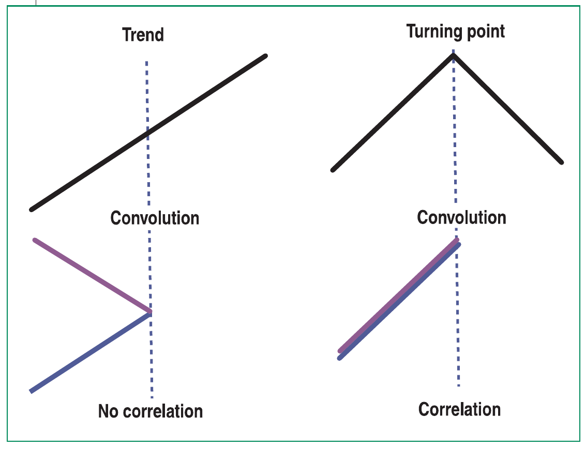
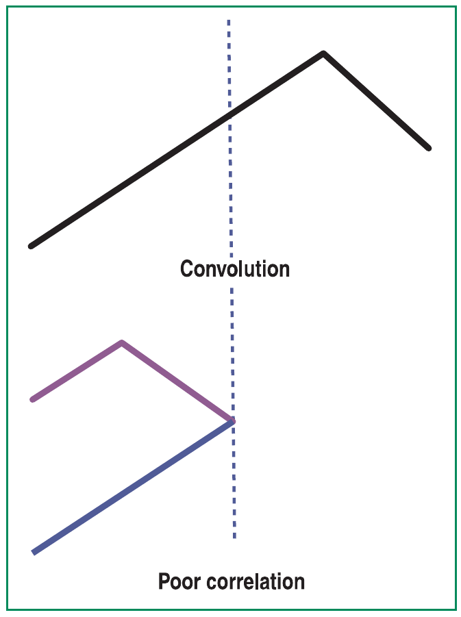
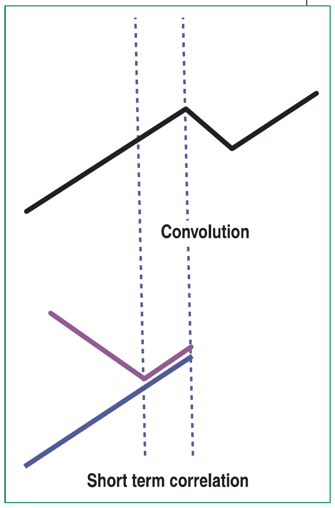
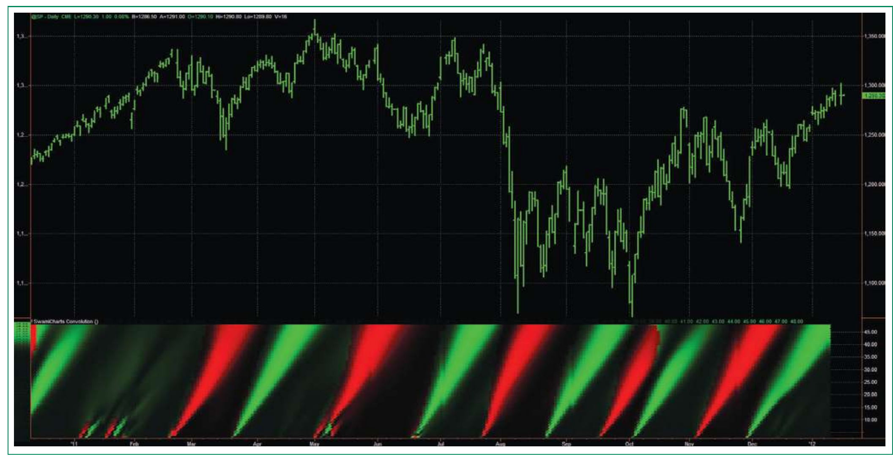
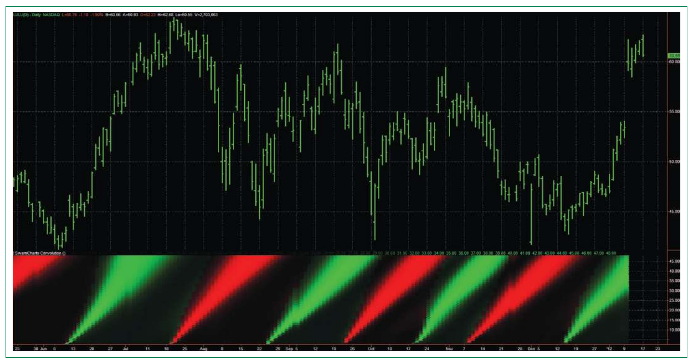

# SwamiCharts Convolution

- **Author:** John F. Ehlers and Ric Way
- **Publication:** Technical Analysis of STOCKS & COMMODITIES, Volume 30, October 2012, pp. 10--13
- **Article URL:** [Article PDF](https://technical.traders.com/archive/article.asp?file=\V30\C10\400EHLE.pdf)

---

One of the major objectives of technical analysis is to decisively identify a major reversal so that we can trade the market primarily in the direction of the ensuing trend. SwamiCharts convolution is just the ticket to meet that objective.

---

In mathematics jargon, "convolution" is an operation on two functions that produces a third function. Convolution is similar to cross-correlation between the two input functions — with a twist. An anachronistic term for convolution is faltung, which means "folding" in German. It is this concept that makes convolution useful for trading. Here, we will spare you the details of the mathematics and jump from the theoretical concept to useful trading examples.

## Theoretical Foundation

Consider what happens at an idealized market bottom. The prices decrease linearly until the bottom is reached and then increase linearly after the bottom has occurred. If we fold these idealized prices about the market bottom, the two price segments are perfectly correlated. We have cross-correlated two market segments that have been folded at the horizontal point of the market bottom. This correlation only occurs at the idealized market bottom that, in fact, establishes the need for prefiltering before the correlation is calculated so that a relatively high correlation can be achieved using real data.

Figure 1 shows two graphic examples of convolution in an initial uptrend. In the left-hand case, the folding has been done in the middle of a continuing trend. The result is that the two price segments are not correlated after the folding operation. If the folding is done at exactly the market peak, as shown in the right-hand case, the two price segments are exactly correlated after the folding operation.


**FIGURE 1: CONVOLUTION IN AN INITIAL UPTREND.** High correlations occur only at major market turning points. In the diagram on the left-hand side, the folding was done in the middle of a continuing trend. The two segments are not correlated after the folding operation. On the right-hand side, the folding is done at exactly the market peak. The two price segments are exactly correlated after the folding operation.

Since high correlation only exists at the market turning point, the convolution indicator is dependent upon the lookback period used in the calculation. Assuming the two price segments have equal time duration, the peak correlation occurs at half the lookback period of the indicator. For example, if a 13-bar period is used, the market peak would appear with a seven-bar delay. The same market peak would appear with a 19-bar delay if a 39-bar lookback period were used in the convolution computation. The case of the market peak not occurring at the folding point is illustrated in Figure 2, showing how the correlation decreases when the folding point does not occur at the market peak.


**FIGURE 2: MARKET PEAK NOT OCCURRING AT THE FOLDING POINT.** Good correlation only occurs when the folding is done at the market reversal point. When the folding point does not occur at the market peak, the correlation decreases.

Still another case is shown in Figure 3, where the market trend is briefly interrupted and then resumes. As long as the lookback period is equal to or less than twice the distance between the two vertical dotted lines, a high correlation event will occur at half the lookback period. However, when the lookback period becomes longer, the noncorrelated line segment is included in the convolution computation and the overall correlation is reduced.


**FIGURE 3: AN INTERRUPTION IN MARKET TREND.** Interruptions in market trends have high correlations for only short periods. As long as the lookback period is equal to or less than twice the distance between the two vertical dotted lines, a high correlation event will occur at half the lookback period. However, when the lookback period becomes longer, the noncorrelated line segment is included in the convolution computation and the overall correlation is reduced.

When the correlation is plotted as a conventional indicator, the high correlation point will show up at a spike that is delayed by half the lookback period from the current data bar. If the lookback period is short, the correlation spikes will be relatively current, but there will be a lot of them. If the lookback period is long, convolution basically reports ancient history, and the short-term interruptions will be eliminated. Consequently, the convolution display is dependent upon the lookback period used in the computation.

## SwamiCharts To The Rescue

SwamiCharts display the indicator over a range of lookback periods. The vertical scale of the indicator is the lookback period, and the indicator value is converted to colors. An indicator is calculated for each lookback period for each new bar of data. The result is a heatmap display that is in time sync with the price data and the values of the indicator are shown for the full range of useful lookback periods.

When the convolution computations are displayed as colors over the range of lookback periods, the resulting SwamiChart shows the high correlation points as "plumes" that point back to the major market reversals. The interruptions in market trends show up as foreshortened and vestigial plumes.

The SwamiChart convolution for approximately the last year on the S&P futures continuous contract can be seen in Figure 4. By taking the direction of the trend into account, market tops are displayed as red plumes (signaling a reversal to the downside) and market bottoms are displayed as green plumes (signaling a reversal to the upside).


**FIGURE 4: SWAMICHARTS CONVOLUTION ON THE S&P FUTURES CONTINUOUS CONTRACT.** Market tops are displayed as red plumes (signaling a reversal to the downside) and market bottoms are displayed as green plumes (signaling a reversal to the upside). The foreshortened plumes in January 2011 signal that the uptrend from autumn 2010 is still in play. For the remainder of 2011, the five red plumes and the six green plumes nail the major market reversals.

The foreshortened plumes in January 2011 signal that the uptrend from autumn 2010 is still in play. For the remainder of 2011 the five red plumes and the six green plumes nail the major market reversals. The reversal points are located at the bottom of the SwamiCharts convolution subgraph and the long plumes identify each as a major turning point. Since a finite amount of data is required to make the shortest calculation, the SwamiCharts convolution is moved four bars to the left to better correlate the indicator with the actual turning point. This technique is similar to that of a centered moving average.

Another example on a more expanded time scale is Lululemon Athletica (LULU), shown in Figure 5. Major bottoms are indicated at the first week of June, third week of August, second week of October, and the second week of December 2011. Major tops are indicated during the third week of July, the second week of August, and the first week of November.


**FIGURE 5: TRADING OPPORTUNITIES ARE IDENTIFIED BY SWAMICHARTS CONVOLUTION FOR LULULEMON ATHLETICA (LULU).** Major bottoms are indicated at the first week of June, third week of August, second week of October, and the second week of December 2011. Major tops are indicated during the third week of July, the second week of August, and the first week of November.

As we write this, it appears we missed the opportunity to buy in December. Therefore, the next opportunity is most likely to watch for a top in the near future.

## Computing SwamiCharts Convolution

For those interested in computing the SwamiChart convolution indicator on their own, the process is relatively straightforward. First, the price data needs to be smoothed to eliminate some of the short-term vestigial plumes. Our favorite smoothing tool is a "super smoothing" filter. Next, the smoothed data over half the lookback period is correlated with the negative of the smoothed data over the other half of the lookback period. The resulting correlation swings between +1 and -1, which is easily translated and dilated to the range between zero and 1 so that the SwamiCharts display code described in the March 2012 issue of STOCKS & COMMODITIES can be used. The peaks and bottoms can be differentiated by sensing the slope of the smoothed data just prior to the maximum correlation.

You can try SwamiCharts convolution without coding by subscribing to the SwamiCharts Advanced Package via the TradeStation Strategy Network. You may find it to be a valuable new weapon in your trading arsenal.

## About The Authors

S&C Contributing Editor John Ehlers is a pioneer in the use of cycles and DSP techniques in technical analysis. He is the author of the MESA9 program, is the chief scientist for stockspotter.com, and is the inventor of SwamiCharts.

Ric Way is an independent software developer specializing in programming algorithmic trading systems in C#. He may be reached at ricway@taosgroup.org.

## Suggested Reading

- Ehlers, John F. [2004]. *Cybernetic Analysis For Stocks And Futures: Cutting-Edge DSP Technology To Improve Your Trading*, John Wiley & Sons.
- Ehlers, John F., and Ric Way [2012]. "Introducing SwamiCharts," STOCKS & COMMODITIES, Volume 30: March.

---

## BibTeX

```bibtex
@article{ehlers_way_2012_swamicharts_convolution,
  author    = {Ehlers, John F. and Way, Ric},
  title     = {SwamiCharts Convolution},
  journal   = {Technical Analysis of STOCKS \& COMMODITIES},
  volume    = {30},
  number    = {10},
  pages     = {10--13},
  year      = {2012},
  month     = oct,
  url       = {https://technical.traders.com/archive/article.asp?file=\V30\C10\400EHLE.pdf}
}
```
