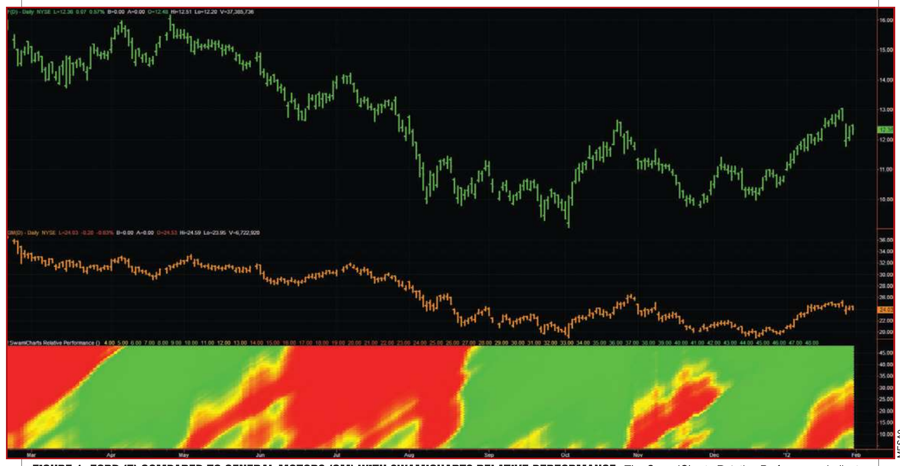
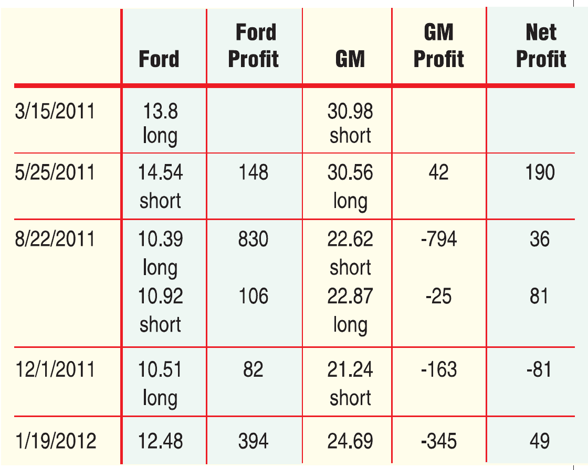
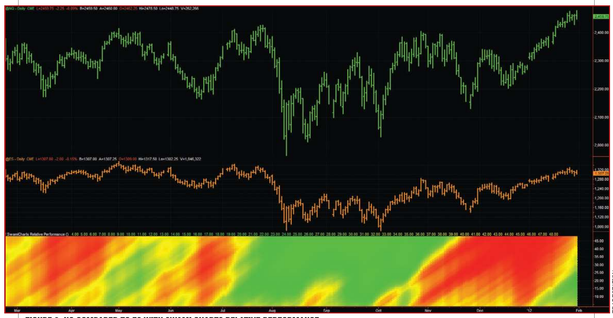
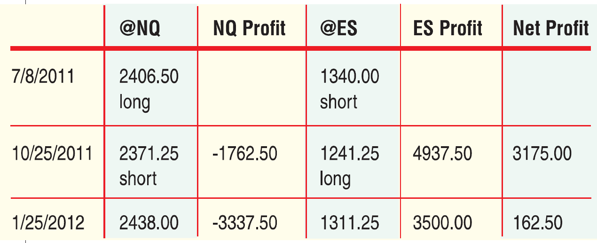
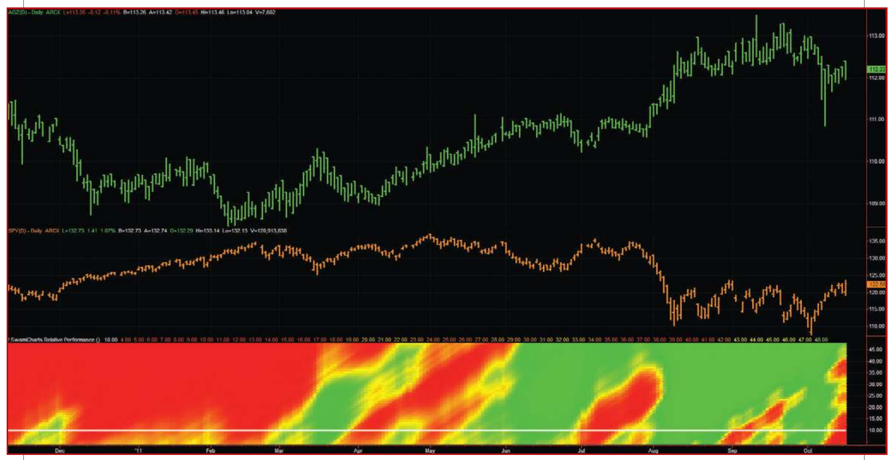
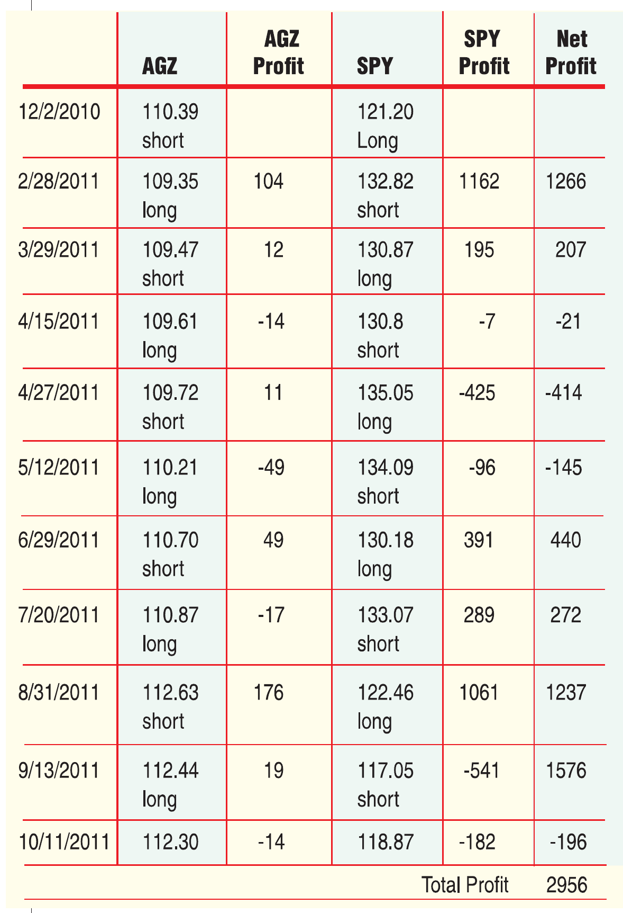

# Reducing Risk While Finding Profit

- **Author:** John Ehlers and Ric Way
- **Publication:** Technical Analysis of STOCKS & COMMODITIES, Volume 30, December 2012, pp. 10--14
- **Article URL:** [Article PDF](https://technical.traders.com/archive/article.asp?file=\V30\C12\442EHLE.pdf)

---

Use this tool to examine the relative price movement of a pair of stocks or exchange traded funds. It makes you look at the bigger picture and prevents you from making ill-considered decisions.

---

It's no secret, really — it's just a new trading approach that makes common sense. But to implement the approach, you need the proper tools. The basic concept was introduced about three decades ago by brokerage firm Morgan Stanley. The idea, known as pairs trading, calls for simultaneously trading two correlated stocks: one to the long side and the other to the short side. The risk reduction arises from the fact that some outside event such as a natural disaster will similarly affect both sides of the trade, with the result as a push on overall profits. One side will win due to the outside effect and the other side will lose.

The profitability arises from the break in correlation between the performances of the two stocks. For example, you might trade Ford (F) to the long side and General Motors (GM) to the short side if you believe the negative news stories about GM's Volt automobile will adversely affect the company's stock.

## How Correlated Are They?

The traditional technical approach to pairs trading is to monitor the correlation coefficient between the prices of the two stocks. If stocks A and B go up together or go down together, their correlation is theoretically unity. The pairs trade makes a profit when the long side of the trade goes up and the short side of the trade goes down, or at least goes up at a reduced rate. In either of these cases the correlation between stocks A and B is decreased. Monitoring correlation coefficients is mathematical and a little arcane. There is a better way.

The SwamiCharts Relative Performance (RP) indicator (not to be confused with the relative strength indicator [RS]) gives a graphical display of the price changes of one stock relative to the price changes of a second over a range of lookback averaging periods. The lookback periods are the vertical scale of the RP indicator, and the ratio of the two price changes are shown as colors. The result is an intuitive "heatmap" of the relative performance of the two stocks. Thus, the RP indicator is an ideal tool for pairs trading.

## Two Examples

Figure 1 shows F as data1 compared to GM as data2, with RP in the bottom subgraph. As we stated previously, the vertical scale of the indicator is the averaging lookback period. When the lookback period is short — at the bottom of the indicator — there is little smoothing. When the lookback period is long — at the top of the indicator — the ratio has perhaps been oversmoothed. Therefore, we can examine the indicator roughly at its midpoint in the vertical scale.

Think of the indicator as a fuzzy logic "stoplight" chart. Green means that F is outperforming GM, while red means that GM is outperforming F. A quick examination at the right-hand side of the chart shows GM is outperforming F. As market technicians, we can therefore dismiss the assertion that the adverse Volt publicity is hurting GM in the auto industry.


**FIGURE 1: FORD (F) COMPARED TO GENERAL MOTORS (GM) WITH SWAMICHARTS RELATIVE PERFORMANCE.** The SwamiCharts Relative Performance indicator is displayed in the bottom subgraph. Green means that F is outperforming GM and red means GM is outperforming F.

More important, let's examine the profits made by pairs trading F and GM using the RP at a lookback period of 25. The indicator went green on March 15, 2011, meaning we would buy F and sell short GM at the open of that day. To more or less equalize risk, we would trade 200 shares of F and 100 of GM so that we would have an equal dollar value of exposure on both sides of the trade. Then, on May 25, 2011, the RP indicator changed to red. This meant we would close our current trades with a net profit of $120 and also reverse both positions.

The trades continued that way throughout the rest of the year and into 2012. As a result, four of the five trades were net profitable — not a bad track record. This was particularly important because the risk exposure for all trades was negligible.


**FIGURE 2: PROFITABILITY OF TRADING THE FORD-GM PAIR.** You will note that four out of the five trades were net profitable.

It is sufficiently difficult to find one trading opportunity, let alone two, to find a suitable pair. Further, trading stocks short is not the easiest thing to do. One solution to these problems is to trade futures as a pair. For example, in Figure 3, we show the continuous contract of NQ (emini NASDAQ) compared to the continuous contract of ES (emini S&P index), along with the RP indicator.


**FIGURE 3: NQ COMPARED TO ES WITH SWAMICHARTS RELATIVE PERFORMANCE.**

Since the value of NQ is $25 per point and the value of ES is $50 per point, we will trade two contracts of NQ for every contract of ES to equalize risk.

On July 8, 2011, the RP indicator turned green, signaling to buy two contracts of NQ and sell short one contract of ES. On October 25, the indicator turned red, signaling to close out the first trades with a net profit of $3,175 and reversing positions on both indicators. Then, on January 25, 2012, this pair was closed out with a net profit of $162.50. As a result, we would have made more than $3,000 in about a half year, after commissions. Not bad, considering the trades were taken at no net risk due to outside influences. See Figure 4.


**FIGURE 4: PROFITABILITY OF TRADING NQ-ES PAIR.**

Pairs trading can be accomplished by using exchange traded funds (ETFs) as your trading vehicle since ETFs can be trading both long and short with equal facility, just like futures. There are sector ETFs that are highly correlated, and therefore excellent candidates for pairs trading.

## Now Here's An Idea!

The mention of sector ETFs triggers thinking about another trading technique called sector rotation. Sector rotation generally has a specific connotation. However, if you want to use the RP indicator, you can think about rotating between two sectors pairwise and relax the correlation requirement for pairs trading.

> Equities and bonds are the yin and yang of investments.

Equities and bonds are the yin and yang of investments. So let's examine rotating between these two sectors by using the iShares Barclays Agency Bond Fund (AGZ) and SPDR Standard & Poor's 500 (SPY) as a surrogate for equities. AGZ is compared to SPY, along with the RP indicator in Figure 5. In this case, green means we will be long 100 shares of AGZ while simultaneously being short 100 shares of SPY. Similarly, red means we will be short 100 shares of AGZ while being long 100 shares of SPY.

We want to enter the trades as soon as possible without many whipsaws, so we will make the trades at the 10-bar lookback period indicated by the white line in the indicator. We enter the trades on the open of the day the color switches from green (or red) to yellow. The trading results are summarized in Figure 6.


**FIGURE 5: AGZ COMPARED TO SPY WITH SWAMICHARTS RELATIVE PERFORMANCE.** In this case, green means we will be long 100 shares of AGZ while simultaneously being short 100 shares of SPY. Similarly, red means we will be short 100 shares of AGZ while simultaneously be long 100 shares of SPY.


**FIGURE 6: PROFITABILITY OF TRADING AGZ-SPY PAIR.** In this relatively short example, we see that sector rotation has produced 60% winning trades and a profit factor over 5.

In this relatively short example, we see that sector rotation has produced 60% winning trades and a profit factor over 5. Of course, results will vary with different pairs and at different times, but this article is meant to illustrate a new trading technique rather than an exhaustively researched trading system. With the RP indicator, you can investigate your own preferred sector pair.

## A Whole New Way To Trade

SwamiCharts Relative Performance is the ideal tool for pairs trading. It enables you to examine the relative price movement of any pair of stocks or ETFs. If you require the stocks be correlated, then you are truly pairs trading. If you relax the correlation requirement, then you are examining the best timing to rotate from one sector into another. Either way, you can see the trading landscape from an overview perspective. Think of SwamiCharts as a fuzzy logic method to implement your trades. While SwamiCharts may lack the precision of traditional indicators, the overview tends to keep you from making precisely the wrong decision.

## About The Authors

S&C Contributing Editor John Ehlers is a pioneer in the use of cycles and DSP techniques in technical analysis. He is the author of the MESA9 program, is the chief scientist for stockspotter.com, and is the inventor of SwamiCharts. Ric Way is an independent software developer specializing in programming algorithmic trading systems in C#. He may be reached at ricway@taosgroup.org.

## Suggested Reading

- Ehlers, John F. [2001]. *Rocket Science For Traders*, John Wiley & Sons.
- Ehlers, John F., and Ric Way [2012]. "Introducing SwamiCharts," Technical Analysis of STOCKS & COMMODITIES, Volume 30: March.

---

## BibTeX

```bibtex
@article{ehlers_way_2012_reducing_risk,
  author    = {Ehlers, John F. and Way, Ric},
  title     = {Reducing Risk While Finding Profit},
  journal   = {Technical Analysis of STOCKS \& COMMODITIES},
  volume    = {30},
  number    = {12},
  pages     = {10--14},
  year      = {2012},
  month     = dec,
  url       = {https://technical.traders.com/archive/article.asp?file=\V30\C12\442EHLE.pdf}
}
```
