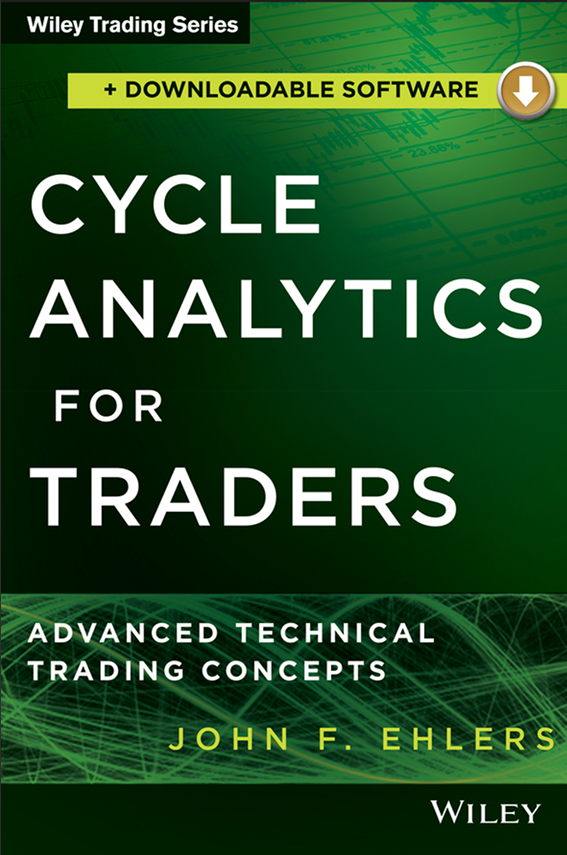

# Cycle Analytics for Traders: Advanced Technical Trading Concepts



**Author:** John F. Ehlers

**Year:** 2013

## BibTeX

```bibtex
@Book{ehlers2013cycle,
  author    = {Ehlers, John F.},
  title     = {Cycle Analytics for Traders: Advanced Technical Trading Concepts},
  publisher = {Wiley},
  year      = {2013},
  series    = {Wiley Trading},
  isbn      = {9781118728604},
}
```

## Chapters

1. [Unified Filter Theory](ch1.md)
2. [SMAs, EMAs, or Other?](ch2.md)
3. [Smoothing Filters on Steroids](ch3.md)
4. [Decyclers](ch4.md)
5. [Band-Pass Filters](ch5.md)
6. [Market Structure and the Hurst Coefficient](ch6.md)
7. [Spectral Dilation](ch7.md)
8. [Autocorrelation](ch8.md)
9. [Fourier Transforms](ch9.md)
10. [Comb Filter Spectral Estimates](ch10.md)
11. [Adaptive Filters](ch11.md)
12. [The Even Better Sinewave Indicator](ch12.md)
13. [Convolution](ch13.md)
14. [The Hilbert Transformer](ch14.md)
15. [Indicator Transforms](ch15.md)
16. [SwamiCharts](ch16.md)
17. [Swing-Trading Strategies](ch17.md)
