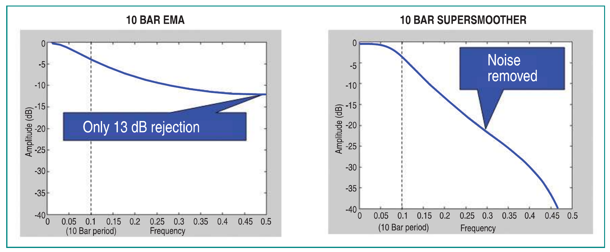
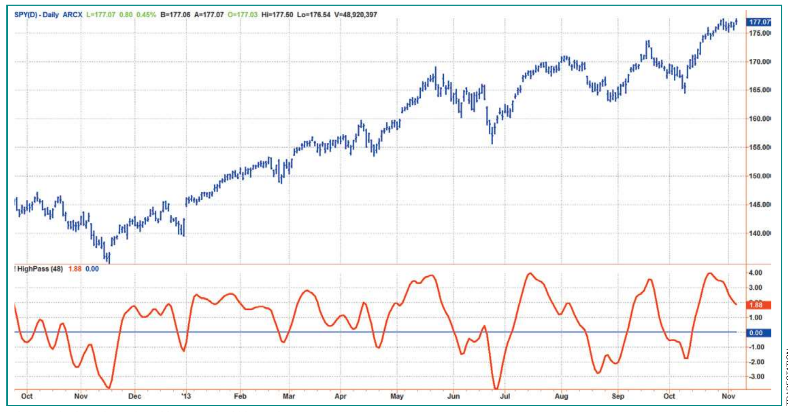
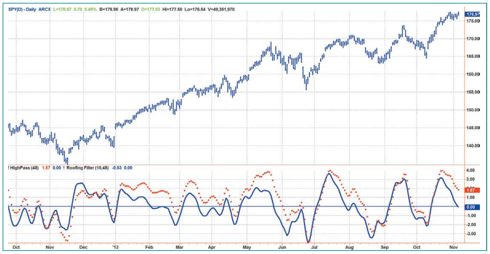
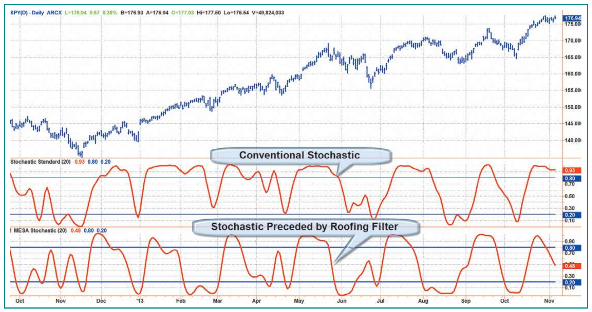
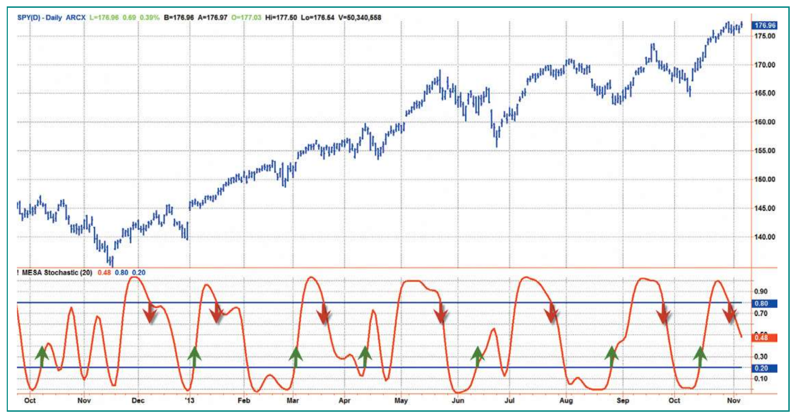
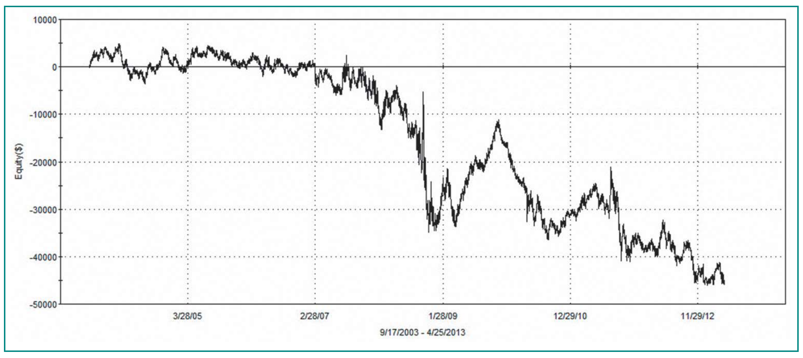
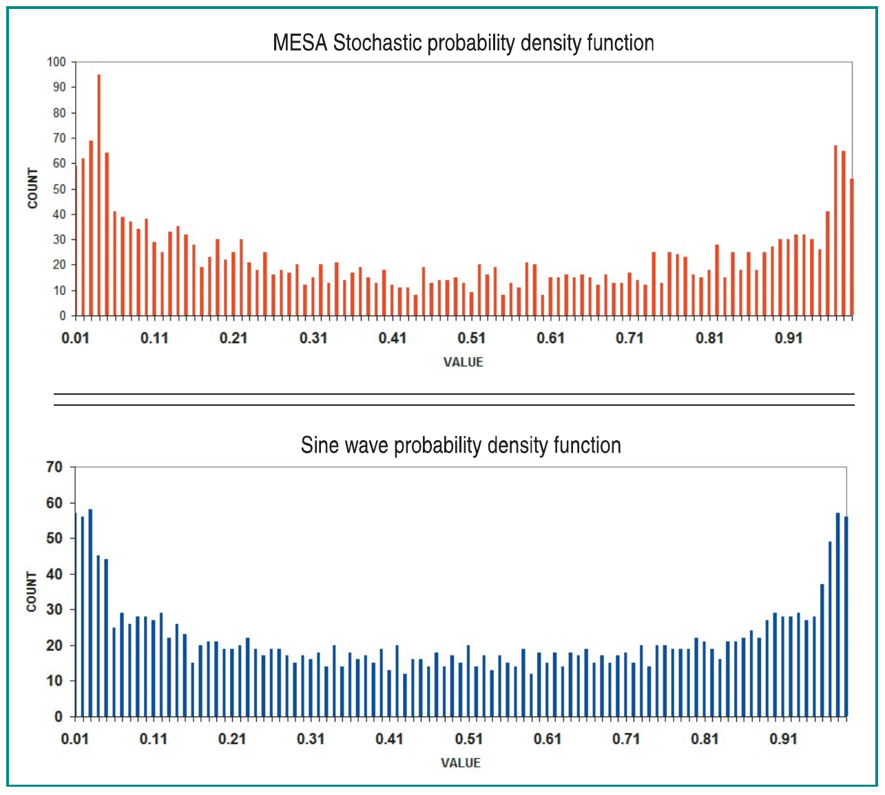
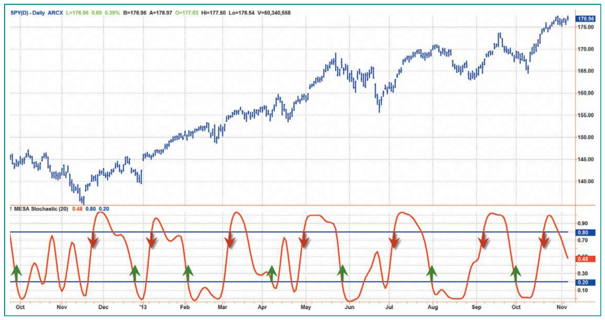
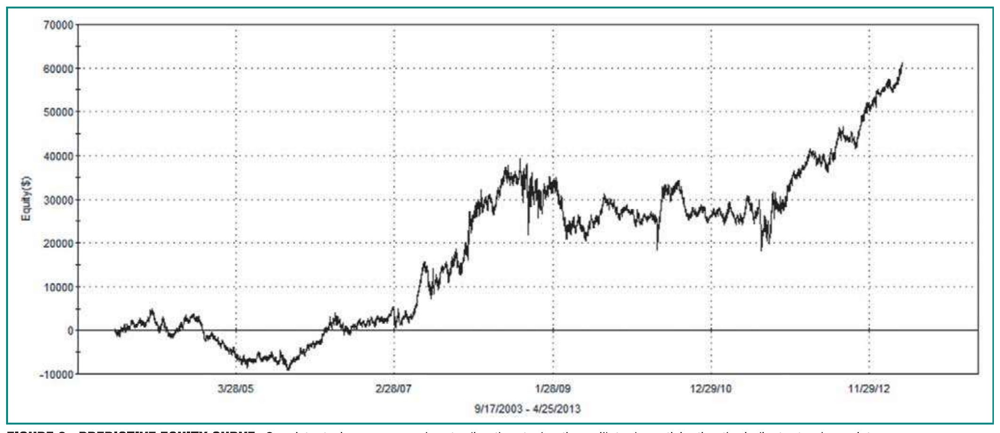

# Predictive And Successful Indicators

- **Author:** John F. Ehlers, PhD
- **Publication:** Technical Analysis of STOCKS & COMMODITIES, Volume 32, January 2014, pp. 16--25
- **Article URL:** [Article PDF](https://technical.traders.com/archive/article.asp?file=\V32\C01\692EHLE.pdf)
- **Traders' Tips URL:** [Traders' Tips, January 2014](https://www.traders.com/Documentation/FEEDbk_docs/2014/01/TradersTips.html)

---

Have you ever thought about how the high-to-low price swings increase as the time interval increases on a chart? This tends to create more noise and distorts indicators. Here are a couple of filters you can incorporate into your trading system to smooth data and remove indicator distortions.

---

Indicators are typically constructed from filters of one kind or another. Since the price data basically constitutes a stochastic process, and since the filters can only use historical data and have no insight into future data, there is no such thing as a truly predictive indicator. Predictions are usually made by other techniques such as extrapolating a trendline, cross-correlations such as volume leads price, or in context with another filter such as a divergence. All of these techniques are anecdotal.

In this article, I will show you how to carefully craft novel filters to conquer the vagaries of market data, and how to combine them into advanced indicators. Then I will demonstrate how even advanced indicators fail if they are used in the conventional way. Then, using measured probability density functions, I will show how to make the indicators predictive with a high probability of success.

## Noise

Market data is noisy. The systemic noise arises from hundreds, if not thousands, of traders placing trades nearly simultaneously that each trader, for a variety of reasons, thinks will result in profits. In addition, market data is sampled data rather than continuous data; that is, there is only one data point on the close of each day when using daily data. Even if you average in the high & low prices, there still is only one sample per day. Of course, you can change the sample rate using intraday data, but you are still using sampled data. The result of using sampled data is that there is substantial aliasing noise several octaves below the Nyquist frequency. If you prefer, you can think of this other kind of noise as autocorrelation noise. For daily data, the period of the Nyquist frequency is a two-bar cycle. One octave lower is a four-bar cycle, and one more octave lower is an eight-bar cycle. Aliasing noise swamps the signal for these shorter cycle periods, and the only thing that can be done is to not even try to use cycle periods where the aliasing noise swamps the signal amplitude.

Aliasing noise is also larger than the signal amplitude at even longer cycle periods, but the frequency separation enables filters to reduce or nearly remove the effects of aliasing noise. Simple moving averages (SMA) or exponential moving averages (EMA) are often used to smooth the data in an attempt to reduce aliasing noise. The problem with using an SMA or EMA is that they are not efficient filters. The only way to get more smoothing is to increase the length of the moving average, which introduces more lag into the filter.

I have developed a stunning new filter that sharply attenuates aliasing noise while minimizing filtering lag. I call this new filter the SuperSmoother. Once you know about this filter, you will never need to use an EMA or SMA again. I started the design of the SuperSmoother using real inductors and capacitors as if it were in an electronic circuit. I then converted this analog filter into a digital filter. After this conversion, I saw that I could alter the transfer response to minimize filter lag. Figure 1 shows the filtering response of the SuperSmoother compared to the response of an EMA when the critical period of both was set to be a 10-bar period. The EMA only has 13 decibels (dB) of rejection at the Nyquist frequency, whereas the SuperSmoother virtually eliminates aliasing noise.


**FIGURE 1: EXPONENTIAL MOVING AVERAGE VS. SUPERSMOOTHER.** An EMA has only modest noise attenuation while a SuperSmoother virtually eliminates aliasing noise.

The EasyLanguage code to compute the SuperSmoother filter is given in sidebar "EasyLanguage Code To Compute The SuperSmoother Filter." If you are converting this code to another programming language, please note that the trigonometric function angles are in degrees, whereas they are in radians in most other programming languages. Note also that the suffix notation [N] means the value N bars ago in the recursive calculations. I have set the critical period to be a 10-bar period in the code example to eliminate aliasing noise. However, the critical period can be a generalized input variable. This makes the SuperSmoother an outstanding generic smoothing filter.

## Spectral Dilation

Traders and technical analysts know that market data is fractal; a chart of daily data or weekly data will look basically the same if the scales were removed. In other words, the amplitude of the cyclic swings scale in direct proportion to the cycle period. I call this effect spectral dilation because longer cycle periods have larger swings. The Hurst coefficient is directly related to the degree of dilation. Fibonaccians use the golden spiral to show the dilation factor is 1.618. The exact degree of dilation is not important. That dilation exists is beyond question. So, in round numbers, the spectrum amplitude increases 6 dB per octave of cycle period. This $1/f$ phenomenon seems to be almost universal in physical systems.

Here was my epiphany regarding market data: Like everyone, I knew the market data was fractal. However, I completely disregarded this fact when looking at oscillator-type indicators such as the momentum, stochastic, relative strength index (RSI), moving average convergence/divergence (MACD), or commodity channel index (CCI). In a nutshell, all these indicators are first-order differentiators, that is, they all take just one difference in their calculation. A basic principle of filtering is that a filter has an attenuation rolloff of 6 dB per octave per order of the filter in the attenuation band of the filter. Thus, all of these indicators roll off at the rate of 6 dB per octave. Since the data amplitude swings are increasing at the rate of 6 dB per octave, the best these indicators can do is to flatten the response of the spectrum in the indicator output.


**FIGURE 2: SINGLE POLE HIGHPASS FILTER (OR OSCILLATOR).** The low frequency components are not removed, which results in the output failing to have a zero mean.

Figure 2 shows the practical effect of a first-order high-pass filter when applied to some sample market data. Note that during the period of the long uptrend, the oscillator does not have a zero mean. That is, the wiggles are not centered on zero. The interpretation is that the data has not been fully detrended and that the longer cycle period signals are leaking through the rejection band of the filter.

When I introduce a second-order high-pass filter, the attenuation rate is now 12 dB per octave in the attenuation band. The filter attenuation exceeds the 6 dB per octave dilation in the data, and therefore, effective filtering of the longer cycle components is accomplished. Figure 3 shows the contrast between using a first-order high-pass filter and second-order high-pass filter. The dotted red line is the original first-order response given in Figure 2 and the solid blue line is the second-order response. Note the second-order response provides a nominal zero mean for the oscillator and that much of the lag induced by the "leaking" longer cyclic components is eliminated.


**FIGURE 3: TWO-POLE HIGH-PASS FILTER.** The effects of spectral dilation are removed. This gives the oscillator a zero mean to accurately assess turning points and generally reduces indicator lag.

I call the combination of the SuperSmoother filter and the second-order high-pass filter a roofing filter because it provides a roof over the data spectrum, so the data is preprocessed for use with any indicator that may follow. The roofing filter is not a bad indicator in its own right. The EasyLanguage code for computing the roofing filter can be found in sidebar "EasyLanguage Code To Compute The Roofing Filter." In a sense, the roofing filter is a kind of bandpass filter. The roofing filter differs from a bandpass filter because the rejection response on the high-frequency side is specifically designed to reject aliasing noise, and the second-order rejection response on the low-frequency side is specifically designed to eliminate the effects of spectral dilation.

## Adding A Filter

In Figure 4 you see a comparison of the conventional stochastic indicator and a stochastic calculation preceded by a roofing filter. I remember seeing technician George Lane, a grandiose speaker, list the myriad of rules for use of the stochastic. Some depended on %D crossing %K on the right side or left side. For example, one rule was, "In an uptrend, don't go short until %D crosses below 80 three times." As we now see, all those rules are just plain silly. The distortion of the stochastic in an uptrend is due solely to spectral dilation. When the roofing filter precedes the stochastic, the result is an easy-to-use oscillator, which I call MESA Stochastic to differentiate it from the conventional stochastic oscillator. The swings of the MESA Stochastic are nearly in synchronization with the swings in prices. I have included the complete indicator in sidebar "EasyLanguage Code To Compute MESA Stochastic Indicator" for those of you who wish to replicate it.


**FIGURE 4: ROOFING FILTER.** The addition of a roofing filter preceding a stochastic removes spectral dilation distortion.

The computation of the MESA Stochastic is a simple one, where the current value of the roofing filter is differenced from the lowest value over the observation period, and the difference is normalized to the range between the highest and lowest value of the roofing filter over the observation period. Rather than use the usual arcane multiple smoothings, I smooth the stochastic just once using a SuperSmoother.

## Effective Trading Strategies

Conventional wisdom says to wait for confirmation of the turning point before making a trade entry. That means that buy signals are created when the indicator crosses over 20 and sell signals are created when the indicator crosses under 80. In Figure 5 you see the conventional trading rules in action. The green and red arrows indicate application of those rules.


**FIGURE 5: CONVENTIONAL TRADING RULES.** Buy when the indicator crosses above 20% and sell short when the indicator crosses below 80%.

A casual review of those rules seems to confirm they can result in good trades. Not trusting anecdotal evidence, I wrote a trading strategy that contains only those rules. There were no other qualifying rules and no stop exits. When I ran that trading system on 10 years of continuous daily data on the S&P futures data, it resulted in the equity growth curve you see in Figure 6. The trading system using conventional wisdom was a consistent loser!

A quick analysis will tell you what went wrong. First, assume there is a 20-bar dominant cycle in the data. This happens to be more or less true from my spectral measurements. It is also logical from a fundamental perspective because the companies that comprise the S&P index generally have to make their numbers on a monthly basis. So, generally speaking, you would expect a 10-bar move to the upside and a 10-bar move to the downside. Now, I'll add up the lag in my calculations.

The SuperSmoother has about two bars of lag, both in the roofing filter and stochastic. You can only make a trade entry on the bar after the signal, so there is another bar of lag. In addition, you average about three bars of lag, waiting for confirmation. When I added these lags, I found that they total eight bars. That's eight bars of lag in an expected 10-bar move. No wonder the trading strategy is a consistent loser!

It is natural to be tempted to simply reverse the rules to convert the trading strategy into a winner. Unfortunately, that's like doing brain surgery with an axe. I avoid such tactics because sloppy rules like that generally return to bite you. There is a much more elegant solution available.


**FIGURE 6: EQUITY CURVE FROM APPLYING THE STOCHASTIC OSCILLATOR ON 10 YEARS OF S&P DAILY FUTURES DATA.** Consistent losses are incurred when trading the stochastic oscillator using the conventional rule of waiting for confirmation.

## Making It Predictive

The MESA Stochastic indicator is just like any other indicator in the sense that it is created using historical data. In and of itself, it has no predictive power. However, note that the waveform of the indicator in Figure 5 is more than vaguely reminiscent of a sine wave. Based on this observation, I measured the probability density of the values of the indicator over the last 10 years, or about 2,500 samples. Figure 7 shows the resulting probability density of the indicator compared to the probability density of a theoretical sine wave over the same number of samples. The probability density functions are nearly the same.


**FIGURE 7: PROBABILITY DENSITY FUNCTION.** Here you see the resulting probability density of the indicator (top chart) compared to the probability density of a theoretical sine wave (bottom chart) over the same number of samples. The probability density functions are nearly the same.

I know that I can anticipate the peak of a sine wave if I know its amplitude is increasing and the amplitude value is near +1. I can also anticipate the valley of a sine wave if I know its amplitude is decreasing and the amplitude value is near -1. Since the probability density functions are similar, I can anticipate and predict the price turning points using MESA Stochastic.

All I have to do to predict the price turning points is to create rules to buy when the indicator crosses under 20 and to sell short when the indicator crosses over 80. The rules are displayed as the green and red arrows overlaid on the MESA Stochastic indicator in Figure 8.


**FIGURE 8: PREDICTIVE INDICATORS.** You would buy when the indicator crosses below 20% before the indicator reaches its minimum value. You would sell short when the indicator crosses above 80%, before the indicator reaches its maximum value.

As before, I created a trading strategy using only these rules and ran the strategy over 10 years of continuous daily data for S&P daily futures. The resulting equity growth curve is shown in Figure 9. Now we have a consistent winner! It is not too much work to add some ancillary rules, stops, and so forth to have a real trading system.

Nothing has changed in the indicator calculations. There are still two bars of lag due to the SuperSmoother in the roofing filter and stochastic calculation. There is still a one-bar lag, making the trade entry after getting the signal. The difference is that now there is a minus three bars of lag because you are anticipating the turning point of the MESA Stochastic indicator. Therefore, there is a net two-bar lag of your trade entry relative to the nominal extremes in price movement. In other words, you have virtually predicted the point at which the price will reverse its swing.

> Anticipating swing turning points results in consistently profitable trading strategies.


**FIGURE 9: PREDICTIVE EQUITY CURVE.** Consistent winners occur when trading the stochastic oscillator by anticipating the indicator turning points.

## Smooth And Less Noisy

I have shown a stunning new SuperSmoother filter that eliminates the aliasing noise that plagues much of technical analysis. The sharp attenuation of the SuperSmoother makes it an excellent candidate as a generalized smoothing filter. In fact, its superior attenuation and low lag suggest that it can be a nearly universal replacement for EMAs and SMAs.

I have also shown a new roofing filter that mitigates the effects of spectral dilation. Using the roofing filter gives you confidence that your oscillators will tend to swing about a zero mean, thereby providing clarity of interpretation and reducing indicator lag.

The symmetry of MESA Stochastic allows assumptions regarding the probability of a swing reversion to the opposite extreme. This assumption enables you to anticipate the swing turning points, resulting in consistently profitable trading strategies.

I use the principles of the SuperSmoother and roofing filter at StockSpotter.com. The free indicators are all smooth to enable reliable interpretation, and they all have a nominally zero mean so that interpretive distortions are removed. The trading results of the signals are documented at the website.

## EasyLanguage Code To Compute The SuperSmoother Filter

```easylanguage
{
  SuperSmoother filter
  © 2013 John F. Ehlers
}
Vars: a1(0), b1(0), c1(0), c2(0), c3(0), Filt(0);

a1 = expvalue(-1.414*3.14159 / 10);
b1 = 2*a1*Cosine(1.414*180 / 10);
c2 = b1;
c3 = -a1*a1;
c1 = 1 - c2 - c3;

Filt = c1*(Close + Close[1]) / 2 + c2*Filt[1] + c3*Filt[2];

Plot1(Filt);
Plot2(0);
```

## EasyLanguage Code To Compute The Roofing Filter

```easylanguage
{
  Roofing filter
  © 2013 John F. Ehlers
}
Vars: alpha1(0), HP(0), a1(0), b1(0), c1(0), c2(0), c3(0), Filt(0);

//Highpass filter cyclic components whose periods are shorter than 48 bars
alpha1 = (Cosine(.707*360 / 48) + Sine(.707*360 / 48) - 1) / Cosine(.707*360 / 48);
HP = (1 - alpha1 / 2)*(1 - alpha1 / 2)*(Close - 2*Close[1] + Close[2])
     + 2*(1 - alpha1)*HP[1] - (1 - alpha1)*(1 - alpha1)*HP[2];

//Smooth with a Super Smoother Filter
a1 = expvalue(-1.414*3.14159 / 10);
b1 = 2*a1*Cosine(1.414*180 / 10);
c2 = b1;
c3 = -a1*a1;
c1 = 1 - c2 - c3;

Filt = c1*(HP + HP[1]) / 2 + c2*Filt[1] + c3*Filt[2];

Plot1(Filt);
Plot2(0);
```

## EasyLanguage Code To Compute MESA Stochastic Indicator

```easylanguage
{
  MESA Stochastic Indicator
  © 2013 John F. Ehlers
}
Inputs: Length(20);

Vars: alpha1(0), HP(0), a1(0), b1(0), c1(0), c2(0), c3(0), Filt(0),
      HighestC(0), LowestC(0), count(0), Stoc(0), MESAStochastic(0);

//Highpass filter cyclic components whose periods are shorter than 48 bars
alpha1 = (Cosine(.707*360 / 48) + Sine(.707*360 / 48) - 1) / Cosine(.707*360 / 48);
HP = (1 - alpha1 / 2)*(1 - alpha1 / 2)*(Close - 2*Close[1] + Close[2])
     + 2*(1 - alpha1)*HP[1] - (1 - alpha1)*(1 - alpha1)*HP[2];

//Smooth with a Super Smoother Filter
a1 = expvalue(-1.414*3.14159 / 10);
b1 = 2*a1*Cosine(1.414*180 / 10);
c2 = b1;
c3 = -a1*a1;
c1 = 1 - c2 - c3;

Filt = c1*(HP + HP[1]) / 2 + c2*Filt[1] + c3*Filt[2];

HighestC = Filt;
LowestC = Filt;
For count = 0 to Length - 1 Begin
  If Filt[count] > HighestC then HighestC = Filt[count];
  If Filt[count] < LowestC then LowestC = Filt[count];
End;
Stoc = (Filt - LowestC) / (HighestC - LowestC);
MESAStochastic = c1*(Stoc + Stoc[1]) / 2 +
  c2*MESAStochastic[1] + c3*MESAStochastic[2];

Plot1(MESAStochastic);
Plot2(.8);
Plot6(.2);
```

## Further Reading

- Ehlers, John F., and Ric Way [2010]. "Fractal Dimension As A Market Mode Sensor," Technical Analysis of STOCKS & COMMODITIES, Volume 28: June.
- [2010]. "Zero Lag (Well, Almost)," Technical Analysis of STOCKS & COMMODITIES, Volume 28: November.
- Ehlers, John F. [2001]. *Rocket Science For Traders*, John Wiley & Sons.
- Peterson, Dennis [2010]. "StockSpotter.com," product review, Technical Analysis of STOCKS & COMMODITIES, Volume 28: December.

## About The Author

S&C Contributing Editor John Ehlers is a pioneer in the use of cycles and DSP techniques in technical analysis. He is the author of the MESA9 program, is the chief scientist for StockSpotter.com, and is the inventor of SwamiCharts.

---

See our Traders' Tips section beginning on page 56 for commentary on implementation of John Ehlers' technique in various technical analysis programs. Accompanying program code can be found in the Traders' Tips area at www.traders.com.

---

## BibTeX

```bibtex
@article{ehlers_2014_predictive,
  author    = {Ehlers, John F.},
  title     = {Predictive And Successful Indicators},
  journal   = {Technical Analysis of STOCKS \& COMMODITIES},
  volume    = {32},
  number    = {1},
  pages     = {16--25},
  year      = {2014},
  month     = jan,
  url       = {https://technical.traders.com/archive/article.asp?file=\V32\C01\692EHLE.pdf}
}

@misc{traders_tips_2014_01,
  author       = {{Technical Analysis of STOCKS \& COMMODITIES}},
  title        = {Traders' Tips: Predictive And Successful Indicators},
  howpublished = {online},
  year         = {2014},
  month        = jan,
  url          = {https://www.traders.com/Documentation/FEEDbk_docs/2014/01/TradersTips.html}
}
```
