# Traders' Tips: January 2014

- **Article:** Predictive And Successful Indicators by John F. Ehlers
- **Traders' Tips URL:** [Traders' Tips, January 2014](https://www.traders.com/Documentation/FEEDbk_docs/2014/01/TradersTips.html)

---


## TRADESTATION: January 2014

In �Predictive And Successful Indicators� in this issue, author
  John Ehlers describes a new method for smoothing market data while reducing
  the lag that most other smoothing techniques have. Ehlers has provided some
  TradeStation code in his article for several indicators and describes an approach
  for creating a strategy. For convenience, we will make the same code available
  at our EasyLanguage support forum as well as an example strategy based on Ehlers� description.

To download the EasyLanguage code, please visit our TradeStation and EasyLanguage
  support forum. The code can be found here:www.tradestation.com/TASC-2014.
  The ELD filename is �_TASC_PredictiveIndicators.ELD.� For more
  information about EasyLanguage in general, please seewww.tradestation.com/EL-FAQ.

The code is also shown below.

A sample chart is shown in Figure 1.

FIGURE 1: TRADESTATION. This daily chart of IBM shows
    the indicators and strategy from John Ehlers� article in this issue.

This article is for informational purposes. No type of trading or investment
    recommendation, advice, or strategy is being made, given, or in any manner
    provided by TradeStation Securities or its affiliates.

�Doug McCraryTradeStation Securities, Inc.www.TradeStation.com

BACK TO LIST


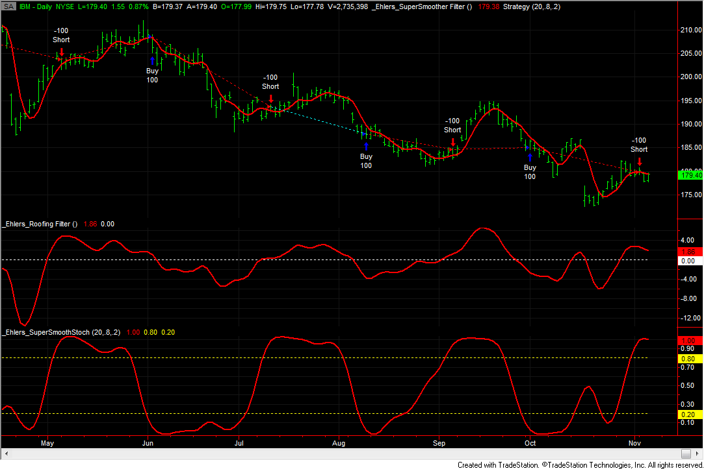
**FIGURE 1.**


```easylanguage
_Ehlers_SuperSmoother Filter (Indicator)

variables:
	a1( 0 ), 
	b1( 0 ), 
	c1( 0 ), 
	c2( 0 ), 
	c3( 0 ),
	Filt( 0 ) ; 

a1 = ExpValue( -1.414 * 3.14159 / 10 ) ;
b1 = 2 * a1 * Cosine( 1.414 * 180 / 10 ) ;
c2 = b1 ;
c3 = -a1 * a1 ;
c1 = 1 - c2 - c3 ;
Filt = c1 * ( Close + Close[1] ) 
	/ 2 + c2 * Filt[1] + c3 * Filt[2] ;

Plot1( Filt, "SuperSmooth" ) ;


_Ehlers_Roofing Filter (Indicator)

variables:
	alpha1( 0 ), 
	HP( 0 ), 
	a1( 0 ), 
	b1( 0 ), 
	c1( 0 ), 
	c2( 0 ), 
	c3( 0 ),
	Filt( 0 ) ; 
	
alpha1 = ( Cosine( .707 * 360 / 48 ) 
	+ Sine ( .707 * 360 / 48 ) - 1 )
	/ Cosine( .707 * 360 / 48 ) ;
	
HP = ( 1 - alpha1 / 2 ) * ( 1 - alpha1 / 2 )
	* ( Close - 2 * Close[1] + Close[2] ) 
	+ 2 * ( 1 - alpha1 ) * HP[1] - ( 1 - alpha1 ) 
	* ( 1 - alpha1 ) * HP[2] ;

a1 = ExpValue( -1.414 * 3.14159 / 10 ) ;
b1 = 2 * a1 * Cosine( 1.414 * 180 / 10 ) ;
c2 = b1 ;
c3 = -a1 * a1 ;
c1 = 1 - c2 - c3 ;
Filt = c1 *( HP + HP[1] ) / 2 
	+ c2 * Filt[1] + c3 * Filt[2] ;	

Plot1( Filt, "SS Filter" ) ;
Plot2( 0, "Zero Line" ) ;


_Ehlers_SuperSmoothStoch (Indicator)

inputs:
	Length( 20 ), 
	OBLevel( .8 ), 
	OSLevel( .2 ) ;
		
variables:
	alpha1( 0 ), 
	HP( 0 ), 
	a1( 0 ), 
	b1( 0 ), 
	c1( 0 ), 
	c2( 0 ), 
	c3( 0 ),
	Filt( 0 ), 
	HighestC( 0 ), 
	LowestC( 0 ), 
	count( 0 ), 
	Stoc( 0 ), 
	MyStochastic( 0 ) ;

alpha1 = ( Cosine( .707 * 360 / 48 ) 
	+ Sine ( .707 * 360 / 48 ) - 1 )
	/ Cosine( .707 * 360 / 48 ) ;
	
HP = ( 1 - alpha1 / 2 ) * ( 1 - alpha1 / 2 )
	* ( Close - 2 * Close[1] + Close[2] ) 
	+ 2 * ( 1 - alpha1 ) * HP[1] - ( 1 - alpha1 ) 
	* ( 1 - alpha1 ) * HP[2] ;

a1 = ExpValue( -1.414 * 3.14159 / 10 ) ;
b1 = 2 * a1 * Cosine( 1.414 * 180 / 10 ) ;
c2 = b1 ;
c3 = -a1 * a1 ;
c1 = 1 - c2 - c3 ;
Filt = c1 *( HP + HP[1] ) / 2 
	+ c2 * Filt[1] + c3 * Filt[2] ;

HighestC = Filt ;
LowestC = Filt ;

For count = 0 to Length - 1 
	begin
	if Filt[count] > HighestC then 
		HighestC = Filt[count] ;
	if Filt[count] < LowestC then 
		LowestC = Filt[count] ;
	end;

Stoc = ( Filt - LowestC ) / ( HighestC - LowestC ) ;
MyStochastic = c1 * ( Stoc + Stoc[1] ) / 2 +
	c2 * MyStochastic[1] + c3 * MyStochastic[2] ;

Plot1( MyStochastic, "Stoch" ) ;
Plot2( OBLevel, "OverBought" ) ;
Plot6( OSLevel, "OverSold" ) ;


_Ehlers_SuperSmoothStoch (Strategy)

inputs:
	Length( 20 ), 
	OBLevel( .8 ), 
	OSLevel( .2 ) ;
		
variables:
	alpha1( 0 ), 
	HP( 0 ), 
	a1( 0 ), 
	b1( 0 ), 
	c1( 0 ), 
	c2( 0 ), 
	c3( 0 ),
	Filt( 0 ), 
	HighestC( 0 ), 
	LowestC( 0 ), 
	count( 0 ), 
	Stoc( 0 ), 
	MyStochastic( 0 ) ;

alpha1 = ( Cosine( .707 * 360 / 48 ) 
	+ Sine ( .707 * 360 / 48 ) - 1 )
	/ Cosine( .707 * 360 / 48 ) ;
	
HP = ( 1 - alpha1 / 2 ) * ( 1 - alpha1 / 2 )
	* ( Close - 2 * Close[1] + Close[2] ) 
	+ 2 * ( 1 - alpha1 ) * HP[1] - ( 1 - alpha1 ) 
	* ( 1 - alpha1 ) * HP[2] ;

a1 = ExpValue( -1.414 * 3.14159 / 10 ) ;
b1 = 2 * a1 * Cosine( 1.414 * 180 / 10 ) ;
c2 = b1 ;
c3 = -a1 * a1 ;
c1 = 1 - c2 - c3 ;
Filt = c1 *( HP + HP[1] ) / 2 
	+ c2 * Filt[1] + c3 * Filt[2] ;

HighestC = Filt ;
LowestC = Filt ;

For count = 0 to Length - 1 
	begin
	if Filt[count] > HighestC then 
		HighestC = Filt[count] ;
	if Filt[count] < LowestC then 
		LowestC = Filt[count] ;
	end;

Stoc = ( Filt - LowestC ) / ( HighestC - LowestC ) ;
MyStochastic = c1 * ( Stoc + Stoc[1] ) / 2 +
	c2 * MyStochastic[1] + c3 * MyStochastic[2] ;

if MyStochastic crosses over ObLevel then
	SellShort next bar at Market 
else if MyStochastic crosses under OsLevel then
	Buy next bar at Market ;

```


## eSIGNAL: January 2014

For this month�s Traders� Tip, we�ve provided the formulas
  MESA_Stochastic_Indicator.efs, Roofing_Filter.efs, and SuperSmoother_Filter.efs,
  based on the formulas described in John Ehlers� article in this isuse, �Predictive
  And Successful Indicators.�

FIGURE 2: eSIGNAL, MESA STOCHASTIC

The MESA_Stochastic_Indicator study (Figure 2) contains one formula parameter,length,
  which may be configured through theedit chartwindow (right-click
  onchartandselect edit chart). The roofing filter is shown
  in Figure 3.

FIGURE 3: eSIGNAL, ROOFING FILTER

To discuss this study or download a complete copy of the formula code, please
  visit the EFS Library Discussion Board forum under the Forums link from the
  support menu atwww.esignal.comor visit
  our EFS KnowledgeBase athttps://www.esignal.com/support/kb/efs/.
  The eSignal formula scripts (EFS) are also available for copying & pasting
  below.

MESA_Stochastic_Indicator.efs

Roofing_Filter.efs

SuperSmoother_Filter.efs

�Jason KeckeSignal, an Interactive Data company800 779-6555,www.eSignal.com

BACK TO LIST


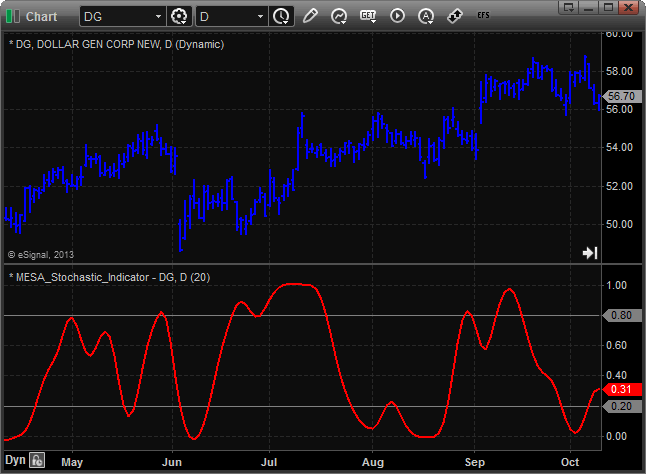
**FIGURE 2.**


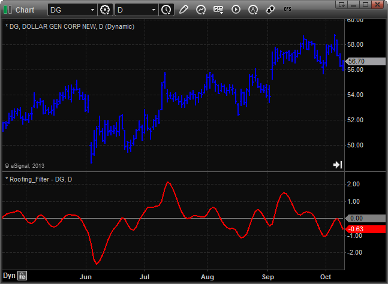
**FIGURE 3.**


```
/*********************************
Provided By:
    Interactive Data Corporation (Copyright © 2013)
    All rights reserved. This sample eSignal Formula Script (EFS)
    is for educational purposes only. Interactive Data Corporation
    reserves the right to modify and overwrite this EFS file with
    each new release.

Description:
    Stochastic Indicator by John F. Ehlers

Formula Parameters:                     Default:
Length                                  20

Version:            1.00  11/07/2013

Notes:
    The related article is copyrighted material. If you are not a subscriber
    of Stocks & Commodities, please visit www.traders.com.

**********************************/

var fpArray = new Array();

function preMain()
{
    setStudyTitle("MESA_Stochastic_Indicator");

    setCursorLabelName("BandLine1", 0);
    setCursorLabelName("BandLine2", 1);
    setCursorLabelName("MyStochastic", 2);

    setDefaultBarFgColor(Color.grey, 0);
    setDefaultBarFgColor(Color.grey, 1);
    setDefaultBarFgColor(Color.red, 2);

    setDefaultBarThickness(1, 0);
    setDefaultBarThickness(1, 1);
    setDefaultBarThickness(2, 2);

    setShowCursorLabel(false, 0);
    setShowCursorLabel(false, 1);
    setShowCursorLabel(true, 2);

    var x = 0;

    fpArray[x] = new FunctionParameter("fpLength", FunctionParameter.NUMBER);
    with(fpArray[x++])
    {
        setName("Length");
        setLowerLimit(2);
        setDefault(20);
    }
}

var bInit = false;
var bVersion = null;

var xHP = null;
var xFilt = null;
var xStoc = null;
var xMyStochastic = null;

var nBandLine1 = 0;
var nBandLine2 = 0;

function main(fpLength)
{
    if (bVersion == null) bVersion = verify();
    if (bVersion == false) return;

    if (!bInit)
    {
        xHP = efsInternal("Calc_HPSeries");
        xFilt = efsInternal("Calc_FiltSeries", xHP);
        xStoc = efsInternal("Calc_Stoc", xFilt, fpLength);
        xMyStochastic = efsInternal("Calc_MyStochastic", xStoc);

        nBandLine1 = 0.8;
        nBandLine2 = 0.2;

        bInit = true;
    }

    var nMyStochastic = xMyStochastic.getValue(0);

    return [nBandLine1, nBandLine2, nMyStochastic];
}

var xClose = null;

var alpha1 = 0;

function Calc_HPSeries()
{
    if (getBarState() == BARSTATE_ALLBARS)
    {
        xClose = close();

        alpha1 = (Math.cos((.707*360 / 48) * Math.PI / 180) +
                  Math.sin((.707*360 / 48) * Math.PI / 180) - 1) /
                  Math.cos((.707*360 / 48) * Math.PI / 180);
    }

    var nClose_0 = xClose.getValue(0);
    var nClose_1 = xClose.getValue(-1);
    var nClose_2 = xClose.getValue(-2);

    if (nClose_1 == null || nClose_2 == null)
        return;

    var nHP_1 = ref(-1);
    var nHP_2 = ref(-2);

    var nReturnValue = (1 - alpha1 / 2) * (1 - alpha1 / 2) * (nClose_0 - 2 * nClose_1 + nClose_2)
                       + 2 * (1 - alpha1) * nHP_1 - (1 - alpha1) * (1 - alpha1) * nHP_2;

    return nReturnValue;
}

var a1 = 0;
var b1 = 0;
var c1 = 0;
var c2 = 0;
var c3 = 0;

function Calc_FiltSeries(xHP)
{
    if (getBarState() == BARSTATE_ALLBARS)
    {
        a1 = Math.exp(-1.414 * 3.14159 / 10);
        b1 = 2 * a1 * Math.cos((1.414 * 180 / 10)* Math.PI / 180);
        c2 = b1;
        c3 = -a1 * a1;
        c1 = 1 - c2 - c3;
    }

    var nHP_0 = xHP.getValue(0);
    var nHP_1 = xHP.getValue(-1);

    if (nHP_0 == null || nHP_1 == null)
        return;

    var nFilt_1 = ref(-1);
    var nFilt_2 = ref(-2);

    var nReturnValue = c1 * (nHP_0 + nHP_1) / 2 + c2 * nFilt_1 + c3 * nFilt_2;

    return nReturnValue;
}

function Calc_Stoc(xFilt, nLength)
{
    var nFilt = xFilt.getValue(0);
    var nHighestC = xFilt.getValue(0);
    var nLowestC = xFilt.getValue(0);

    if (nHighestC == null || nLowestC == null || nFilt == null)
        return;

    for (var i = 0; i < nLength; i++)
    {
       nFilt_i = xFilt.getValue(-i);

       if (nFilt_i == null)
           return;

       if (nFilt_i > nHighestC)
           nHighestC =  nFilt_i;
       if (nFilt_i < nLowestC)
           nLowestC =  nFilt_i;
    }

    var nReturnValue = (nFilt - nLowestC) / (nHighestC - nLowestC);

    return nReturnValue;
}

function Calc_MyStochastic(xStoc)
{
    if (getBarState() == BARSTATE_ALLBARS)
    {
        a1 = Math.exp(-1.414 * 3.14159 / 10);
        b1 = 2 * a1 * Math.cos((1.414 * 180 / 10)* Math.PI / 180);
        c2 = b1;
        c3 = -a1 * a1;
        c1 = 1 - c2 - c3;
    }

    var nStoc_0 = xStoc.getValue(0);
    var nStoc_1 = xStoc.getValue(-1);

    if (nStoc_0 == null || nStoc_1 == null)
        return;

    var nMyStochastic_1 = ref(-1);
    var nMyStochastic_2 = ref(-2);

    var nReturnValue = c1 * (nStoc_0 + nStoc_1) / 2 + c2 * nMyStochastic_1 + c3 * nMyStochastic_2;

    return nReturnValue;
}

function verify()
{
    var b = false;
    if (getBuildNumber() < 779)
    {
        drawTextAbsolute(5, 35, "This study requires version 8.0 or later.",
            Color.white, Color.blue, Text.RELATIVETOBOTTOM|Text.RELATIVETOLEFT|Text.BOLD|Text.LEFT,
            null, 13, "error");
        drawTextAbsolute(5, 20, "Click HERE to upgrade.@URL=https://www.esignal.com/download/default.asp",
            Color.white, Color.blue, Text.RELATIVETOBOTTOM|Text.RELATIVETOLEFT|Text.BOLD|Text.LEFT,
            null, 13, "upgrade");
        return b;
    }
    else
    {
        b = true;
    }

    return b;
}

```


```
/*********************************
Provided By:  
    Interactive Data Corporation (Copyright � 2013) 
    All rights reserved. This sample eSignal Formula Script (EFS)
    is for educational purposes only. Interactive Data Corporation
    reserves the right to modify and overwrite this EFS file with 
    each new release. 

Description:        
    Roofing Filter by John F. Ehlers
    
Version:            1.00  11/07/2013

Notes:
    The related article is copyrighted material. If you are not a subscriber
    of Stocks & Commodities, please visit www.traders.com.

**********************************/

function preMain()
{   
    setStudyTitle("Roofing_Filter");

    setCursorLabelName("ZeroLine", 0);
    setCursorLabelName("Roofing_Filter", 1);
    
    setDefaultBarFgColor(Color.grey, 0);
    setDefaultBarFgColor(Color.red, 1);

    setDefaultBarThickness(1, 0);
    setDefaultBarThickness(2, 1);

    setShowCursorLabel(false, 0);
    setShowCursorLabel(true, 1);
}

var bInit = false;
var bVersion = null;

var xHP = null;
var xFilt = null;

function main() 
{
    if (bVersion == null) bVersion = verify();
    if (bVersion == false) return;

    if (!bInit)
    {                   
        xHP = efsInternal("Calc_HPSeries");
        xFilt = efsInternal("Calc_FiltSeries", xHP);

        bInit = true;
    }

    var nZeroLine = 0;

    var nFilt = xFilt.getValue(0);

    return [nZeroLine, nFilt];
}

var xClose = null;

var alpha1 = 0;

function Calc_HPSeries()
{
    if (getBarState() == BARSTATE_ALLBARS)
    {
        xClose = close();

        alpha1 = (Math.cos((.707*360 / 48) * Math.PI / 180) + 
                  Math.sin((.707*360 / 48) * Math.PI / 180) - 1) / 
                  Math.cos((.707*360 / 48) * Math.PI / 180);
    } 

    var nClose_0 = xClose.getValue(0);
    var nClose_1 = xClose.getValue(-1);
    var nClose_2 = xClose.getValue(-2);
    
    if (nClose_1 == null || nClose_2 == null)
        return; 
    
    var nHP_1 = ref(-1);
    var nHP_2 = ref(-2);   

    var nReturnValue = (1 - alpha1 / 2) * (1 - alpha1 / 2) * (nClose_0 - 2 * nClose_1 + nClose_2)
                       + 2 * (1 - alpha1) * nHP_1 - (1 - alpha1) * (1 - alpha1) * nHP_2;

    return nReturnValue;
}

var a1 = 0;
var b1 = 0;
var c1 = 0;
var c2 = 0;
var c3 = 0;

function Calc_FiltSeries(xHP)
{
    if (getBarState() == BARSTATE_ALLBARS)
    {
        a1 = Math.exp(-1.414 * 3.14159 / 10);
        b1 = 2 * a1 * Math.cos((1.414 * 180 / 10)* Math.PI / 180);
        c2 = b1;
        c3 = -a1 * a1;
        c1 = 1 - c2 - c3;
    } 

    var nHP_0 = xHP.getValue(0);
    var nHP_1 = xHP.getValue(-1);

    if (nHP_0 == null || nHP_1 == null)
        return; 

    var nFilt_1 = ref(-1);
    var nFilt_2 = ref(-2);

    var nReturnValue = c1 * (nHP_0 + nHP_1) / 2 + c2 * nFilt_1 + c3 * nFilt_2;

    return nReturnValue;
}

function verify() 
{
    var b = false;
    if (getBuildNumber() < 779) 
    {
        drawTextAbsolute(5, 35, "This study requires version 8.0 or later.", 
            Color.white, Color.blue, Text.RELATIVETOBOTTOM|Text.RELATIVETOLEFT|Text.BOLD|Text.LEFT,
            null, 13, "error");
        drawTextAbsolute(5, 20, "Click HERE to upgrade.@URL=https://www.esignal.com/download/default.asp", 
            Color.white, Color.blue, Text.RELATIVETOBOTTOM|Text.RELATIVETOLEFT|Text.BOLD|Text.LEFT,
            null, 13, "upgrade");
        return b;
    } 
    else 
    {
        b = true;
    }

    return b;
}

```


```
/*********************************
Provided By:  
    Interactive Data Corporation (Copyright � 2013) 
    All rights reserved. This sample eSignal Formula Script (EFS)
    is for educational purposes only. Interactive Data Corporation
    reserves the right to modify and overwrite this EFS file with 
    each new release. 

Description:        
    The Super Smoother Filter by John F. Ehlers
    
Version:            1.00  11/07/2013

Notes:
    The related article is copyrighted material. If you are not a subscriber
    of Stocks & Commodities, please visit www.traders.com.

**********************************/

function preMain()
{   
    setStudyTitle("SuperSmoother_Filter");
}

var bInit = false;
var bVersion = null;

var xFilt = null;

function main() 
{
    if (bVersion == null) bVersion = verify();
    if (bVersion == false) return;

    if (!bInit)
    {                   
        xFilt = efsInternal("Calc_FiltSeries");

        bInit = true;
    }

    var nFilt = xFilt.getValue(0);

    return nFilt;
}

var xClose = null;

var a1 = 0;
var b1 = 0;
var c1 = 0;
var c2 = 0;
var c3 = 0;

function Calc_FiltSeries()
{
    if (getBarState() == BARSTATE_ALLBARS)
    {
        xClose = close();

        a1 = Math.exp(-1.414 * 3.14159 / 10);
        b1 = 2 * a1 * Math.cos((1.414 * 180 / 10) * Math.PI / 180);
        c2 = b1;
        c3 = -a1 * a1;
        c1 = 1 - c2 - c3;
    } 

    var nClose_0 = xClose.getValue(0);
    var nClose_1 = xClose.getValue(-1);

    if (nClose_1 == null)
        return; 

    var nFilt_1 = ref(-1);
    var nFilt_2 = ref(-2);  

    var nReturnValue = c1 * (nClose_0 + nClose_1) / 2 + c2 * nFilt_1 + c3 * nFilt_2;

    return nReturnValue;
}

function verify() 
{
    var b = false;
    if (getBuildNumber() < 779) 
    {
        drawTextAbsolute(5, 35, "This study requires version 8.0 or later.", 
            Color.white, Color.blue, Text.RELATIVETOBOTTOM|Text.RELATIVETOLEFT|Text.BOLD|Text.LEFT,
            null, 13, "error");
        drawTextAbsolute(5, 20, "Click HERE to upgrade.@URL=https://www.esignal.com/download/default.asp", 
            Color.white, Color.blue, Text.RELATIVETOBOTTOM|Text.RELATIVETOLEFT|Text.BOLD|Text.LEFT,
            null, 13, "upgrade");
        return b;
    } 
    else 
    {
        b = true;
    }

    return b;
}

```


## THINKORSWIM: January 2014

In �Predictive And Successful Indicators� in this issue, author
  John Ehlers presents another innovative way to eliminate noise from classic
  indicators and introduces some new smoothing indicators. For thinkorswim users,
  we have created three new studies and a strategy in our proprietary scripting
  language, thinkScript. You can adjust the parameters within theedit studieswindow
  to fine-tune your variables.

FIGURE 4: THINKORSWIM. A sample chart of IBM displays
    the roofing indicator and John Ehlers� MESA Stochastic indicator described
    in his article in this issue.

Thinkorswim users can find the formulas for each indicator below:

�thinkorswimA division of TD Ameritrade, Inc.www.thinkorswim.com

BACK TO LIST


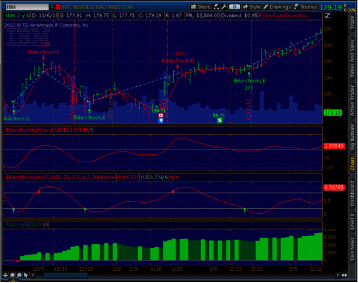
**FIGURE 4.**


## METASTOCK: January 2014

John Ehlers� article in this issue, �Predictive And Successful
  Indicators,� presents the reader with three new indicators. The MetaStock
  formulas for these indicators are given here:

�William GolsonMetaStock Technical Supportwww.metastock.com

BACK TO LIST


```metastock

SuperSmoother filter:
a1:= Exp(-1.414 * 3.14159 / 10);
b1:= 2*a1 * Cos(1.414*180 /10);
c2:= b1;
c3:= -a1 * a1;
c1:= 1 - c2 - c3;
c1 * (C + Ref(C, -1))/2 + c2*PREV + c3*Ref(PREV,-1)

Roofing filter:
alpha1:= (Cos(.707*360/48) + Sin(.707*360/48) -1)/Cos(.707*360/48);
HP:= (1-alpha1/2)*(1-alpha1/2)*(C - Ref(2*C,-1) + Ref(C,-2)) + 
2*(1-alpha1)*PREV - (1-alpha1)*(1-alpha1)*Ref(PREV,-1);
a1:= Exp(-1.414 * 3.14159 / 10);
b1:= 2*a1 * Cos(1.414*180 /10);
c2:= b1;
c3:= -a1 * a1;
c1:= 1 - c2 - c3;
c1 * (HP + Ref(HP, -1))/2 + c2*PREV + c3*Ref(PREV,-1)

MESA Stochastic:
alpha1:= (Cos(.707*360/48) + Sin(.707*360/48) -1)/Cos(.707*360/48);
HP:= (1-alpha1/2)*(1-alpha1/2)*(C - Ref(2*C,-1) + Ref(C,-2)) + 
2*(1-alpha1)*PREV - (1-alpha1)*(1-alpha1)*Ref(PREV,-1);
a1:= Exp(-1.414 * 3.14159 / 10);
b1:= 2*a1 * Cos(1.414*180 /10);
c2:= b1;
c3:= -a1 * a1;
c1:= 1 - c2 - c3;
filt:= c1 * (HP + Ref(HP, -1))/2 + c2*PREV + c3*Ref(PREV,-1);
stoc:= (filt-LLV(filt,20))/(HHV(filt,20)-LLV(filt,20));
c1 * (stoc + Ref(stoc, -1))/2 + c2*PREV + c3*Ref(PREV,-1);


```


## WEALTH-LAB: January 2014

In his article in this issue, �Predictive And Successful Indicators,� author
  John Ehlers presents two new indicators: theSuperSmoother filter,
  which is superior to moving averages for removing aliasing noise, and theMESA
  Stochasticoscillator, a stochastic successor that removes the effect
  of spectral dilation through the use of a roofing filter.

To demonstrate the effects of using the new indicators, Ehlers introduces
  a simple countertrend system that goes long when MESA Stochastic crosses below
  the oversold value and reverses the trade by taking a short position when the
  oscillator exceeds the overbought threshold.

To execute the trading system that Ehlers includes in his article, Wealth-Lab
  users need to install (or update) the latest version of our TASCIndicators
  library from the Extensions section of our website if they haven�t already
  done so, and restart Wealth-Lab.

A sample chart is shown in Figure 5.

FIGURE 5: WEALTH-LAB. Here is a sample Wealth-Lab 6 chart
    illustrating application of the system�s rules on a daily chart of
    USD/CHF (US dollar to Swiss franc exchange rate).

�Wealth-Lab teamMS123, LLCwww.wealth-lab.com

BACK TO LIST


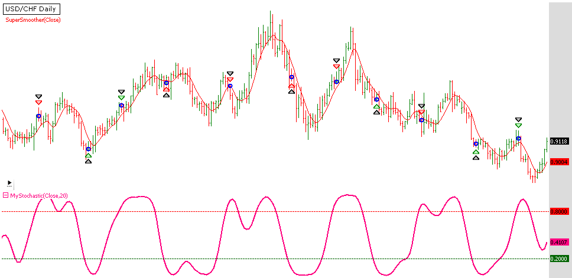
**FIGURE 5.**


```csharp

Wealth-Lab 6 strategy code (C#):


using System;
using System.Collections.Generic;
using System.Text;
using System.Drawing;
using WealthLab;
using WealthLab.Indicators;
using TASCIndicators;

namespace WealthLab.Strategies
{
	public class Ehlers201401 : WealthScript
	{
		private StrategyParameter paramPeriod;
		
		public Ehlers201401()
		{
			paramPeriod = CreateParameter("MESAStoch.Period",20,5,100,5);
		}
		
		protected override void Execute()
		{
			int period = paramPeriod.ValueInt;
			RoofingFilter rf = RoofingFilter.Series(Close);
			MESAStochastic ms = MESAStochastic.Series(Close,period);
			
			for(int bar = period; bar < Bars.Count; bar++)
			{
				// Detect crossover/crossunder and store state in a variable
				bool maXo = CrossOver(bar, ms, 0.8);
				bool maXu = CrossUnder(bar, ms, 0.2);
					
				// The first trade
				if (Positions.Count == 0){
					if ( maXu ) 
						BuyAtMarket( bar + 1 );
					else if( maXo )
						ShortAtMarket( bar + 1 );
				}
					// Subsequent trades
				else 
				{
					Position p = LastPosition;				
					if ( p.PositionType == PositionType.Long ) 
					{
						if ( maXo ) 
						{
							SellAtMarket( bar + 1, p );
							ShortAtMarket( bar + 1 );
						}
					}
					else if ( maXu ) 
					{
						CoverAtMarket( bar + 1, p );
						BuyAtMarket( bar + 1 );
					}
				}	
			}

			HideVolume();
			ChartPane pMS = CreatePane(40,false,true);
			ChartPane pRF = CreatePane(20,true,true);
			PlotSeries(PricePane,SuperSmoother.Series(Close),Color.Red,LineStyle.Solid,1);
			PlotSeries(pRF,rf,Color.FromArgb(255,0,0,139),LineStyle.Solid,1);
			PlotSeries(pMS,ms,Color.FromArgb(255,255,0,128),LineStyle.Solid,2);
			DrawHorzLine(pMS,0.8,Color.Red,LineStyle.Dashed,1);
			DrawHorzLine(pMS,0.2,Color.DarkGreen,LineStyle.Dashed,1);
		}
	}
}


```


## AMIBROKER: January 2014

In �Predictive And Successful Indicators� in this issue, author
  John Ehlers presents his SuperSmooth filter and uses it to create a better
  stochastic indicator.

Ready-to-use AmiBroker code for the indicator is shown below. Note that SuperSmooth
  filter and high-pass filter have been written as reusable, general-purpose
  functions so users can easily include them in their own systems and/or indicators.
  To display the indicators on a chart, simply input or paste the code into the
  formula editor and pressapply indicator. To backtest a trading system,
  choosebacktestfromToolsmenu in the formula editor.

A sample chart is shown in Figure 6.

FIGURE 6: AMIBROKER. Here is a sample price chart of
    DG with a SuperSmoothed stochastic indicator.

�Tomasz Janeczko, AmiBroker.comwww.amibroker.com

BACK TO LIST


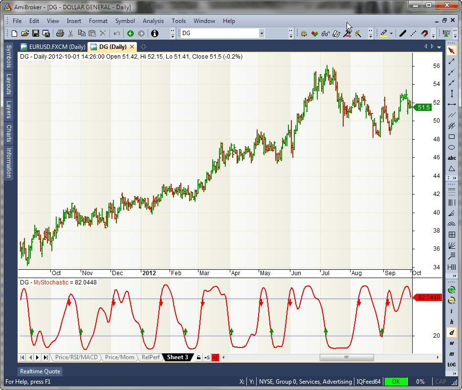
**FIGURE 6.**


```afl

PI = 3.1415926; 
SQ2 = sqrt( 2 ); 

function SuperSmoother( array, periods ) 
{ 
    a1 = exp( -SQ2 * PI / periods ); 
    b1 = 2 * a1 * cos( SQ2 * PI / periods ); 
    c2 = b1; 
    c3 = -a1 * a1; 
    c1 = 1 - c2 - c3; 

    Filt = Nz( array ); 

    for ( i = 2; i < BarCount; i++ ) 
    { 
         Filt[ i ] = c1 * ( array[ i ] + array[ i - 1 ] ) / 2 + 
                     c2 * Filt[ i - 1 ] + 
                     c3 * Filt[ i - 2]; 
    } 

    return Filt; 
} 

function HighpassFilter( array, periods ) 
{ 
    alpha1 = ( cos( SQ2 * PI / periods ) + sin ( SQ2 * PI / periods ) - 1 ) /  cos( SQ2 * PI / periods ); 

    HP = Nz( array ); 

    C1 = ( 1 - alpha1 / 2 ) ^ 2; 
    C2 = 2 * ( 1 - alpha1 ); 
    C3 = - ( ( 1 - alpha1 ) ^ 2 ); 

    for ( i = 2; i < BarCount; i++ ) 
    { 
        HP[ i ] =  C1 * ( array[ i ] - 2 * array[i-1] + array[i-2] ) + 
                   C2 * HP[ i - 1] + 
                   C3 * HP[ i - 2]; 
    } 

    return HP; 
} 

ss = SuperSmoother( HighpassFilter( Close, 48 ), 10 ); 

Length = 20; 


HighestC = HHV( ss, Length ); 
LowestC = LLV( ss, Length ); 

Stoc = ( ss - LowestC ) / ( HighestC - LowestC ); 

MyStochastic = 100 * SuperSmoother( Stoc, 10 ); 

Plot( MyStochastic, "MyStochastic", colorRed, styleThick ); 
PlotGrid( 20, colorBlue ); 
PlotGrid( 80, colorBlue ); 

Buy = Cross( 20, MyStochastic ); 
Sell = Cross( MyStochastic, 80 ); 

Buy = ExRem( Buy, Sell ); 
Sell = ExRem( Sell, Buy ); 
PlotShapes( Buy * shapeUpArrow, colorGreen, 0, 20, 8 ); 
PlotShapes( Sell * shapeDownArrow, colorRed, 0, 80, 8 );


```


## NEUROSHELL TRADER: January 2014

John Ehlers� SuperSmoother filter, roofing filter, and MESA Stochastic
  indicator presented in his article in this issue, �Predictive And Successful
  Indicators,� can be easily implemented in NeuroShell Trader using NeuroShell
  Trader�s ability to call external dynamic linked libraries. Dynamic linked
  libraries can be written in C, C++, Power Basic, or Delphi.

After moving the EasyLanguage code provided in Ehlers� article to your
  preferred compiler and creating a DLL, you can insert the resulting indicators
  as follows:

Dynamic trading systems can be easily created in NeuroShell Trader by combining
  the MESA Stochastic indicator with NeuroShell Trader�s genetic optimizer
  to find optimal lengths. Similar filter and cycle-based strategies can also
  be created using indicators found in John Ehlers� Cybernetic and MESA91
  NeuroShell Trader add-ons. Users of NeuroShell Trader can go to the STOCKS & COMMODITIES
  section of the NeuroShell Trader free technical support website to download
  a copy of this or any previous Traders� Tips.

A sample chart is shown in Figure 7.

FIGURE 7: NEUROSHELL TRADER. This NeuroShell Trader chart
    displays John Ehlers� SuperSmoother filter, roofing filter, and MESA
    Stochastic indicator.

�Marge Sherald, Ward Systems Group, Inc.301 662-7950,sales@wardsystems.comwww.neuroshell.com

BACK TO LIST


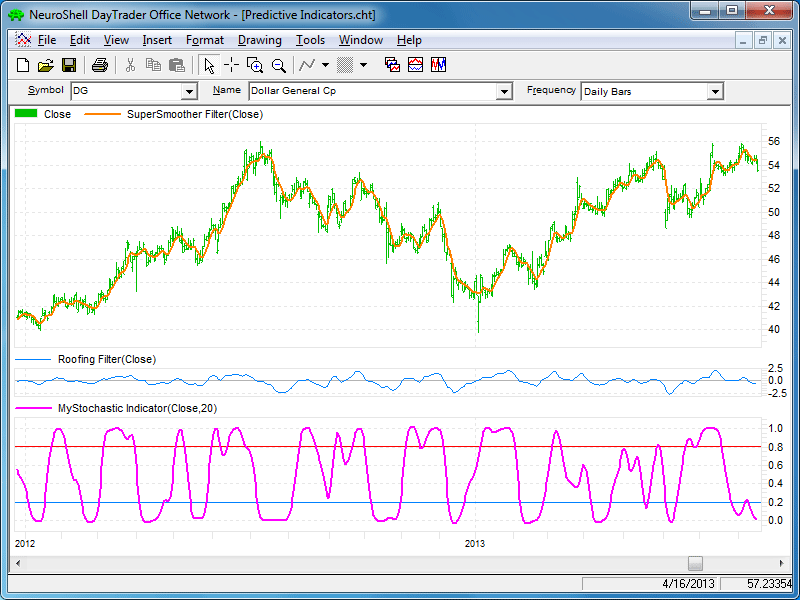
**FIGURE 7.**


## AIQ: January 2014

This Traders� Tip is based on Ajay Pankhania�s September 2013
  article in STOCKS & COMMODITIES, �Muscle
  Up Those Averages.�

The AIQ code for the moving averages and the MACD indicator discussed in the
  article is provided atwww.TradersEdgeSystems.com/traderstips.htm.

This code may be useful to beginning AIQ Expert Design Studio users since
  it illustrates how to code multiple versions of the simple and the exponential
  moving averages as well as the MACD indicator. In addition, I have coded the
  simple moving average crossover system and the MACD crossover system.

The code and EDS file can be downloaded fromwww.TradersEdgeSystems.com/traderstips.htm.

�Richard Denninginfo@TradersEdgeSystems.comfor AIQ Systems

BACK TO LIST


## TRADERSSTUDIO: January 2014

The TradersStudio code based on John Ehlers� article in this issue, �Predictive
  And Successful Indicators,� is provided at the following websites:

The following code files are provided in the download:

FIGURE 8: TRADERSSTUDIO, FUTURES CONTRACT. Here is a
    sample chart of the S&P 500 futures contract with the three indicators
    described by John Ehlers in his article in this issue, SuperSmoothing, roofing,
    and MESA Stochastic.

In Figure 8, I show a chart of the S&P 500 futures contract using Pinnacle
  Data, symbol �SP,� with the three indicators discussed by Ehlers
  in his article. In the main panel, we see the SuperSmoother filter using the
  close as the price input. In the second panel, we see the MESA Stochastic indicator,
  and in the bottom panel, we see the roofing filter. In Figure 9, I show the
  equity curve and underwater equity curve for the example system I wrote trading
  one contract, long only.

FIGURE 9: TRADERSSTUDIO, EQUITY CURVE. Here are equity
    and underwater curves for the example system I wrote trading one contract
    of the SP long-only.

�Richard Denninginfo@TradersEdgeSystems.comfor TradersStudio

BACK TO LIST


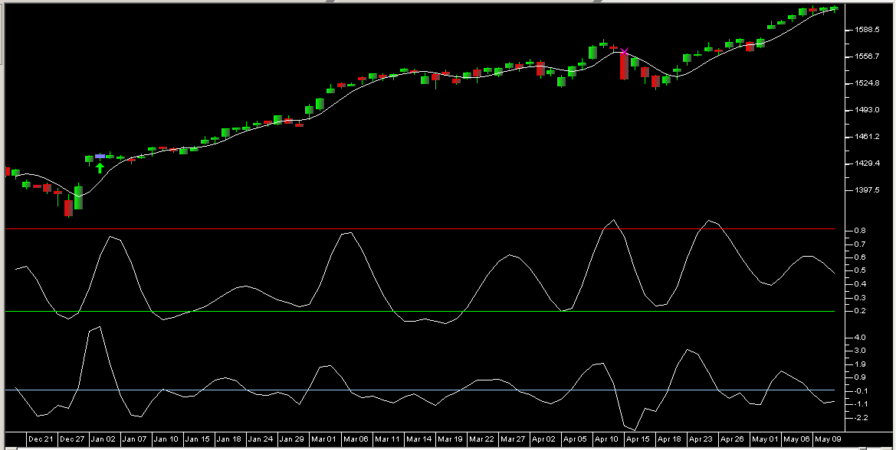
**FIGURE 8.**


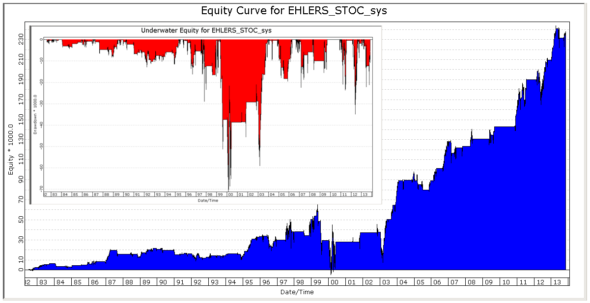
**FIGURE 9.**


```basic
'PREDICTIVE INDICATORS FOR EFFECTIVE TRADING STRATEGIES
'Author: John Ehlers, TASC January 2014
'Coded by: Richard Denning 11/02/2013
'www.TradersEdgeSystems.com

'SuperSmoother filter
' 2013 John F. Ehlers
Function SUPSMO(Price As BarArray)
Dim a1, b1, c1, c2, c3, Filt As BarArray
a1 = Exp(-1.414*3.14159 / 10)
b1 = 2*a1*Cos(DegToRad(1.414*180 / 10))
c2 = b1
c3 = -a1*a1
c1 = 1 - c2 - c3
Filt = c1*(Price + Price[1]) / 2 + c2*Filt[1] + c3*Filt[2]
SUPSMO = Filt
End Function
'----------------------------------------------------------
'Roofing filter
' 2013 John F. Ehlers
Function ROOF(Price As BarArray)
Dim alpha1
Dim HP As BarArray
'Highpass filter cyclic components whose periods are shorter than 48 bars
  alpha1 = (Cos(DegToRad(.707*360 / 48) + Sin(DegToRad(.707*360 / 48) - 1))) /Cos(DegToRad(.707*360 / 48))
  HP = (1 - alpha1 / 2)*(1 - alpha1 /2)*(Price - 2*Price[1] + Price[2]) + 2*(1 - alpha1)*HP[1] - (1 - alpha1)*(1 - alpha1)*HP[2]
'Smooth with a Super Smoother Filter
  'assert(false)
  ROOF = SUPSMO(HP)
  End Function
'----------------------------------------------------------
'MesaStochastic Indicator
' 2013 John F. Ehlers
Function MESASTOC(Price as bararray,stoLen)
  Dim count  
  Dim HighestC As BarArray
  Dim LowestC As BarArray
  Dim stoc As BarArray
  Dim filtSmoPrice As BarArray
  Dim myStochastic As BarArray

'Highpass filter cyclic components whose periods are shorter than 48 bars 
' then smooted with a super smother filter
  filtSmoPrice = ROOF(Price)
  HighestC = filtSmoPrice
  LowestC = filtSmoPrice
  For count = 0 To stoLen - 1 
    If filtSmoPrice[count] > HighestC Then HighestC = filtSmoPrice[count]
    If filtSmoPrice[count] < LowestC Then LowestC = filtSmoPrice[count]
  Next
  stoc = (filtSmoPrice - LowestC) / (HighestC - LowestC)
'Smooth with a Super Smoother Filter
  myStochastic = SUPSMO(stoc)
MESASTOC = myStochastic
End Function
'----------------------------------------------------------
'Indicator plot for SuperSmoother Filter
Sub EHLERS_SUPSMO_IND()
Plot1(SUPSMO(Close))
End Sub
'-----------------------------------------------------------
'Indicator plot for Roofing Filter
Sub EHLERS_ROOF_IND()
plot1(ROOF(Close))
plot2(0)
End Sub
'------------------------------------------------------------
'MesaStochastic Indicator Plot
' 2013 John F. Ehlers
Sub EHLERS_MESASTOC_IND(stoLen)
  Plot1(MesaStoc(Close,stoLen))
  Plot2(.8)
  Plot3(.2)
End Sub
'-----------------------------------------------------------
'Example of how one micht use Ehler's MesaStochastic Indicator in a system (long only)
Sub EHLERS_MESASTOC_SYS(stoLen,upperVal,lowerVal,trndLen)
  'default parameter values: stoLen=20,upperVal=0.8,lowerVal=0.2,trndLen=25
  Dim smoFiltSto
  Dim smoFiltClose As BarArray
  smoFiltSto = MESASTOC(Close,stoLen)
  smoFiltClose = SUPSMO(Close)
  'buy and exit rules (long only system)
    If CrossesOver(smoFiltSto , lowerVal) And smoFiltClose > smoFiltClose[trndLen] Then Buy("LE",1,0,Market,Day)
    If CrossesOver(smoFiltSto, upperVal) Then ExitLong("LXob","",1,0,Market,Day)
End Sub

'------------------------------------------------------------

```


## NINJATRADER: January 2014

The MESA Stochastic, as discussed in �Predictive And Successful Indicators� in
  this issue by John Ehlers, has been implemented as an indicator available for
  download atwww.ninjatrader.com/SC/January2014SC.zip.

Once it has been downloaded, from within the NinjaTrader Control Center window,
  select the menu File → Utilities → Import NinjaScript and select
  the downloaded file. This file is for NinjaTrader version 7 or greater.

You can review the strategy source code by selecting the menu Tools → Edit
  NinjaScript → Indicator from within the NinjaTrader Control Center window
  and selecting the �MESA Stochastic� file.

NinjaScript uses compiled DLLs that run native, not interpreted, which provides
  you with the highest performance possible.

A sample chart implementing the strategy is shown in Figure 10.

FIGURE 10: NINJATRADER. This screenshot shows the MESA
    Stochastic applied to a 15-minute chart of the S&P 500 index CFD.

�Raymond Deux & Cal HueberNinjaTrader, LLCwww.ninjatrader.com

BACK TO LIST


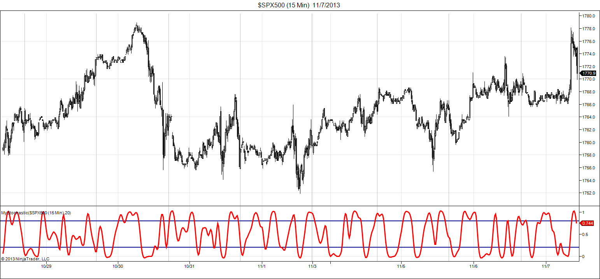
**FIGURE 10.**

NinjaTrader source code: [ninja-trader/MyStochastic.cs](ninja-trader/MyStochastic.cs)

## UPDATA: January 2014

This tip is based on �Predictive And Successful Indicators� by
  John Ehlers in this issue. In the article, Ehlers seeks to develop a filter
  with the optimum smoothing and minimal lag effect, and which mitigates the
  fractal distortion of the underlying data. A stochastic measure is applied
  to the resultant series to create an oscillator such that values 0.2 and 0.8
  become extremes from which entry signals may be generated. (See Figure 11.)

FIGURE 11: UPDATA. This chart shows the stochastic indicator-based
    system with 0.8/0.2 crossing entries, as applied to Dollar General, in daily
    resolution data.

The Updata code based on this article is in the Updata Library and may be
  downloaded by clicking thecustom menuandsystem library.
  The code is also shown below and can be pasted into the Updata custom editor
  and saved.

�Updata support teamsupport@updata.co.ukwww.updata.co.uk

BACK TO LIST


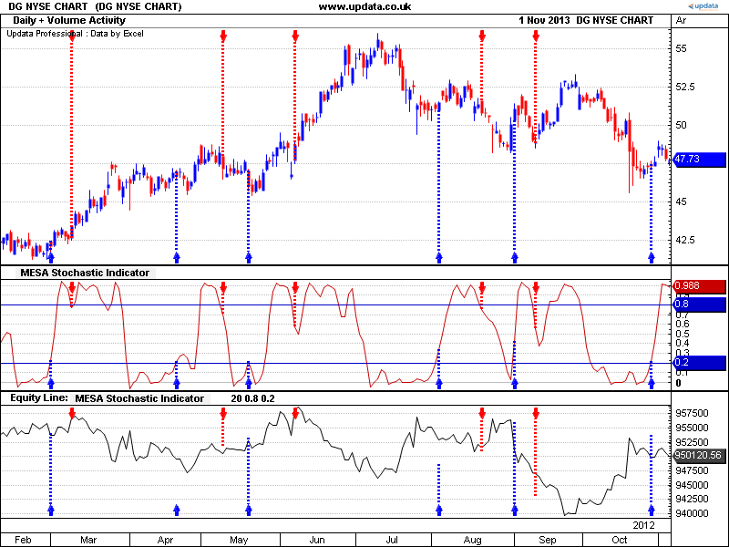
**FIGURE 11.**


```basic


'John F. Ehlers,PhD
'Stocks & Commodities Magazine,January 2014 

DISPLAYSTYLE 3LINES
INDICATORTYPE CHART  
COLOUR RGB(200,0,0)
COLOUR2 RGB(0,0,200)   
COLOUR3 RGB(0,0,200)
PARAMETER "Length" #LENGTH=20
PARAMETER "Upper" @UPPER=0.8
PARAMETER "Lower" @LOWER=0.2
NAME "MESA Stochastic Indicator" "" 
@ALPHA1=0 
@HP=0
@A1=0
@B1=0
@C1=0
@C2=0
@C3=0
@FILTER=0
@STOCHASTIC=0
@MESASTOCH=0 
FOR #CURDATE=0 TO #LASTDATE
    @ALPHA1=1+(SIN(0.707*2*CONST_PI/48)-1)/COS(0.707*2*CONST_PI/48) 
    @HP=(1-@ALPHA1/2)*(1-@ALPHA1/2)*(CLOSE-2*CLOSE(1)+CLOSE(2))+2*(1-@ALPHA1)*HIST(@HP,1)-(1-@ALPHA1)*(1-@ALPHA1)*HIST(@HP,2)
    @A1=EXP(-1.414*CONST_PI/10)
    @B1=2*@A1*COS(1.414*CONST_PI/10) 
    @C2=@B1
    @C3=-@A1*@A1
    @C1=1-@C2-@C3
    @FILTER=@C1*0.5*(@HP+HIST(@HP,1))+@C2*HIST(@FILTER,1)+@C3*HIST(@FILTER,2)  
    @STOCHASTIC=(@FILTER-PLOW(@FILTER,#LENGTH))/(PHIGH(@FILTER,#LENGTH)-PLOW(@FILTER,#LENGTH)) 
    @MESASTOCH=@C1*0.5*(@STOCHASTIC+HIST(@STOCHASTIC,1))+@C2*HIST(@STOCHASTIC,1)+@C3*HIST(@STOCHASTIC,2)  
    'OPTIONAL ENTRY RULES
    IF HASX(@MESASTOCH,@UPPER,DOWN)
       SELL CLOSE
       SHORT CLOSE 
    ELSEIF HASX(@MESASTOCH,@LOWER,UP)   
       COVER CLOSE
       BUY CLOSE
    ENDIF
    @PLOT=@MESASTOCH
    @PLOT2=@UPPER
    @PLOT3=@LOWER
NEXT


```


## TRADECISION: January 2014

In �Predictive And Successful Indicators� in this issue, author
  John Ehlers investigates predictive indicators for more effective trading strategies.
  We are providing code for the three indicators discussed in the article: the
  SuperSmoother filter, the roofing filter, and the MESA Stochastic indicator.

A sample chart plotting the indicators is shown in Figure 12.

FIGURE 12: TRADECISION. Here is a sample chart of Google
    with the roofing filter and John Ehlers� MESA Stochastic indicator
    plotted.

�Tradecision supportTradecision.com

BACK TO LIST


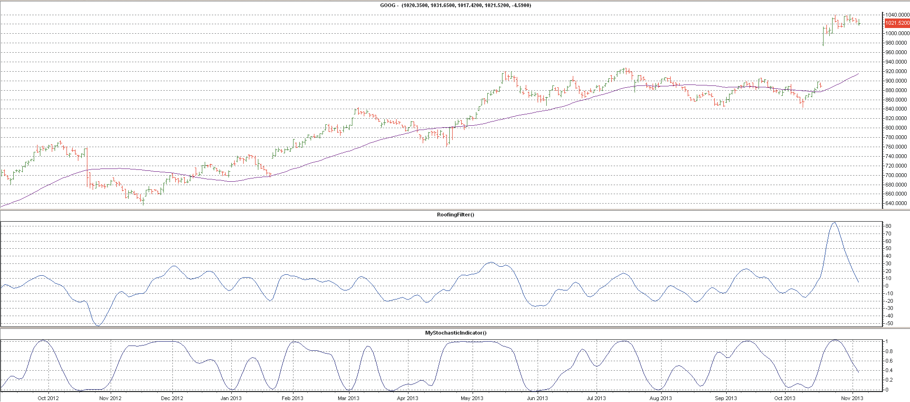
**FIGURE 12.**


```tradecision

SuperSmoother filter code:
var
a1:=0;
b1:=0;
c1:=0;
c2:=0;
c3:=0;
Filt:=0;
end_var
if HISTORYSIZE < 2 then return 0;

a1:=Exp(-1.414 * 3.14159 / 10);
b1:=2 * a1 * Cos(1.414 * 180 / 10);
c2:=b1;
c3:=-a1 * a1;
c1:=1 - c2 - c3;
Filt:=c1 * (Close + Close\1\) / 2 + c2 * Filt\1\ + c3 * Filt\2\;

return Filt;

Roofing filter code:
var
a1:=0;
b1:=0;
c1:=0;
c2:=0;
c3:=0;
alpha1:=0;
HP:=0;
Filt:=0;
end_var

if HISTORYSIZE < 2 then return 0;

alpha1:=(Cos(0.707 * 360 / 48) + Sin(0.707 * 360 / 48) - 1) / Cos(0.707 * 360 / 48);
HP:=(1 - alpha1 / 2) * (1 - alpha1 / 2) * (Close - 2 * Close\1\ + Close\2\) + 2 * (1 - alpha1) * HP\1\ - (1 - alpha1) * (1 - alpha1) * HP\2\;

a1:=Exp(-1.414 * 3.14159 / 10);
b1:=2 * a1 * Cos(1.414 * 180 / 10);
c2:=b1;
c3:=-a1 * a1;
c1:=1 - c2 - c3;
Filt:=c1 * (HP + HP\1\) / 2 + c2 * Filt\1\ + c3 * Filt\2\;

return Filt;


MESA Stochastic indicator code:
input
Length:"Enter the length:", 20;
end_in
var
a1:=0;
b1:=0;
c1:=0;
c2:=0;
c3:=0;
alpha1:=0;
HP:=0;
Filt:=0;
HighestC:=0;
LowestC:=0;
count:=0;
Stoc:=0;
MESAStochastic:=0;
end_var

if HISTORYSIZE < 2 then return 0;

alpha1:=(Cos(0.707 * 360 / 48) + Sin(0.707 * 360 / 48) - 1) / Cos(0.707 * 360 / 48);
HP:=(1 - alpha1 / 2) * (1 - alpha1 / 2) * (Close - 2 * Close\1\ + Close\2\) + 2 * (1 - alpha1) * HP\1\ - (1 - alpha1) * (1 - alpha1) * HP\2\;

a1:=Exp(-1.414 * 3.14159 / 10);
b1:=2 * a1 * Cos(1.414 * 180 / 10);
c2:=b1;
c3:=-a1 * a1;
c1:=1 - c2 - c3;
Filt:=c1 * (HP + HP\1\) / 2 + c2 * Filt\1\ + c3 * Filt\2\;

HighestC:=Filt;
LowestC:=Filt;
for count:=0 to Length - 1 do begin
	if Filt\count\ >HighestC then
		HighestC:=Filt\count\;
	if Filt\count\ < LowestC then
		LowestC:=Filt\count\;
end;

Stoc:=(Filt - LowestC) / (HighestC - LowestC);
MESAStochastic:=c1 * (Stoc + Stoc\1\) / 2 + c2 * MESAStochastic\1\ + c3 * MESAStochastic\2\;
return MESAStochastic;


```


## MICROSOFT EXCEL: January 2014

John Ehlers� formulations given in his article in this issue, �Predictive
  And Successful Indicators,� are straightforward to set up in Excel. The
  chart shown in Figure 13 approximates Ehlers� Figure 8 in his article.

FIGURE 13: EXCEL, SAMPLE SIGNALS. Here is a sample chart
    of Dollar General with predictive trade signals and one-bar delayed trades.

FIGURE 14: EXCEL, InputPriceData tab. The InputPriceData
    tab shows details of the last trade price bar in the second row. This data
    is inserted into the price history.

FIGURE 15: EXCEL, INTRADAY PRICE BAR TIME STAMP. When
    the last intraday bar (input data offset = zero) is on the chart, it will
    be displayed as �Last:� with a time stamp.

Since this indicator is built on bar closes, transactions cannot logically
  take place any sooner than the next bar. For trade simulation in this spreadsheet,
  I enter or exit trades using the open of the next bar after a signal.

This Traders� Tip also introduces a new feature of my Excel templates:
  an intraday price bar for use with daily price history downloads from Yahoo!
  Finance.

If bar 1 is an intraday bar, it will have a time stamp to the right.

The intraday bar warning only appears when the bar is on the chart (data window
  offset = zero).

The spreadsheet file for this Traders� Tip can be downloadedhere.
  To successfully download it, follow these steps:

�Ron McAllisterExcel and VBA programmerrpmac_xltt@sprynet.com

BACK TO LIST

Originally published in the January 2014 issue ofTechnical Analysis ofStocks & Commoditiesmagazine.All rights reserved. � Copyright 2013, Technical Analysis, Inc.


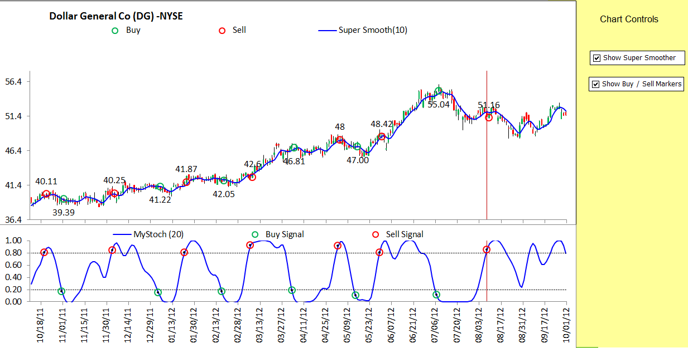
**FIGURE 13.**


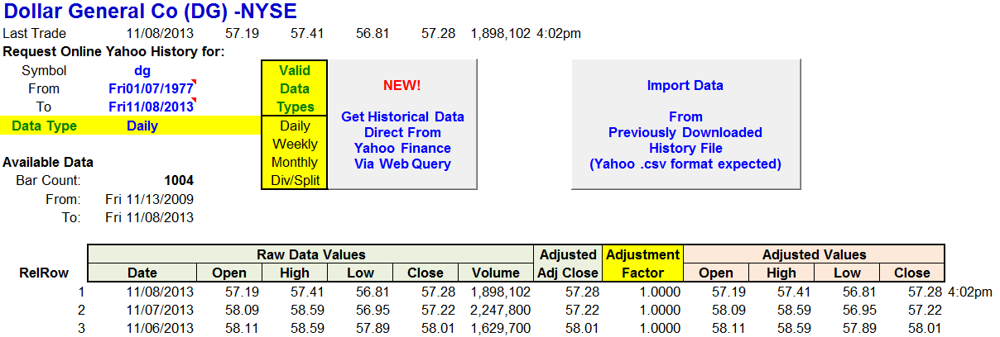
**FIGURE 14.**


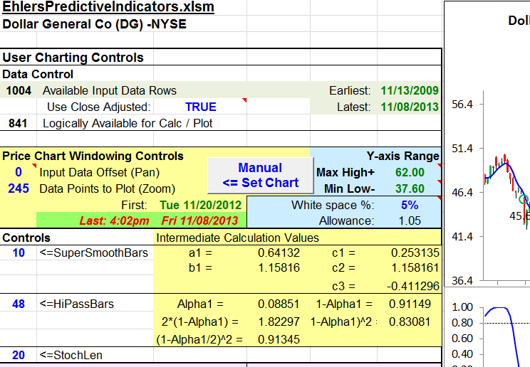
**FIGURE 15.**


---

## BibTeX

```bibtex
@misc{traders_tips_2014_01,
  author       = {{Technical Analysis of STOCKS \& COMMODITIES}},
  title        = {Traders' Tips: Predictive And Successful Indicators},
  howpublished = {online},
  year         = {2014},
  month        = jan,
  url          = {https://www.traders.com/Documentation/FEEDbk_docs/2014/01/TradersTips.html}
}
```
