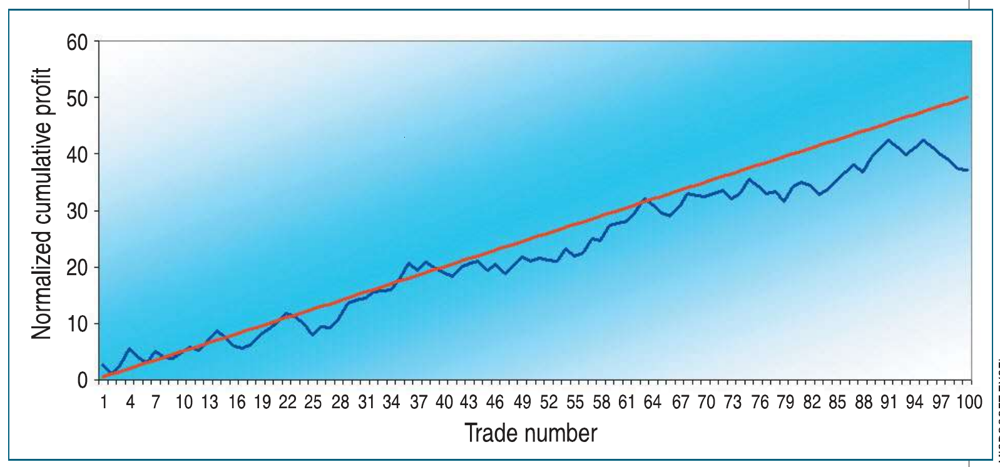
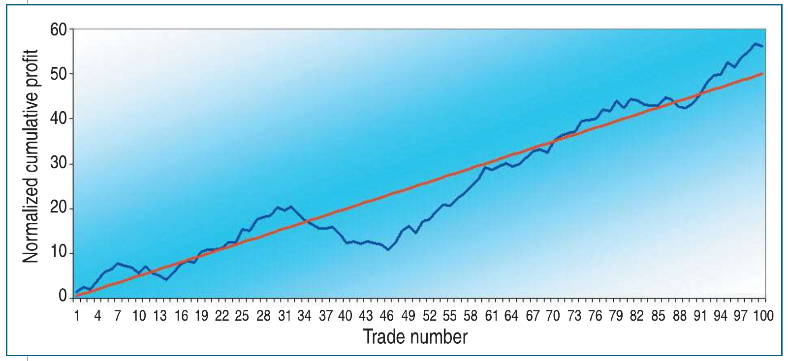
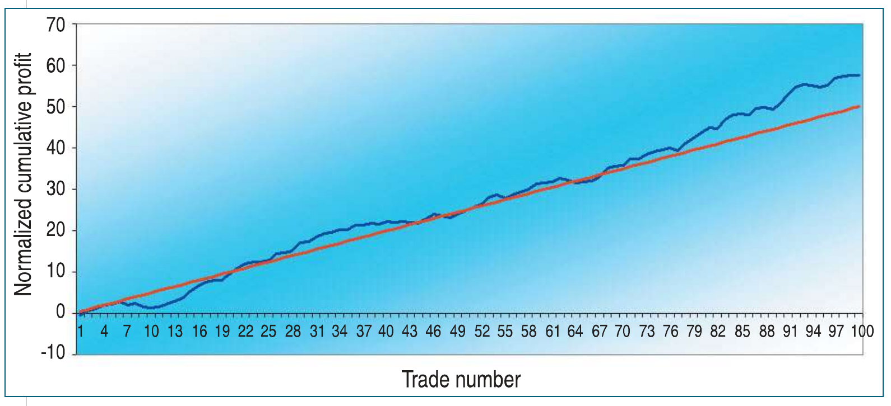
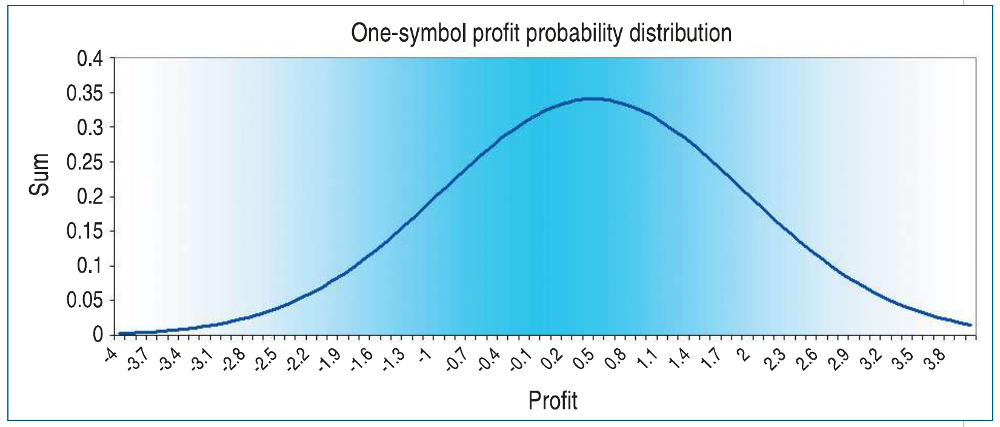
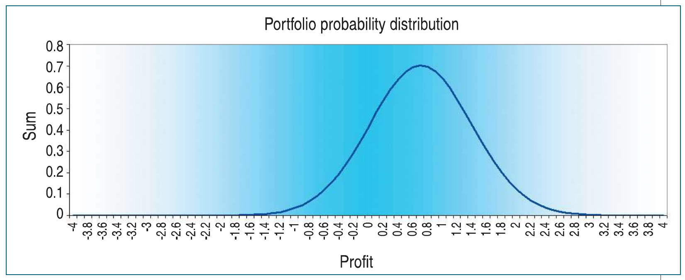
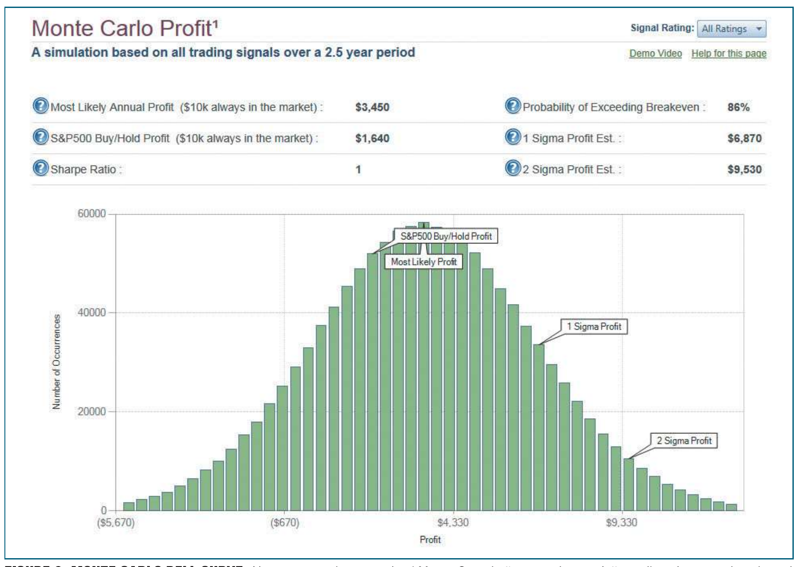

# The Real Reason Traders Lose Money (And What To Do About It)

- **Authors:** John F. Ehlers and Ric Way
- **Publication:** Technical Analysis of STOCKS & COMMODITIES, Volume 32, May 2014, pp. 34--38
- **Article URL:** [V32/C05/777EHLE.pdf](https://technical.traders.com/archive/article.asp?file=\V32\C05\777EHLE.pdf)

---

## Summary

Why do traders lose money? The answer may surprise you. Here's a look at the core of the problem and how you can arrive at a profitable strategy.

---

## Is Trading Gambling?

Most traders lose money. The reasons given cover a myriad of excuses, from poor self-esteem to poor risk control to just having the wrong trading system. While any of these may contribute to poor performance, they don't go to the heart of the matter. In this article, we will demonstrate the core of the problem using a pure mathematical approach.

We will not only show you the problem, but we'll also show you mitigating techniques that don't stress your capitalization requirements or your workload to arrive at a profitable trading strategy. In fact, depending on how you currently trade, your analysis workload can be significantly reduced.

To answer the question of whether trading is gambling, we need to first define gambling and who the winners and losers are. In Las Vegas, there is no question that the house is invariably the winner. How else can they afford all the neon lights and attractions? They win because the odds of the game are in their favor. Take a simple roulette bet as an example. The roulette wheel has 36 numbers. Half are black and half are red. If you bet on red or black, the payout is 1. That would make it a fair game, all other things being equal. However, in American roulette there is also a green "0" pocket and a green "00" pocket. These two extra pockets are neither red nor black. Having two pockets that are neither red nor black changes the odds to be 1.111-to-1 that the house will win. Of course, there are lots of other bets that can be placed, but each of those bets will have a payout combination, and the odds of hitting that combination will be in favor of the house. Even with small odds, based on the payout and percentage winners, the house ultimately will win over a large number of bets. That is their advantage. The casinos are open 24/7 and cover a huge number of bets.

Let's take the perspective that trading is analogous to gaming (not gambling). In evaluating trading performance, *profit factor* is the ratio of gross winnings to gross losses. In this sense, profit factor is analogous to the payout in gaming. *Percent winning trades* is exactly the same as percent winners in gaming. Therefore, since you know the profit factor and percent winning trades, you have all the necessary tools to statistically examine trading performance.

By examining trading performance statistically as a random process as you would in gaming, you have eliminated a wide range of causality, such as the vagaries of a particular trading system, trading psychology, and market conditions such as efficiency or trends. Only profit factor and percent winning trades enter into the analysis. This is the advantage of the gaming perspective.

## The Gaming Analysis

It is possible to perform the gaming analysis in an Excel spreadsheet. The basic idea of the spreadsheet is that column A consists of independent random numbers that vary between zero and 1. Starting at row 5, each row in column B contains a conditional statement that holds that if the random number is equal to or less than the probability of a winning trade, we will assign the profit of the trade to be the profit factor in column C. Otherwise, if the random number is greater than the probability of a winning trade, we assign the profit of the trade to be -1 in column C. Then, all we have to do is calculate a running sum of profits in column D, and column D becomes our statistical equity curve. The parameter, *percent winners*, is entered in cell B1 and the parameter *profit factor* is entered in cell B2. This positioning enables the entire spreadsheet to be recalculated for user-selected values of the parameters. In addition, the entire spreadsheet can be recalculated for a given pair of parameters multiple times just by pressing the F9 key for each recalculation.

The average profit per trade is defined by the *gross winnings* less the *gross losses* divided by the total number of trades. With a little algebra, which is shown in the sidebar "Computing The Average Trade," the average profit per trade is also equal to the profit factor minus 1 multiplied by 1 minus the percent winners. The cumulative profit per trade is plotted along with the randomized equity curve as a reference of relative performance.

## Fine-Tuning the Simulation

Gaming provides a fixed payout and a known loss. Trading is different because each winning trade is likely to have a different profit, and the amount of the loss is also variable with each trade. The trading situation is more closely simulated by having the trade profit randomized and having each loss randomized. This randomization is done such that the average winning trade value is still the profit factor and the average loss is still -1. The process is to randomly assign a loss between zero and -2. The trade profit is randomly assigned a value between zero and twice the profit factor. In sheet 2 of the workbook, in cell B5, for example, the conditional statement becomes `=IF(A5<$B$1/100, RAND()*2*$B$2, -RAND()*2)`.

Figure 1 shows the results of the simulation as an equity curve taken over 100 trades. If you assume you have a swing trading system that trades about twice a month, this would represent about four years of trading. The assumed values were profit factor = 1.5 and percent winners = 60. These values represent a pretty good trading system, where the trades are taken out-of-sample. (Using in-sample data is just plain cheating). The normalized average profit per trade is 0.5, and the red line is the cumulative profit if you assumed you made the average profit on each and every trade. The red line is simply a reference for the randomized simulated equity curve shown as the blue line.

You get a new equity curve for the same input parameters each time you press the F9 key. This way, you can create multiple track records for what amounts to be the exact same trading system because you are using the same descriptive parameters.


**FIGURE 1: SIMULATION RESULTS AS EQUITY CURVE.** Here you see a typical equity curve for a system where the profit factor equals 1.5 and percent winners is 60%.

## Computing the Average Trade

```
Avg. trade = T

         = ($W - $L) / (#W + #L)

         = (($W/$L) - 1) / ((#W + #L) / $L)

         = (PF - 1) / ((#W + #L) / $L)

and, since $L / #L = 1

         = (PF - 1) / ((#W + #L) / #L)

         = (PF - 1) × (1 - %)
```

## Here's Why Traders Lose Money

The real question is why most traders lose money when the payout and percent winners are so heavily in their favor.

By pressing F9 again, you can create another typical equity curve, as shown in Figure 2. This time, the equity curve shows a substantial drawdown between trade 31 and trade 60. If the chart represents four years of trading, the drawdown period extends for more than a year! Further, the deepest part of the drawdown is about 20% of the net profits garnered over the entire four-year period. As a practical matter, no trader is equipped to stay with the system through this period of adversity. The trader is undercapitalized and gets wiped out or gets discouraged and moves on to another system, where the process is probably repeated.

These results can easily happen even when using a good system. Imagine what the results can be with a lower-quality system having, say, a profit factor of 1.3 and 55% winners. You can replicate the results yourself by entering the parameters in a spreadsheet and repeatedly pressing F9.

The important thing to remember is that bad things can happen even to good trading systems. We have dispassionately described a series of random events in the trading process that are devoid of trading psychology or the technology involved in placing the trades, whether it be discretionary or algorithmic. The underlying problem is not that the track records are wrong; the problem is that we are dealing with only a few samples in a basically stochastic process. For example, it is not uncommon to get three or four heads in a row in a fair coin flip, even though the probability of getting a head on any given flip remains at 50%.


**FIGURE 2: ANOTHER EQUITY CURVE.** Here you see another equity curve for a system where the profit factor equals 1.5 and percent winners is 60%.

## Statistics to the Rescue

Any trader would be delighted with his trading system if he could just make the average profit per trade on every trade. The problem is that sometimes there is a large deviation from the mean. The objective is to reduce that deviation from the mean.

If you double the number of statistically independent members in an ensemble, the deviation of the ensemble is reduced by the square root of 2. Therefore, if we increase the members of the ensemble by 4, you cut the deviation in half.

Bingo! That's how you do it. If you simultaneously and continuously trade four symbols in independent *channels* such that you enter a new trade in each channel after closing out the previous trade, you have approximated the conditions of halving the deviation. In other words, the four channels are traded asynchronously.

There might be some questions about the trades being statistically independent, but for practical purposes, it's close enough. All you have to do is divide the total capitalization equally among the four channels, and you have therefore put no more stress on capitalization requirements. If you're trading the ES (emini S&P 500 index futures contract), we suggest that the diversification be accomplished by also trading the NQ (emini NASDAQ 100 futures contract), YM (emini Dow), and TF (mini Russell 2000 index) futures in your portfolio.

When we continue our simulation to include the four-channel portfolio, using the same 1.5 profit factor and 60% winning trades, we get the results from sheet 3 of the workbook similar to what you see in Figure 3. Note the normalized cumulative profit per trade is still 50 after 100 trades; the same average profit is maintained. The key feature is that the randomized equity curve for the portfolio is dramatically smoother. All you need to implement trading like this is a reliable source of trade timing signals.

You can, of course, extend the process. For example, you could halve the deviation again by increasing the portfolio to 16 channels. However, this introduces several real-world problems. First, your workload to carry 16 simultaneous channels effectively would be dramatically increased. Second, you would be required to divide your capitalization 16 ways. This would stress the available capital for most folks. Finally, there would be some serious questions about whether all 16 channels carried could be statistically independent.


**FIGURE 3: FOUR-CHANNEL PORTFOLIO.** Here you see a typical equity curve for a four-channel portfolio using a system where the profit factor is 1.5 and percent winners is 60%.

## Understanding Statistics

As the saying popularized by Mark Twain goes: "There are three kinds of lies: white lies, damned lies, and statistics."

Evaluating trading systems necessarily and unfortunately involves all three cases. We have seen that equity curves do not truly represent real-world trading situations. Further, a relatively good system can have a good track record over one set of data and a bad track record over another set of data, regardless of market conditions.

We feel the best statistical description of a trading system makes use of a Monte Carlo analysis with the results presented as a bell curve. For example, Figure 4 shows the bell curve when a system having a profit factor of 1.5 and 60% winners is computed over approximately 1,000 trades. Figure 4 is computed on sheet 4 of an Excel workbook. This bell curve gives you a good estimate of the most likely profit you can expect, and you can easily estimate your long-term prospects for breakeven or better. When interest rates are low, as they are these days, the Sharpe ratio is just the average profit divided by the deviation. All these are easily computed from the randomized trading results.


**FIGURE 4: PROBABILITY DISTRIBUTION FOR ONE SYMBOL.** Here you see the probability distribution of a trading system with a profit factor of 1.5 and percent winning trades of 60% when serially trading a single symbol.

Figure 5 is computed on sheet 5 of the Excel workbook. In this case, it is clear that the most likely expected profit is about the same as when serially trading a single symbol, but the deviation is approximately halved. Since the mean profit is constant and the deviation is halved, the Sharpe ratio for this simulated trading is approximately doubled.

Performing a Monte Carlo simulation in a real-world situation is done differently than in a theoretical spreadsheet.


**FIGURE 5: PROBABILITY DISTRIBUTION FOR A PORTFOLIO.** Here you see a probability distribution of a trading system having a profit factor of 1.5 and percent winning trades of 60% when trading a portfolio of four symbols.

At our website, www.StockSpotter.com, we take all the trades we have called over approximately the last three years and compute a profit-per-day for each. We put all these profits-per-day into the proverbial hat and randomly draw them out 250 times (digitally, of course). This simulates randomized trading for one year. Then we repeat the annualized draw 5,000 times to simulate 5,000 years of trading using the data from the trades we have called. Then we bin the annualized results to create the bell curve shown in Figure 6.

The annualized return on a continuously invested $10,000 is 34.5%. You can conjecture the probability of breakeven or better when trading a portfolio of four symbols by halving the deviation of the bell curve. In addition, the Sharpe ratio would be nearly doubled to be approximately 2, which is an outstanding performance result.


**FIGURE 6: MONTE CARLO BELL CURVE.** Here you see the annualized Monte Carlo bell curve when serially trading single symbols based on $10,000 being continuously invested.

## Less Stress, Less Pain

Most traders lose money because they are experiencing just a few samples of a trading system that may have excellent statistics in the long run. The situation is about the same as getting tails several times in a row in a coin-flip exercise. These losses are not due to poor psychology, unique market conditions, or a poor trading system. Traders lose because they have an adverse experience and lose their initial capitalization, or lose confidence in their trading system, or possibly switch to another trading system, where they again encounter another adverse experience.

From a statistical perspective, about the only solution for improving your trading experience is to trade a portfolio of symbols because that will reduce the deviation from the mean profit. We suggest dividing initial capitalization into four independently traded channels. There are diminishing returns when trading a larger number of channels, both in terms of stressing your initial capitalization and by increasing your workload.

---

## About the Authors

*S&C Contributing Editor John Ehlers is a pioneer in the use of cycles and DSP techniques in technical analysis. He is the author of the MESA9 program, is the chief scientist for StockSpotter.com, and is the inventor of SwamiCharts.*

*Ric Way is an independent software developer specializing in programming algorithmic trading systems in C#. He may be reached at ricway@taosgroup.com.*

---

## Further Reading

- Ehlers, John F. [2014]. "Predictive And Successful Indicators," *Technical Analysis of* STOCKS & COMMODITIES, Volume 32: January.
- ——— [2001]. *Rocket Science For Traders*, John Wiley & Sons.
- ——— [2013]. *Cycle Analytics For Traders*, John Wiley & Sons.
- Ehlers, John F., and Ric Way [2010]. "Zero Lag (Well, Almost)," *Technical Analysis of* STOCKS & COMMODITIES, Volume 28: June.

---

## BibTeX

```bibtex
@article{ehlers_way_2014_real_reason,
  author    = {John F. Ehlers and Ric Way},
  title     = {The Real Reason Traders Lose Money (And What To Do About It)},
  journal   = {Technical Analysis of STOCKS \& COMMODITIES},
  volume    = {32},
  number    = {5},
  pages     = {34--38},
  year      = {2014},
  month     = may,
  url       = {https://technical.traders.com/archive/article.asp?file=\V32\C05\777EHLE.pdf}
}
```
