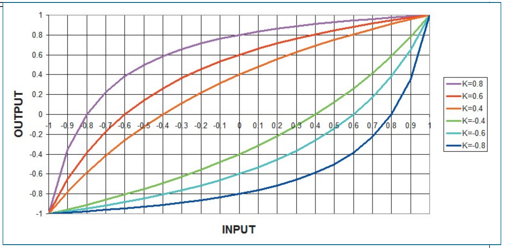
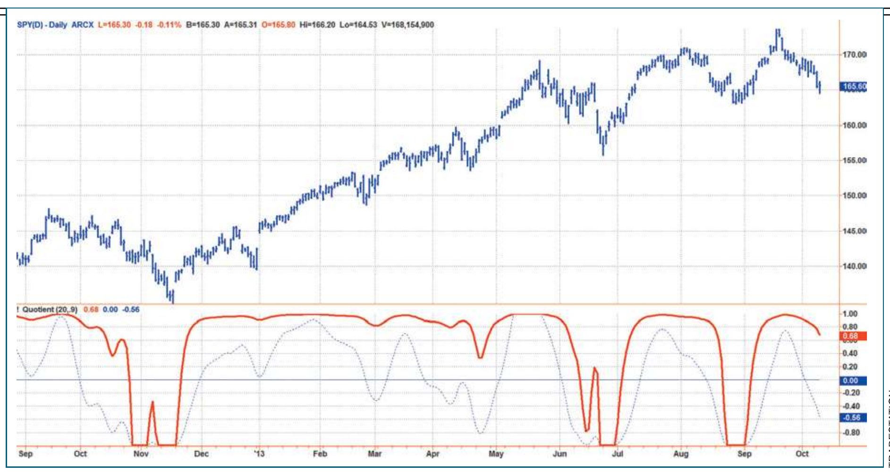
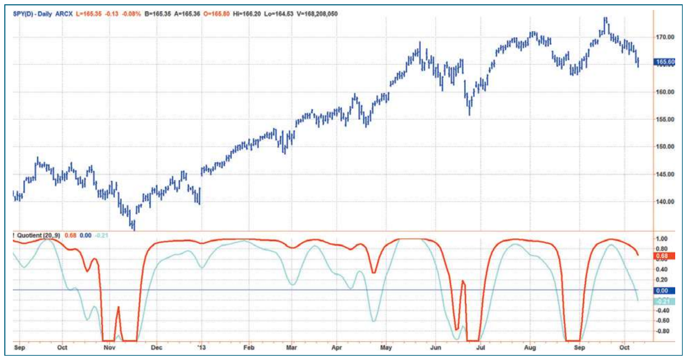
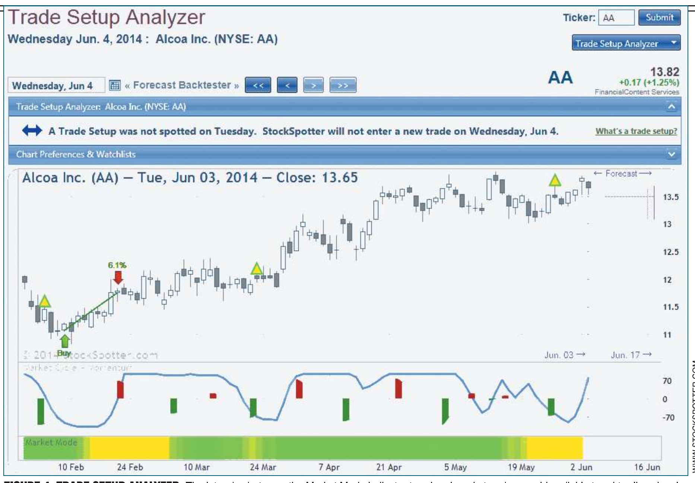

# The Quotient Transform

- **Author:** John F. Ehlers
- **Publication:** Technical Analysis of STOCKS & COMMODITIES, Volume 32, August 2014, pp. 26--29
- **Article URL:** [Article PDF](https://technical.traders.com/archive/article.asp?file=\V32\C08\825EHLE.pdf)
- **Traders' Tips URL:** [Traders' Tips, August 2014](https://www.traders.com/Documentation/FEEDbk_docs/2014/08/TradersTips.html)

---

## Early Trend Detection

Here's one way to detect a trend early and know how long to stick with it.

Trading the trend is a favorite technique of technical analysts. Trends are usually detected by some variation of following a moving average. The problem with this approach is that the moving averages invariably introduce lag because they require a relatively large amount of historical data to form a reliable indicator. This article introduces the quotient transform, which nonlinearly manipulates indicators to not only produce an early trend detection but also provides the ability to know how long to stick with the trend.

## Quotient Transform Mathematics

Transforms are handy devices that change indicator waveforms to better interpret the meaning of various indicators. They introduce zero lag into the indicators, which is a good thing. For example, a Fisher transform changes any indicator probability distribution to have a nearly normal probability distribution, with the result that visibility peak turning points are highly amplified. Conversely, the inverse Fisher transform acts as a soft limiter to remove irrelevant squiggles and thereby reduce the tendency for whipsaw trades. Another way to accentuate peak turning points and reduce irrelevant squiggles of a normalized indicator that swings between -1 and +1 is to simply cube the indicator. This collapses the small values of the indicator while leaving the values near +1 and -1 nearly unchanged.

The quotient transform is a simple ratio whose nonlinearity is parametrically controlled by a constant, $K$. The equation for the quotient transform is:

$$\text{Output} = \frac{\text{Input} + K}{K \cdot \text{Input} + 1}$$

where:

$$-1 < K < 1$$

The transfer response for various values of $K$ is shown in Figure 1. The input values are located along the horizontal axis and the output values (results) are located along the vertical axis.

To see how the transform works, assume that $K = 0.8$. Positive values of the input remain at high values at the output, being reduced to only 0.8 when the input value is zero. When the input values are reduced further into the negative range, the output remains positive until the input value reaches -0.8. When the input values are reduced even further, the output values rapidly approach -1. This nonlinear response causes the output to have positive values over most of the range of input values. The transform is reverse symmetrical about the diagonal if the parameter $K$ takes on negative values.


**FIGURE 1: QUOTIENT TRANSFORM TRANSFER RESPONSES.** Here you see the transfer response for various values of K.

## Indicator Requirements

The primary indicator requirement is that the swing of the indicator be limited to fall within the range of -1 to +1. This is easily accomplished with most oscillators using translation and dilation. The commodity channel index (CCI), stochastic, and relative strength index (RSI) are examples.

The CCI oscillator is normalized to the reference levels of -100 and +100, but it can exceed these reference levels. A suggested dilation is to divide the CCI by 200 and then further limit the values so they do not exceed -1 or +1.

The stochastic and RSI indicators are usually computed to plot between zero and 100. For these indicators, translate by subtracting 50 and then dilate by dividing the difference by 50. As a result, the indicators are ready for the quotient transform because they will be constrained to be within the range of -1 and +1.

## Roofing Filter

It is commonly recognized that market data is fractal in nature. That is, the amplitude of the cycle swings is generally in proportion to the cycle period. For example, the swings on a five-minute chart are small compared to the swings on a daily chart. This is called *spectral dilation*. A roofing filter is a superior oscillator because it removes the effects of spectral dilation and effectively removes aliasing noise. The roofing filter got its name as a descriptor of its performance in the frequency domain. It is composed of a two-pole high-pass filter that removes the components with longer wavelengths, thus retaining the higher-frequency components. It also is composed of a SuperSmoother that removes aliasing noise and smoothes by removing the very high-frequency components. As a result, the roofing filter provides a "roof" in the frequency domain that passes only the desired frequency components from the data input to any signal processing that follows it.

The roofing filter is an oscillator, but its output swings are not normalized. Normalization can be done in the same fashion as in a stochastic indicator by dividing by the difference between the highest and lowest values over a selected lookback period. However, I generally prefer to normalize indicators using an *automatic gain control* (AGC) algorithm because this method retains the characteristics of the indicator in the frequency domain without distortion. The AGC algorithm senses the most recent absolute value of peak swings to provide a normalizing value. The normalizing value is slowly decayed with each new data sample until a new peak swing is detected.

Putting all this together, I am providing EasyLanguage code for the normalized roofing filter with a quotient transform in the sidebar "EasyLanguage Code To Compute The Early-Onset Trend Indicator." The early-onset trend indicator can be tuned at the trader's preference by inputting a value for the low-pass period (LPPeriod) and the quotient parameter $K$.

## EasyLanguage Code To Compute The Early-Onset Trend Indicator

```easylanguage
Inputs:
  LPPeriod(30),
  K(.85);

Vars:
  alpha1(0),
  HP(0),
  a1(0),
  b1(0),
  c1(0),
  c2(0),
  c3(0),
  Filt(0),
  Peak(0),
  X(0),
  Quotient(0);

//Highpass filter cyclic components whose periods are shorter than 100 bars
alpha1 = (Cosine(.707*360 / 100) + Sine(.707*360 / 100) - 1) / Cosine(.707*360 / 100);

HP = (1 - alpha1 / 2)*(1 - alpha1 / 2)*(Close - 2*Close[1] + Close[2])
  + 2*(1 - alpha1)*HP[1] - (1 - alpha1)*(1 - alpha1)*HP[2];

//SuperSmoother Filter
a1 = expvalue(-1.414*3.14159 / LPPeriod);
b1 = 2*a1*Cosine(1.414*180 / LPPeriod);
c2 = b1;
c3 = -a1*a1;
c1 = 1 - c2 - c3;
Filt = c1*(HP + HP[1]) / 2 + c2*Filt[1] + c3*Filt[2];

//Fast Attack - Slow Decay Algorithm
Peak = .991*Peak[1];
If AbsValue(Filt) > Peak Then Peak = AbsValue(Filt);

//Normalized Roofing Filter
If Peak <> 0 Then X = Filt / Peak;
Quotient = (X + K) / (K*X + 1);

Plot1(Quotient);
Plot2(0);
```
*—J. Ehlers*

## Early-Onset Trend Detector In Action

Figure 2 shows the early-onset trend detector (using the code to compute the early-onset trend indicator) in the subgraph below the bar chart for the SPDR S&P 500 (SPY). The red indicator line clearly shows the trend onset as it crosses above zero on three occasions. The red trend indicator is to be compared to the normalized roofing filter, shown as the dashed blue line. The roofing filter simply has too many wiggles to be a trend indicator. In and of itself, the roofing filter is better suited to detect short-term market swings.

Of course, the early-onset trend detector works in current market conditions because there is a decided upside bias to the market data. In fact, it is this upside bias that helps the nonlinear transfer response of the quotient transform work. In conditions where the market has a downside bias, negative values of $K$ should be used in the quotient transform to take advantage of the bias in this direction.


**FIGURE 2: EARLY-ONSET TREND DETECTOR.** On this chart of the SPY, you can see that the indicator clearly shows the trends.

Another characteristic of the early-onset trend detector is that it remains above zero, indicating an uptrend, far too long after the uptrend is over. This characteristic can be mitigated by adding an additional indicator and rule set to exit a long trend trade. For example, Figure 3 shows a cyan indicator line where the K input variable is set to be 0.4. A simple trend-trading rule would be to enter a long position trade when the red line crosses above zero and hold that position until the cyan indicator line crosses below zero. This rule gives the benefit of entering the trade on the early-onset indication and exiting that trade on or before the trend has run its course.


**FIGURE 3: APPLYING THE EARLY-ONSET TREND DETECTOR.** Two different quotient transform parameters can be used for early long-position trade entries and exits.

## An Alternative Trend-Analysis Tool

Using the quotient transform is not necessarily the only way to detect the early onset of a trend. I offer the Trade Setup Analyzer at my website, www.StockSpotter.com. A snapshot example of the Trade Setup Analyzer is shown in Figure 4. The Market Mode indicator at the bottom of the chart provides positive trend confirmation by displaying a green color in uptrends, a red color in downtrends, and a yellow color in sideways markets. The Market Mode indicator measures the trend slope over the period of the measured cycle relative to the peak-to-peak amplitude swing of the cycle itself. As shown in Figure 4, the uptrend for Alcoa began early in March 2014 and continued until mid-May, when the trend slope turned neutral. The indicator is colorized for trend identification at a glance. The indicator works symmetrically; when the trend is weakening, an early indication of the onset of the downtrend is indicated by the color change to red.


**FIGURE 4: TRADE SETUP ANALYZER.** The interplay between the Market Mode indicator trend and market cycles provide reliable trend-trading signals.

## Conclusions

The quotient transform can be applied to any oscillator-type indicator to provide an early-onset identification of a trend. The oscillator is subject to the constraint that its swings must be within the limits of -1 and +1. The quotient transform introduces no lag in the calculations. Positive values of the $K$ parameter nonlinearly bias the indicator for uptrends. Correspondingly, negative values of the $K$ parameter nonlinearly bias the indicator for downtrends. Different values of the $K$ parameter can be used for trade entry and exit rules to capture the maximum amount of the trend movement.

## About The Author

S&C Contributing Editor John Ehlers is a pioneer in the use of cycles and DSP technical analysis. He developed the MESA cycle-measuring program for trading, is the chief scientist for StockSpotter.com, and is a principal of MESA Vector Asset Management, LLC.

## Further Reading

Ehlers, John F. [2014]. "Predictive And Successful Indicators," *Technical Analysis of STOCKS & COMMODITIES*, Volume 32: January.

——— [2013]. *Cycle Analytics For Traders*, John Wiley & Sons.

---

The code given in this article is available at the Subscriber Area at our website, Traders.com, in the Article Code area.

See our Traders' Tips section beginning on page 53 for implementation of Ehlers' technique in various technical analysis programs. Accompanying program code can be found in the Traders' Tips area at Traders.com.

---

## BibTeX

```bibtex
@article{ehlers_2014_quotient_transform,
  author    = {Ehlers, John F.},
  title     = {The Quotient Transform},
  journal   = {Technical Analysis of STOCKS \& COMMODITIES},
  volume    = {32},
  number    = {8},
  pages     = {26--29},
  year      = {2014},
  month     = aug,
  publisher = {Technical Analysis, Inc.},
  url       = {https://technical.traders.com/archive/article.asp?file=\V32\C08\825EHLE.pdf}
}

@misc{traders_tips_2014_08,
  author       = {{Technical Analysis of STOCKS \& COMMODITIES}},
  title        = {Traders' Tips: The Quotient Transform},
  year         = {2014},
  month        = aug,
  howpublished = {online},
  url          = {https://www.traders.com/Documentation/FEEDbk_docs/2014/08/TradersTips.html}
}
```
