# Traders' Tips: August 2014

- **Article:** The Quotient Transform by John F. Ehlers
- **Traders' Tips URL:** [Traders' Tips, August 2014](https://www.traders.com/Documentation/FEEDbk_docs/2014/08/TradersTips.html)

---

## TRADESTATION: AUGUST 2014

In �The Quotient Transform� in this issue, author John Ehlers describes an early trend detection method that is designed to reduce the lag often found in other trend indicators. Ehlers already provides EasyLanguage code for TradeStation in his article for the early-onset trend-detection indicator and also describes an approach for creating a strategy based on this indicator.

For the convenience of TradeStation users, we�re offering Ehlers� EasyLanguage code as well as an example strategy based on Ehlers� description given in his article as a downloadable file. To download the EasyLanguage code, please visit our TradeStation and EasyLanguage support forum. The code can be found athttps://www.tradestation.com/TASC-2014, and is also shown below. The ELD filename for this code set is �_TASC_EarlyOnsetTrend.ELD.�

For more information about EasyLanguage in general, please seehttps://www.tradestation.com/EL-FAQ.

A sample chart implementation is shown in Figure 1.

This article is for informational purposes. No type of trading or investment recommendation, advice, or strategy is being made, given, or in any manner provided by TradeStation Securities or its affiliates.

�Doug McCraryTradeStation Securities, Inc.www.TradeStation.com

BACK TO LIST

```easylanguage
_Ehlers_Early Onset Trend (Indicator)

inputs:
	LPPeriod( 30 ), K1( .85 ), K2( .4 ) ;
variables:
	alpha1( 0 ), HP( 0 ), a1( 0 ), b1( 0 ), 
	c1( 0 ), c2( 0 ), c3( 0 ), Filt( 0 ), Peak(0), 
	X( 0 ), Quotient1( 0 ), Quotient2( 0 ) ;

//Highpass filter cyclic components
//whose periods are shorter than
//100 bars
alpha1 = ( Cosine( .707 * 360 / 100 )
	+ Sine ( .707 * 360 / 100 ) - 1 ) /
	Cosine( .707 * 360 / 100 ) ;


HP = ( 1 - alpha1 / 2 )*( 1 - alpha1 /
	2 )*( Close - 2 * Close[1] + Close[2] )
	+ 2 * ( 1 - alpha1 ) * HP[1] 
	- ( 1 - alpha1 ) * ( 1 - alpha1 ) * HP[2] ;

//SuperSmoother Filter
a1 = expvalue( -1.414 * 3.14159 / LPPeriod ) ;
b1 = 2 * a1 * Cosine( 1.414*180 / LPPeriod ) ;
c2 = b1 ;
c3 = -a1 * a1 ;
c1 = 1 - c2 - c3 ;
Filt = c1 * ( HP + HP[1] ) / 2 + c2 * Filt[1]
+ c3 * Filt[2] ;

//Fast Attack - Slow Decay Algorithm
Peak = .991 * Peak[1] ;
If AbsValue( Filt ) > Peak then 
Peak = AbsValue( Filt ) ;

//Normalized Roofing Filter
if Peak <> 0 then 
	X = Filt / Peak ;

Quotient1 = ( X + K1 ) / ( K1 * X + 1 ) ;
Quotient2 = ( X + K2 ) / ( K2 * X + 1 ) ;


Plot1( Quotient1, "Quotient1" ) ;
Plot2( Quotient2, "Quotient2" ) ;
Plot3( 0, "ZL" ) ;


_Ehlers_Early Onset Trend (Strategy)

inputs:
	LPPeriod( 30 ), K1( .85 ), K2( .4 ) ;
variables:
	alpha1( 0 ), HP( 0 ), a1( 0 ), b1( 0 ), 
	c1( 0 ), c2( 0 ), c3( 0 ), Filt( 0 ), Peak(0), 
	X( 0 ), Quotient1( 0 ), Quotient2( 0 ) ;

//Highpass filter cyclic components
//whose periods are shorter than
//100 bars
alpha1 = ( Cosine( .707 * 360 / 100 )
	+ Sine ( .707 * 360 / 100 ) - 1 ) /
	Cosine( .707 * 360 / 100 ) ;


HP = ( 1 - alpha1 / 2 )*( 1 - alpha1 /
	2 )*( Close - 2 * Close[1] + Close[2] )
	+ 2 * ( 1 - alpha1 ) * HP[1] 
	- ( 1 - alpha1 ) * ( 1 - alpha1 ) * HP[2] ;

//SuperSmoother Filter
a1 = expvalue( -1.414 * 3.14159 / LPPeriod ) ;
b1 = 2 * a1 * Cosine( 1.414*180 / LPPeriod ) ;
c2 = b1 ;
c3 = -a1 * a1 ;
c1 = 1 - c2 - c3 ;
Filt = c1 * ( HP + HP[1] ) / 2 + c2 * Filt[1]
+ c3 * Filt[2] ;

//Fast Attack - Slow Decay Algorithm
Peak = .991 * Peak[1] ;
If AbsValue( Filt ) > Peak then 
Peak = AbsValue( Filt ) ;

//Normalized Roofing Filter
if Peak <> 0 then 
	X = Filt / Peak ;

Quotient1 = ( X + K1 ) / ( K1 * X + 1 ) ;
Quotient2 = ( X + K2 ) / ( K2 * X + 1 ) ;

if Quotient1 crosses over 0 then
	Buy next bar at Market ;
	
if Quotient2 crosses under 0 then 
	Sell next bar at Market ;


```

**External file:** [QuotientTransform.els](QuotientTransform.els)

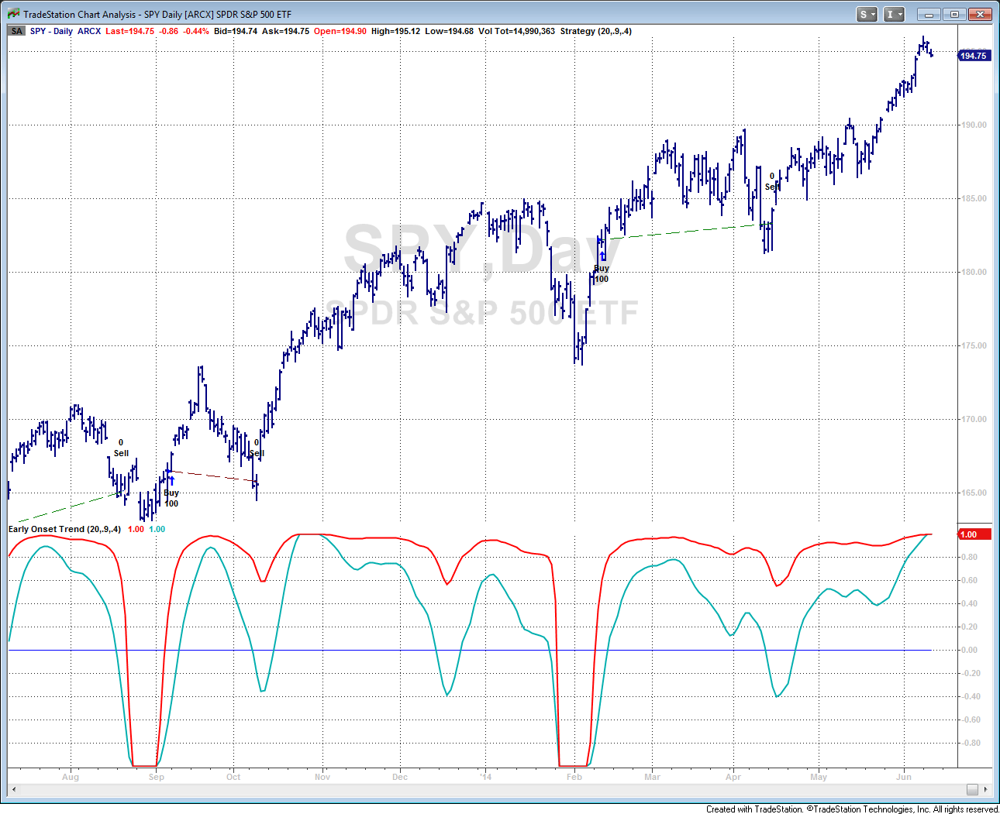
**FIGURE 1.**

---

## eSIGNAL:  AUGUST 2014

For this month�s Traders� Tip, we�ve provided the formula EarlyOnsetTrendIndicator.efs based on the formula described in John Ehlers� article in this issue, �The Quotient Transform.�

The study contains formula parameters that may be configured through theedit chartwindow (right-click on the chart and select �edit chart�). A sample chart is shown in Figure 2.

To discuss this study or download a complete copy of the formula code, please visit the EFS Library Discussion Board forum under the forums link from the support menu at www.esignal.com or visit our EFS KnowledgeBase athttps://www.esignal.com/support/kb/efs/. TheeSignal formula script (EFS)is also available for copying & pasting below.

�Eric LipperteSignal, an Interactive Data company800 779-6555,www.eSignal.com

BACK TO LIST

```javascript
/*********************************
Provided By:  
    Interactive Data Corporation (Copyright В	� 2014) 
    All rights reserved. This sample eSignal Formula Script (EFS)
    is for educational purposes only. Interactive Data Corporation
    reserves the right to modify and overwrite this EFS file with 
    each new release. 

Description:        
    The Quotient Transform by John F. Ehlers 

Formula Parameters:                     Default:
LPPeriod                                30
K                                       0.85 

Version:            1.00  09/06/2014

Notes:
    The related article is copyrighted material. If you are not a subscriber
    of Stocks & Commodities, please visit www.traders.com.

**********************************/

var fpArray = new Array();

function preMain()
{   
    setStudyTitle("EarlyOnsetTrendIndicator");
    setDefaultBarFgColor(Color.red);   
    
    addBand(0, PS_SOLID, 1, Color.grey);
    
    var x = 0;

    fpArray[x] = new FunctionParameter("fpLPPeriod", FunctionParameter.NUMBER);
    with(fpArray[x++])
    {
        setName("LPPeriod");
        setDefault(30);
        setLowerLimit(1);
    }

    fpArray[x] = new FunctionParameter("fpK", FunctionParameter.NUMBER);
    with(fpArray[x++])
    {
        setName("K");
        setDefault(0.85);
        setLowerLimit(-1);
        setUpperLimit(1);
    }
}

var bInit = false;
var bVersion = null;

xHP = null;
xFilt = null;
xPeak = null;
xX = null;
xQuotient = null;

function main(fpLPPeriod, fpK) 
{
    if (bVersion == null) bVersion = verify();
    if (bVersion == false) return;
    
    if (!bInit)
    {      
        xHP = efsInternal("Calc_HP");
        xFilt = efsInternal("Calc_Filt", xHP, fpLPPeriod);
        xPeak = efsInternal("Calc_Peak", xFilt);
        xX = efsInternal("Calc_X", xPeak, xFilt);
        xQuotient = getSeries(efsInternal("Calc_Quotient", xX, fpK));
   
        bInit = true;
    }
  
    return xQuotient;
}

var xClose = null;
var nAlpha1 = 0;

function Calc_HP()
{
    if (getBarState() == BARSTATE_ALLBARS)
    {
        xClose = close();

        nAlpha1 = (Math.cos((0.707 * 360 / 100) * (Math.PI / 180)) +
                   Math.sin((0.707 * 360 / 100) * (Math.PI / 180))  - 1) / 
                   Math.cos((0.707 * 360 / 100) * (Math.PI / 180));

    } 

    var nClose_0 = xClose.getValue(0);
    var nClose_1 = xClose.getValue(-1);
    var nClose_2 = xClose.getValue(-2);

    if (nClose_0 == null || nClose_1 == null || nClose_2 == null)
        return;

    var arrRefHP = ref(-1, -2);

    var nHP_1 = arrRefHP[0];
    var nHP_2 = arrRefHP[1];   

    var nReturnValue = (1 - nAlpha1 / 2) * (1 - nAlpha1 / 2) * (nClose_0 - 2 * nClose_1 + nClose_2) +
                       2 * (1 - nAlpha1) * nHP_1 -
                       (1 - nAlpha1) * (1 - nAlpha1) * nHP_2;
          
    return nReturnValue;
}

var nA1 = 0;
var nB1 = 0;
var nC1 = 0;
var nC2 = 0;
var nC3 = 0;

function Calc_Filt(xHP, nLPPeriod)
{
    if (getBarState() == BARSTATE_ALLBARS)
    {
        nA1 = Math.exp(-1.414 * 3.14159 / nLPPeriod);
        nB1 = 2 * nA1 * Math.cos((1.414 * 180 / nLPPeriod) * (Math.PI / 180));
        nC2 = nB1;
        nC3 = -nA1 * nA1;
        nC1 = 1 - nC2 - nC3; 
    } 

    var nHP_0 = xHP.getValue(0);
    var nHP_1 = xHP.getValue(-1);

    if (nHP_0 == null || nHP_1 == null)
        return;

    var arrRefFilt = ref(-1, -2);

    var nFilt_1 = arrRefFilt[0];
    var nFilt_2 = arrRefFilt[1];   

    var nReturnValue = nC1 * (nHP_0 + nHP_1) / 2 + nC2 * nFilt_1 + nC3 * nFilt_2;
          
    return nReturnValue;
}

function Calc_Peak(xFilt)
{
    var nFilt = xFilt.getValue(0);

    if (nFilt == null)
        return;

    var nPeak_1 = ref(-1);
    
    var nPeak = 0.991 * nPeak_1;

    if (Math.abs(nFilt) > nPeak)
        nPeak = Math.abs(nFilt);

    var nReturnValue = nPeak;

    return nReturnValue;
}

function Calc_X(xPeak, xFilt)
{
    var nPeak = xPeak.getValue(0);
    var nFilt = xFilt.getValue(0);

    if (nPeak == null || nFilt == null)
        return;
    
    var nReturnValue = 0;
     
    if (nPeak != 0)
        nReturnValue = nFilt / nPeak; 

    return nReturnValue;
}

function Calc_Quotient(xX, nK)
{
    var nX = xX.getValue(0);
   
    if (nX == null)
        return;
    
    var nReturnValue = (nX + nK) / (nK * nX + 1);

    return nReturnValue;
}

function verify() 
{
    var b = false;
    if (getBuildNumber() < 779) 
    {
        drawTextAbsolute(5, 35, "This study requires version 8.0 or later.", 
            Color.white, Color.blue, Text.RELATIVETOBOTTOM|Text.RELATIVETOLEFT|Text.BOLD|Text.LEFT,
            null, 13, "error");
        drawTextAbsolute(5, 20, "Click HERE to upgrade.@URL=https://www.esignal.com/download/default.asp", 
            Color.white, Color.blue, Text.RELATIVETOBOTTOM|Text.RELATIVETOLEFT|Text.BOLD|Text.LEFT,
            null, 13, "upgrade");
        return b;
    } 
    else 
    {
        b = true;
    }

    return b;
}

```

**External file:** [QuotientTransform.efs](QuotientTransform.efs)

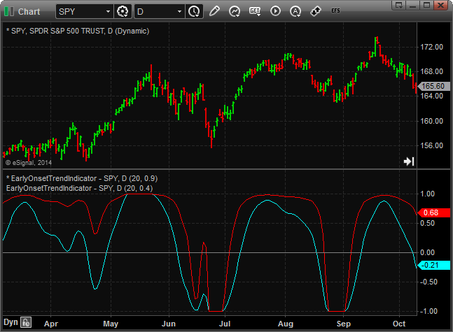
**FIGURE 2.**

---

## THINKORSWIM: AUGUST 2014

In �The Quotient Transform� in this issue, author John Ehlers gives us a new tool for detecting trends and defining how long a trend will last. He introduces the idea of thequotient transform, which can be used with trend indicators for an early detection of trend. At thinkorswim, we have used our proprietary scripting languagethinkScriptto build a study and a strategy for detecting trends early using this method.

We have made the loading process extremely easy by providing links for them. For thestrategy, simply go tohttps://tos.mx/xxFu8Xand choosebacktestin thinkorswim. For thestudy, go tohttps://tos.mx/146oNqand choosesave script to thinkorswim, then choose to rename your study as �OnsetTrendDetector.� You can adjust the parameters of these within the editstudies windowto fine-tune your variables.

The chart in Figure 3 shows entry & exit points when the criteria described in Ehlers� article were met for a two-year daily chart of SPY. The entry points displayed in blue on the price chart are defined by the top OnsetTrendDetector quotient crossing above zero. In the article, Ehlers suggests using a differentKvalue for the exit, so the exit points are determined by the lower OnsetTrendDetector quotient crossing below zero.

This strategy can be tested with any product within thinkorswim to find your perfect opportunity. Happy swimming!

�thinkorswimA division of TD Ameritrade, Inc.www.thinkorswim.com

BACK TO LIST

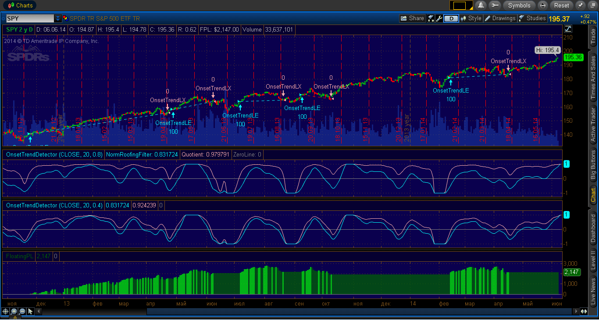
**FIGURE 3.**

---

## WEALTH-LAB: AUGUST 2014

In his article in this issue, �The Quotient Transform,� author John Ehlers introduces the quotient transform (QT), a zero-lag filter that can be used for the purpose of timely trend detection. The QT is an advancement of the technique he presented in his January 2014 S&C article, �Predictive And Successful Indicators.� This time, the output of a roofing filter (which includes applying a high-pass filter and SuperSmoother filter) is normalized.

To execute the trading system we�re providing here, Wealth-Lab users need to install (or update to) the latest version of our TASCIndicators library from the Extensions section of our website if they haven�t already done so, and then restart Wealth-Lab.

A drawback of the QT that Ehlers mentions in his article is that it tends to stay in trend mode for too long after the uptrend is over. But by applying two oscillators with differentKparameters, Ehlers suggests that the system is facilitated to exit on or before the trend has run its course. To demonstrate the application of the new oscillator, we followed Ehlers� example and used two QTs. Our resulting trend-following system trades according to the rules as follows:

Buy when the first 30-period QT withK=0.8 crosses zero from belowSell the position when the second 30-period QT withK=0.4 crosses zero from above.

See Figure 4 for an example of the trading system on a Wealth-Lab  chart.

After applying the system to a portfolio of the 30 DJIA stocks (10 years of daily data, 10% equity per position, trading costs applied), we found that it had a drawdown too stressful and a market exposure too high for our taste, suggesting that a good portion of the accumulated profits are still being given back to the market. However, that doesn�t lessen the fact that in general, the system was successful (although due to market�s upside bias), beating buy & hold (115% vs. 103%) on 418 trades. Figure 5 shows an equity curve comparison.

Figure 4 points at another shortcoming of this simple system: In October 2013, it exited a profitable trade that it had not reentered, missing a good trend ride. Thus, it seems that some sort of effective reentry technique wouldn�t hurt the performance.

On a closing note, it would be intriguing to see if theKparameter could be made self-adjusting to the market�s mood, as opposed to an arbitrary constant, which it is now.

�Eugene, Wealth-Lab teamMS123, LLCwww.wealth-lab.com

BACK TO LIST

```csharp
C# Strategy code:

using System;
using System.Collections.Generic;
using System.Text;
using System.Drawing;
using WealthLab;
using WealthLab.Indicators;
using TASCIndicators;

namespace WealthLab.Strategies
{
	public class QuotientTransformTASC201408 : WealthScript
	{
		private StrategyParameter paramPeriod;
		private StrategyParameter paramK1;
		private StrategyParameter paramK2;
		
		public QuotientTransformTASC201408()
		{
			paramPeriod = CreateParameter("Low-pass period",20,2,300,20);
			paramK1 = CreateParameter("K for entries",0.8,-1,1,1);
			paramK2 = CreateParameter("K for exits",0.4,-1,1,1);
		}
		
		protected override void Execute()
		{
			QuotientTransform qtEn = QuotientTransform.Series(Close,paramPeriod.ValueInt,paramK1.Value);
			QuotientTransform qtEx = QuotientTransform.Series(Close,paramPeriod.ValueInt,paramK2.Value);
			
			for(int bar = 2; bar < Bars.Count; bar++)
			{
				if (IsLastPositionActive)
				{
					if( CrossUnder( bar, qtEx, 0 ) )
						SellAtMarket( bar+1, LastPosition );
				}
				else
				{
					if( CrossOver( bar, qtEn, 0 ) )
						if( BuyAtMarket( bar+1 ) != null )
							LastPosition.Priority = -Close[bar];
				}
			}

			HideVolume();
			LineStyle ls = LineStyle.Solid;
			ChartPane pQT = CreatePane(40,true,true);
			PlotSeries(pQT,qtEx,Color.DarkCyan,ls,1);
			PlotSeries(pQT,qtEn,Color.FromArgb(255,255,140,0),ls,2);

			RSI rsi = RSI.Series(Close,14);
			DataSeries qrsi = (rsi - 50) / 50;
			ChartPane rp = CreatePane(40,false,true);
			qrsi.Description = "RSI Constrained";			
			DataSeries qr = QuotientTransform.Series( qrsi, paramPeriod.ValueInt, paramK1.Value);			
			PlotSeries(rp,qr,Color.Plum,ls,2);
		}
	}
}

```

**External file:** [QuotientTransform.cs](QuotientTransform.cs)

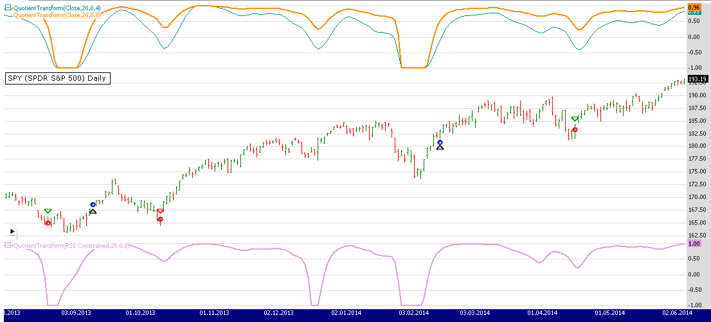
**FIGURE 4.**

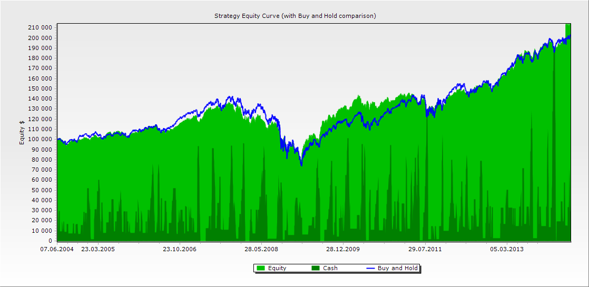
**FIGURE 5.**

---

## CQG: AUGUST 2014

We�re providing CQG code for the early-onset trend indicator described in John Ehlers� article in this issue, �The Quotient Transform.�

The early-onset trend indicator study has two parameters:LPPeriodandK, which may be configured in the �modify study parameters� window after the study has been applied to a chart in CQG. An example of the early-onset trend indicator for the SPY is depicted in the chart in Figure 6.

To download the component PAC containing the complete formula code, visit CQG Workspaces. To discuss this study, users can visit the CQG Forums athttps://www.cqgforums.com. Our team of expert product specialists can advise CQG users on the usage, application, and code for this study.

The PAC can also be downloadedhere.

Trading and investment carry a high level of risk, and CQG, Inc. does not make any recommendations for buying or selling any financial instruments. We offer educational information on ways to use our CQG trading tools, but it is up to our customers and other readers to make their own trading and investment decisions or to consult with a registered investment advisor.

�CQG Inc.,www.cqg.com

BACK TO LIST

```text
CQG code for the study 

/*Early-Onset Trend Indicator by John F. Ehlers*/
Parameters:
LPPeriod(15);
K(.95);
/*Highpass filter cyclic components whose periods are shorter than 100 bars*/
alpha1:= (Cos(.707*360/100) + Sin(.707*360/100) -1) / Cos(.707*360/100);
HP:=(1 - alpha1 /2)*(Close(@) - 2*Close(@)[-1] + Close(@)[-2])+ 2*(1 - alpha1)*HP[-1] - (1 -alpha1)*(1 - 
alpha1)*HP[-2];
/*SuperSmoother Filter*/
a1:= Exponential(-1.414*3.14159/LPPeriod); 
b1:= 2* a1* Cos(1.414*180/LPPeriod); 
c2:= b1; 
c3:= -a1*a1; 
c1:= 1 - c2 - c3; 
Filt:= c1*(HP + HP[-1]) / 2 + c2*Filt[-1]+ c3*Filt[-2];
/*Fast Attack - Slow Decay Algorithm*/
Peak:= if(Abs(Filt) > Peak[-1], Abs(Filt),Peak[-1] * .991);
/*Normalized Roofing Filter*/
X:=Filt/Peak;
Quotient:= (X + K) / (K*X + 1);
quotient

```

**External file:** [QuotientTransform.cqg](QuotientTransform.cqg)

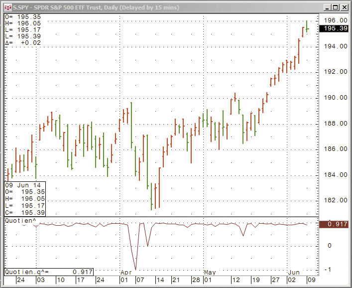
**FIGURE 6.**

---

## AMIBROKER: AUGUST 2014

In �The Quotient Transform� in this issue, author John Ehlers presents a new indicator that is helpful for trend-following. We are providing a ready-to-use formula for AmiBroker (below). We have coded the quotient transform as a function so it can be called multiple times with different parameters.

A sample chart is shown in Figure 7.

�Tomasz Janeczko, AmiBroker.comwww.amibroker.com

BACK TO LIST

```afl
SetBarsRequired( sbrAll ); 

function Quotient( LPPeriod, K ) 
{ 
    PI = 3.1415926; 
    angle = 0.707 * 2 * PI / 100; 
    alpha1 = ( cos( angle ) + sin( angle ) - 1 ) / cos( angle ); 

    a1 = exp( -1.414 * PI / LPPeriod ); 
    b1 = 2 * a1 * cos( 1.414 * PI / LPPeriod ); 
    c2 = b1; 
    c3 = -a1 * a1; 
    c1 = 1 - c2 - c3; 

    HP = Close; 
    Filt = HP; 
    Pk = Filt; 

    for( i = 2 ; i < BarCount; i++ ) 
    { 
       HP[ i ] = ( ( 1 - alpha1 / 2 ) ^ 2 ) * 
               ( Close[ i ] - 2 * Close[ i -1 ] + Close[ i - 2 ] ) + 
               2 * ( 1 - alpha1 ) * HP[ i - 1 ] - 
               HP[ i -2 ] * ( 1 - alpha1 ) ^ 2; 

       Filt[ i ] = c1 * ( HP[ i ] + HP[ i - 1 ] )/2 + 
                c2 * Filt[ i - 1 ] + 
                c3 * Filt[ i - 2 ]; 

       Pk[ i ] = Max( 0.991 * Pk[ i - 1 ], abs( Filt[ i ] ) ); 
    } 

    x = Nz( Filt / Pk ); 
    return ( X + K ) / ( K * X + 1 ); 
} 

Plot( Quotient( 20, 0.9 ), "Quotient(20, 0.9)", colorRed, styleThick ); 
Plot( Quotient( 20, 0.4 ), "Quotient(20, 0.4)", colorLightBlue, styleThick );

```

**External file:** [QuotientTransform.afl](QuotientTransform.afl)

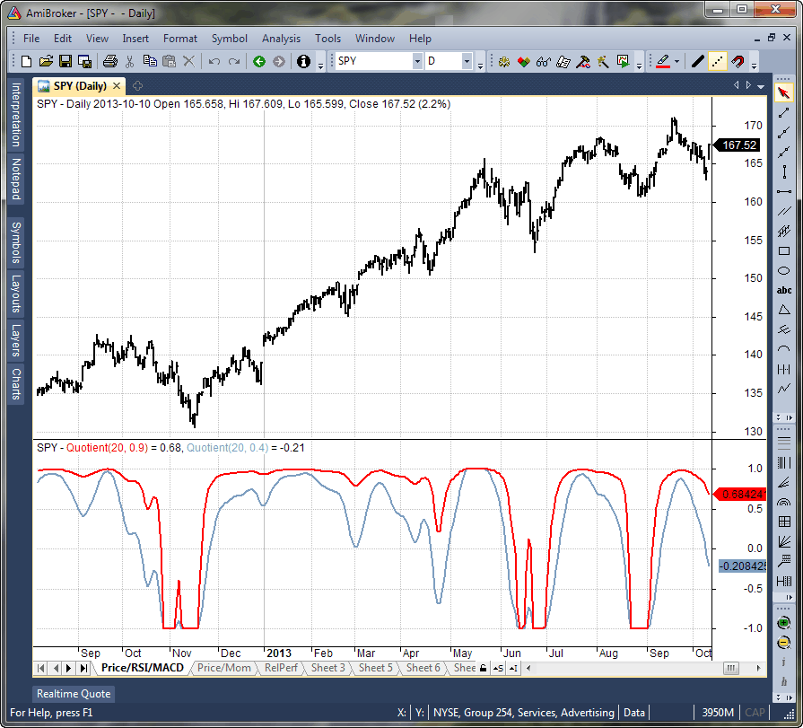
**FIGURE 7.**

---

## NEUROSHELL TRADER: AUGUST 2014

John Ehlers� quotient transform indicator described in his article in this issue can be easily implemented in NeuroShell Trader using NeuroShell Trader�s ability to call external dynamic linked libraries (DLLs).  Dynamic linked libraries may be written in C, C++, Power Basic, or Delphi.

After moving the EasyLanguage code given in Ehlers� article to your preferred compiler and creating a DLL, you can insert the resulting indicators as follows:

Select �New indicator� from the Insert menu.Choose theExternal Program & Library Callscategory.Select the appropriateExternal DLL Callindicator.Set up the parameters to match your DLL.Select theFinishedbutton.

A dynamic trading system can be easily created in NeuroShell Trader by combining the quotient transform indicator with NeuroShell Trader�s genetic optimizer to find optimal lengths. Similar filter- and cycle-based strategies can also be created using indicators found in Ehlers� Cybernetic and MESA91 NeuroShell Trader Add-ons.

Users of NeuroShell Trader can go to the STOCKS & COMMODITIES section of the NeuroShell Trader free technical support website to download a copy of this or any previous Traders� Tips.

A sample chart is shown in Figure 8.

�Marge Sherald, Ward Systems Group, Inc.301 662-7950,sales@wardsystems.comwww.neuroshell.com

BACK TO LIST

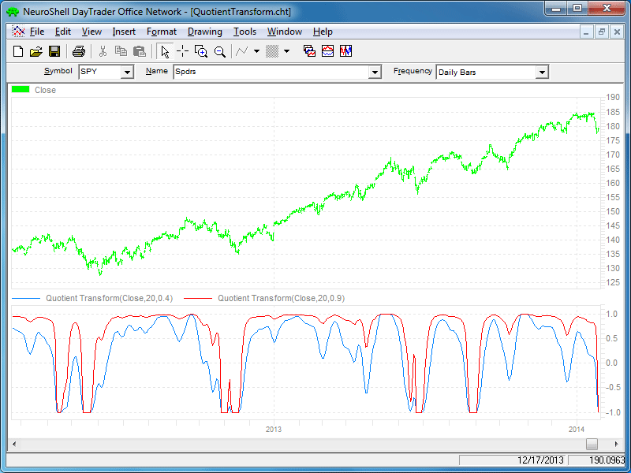
**FIGURE 8.**

---

## AIQ: AUGUST 2014

The AIQ code for this month is based on Dirk Vandycke�s article in the March 2014 issue of STOCKS & COMMODITIES, �Expansions & Contractions, Part 1.�

The code and EDS file can be downloaded fromwww.TradersEdgeSystems.com/traderstips.htm.

Figure 9 shows an example of the expansive urge (EU) indicator, which was introduced by Vandycke in his article, on a chart of Rite-Aid (RAD).

�Richard Denninginfo@TradersEdgeSystems.comfor AIQ Systems

BACK TO LIST

```text
!EXPANSIONS & CONTRACTIONS
!Author: Dirk Vandycke, TASC March 2014
!Coded by: Richard Denning 6/11/2014
!www.TradersEdgeSystems.com

C is [close].
C1 is valresult(C,1).
H is [high].
L is [low].
O is [open].
TH is max(C1,H).
TL is min(C1,L).
TR is TH - TL.
ATR is simpleavg(TR,20).
RCL is (C-TL) / TR.
EU is (C-O) / TR.

```

**External file:** [QuotientTransform.eds](QuotientTransform.eds)

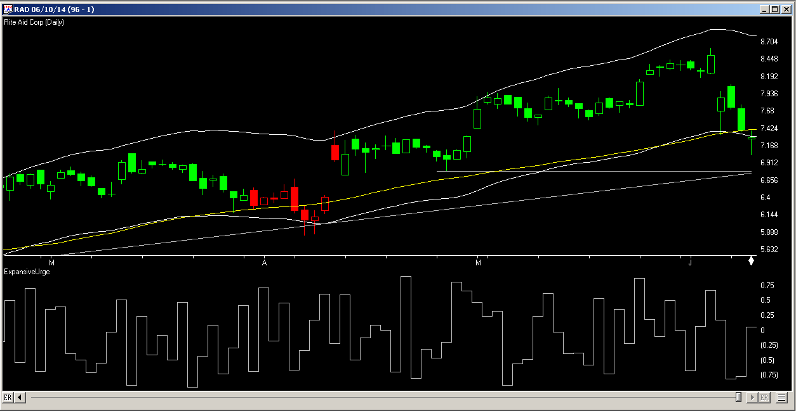
**FIGURE 9.**

---

## TRADERSSTUDIO: AUGUST 2014

The TradersStudio code I am providing this month is based on John Ehlers� article in this issue, �The Quotient Transform.� The code is provided at the following websites:

www.TradersEdgeSystems.com/traderstips.htmwww.TradersStudio.com → Traders Resources → Traders� Tips

The following files are provided in the download:

Function EHLERS_NORMROOF:Returns the normalized roofing filter for cycles less than themaxBarsLeninputFunction EHLERS_SUPSMO:Returns a smoothed value based on an array series input and a smoothing length (LPPeriod)Indicator plot:Plots two smoothed, normalized roofing values based on theKslow&Kfastinputs plus a zero lineSystem RSI_EXTENDED:A trading system suggested by Ehlers using a fast and a slow smoothing of the indicator.

The system has the following rules:

Buy the next bar at market open when the slow line crosses above zero.Exit the long position next bar at market open when the fast line crosses below zero.Reverse these rules for shorting (not coded here).

I ran the system on the S&P contract using data from Pinnacle Data Corp. Figure 10 shows the indicator withKslowset to 0.95 andKfastset to 0.80. Figure 11 shows the equity curve trading one contract of the S&P with the same parameter set for the period 4/21/1982 through 5/30/2014.

�Richard Denninginfo@TradersEdgeSystems.comfor TradersStudio

BACK TO LIST

```basic
'THE QUOTIENT TRANSFORM
'Author: John Ehlers, TASC August 2014
'Coded by: Richard Denning 6/08/2014
'www.TradersEdgeSystems.com

'Roofing filter for cycles less than maxBarsLen bars
Function EHLERS_NORMROOF(Price As BarArray, maxBarsLen, LPPeriod, K)
'Price=Close, maxBarsLen=100, LPPeriod=30, K=0.85
Dim alpha1
Dim HP As BarArray
Dim SSfilt As BarArray
Dim Peak As BarArray
Dim X As BarArray
Dim Quotient As BarArray
'Highpass filter cyclic components whose periods are shorter than 100 bars
  alpha1 = (Cos(DegToRad(0.707*360 / maxBarsLen) + Sin(DegToRad(0.707*360 / maxBarsLen) - 1))) /Cos(DegToRad(0.707*360 / maxBarsLen))
  HP = (1 - alpha1 / 2)*(1 - alpha1 /2)*(Price - 2*Price[1] + Price[2]) + 2*(1 - alpha1)*HP[1] - (1 - alpha1)*(1 - alpha1)*HP[2]
'Smooth with a Super Smoother Filter
  'assert(false)
  SSfilt = EHLERS_SUPSMO(HP,LPPeriod)
'Fast Attack - Slow Decay Algorithm
Peak = 0.991*Peak[1]
If Abs(SSfilt) > Peak Then Peak = Abs(SSfilt)
'Normalized Roofing Filter
If Peak<>0 Then X=SSfilt/Peak
if K*X+1 <> 0 then Quotient=(X+K)/(K*X+1)
EHLERS_NORMROOF = Quotient
End Function
'------------------------------------------------------------------------
'SuperSmoother filter
' 2013 John F. Ehlers
Function EHLERS_SUPSMO(Price As BarArray,LPPeriod)
Dim a1, b1, c1, c2, c3, Filt As BarArray
a1 = Exp(-1.414*3.14159 / LPPeriod)
b1 = 2*a1*Cos(DegToRad(1.414*180 / LPPeriod))
c2 = b1
c3 = -a1*a1
c1 = 1 - c2 - c3
Filt = c1*(Price + Price[1]) / 2 + c2*Filt[1] + c3*Filt[2]
EHLERS_SUPSMO = Filt
End Function
'--------------------------------------------------------------------------
'Indicator plot for Early-Onset Trend (Norm Roofing Filter) Indicator
Sub EHLERS_NORMROOF_IND(Kslow,Kfast)
'Price=Close, maxBarsLen=100, LPPeriod=30, K=0.85
plot1(EHLERS_NORMROOF(Close,100,30,Kslow))
Plot2(EHLERS_NORMROOF(Close,100,30,Kfast))
plot3(0)
End Sub
'---------------------------------------------------------------------------
Sub EHLERS_QUOTIENT_TRANS_SYS(maxBarsLen,LPPeriod,Kslow,Kfast)
'Price=C,maxBarsLen=100,LPPeriod=30,Kslow=0.85,Kfast=0.40
Dim SlowLine As BarArray
Dim FastLine As BarArray
SlowLine = EHLERS_NORMROOF(Close,maxBarsLen,LPPeriod,Kslow)
FastLine = EHLERS_NORMROOF(Close,maxBarsLen,LPPeriod,Kfast)
If SlowLine > 0 And SlowLine[1] < 0 Then Buy("LE",1,0,Market,Day)
If FastLine < 0 And FastLine[1] > 0 Then ExitLong("LX","",1,0,Market,Day)
End Sub
'----------------------------------------------------------------------------

```

**External file:** [QuotientTransform.trs](QuotientTransform.trs)

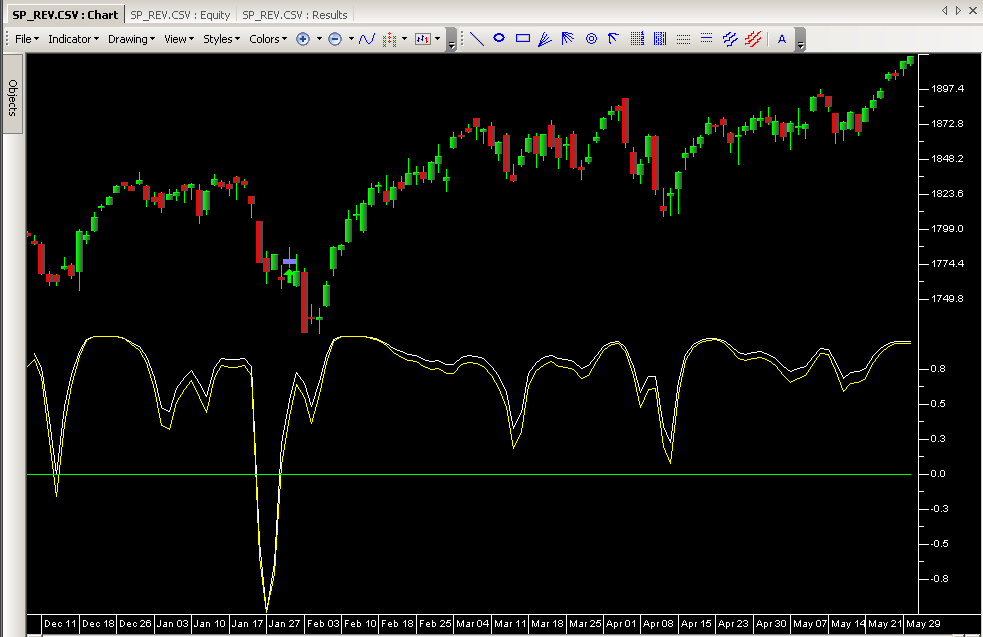
**FIGURE 10.**

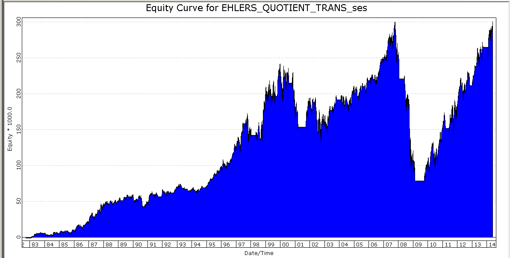
**FIGURE 11.**

---

## NINJATRADER: AUGUST 2014

The quotient transform indicator, which is introduced by John Ehlers in his article in this issue, �The Quotient Transform,� is available for download atwww.ninjatrader.com/SC/August2014SC.zip.

Once you have downloaded it, from within the NinjaTrader Control Center window, select the menu File → Utilities → Import NinjaScript and select the downloaded file. This file is for NinjaTrader version 7 or greater.

You can review the indicator source code by selecting the menu Tools → Edit NinjaScript → Indicator from within the NinjaTrader Control Center window and selecting the �QuotientTransform� file.

A sample chart implementing the strategy is shown in Figure 12.

�Raymond Deux & Bertrand WibbingNinjaTrader, LLC,www.ninjatrader.com

BACK TO LIST

**External file:** [ninja-trader/QuotientTransform.cs](ninja-trader/QuotientTransform.cs)

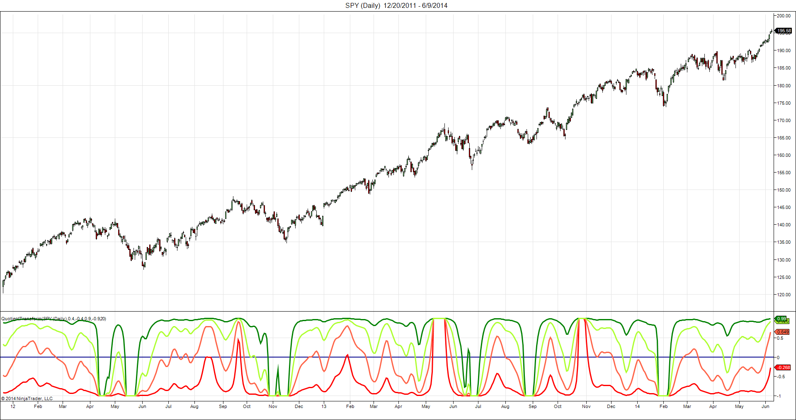
**FIGURE 12.**

---

## UPDATA: AUGUST 2014

Our Traders� Tip for this month is based on the article in this issue by John Ehlers, �The Quotient Transform.�

In it, Ehlers develops an early trend detection indicator, utilizing a two-pole high-pass �roofing� filter that removes components of the price wave of longer wavelength and retaining only higher frequencies. The very high frequencies are removed via a SuperSmoother, which removes aliasing noise. The end result is a filter that provides a �roof� for allowed frequencies.

The Updata code based on Ehlers� article can be found in the Updata Library and may be downloaded by clicking thecustommenu and Indicator Library. The code is also shown below for pasting into the Updata custom editor.

�Updata support teamsupport@updata.co.uk,www.updata.co.uk

BACK TO LIST

```basic
'EarlyOnSetTrendIndicator
PARAMETER "LP Period" #LPPeriod=30
PARAMETER "K" @K=0.85
DISPLAYSTYLE 2LINES
INDICATORTYPE CHART
NAME EarlyOnSetTrendIndicator
COLOUR2 RGB(180,180,180) 
@ALPHA=0
@HP=0
@A1=0
@B1=0
@C1=0
@C2=0
@C3=0
@FILTER=0
@PEAK=0
@X=0
@QUOTIENT=0
@TWO_PI=0 
@ONE_PI=0
FOR #CURDATE=#LPPeriod TO #CURDATE
    @TWO_PI=2*CONST_PI 
    @ONE_PI=CONST_PI 
    'HIGH PASS FILTER CYCLIC COMPONENTS SHORTER THAN 100 BARS
    @ALPHA=(COS(0.707*@TWO_PI/100)+SIN(0.707*@TWO_PI/100)-1)/COS(0.707*@TWO_PI/100)
    @HP=(1-@ALPHA/2)*(1-@ALPHA/2)*(CLOSE-2*CLOSE(1)+CLOSE(2))+2*(1-@ALPHA)*HIST(@HP,1)-(1-@ALPHA)*(1-@ALPHA)*HIST(@HP,2)
    'SUPERSMOOTHER FILTER   
    @A1=EXP(-1.414*@TWO_PI/#LPPeriod)
    @B1=2*@A1*COS(1.414*@ONE_PI/#LPPeriod)
    @C2=@B1
    @C3=-@A1*@A1
    @C1=1-@C2-@C3
    @FILTER=@C1*(@HP+HIST(@HP,1))/2+@C2*HIST(@FILTER,1)+@C3*HIST(@FILTER,2)
    'FAST ATTACK-SLOW DECAY ALGORITHM
    @PEAK=0.991*HIST(@PEAK,1) 
    'NORMALISING ROOFING FILTER
    @PEAK=MAX(ABS(@FILTER),@PEAK)
    IF @PEAK !=0
       @X=@FILTER/@PEAK
    ENDIF
    @QUOTIENT=(@X+@K)/(@K*@X+1)
    @PLOT=@QUOTIENT
    @PLOT2=0

NEXT

```

**External file:** [QuotientTransform.updata](QuotientTransform.updata)

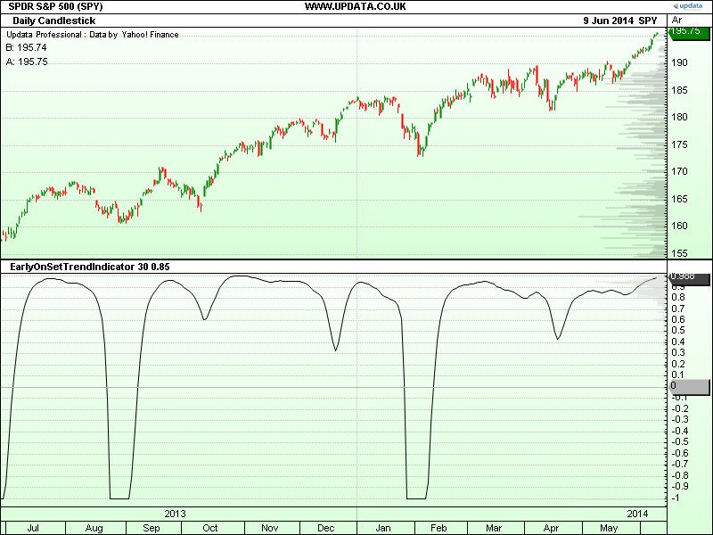
**FIGURE 13.**

---

## MICROSOFT EXCEL: AUGUST 2014

In �The Quotient Transform� in this issue, author John Ehlers walks us through the development of a simple yet powerful tool for identifying the very early stages of an uptrend in an upwardly biased market.

For a simple entry/exit system, he suggests that a long entry should occur whenquotient 1crosses above zero. He then adds a second copy of the indicator using a slightly less sensitivelinearity controlsetting. Long position exits are signaled whenquotient 2crosses below zero.

Using this exit strategy may take you out of a profitable trade before the major trend has run its course, as happens in Figure 14 when the second indicator drops below zero on 4/19/2013. A good trailing-stop strategy would have also taken you out.

Ehlers points out that the indicator can also be used in a downward-biased market by using negativelinearity controlvalues.

Late 1999 to late 2002 was a period of downward market bias. In Figure 15, our signals are for short entry whenquotient 1drops below zero. Close out the short position whenquotient 2rises above zero.

The spreadsheet file for this Traders� Tip can be downloadedhere. To successfully download it, follow these steps:

Right-click on theExcel file link, thenSelect �save as� (or �save target as�) to place a copy of the spreadsheet file on your hard drive.

�Ron McAllisterExcel and VBA programmerrpmac_xltt@sprynet.com

BACK TO LIST

Originally published in the August 2014 issue ofTechnical Analysis ofStocks & Commoditiesmagazine.All rights reserved. � Copyright 2014, Technical Analysis, Inc.

**External file:** [code/TheQuotientTransform.xlsm](code/TheQuotientTransform.xlsm)

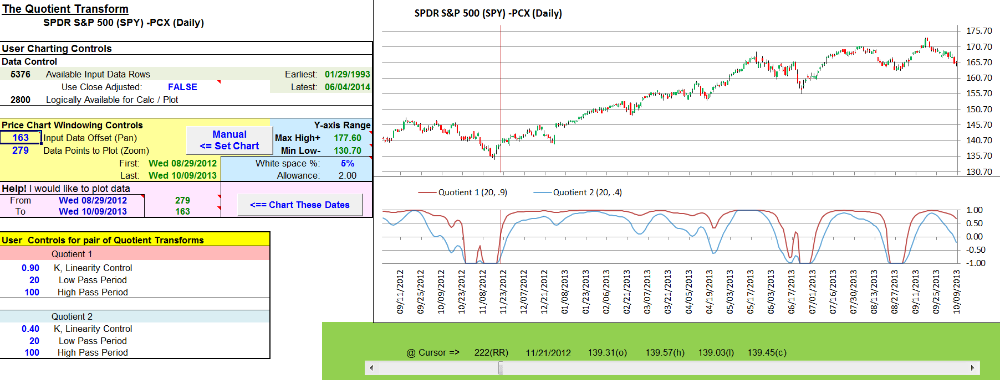
**FIGURE 14.**

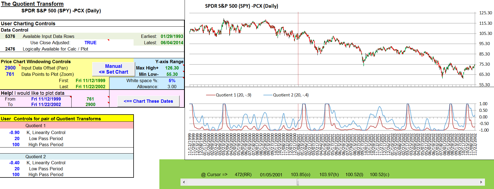
**FIGURE 15.**

---

## BibTeX

```bibtex
@misc{traders_tips_2014_08,
  author       = {{Technical Analysis of STOCKS \& COMMODITIES}},
  title        = {Traders' Tips: The Quotient Transform},
  year         = {2014},
  month        = aug,
  howpublished = {online},
  url          = {https://www.traders.com/Documentation/FEEDbk_docs/2014/08/TradersTips.html}
}
```