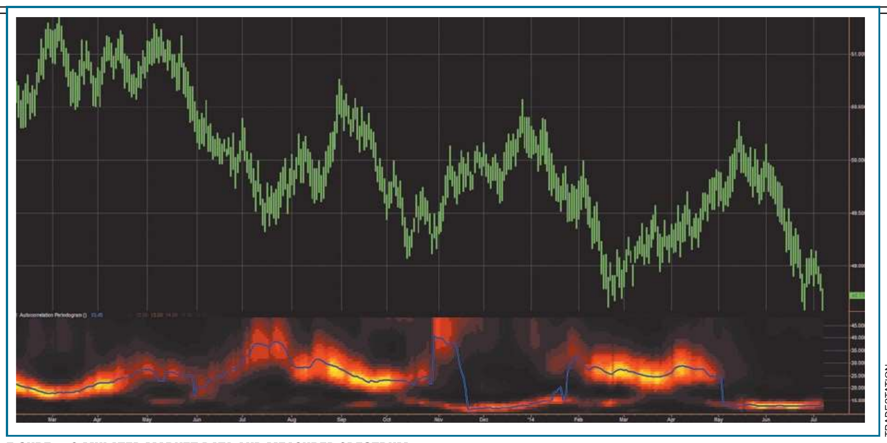
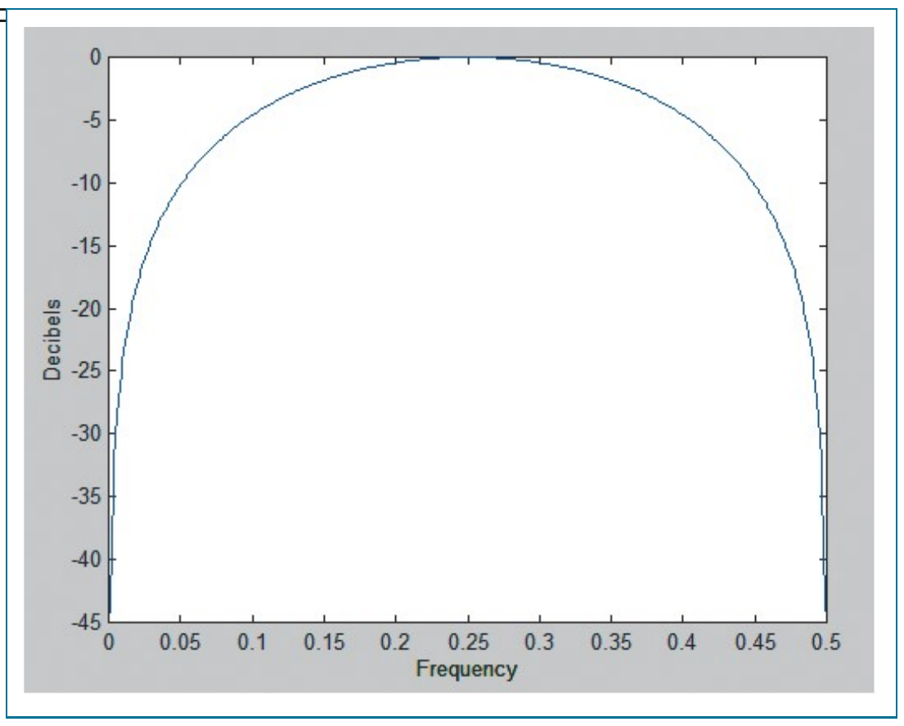
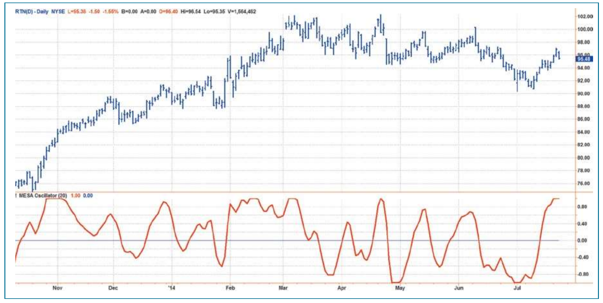
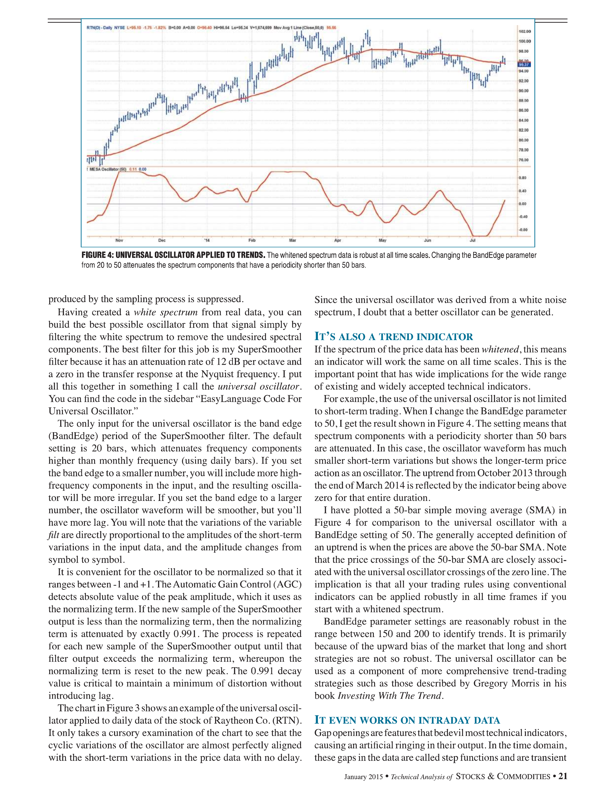
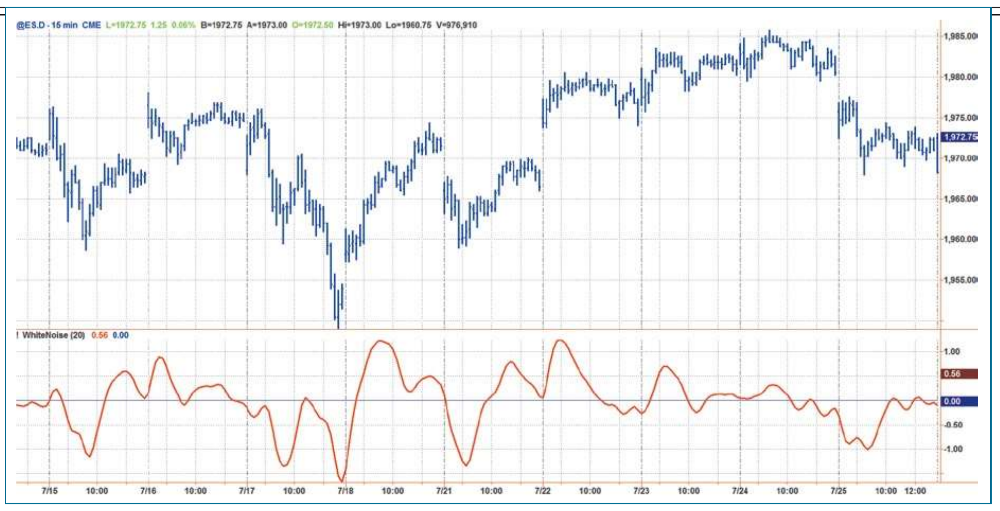

# Whiter Is Brighter

**by John F. Ehlers**

White noise, pink noise---does it make a difference? It sure does, and here is how you can use noise theory to create an indicator with zero lag that works both as a countertrend oscillator and as a trend identifier.

Noise spectra are often described by color. Just like white light, white noise contains all frequency components having equal power. When I surveyed analysts' description of market data, it led me to the conclusion that they describe it as pink noise. Pink noise is noise with memory, and I use this noise-with-memory concept to derive a market data synthesizer.

## Here's What I Did To Make It Useful

I turned the data synthesizer inside out to derive a white spectrum from the observed data. While simple, it is profound, because whitening the data negates the phenomenon I have called spectral dilation. Just because the derived white noise spectrum has uniform amplitude at all frequencies, it does not preclude the waveform from containing information. I then show how to extract the information in the waveform using a SuperSmoother filter. Since the derived waveform has a uniform power density at all frequencies, a range of optimum indicators can be created. These optimum indicators can be used on intraday data, in short-term trading strategies, and in longer-term trend followers.

It is important to note that the optimum indicators are created by carefully examining the parameters in the frequency domain. I only examine time waveforms of the indicators after the indicators have been created.

While not precise, the market model has an elegance of simplicity, only leading to the optimum indicators. I hope you find the journey through the derivations to be as fascinating as it was to me. To quote Albert Einstein, "The joy of looking and comprehending is nature's most beautiful gift."

## The Market Model

Early in my career, my model of the market was formed from linear system theory. The model was one of a deterministic waveform with additive white noise. The technical analysis problem using this model was simple and straightforward, and the model removed the noise by filtering or smoothing. What was left was free of noise, which therefore must be the true signal. Since I had the true signal, all I had to do was to properly interpret it to create algorithmic rules for a profitable trading system. Judging from all that has been written, it appears that most technical analysts favor this linear system model as well.

Experience has persuaded me that a more correct model of market data is one comprised solely of pink noise. White noise is noise that has the same power spectral density at all frequencies. The pink coloring means that the power spectral density is stronger at lower frequencies. Mathematically, pink noise can be expressed as:

$$\text{Pink noise} = \frac{K}{f^\alpha}$$

where $K$ is a constant.

This means the noise amplitude is inversely proportional to frequency. The alpha exponent term controls the hue of the pink noise. At $\alpha = 0$, the noise is white. At $\alpha = 2$, the noise is red. When alpha is equal to unity, each doubling of the wavelength doubles the noise amplitude. The generalized $1/f$ noise is ubiquitous. A search on the Internet for the term pink noise will lead you to read about endless applications. At an audio level, white noise is a bright hiss, as heard when tuned to an unused radio channel. On the other hand, pink noise has characteristics of a gentle rain shower, and is often used in calming and sleep-aid devices.

The observation that market data behaves like pink noise is hardly novel. Mathematician Benoit Mandelbrot described it as self-replicating fractals. Fibonaccians describe the growth rate of the logarithmic spiral as 1.618, as opposed to 2:1 for pure $1/f$ noise, but the difference is easily explained by using a value of alpha that is slightly different from unity. In addition, the Hurst coefficient attempts to measure the alpha term. The Hurst coefficient is more estimated than measured, and in a 2010 STOCKS & COMMODITIES article I wrote with Ric Way titled "Fractal Dimensions As A Market Mode Sensor," we showed one technique to make the estimate. Just to keep the subject as simple as possible, I will assume that the alpha term is unity. With this assumption, the pink noise amplitude doubles every time the frequency variable in the spectrum is halved. The shorthand notation for this growth rate is that the noise spectral power grows 6 dB per octave.

$1/f$ noise is often referred to as noise with memory. This characterization certainly fits market data, because intraday traders remember the opening price, yesterday's daily range, and so on. It works on every scale. Most traders remember what happened to prices in 2008. This noise-with-memory perspective works in other fields as well.

Peter Swerling is best known for the class of statistically fluctuating target scattering models he developed in the early 1950s to characterize the performance of pulsed radar systems. He noted the return echoes from aircraft appeared to be noisy on several different time scales. The noise was explained as independent reflections from different parts of the airplane that added together in a noise-like way as the airplane changed aspect angle relative to the radar transmitter. Thus, any given reflected pulse was almost like the previous pulse (memory), but still, each return echo was different. Elimination of these individual reflectors is the basis of stealth technology. In my career as an engineer, I was successfully able to build a deception radar jammer that looked like anything from an F-117 to a B-52 using a white noise source followed by a filter that is the analog equivalent of an exponential moving average (EMA).

With the experience of building a radar jammer, I have also built a market data simulator using a random number generator as a white noise source and an EMA. The exponential in EMA means the attenuation rolloff increases as the exponent of period. So if the cycle period is doubled, then the filter attenuation is also doubled. In other words, the filter attenuation rolloff is 6 dB per octave. Thus, the output of an EMA gives a perfect $1/f$ power spectral density by filtering the white noise of a random number generator. The EasyLanguage code to generate a pure pink noise generation of synthetic data can be seen in sidebar "EasyLanguage Code To Create Synthetic Prices." The white noise source is a random number generator that creates random numbers between zero and 100 with an average of 50. I chose an EMA constant of 0.004 because that offers a critical period of about one year for the filter. That provides a range of about eight octaves above the Nyquist period (having exactly two samples per cycle), which is adequate to test the principle. The variables Value1 and Value2 are lightly filtered random variables that are added and subtracted, respectively, from the pink noise variable to give a price high and price low. By plotting the variables Hi and Lo as histograms, and by coloring the Lo the same as the background color, the simulated data can be displayed as price bars as shown in Figure 1.


**FIGURE 1: SIMULATED MARKET DATA AND MEASURED SPECTRUM.** Modeling the data as pink noise doesn't make the price data look any different from real-world data. The simulated data can be used to extract some useful data.

To my eye, it would be hard to challenge that the simulated data is any different than real-world data. There are probably a host of statistical measures to test the differences, but the point is to extract some useful information from the concept rather than to seek perfection of the model.

Just because market data can be modeled as pink noise, it does not mean that the data does not contain cyclic information. In the same sense that a prism can break white light into its spectral components, you can also separate analogous components in market data by analysis. Market data is subject to spectral dilation, since the pink noise power spectrum is increasing at the rate of 6 dB per octave of the reciprocal of frequency. It is this spectral dilation that distorts spectral measurements, because the cycle amplitudes are not equal as a function of frequency (or period). For this reason, I recommend that the market data spectrum be measured with an autocorrelation periodogram, because this technique automatically removes the effects of spectral dilation. Otherwise, with a Fourier transform, for example, careful compensation preprocessing must be employed. The first subgraph of Figure 1 shows the measured spectrum using my autocorrelation periodogram. The vertical scale is the length of the measured period and the color intensity is representative of the spectral power at that period. Again, the measurement looks the same as it does on real data. I even applied the StockSpotter trading system on the simulated data, and it trades profitably, as I would expect. In short, white noise filtered by an EMA is a pretty good simulator of market data.

## Introducing The Universal Oscillator

I love theory because it can usually lead you to the limits of what is possible. I am also a pragmatist and am comfortable with kinda-sorta instead of an exact equation. With that preamble in mind, let's look at the one line of code that really does the generation of the synthetic data. That line is:

```
Pink = .004*Random(100) + .996*Pink[1];
```

If I now translate that expression for use in the real world, it might look something like this in pseudocode:

```
Close = .004*WhiteSpectrum + .996*Close[1];
```

By examination, 0.004 is just a scale factor on the white noise and 0.996 is almost unity. So I can write an approximate equation as:

```
Close = WhiteSpectrum + Close[1];
```

```
Close - Close[1] = WhiteSpectrum;
```

The last equation says that the one-bar difference (or momentum, if you prefer) is just the white spectrum of the real-world data. Philosophically, that is a big deal. On the other hand, if you plot the simple one-bar difference of prices, that one-bar difference of price looks pretty noisy.

There is one problem introduced by taking the one-bar difference of the input data. At the Nyquist frequency, where there are exactly two samples per cycle, those samples are exactly 180 degrees out of phase. Therefore, taking the difference of these samples doubles the amplitude of the noise. This, in effect, is the noise gain of the filter. The gain in noise at the Nyquist frequency can be easily eliminated by using a two-bar average of the difference. Thus, the modified white spectrum is computed as:

```
WhiteSpectrum = ((Close - Close[1]) + (Close[1] - Close[2])) / 2;
             = (Close - Close[2]) / 2;
```


**FIGURE 2: SPECTRAL SHAPE OF FILTER.** Here you see the frequency response of the filter generating white spectrum from market data.

Figure 2 shows the spectral shape of the filter that creates the white spectrum from the market data. This filter has a zero transmission at the Nyquist frequency (0.5 cycles per bar, or a two-bar cycle period); has unity gain at a frequency of 0.25 cycles per bar (or a four-bar cycle period); and has a zero transmission at zero frequency. Thus, white spectral density can be generated by the filter with no noise amplification. Further, the filter attenuation of 6 dB per octave starts at a four-bar cycle. The attenuation of frequency components whose period is shorter than four bars has the additional advantage that much of the aliasing energy produced by the sampling process is suppressed.

Having created a white spectrum from real data, you can build the best possible oscillator from that signal simply by filtering the white spectrum to remove the undesired spectral components. The best filter for this job is my SuperSmoother filter because it has an attenuation rate of 12 dB per octave and a zero in the transfer response at the Nyquist frequency. I put all this together in something I call the universal oscillator. You can find the code in the sidebar "EasyLanguage Code For Universal Oscillator."

The only input for the universal oscillator is the band edge (BandEdge) period of the SuperSmoother filter. The default setting is 20 bars, which attenuates frequency components higher than monthly frequency (using daily bars). If you set the band edge to a smaller number, you will include more high-frequency components in the input, and the resulting oscillator will be more irregular. If you set the band edge to a larger number, the oscillator waveform will be smoother, but you'll have more lag. You will note that the variations of the variable Filt are directly proportional to the amplitudes of the short-term variations in the input data, and the amplitude changes from symbol to symbol.

It is convenient for the oscillator to be normalized so that it ranges between -1 and +1. The Automatic Gain Control (AGC) detects absolute value of the peak amplitude, which it uses as the normalizing term. If the new sample of the SuperSmoother output is less than the normalizing term, then the normalizing term is attenuated by exactly 0.991. The process is repeated for each new sample of the SuperSmoother output until that filter output exceeds the normalizing term, whereupon the normalizing term is reset to the new peak. The 0.991 decay value is critical to maintain a minimum of distortion without introducing lag.


**FIGURE 3: UNIVERSAL OSCILLATOR APPLIED TO DAILY DATA.** The universal oscillator accurately follows price variations.

The chart in Figure 3 shows an example of the universal oscillator applied to daily data of the stock of Raytheon Co. (RTN). It only takes a cursory examination of the chart to see that the cyclic variations of the oscillator are almost perfectly aligned with the short-term variations in the price data with no delay. Since the universal oscillator was derived from a white noise spectrum, I doubt that a better oscillator can be generated.

## It's Also A Trend Indicator

If the spectrum of the price data has been whitened, this means an indicator will work the same on all time scales. This is the important point that has wide implications for the wide range of existing and widely accepted technical indicators.

For example, the use of the universal oscillator is not limited to short-term trading. When I change the BandEdge parameter to 50, I get the result shown in Figure 4. The setting means that spectrum components with a periodicity shorter than 50 bars are attenuated. In this case, the oscillator waveform has much smaller short-term variations but shows the longer-term price action as an oscillator. The uptrend from October 2013 through the end of March 2014 is reflected by the indicator being above zero for that entire duration.


**FIGURE 4: UNIVERSAL OSCILLATOR APPLIED TO TRENDS.** The whitened spectrum data is robust at all time scales. Changing the BandEdge parameter from 20 to 50 attenuates the spectrum components that have a periodicity shorter than 50 bars.

I have plotted a 50-bar simple moving average (SMA) in Figure 4 for comparison to the universal oscillator with a BandEdge setting of 50. The generally accepted definition of an uptrend is when the prices are above the 50-bar SMA. Note that the price crossings of the 50-bar SMA are closely associated with the universal oscillator crossings of the zero line. The implication is that all your trading rules using conventional indicators can be applied robustly in all time frames if you start with a whitened spectrum.

BandEdge parameter settings are reasonably robust in the range between 150 and 200 to identify trends. It is primarily because of the upward bias of the market that long and short strategies are not so robust. The universal oscillator can be used as a component of more comprehensive trend-trading strategies such as those described by Gregory Morris in his book *Investing With The Trend*.

## It Even Works On Intraday Data

Gap openings are features that bedevil most technical indicators, causing an artificial ringing in their output. In the time domain, these gaps in the data are called step functions and are transient rather than repetitive. The Fourier transform (the response in the frequency domain) varies as the reciprocal of frequency. In other words, the step function behaves exactly the same in the frequency domain as pink noise. Since the universal oscillator whitens the spectrum, it also tends to remove the effects of the gap openings at the indicator output.

While entire books can (and have) been written about intraday trading, the application of the universal oscillator is summarized in the chart seen in Figure 5. The chart uses 15-minute bars on the emini futures (ES) contract for the regular trading day where a reasonable volume is maintained. Note that the indicator has no harsh responses to the opening gaps in price yet maintains an accurate representation of the intraday turning points.


**FIGURE 5: GAP OPENINGS.** The universal oscillator minimizes the effects of gap openings.

## To Sum It Up

I have shown that while many analysts have described market data in different ways, they are all describing data that is basically pink noise. The hue, or pinkness, can vary with time, which complicates the already difficult analysis. However, truly representative data can be synthesized from a pink noise generator. Such pink noise even passes the measured spectrum test. The simplified model of the market data was used to create a real-world waveform that has a uniform amplitude white spectrum. Then, by filtering with a SuperSmoother filter, I derived the optimum universal oscillator. The universal oscillator has essentially zero lag as an indicator and can also be used as the basis of identifying trends.

## EasyLanguage Code To Create Synthetic Prices

```easylanguage
// Synthetic Price Generator
// (c) 2014 John F. Ehlers

Vars:
    Pink(0),
    Hi(0),
    Lo(0);

//Note: Pink[1] means the value of Pink one bar ago

Pink = .004*Random(100) + .996*Pink[1];
If Currentbar = 1 Then Pink = 50;

Value1 = .5*Random(.25) + .5*Value1[1];
Value2 = .5*Random(.25) + .5*Value2[1];

Hi = Pink + Value1;
Lo = Pink - Value2;

Plot1(Hi);
Plot2(Lo);
```

## EasyLanguage Code For Universal Oscillator

```easylanguage
// Universal Oscillator
// (c) 2014 John F. Ehlers

Inputs:
    BandEdge(20);

Vars:
    WhiteNoise(0),
    a1(0),
    b1(0),
    c1(0),
    c2(0),
    c3(0),
    Filt(0),
    Peak(0),
    Universal(0);

WhiteNoise = (Close - Close[2]) / 2;

// SuperSmoother Filter
a1 = expvalue(-1.414*3.14159 / BandEdge);
b1 = 2*a1*Cosine(1.414*180 / BandEdge);

c2 = b1;
c3 = -a1*a1;
c1 = 1 - c2 - c3;

Filt = c1*(WhiteNoise + WhiteNoise[1]) / 2 + c2*Filt[1] + c3*Filt[2];

If Currentbar = 1 Then Filt = 0;
If Currentbar = 2 Then Filt = c1*0*(Close + Close[1])/2 + c2*Filt[1];
If Currentbar = 3 Then Filt = c1*0*(Close + Close[1])/2 + c2*Filt[1] + c3*Filt[2];

// Automatic Gain Control (AGC)
Peak = .991*Peak[1];
If Currentbar = 1 Then Peak = .0000001;
If AbsValue(Filt) > Peak Then Peak = AbsValue(Filt);
If Peak <> 0 Then Universal = Filt / Peak;

Plot1(Universal);
Plot2(0);
```

## Further Reading

- Ehlers, John [2013]. *Cycle Analytics For Traders*, Wiley & Sons.
- Ehlers, John [2014]. "The Quotient Transform," *Technical Analysis of STOCKS & COMMODITIES*, Volume 32: August.
- Ehlers, John, and Ric Way [2010]. "Fractal Dimension As A Market Mode Sensor," *Technical Analysis of STOCKS & COMMODITIES*, Volume 28: June.
- Mandelbrot, Benoit, and Richard Hudson [2004]. *The (Mis)behavior Of Markets*, Basic Books.
- Morris, Gregory [2013]. *Investing With The Trend*, Wiley & Sons.

## About The Author

S&C Contributing Editor John Ehlers is a pioneer in the use of cycles and DSP technical analysis. He developed the MESA cycle-measuring program for trading and is the chief scientist for StockSpotter.com.

---

The code given in this article is available at the Subscriber Area at our website, www.Traders.com, in the Article Code area.

See our Traders' Tips section beginning on page 54 for commentary on implementation of Ehlers' technique in various technical analysis programs. Accompanying program code can be found in the Traders' Tips area at Traders.com.

---

## BibTeX

```bibtex
@article{ehlers_2015_whiter,
  author    = {Ehlers, John F.},
  title     = {Whiter Is Brighter},
  journal   = {Technical Analysis of Stocks \& Commodities},
  volume    = {33},
  number    = {1},
  pages     = {17--22},
  year      = {2015},
  month     = jan,
  publisher = {Technical Analysis, Inc.},
  url       = {https://technical.traders.com/archive/article.asp?file=\V33\C01\908EHLE.pdf}
}

@misc{traders_tips_2015_01,
  author       = {{Technical Analysis of Stocks \& Commodities}},
  title        = {Traders' Tips: Whiter Is Brighter},
  howpublished = {online},
  year         = {2015},
  month        = jan,
  url          = {https://www.traders.com/Documentation/FEEDbk_docs/2015/01/TradersTips.html}
}
```
