# Traders' Tips: January 2015

- **Article:** Whiter Is Brighter by John F. Ehlers
- **Traders' Tips URL:** [Traders' Tips, January 2015](https://traders.com/Documentation/FEEDbk_docs/2015/01/TradersTips.html)

---

## TradeStation: January 2015

In "Whiter Is Brighter," author John Ehlers presents a new indicator he calls the universal oscillator. It is based on his theory that market data resembles pink noise, or as he puts it, "noise with memory."

In his article, Ehlers has already provided some TradeStation code for his ultimate oscillator that could be used to create a short-term trading strategy. To facilitate using it with the TradeStation Scanner, we have added alerts to the indicator and have provided an example short-term trading strategy. You can apply the strategy to a TradeStation chart to perform a backtest on a symbol of your choice or you can use the strategy along with the TradeStation Portfolio Maestro to backtest your favorite portfolio.

For convenience, we are providing this indicator code with alerts as well as the example strategy at our TradeStation and EasyLanguage support forum at https://www.tradestation.com/TASC-2015. The ELD filename is "_TASC_UniversalOscillator.ELD." For more information about EasyLanguage in general, please see https://www.tradestation.com/EL-FAQ. The code is also shown below:

```easylanguage
_Ehlers_Universal Oscillator (Indicator)

// Universal Oscillator
// (c) 2014 John F. Ehlers
// TASC January 2015
inputs:
	BandEdge( 20 ) ;
variables:
	WhiteNoise( 0 ),
	a1( 0 ),
	b1( 0 ),
	c1( 0 ),
	c2( 0 ),
	c3( 0 ),
	Filt(0),
	Peak(0),
	Universal( 0 ) ;

once
	begin
	if BandEdge <= 0 then
		RaiseRunTimeError( "BandEdge must be > zero" ) ;
	end ;

WhiteNoise = ( Close - Close[2] ) / 2 ;

// SuperSmoother Filter
a1 = ExpValue( -1.414 * 3.14159 / BandEdge ) ;
b1 = 2 * a1 * Cosine( 1.414 * 180 / BandEdge ) ;
c2 = b1 ;
c3 = -a1 * a1 ;
c1 = 1 - c2 - c3 ;
Filt = c1 * ( WhiteNoise + WhiteNoise [1] ) / 2 +
c2 * Filt[1] + c3 * Filt[2] ;
If Currentbar = 1 then
	Filt = 0 ;
If Currentbar = 2 then
	Filt = c1 * 0 * ( Close + Close[1] ) / 2 + c2 * Filt[1] ;
If Currentbar = 3 then
	Filt = c1 * 0 * ( Close + Close[1] ) / 2 + c2 * Filt[1] +
c3 * Filt[2] ;

// Automatic Gain Control (AGC)
Peak = .991 * Peak[1] ;
If Currentbar = 1 then
	Peak = .0000001 ;
If AbsValue( Filt ) > Peak then
	Peak = AbsValue( Filt ) ;
If Peak <> 0 then
	Universal = Filt / Peak ;
Plot1( Universal ) ;
Plot2( 0 ) ;

if Universal crosses over 0 then
	Alert( "Osc cross over zero line" )
else if Universal crosses under 0 then
	Alert( "Osc cross under zero line" ) ;
```

```easylanguage
_Ehlers_Universal Oscillator (Strategy)

// Universal Oscillator
// (c) 2014 John F. Ehlers
// TASC January 2015
inputs:
	BandEdge( 20 ) ;
variables:
	WhiteNoise( 0 ),
	a1( 0 ),
	b1( 0 ),
	c1( 0 ),
	c2( 0 ),
	c3( 0 ),
	Filt(0),
	Peak(0),
	Universal( 0 ) ;

once
	begin
	if BandEdge <= 0 then
		RaiseRunTimeError( "BandEdge must be > zero" ) ;
	end ;

WhiteNoise = ( Close - Close[2] ) / 2 ;

// SuperSmoother Filter
a1 = ExpValue( -1.414 * 3.14159 / BandEdge ) ;
b1 = 2 * a1 * Cosine( 1.414 * 180 / BandEdge ) ;
c2 = b1 ;
c3 = -a1 * a1 ;
c1 = 1 - c2 - c3 ;
Filt = c1 * ( WhiteNoise + WhiteNoise [1] ) / 2 +
c2 * Filt[1] + c3 * Filt[2] ;
If Currentbar = 1 then
	Filt = 0 ;
If Currentbar = 2 then
	Filt = c1 * 0 * ( Close + Close[1] ) / 2 + c2 * Filt[1] ;
If Currentbar = 3 then
	Filt = c1 * 0 * ( Close + Close[1] ) / 2 + c2 * Filt[1] +
c3 * Filt[2] ;

// Automatic Gain Control (AGC)
Peak = .991 * Peak[1] ;
If Currentbar = 1 then
	Peak = .0000001 ;
If AbsValue( Filt ) > Peak then
	Peak = AbsValue( Filt ) ;
If Peak <> 0 then
	Universal = Filt / Peak ;

if Universal crosses over 0 then
	Buy next bar at Market ;

if Universal crosses under 0 then
	SellShort next bar at Market ;
```

External code: [UO_indicator.els](UO_indicator.els), [UO_strategy.els](UO_strategy.els)

A sample chart is shown in Figure 1.

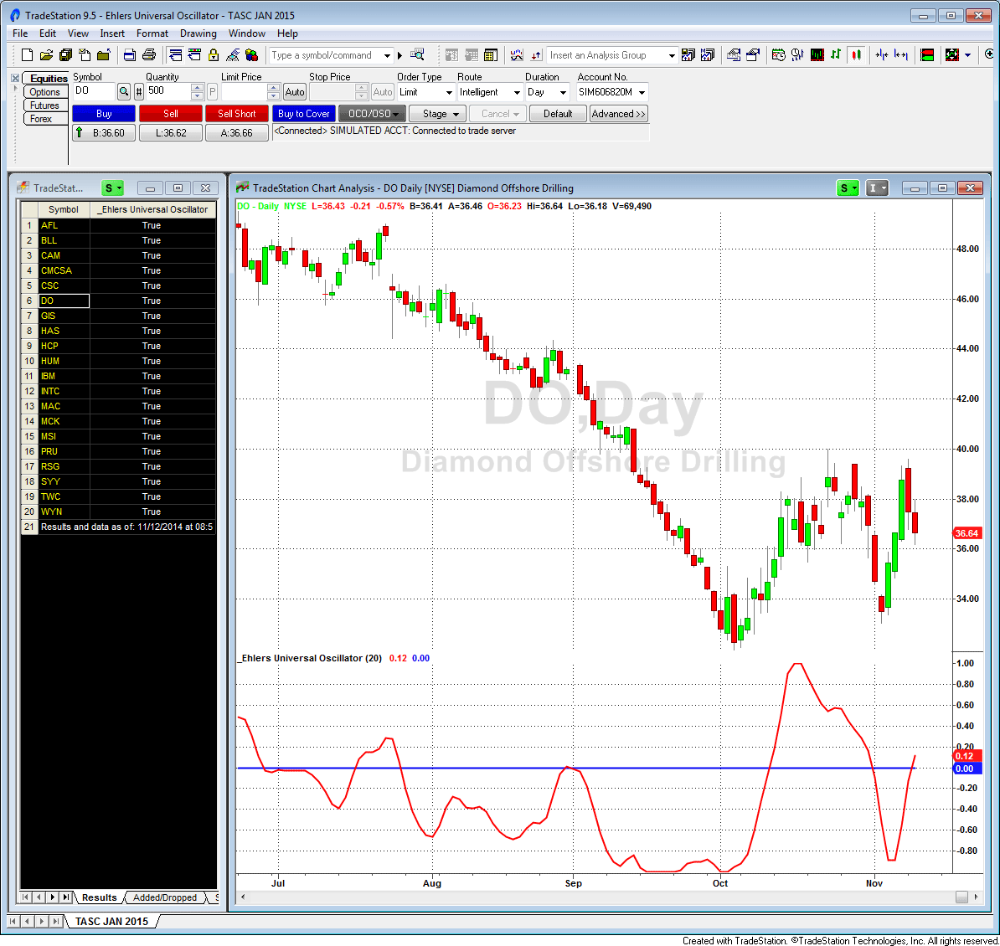
**FIGURE 1: TRADESTATION, SCANNER.** Here, the TradeStation Scanner shows a list of S&P 500 symbols that had the scan criteria met on 11/11/2014. The scan criteria is met when the universal oscillator crosses above or below zero. In the chart, the universal oscillator is applied to the symbol DO and displays the cross.

--Doug McCrary, TradeStation Securities, Inc. www.TradeStation.com

---

## eSignal: January 2015

For this month's Traders' Tip, we're providing the formula Universal_Oscillator.efs based on the formula given in John Ehlers' article in this issue, "Whiter Is Brighter."

The study contains formula parameters which may be configured through the edit chart window (right-click on the chart and select "edit chart"). A sample chart is shown in Figure 2.

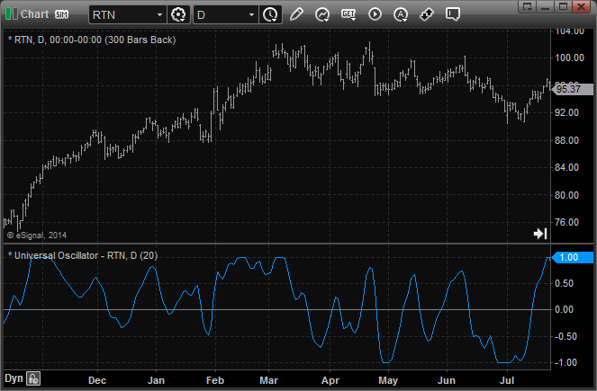
**FIGURE 2: eSIGNAL.** Here is an example implementation of the universal oscillator on Raytheon (RTN).

To discuss this study or download a complete copy of the formula code, please visit the EFS Library Discussion Board forum under the forums link from the support menu at www.esignal.com or visit our EFS KnowledgeBase at https://www.esignal.com/support/kb/efs/.

```javascript
/*********************************
Provided By:
    Interactive Data Corporation (Copyright 2014)
    All rights reserved.

Description:
    Universal Oscillator by John Ehlers

Formula Parameters:                     Default:
    BandEdge                            20

Version:            1.00  11/11/2014
**********************************/

var fpArray = new Array();

function preMain(){
    setStudyTitle("Universal Oscillator");
    setPriceStudy(false);
    setCursorLabelName("UniOsc", 0);
    addBand(0,PS_SOLID,1,Color.grey);

    var x = 0;
    fpArray[x] = new FunctionParameter("BandEdge", FunctionParameter.NUMBER);
    with(fpArray[x++]){
        setName("BandEdge");
        setLowerLimit(1);
        setDefault(20);
    }
}

var bVersion = null;
var WhiteNoise = 0;
var WhiteNoise_1 = 0;
var Filt = 0;
var Filt_1 = 0;
var Filt_2 = 0;
var Peak = 0;
var Peak_1 = 0;

function main(BandEdge){
    if (bVersion == null) bVersion = verify();
    if (bVersion == false) return;

    if(BandEdge==null) BandEdge = 20;

    var a1 = 0;
    var b1 = 0;
    var c1 = 0;
    var c2 = 0;
    var c3 = 0;
    var Universal = 0;

    if(getBarState()==BARSTATE_ALLBARS){
        xClose = close();
    }

    if(getBarState()==BARSTATE_NEWBAR){
        WhiteNoise_1 = WhiteNoise;
        Filt_2 = Filt_1;
        Filt_1 = Filt;
        Peak_1 = Peak;
    }

    WhiteNoise = (xClose.getValue(0)-xClose.getValue(-1))/2;
    a1 = Math.exp(-1.414*3.14159/BandEdge);
    b1 = 2*a1*Math.cos(1.414*180/BandEdge);
    c2 = b1;
    c3 = -a1*a1;
    c1 = 1-c2-c3;
    Filt = c1*(WhiteNoise+WhiteNoise_1)/2+c2*Filt_1+c3*Filt_2;

    if(getCurrentBarCount()==1) Filt = 0
    if(getCurrentBarCount()==2) Filt = c1*0*(xClose.getValue(0)+xClose.getValue(-1))/2+c2*Filt_1;
    if(getCurrentBarCount()==3) Filt = c1*0*(xClose.getValue(0)+xClose.getValue(-1))/2+c2*Filt_1+c3*Filt_2;

    Peak = .991*Peak_1;
    if(getCurrentBarCount()==1) Peak = 0.0000001;
    if(Math.abs(Filt)>Peak) Peak = Math.abs(Filt);
    if(Peak!=0) Universal = Filt/Peak;

    return Universal;
}

function verify(){
    var b = false;
    if (getBuildNumber() < 779){
        drawTextAbsolute(5, 35, "This study requires version 8.0 or later.",
            Color.white, Color.blue, Text.RELATIVETOBOTTOM|Text.RELATIVETOLEFT|Text.BOLD|Text.LEFT,
            null, 13, "error");
        drawTextAbsolute(5, 20, "Click HERE to upgrade.@URL=https://www.esignal.com/download/default.asp",
            Color.white, Color.blue, Text.RELATIVETOBOTTOM|Text.RELATIVETOLEFT|Text.BOLD|Text.LEFT,
            null, 13, "upgrade");
        return b;
    }
    else
        b = true;
    return b;
}
```

External code: [UO.efs](UO.efs)

--Eric Lippert, eSignal, an Interactive Data company, 800 779-6555, www.eSignal.com

---

## MetaStock: January 2015

John Ehlers' article in this issue, "Whiter Is Brighter," introduces his universal oscillator. The MetaStock code for this indicator follows:

```metastock
Universal Oscillator:

bandedge:= 20;
whitenoise:= (C - Ref(C,-2))/2;

{super smoother filter}
a1:= Exp(-1.414 * 3.14159 / bandedge);
b1:= 2*a1 * Cos(1.414*180 /bandedge);
c2:= b1;
c3:= -a1 * a1;
c1:= 1 - c2 - c3;
filt:= c1 * (whitenoise + Ref(whitenoise, -1))/2 + c2*PREV + c3*Ref(PREV,-1);
filt1:= If(Cum(1) = 0, 0, If(Cum(1) = 2, c2*PREV,
If(Cum(1) = 3, c2*PREV + c3*Ref(PREV,-1), filt)));

pk:= If(Cum(1) = 2, .0000001,
If(Abs(filt1) > PREV, Abs(filt1), 0.991 * PREV));
denom:= If(pk=0, -1, pk);
If(denom = -1, PREV, filt1/pk)
```

External code: [UO.txt](UO.txt)

--William Golson, MetaStock Technical Support, www.metastock.com

---

## Wealth-Lab: January 2015

The universal oscillator introduced in John Ehlers' article in this issue, "Whiter Is Brighter," is an evolution of Ehlers' SuperSmoother filter, which was introduced in his January 2014 STOCKS & COMMODITIES article "Predictive And Successful Indicators." The new indicator follows the short-term variations in price without introducing extra delay. It is comfortably controlled through just a single input--the bandedge--which basically is frequency. The smaller it is set, the less lag there is, but the smoother the indicator's outline will be. Built-in automatic gain control normalizes the output to vary between -1 to +1.

As an illustration of its application, a straightforward short-term countertrend system could use the following rules. Since it is really a universal oscillator, the indicator can power up a trend-trading system just as easily. The trading system code we're providing for Wealth-Lab implements both approaches. To switch between trend- and countertrend trading modes, drag the parameter slider named "swing/trend" at the bottom left part of the screen, and Wealth-Lab will instantly rebuild the backtest.

To execute the example trading system, Wealth-Lab users need to install (or update) to the latest version of the TASCIndicators library from the extensions section of our website if they haven't already done so, and restart Wealth-Lab.

A sample chart is shown in Figure 3.

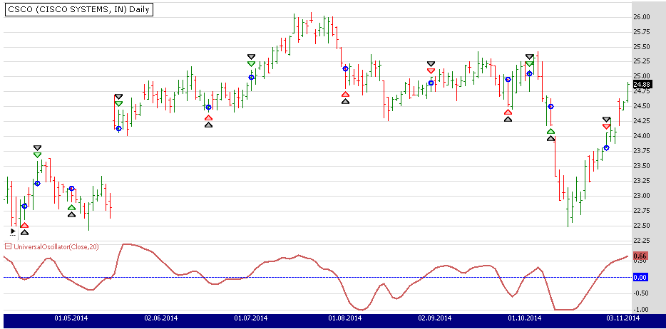
**FIGURE 3: WEALTH-LAB.** Here, a Wealth-Lab 6 chart illustrates application of the system's rules on a daily chart of Cisco Systems (CSCO).

```csharp
using System;
using System.Collections.Generic;
using System.Text;
using System.Drawing;
using WealthLab;
using WealthLab.Indicators;
using TASCIndicators;

namespace WealthLab.Strategies
{
	public class UniversalOscSARStrategy : WealthScript
	{
		StrategyParameter be;
		StrategyParameter mode;

		public UniversalOscSARStrategy()
		{
			be = CreateParameter("Band edge", 20, 5, 200, 5);
			mode = CreateParameter("Swing/Trend", 0, 0, 1, 1);
		}

		protected override void Execute()
		{
			bool swingTrade = mode.ValueInt == 0 ? true : false;
			int period = be.ValueInt;

			UniversalOscillator uo = UniversalOscillator.Series(Close,period );
			ChartPane uPane = CreatePane(30,false,true); HideVolume();
			PlotSeries(uPane,uo,Color.IndianRed,LineStyle.Solid,2);
			DrawHorzLine(uPane,0,Color.Blue,LineStyle.Dashed,1);

			for(int bar = GetTradingLoopStartBar(period); bar < Bars.Count; bar++)
			{
				bool uXo = CrossOver(bar, uo, 0);
				bool uXu = CrossUnder(bar, uo, 0);

				if( swingTrade )
				{
					if (Positions.Count == 0){
						if ( uXu )
							BuyAtMarket( bar + 1 );
						else if( uXo )
							ShortAtMarket( bar + 1 );
					}
					else
					{
						Position p = LastPosition;
						if ( p.PositionType == PositionType.Long )
						{
							if ( uXo )
							{
								SellAtMarket( bar + 1, p );
								ShortAtMarket( bar + 1 );
							}
						}
						else if ( uXu )
						{
							CoverAtMarket( bar + 1, p );
							BuyAtMarket( bar + 1 );
						}
					}
				}
				else
				{
					if (IsLastPositionActive)
					{
						if ( uXu )
							SellAtMarket( bar + 1, LastPosition );
					}
					else
					{
						if ( uXo )
							BuyAtMarket( bar + 1 );
					}
				}
			}
		}
	}
}
```

External code: [UO.cs](UO.cs)

--Eugene, Wealth-Lab team, MS123, LLC, www.wealth-lab.com

---

## AmiBroker: January 2015

In "Whiter Is Brighter" in this issue, author John Ehlers presents his universal oscillator, which is based on filtering two-day price momentum using a second-order infinite impulse response (IIR) filter.

The code for the universal oscillator as implemented in AmiBroker formula language (AFL) is shown here:

```afl
// John F. Ehlers' Universal Oscillator
// January 2015 S&C Traders' Tips
//
// AFL implementation - TJ
SetBarsRequired( 100 );

BandEdge = Param("BandEdge", 20, 2, 100, 1 );

WhiteNoise = ( Close - Ref( Close, -2 ) ) / 2;

// SuperSmoother filter
// note: in AFL angles are in radians
pi = 3.1415926;
r2 = sqrt( 2 );
a1 = exp( - r2 * pi / BandEdge );
b1 = 2 * a1 * cos( r2 * pi / BandEdge );
c2 = b1;
c3 = - a1 * a1;
c1 = 1 - c2 - c3;

pk = 0.0000001;
universal = 0;

input = Nz( WhiteNoise + Ref( WhiteNoise, -1 ) ) / 2;
Filt = input;

// IIR+AGC loop
for( i = 2; i < BarCount; i++ )
{
 Filt[ i ] = c1 * input[ i ]  +
             c2 * Filt[ i - 1 ] +
             c3 * Filt[ i - 2 ];

 pk = 0.991 * pk;

 af = abs( Filt[ i ] );

 if( af > pk ) pk = af;

 universal[ i ] = Filt[ i ] / pk;
}

Plot( universal, "Universal" + _PARAM_VALUES(), colorRed, styleThick );
Plot( 0, "", colorBlue, styleNoLabel );
```

External code: [UO.afl](UO.afl)

To use the oscillator, input the code into the formula editor and press apply indicator. A sample chart is shown in Figure 4.

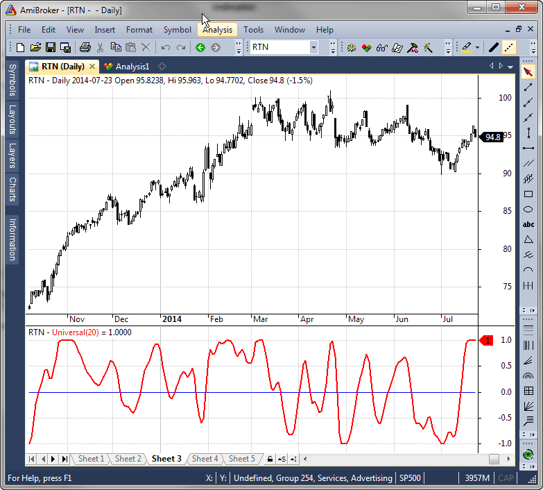
**FIGURE 4: AMIBROKER.** Here, a 20-day universal oscillator (bottom pane) is shown on a daily price chart of RTN, replicating the chart from John Ehlers' article in this issue.

--Tomasz Janeczko, AmiBroker.com, www.amibroker.com

---

## AIQ: January 2015

The AIQ code based on John Ehlers' article in this issue, "Whiter Is Brighter," is provided at www.TradersEdgeSystems.com/traderstips.htm. It is also shown below, for reference.

```eds
!WHITER IS BRIGHTER
!Author: John Ehlers, TASC Jan 2015
!Coded by: Richard Denning 11/11/2014
!www.TradersEdgeSystems.com

!Universal Oscillator
!(c) 2014 John F. Ehlers

!INPUTS:
BandEdge is 20.

!SuperSmoother Filter
WhiteNoise is ([Close] - val([Close],2)) / 2.
a1 is Exp(-1.414*3.14159 / BandEdge).
b1 is 2*a1*Cos((1.414*180) / BandEdge).
c2 is b1.
c3 is -a1*a1.
c1 is 1 - c2 - c3.

DaysInto is ReportDate() - RuleDate().
Stop if DaysInto > 10.
stopfilt is iff(stop,[close], filt).
Filt is c1*(WhiteNoise + valresult(WhiteNoise,1)) / 2
  + c2*valresult(stopfilt,1) + c3*valresult(stopfilt,2).
stopPeak is iff(stop,[close], peak).
Peak is 0.991*valresult(stopPeak,1).
 !Plot for Univeral Oscillator

Universal is (Filt / (max(Peak,abs(Filt))))*10.
```

External code: [UO.eds](UO.eds)

--Richard Denning, info@TradersEdgeSystems.com, for AIQ Systems

---

## TradersStudio: January 2015

The TradersStudio code based on John Ehlers' article in this issue, "Whiter Is Brighter," is provided at the following websites. The following code files are provided in the download:

```basic
'WHITER IS BRIGHTER
'Author: John Ehlers, TASC Jan 2015
'Coded by: Richard Denning 11/11/2014
'www.TradersEdgeSystems.com

'Universal Oscillator
'(c) 2014 John F. Ehlers
Function EHLERS_UNIVERSAL_OSC(BandEdge)
    Dim WhiteNoise As BarArray
    Dim a1
    Dim b1
    Dim c1
    Dim c2
    Dim c3
    Dim Filt As BarArray
    Dim Peak As BarArray
    Dim Universal

    If BarNumber=FirstBar Then
        WhiteNoise = 0
        a1 = 0
        b1 = 0
        c1 = 0
        c2 = 0
        c3 = 0
        Filt = 0
        Peak = 0
        Universal = 0
    End If

  'SuperSmoother Filter
    WhiteNoise = (Close - Close[2]) / 2
    a1 = Exp(-1.414*3.14159 / BandEdge)
    b1 = 2*a1*Cos(1.414*180 / BandEdge)
    c2 = b1
    c3 = -a1*a1
    c1 = 1 - c2 - c3
    Filt = c1*(WhiteNoise + WhiteNoise [1]) / 2 + c2*Filt[1] + c3*Filt[2]
    If CurrentBar - 1 = 1 Then
        Filt = 0
    End If
    If CurrentBar - 1 = 2 Then
        Filt = c1*0*(Close + Close[1])/2 + c2*Filt[1]
    End If
    If CurrentBar - 1 = 3 Then
        Filt = c1*0*(Close + Close[1])/2 + c2*Filt[1] + c3*Filt[2]
    End If
    Peak = .991*Peak[1]
    If CurrentBar - 1 = 1 Then
        Peak = .0000001
    End If
    If Abs(Filt) > Peak Then
        Peak = Abs(Filt)
    End If
    If Peak <> 0 Then
        Universal = Filt / Peak
    End If
EHLERS_UNIVERSAL_OSC = Universal
End Function
'--------------------------------------------------------------------------
' Indicator Plot:
Sub EHLERS_UNIVERSAL_OSC_IND(BandEdge)
plot1(EHLERS_UNIVERSAL_OSC(BandEdge))
plot2(0)
End Sub
'--------------------------------------------------------------------------
```

External code: [UO.trs](UO.trs)

In Figure 5, I show a chart of the full-sized S&P 500 futures contract (using data from Pinnacle Data Corp.) with the universal oscillator.

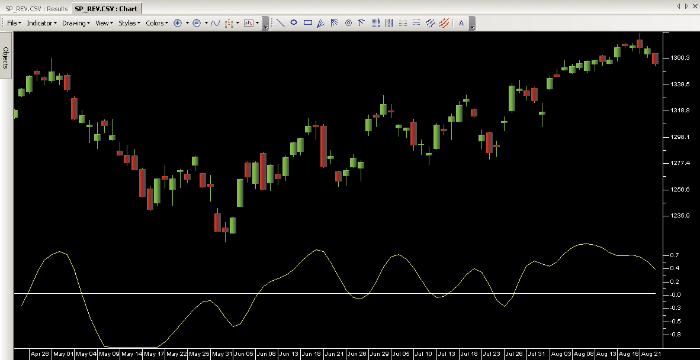
**FIGURE 5: TRADERSSTUDIO.** The universal oscillator is plotted on the S&P 500 futures.

--Richard Denning, info@TradersEdgeSystems.com, for TradersStudio

---

## NeuroShell Trader: January 2015

The universal oscillator introduced by John Ehlers in his article in this issue, "Whiter Is Brighter," can be implemented in NeuroShell Trader using NeuroShell Trader's ability to call external dynamic linked libraries. Dynamic linked libraries can be written in C, C++, Power Basic, or Delphi.

After moving the EasyLanguage code provided in Ehlers' article to your preferred compiler and creating a DLL, you can insert the resulting indicators. Dynamic trading systems can be easily created in NeuroShell Trader by combining the universal oscillator with NeuroShell Trader's genetic optimizer to find optimal lengths.

A sample chart is shown in Figure 6.

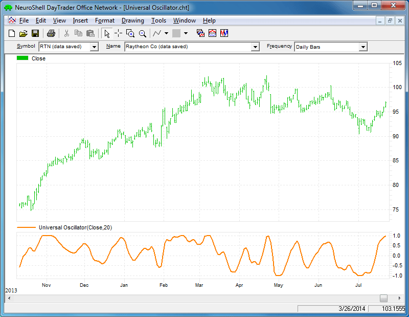
**FIGURE 6: NEUROSHELL TRADER.** This NeuroShell Trader chart displays the universal oscillator indicator.

Users of NeuroShell Trader can go to the STOCKS & COMMODITIES section of the NeuroShell Trader free technical support website to download a copy of this or any previous Traders' Tips.

--Marge Sherald, Ward Systems Group, Inc., 301 662-7950, sales@wardsystems.com, www.neuroshell.com

---

## NinjaTrader: January 2015

In "Whiter Is Brighter" in this issue, author John Ehlers introduces his universal oscillator. We're making the UniversalOsc indicator, based on his article, available for download at www.ninjatrader.com/SC/January2015SC.zip.

Once it has been downloaded, from within the NinjaTrader Control Center window, select the menu File > Utilities > Import NinjaScript and select the downloaded file. This file is for NinjaTrader version 7 or greater.

You can review the indicator source code by selecting the menu Tools > Edit NinjaScript > Indicator from within the NinjaTrader Control Center window and selecting the UniversalOsc file.

A sample chart implementing the strategy is shown in Figure 7.

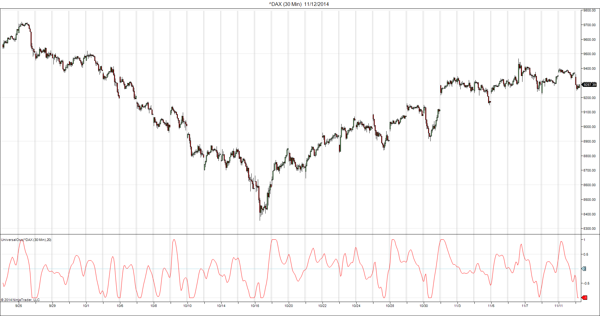
**FIGURE 7: NINJATRADER.** This screenshot shows the indicator applied to a 30-minute chart of the DAX index.

NinjaTrader source code: [ninja-trader/UniversalOsc.cs](ninja-trader/UniversalOsc.cs)

--Raymond Deux & Jesse Nelson, NinjaTrader, LLC, www.ninjatrader.com

---

## Updata: January 2015

Our Traders' Tip this month is based on John Ehlers' article in this issue, "Whiter Is Brighter." In it, Ehlers seeks to develop a zero-lag oscillator in order to generate signals on underlying market data that is said to display "pink noise" properties. This is distinct from white noise in that some memory is inherent in the data, and could form the basis of a short-term trading model.

The Updata code for this article is in the Updata Library and may be downloaded by clicking the custom menu and indicator library. Those who cannot access the library due to a firewall may paste the code shown below into the Updata custom editor and save it.

```basic
'Universal Oscillator
DISPLAYSTYLE 2LINES
INDICATORTYPE CHART
INDICATORTYPE2 TOOL
COLOUR2 RGB(200,0,0)
PARAMETER "Band Edge" @BANDEDGE=20
NAME Universal Oscillator
@WHITENOISE=0
@A1=0
@B1=0
@C1=0
@C2=0
@C3=0
@FILT=0
@PEAK=0
@UNIVERSAL=0
@ROOT2=0
@PI=0
FOR #CURDATE=2 TO #LASTDATE
   @ROOT2=EXPBASE(2,0.5)
   @PI=CONST_PI
   @WHITENOISE=(CLOSE-CLOSE(2))/2
   @A1=EXP(-@ROOT2*@PI/@BANDEDGE)
   @B1=2*@A1*COS(@ROOT2*@PI*0.5/@BANDEDGE)
   @C2=@B1
   @C3=-@A1*@A1
   @C1=1-@C2-@C3
   @FILT=@C1*0.5*(@WHITENOISE+HIST(@WHITENOISE,1))+@C2*HIST(@FILT,1)+@C3*HIST(@FILT,2)
   IF #CURDATE=2
      @FILT=0
   ELSEIF #CURDATE=3
      @FILT=@C2*HIST(@FILT,1)
   ELSEIF #CURDATE=4
      @FILT=@C2*HIST(@FILT,1)+@C3*HIST(@FILT,2)
   ENDIF
   'AUTOMATIC GAIN CONTROL (AGC)
   @PEAK=0.991*HIST(@PEAK,1)
   IF #CURDATE=2
      @PEAK=0.0000001
   ENDIF
   IF ABS(@FILT)>@PEAK
      @PEAK=ABS(@FILT)
   ENDIF
   IF @PEAK!=0
      @UNIVERSAL=@FILT/@PEAK
   ENDIF
   @PLOT=@UNIVERSAL
   @PLOT2=0
NEXT
```

External code: [UO.updata](UO.updata)

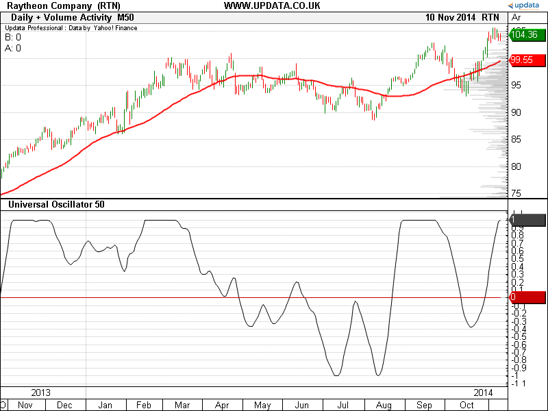
**FIGURE 8: UPDATA.** This chart shows the universal oscillator of band edge 50, as applied to Raytheon Company in daily resolution data.

--Updata support team, support@updata.co.uk, www.updata.co.uk

---

## VT Trader: January 2015

This Traders' Tip is based on "Whiter Is Brighter" in this issue by John Ehlers. We'll be offering the universal oscillator for download in our VT client forums at https://forum.vtsystems.com along with other precoded and free indicators and trading systems.

A sample chart implementation is shown in Figure 9.

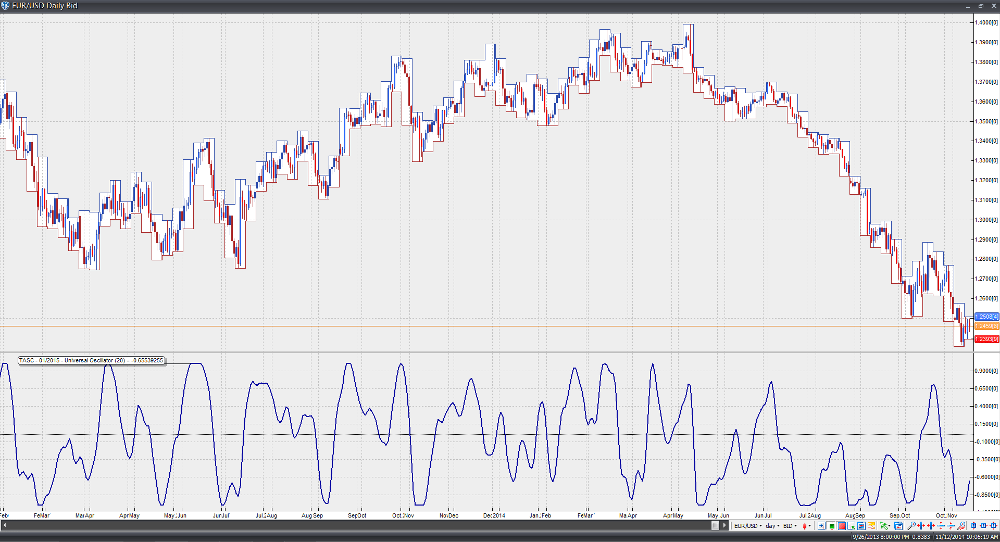
**FIGURE 9: VT TRADER.** Here, the universal oscillator is shown on a daily candle chart of EUR/USD.

--Visual Trading Systems, LLC, vttrader@vtsystems.com, www.vtsystems.com

---

## Microsoft Excel: January 2015

John Ehlers' white noise universal oscillator, introduced in his article in this issue ("Whiter Is Brighter"), is elegant in its computational simplicity. Four columns of Excel cell formulas do the job nicely.

And, even better, this oscillator is remarkable in my experience for its minimal (zero?) signal-to-response lag.

The chart in Figure 10 is my approximation of Figure 3 from Ehlers' article. Setting bandedge to 50 using the dates as shown here will replicate Figure 4 from Ehlers' article.

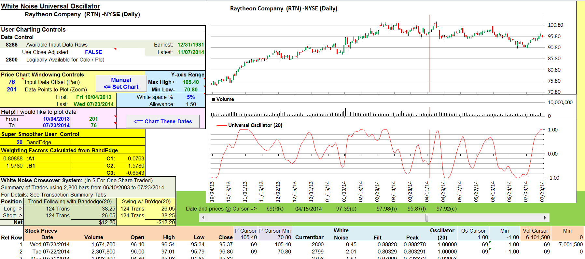
**FIGURE 10: EXCEL, BANDEDGE.** Here's an example price chart with bandedge set to the suggested swing trade value of 20.

You could also apply the concept to a countertrend trading strategy using the inverse of the rules proposed for a trend-following strategy. The results summarized in the lower left of Figure 10 reflect this inverse relationship and allow you to see how the two trading strategies fare side by side at any given bandedge setting.

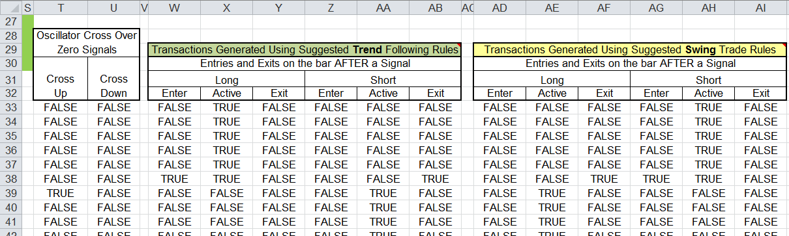
**FIGURE 11: EXCEL, LOGIC TABLES.** Trading logic tables are located just to the right of the charts.

Figure 11 shows the decision tables reflecting the two strategies using the current bandedge setting. Because this system is computed on bar close, these tables simulate trade execution on the bar following a buy or sell crossover signal.

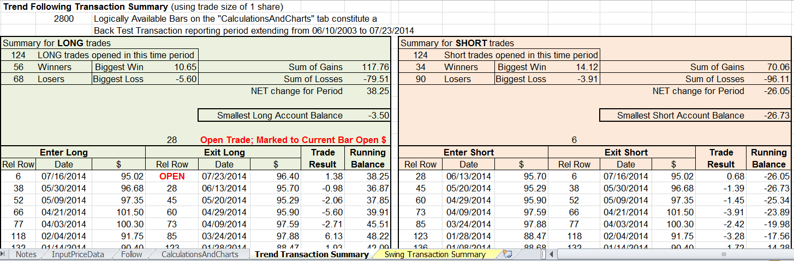
**FIGURE 12: EXCEL, TRANSACTION TABS.** Here's an example of the detailed transaction summary tabs.

The spreadsheet file for this Traders' Tip can be downloaded from the Traders' Tips area at Traders.com: [code/WhiteNoiseUniversalOscillator.xlsm](code/WhiteNoiseUniversalOscillator.xlsm)

--Ron McAllister, Excel and VBA programmer, rpmac_xltt@sprynet.com

---

## thinkorswim: January 2015

In "Whiter Is Brighter" by John Ehlers in this issue, Ehlers discusses eliminating the "noise" in the market to get a clearer picture of entry & exit points. From this we derived the UniversalOscillator strategy using our proprietary scripting language, thinkscript. To load the strategy into thinkorswim, simply click on the following link: https://tos.mx/zzhBRD and choose "Backtest in thinkorswim." Then choose to rename your study to "UniversalOscillatorStrategy." You can adjust the parameters within the edit studies window to fine tune your variables.

You can see from the chart in Figure 13 that the strategy on thinkorswim charts will give you entry points when the flag is beginning and when the point forms. You can also see that the peak of the pole is the indicator with the exit point.

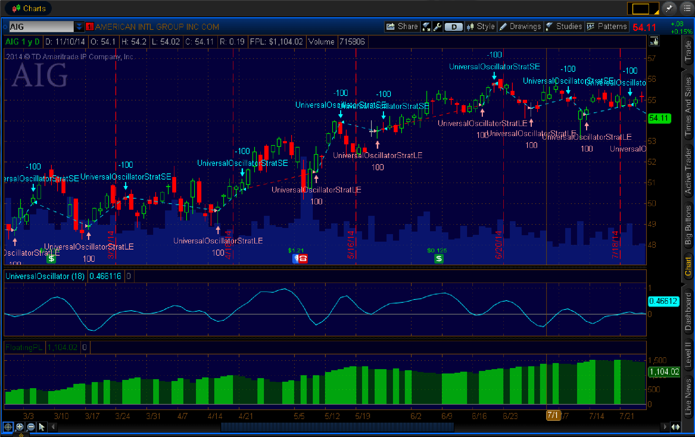
**FIGURE 13: THINKORSWIM.**

--thinkorswim, A division of TD Ameritrade, Inc., www.thinkorswim.com

---

## BibTeX

```bibtex
@misc{traders_tips_2015_01,
  author       = {{Technical Analysis of Stocks \& Commodities}},
  title        = {Traders' Tips: Whiter Is Brighter},
  howpublished = {online},
  year         = {2015},
  month        = jan,
  url          = {https://traders.com/Documentation/FEEDbk_docs/2015/01/TradersTips.html}
}
```
