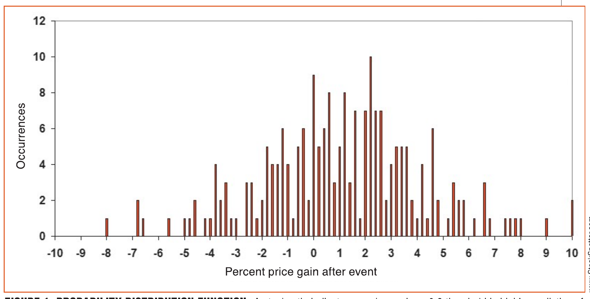
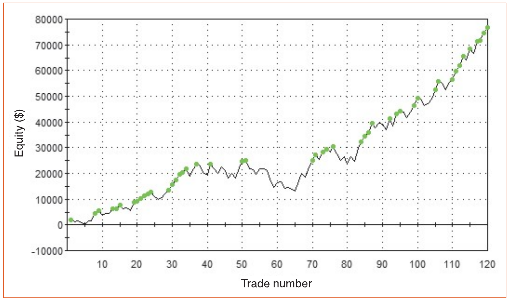

# Trading System Design: A Statistical Approach

**by John F. Ehlers and Ric Way**

Here's how to start with the basics and determine if an identifiable event has a statistical edge in predicting future prices---before you even start to build a trading system.

Many trading systems begin with indicators, and because of that, the question you should be asking is, "What do indicators indicate?" The correct answer is that most of the time, they don't indicate much. Indicators are just specialized filters.

## Visible Sieves

Some indicators, like the commodity channel index (CCI), relative strength index (RSI), and stochastic, are basically first-order high-pass filters that remove the longer wave components of the prices and display them as oscillators. Other indicators, like moving averages, are basically smoothing filters that remove the high-frequency components and aliasing noise. Of course, there are combinations of the two kinds of filters. The basic question still remains whether shaping the price data by filtering has any predictive power regarding future prices.

Other trading systems involve setups, such as, "Buy when the current close is below the close nine days ago and the last four closes have been consecutively lower and the high 27 days ago is higher than the current high by at least the square root of 1.618." Clearly, such a setup is heuristic and may or may not be true for future prices. Candlestick patterns and chart patterns also fall into the broad category of setups. The trick here, again, is to determine whether these setups have predictive power regarding future prices.

Still other trading systems attempt to predict the direction of future prices by correlation with other leading indicators. For example, every trader has heard that volume leads price. Such correlations would be nice if they were correct for long enough to make a trading system profitable.

The process of trading system design is very much like quantum mechanics, in that an entity is described by a probability density, and a future state can only be estimated statistically. In this article, we will show you how to start with some basics to see if an identifiable event has the statistical edge in predicting future prices before you even start to build a trading system. Once you identify a predictive event, then it is a simple matter to move on to designing a robust trading system. We will illustrate the entire process with an example.

## Price Predictors

The process of designing a trading system starts with measuring prices into the future from any identifiable event. Our own bias is that we have noted a more or less monthly cycle in most market data, particularly in index futures. It is comforting to note that this cycle activity is consistent with the fundamental observation that most companies have to make their numbers on a monthly basis. A monthly cycle implies a movement consisting of 10 days up and then 10 days down. With this consideration, we start with the presumption that we want to predict the prices 10 days into the future.

Since we are constrained to work with actual data, we shift the point of reference 10 days back in history as the point of occurrence of the event. In EasyLanguage, variables are stacked for reference in the code. For example, `Close - Close[9]` means the price increase over the last 10 days with reference to the closing prices. In sidebar "EasyLanguage Code To Test The Predictability Of An Event," you see how we measure the prediction from the time of the event.

The test code begins by expecting an event that happened 10 bars ago. This tester is general, and the event can be anything that is describable by computer code. The crossing of two moving averages is just one example. Given that an event has occurred, the percentage increase or decrease in prices over the next 10 bars is computed, ending with the current closing price. This percentage price, referenced to the closing price 10 bars back, is assigned to the variable FuturePrice. FuturePrice is limited to be between -10% and +10%. After limiting the range, FuturePrice is rescaled to vary from zero to 100 so that the FuturePrice can be contained in one of 100 bins. The plan is to accumulate the number of occurrences of a FuturePrice in each of the bins over the entire span of the price data series. We use 10 years of data to create a statistically meaningful sample size. At the end of the data, the number of occurrences in the bins creates a probability distribution function of the prices 10 bars into the future from the event.

We also provide a quick measure of the average percentage future price by measuring the center of gravity (CG) of the probability distribution function. If the probability distribution function outline were cut out of a piece of paper, the CG would be the place along the horizontal axis where the outline would balance. The general procedure of a function in X and Y coordinates is to sum the XY products and also sum all the Y values. The ratio of these sums gives the CG. Since the X dimension is centered at 50, the 50 is removed so that plotting the CG gives a sense of the zero profit point. The CG and ebb & flow are plotted below the barchart as successive events are encountered.

The probability distribution function can be viewed by charting it in Excel. We created a folder on our computer named `C:\PDFTest`. When the last bar on the chart is encountered, a text file named PDF.CSV is created in this folder. It is then a simple matter to view the probability distribution function by importing this file into Excel and plotting it as a vertical bar chart.

## Example

A specific example of testing an event for predictability will undoubtedly make the process clearer. In a previous article titled "Predictive Indicators" published in the January 2014 issue of Technical Analysis of STOCKS & COMMODITIES magazine, we demonstrated that a stochastic indicator could be the kernel of a successful trading system if the turning points were anticipated rather than waiting for confirmation. We will reinforce that assertion in our example.

Our example will create an event when the simple stochastic swings between zero and one. The turning point for a long entry occurs when the stochastic crosses under a threshold of 0.2, because crossing this threshold anticipates the price turning up. The complete code for the example is shown in the sidebar "Predictability Test Of A Stochastic Trading System."

The basic stochastic indicator is just the current closing price less the lowest closing price over the length of the indicator, normalized to the difference between the highest closing price and the lowest closing price over the length of the indicator. The event occurs when the stochastic 10 bars ago crosses under the 0.2 threshold.

When we applied this indicator to 10 years of the S&P futures continuous contract using a 10-bar long stochastic indicator, we found that the CG plotted to be 1.09% at the end of the 10-year period. This relatively high 10-year average profit leads us to examine the probability distribution of predicted prices. This probability distribution function is shown in Figure 1.


**Figure 1: Probability Distribution Function.** A stochastic indicator crossing under a 0.2 threshold is highly predictive of future prices.

Since the event of the stochastic crossing under a threshold is shown to be substantially predictive, we can now proceed to write a trading system that trims the performance by adjusting the length of the stochastic and the precise threshold level that works best, and by limiting losing trades with a stop-loss.

## Example Trading System

In the sidebar "A Simple Stochastic Trading System" you will find the complete EasyLanguage code for our example stochastic trading system. When we optimize performance over 10 years of the S&P futures continuous contract, we find that the best stochastic length is eight rather than 10. The threshold to be crossed is 0.3 rather than 0.2. The best length of trade is 14 rather than the 10 bars into the future used in the prediction test. We have also limited losing trades to be no more than 3.8%.

The equity growth over 10 years of our stochastic system is shown in Figure 2. Pretty impressive for a really simple system! And we dare say it's superior to most commercially available trading systems.


**Figure 2: Equity Growth.** Here you see the equity growth curve over 10 years for the stochastic system.

> Once you identify a predictive event, then it is a simple matter to move on to designing a robust trading system.

## Testing, Testing

We have outlined a procedure for the successful development of trading systems using a statistical approach. We have developed a code testbed that can assess whether the prices will statistically increase or decrease over 10 bars after an event. The event itself is completely general as long as it can be described in code. The event can show whether prices will go up (signaling long position trades) or whether prices will go down (signaling short position trades). Once a predictive event has been determined, it can then be written into a trading strategy, whose parameters can be trimmed to optimize performance.

The testbed can also be used to assess whether an event is robust across a number of stock or futures symbols. The testbed works on a basis of sample bars of data. Therefore, the testbed is equally applicable to any sample rate, including intraday data or even equitick bars.

---

*S&C Contributing Editor John Ehlers is a pioneer in the use of cycles and DSP techniques in technical analysis. He is president of MESA Software. MESASoftware.com offers the MESA Phasor Futures strategy. He is also the chief scientist for StockSpotter.com, which offers stock trading signals based on indicators and statistical techniques.*

*Ric Way is an independent software developer specializing in programming algorithmic trading signals in C#. He may be reached at ricway@live.com.*

---

The code given in this article is available at the Subscriber Area at our website, www.traders.com, in the Article Code area.

See our Traders' Tips section beginning on page 47 for commentary and implementation of John Ehlers' & Ric Way's technique in various technical analysis programs. Accompanying program code can be found in the Traders' Tips area at Traders.com.

## Code Listings

### EasyLanguage Code To Test The Predictability Of An Event

```easylanguage
Vars:
    Event(false),
    FuturePrice(0),
    I(0),
    CG(0),
    Denom(0);

Arrays:
    PredictBin[100](0);

{>>>>>>>>> Code for Event Goes Here <<<<<<<<<<}

If Event Then Begin
    FuturePrice = 100*(Close - Close[9]) / Close[9];  //Future is referenced to 10 bars back
    If FuturePrice < -10 Then FuturePrice = -10;       //Limits lower price to -10%
    If FuturePrice > 10 Then FuturePrice = 10;         //Limits higher price to +10%
    FuturePrice = 5*(FuturePrice + 10);                //Scale -10% to +10% to be 0 - 100
End;

//Place the FuturePrices into one of 100 bins
If FuturePrice <> FuturePrice[1] Then Begin
    For I = 1 to 100 Begin
        If FuturePrice > I - 1 and FuturePrice <= I Then PredictBin[I] = PredictBin[I] + 1;
    End;
End;

//Measure center of gravity as a quick estimate
CG = 0;
Denom = 0;
For I = 1 to 100 Begin
    CG = CG + I*PredictBin[I];
    Denom = Denom + PredictBin[I];
End;
CG = (CG/Denom - 50)/5;

Plot1(CG);

If LastBarOnChart Then Begin
    For I = 0 to 100 Begin
        Print(File("C:\PDFTest\PDF.CSV"), .2*I - 10, ",", PredictBin[I]);
    End;
End;
```

### Predictability Test Of A Stochastic Trading System

```easylanguage
Vars:
    Event(false),
    FuturePrice(0),
    I(0),
    CG(0),
    Denom(0);

Arrays:
    PredictBin[100](0);

{>>>>>>>>> Start Event Code}
Inputs:
    StocLength(10);

Vars:
    HiC(0),
    LoC(0),
    Stoc(0);

HiC = Highest(Close, StocLength);
LoC = Lowest(Close, StocLength);
Stoc = (Close - LoC) / (HiC - LoC);

If Stoc[9] Crosses Under 0.2 Then Event = true Else Event = false;
{<<<<<<<<<< End Event Code}

If Event Then Begin
    FuturePrice = 100*(Close - Close[9]) / Close[9];  //Future is referenced to 10 bars back
    If FuturePrice < -10 Then FuturePrice = -10;       //Limits lower price to -10%
    If FuturePrice > 10 Then FuturePrice = 10;         //Limits higher price to +10%
    FuturePrice = 5*(FuturePrice + 10);                //Scale -10% to +10% to be 0 - 100
End;

//Place the FuturePrices into one of 100 bins
If FuturePrice <> FuturePrice[1] Then Begin
    For I = 1 to 100 Begin
        If FuturePrice > I - 1 and FuturePrice <= I Then PredictBin[I] = PredictBin[I] + 1;
    End;
End;

//Measure Center of Gravity as a quick estimate
CG = 0;
Denom = 0;
For I = 1 to 100 Begin
    CG = CG + I*PredictBin[I];
    Denom = Denom + PredictBin[I];
End;
CG = (CG/Denom - 50)/5;

Plot1(CG);

If LastBarOnChart Then Begin
    For I = 0 to 100 Begin
        Print(File("C:\PDFTest\PDF.CSV"), .2*I - 10, ",", PredictBin[I]);
    End;
End;
```

### A Simple Stochastic Trading System

```easylanguage
Inputs:
    StocLength(8),
    Threshold(.3),
    TradeLength(14),
    PctLoss(3.8);

Vars:
    HiC(0),
    LoC(0),
    Stoc(0);

HiC = Highest(Close, StocLength);
LoC = Lowest(Close, StocLength);
Stoc = (Close - LoC) / (HiC - LoC);

If Stoc Crosses Under Threshold Then Buy Next Bar on Open;
If BarsSinceEntry >= TradeLength Then Sell Next Bar on Open;
If Low < EntryPrice*(1 - PctLoss/100) Then Sell Next Bar on Open;
```

## Further Reading

Ehlers, John [2014]. "Predictive Indicators," *Technical Analysis of Stocks & Commodities*, Volume 32: January.

## References

```bibtex
@article{ehlers2015statistical,
  author    = {Ehlers, John F. and Way, Ric},
  title     = {Trading System Design: A Statistical Approach},
  journal   = {Technical Analysis of Stocks \& Commodities},
  volume    = {33},
  number    = {3},
  pages     = {28--31},
  year      = {2015},
  month     = mar,
  url       = {https://technical.traders.com/archive/article.asp?file=\V33\C03\945EHLE.pdf}
}

@misc{ehlers2015statistical_tips,
  author    = {{Traders' Tips}},
  title     = {Traders' Tips: Trading System Design: A Statistical Approach},
  year      = {2015},
  month     = mar,
  url       = {https://www.traders.com/Documentation/FEEDbk_docs/2015/03/TradersTips.html},
  note      = {Commentary and implementation in various technical analysis programs}
}
```
